# Smart Contract Flows

This guide explains the main interaction patterns for the LP Vaults contracts using sequence diagrams. It covers four areas:

1. [Vault Lifecycle](#1-vault-lifecycle) — creation through wind-down, shown as a continuous example
2. [Transactional Flows](#2-transactional-flows) — depositing USDC, managing positions, collecting fees
3. [Emergency Procedures](#3-emergency-procedures) — emergency cancel and pause/unpause
4. [Admin & Governance](#4-admin--governance) — role management and implementation upgrades

**Actors used throughout:**

| Symbol | Role | Description |
|--------|------|-------------|
| `Admin` | Admin | Registry-only authority — manages roles, pauses, schedules upgrades |
| `Oracle` | Oracle | Lifecycle authority — creates vaults, triggers wind-down |
| `Operator` | Operator | Transactional authority — credits positions, distributes fees, updates tick |
| `LP` | LP | Liquidity provider — owns positions, collects fees, can reclaim deposits |
| `Factory` | LPVaultFactory | Deploys vault clones and holds the role registry |
| `Vault` | LPVault (clone) | Per-market vault instance |

---

## 1. Vault Lifecycle

A vault lives through three phases: **Active** (minting and trading), **WindDown** (no new positions, exits still open), and **Cancelled** (terminal — all funds distributed).

### Phase State Machine

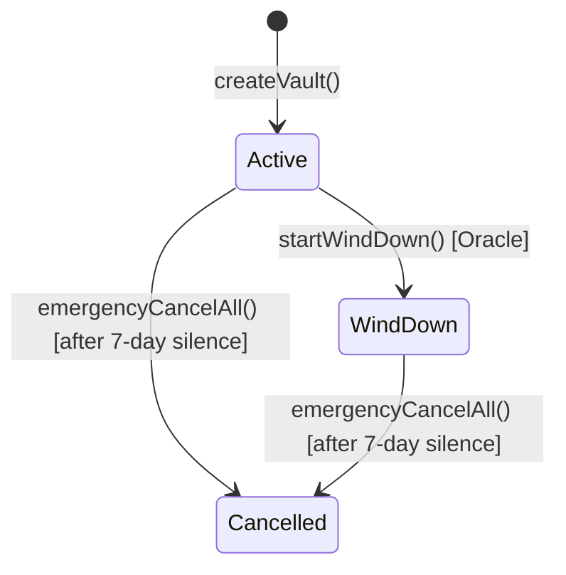

### Full Lifecycle Example

The sequence below follows a single market vault from factory deployment through market resolution. It uses every lifecycle method so you can see how they chain together.

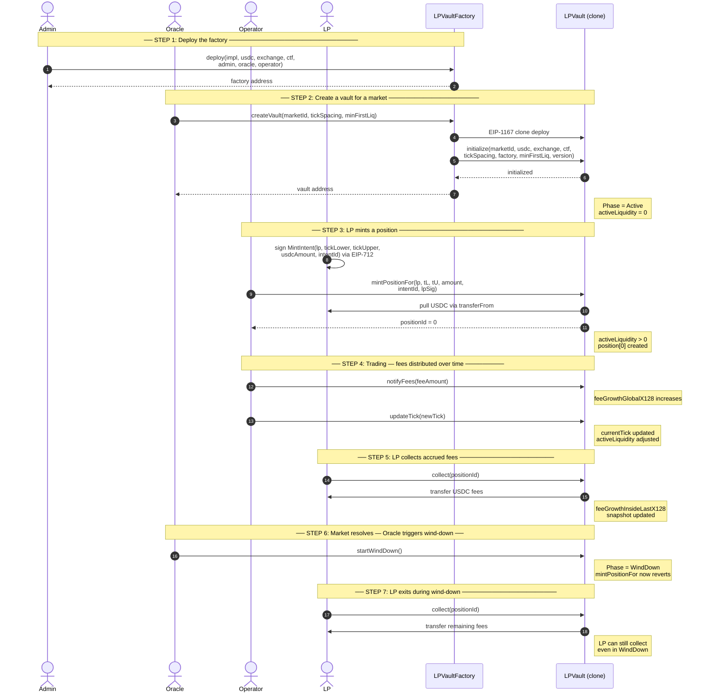

**Key invariants during the lifecycle:**
- `activeLiquidity == 0` until the first mint. The `minFirstLiq` floor prevents inflation attacks on this first mint.
- `notifyFees` reverts if `activeLiquidity == 0` — fees cannot be distributed into the void.
- After `startWindDown()`, only exit paths remain open: `collect`, `reclaimDeposit`, and `emergencyCancelAll`.
- `Oracle` and `Operator` **must** be different wallets — the constructor enforces this.

---

## 2. Transactional Flows

These are the day-to-day operations that happen repeatedly during the Active (and WindDown) phases.

### 2.1 Mint a Position (`mintPositionFor`)

The Operator credits an LP's signed intent to create a concentrated-liquidity position. The LP signs off-chain; the Operator submits on-chain.

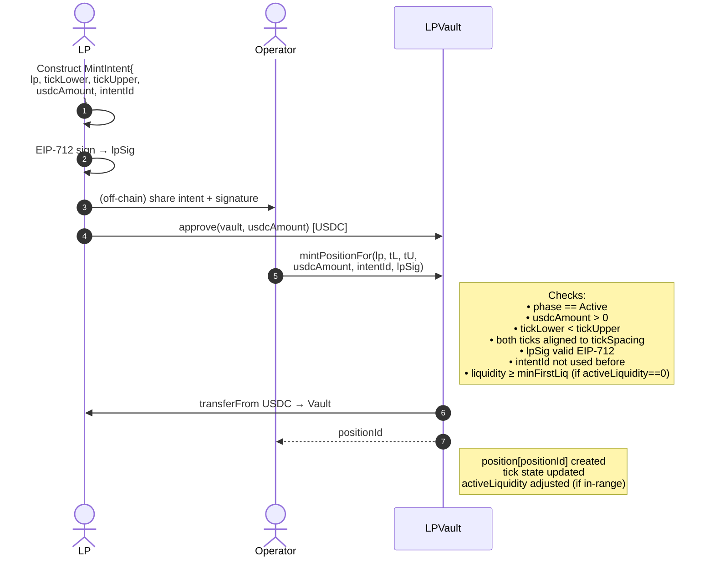

**When to call:** After the LP has deposited USDC off-chain and signed their intent. The Operator submits on-chain to credit the position.

---

### 2.2 Notify Fees (`notifyFees`)

Distributes trading fee revenue across all in-range LPs proportionally to their liquidity.

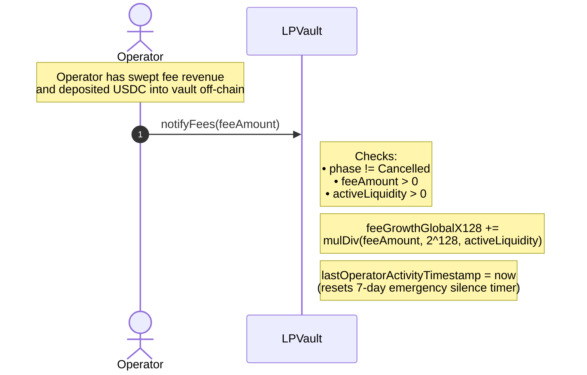

**When to call:** After the Operator sweeps trading fees from the exchange and deposits the corresponding USDC into the vault. The contract does not verify the USDC balance — the Operator is trusted to have funded the vault before calling.

**Why `activeLiquidity > 0` matters:** Distributing fees with zero active liquidity would lock USDC permanently with no LP able to claim. The revert prevents this.

---

### 2.3 Update Tick (`updateTick`)

Synchronises the vault's price tick with the off-chain CLOB mid-price, crossing tick boundaries to adjust `activeLiquidity` and flip per-tick fee accumulators.

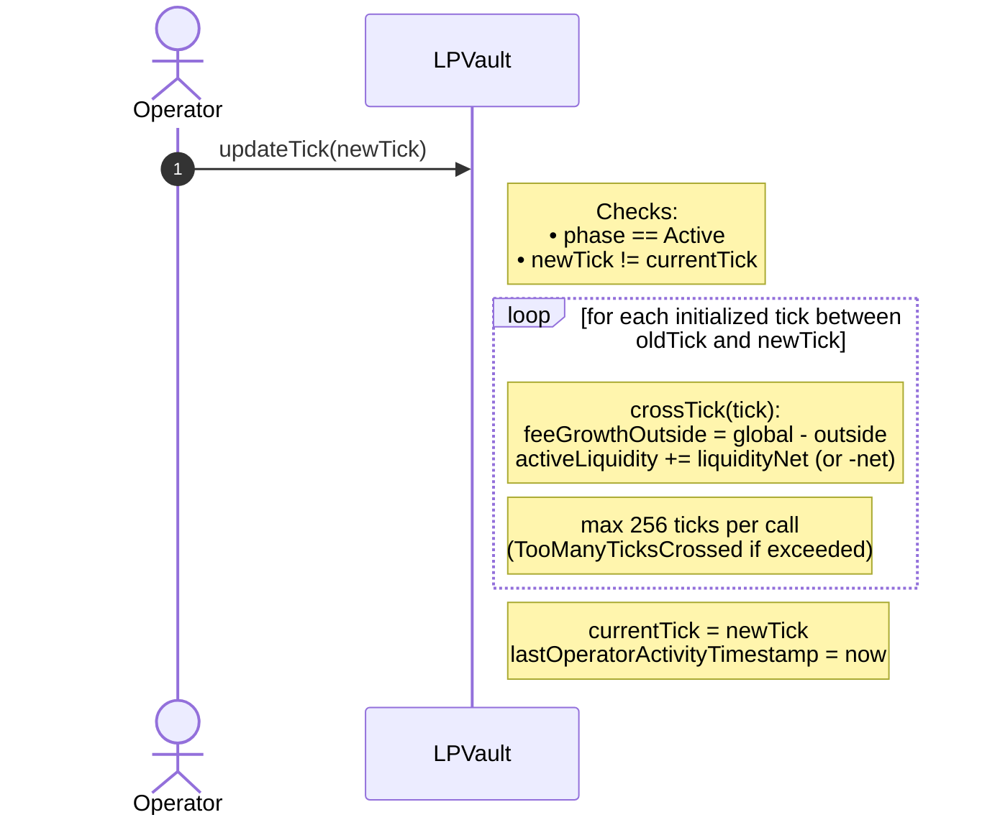

**When to call:** Whenever the CLOB mid-price moves enough to cross one or more initialized ticks. The Keeper bot (holding an Operator key) calls this continuously.

**Chunking:** If the price has moved more than 256 initialized ticks, the Operator must call `updateTick` multiple times, landing on intermediate ticks to process the full range.

---

### 2.4 Collect Fees (`collect`)

An LP withdraws their accrued trading fees from a position without removing the position itself.

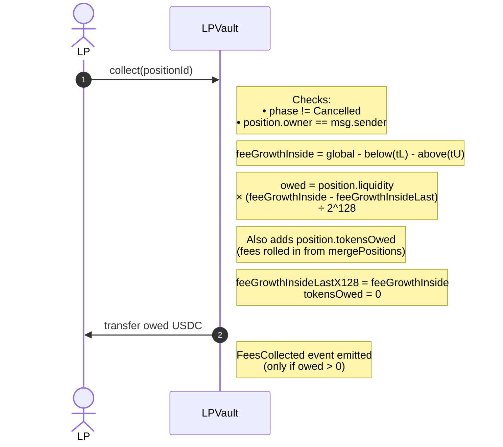

**When to call:** Any time the LP wants to collect accrued fees. Works in both Active and WindDown phases. `feeGrowthInsideLastX128` is updated each call so subsequent collects only pay fees that accrued since the last collection.

---

### 2.5 Merge Positions (`mergePositions`)

Operator housekeeping: combines two or more same-range same-owner positions into one, preserving total liquidity and rolling up uncollected fees.

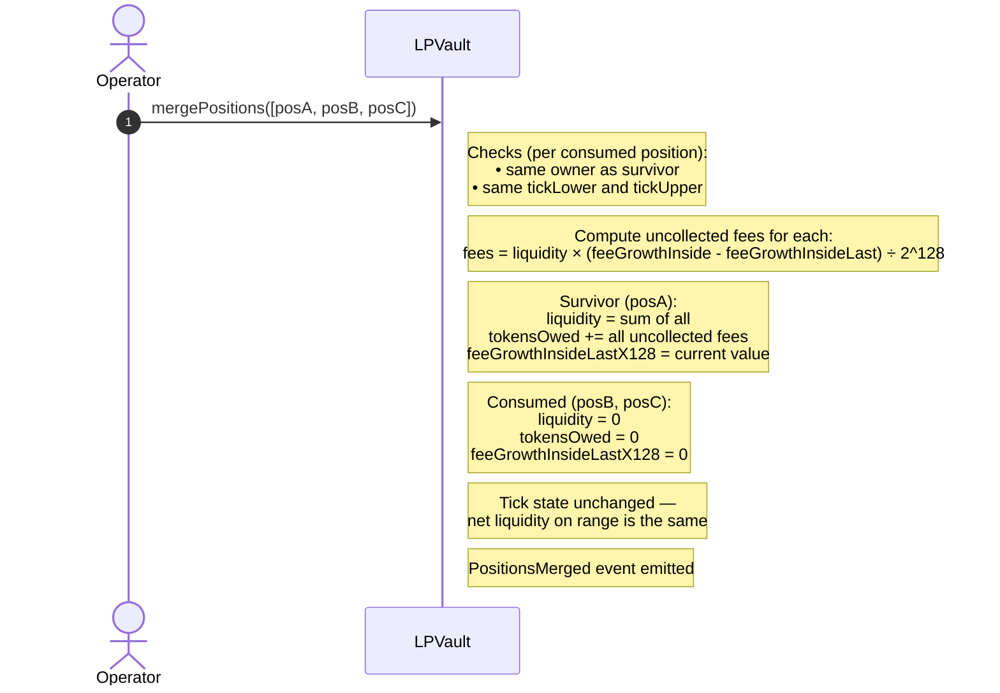

**When to call:** When an LP has accumulated multiple positions on the same range (common after repeated `mintPositionFor` calls). Merging reduces storage and gas for future operations.

---

### 2.6 Reclaim Deposit (`reclaimDeposit`)

Two-phase escape hatch for an LP whose `mintPositionFor` was never fulfilled by the Operator. The LP can reclaim their USDC after a 24-hour timelock.

```mermaid
sequenceDiagram
    autonumber
    actor LP
    actor Operator
    participant Vault as LPVault

    Note over LP,Operator: LP deposited USDC off-chain; Operator hasn't called mintPositionFor

    Note over LP: LP signs MintIntent (lpSig)
    Note over Operator: Operator signs same MintIntent (operatorSig) as deposit acknowledgement

    Note over LP,Vault: Phase 1: Submit reclaim
    LP->>Vault: reclaimDeposit(lp, tL, tU, amount, intentId, lpSig, operatorSig)
    Note right of Vault: Checks:<br/>phase != Cancelled<br/>msg.sender == lp<br/>lpSig valid EIP-712<br/>operatorSig from a registered Operator<br/>intentId not already used
    Note right of Vault: intentTimestamps[intentId] = block.timestamp
    Note right of Vault: ReclaimSubmitted event emitted

    Note over LP,Vault: Wait 24 hours

    Note over LP,Vault: Phase 2: Execute reclaim (after 24h)
    LP->>Vault: reclaimDeposit(lp, tL, tU, amount, intentId, lpSig, operatorSig)
    Note right of Vault: Checks:<br/>block.timestamp - intentTimestamps >= 24h
    Note right of Vault: usedIntents[intentId] = true
    Vault->>LP: transfer usdcAmount USDC
    Note right of Vault: DepositReclaimed event emitted
```

**When to call:** When an LP's deposit has gone unserviced by the Operator for too long. Phase 1 starts the timelock; Phase 2 (same function, same arguments) executes after 24 hours.

---

## 3. Emergency Procedures

### 3.1 Emergency Cancel All (`emergencyCancelAll`)

Any position holder can force-close all positions and distribute funds after 7 days of Operator silence. This is the last resort when the Operator is unresponsive.

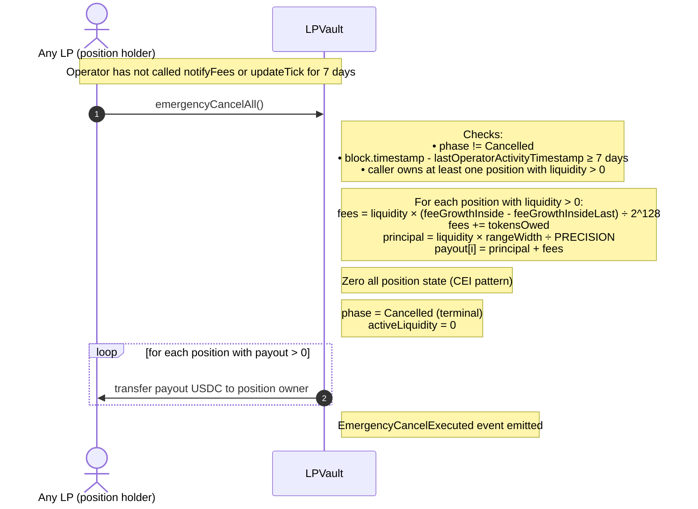

**When to call:** After 7 days without any `notifyFees` or `updateTick` call from the Operator. The triggering LP does not need to be the admin — any active position holder can call it.

**Why CEI (checks-effects-interactions):** All position state is zeroed and the phase flipped to Cancelled **before** the USDC transfer loop. This prevents reentrancy even if USDC were a malicious token.

---

### 3.2 Pause and Unpause Trading

Admin can halt all trading entry points instantly as a circuit breaker. LP exit paths remain open so capital is never trapped.

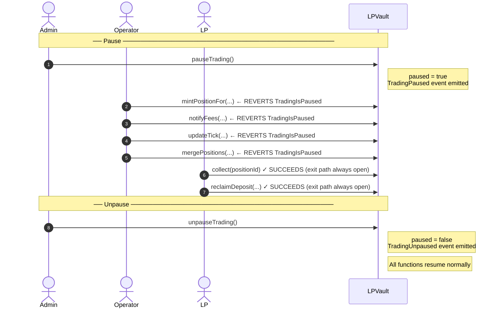

**When to pause:** A bug is discovered, a market anomaly is detected, or an emergency audit is needed. Pause is immediate and does not affect the vault's phase state machine.

**Pause vs. emergencyCancelAll:** Pause is reversible and keeps positions intact. Emergency cancel is irreversible and distributes all funds.

---

## 4. Admin & Governance

### 4.1 Role Management

All role changes happen on the **factory** and immediately propagate to every vault it deployed (vaults read role state from the factory at call time).

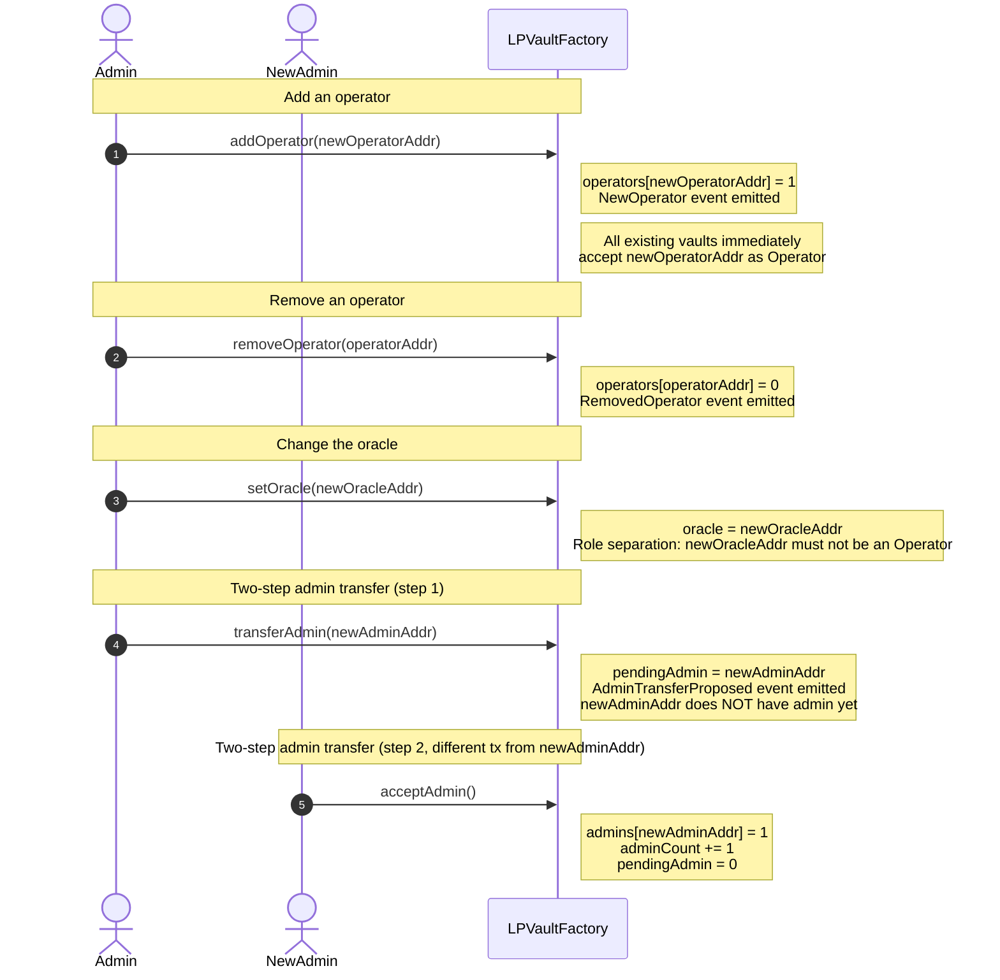

**Key constraint:** `oracle` and every `operator` address must be distinct wallets. `setOracle` reverts if the new oracle is an existing operator, and `addOperator` reverts if the new operator is the current oracle.

---

### 4.2 Upgradeable Implementation Pointer

The factory's `implementation` address (the EIP-1167 clone target for new vaults) can be rotated via a two-step 7-day timelock. Existing vaults are unaffected — EIP-1167 bakes the implementation address into each clone's bytecode at deploy time.

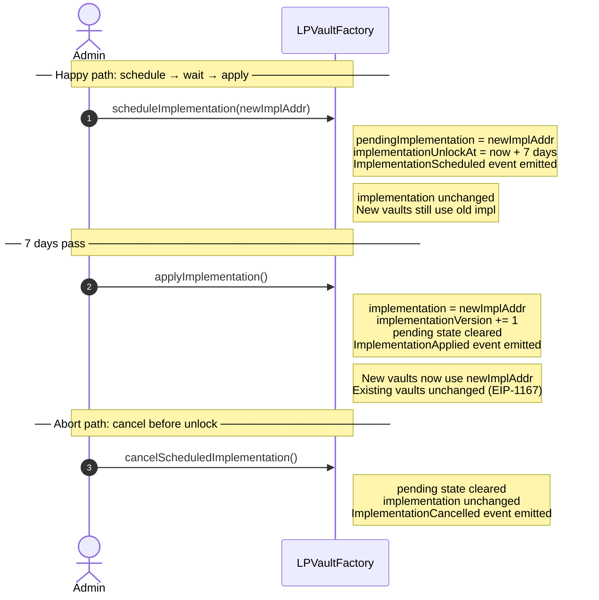

**`implementationVersion`** is stored per clone at `initialize()` time. Off-chain systems can call `vault.implementationVersion()` to know which code version a vault is running.

**Guards:**
- `scheduleImplementation(address(0))` reverts — prevents bricking the factory.
- Calling `applyImplementation()` before the timelock elapses reverts with `TimelockNotElapsed`.
- A second `scheduleImplementation` while one is already pending reverts with `ScheduleAlreadyPending` — cancel first if you want to change the scheduled address.

---

## Summary: Who Can Call What

| Function | Actor | Phase | Notes |
|----------|-------|-------|-------|
| `createVault` | Oracle | — | On factory |
| `startWindDown` | Oracle | Active | One-way; enables exit-only |
| `mintPositionFor` | Operator | Active | Not paused |
| `notifyFees` | Operator | Active / WindDown | Not paused; activeLiquidity > 0 |
| `updateTick` | Operator | Active | Not paused; max 256 ticks |
| `mergePositions` | Operator | Active / WindDown | Not paused |
| `collect` | LP (owner) | Active / WindDown | Always open; works while paused |
| `reclaimDeposit` | LP (owner) | Active / WindDown | Always open; works while paused |
| `emergencyCancelAll` | Any position holder | Active / WindDown | After 7-day silence |
| `pauseTrading` | Admin | Any | On vault |
| `unpauseTrading` | Admin | Any | On vault |
| `addOperator` / `removeOperator` | Admin | — | On factory |
| `setOracle` | Admin | — | On factory |
| `transferAdmin` / `acceptAdmin` | Admin / pending | — | On factory |
| `scheduleImplementation` | Admin | — | On factory |
| `applyImplementation` | Admin | — | On factory; after 7-day timelock |
| `cancelScheduledImplementation` | Admin | — | On factory |
