# Smart Contract Flows

This guide explains the main interaction patterns for the LP Vaults contracts using sequence diagrams. It covers four areas:

1. [Vault Lifecycle](#1-vault-lifecycle) — creation through wind-down, shown as a continuous example
2. [Transactional Flows](#2-transactional-flows) — depositing USDC, managing positions, collecting fees, exiting, merging pairs
3. [Emergency Procedures](#3-emergency-procedures) — emergency cancel and pause/unpause
4. [Admin & Governance](#4-admin--governance) — role management and implementation upgrades

**Actors used throughout:**

| Symbol | Role | Description |
|--------|------|-------------|
| `Admin` | Admin | Registry-only authority — manages roles, pauses, schedules upgrades |
| `Oracle` | Oracle | Lifecycle authority — creates vaults, sets a vault's first-mint floor (`setMinimumFirstLiquidity`), triggers wind-down, redeems outcome tokens after resolution (`redeemOutcomeTokens`) |
| `Operator` | Operator | Transactional authority — credits positions, distributes fees, updates tick |
| `LP` | LP | Liquidity provider — a Safe that owns positions, collects fees, burns positions, and reclaims deposits, itself or through the owner key's signed intents that the Operator relays |
| `Factory` | LPVaultFactory | Deploys vault clones and holds the role registry |
| `Vault` | LPVault (clone) | Per-market vault instance |

---

## 1. Vault Lifecycle

A vault lives through three phases: **Active** (minting and trading), **WindDown** (no new positions, exits still open), and **Cancelled** (terminal — trading stops, every exit and the complete-set merge stay open).

### Phase State Machine

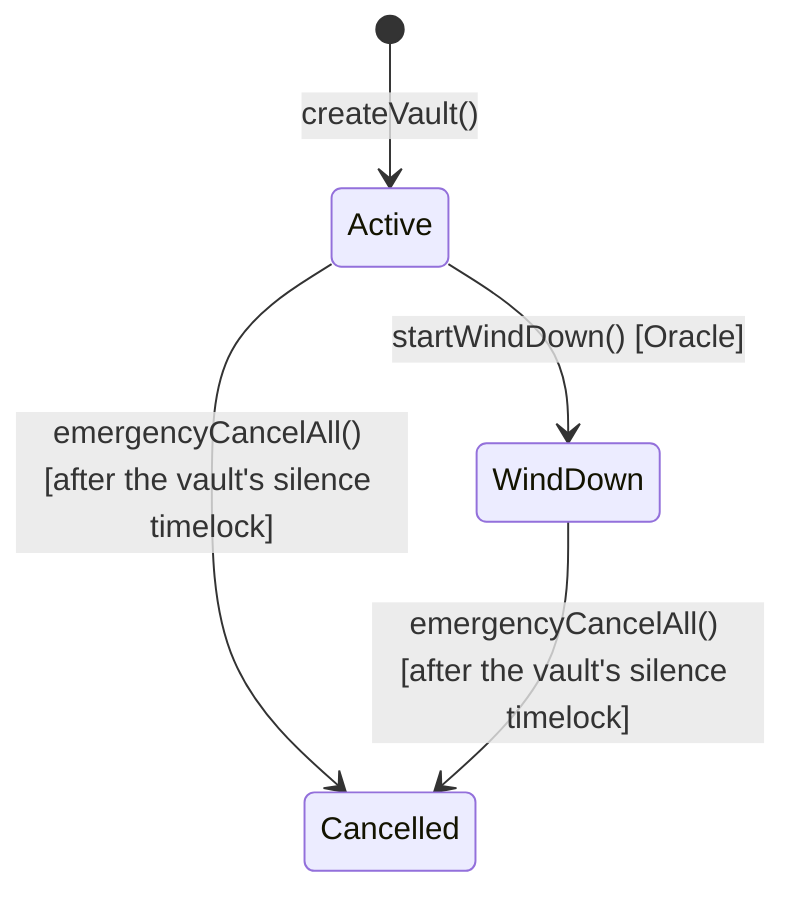
```mermaid
stateDiagram-v2
    [*] --> Active : createVault()
    Active --> WindDown : startWindDown() [Oracle]
    Active --> Cancelled : emergencyCancelAll() [after the vault's silence timelock]
    WindDown --> Cancelled : emergencyCancelAll() [after the vault's silence timelock]
```

### Full Lifecycle Example

The sequence below follows a single market vault from factory deployment through market resolution. It uses every lifecycle method so you can see how they chain together.

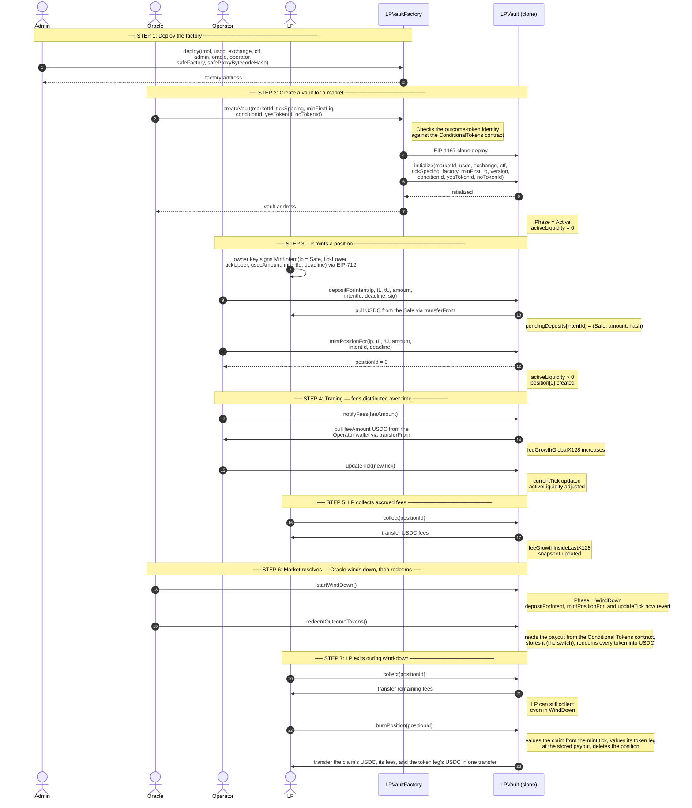
```mermaid
sequenceDiagram
    autonumber
    actor Admin
    actor Oracle
    actor Operator
    actor LP
    participant Factory as LPVaultFactory
    participant Vault as LPVault (clone)

    Note over Admin,Factory: ── STEP 1: Deploy the factory ──────────────────────────────
    Admin->>Factory: deploy(impl, usdc, exchange, ctf,<br/>admin, oracle, operator,<br/>safeFactory, safeProxyBytecodeHash)
    Factory-->>Admin: factory address

    Note over Oracle,Vault: ── STEP 2: Create a vault for a market ─────────────────────
    Oracle->>Factory: createVault(marketId, tickSpacing, minFirstLiq,<br/>conditionId, yesTokenId, noTokenId)
    Note right of Factory: Checks the outcome-token identity<br/>against the ConditionalTokens contract
    Factory->>Vault: EIP-1167 clone deploy
    Factory->>Vault: initialize(marketId, usdc, exchange, ctf,<br/>tickSpacing, factory, minFirstLiq, version,<br/>conditionId, yesTokenId, noTokenId)
    Vault-->>Factory: initialized
    Factory-->>Oracle: vault address
    Note right of Vault: Phase = Active<br/>activeLiquidity = 0

    Note over Operator,Vault: ── STEP 3: LP mints a position ─────────────────────────────
    LP->>LP: owner key signs MintIntent(lp = Safe, tickLower,<br/>tickUpper, usdcAmount, intentId, deadline) via EIP-712
    Operator->>Vault: depositForIntent(lp, tL, tU, amount,<br/>intentId, deadline, sig)
    Vault->>LP: pull USDC from the Safe via transferFrom
    Note right of Vault: pendingDeposits[intentId] = (Safe, amount, hash)
    Operator->>Vault: mintPositionFor(lp, tL, tU, amount,<br/>intentId, deadline)
    Vault-->>Operator: positionId = 0
    Note right of Vault: activeLiquidity > 0<br/>position[0] created

    Note over Operator,Vault: ── STEP 4: Trading — fees distributed over time ─────────
    Operator->>Vault: notifyFees(feeAmount)
    Vault->>Operator: pull feeAmount USDC from the<br/>Operator wallet via transferFrom
    Note right of Vault: feeGrowthGlobalX128 increases
    Operator->>Vault: updateTick(newTick)
    Note right of Vault: currentTick updated<br/>activeLiquidity adjusted

    Note over LP,Vault: ── STEP 5: LP collects accrued fees ──────────────────────
    LP->>Vault: collect(positionId)
    Vault->>LP: transfer USDC fees
    Note right of Vault: feeGrowthInsideLastX128<br/>snapshot updated

    Note over Oracle,Vault: ── STEP 6: Market resolves — Oracle winds down, then redeems ──
    Oracle->>Vault: startWindDown()
    Note right of Vault: Phase = WindDown<br/>depositForIntent, mintPositionFor, and updateTick now revert
    Oracle->>Vault: redeemOutcomeTokens()
    Note right of Vault: reads the payout from the Conditional Tokens contract,<br/>stores it (the switch), redeems every token into USDC

    Note over LP,Vault: ── STEP 7: LP exits during wind-down ──────────────────────
    LP->>Vault: collect(positionId)
    Vault->>LP: transfer remaining fees
    Note right of Vault: LP can still collect<br/>even in WindDown
    LP->>Vault: burnPosition(positionId)
    Note right of Vault: values the claim from the mint tick, values its token leg<br/>at the stored payout, deletes the position
    Vault->>LP: transfer the claim's USDC, its fees, and the token leg's USDC in one transfer
```

**Key invariants during the lifecycle:**
- `nextPositionId == 0` until the first mint. The `minFirstLiq` floor applies to that one mint and prevents inflation attacks on it. `activeLiquidity` can return to zero later without re-applying the floor.
- `notifyFees` reverts if `activeLiquidity == 0` — fees cannot be distributed into the void.
- After `startWindDown()`, only exit paths remain open: `collect`, `collectFor`, `burnPosition`, `burnPositionFor`, `reclaimDeposit`, `reclaimDepositFor`, `mergeCompleteSets`, `redeemOutcomeTokens`, and `emergencyCancelAll`.
- The Oracle's first successful `redeemOutcomeTokens` is the switch: before it a burn pays the band's token in kind, after it every burn and collect pays USDC only, at one ratio that values the token totals at the stored payout.
- One tick is one basis point, and every position range lies inside [0, 10000]. A burn values the claim from the tick where the position was minted (decision C26).
- `Oracle` and `Operator` **must** be different wallets — the constructor enforces this.

---

## 2. Transactional Flows

These are the day-to-day operations that happen repeatedly during the Active (and WindDown) phases.

### 2.1 Escrow and Mint a Position (`depositForIntent`, `mintPositionFor`)

The Operator escrows an LP's USDC from the LP's Safe against a signed intent, then mints the position from that escrow. The LP's owner key signs off-chain; the Operator submits both calls on-chain. The mint verifies no signature and moves no USDC.

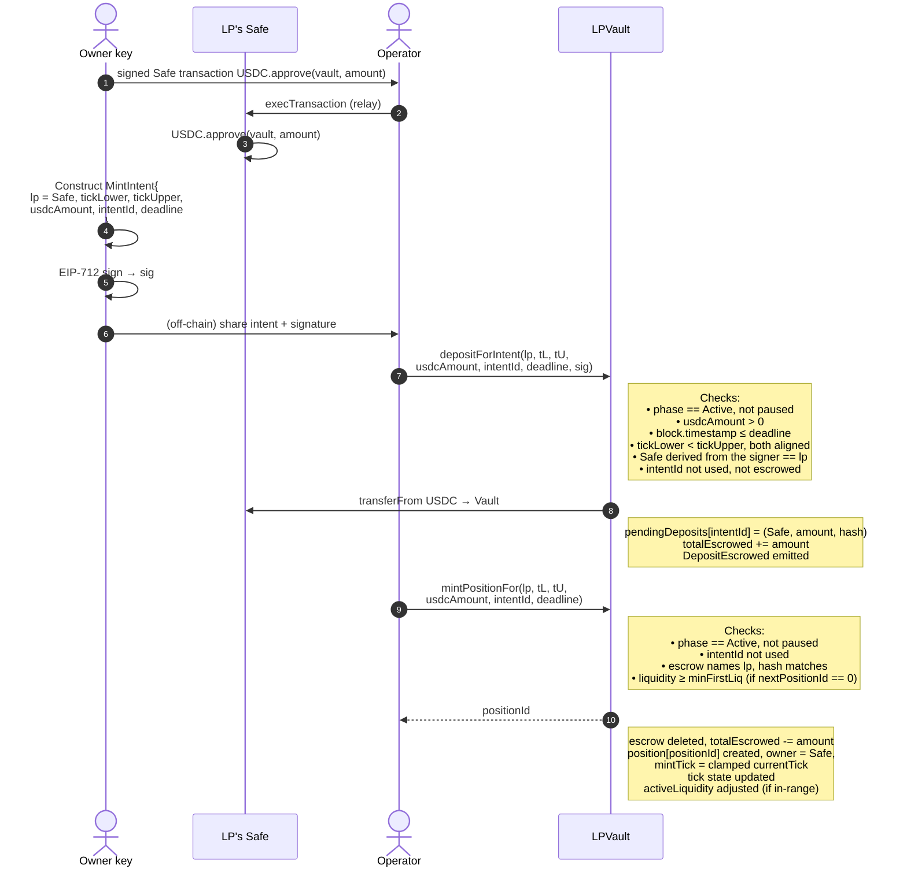
```mermaid
sequenceDiagram
    autonumber
    actor OwnerKey as Owner key
    participant Safe as LP's Safe
    actor Operator
    participant Vault as LPVault

    OwnerKey->>Operator: signed Safe transaction USDC.approve(vault, amount)
    Operator->>Safe: execTransaction (relay)
    Safe->>Safe: USDC.approve(vault, amount)

    OwnerKey->>OwnerKey: Construct MintIntent{<br/>  lp = Safe, tickLower, tickUpper,<br/>  usdcAmount, intentId, deadline<br/>}
    OwnerKey->>OwnerKey: EIP-712 sign → sig
    OwnerKey->>Operator: (off-chain) share intent + signature

    Operator->>Vault: depositForIntent(lp, tL, tU,<br/>usdcAmount, intentId, deadline, sig)
    Note right of Vault: Checks:<br/>• phase == Active, not paused<br/>• usdcAmount > 0<br/>• block.timestamp ≤ deadline<br/>• tickLower < tickUpper, both aligned<br/>• Safe derived from the signer == lp<br/>• intentId not used, not escrowed
    Vault->>Safe: transferFrom USDC → Vault
    Note right of Vault: pendingDeposits[intentId] = (Safe, amount, hash)<br/>totalEscrowed += amount<br/>DepositEscrowed emitted

    Operator->>Vault: mintPositionFor(lp, tL, tU,<br/>usdcAmount, intentId, deadline)
    Note right of Vault: Checks:<br/>• phase == Active, not paused<br/>• intentId not used<br/>• escrow names lp, hash matches<br/>• liquidity ≥ minFirstLiq (if nextPositionId == 0)
    Vault-->>Operator: positionId
    Note right of Vault: escrow deleted, totalEscrowed -= amount<br/>position[positionId] created, owner = Safe,<br/>mintTick = clamped currentTick<br/>tick state updated<br/>activeLiquidity adjusted (if in-range)
```

**When to call:** After the LP's owner key has signed the intent and the Safe has approved the vault. The Operator escrows first, then mints. Between the two calls the Safe can reclaim the escrow at any moment (2.6), so the Operator mints promptly.

---

### 2.2 Notify Fees (`notifyFees`)

Distributes trading fee revenue across all in-range LPs proportionally to their liquidity.

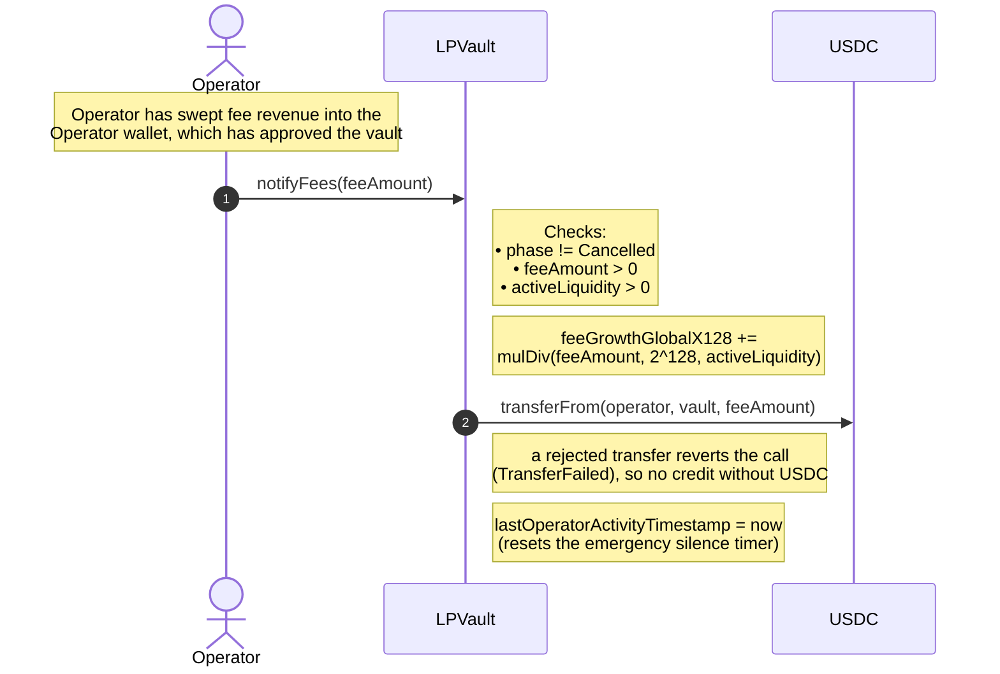
```mermaid
sequenceDiagram
    autonumber
    actor Operator
    participant Vault as LPVault
    participant USDC

    Note over Operator: Operator has swept fee revenue into the<br/>Operator wallet, which has approved the vault
    Operator->>Vault: notifyFees(feeAmount)
    Note right of Vault: Checks:<br/>• phase != Cancelled<br/>• feeAmount > 0<br/>• activeLiquidity > 0
    Note right of Vault: feeGrowthGlobalX128 +=<br/>mulDiv(feeAmount, 2^128, activeLiquidity)
    Vault->>USDC: transferFrom(operator, vault, feeAmount)
    Note right of Vault: a rejected transfer reverts the call<br/>(TransferFailed), so no credit without USDC
    Note right of Vault: lastOperatorActivityTimestamp = now<br/>(resets the emergency silence timer)
```

**When to call:** After the Operator sweeps trading fees from the exchange into the Operator wallet. The vault takes the USDC itself inside the call, so the credit and the funds move in one transaction. Each Operator wallet needs a standing USDC approval to each vault it reports to (see `DEPLOYMENT.md`, "Operator USDC approval per vault"); a wallet with no approval reverts on its first report with `TransferFailed`. The vault performs no balance check beyond the pull, so the Operator can still under-report.

**Why `activeLiquidity > 0` matters:** Distributing fees with zero active liquidity would lock USDC permanently with no LP able to claim. The revert prevents this.

---

### 2.3 Update Tick (`updateTick`)

Synchronises the vault's price tick with the off-chain CLOB mid-price, crossing tick boundaries and interior mint ticks to adjust `activeLiquidity` and `noSideLiquidity` and flip per-tick fee accumulators, and shifting the solvency ledger's four totals for every segment the price traversed, the trailing one included, with the liquidity split as it stood in that segment.

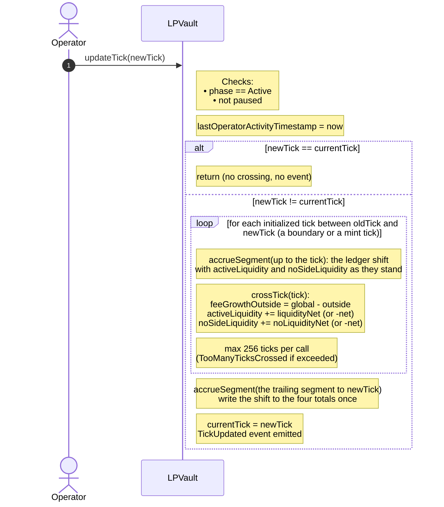
```mermaid
sequenceDiagram
    autonumber
    actor Operator
    participant Vault as LPVault

    Operator->>Vault: updateTick(newTick)
    Note right of Vault: Checks:<br/>• phase == Active<br/>• not paused
    Note right of Vault: lastOperatorActivityTimestamp = now

    alt newTick == currentTick
        Note right of Vault: return (no crossing, no event)
    else newTick != currentTick
        loop for each initialized tick between oldTick and newTick (a boundary or a mint tick)
            Note right of Vault: accrueSegment(up to the tick): the ledger shift<br/>  with activeLiquidity and noSideLiquidity as they stand
            Note right of Vault: crossTick(tick):<br/>  feeGrowthOutside = global - outside<br/>  activeLiquidity += liquidityNet (or -net)<br/>  noSideLiquidity += noLiquidityNet (or -net)
            Note right of Vault: max 256 ticks per call<br/>(TooManyTicksCrossed if exceeded)
        end
        Note right of Vault: accrueSegment(the trailing segment to newTick)<br/>write the shift to the four totals once

        Note right of Vault: currentTick = newTick<br/>TickUpdated event emitted
    end
```

**When to call:** The Keeper bot (holding an Operator key) reports the tick every 60 seconds and after fills. A report with the unchanged tick refreshes only the Operator heartbeat, so it costs about as little as `heartbeat()` and needs no second transaction. While the vault is paused or wound down, `updateTick` reverts and the Keeper calls `heartbeat()` instead.

**Chunking:** If the price has moved more than 256 initialized ticks (mint ticks included), the Operator must call `updateTick` multiple times, landing on intermediate ticks to process the full range; the ledger lands on the same totals in one call or in chunks. The search reads only the bitmap words between `currentTick` and `newTick`, so a tick that an LP initialized far away costs nothing until the price reaches it. A large jump across empty words still reads one word per 256 ticks, so the Operator also chunks a very large jump.

---

### 2.4 Collect Fees (`collect`, `collectFor`)

An LP withdraws their accrued trading fees from a position without removing the position itself. Two entry points: the Safe calls `collect(positionId)` itself, or the owner key signs a `CollectIntent` (with a nonce, because a collect repeats) and the Operator relays it through `collectFor`. Before it pays, the vault merges its free pairs, the YES and NO pairs above what the ledger owes in both tokens, into USDC, and it pays the fees owed times the USDC ratio of the solvency ledger, the smaller of 1 and the USDC it holds above escrow over the principal and the fees it owes; the claim settles at that ratio, so nothing waits in `tokensOwed`.

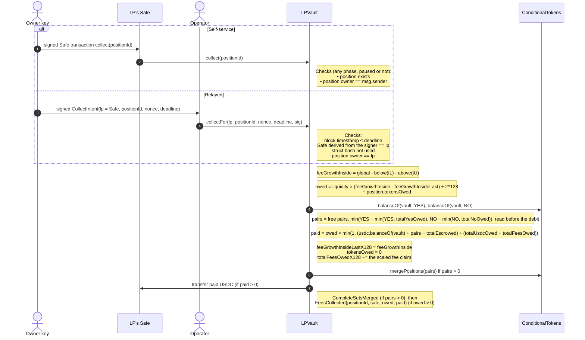
```mermaid
sequenceDiagram
    autonumber
    actor OwnerKey as Owner key
    participant Safe as LP's Safe
    actor Operator
    participant Vault as LPVault
    participant CTF as ConditionalTokens

    alt Self-service
        OwnerKey->>Safe: signed Safe transaction collect(positionId)
        Safe->>Vault: collect(positionId)
        Note right of Vault: Checks (any phase, paused or not):<br/>• position exists<br/>• position.owner == msg.sender
    else Relayed
        OwnerKey->>Operator: signed CollectIntent(lp = Safe, positionId, nonce, deadline)
        Operator->>Vault: collectFor(lp, positionId, nonce, deadline, sig)
        Note right of Vault: Checks:<br/>block.timestamp ≤ deadline<br/>Safe derived from the signer == lp<br/>struct hash not used<br/>position.owner == lp
    end
    Note right of Vault: feeGrowthInside = global - below(tL) - above(tU)
    Note right of Vault: owed = liquidity × (feeGrowthInside - feeGrowthInsideLast) ÷ 2^128<br/>+ position.tokensOwed
    Vault->>CTF: balanceOf(vault, YES), balanceOf(vault, NO)
    Note right of Vault: pairs = free pairs, min(YES − min(YES, totalYesOwed), NO − min(NO, totalNoOwed)), read before the debit
    Note right of Vault: paid = owed × min(1, (usdc.balanceOf(vault) + pairs − totalEscrowed) ÷ (totalUsdcOwed + totalFeesOwed))
    Note right of Vault: feeGrowthInsideLastX128 = feeGrowthInside<br/>tokensOwed = 0<br/>totalFeesOwedX128 −= the scaled fee claim
    Vault->>CTF: mergePositions(pairs) if pairs > 0
    Vault->>Safe: transfer paid USDC (if paid > 0)
    Note right of Vault: CompleteSetsMerged (if pairs > 0), then<br/>FeesCollected(positionId, safe, owed, paid) (if owed > 0)
```

**When to call:** Any time the LP wants to collect accrued fees. Works in every phase, including Cancelled, and while paused. `feeGrowthInsideLastX128` is updated each call so subsequent collects only pay fees that accrued since the last collection; a short vault pays its share and the cut is final, so the LP who sees a shortfall can wait for a better ratio.

---

### 2.5 Merge Positions (`mergePositions`)

Operator housekeeping: combines two or more distinct positions with the same owner, range, and mint tick into one, preserving total liquidity and rolling up uncollected fees. This joins LP position records. It is not the complete-set merge of YES and NO tokens into USDC (section 2.8).

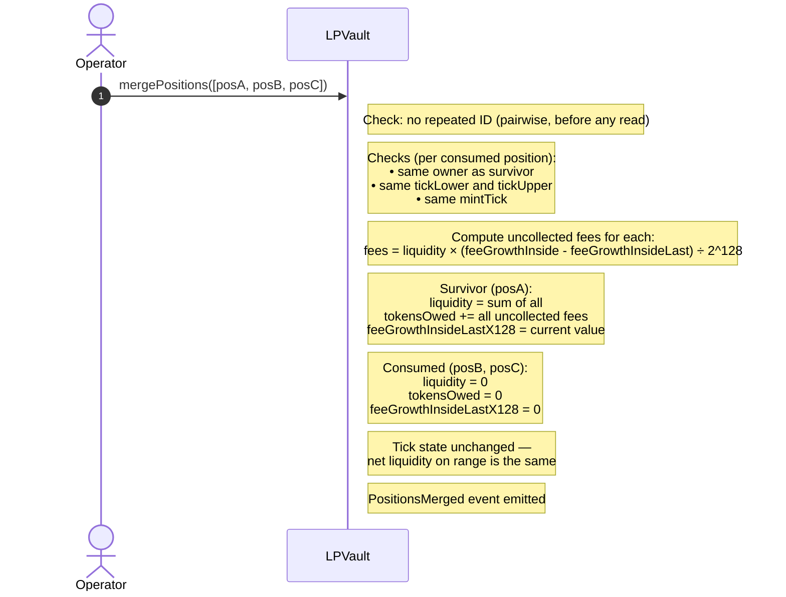
```mermaid
sequenceDiagram
    autonumber
    actor Operator
    participant Vault as LPVault

    Operator->>Vault: mergePositions([posA, posB, posC])
    Note right of Vault: Check: no repeated ID (pairwise, before any read)
    Note right of Vault: Checks (per consumed position):<br/>• same owner as survivor<br/>• same tickLower and tickUpper<br/>• same mintTick

    Note right of Vault: Compute uncollected fees for each:<br/>fees = liquidity × (feeGrowthInside - feeGrowthInsideLast) ÷ 2^128
    Note right of Vault: Survivor (posA):<br/>  liquidity = sum of all<br/>  tokensOwed += all uncollected fees<br/>  feeGrowthInsideLastX128 = current value

    Note right of Vault: Consumed (posB, posC):<br/>  liquidity = 0<br/>  tokensOwed = 0<br/>  feeGrowthInsideLastX128 = 0

    Note right of Vault: Tick state unchanged —<br/>net liquidity on range is the same
    Note right of Vault: PositionsMerged event emitted
```

**When to call:** When an LP has accumulated multiple positions on the same range (common after repeated `mintPositionFor` calls). Merging reduces storage and gas for future operations.

---

### 2.6 Reclaim Deposit (`reclaimDeposit`, `reclaimDepositFor`)

One-call escape hatch for an LP whose escrowed intent the Operator never minted. The escrow record proves the deposit, so there is no timelock, no Operator co-signature, no phase check, and no pause check. Two entry points: the Safe calls `reclaimDeposit(intentId)` itself, or the owner key signs a `ReclaimIntent` and the Operator relays it through `reclaimDepositFor`.

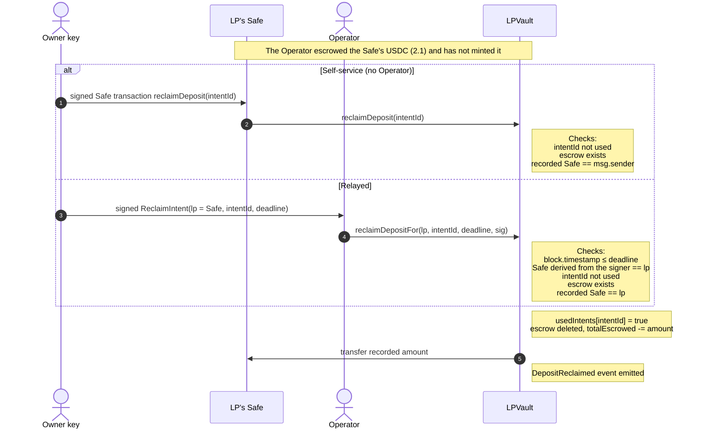
```mermaid
sequenceDiagram
    autonumber
    actor OwnerKey as Owner key
    participant Safe as LP's Safe
    actor Operator
    participant Vault as LPVault

    Note over Safe,Vault: The Operator escrowed the Safe's USDC (2.1) and has not minted it

    alt Self-service (no Operator)
        OwnerKey->>Safe: signed Safe transaction reclaimDeposit(intentId)
        Safe->>Vault: reclaimDeposit(intentId)
        Note right of Vault: Checks:<br/>intentId not used<br/>escrow exists<br/>recorded Safe == msg.sender
    else Relayed
        OwnerKey->>Operator: signed ReclaimIntent(lp = Safe, intentId, deadline)
        Operator->>Vault: reclaimDepositFor(lp, intentId, deadline, sig)
        Note right of Vault: Checks:<br/>block.timestamp ≤ deadline<br/>Safe derived from the signer == lp<br/>intentId not used<br/>escrow exists<br/>recorded Safe == lp
    end
    Note right of Vault: usedIntents[intentId] = true<br/>escrow deleted, totalEscrowed -= amount
    Vault->>Safe: transfer recorded amount
    Note right of Vault: DepositReclaimed event emitted
```

**When to call:** Whenever the LP wants the escrow back before the Operator mints it. The refund comes from the record, in every phase, paused or not, and with every Operator removed.

---

### 2.7 Burn a Position (`burnPosition`, `burnPositionFor`)

An LP closes a position and receives what its claim holds under the claim model (decision C26). Every level of the range starts as USDC. A level below the mint tick bought YES when the price fell through it; a level at or above the mint tick bought NO when the price rose through it. So the claim is USDC for every level the price never crossed, one outcome token for the band between the mint tick and the current tick, plus the USDC that buying that token at each level's price did not spend, plus the accrued fees. The vault settles its tokens first (the merge of its free pairs, the pairs above what the ledger owes in both tokens, before the switch, the redemption of every token after the Oracle's `redeemOutcomeTokens`), and pays its share from the solvency ledger. Before the switch: each asset's owed amount times the smaller of 1 and what the vault holds over what it owes on that asset, USDC in one transfer and the token in kind. After the switch: the token leg is worth `tokenOwed × numerator ÷ denominator` USDC at the stored payout, one ratio values every leg, and the burn pays the principal, the fees, and the token leg's USDC as one prorated sum in one USDC transfer, with no ERC-1155 transfer. Rounded down, without a revert, and the full owed amount is debited, so every later claimant meets the same ratio. Two entry points: the Safe calls `burnPosition(positionId)` itself, in every phase and with no Operator, or the owner key signs a `BurnIntent` and the Operator relays it through `burnPositionFor`.

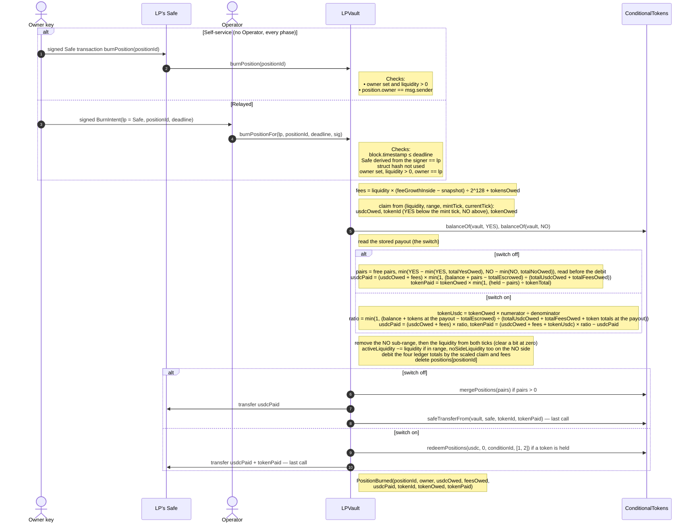
```mermaid
sequenceDiagram
    autonumber
    actor OwnerKey as Owner key
    participant Safe as LP's Safe
    actor Operator
    participant Vault as LPVault
    participant CTF as ConditionalTokens

    alt Self-service (no Operator, every phase)
        OwnerKey->>Safe: signed Safe transaction burnPosition(positionId)
        Safe->>Vault: burnPosition(positionId)
        Note right of Vault: Checks:<br/>• owner set and liquidity > 0<br/>• position.owner == msg.sender
    else Relayed
        OwnerKey->>Operator: signed BurnIntent(lp = Safe, positionId, deadline)
        Operator->>Vault: burnPositionFor(lp, positionId, deadline, sig)
        Note right of Vault: Checks:<br/>block.timestamp ≤ deadline<br/>Safe derived from the signer == lp<br/>struct hash not used<br/>owner set, liquidity > 0, owner == lp
    end
    Note right of Vault: fees = liquidity × (feeGrowthInside − snapshot) ÷ 2^128 + tokensOwed
    Note right of Vault: claim from (liquidity, range, mintTick, currentTick):<br/>usdcOwed, tokenId (YES below the mint tick, NO above), tokenOwed
    Vault->>CTF: balanceOf(vault, YES), balanceOf(vault, NO)
    Note right of Vault: read the stored payout (the switch)
    alt switch off
        Note right of Vault: pairs = free pairs, min(YES − min(YES, totalYesOwed), NO − min(NO, totalNoOwed)), read before the debit<br/>usdcPaid = (usdcOwed + fees) × min(1, (balance + pairs − totalEscrowed) ÷ (totalUsdcOwed + totalFeesOwed))<br/>tokenPaid = tokenOwed × min(1, (held − pairs) ÷ tokenTotal)
    else switch on
        Note right of Vault: tokenUsdc = tokenOwed × numerator ÷ denominator<br/>ratio = min(1, (balance + tokens at the payout − totalEscrowed) ÷ (totalUsdcOwed + totalFeesOwed + token totals at the payout))<br/>usdcPaid = (usdcOwed + fees) × ratio, tokenPaid = (usdcOwed + fees + tokenUsdc) × ratio − usdcPaid
    end
    Note right of Vault: remove the NO sub-range, then the liquidity from both ticks (clear a bit at zero)<br/>activeLiquidity −= liquidity if in range, noSideLiquidity too on the NO side<br/>debit the four ledger totals by the scaled claim and fees<br/>delete positions[positionId]
    alt switch off
        Vault->>CTF: mergePositions(pairs) if pairs > 0
        Vault->>Safe: transfer usdcPaid
        Vault->>CTF: safeTransferFrom(vault, safe, tokenId, tokenPaid) — last call
    else switch on
        Vault->>CTF: redeemPositions(usdc, 0, conditionId, [1, 2]) if a token is held
        Vault->>Safe: transfer usdcPaid + tokenPaid — last call
    end
    Note right of Vault: PositionBurned(positionId, owner, usdcOwed, feesOwed,<br/>usdcPaid, tokenId, tokenOwed, tokenPaid)
```

**Worked example.** 300 USDC over `[5500, 6500)` minted at tick 6000 gives `liquidity = 3e23`. With the vault at 5700 the YES band is `[5700, 6000)`: 90 YES, and `3e23 × (1000 × 10000 − 300 × (5700 + 6000 − 1) / 2) / (10000 × 1e18) = 247,354,500` USDC units. The vault spent 52.6455 USDC on the 90 YES, an average price of 0.585. At 6300 the NO band is `[6000, 6300)`: 90 NO and 265,345,500 units. At 6000 the claim is 300 USDC. After the Oracle's redemption with YES winning (`[1, 0]`), the same burn pays 247,354,500 + 90,000,000 = 337,354,500 units in one USDC transfer; with NO winning, 247,354,500 and nothing for the band; with a cancelled market (`[1, 1]`), 292,354,500.

**When to call:** Whenever the LP wants out. The self-service path needs no Operator, no signature, no timelock, and no declared emergency, and it works with every Operator removed. `burnPositionFor` refreshes the Operator heartbeat; `burnPosition` never does.

---

### 2.8 Merge Complete Sets (`mergeCompleteSets`)

Any wallet turns the vault's free pairs, the YES and NO pairs above what the ledger owes in both tokens, into USDC held by the vault. A round trip through a level leaves one YES and one NO per token, worth exactly 1 USDC, and the Conditional Tokens contract turns a pair into USDC with no counterparty. A pair below what the ledger owes is a claim's band token and never merges, so one claim's YES is never netted against another claim's NO (finding CV-01 of `audits/code-validation-round-1.md`, R14). The keeper merges on sight so an LP's exit does not pay for the merge; every burn and every paying collect merges first anyway.

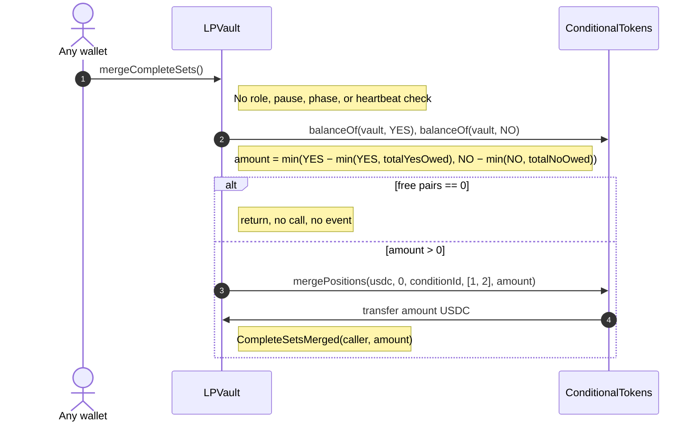
```mermaid
sequenceDiagram
    autonumber
    actor Caller as Any wallet
    participant Vault as LPVault
    participant CTF as ConditionalTokens

    Caller->>Vault: mergeCompleteSets()
    Note right of Vault: No role, pause, phase, or heartbeat check
    Vault->>CTF: balanceOf(vault, YES), balanceOf(vault, NO)
    Note right of Vault: amount = min(YES − min(YES, totalYesOwed), NO − min(NO, totalNoOwed))
    alt free pairs == 0
        Note right of Vault: return, no call, no event
    else amount > 0
        Vault->>CTF: mergePositions(usdc, 0, conditionId, [1, 2], amount)
        CTF->>Vault: transfer amount USDC
        Note right of Vault: CompleteSetsMerged(caller, amount)
    end
```

**When to call:** Whenever the vault holds free pairs. The caller receives nothing, and the merge changes no claim's token leg and no claim's ratio, so the call needs no trusted caller. It never refreshes the Operator heartbeat.

---

### 2.9 Fill a vault order on the exchange (`isValidSignature`)

The vault is the maker of its own orders. The keeper signs an order that names the vault as `maker` and `signer` with `signatureType = POLY_1271`, using the Operator key, and the exchange asks the vault whether it stands behind that signature during every fill. The vault answers from the registry at that moment, and only to the exchange, and only while it is Active and not paused (decision C22). The USDC leg moves under the allowance `initialize` granted, and the outcome tokens arrive through the receiver hook.

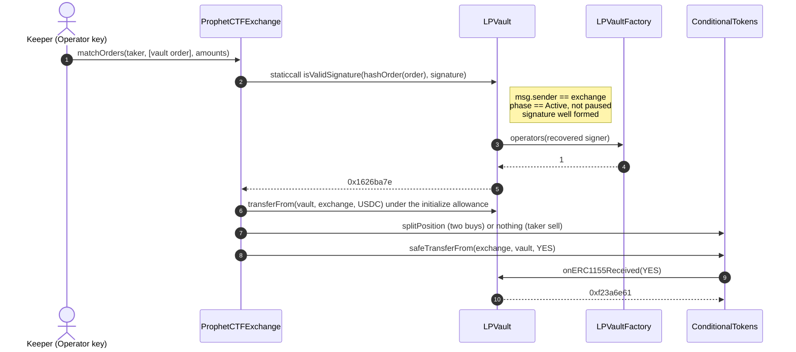
```mermaid
sequenceDiagram
    autonumber
    actor Keeper as Keeper (Operator key)
    participant Exchange as ProphetCTFExchange
    participant Vault as LPVault
    participant Factory as LPVaultFactory
    participant CT as ConditionalTokens

    Keeper->>Exchange: matchOrders(taker, [vault order], amounts)
    Exchange->>Vault: staticcall isValidSignature(hashOrder(order), signature)
    Note right of Vault: msg.sender == exchange<br/>phase == Active, not paused<br/>signature well formed
    Vault->>Factory: operators(recovered signer)
    Factory-->>Vault: 1
    Vault-->>Exchange: 0x1626ba7e
    Exchange->>Vault: transferFrom(vault, exchange, USDC) under the initialize allowance
    Exchange->>CT: splitPosition (two buys) or nothing (taker sell)
    Exchange->>CT: safeTransferFrom(exchange, vault, YES)
    CT->>Vault: onERC1155Received(YES)
    Vault-->>CT: 0xf23a6e61
```

**When to call:** The exchange calls it, not the keeper. The keeper posts buy orders only (decision C26), sets `feeRateBps` per the house rule, and cancels its resting orders when it sees `EmergencyCancelExecuted`, `VaultWindDownStarted`, or `TradingPaused`, because a resting order fails its signature check at match time after any of those. The vault returns `0xffffffff` and never reverts on a refusal, and it answers no caller other than the exchange, so a token contract that consults the payer's `isValidSignature` (USDC, ERC-7598) cannot spend vault assets on an Operator's signature.

---

### 2.10 Redeem outcome tokens (`redeemOutcomeTokens`)

After Prophet's `Resolution.finalizePayouts` forwards the result to the Conditional Tokens contract, each outcome token has a fixed USDC value. The Oracle winds the vault down, then redeems: the first successful call copies the payout numerators from the Conditional Tokens contract into the vault (the switch) and turns every token the vault holds into USDC. From then on every burn and collect values its token leg at that payout, redeems whatever tokens the vault holds first, and pays one USDC transfer at one ratio. The call reverts while the vault is Active, before the result exists, and for every caller but the Oracle; it works in WindDown and after a freeze, paused or not, and can run again for tokens that arrive later.

```mermaid
sequenceDiagram
    autonumber
    participant Resolution
    participant CTF as ConditionalTokens
    actor Oracle
    participant Vault as LPVault
    participant USDC

    Resolution->>CTF: reportPayouts(questionId, payouts) after the cooldown
    Oracle->>Vault: startWindDown()
    Oracle->>Vault: redeemOutcomeTokens()
    Note right of Vault: onlyOracle, nonReentrant; revert VaultStillActive if phase is 1
    Vault->>CTF: payoutDenominator(conditionId)
    alt denominator is 0
        Vault-->>Oracle: revert MarketNotResolved
    else result reported
        opt the stored payout is zero
            Vault->>CTF: payoutNumerators(conditionId, 0) and (conditionId, 1)
            Note right of Vault: store both numerators (SafeCast to uint128): the switch
        end
        Vault->>CTF: balanceOf(vault, YES), balanceOf(vault, NO)
        opt either balance above 0
            Vault->>CTF: redeemPositions(usdc, 0, conditionId, [1, 2])
            CTF->>USDC: transfer(vault, payout)
            Note right of Vault: OutcomeTokensRedeemed(oracle, yes, no, usdc)
        end
    end
```

**When to call:** Once `Resolution.finalizePayouts` ran, after `startWindDown`. Call again if tokens arrive later. Until the Oracle calls, an exit pays the winning token in kind, and the LP redeems it at the Conditional Tokens contract from the Safe for the same USDC, so no LP waits on the Oracle. The payout is read from the Conditional Tokens contract inside the call and never from an argument.

---

## 3. Emergency Procedures

### 3.1 Emergency Cancel All (`emergencyCancelAll`)

Any address can freeze the vault after the Operator has been silent for the vault's emergency-cancel timelock (7 days by default, 30 days at most). The freeze sets the phase to Cancelled and changes nothing else: every position, every tick, every escrow, and every total stay as they are. Each LP then exits alone, in their own transaction, through the burn, the collect, or the reclaim: the claim is valued at the frozen tick and paid at the ledger's ratio per asset, which is 1 when the vault is whole. This is the last resort when the Operator is unresponsive.

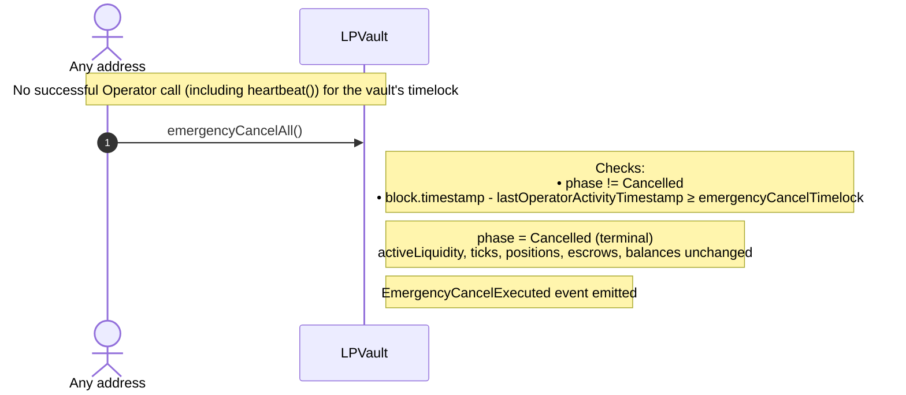
```mermaid
sequenceDiagram
    autonumber
    actor Anyone as Any address
    participant Vault as LPVault

    Note over Anyone,Vault: No successful Operator call (including heartbeat()) for the vault's timelock

    Anyone->>Vault: emergencyCancelAll()
    Note right of Vault: Checks:<br/>• phase != Cancelled<br/>• block.timestamp - lastOperatorActivityTimestamp ≥ emergencyCancelTimelock
    Note right of Vault: phase = Cancelled (terminal)<br/>activeLiquidity, ticks, positions, escrows, balances unchanged
    Note right of Vault: EmergencyCancelExecuted event emitted
```

**Exit after the freeze** (the flow the freeze exists for; the burn body is unchanged):

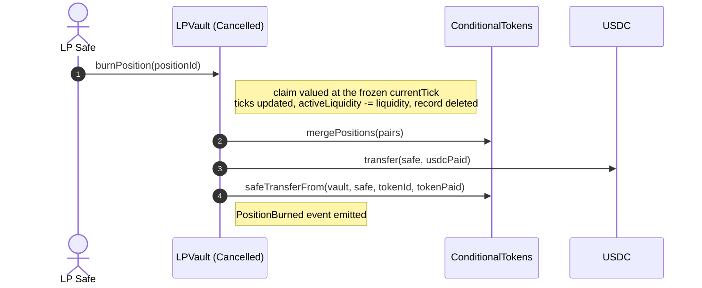
```mermaid
sequenceDiagram
    autonumber
    actor Safe as LP Safe
    participant Vault as LPVault (Cancelled)
    participant CT as ConditionalTokens
    participant USDC

    Safe->>Vault: burnPosition(positionId)
    Note right of Vault: claim valued at the frozen currentTick<br/>ticks updated, activeLiquidity -= liquidity, record deleted
    Vault->>CT: mergePositions(pairs)
    Vault->>USDC: transfer(safe, usdcPaid)
    Vault->>CT: safeTransferFrom(vault, safe, tokenId, tokenPaid)
    Note right of Vault: PositionBurned event emitted
```

**When to call:** After the vault's timelock without any successful Operator call (`depositForIntent`, `mintPositionFor`, `reclaimDepositFor`, `burnPositionFor`, `collectFor`, `notifyFees`, `updateTick`, `mergePositions`, or `heartbeat`). The caller needs no role and no position: the timelock is the whole condition, because the freeze moves no funds. Read the vault's timelock with `emergencyCancelTimelock()`.

**Why no payout loop:** a loop that paid everyone in one call skipped pending escrows, ran out of gas on a large vault, and failed for everyone when one recipient was USDC-blacklisted (audit issues 6.7, 6.11, 6.17). The freeze costs the same gas for any number of positions, and a blacklisted LP blocks only their own exit. The vault approves no new order after the freeze, because the order maker accepts an order only while the vault is Active and not paused (decision C22).

---

### 3.2 Pause and Unpause Trading

Admin can halt all trading entry points instantly as a circuit breaker. LP exit paths remain open so capital is never trapped.

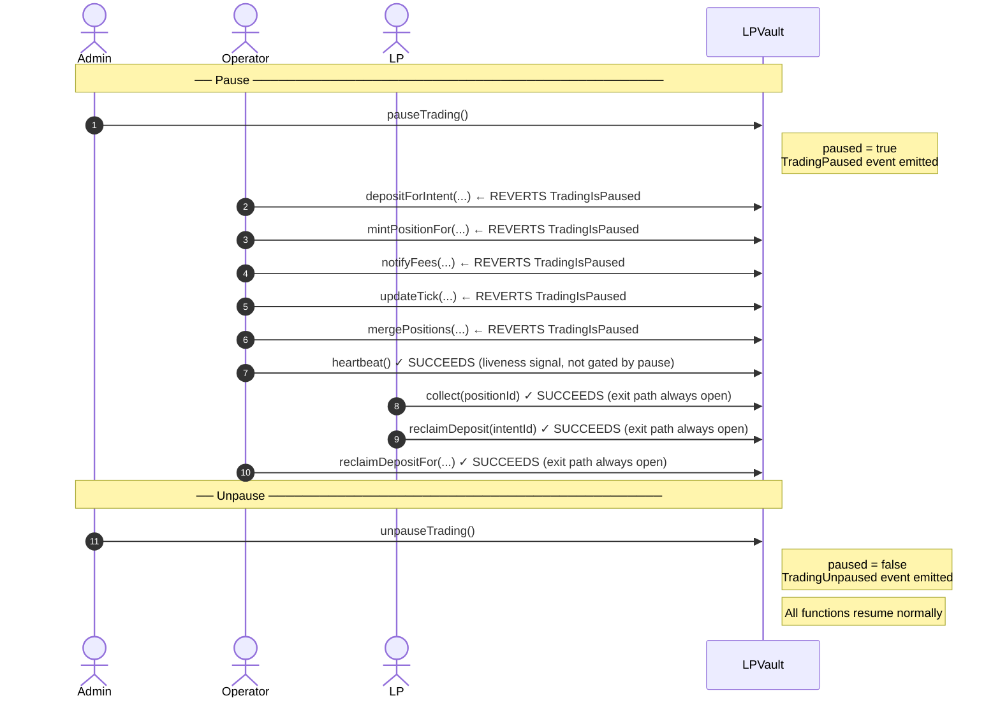
```mermaid
sequenceDiagram
    autonumber
    actor Admin
    actor Operator
    actor LP
    participant Vault as LPVault

    Note over Admin,Vault: ── Pause ────────────────────────────────────────────────
    Admin->>Vault: pauseTrading()
    Note right of Vault: paused = true<br/>TradingPaused event emitted

    Operator->>Vault: depositForIntent(...) ← REVERTS TradingIsPaused
    Operator->>Vault: mintPositionFor(...) ← REVERTS TradingIsPaused
    Operator->>Vault: notifyFees(...)      ← REVERTS TradingIsPaused
    Operator->>Vault: updateTick(...)      ← REVERTS TradingIsPaused
    Operator->>Vault: mergePositions(...)  ← REVERTS TradingIsPaused
    Operator->>Vault: heartbeat()          ✓ SUCCEEDS (liveness signal, not gated by pause)

    LP->>Vault: collect(positionId)        ✓ SUCCEEDS (exit path always open)
    LP->>Vault: reclaimDeposit(intentId)   ✓ SUCCEEDS (exit path always open)
    Operator->>Vault: reclaimDepositFor(...) ✓ SUCCEEDS (exit path always open)

    Note over Admin,Vault: ── Unpause ──────────────────────────────────────────────
    Admin->>Vault: unpauseTrading()
    Note right of Vault: paused = false<br/>TradingUnpaused event emitted
    Note right of Vault: All functions resume normally
```

**When to pause:** A bug is discovered, a market anomaly is detected, or an emergency audit is needed. Pause is immediate and does not affect the vault's phase state machine.

**Pause vs. emergencyCancelAll:** Pause is reversible and keeps positions intact. Emergency cancel is irreversible and freezes trading; every exit stays open and pays at the ledger's ratio, which is 1 when the vault is whole.

---

## 4. Admin & Governance

### 4.1 Role Management

All role changes happen on the **factory** and immediately propagate to every vault it deployed (vaults read role state from the factory at call time).

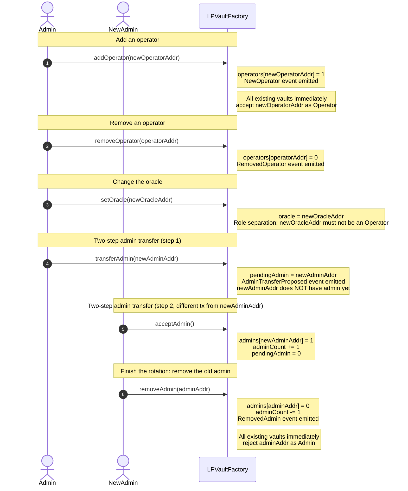
```mermaid
sequenceDiagram
    autonumber
    actor Admin
    actor NewAdmin
    participant Factory as LPVaultFactory

    Note over Admin,Factory: Add an operator
    Admin->>Factory: addOperator(newOperatorAddr)
    Note right of Factory: operators[newOperatorAddr] = 1<br/>NewOperator event emitted
    Note right of Factory: All existing vaults immediately<br/>accept newOperatorAddr as Operator

    Note over Admin,Factory: Remove an operator
    Admin->>Factory: removeOperator(operatorAddr)
    Note right of Factory: operators[operatorAddr] = 0<br/>RemovedOperator event emitted

    Note over Admin,Factory: Change the oracle
    Admin->>Factory: setOracle(newOracleAddr)
    Note right of Factory: oracle = newOracleAddr<br/>Role separation: newOracleAddr must not be an Operator

    Note over Admin,Factory: Two-step admin transfer (step 1)
    Admin->>Factory: transferAdmin(newAdminAddr)
    Note right of Factory: pendingAdmin = newAdminAddr<br/>AdminTransferProposed event emitted<br/>newAdminAddr does NOT have admin yet

    Note over NewAdmin,Factory: Two-step admin transfer (step 2, different tx from newAdminAddr)
    NewAdmin->>Factory: acceptAdmin()
    Note right of Factory: admins[newAdminAddr] = 1<br/>adminCount += 1<br/>pendingAdmin = 0

    Note over NewAdmin,Factory: Finish the rotation: remove the old admin
    NewAdmin->>Factory: removeAdmin(adminAddr)
    Note right of Factory: admins[adminAddr] = 0<br/>adminCount -= 1<br/>RemovedAdmin event emitted
    Note right of Factory: All existing vaults immediately<br/>reject adminAddr as Admin
```

**Key constraint:** `oracle` and every `operator` address must be distinct wallets. `setOracle` reverts if the new oracle is an existing operator, and `addOperator` reverts if the new operator is the current oracle.

**Admin rotation:** `acceptAdmin` adds the new admin but does not remove the old one. The old key keeps full admin rights until an admin calls `removeAdmin` on it. `removeAdmin` and `renounceAdminRole` never remove the last admin, and they withdraw any pending proposal to the removed address.

---

### 4.2 Upgradeable Implementation Pointer

The factory's `implementation` address (the EIP-1167 clone target for new vaults) can be rotated via a two-step 7-day timelock. Existing vaults are unaffected — EIP-1167 bakes the implementation address into each clone's bytecode at deploy time.

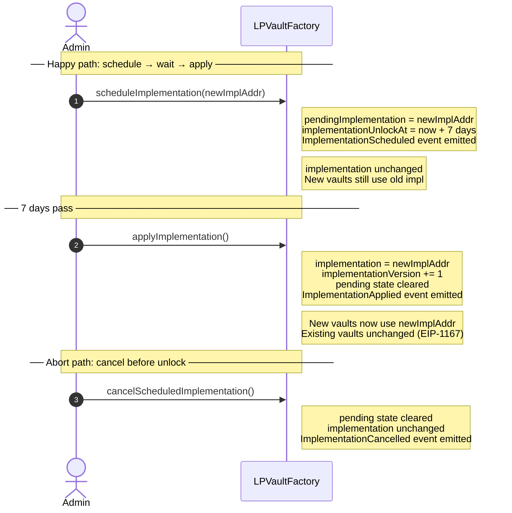
```mermaid
sequenceDiagram
    autonumber
    actor Admin
    participant Factory as LPVaultFactory

    Note over Admin,Factory: ── Happy path: schedule → wait → apply ─────────────────
    Admin->>Factory: scheduleImplementation(newImplAddr)
    Note right of Factory: pendingImplementation = newImplAddr<br/>implementationUnlockAt = now + 7 days<br/>ImplementationScheduled event emitted
    Note right of Factory: implementation unchanged<br/>New vaults still use old impl

    Note over Admin,Factory: ── 7 days pass ─────────────────────────────────────────

    Admin->>Factory: applyImplementation()
    Note right of Factory: implementation = newImplAddr<br/>implementationVersion += 1<br/>pending state cleared<br/>ImplementationApplied event emitted
    Note right of Factory: New vaults now use newImplAddr<br/>Existing vaults unchanged (EIP-1167)

    Note over Admin,Factory: ── Abort path: cancel before unlock ─────────────────────
    Admin->>Factory: cancelScheduledImplementation()
    Note right of Factory: pending state cleared<br/>implementation unchanged<br/>ImplementationCancelled event emitted
```

**`implementationVersion`** is stored per clone at `initialize()` time. Off-chain systems can call `vault.implementationVersion()` to know which code version a vault is running.

**Guards:**
- `scheduleImplementation(address(0))` reverts — prevents bricking the factory.
- Calling `applyImplementation()` before the timelock elapses reverts with `TimelockNotElapsed`.
- A second `scheduleImplementation` while one is already pending reverts with `ScheduleAlreadyPending` — cancel first if you want to change the scheduled address.

---

## Summary: Who Can Call What

| Function | Actor | Phase | Notes |
|----------|-------|-------|-------|
| `createVault` | Oracle | — | On factory |
| `startWindDown` | Oracle | Active | One-way; enables exit-only |
| `setMinimumFirstLiquidity` | Oracle | Any | On vault; matters only before the first mint |
| `depositForIntent` | Operator | Active | Not paused; owner-key signature checked against the derived Safe |
| `mintPositionFor` | Operator | Active | Not paused; escrow required, no signature, no USDC |
| `notifyFees` | Operator | Active / WindDown | Not paused; activeLiquidity > 0; takes `amount` USDC from the Operator wallet |
| `updateTick` | Operator | Active | Not paused; max 256 ticks |
| `mergePositions` | Operator | Active / WindDown | Not paused |
| `heartbeat` | Operator | Active / WindDown | Works while paused; refreshes the silence timer only |
| `collect` | LP's Safe (owner) | Every phase | Always open; works while paused; settles first (merge, or redemption after the switch); pays its share from the solvency ledger |
| `collectFor` | Operator | Every phase | Works while paused; owner-key CollectIntent with a nonce and a deadline |
| `burnPosition` | LP's Safe (owner) | Every phase | Always open; works while paused; no Operator, no timelock; the claim from the mint tick, paid at the ledger's ratio per asset, or as one USDC sum after the switch |
| `burnPositionFor` | Operator | Every phase | Works while paused; owner-key BurnIntent with a deadline |
| `mergeCompleteSets` | Any wallet | Every phase | Works while paused; never refreshes the heartbeat |
| `redeemOutcomeTokens` | Oracle | WindDown / Cancelled | The switch; reads the payout from the Conditional Tokens contract; works while paused; never refreshes the heartbeat |
| `isValidSignature` | The exchange | Active | A view; not paused; the recovered signer must be a registered Operator; returns `0xffffffff` on any refusal, never reverts |
| `reclaimDeposit` | LP's Safe | Every phase | Always open; works while paused; no timelock |
| `reclaimDepositFor` | Operator | Every phase | Works while paused; owner-key ReclaimIntent with a deadline |
| `emergencyCancelAll` | Any address | Active / WindDown | After the vault's silence timelock; changes only the phase |
| `pauseTrading` | Admin | Any | On vault |
| `unpauseTrading` | Admin | Any | On vault |
| `setDefaultEmergencyCancelTimelock` | Admin | — | On factory; reaches only later vaults |
| `addOperator` / `removeOperator` | Admin | — | On factory |
| `setOracle` | Admin | — | On factory |
| `transferAdmin` / `acceptAdmin` | Admin / pending | — | On factory |
| `addAdmin` / `removeAdmin` / `renounceAdminRole` | Admin | — | On factory; never removes the last admin |
| `scheduleImplementation` | Admin | — | On factory |
| `applyImplementation` | Admin | — | On factory; after 7-day timelock |
| `cancelScheduledImplementation` | Admin | — | On factory |
