# Smart Contract Flows

This guide explains the main interaction patterns for the LP Vaults contracts using sequence diagrams. It covers four areas:

1. [Vault Lifecycle](#1-vault-lifecycle) — creation through wind-down, shown as a continuous example
2. [Transactional Flows](#2-transactional-flows) — depositing USDC, managing positions, collecting fees
3. [Emergency Procedures](#3-emergency-procedures) — emergency cancel and pause/unpause
4. [Admin & Governance](#4-admin--governance) — role management and implementation upgrades

**Actors used throughout:**

| Symbol | Role | Description |
|--------|------|-------------|
| `Admin` | Admin | Registry-only authority — manages roles, pauses, schedules upgrades |
| `Oracle` | Oracle | Lifecycle authority — creates vaults, triggers wind-down |
| `Operator` | Operator | Transactional authority — credits positions, distributes fees, updates tick |
| `LP` | LP | Liquidity provider — owns positions, collects fees, can reclaim deposits |
| `Factory` | LPVaultFactory | Deploys vault clones and holds the role registry |
| `Vault` | LPVault (clone) | Per-market vault instance |

---

## 1. Vault Lifecycle

A vault lives through three phases: **Active** (minting and trading), **WindDown** (no new positions, exits still open), and **Cancelled** (terminal — all funds distributed).

### Phase State Machine

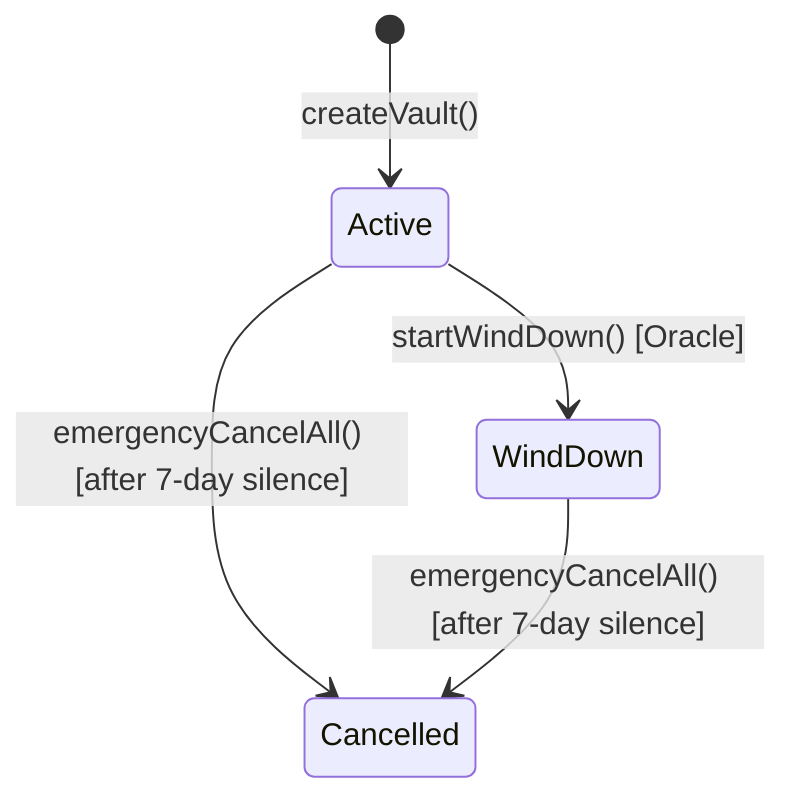
```mermaid
stateDiagram-v2
    [*] --> Active : createVault()
    Active --> WindDown : startWindDown() [Oracle]
    Active --> Cancelled : emergencyCancelAll() [after 7-day silence]
    WindDown --> Cancelled : emergencyCancelAll() [after 7-day silence]
```

### Full Lifecycle Example

The sequence below follows a single market vault from factory deployment through market resolution. It uses every lifecycle method so you can see how they chain together.

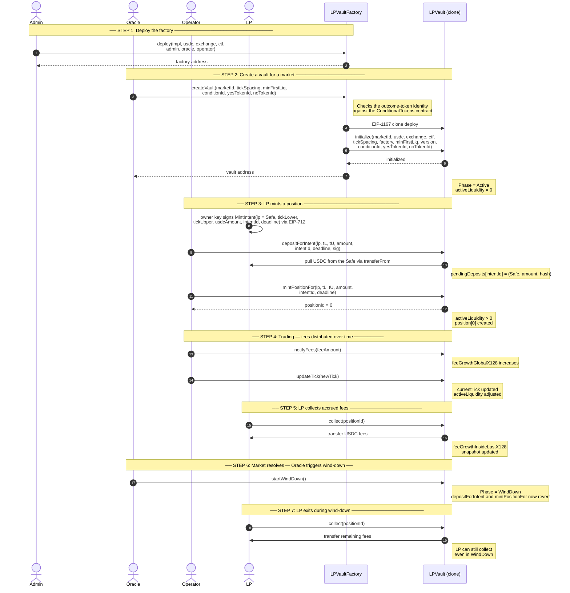
```mermaid
sequenceDiagram
    autonumber
    actor Admin
    actor Oracle
    actor Operator
    actor LP
    participant Factory as LPVaultFactory
    participant Vault as LPVault (clone)

    Note over Admin,Factory: ── STEP 1: Deploy the factory ──────────────────────────────
    Admin->>Factory: deploy(impl, usdc, exchange, ctf,<br/>admin, oracle, operator)
    Factory-->>Admin: factory address

    Note over Oracle,Vault: ── STEP 2: Create a vault for a market ─────────────────────
    Oracle->>Factory: createVault(marketId, tickSpacing, minFirstLiq,<br/>conditionId, yesTokenId, noTokenId)
    Note right of Factory: Checks the outcome-token identity<br/>against the ConditionalTokens contract
    Factory->>Vault: EIP-1167 clone deploy
    Factory->>Vault: initialize(marketId, usdc, exchange, ctf,<br/>tickSpacing, factory, minFirstLiq, version,<br/>conditionId, yesTokenId, noTokenId)
    Vault-->>Factory: initialized
    Factory-->>Oracle: vault address
    Note right of Vault: Phase = Active<br/>activeLiquidity = 0

    Note over Operator,Vault: ── STEP 3: LP mints a position ─────────────────────────────
    LP->>LP: owner key signs MintIntent(lp = Safe, tickLower,<br/>tickUpper, usdcAmount, intentId, deadline) via EIP-712
    Operator->>Vault: depositForIntent(lp, tL, tU, amount,<br/>intentId, deadline, sig)
    Vault->>LP: pull USDC from the Safe via transferFrom
    Note right of Vault: pendingDeposits[intentId] = (Safe, amount, hash)
    Operator->>Vault: mintPositionFor(lp, tL, tU, amount,<br/>intentId, deadline)
    Vault-->>Operator: positionId = 0
    Note right of Vault: activeLiquidity > 0<br/>position[0] created

    Note over Operator,Vault: ── STEP 4: Trading — fees distributed over time ─────────
    Operator->>Vault: notifyFees(feeAmount)
    Note right of Vault: feeGrowthGlobalX128 increases
    Operator->>Vault: updateTick(newTick)
    Note right of Vault: currentTick updated<br/>activeLiquidity adjusted

    Note over LP,Vault: ── STEP 5: LP collects accrued fees ──────────────────────
    LP->>Vault: collect(positionId)
    Vault->>LP: transfer USDC fees
    Note right of Vault: feeGrowthInsideLastX128<br/>snapshot updated

    Note over Oracle,Vault: ── STEP 6: Market resolves — Oracle triggers wind-down ──
    Oracle->>Vault: startWindDown()
    Note right of Vault: Phase = WindDown<br/>depositForIntent and mintPositionFor now revert

    Note over LP,Vault: ── STEP 7: LP exits during wind-down ──────────────────────
    LP->>Vault: collect(positionId)
    Vault->>LP: transfer remaining fees
    Note right of Vault: LP can still collect<br/>even in WindDown
```

**Key invariants during the lifecycle:**
- `activeLiquidity == 0` until the first mint. The `minFirstLiq` floor prevents inflation attacks on this first mint.
- `notifyFees` reverts if `activeLiquidity == 0` — fees cannot be distributed into the void.
- After `startWindDown()`, only exit paths remain open: `collect`, `reclaimDeposit`, `reclaimDepositFor`, and `emergencyCancelAll`.
- `Oracle` and `Operator` **must** be different wallets — the constructor enforces this.

---

## 2. Transactional Flows

These are the day-to-day operations that happen repeatedly during the Active (and WindDown) phases.

### 2.1 Escrow and Mint a Position (`depositForIntent`, `mintPositionFor`)

The Operator escrows an LP's USDC from the LP's Safe against a signed intent, then mints the position from that escrow. The LP's owner key signs off-chain; the Operator submits both calls on-chain. The mint verifies no signature and moves no USDC.

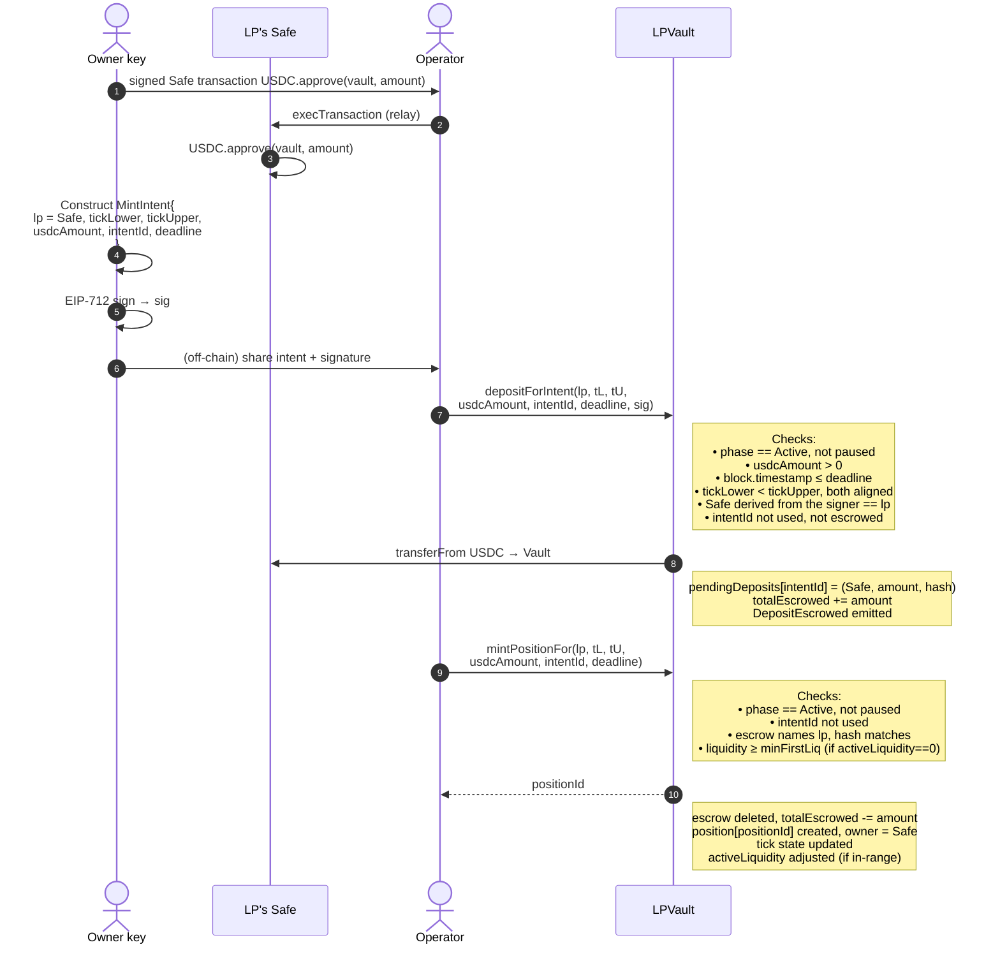
```mermaid
sequenceDiagram
    autonumber
    actor OwnerKey as Owner key
    participant Safe as LP's Safe
    actor Operator
    participant Vault as LPVault

    OwnerKey->>Operator: signed Safe transaction USDC.approve(vault, amount)
    Operator->>Safe: execTransaction (relay)
    Safe->>Safe: USDC.approve(vault, amount)

    OwnerKey->>OwnerKey: Construct MintIntent{<br/>  lp = Safe, tickLower, tickUpper,<br/>  usdcAmount, intentId, deadline<br/>}
    OwnerKey->>OwnerKey: EIP-712 sign → sig
    OwnerKey->>Operator: (off-chain) share intent + signature

    Operator->>Vault: depositForIntent(lp, tL, tU,<br/>usdcAmount, intentId, deadline, sig)
    Note right of Vault: Checks:<br/>• phase == Active, not paused<br/>• usdcAmount > 0<br/>• block.timestamp ≤ deadline<br/>• tickLower < tickUpper, both aligned<br/>• Safe derived from the signer == lp<br/>• intentId not used, not escrowed
    Vault->>Safe: transferFrom USDC → Vault
    Note right of Vault: pendingDeposits[intentId] = (Safe, amount, hash)<br/>totalEscrowed += amount<br/>DepositEscrowed emitted

    Operator->>Vault: mintPositionFor(lp, tL, tU,<br/>usdcAmount, intentId, deadline)
    Note right of Vault: Checks:<br/>• phase == Active, not paused<br/>• intentId not used<br/>• escrow names lp, hash matches<br/>• liquidity ≥ minFirstLiq (if activeLiquidity==0)
    Vault-->>Operator: positionId
    Note right of Vault: escrow deleted, totalEscrowed -= amount<br/>position[positionId] created, owner = Safe<br/>tick state updated<br/>activeLiquidity adjusted (if in-range)
```

**When to call:** After the LP's owner key has signed the intent and the Safe has approved the vault. The Operator escrows first, then mints. Between the two calls the Safe can reclaim the escrow at any moment (2.6), so the Operator mints promptly.

---

### 2.2 Notify Fees (`notifyFees`)

Distributes trading fee revenue across all in-range LPs proportionally to their liquidity.

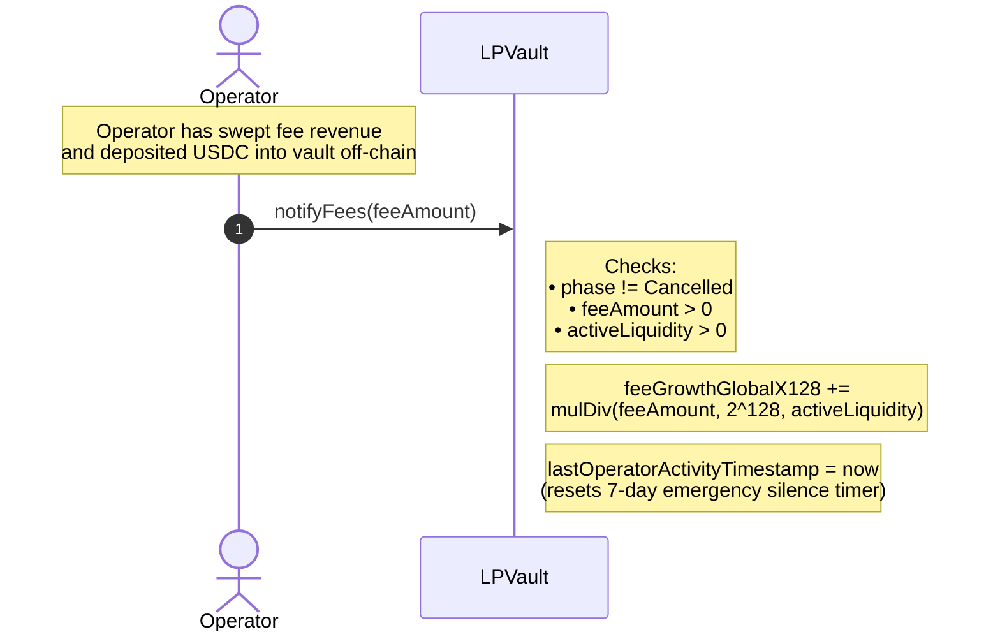
```mermaid
sequenceDiagram
    autonumber
    actor Operator
    participant Vault as LPVault

    Note over Operator: Operator has swept fee revenue<br/>and deposited USDC into vault off-chain
    Operator->>Vault: notifyFees(feeAmount)
    Note right of Vault: Checks:<br/>• phase != Cancelled<br/>• feeAmount > 0<br/>• activeLiquidity > 0
    Note right of Vault: feeGrowthGlobalX128 +=<br/>mulDiv(feeAmount, 2^128, activeLiquidity)
    Note right of Vault: lastOperatorActivityTimestamp = now<br/>(resets 7-day emergency silence timer)
```

**When to call:** After the Operator sweeps trading fees from the exchange and deposits the corresponding USDC into the vault. The contract does not verify the USDC balance — the Operator is trusted to have funded the vault before calling.

**Why `activeLiquidity > 0` matters:** Distributing fees with zero active liquidity would lock USDC permanently with no LP able to claim. The revert prevents this.

---

### 2.3 Update Tick (`updateTick`)

Synchronises the vault's price tick with the off-chain CLOB mid-price, crossing tick boundaries to adjust `activeLiquidity` and flip per-tick fee accumulators.

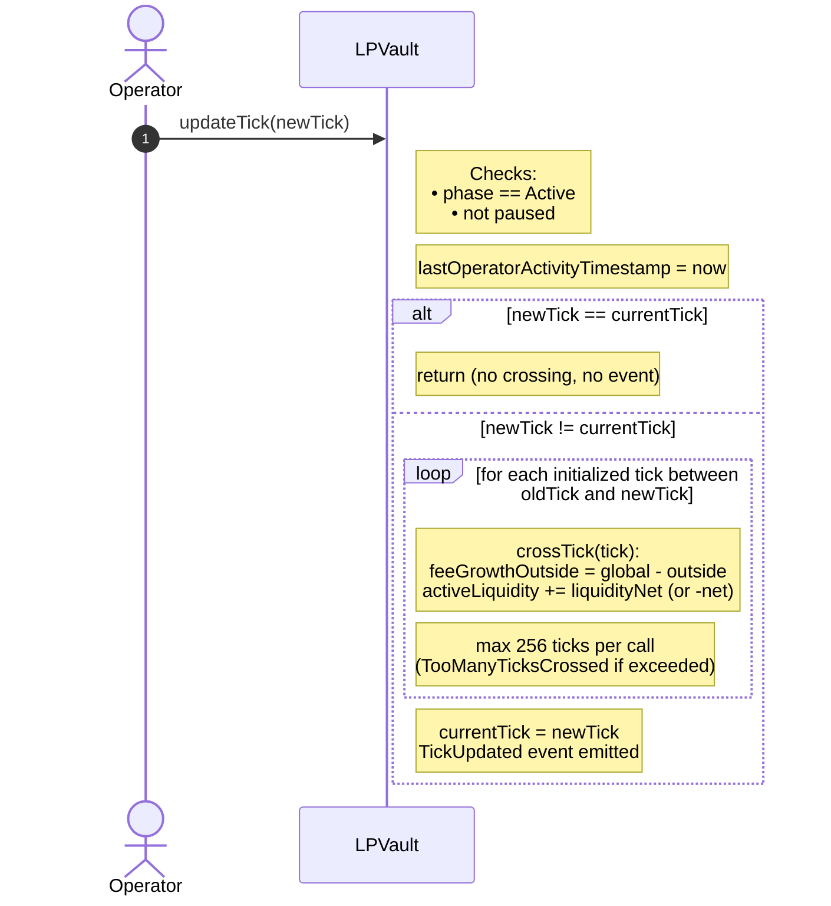
```mermaid
sequenceDiagram
    autonumber
    actor Operator
    participant Vault as LPVault

    Operator->>Vault: updateTick(newTick)
    Note right of Vault: Checks:<br/>• phase == Active<br/>• not paused
    Note right of Vault: lastOperatorActivityTimestamp = now

    alt newTick == currentTick
        Note right of Vault: return (no crossing, no event)
    else newTick != currentTick
        loop for each initialized tick between oldTick and newTick
            Note right of Vault: crossTick(tick):<br/>  feeGrowthOutside = global - outside<br/>  activeLiquidity += liquidityNet (or -net)
            Note right of Vault: max 256 ticks per call<br/>(TooManyTicksCrossed if exceeded)
        end

        Note right of Vault: currentTick = newTick<br/>TickUpdated event emitted
    end
```

**When to call:** The Keeper bot (holding an Operator key) reports the tick every 60 seconds and after fills. A report with the unchanged tick refreshes only the Operator heartbeat, so it costs about as little as `heartbeat()` and needs no second transaction. While the vault is paused or wound down, `updateTick` reverts and the Keeper calls `heartbeat()` instead.

**Chunking:** If the price has moved more than 256 initialized ticks, the Operator must call `updateTick` multiple times, landing on intermediate ticks to process the full range. The search reads only the bitmap words between `currentTick` and `newTick`, so a tick that an LP initialized far away costs nothing until the price reaches it. A large jump across empty words still reads one word per 256 ticks, so the Operator also chunks a very large jump.

---

### 2.4 Collect Fees (`collect`)

An LP withdraws their accrued trading fees from a position without removing the position itself.

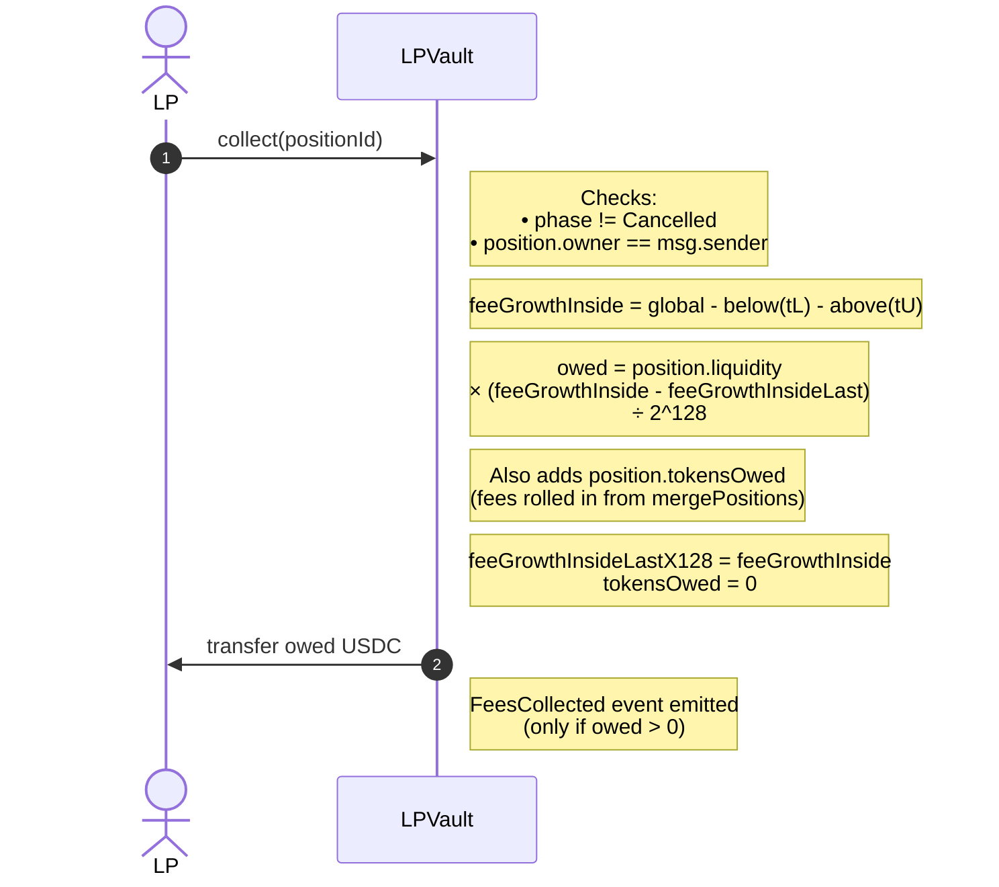
```mermaid
sequenceDiagram
    autonumber
    actor LP
    participant Vault as LPVault

    LP->>Vault: collect(positionId)
    Note right of Vault: Checks:<br/>• phase != Cancelled<br/>• position.owner == msg.sender

    Note right of Vault: feeGrowthInside = global - below(tL) - above(tU)
    Note right of Vault: owed = position.liquidity<br/>    × (feeGrowthInside - feeGrowthInsideLast)<br/>    ÷ 2^128
    Note right of Vault: Also adds position.tokensOwed<br/>(fees rolled in from mergePositions)
    Note right of Vault: feeGrowthInsideLastX128 = feeGrowthInside<br/>tokensOwed = 0

    Vault->>LP: transfer owed USDC
    Note right of Vault: FeesCollected event emitted<br/>(only if owed > 0)
```

**When to call:** Any time the LP wants to collect accrued fees. Works in both Active and WindDown phases. `feeGrowthInsideLastX128` is updated each call so subsequent collects only pay fees that accrued since the last collection.

---

### 2.5 Merge Positions (`mergePositions`)

Operator housekeeping: combines two or more same-range same-owner positions into one, preserving total liquidity and rolling up uncollected fees.

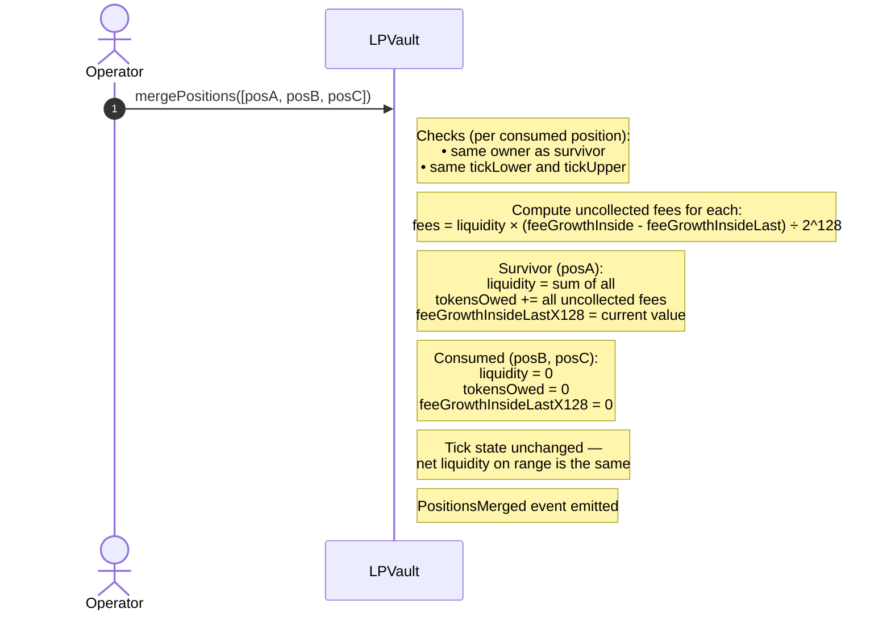
```mermaid
sequenceDiagram
    autonumber
    actor Operator
    participant Vault as LPVault

    Operator->>Vault: mergePositions([posA, posB, posC])
    Note right of Vault: Checks (per consumed position):<br/>• same owner as survivor<br/>• same tickLower and tickUpper

    Note right of Vault: Compute uncollected fees for each:<br/>fees = liquidity × (feeGrowthInside - feeGrowthInsideLast) ÷ 2^128
    Note right of Vault: Survivor (posA):<br/>  liquidity = sum of all<br/>  tokensOwed += all uncollected fees<br/>  feeGrowthInsideLastX128 = current value

    Note right of Vault: Consumed (posB, posC):<br/>  liquidity = 0<br/>  tokensOwed = 0<br/>  feeGrowthInsideLastX128 = 0

    Note right of Vault: Tick state unchanged —<br/>net liquidity on range is the same
    Note right of Vault: PositionsMerged event emitted
```

**When to call:** When an LP has accumulated multiple positions on the same range (common after repeated `mintPositionFor` calls). Merging reduces storage and gas for future operations.

---

### 2.6 Reclaim Deposit (`reclaimDeposit`, `reclaimDepositFor`)

One-call escape hatch for an LP whose escrowed intent the Operator never minted. The escrow record proves the deposit, so there is no timelock, no Operator co-signature, no phase check, and no pause check. Two entry points: the Safe calls `reclaimDeposit(intentId)` itself, or the owner key signs a `ReclaimIntent` and the Operator relays it through `reclaimDepositFor`.

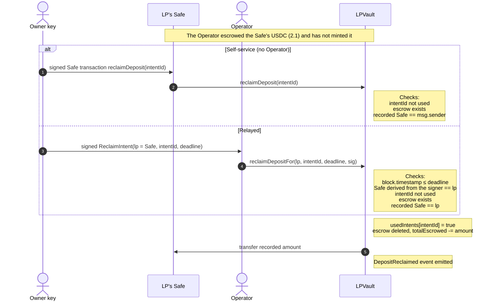
```mermaid
sequenceDiagram
    autonumber
    actor OwnerKey as Owner key
    participant Safe as LP's Safe
    actor Operator
    participant Vault as LPVault

    Note over Safe,Vault: The Operator escrowed the Safe's USDC (2.1) and has not minted it

    alt Self-service (no Operator)
        OwnerKey->>Safe: signed Safe transaction reclaimDeposit(intentId)
        Safe->>Vault: reclaimDeposit(intentId)
        Note right of Vault: Checks:<br/>intentId not used<br/>escrow exists<br/>recorded Safe == msg.sender
    else Relayed
        OwnerKey->>Operator: signed ReclaimIntent(lp = Safe, intentId, deadline)
        Operator->>Vault: reclaimDepositFor(lp, intentId, deadline, sig)
        Note right of Vault: Checks:<br/>block.timestamp ≤ deadline<br/>Safe derived from the signer == lp<br/>intentId not used<br/>escrow exists<br/>recorded Safe == lp
    end
    Note right of Vault: usedIntents[intentId] = true<br/>escrow deleted, totalEscrowed -= amount
    Vault->>Safe: transfer recorded amount
    Note right of Vault: DepositReclaimed event emitted
```

**When to call:** Whenever the LP wants the escrow back before the Operator mints it. The refund comes from the record, in every phase, paused or not, and with every Operator removed.

---

## 3. Emergency Procedures

### 3.1 Emergency Cancel All (`emergencyCancelAll`)

Any position holder can force-close all positions and distribute funds after 7 days of Operator silence. This is the last resort when the Operator is unresponsive.

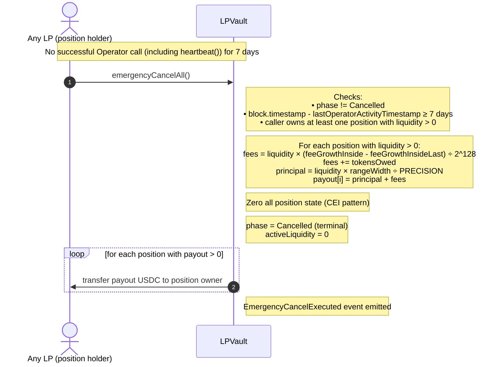
```mermaid
sequenceDiagram
    autonumber
    actor LP as Any LP (position holder)
    participant Vault as LPVault

    Note over LP,Vault: No successful Operator call (including heartbeat()) for 7 days

    LP->>Vault: emergencyCancelAll()
    Note right of Vault: Checks:<br/>• phase != Cancelled<br/>• block.timestamp - lastOperatorActivityTimestamp ≥ 7 days<br/>• caller owns at least one position with liquidity > 0

    Note right of Vault: For each position with liquidity > 0:<br/>  fees = liquidity × (feeGrowthInside - feeGrowthInsideLast) ÷ 2^128<br/>  fees += tokensOwed<br/>  principal = liquidity × rangeWidth ÷ PRECISION<br/>  payout[i] = principal + fees
    Note right of Vault: Zero all position state (CEI pattern)
    Note right of Vault: phase = Cancelled (terminal)<br/>activeLiquidity = 0

    loop for each position with payout > 0
        Vault->>LP: transfer payout USDC to position owner
    end

    Note right of Vault: EmergencyCancelExecuted event emitted
```

**When to call:** After 7 days without any successful Operator call (`depositForIntent`, `mintPositionFor`, `reclaimDepositFor`, `notifyFees`, `updateTick`, `mergePositions`, or `heartbeat`). The triggering LP does not need to be the admin — any active position holder can call it.

**Why CEI (checks-effects-interactions):** All position state is zeroed and the phase flipped to Cancelled **before** the USDC transfer loop. This prevents reentrancy even if USDC were a malicious token.

---

### 3.2 Pause and Unpause Trading

Admin can halt all trading entry points instantly as a circuit breaker. LP exit paths remain open so capital is never trapped.

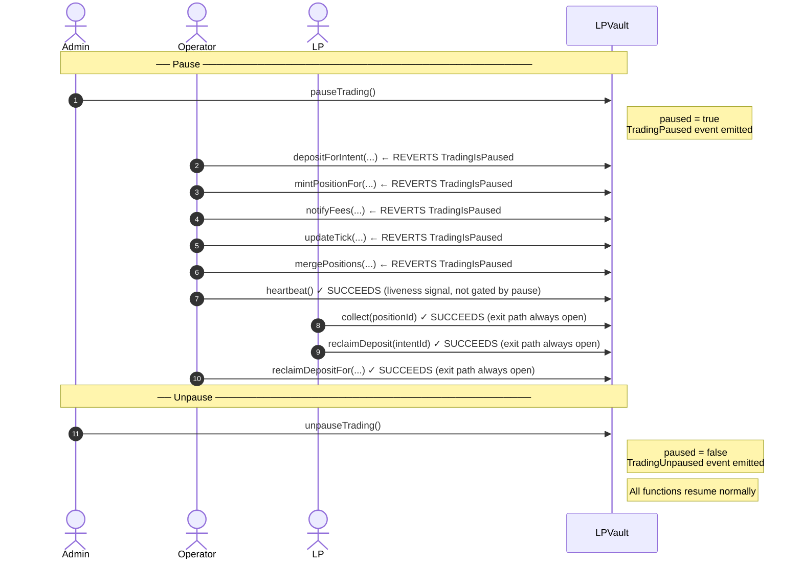
```mermaid
sequenceDiagram
    autonumber
    actor Admin
    actor Operator
    actor LP
    participant Vault as LPVault

    Note over Admin,Vault: ── Pause ────────────────────────────────────────────────
    Admin->>Vault: pauseTrading()
    Note right of Vault: paused = true<br/>TradingPaused event emitted

    Operator->>Vault: depositForIntent(...) ← REVERTS TradingIsPaused
    Operator->>Vault: mintPositionFor(...) ← REVERTS TradingIsPaused
    Operator->>Vault: notifyFees(...)      ← REVERTS TradingIsPaused
    Operator->>Vault: updateTick(...)      ← REVERTS TradingIsPaused
    Operator->>Vault: mergePositions(...)  ← REVERTS TradingIsPaused
    Operator->>Vault: heartbeat()          ✓ SUCCEEDS (liveness signal, not gated by pause)

    LP->>Vault: collect(positionId)        ✓ SUCCEEDS (exit path always open)
    LP->>Vault: reclaimDeposit(intentId)   ✓ SUCCEEDS (exit path always open)
    Operator->>Vault: reclaimDepositFor(...) ✓ SUCCEEDS (exit path always open)

    Note over Admin,Vault: ── Unpause ──────────────────────────────────────────────
    Admin->>Vault: unpauseTrading()
    Note right of Vault: paused = false<br/>TradingUnpaused event emitted
    Note right of Vault: All functions resume normally
```

**When to pause:** A bug is discovered, a market anomaly is detected, or an emergency audit is needed. Pause is immediate and does not affect the vault's phase state machine.

**Pause vs. emergencyCancelAll:** Pause is reversible and keeps positions intact. Emergency cancel is irreversible and distributes all funds.

---

## 4. Admin & Governance

### 4.1 Role Management

All role changes happen on the **factory** and immediately propagate to every vault it deployed (vaults read role state from the factory at call time).

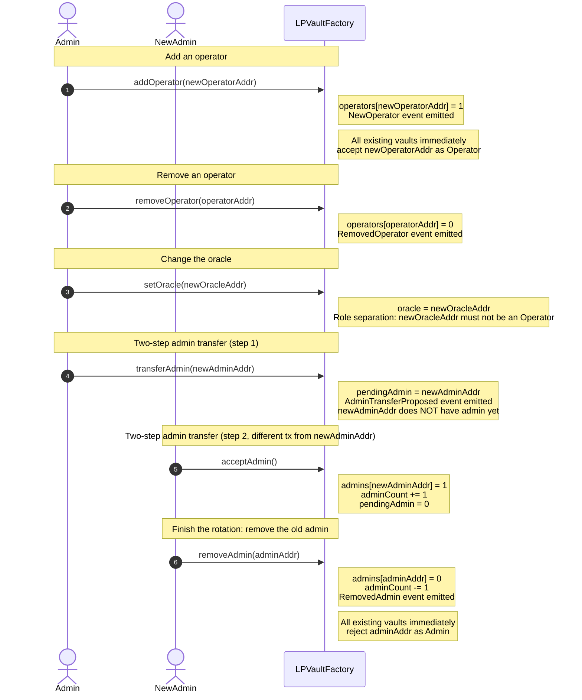
```mermaid
sequenceDiagram
    autonumber
    actor Admin
    actor NewAdmin
    participant Factory as LPVaultFactory

    Note over Admin,Factory: Add an operator
    Admin->>Factory: addOperator(newOperatorAddr)
    Note right of Factory: operators[newOperatorAddr] = 1<br/>NewOperator event emitted
    Note right of Factory: All existing vaults immediately<br/>accept newOperatorAddr as Operator

    Note over Admin,Factory: Remove an operator
    Admin->>Factory: removeOperator(operatorAddr)
    Note right of Factory: operators[operatorAddr] = 0<br/>RemovedOperator event emitted

    Note over Admin,Factory: Change the oracle
    Admin->>Factory: setOracle(newOracleAddr)
    Note right of Factory: oracle = newOracleAddr<br/>Role separation: newOracleAddr must not be an Operator

    Note over Admin,Factory: Two-step admin transfer (step 1)
    Admin->>Factory: transferAdmin(newAdminAddr)
    Note right of Factory: pendingAdmin = newAdminAddr<br/>AdminTransferProposed event emitted<br/>newAdminAddr does NOT have admin yet

    Note over NewAdmin,Factory: Two-step admin transfer (step 2, different tx from newAdminAddr)
    NewAdmin->>Factory: acceptAdmin()
    Note right of Factory: admins[newAdminAddr] = 1<br/>adminCount += 1<br/>pendingAdmin = 0

    Note over NewAdmin,Factory: Finish the rotation: remove the old admin
    NewAdmin->>Factory: removeAdmin(adminAddr)
    Note right of Factory: admins[adminAddr] = 0<br/>adminCount -= 1<br/>RemovedAdmin event emitted
    Note right of Factory: All existing vaults immediately<br/>reject adminAddr as Admin
```

**Key constraint:** `oracle` and every `operator` address must be distinct wallets. `setOracle` reverts if the new oracle is an existing operator, and `addOperator` reverts if the new operator is the current oracle.

**Admin rotation:** `acceptAdmin` adds the new admin but does not remove the old one. The old key keeps full admin rights until an admin calls `removeAdmin` on it. `removeAdmin` and `renounceAdminRole` never remove the last admin, and they withdraw any pending proposal to the removed address.

---

### 4.2 Upgradeable Implementation Pointer

The factory's `implementation` address (the EIP-1167 clone target for new vaults) can be rotated via a two-step 7-day timelock. Existing vaults are unaffected — EIP-1167 bakes the implementation address into each clone's bytecode at deploy time.

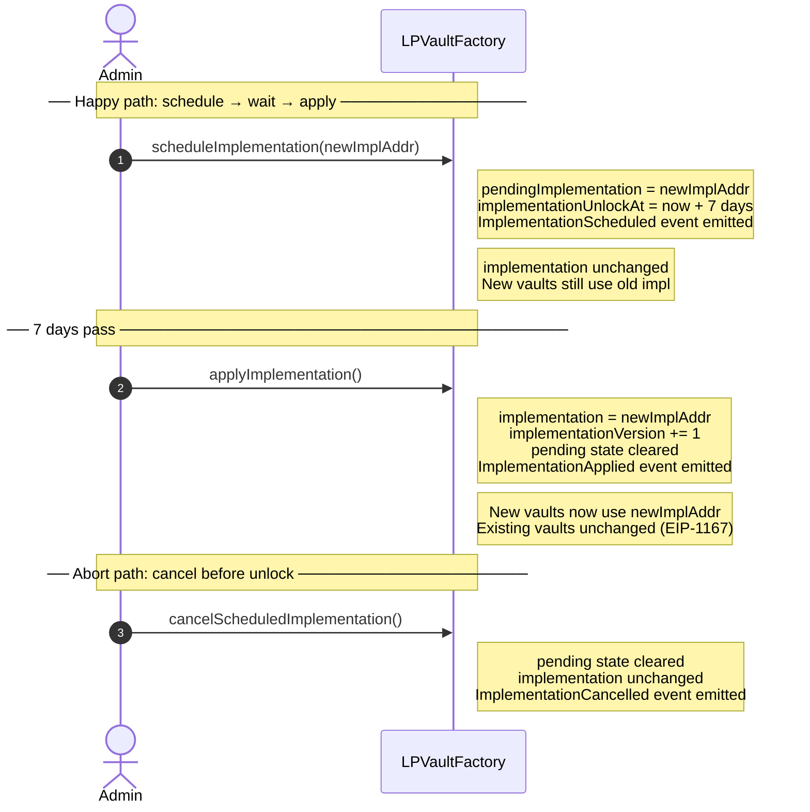
```mermaid
sequenceDiagram
    autonumber
    actor Admin
    participant Factory as LPVaultFactory

    Note over Admin,Factory: ── Happy path: schedule → wait → apply ─────────────────
    Admin->>Factory: scheduleImplementation(newImplAddr)
    Note right of Factory: pendingImplementation = newImplAddr<br/>implementationUnlockAt = now + 7 days<br/>ImplementationScheduled event emitted
    Note right of Factory: implementation unchanged<br/>New vaults still use old impl

    Note over Admin,Factory: ── 7 days pass ─────────────────────────────────────────

    Admin->>Factory: applyImplementation()
    Note right of Factory: implementation = newImplAddr<br/>implementationVersion += 1<br/>pending state cleared<br/>ImplementationApplied event emitted
    Note right of Factory: New vaults now use newImplAddr<br/>Existing vaults unchanged (EIP-1167)

    Note over Admin,Factory: ── Abort path: cancel before unlock ─────────────────────
    Admin->>Factory: cancelScheduledImplementation()
    Note right of Factory: pending state cleared<br/>implementation unchanged<br/>ImplementationCancelled event emitted
```

**`implementationVersion`** is stored per clone at `initialize()` time. Off-chain systems can call `vault.implementationVersion()` to know which code version a vault is running.

**Guards:**
- `scheduleImplementation(address(0))` reverts — prevents bricking the factory.
- Calling `applyImplementation()` before the timelock elapses reverts with `TimelockNotElapsed`.
- A second `scheduleImplementation` while one is already pending reverts with `ScheduleAlreadyPending` — cancel first if you want to change the scheduled address.

---

## Summary: Who Can Call What

| Function | Actor | Phase | Notes |
|----------|-------|-------|-------|
| `createVault` | Oracle | — | On factory |
| `startWindDown` | Oracle | Active | One-way; enables exit-only |
| `depositForIntent` | Operator | Active | Not paused; owner-key signature checked against the derived Safe |
| `mintPositionFor` | Operator | Active | Not paused; escrow required, no signature, no USDC |
| `notifyFees` | Operator | Active / WindDown | Not paused; activeLiquidity > 0 |
| `updateTick` | Operator | Active | Not paused; max 256 ticks |
| `mergePositions` | Operator | Active / WindDown | Not paused |
| `heartbeat` | Operator | Active / WindDown | Works while paused; refreshes the silence timer only |
| `collect` | LP (owner) | Active / WindDown | Always open; works while paused |
| `reclaimDeposit` | LP's Safe | Every phase | Always open; works while paused; no timelock |
| `reclaimDepositFor` | Operator | Every phase | Works while paused; owner-key ReclaimIntent with a deadline |
| `emergencyCancelAll` | Any position holder | Active / WindDown | After 7-day silence |
| `pauseTrading` | Admin | Any | On vault |
| `unpauseTrading` | Admin | Any | On vault |
| `addOperator` / `removeOperator` | Admin | — | On factory |
| `setOracle` | Admin | — | On factory |
| `transferAdmin` / `acceptAdmin` | Admin / pending | — | On factory |
| `addAdmin` / `removeAdmin` / `renounceAdminRole` | Admin | — | On factory; never removes the last admin |
| `scheduleImplementation` | Admin | — | On factory |
| `applyImplementation` | Admin | — | On factory; after 7-day timelock |
| `cancelScheduledImplementation` | Admin | — | On factory |
