# Method Reference

Per-method documentation for `LPVault` and `LPVaultFactory`, organized in the same four sections as [FLOWS.md](FLOWS.md). Each entry includes the function signature, actor, parameters, sequence diagram, events emitted, and revert conditions.

**Sections:**

1. [Vault Lifecycle](#1-vault-lifecycle)
2. [Transactional Methods](#2-transactional-methods)
3. [Emergency Procedures](#3-emergency-procedures)
4. [Admin & Governance](#4-admin--governance)

---

## 1. Vault Lifecycle

### `LPVaultFactory.constructor`

```solidity
constructor(
    address implementation_,
    address usdc_,
    address exchange_,
    address conditionalTokens_,
    address admin_,
    address oracle_,
    address operator_
)
```

**Actor:** Factory Owner (deployment-time only)

Deploys the factory, stores all external contract addresses, initialises the role registry with one admin, one oracle, and one operator, and sets `implementationVersion = 1`.

| Parameter | Type | Description |
|-----------|------|-------------|
| `implementation_` | `address` | LPVault implementation contract used as the EIP-1167 clone target |
| `usdc_` | `address` | USDC ERC-20 contract address |
| `exchange_` | `address` | ProphetCTFExchange contract address |
| `conditionalTokens_` | `address` | Gnosis ConditionalTokens (ERC-1155) contract address |
| `admin_` | `address` | Initial Admin wallet |
| `oracle_` | `address` | Initial Oracle wallet — must differ from `operator_` |
| `operator_` | `address` | Initial Operator wallet — must differ from `oracle_` |

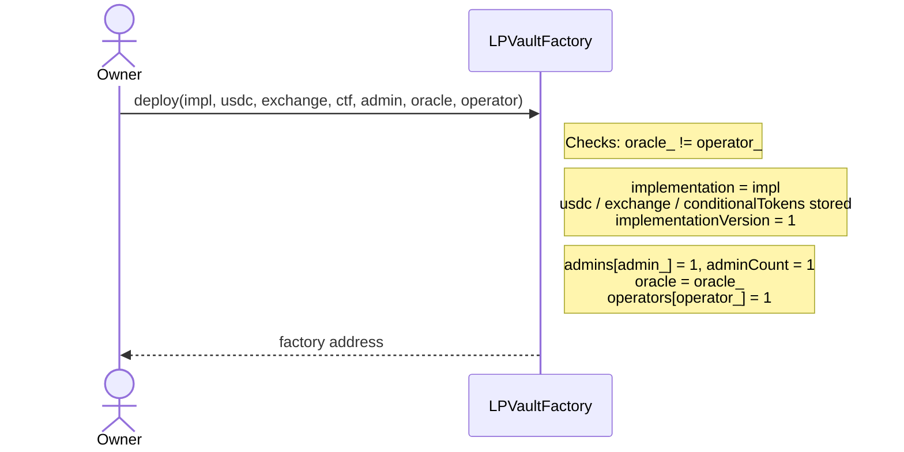
```mermaid
sequenceDiagram
    actor Owner
    participant Factory as LPVaultFactory

    Owner->>Factory: deploy(impl, usdc, exchange, ctf, admin, oracle, operator)
    Note right of Factory: Checks: oracle_ != operator_
    Note right of Factory: implementation = impl<br/>usdc / exchange / conditionalTokens stored<br/>implementationVersion = 1
    Note right of Factory: admins[admin_] = 1, adminCount = 1<br/>oracle = oracle_<br/>operators[operator_] = 1
    Factory-->>Owner: factory address
```

**Events:** none

**Reverts:**
- `RoleSeparation()` — `oracle_` equals `operator_`

---

### `LPVaultFactory.createVault`

```solidity
function createVault(
    bytes32 marketId_,
    int24   tickSpacing_,
    uint128 minimumFirstLiquidity_
) external onlyOracle returns (address vault)
```

**Actor:** Oracle

Deploys an EIP-1167 minimal-proxy clone of the current implementation, calls `initialize()` on it, and registers it in `vaultForMarket`.

| Parameter | Type | Description |
|-----------|------|-------------|
| `marketId_` | `bytes32` | Unique identifier for the market — must not already have a vault |
| `tickSpacing_` | `int24` | Minimum tick increment; all position bounds must be multiples of this value |
| `minimumFirstLiquidity_` | `uint128` | Floor on the liquidity value of the first mint (prevents inflation attacks); must be > 0 |

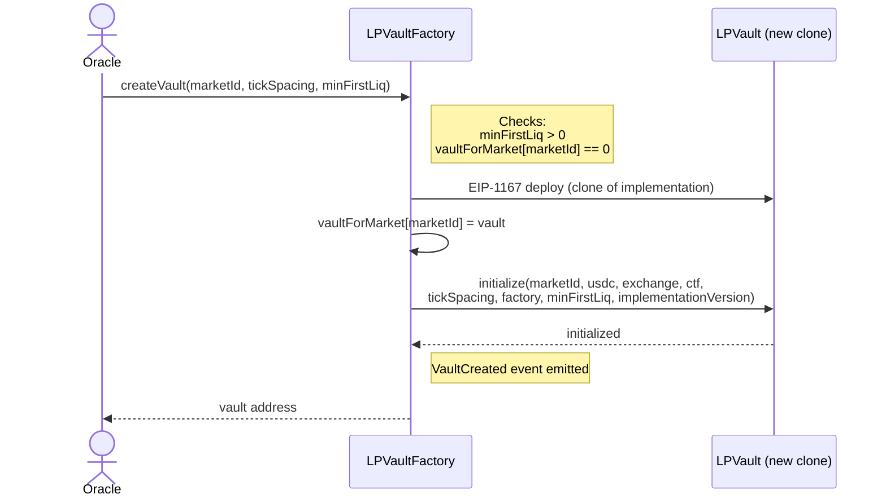
```mermaid
sequenceDiagram
    actor Oracle
    participant Factory as LPVaultFactory
    participant Vault as LPVault (new clone)

    Oracle->>Factory: createVault(marketId, tickSpacing, minFirstLiq)
    Note right of Factory: Checks:<br/>minFirstLiq > 0<br/>vaultForMarket[marketId] == 0
    Factory->>Vault: EIP-1167 deploy (clone of implementation)
    Factory->>Factory: vaultForMarket[marketId] = vault
    Factory->>Vault: initialize(marketId, usdc, exchange, ctf,<br/>tickSpacing, factory, minFirstLiq, implementationVersion)
    Vault-->>Factory: initialized
    Note right of Factory: VaultCreated event emitted
    Factory-->>Oracle: vault address
```

**Events:** `VaultCreated(bytes32 indexed marketId, address vault, uint128 minimumFirstLiquidity)`

**Reverts:**
- `NotOracle()` — caller is not the oracle
- `ZeroFloor()` — `minimumFirstLiquidity_` is 0
- `DuplicateMarket()` — a vault already exists for `marketId_`
- `CloneDeployFailed()` — EIP-1167 `create` returned address(0)

---

### `LPVault.initialize`

```solidity
function initialize(
    bytes32 marketId_,
    address usdc_,
    address exchange_,
    address conditionalTokens_,
    int24   tickSpacing_,
    address factory_,
    uint128 minimumFirstLiquidity_,
    uint256 version_
) external initializer
```

**Actor:** Factory only (enforced by `onlyFactory` check inside the function)

Called once by the factory immediately after cloning. Stores all per-vault configuration, sets the vault phase to Active, pre-approves the exchange for USDC and outcome tokens, and snapshots the EIP-712 domain separator.

| Parameter | Type | Description |
|-----------|------|-------------|
| `marketId_` | `bytes32` | Market identifier for this vault |
| `usdc_` | `address` | USDC ERC-20 address |
| `exchange_` | `address` | ProphetCTFExchange address |
| `conditionalTokens_` | `address` | Gnosis ConditionalTokens (ERC-1155) address |
| `tickSpacing_` | `int24` | Tick increment; all position bounds must align to this |
| `factory_` | `address` | Factory that deployed this clone — must equal `msg.sender` |
| `minimumFirstLiquidity_` | `uint128` | Floor for the first mint while `activeLiquidity == 0` |
| `version_` | `uint256` | Factory's `implementationVersion` at deploy time; stored for off-chain identification |

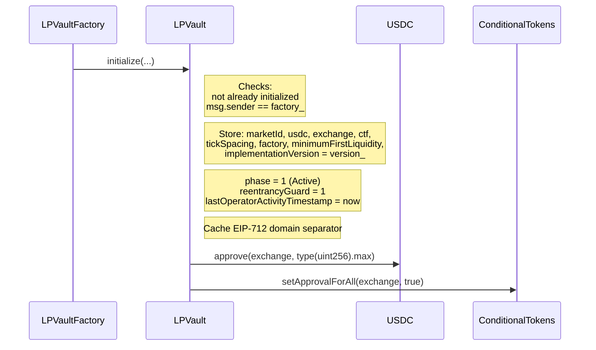
```mermaid
sequenceDiagram
    participant Factory as LPVaultFactory
    participant Vault as LPVault
    participant USDC
    participant CT as ConditionalTokens

    Factory->>Vault: initialize(...)
    Note right of Vault: Checks:<br/>not already initialized<br/>msg.sender == factory_
    Note right of Vault: Store: marketId, usdc, exchange, ctf,<br/>tickSpacing, factory, minimumFirstLiquidity,<br/>implementationVersion = version_
    Note right of Vault: phase = 1 (Active)<br/>reentrancyGuard = 1<br/>lastOperatorActivityTimestamp = now
    Note right of Vault: Cache EIP-712 domain separator
    Vault->>USDC: approve(exchange, type(uint256).max)
    Vault->>CT: setApprovalForAll(exchange, true)
```

**Events:** none

**Reverts:**
- `AlreadyInitialized()` — called a second time
- `NotFactory()` — `msg.sender != factory_`

---

### `LPVault.startWindDown`

```solidity
function startWindDown() external onlyOracle
```

**Actor:** Oracle

Transitions the vault from Active (phase 1) to WindDown (phase 2). One-way — there is no mechanism to revert to Active. After this call, `mintPositionFor` reverts; `collect`, `reclaimDeposit`, and `emergencyCancelAll` remain open.

| Parameter | Type | Description |
|-----------|------|-------------|
| — | — | No parameters |

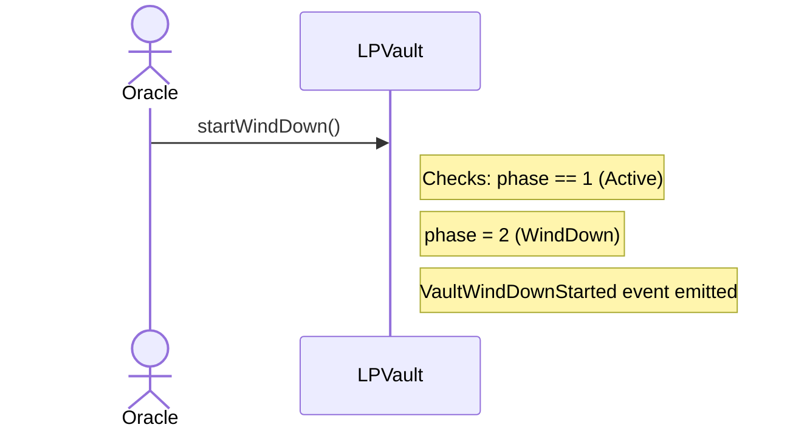
```mermaid
sequenceDiagram
    actor Oracle
    participant Vault as LPVault

    Oracle->>Vault: startWindDown()
    Note right of Vault: Checks: phase == 1 (Active)
    Note right of Vault: phase = 2 (WindDown)
    Note right of Vault: VaultWindDownStarted event emitted
```

**Events:** `VaultWindDownStarted(bytes32 indexed marketId)`

**Reverts:**
- `NotOracle()` — caller is not the oracle
- `VaultNotActive()` — vault is not in Active phase

---

### `LPVault.setMinimumFirstLiquidity`

```solidity
function setMinimumFirstLiquidity(uint128 newMin) external onlyOracle
```

**Actor:** Oracle

Updates the floor applied to the first mint on an empty vault (when `activeLiquidity == 0`). Callable at any time; takes effect on the next mint attempt while `activeLiquidity == 0`.

| Parameter | Type | Description |
|-----------|------|-------------|
| `newMin` | `uint128` | New minimum liquidity value; must be > 0 |

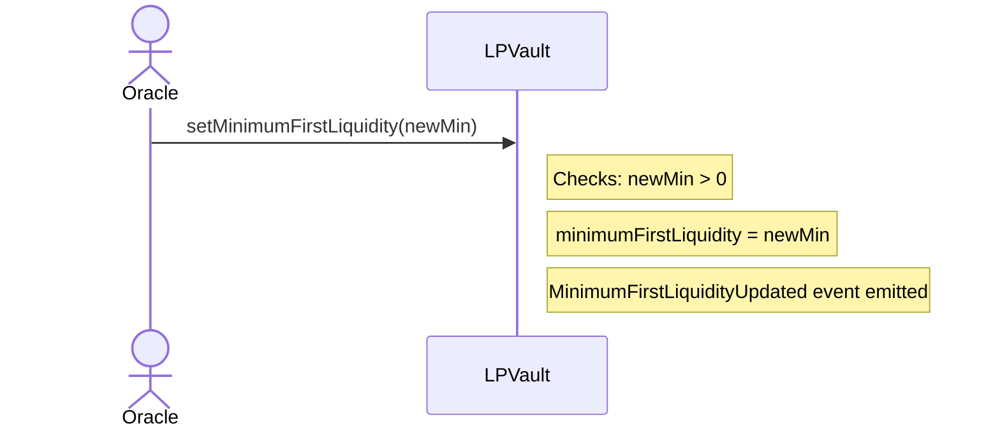
```mermaid
sequenceDiagram
    actor Oracle
    participant Vault as LPVault

    Oracle->>Vault: setMinimumFirstLiquidity(newMin)
    Note right of Vault: Checks: newMin > 0
    Note right of Vault: minimumFirstLiquidity = newMin
    Note right of Vault: MinimumFirstLiquidityUpdated event emitted
```

**Events:** `MinimumFirstLiquidityUpdated(uint128 oldMin, uint128 newMin)`

**Reverts:**
- `NotOracle()` — caller is not the oracle
- `ZeroFloor()` — `newMin` is 0

---

## 2. Transactional Methods

### `LPVault.mintPositionFor`

```solidity
function mintPositionFor(
    address  lp,
    int24    tickLower,
    int24    tickUpper,
    uint256  usdcAmount,
    bytes32  intentId,
    bytes calldata signature
) external onlyOperator nonReentrant returns (uint256 positionId)
```

**Actor:** Operator

Creates a concentrated-liquidity position for `lp` using an EIP-712 signed intent. Pulls USDC from the LP's wallet into the vault, initialises tick state, and records the position.

| Parameter | Type | Description |
|-----------|------|-------------|
| `lp` | `address` | LP wallet address — must match the EIP-712 signer |
| `tickLower` | `int24` | Lower bound of the price range; must be < `tickUpper` and aligned to `tickSpacing` |
| `tickUpper` | `int24` | Upper bound of the price range; must be > `tickLower` and aligned to `tickSpacing` |
| `usdcAmount` | `uint256` | USDC to pull from the LP's wallet; must be > 0 |
| `intentId` | `bytes32` | Unique identifier for replay protection; each `intentId` can only be used once |
| `signature` | `bytes` | 65-byte EIP-712 signature from `lp` over a `MintIntent` struct |

```mermaid
sequenceDiagram
    actor Operator
    participant Vault as LPVault
    participant USDC

    Operator->>Vault: mintPositionFor(lp, tL, tU, amount, intentId, sig)
    Note right of Vault: Checks:<br/>phase == Active, not paused<br/>usdcAmount > 0<br/>tickLower < tickUpper<br/>both ticks aligned to tickSpacing<br/>sig valid EIP-712 from lp<br/>intentId not used before<br/>liquidity >= minFirstLiq (if activeLiquidity==0)
    Note right of Vault: Mark intentId as used
    Note right of Vault: Compute liquidity = usdcAmount * PRECISION / rangeWidth
    Note right of Vault: Init ticks if new; update liquidityGross / liquidityNet
    Note right of Vault: Snapshot feeGrowthInsideLastX128 at mint time
    Note right of Vault: Create positions[positionId]
    Note right of Vault: Increment activeLiquidity if position is in-range
    Vault->>USDC: transferFrom(lp, vault, usdcAmount)
    Note right of Vault: PositionMinted event emitted
    Vault-->>Operator: positionId
```

**Events:** `PositionMinted(uint256 indexed positionId, address indexed owner, int24 tickLower, int24 tickUpper, uint128 liquidity, uint256 usdcAmount, bytes32 intentId)`

**Reverts:**
- `NotOperator()` — caller is not an operator
- `TradingIsPaused()` — vault is paused
- `VaultNotActive()` — vault is not in Active phase
- `ZeroAmount()` — `usdcAmount` is 0
- `InvalidRange()` — `tickLower >= tickUpper`
- `TickNotAligned()` — either tick is not a multiple of `tickSpacing`
- `InvalidSignature()` — signature is invalid, malformed, or not from `lp`
- `IntentAlreadyUsed()` — `intentId` was already used
- `BelowMinimumFirstLiquidity()` — first mint liquidity below floor
- `TransferFailed()` — USDC transfer failed

---

### `LPVault.notifyFees`

```solidity
function notifyFees(uint256 amount) external onlyOperator whenNotPaused
```

**Actor:** Operator

Increments the global Q128 fee accumulator by the per-unit share of `amount` distributed across `activeLiquidity`. The Operator is trusted to have deposited the corresponding USDC into the vault before calling.

| Parameter | Type | Description |
|-----------|------|-------------|
| `amount` | `uint256` | USDC fee revenue to distribute; must be > 0 |

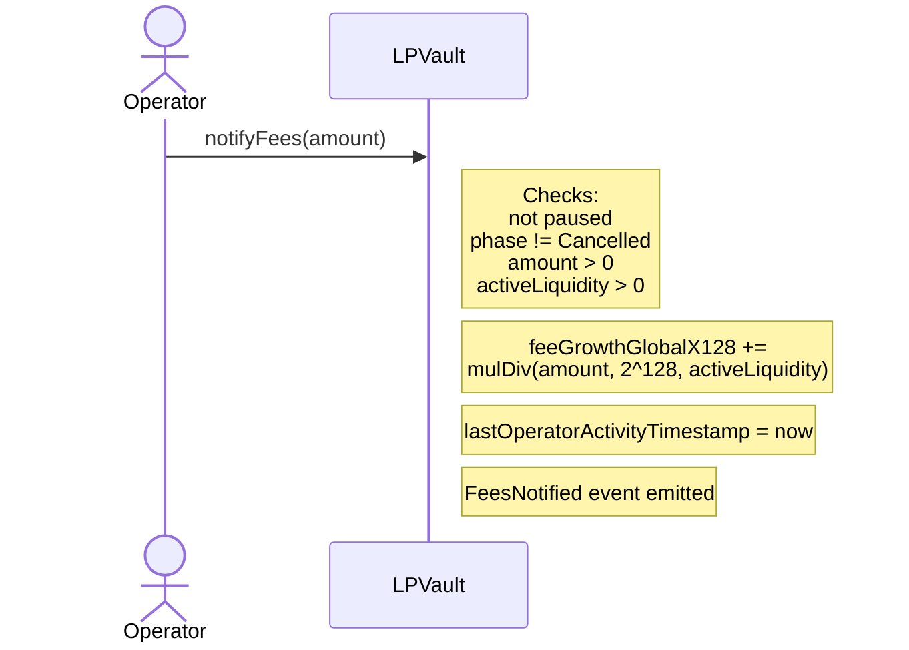
```mermaid
sequenceDiagram
    actor Operator
    participant Vault as LPVault

    Operator->>Vault: notifyFees(amount)
    Note right of Vault: Checks:<br/>not paused<br/>phase != Cancelled<br/>amount > 0<br/>activeLiquidity > 0
    Note right of Vault: feeGrowthGlobalX128 +=<br/>mulDiv(amount, 2^128, activeLiquidity)
    Note right of Vault: lastOperatorActivityTimestamp = now
    Note right of Vault: FeesNotified event emitted
```

**Events:** `FeesNotified(uint256 amount, uint256 feeGrowthGlobalX128)`

**Reverts:**
- `NotOperator()` — caller is not an operator
- `TradingIsPaused()` — vault is paused
- `VaultCancelled()` — vault is in terminal Cancelled phase
- `ZeroAmount()` — `amount` is 0
- `NoActiveLiquidity()` — `activeLiquidity` is 0

---

### `LPVault.updateTick`

```solidity
function updateTick(int24 newTick) external onlyOperator whenNotPaused nonReentrant
```

**Actor:** Operator

Synchronises the vault's price tick with the off-chain CLOB mid-price. Crosses every initialised tick between `currentTick` and `newTick`, flipping per-tick fee accumulators and adjusting `activeLiquidity`.

| Parameter | Type | Description |
|-----------|------|-------------|
| `newTick` | `int24` | The new price tick; must differ from `currentTick` |

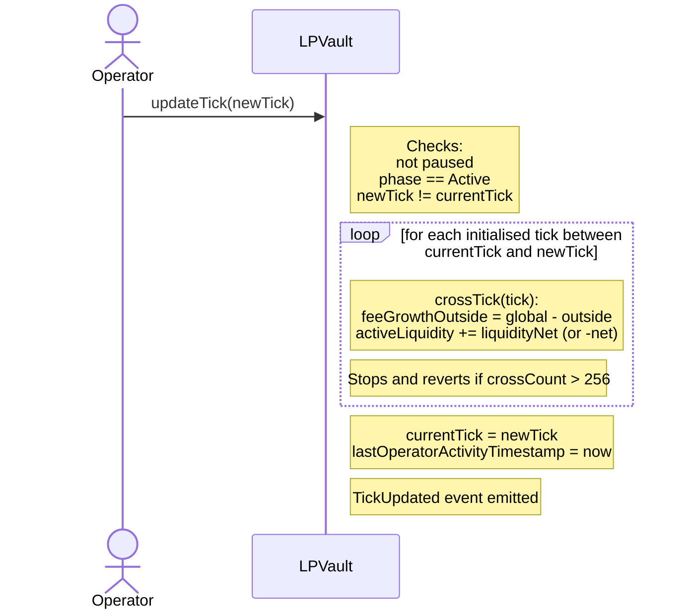
```mermaid
sequenceDiagram
    actor Operator
    participant Vault as LPVault

    Operator->>Vault: updateTick(newTick)
    Note right of Vault: Checks:<br/>not paused<br/>phase == Active<br/>newTick != currentTick

    loop for each initialised tick between currentTick and newTick
        Note right of Vault: crossTick(tick):<br/>feeGrowthOutside = global - outside<br/>activeLiquidity += liquidityNet (or -net)
        Note right of Vault: Stops and reverts if crossCount > 256
    end

    Note right of Vault: currentTick = newTick<br/>lastOperatorActivityTimestamp = now
    Note right of Vault: TickUpdated event emitted
```

**Events:** `TickUpdated(int24 indexed oldTick, int24 indexed newTick, uint256 ticksCrossed)`

**Reverts:**
- `NotOperator()` — caller is not an operator
- `TradingIsPaused()` — vault is paused
- `VaultNotActive()` — vault is not in Active phase
- `SameTick()` — `newTick` equals `currentTick`
- `TooManyTicksCrossed()` — more than 256 initialised ticks between old and new tick; call multiple times with intermediate values

---

### `LPVault.collect`

```solidity
function collect(uint256 positionId) external nonReentrant
```

**Actor:** LP (position owner)

Withdraws all accrued trading fees from a position. Computes fees since the last collect using the per-tick `feeGrowthOutside` accumulators, adds any `tokensOwed` (rolled in from `mergePositions`), and transfers USDC to the caller.

| Parameter | Type | Description |
|-----------|------|-------------|
| `positionId` | `uint256` | ID of the position to collect from |

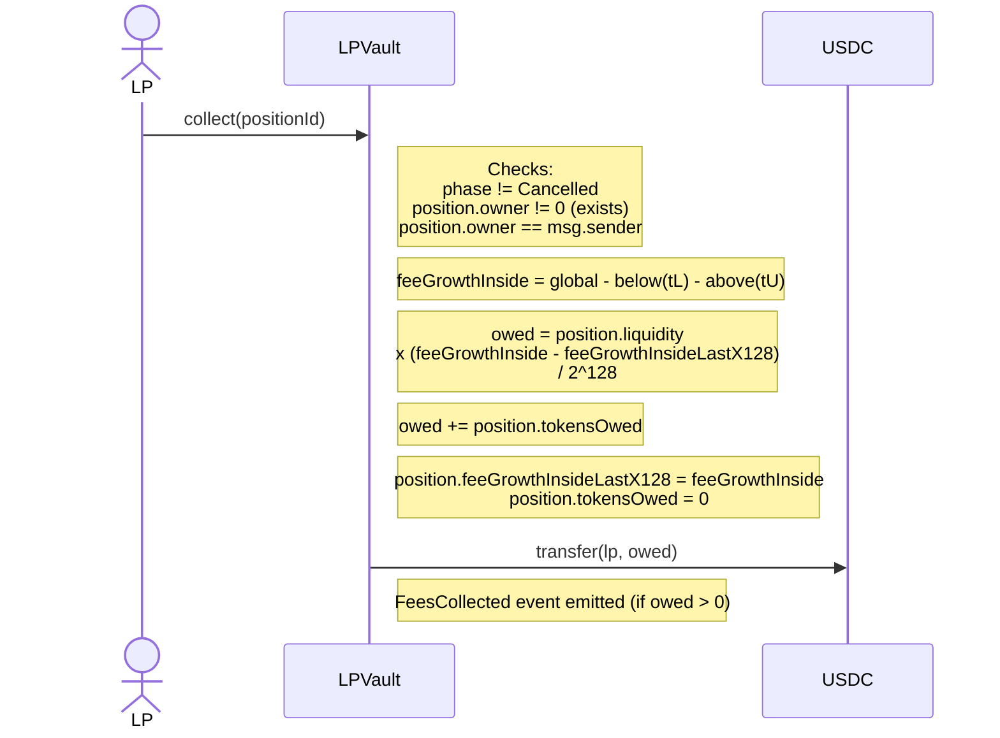
```mermaid
sequenceDiagram
    actor LP
    participant Vault as LPVault
    participant USDC

    LP->>Vault: collect(positionId)
    Note right of Vault: Checks:<br/>phase != Cancelled<br/>position.owner != 0 (exists)<br/>position.owner == msg.sender
    Note right of Vault: feeGrowthInside = global - below(tL) - above(tU)
    Note right of Vault: owed = position.liquidity<br/>    x (feeGrowthInside - feeGrowthInsideLastX128)<br/>    / 2^128
    Note right of Vault: owed += position.tokensOwed
    Note right of Vault: position.feeGrowthInsideLastX128 = feeGrowthInside<br/>position.tokensOwed = 0
    Vault->>USDC: transfer(lp, owed)
    Note right of Vault: FeesCollected event emitted (if owed > 0)
```

**Events:** `FeesCollected(uint256 indexed positionId, address indexed owner, uint256 amount)`

**Reverts:**
- `VaultCancelled()` — vault is in terminal Cancelled phase
- `PositionNotFound()` — no position exists at `positionId`
- `NotPositionOwner()` — caller does not own this position

---

### `LPVault.mergePositions`

```solidity
function mergePositions(uint256[] calldata positionIds)
    external onlyOperator whenNotPaused nonReentrant
```

**Actor:** Operator

Combines two or more same-range same-owner positions into the first entry (`positionIds[0]`). Rolls up uncollected fees into the survivor's `tokensOwed`, sums liquidity, and zeroes consumed positions. Tick state is unchanged (net liquidity on the range is the same).

| Parameter | Type | Description |
|-----------|------|-------------|
| `positionIds` | `uint256[]` | Array of position IDs to merge; must have at least 2 elements; all must share the same owner, `tickLower`, and `tickUpper` |

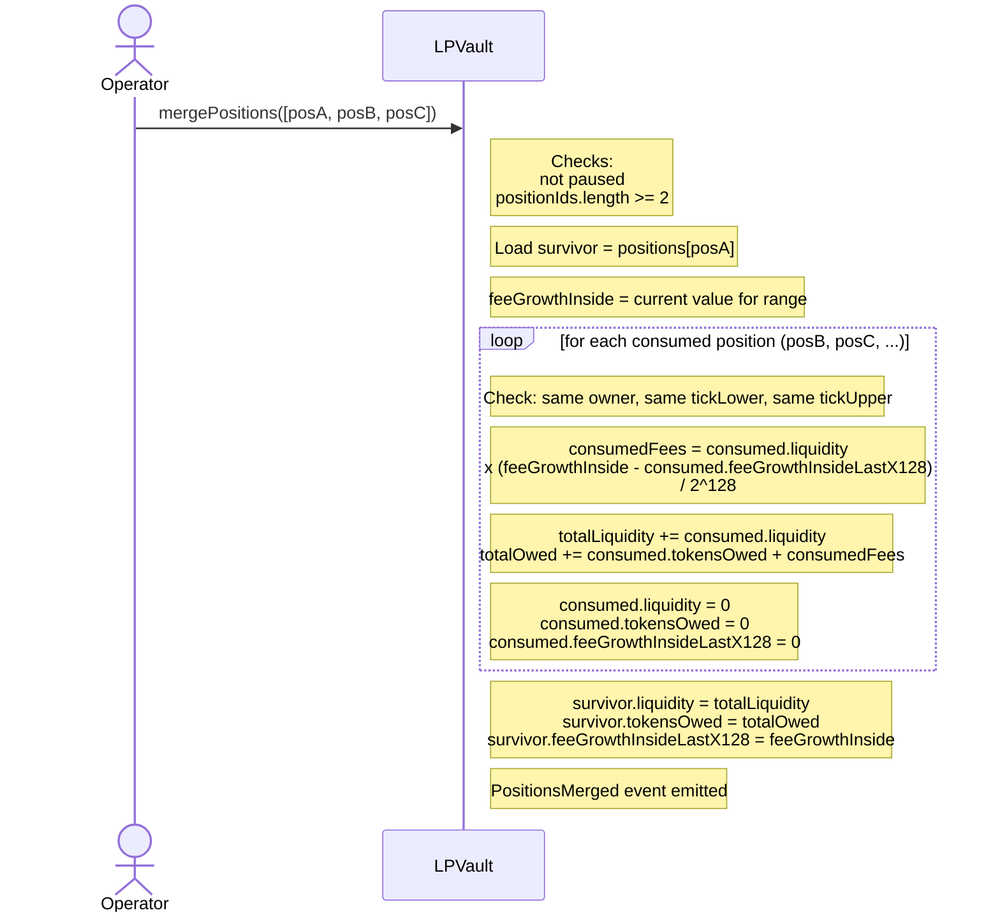
```mermaid
sequenceDiagram
    actor Operator
    participant Vault as LPVault

    Operator->>Vault: mergePositions([posA, posB, posC])
    Note right of Vault: Checks:<br/>not paused<br/>positionIds.length >= 2

    Note right of Vault: Load survivor = positions[posA]
    Note right of Vault: feeGrowthInside = current value for range

    loop for each consumed position (posB, posC, ...)
        Note right of Vault: Check: same owner, same tickLower, same tickUpper
        Note right of Vault: consumedFees = consumed.liquidity<br/>    x (feeGrowthInside - consumed.feeGrowthInsideLastX128)<br/>    / 2^128
        Note right of Vault: totalLiquidity += consumed.liquidity<br/>totalOwed += consumed.tokensOwed + consumedFees
        Note right of Vault: consumed.liquidity = 0<br/>consumed.tokensOwed = 0<br/>consumed.feeGrowthInsideLastX128 = 0
    end

    Note right of Vault: survivor.liquidity = totalLiquidity<br/>survivor.tokensOwed = totalOwed<br/>survivor.feeGrowthInsideLastX128 = feeGrowthInside
    Note right of Vault: PositionsMerged event emitted
```

**Events:** `PositionsMerged(uint256[] positionIds, uint256 survivorId)`

**Reverts:**
- `NotOperator()` — caller is not an operator
- `TradingIsPaused()` — vault is paused
- `InsufficientPositions()` — fewer than 2 position IDs provided
- `RangeMismatch()` — any consumed position has a different owner, `tickLower`, or `tickUpper` than the survivor

---

### `LPVault.reclaimDeposit`

```solidity
function reclaimDeposit(
    address  lp,
    int24    tickLower,
    int24    tickUpper,
    uint256  usdcAmount,
    bytes32  intentId,
    bytes calldata lpSignature,
    bytes calldata operatorSignature
) external nonReentrant
```

**Actor:** LP

Two-phase escape hatch for recovering USDC from an unfulfilled mint intent. **Phase 1** (first call): records `intentTimestamps[intentId]` and emits `ReclaimSubmitted`. **Phase 2** (same call arguments, after 24 hours): marks the intent as used and transfers `usdcAmount` back to `lp`.

| Parameter | Type | Description |
|-----------|------|-------------|
| `lp` | `address` | LP wallet address — must equal `msg.sender` |
| `tickLower` | `int24` | Lower tick from the original `MintIntent` |
| `tickUpper` | `int24` | Upper tick from the original `MintIntent` |
| `usdcAmount` | `uint256` | USDC amount from the original `MintIntent` |
| `intentId` | `bytes32` | Unique identifier from the original `MintIntent` |
| `lpSignature` | `bytes` | EIP-712 signature from `lp` over the `MintIntent` struct |
| `operatorSignature` | `bytes` | EIP-712 signature from a registered Operator over the same `MintIntent` struct (deposit acknowledgement) |

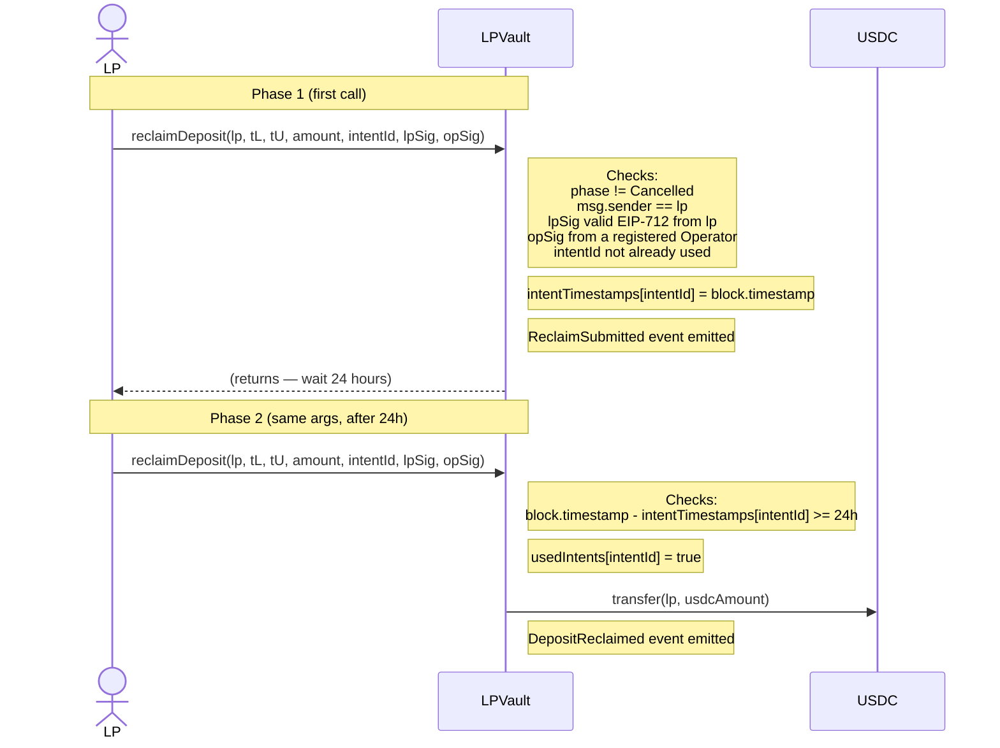
```mermaid
sequenceDiagram
    actor LP
    participant Vault as LPVault
    participant USDC

    Note over LP,Vault: Phase 1 (first call)
    LP->>Vault: reclaimDeposit(lp, tL, tU, amount, intentId, lpSig, opSig)
    Note right of Vault: Checks:<br/>phase != Cancelled<br/>msg.sender == lp<br/>lpSig valid EIP-712 from lp<br/>opSig from a registered Operator<br/>intentId not already used
    Note right of Vault: intentTimestamps[intentId] = block.timestamp
    Note right of Vault: ReclaimSubmitted event emitted
    Vault-->>LP: (returns — wait 24 hours)

    Note over LP,Vault: Phase 2 (same args, after 24h)
    LP->>Vault: reclaimDeposit(lp, tL, tU, amount, intentId, lpSig, opSig)
    Note right of Vault: Checks:<br/>block.timestamp - intentTimestamps[intentId] >= 24h
    Note right of Vault: usedIntents[intentId] = true
    Vault->>USDC: transfer(lp, usdcAmount)
    Note right of Vault: DepositReclaimed event emitted
```

**Events:**
- Phase 1: `ReclaimSubmitted(bytes32 indexed intentId, address indexed lp, uint256 usdcAmount)`
- Phase 2: `DepositReclaimed(bytes32 indexed intentId, address indexed lp, uint256 usdcAmount)`

**Reverts:**
- `VaultCancelled()` — vault is in terminal Cancelled phase
- `NotIntentOwner()` — `msg.sender != lp`
- `InvalidSignature()` — either signature is invalid or operator signature is not from a registered operator
- `IntentAlreadyUsed()` — `intentId` was already consumed by `mintPositionFor` or a prior reclaim
- `TimelockNotElapsed()` — Phase 2 called before 24 hours have passed

---

## 3. Emergency Procedures

### `LPVault.emergencyCancelAll`

```solidity
function emergencyCancelAll() external nonReentrant
```

**Actor:** Any position holder (after operator-silence timelock)

Force-closes all open positions, computes each owner's payout (principal + fees), zeroes all position state, transitions the vault to terminal Cancelled phase, and transfers USDC to each owner. Callable after 7 days without any `notifyFees` or `updateTick` call.

| Parameter | Type | Description |
|-----------|------|-------------|
| — | — | No parameters |

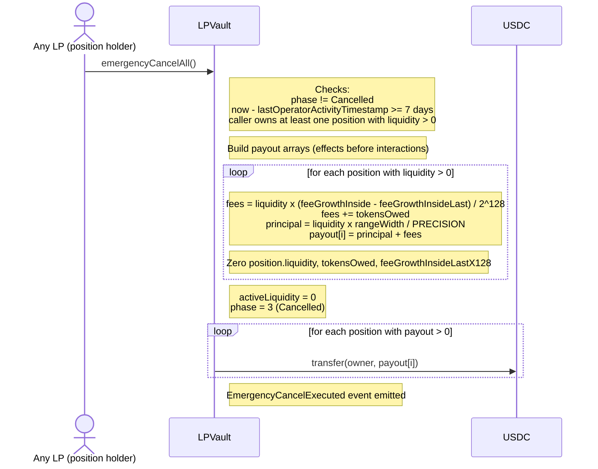
```mermaid
sequenceDiagram
    actor LP as Any LP (position holder)
    participant Vault as LPVault
    participant USDC

    LP->>Vault: emergencyCancelAll()
    Note right of Vault: Checks:<br/>phase != Cancelled<br/>now - lastOperatorActivityTimestamp >= 7 days<br/>caller owns at least one position with liquidity > 0

    Note right of Vault: Build payout arrays (effects before interactions)
    loop for each position with liquidity > 0
        Note right of Vault: fees = liquidity x (feeGrowthInside - feeGrowthInsideLast) / 2^128<br/>fees += tokensOwed<br/>principal = liquidity x rangeWidth / PRECISION<br/>payout[i] = principal + fees
        Note right of Vault: Zero position.liquidity, tokensOwed, feeGrowthInsideLastX128
    end

    Note right of Vault: activeLiquidity = 0<br/>phase = 3 (Cancelled)

    loop for each position with payout > 0
        Vault->>USDC: transfer(owner, payout[i])
    end

    Note right of Vault: EmergencyCancelExecuted event emitted
```

**Events:** `EmergencyCancelExecuted(address indexed caller)`

**Reverts:**
- `VaultCancelled()` — vault is already in Cancelled phase
- `TimelockNotElapsed()` — fewer than 7 days since last operator activity
- `NoPositionHeld()` — caller does not own any position with `liquidity > 0`

---

### `LPVault.pauseTrading`

```solidity
function pauseTrading() external onlyAdmin
```

**Actor:** Admin

Sets `paused = true`, immediately blocking `mintPositionFor`, `notifyFees`, `updateTick`, and `mergePositions`. LP exit paths (`collect`, `reclaimDeposit`, `emergencyCancelAll`) are unaffected. Does not change the vault's phase.

| Parameter | Type | Description |
|-----------|------|-------------|
| — | — | No parameters |

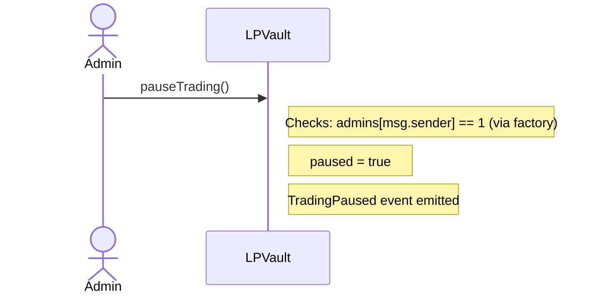
```mermaid
sequenceDiagram
    actor Admin
    participant Vault as LPVault

    Admin->>Vault: pauseTrading()
    Note right of Vault: Checks: admins[msg.sender] == 1 (via factory)
    Note right of Vault: paused = true
    Note right of Vault: TradingPaused event emitted
```

**Events:** `TradingPaused(address indexed caller)`

**Reverts:**
- `NotAdmin()` — caller is not a registered admin

---

### `LPVault.unpauseTrading`

```solidity
function unpauseTrading() external onlyAdmin
```

**Actor:** Admin

Sets `paused = false`, restoring normal operation of all trading entry points.

| Parameter | Type | Description |
|-----------|------|-------------|
| — | — | No parameters |

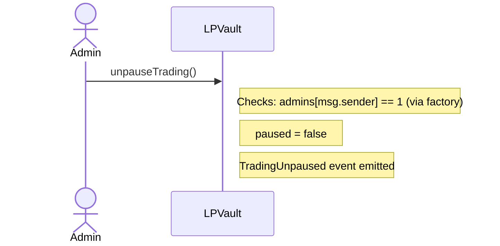
```mermaid
sequenceDiagram
    actor Admin
    participant Vault as LPVault

    Admin->>Vault: unpauseTrading()
    Note right of Vault: Checks: admins[msg.sender] == 1 (via factory)
    Note right of Vault: paused = false
    Note right of Vault: TradingUnpaused event emitted
```

**Events:** `TradingUnpaused(address indexed caller)`

**Reverts:**
- `NotAdmin()` — caller is not a registered admin

---

## 4. Admin & Governance

### `LPVaultFactory.addOperator`

```solidity
function addOperator(address operator_) external onlyAdmin
```

**Actor:** Admin

Registers a new address as an Operator. Takes effect immediately on all vaults deployed by this factory.

| Parameter | Type | Description |
|-----------|------|-------------|
| `operator_` | `address` | Address to register as Operator; must not be the current oracle |

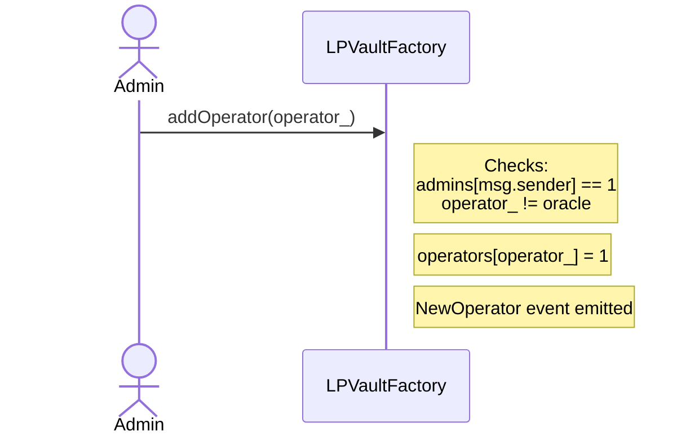
```mermaid
sequenceDiagram
    actor Admin
    participant Factory as LPVaultFactory

    Admin->>Factory: addOperator(operator_)
    Note right of Factory: Checks:<br/>admins[msg.sender] == 1<br/>operator_ != oracle
    Note right of Factory: operators[operator_] = 1
    Note right of Factory: NewOperator event emitted
```

**Events:** `NewOperator(address indexed newOperatorAddress, address indexed admin)`

**Reverts:**
- `NotAdmin()` — caller is not a registered admin
- `RoleSeparation()` — `operator_` is the current oracle

---

### `LPVaultFactory.removeOperator`

```solidity
function removeOperator(address operator_) external onlyAdmin
```

**Actor:** Admin

Deregisters an Operator. Takes effect immediately on all vaults.

| Parameter | Type | Description |
|-----------|------|-------------|
| `operator_` | `address` | Address to remove from the Operator set |

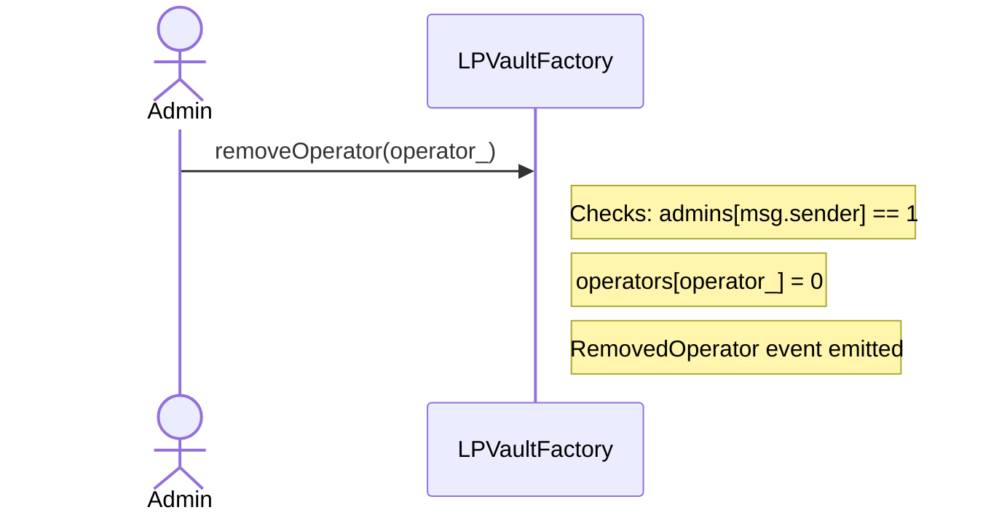
```mermaid
sequenceDiagram
    actor Admin
    participant Factory as LPVaultFactory

    Admin->>Factory: removeOperator(operator_)
    Note right of Factory: Checks: admins[msg.sender] == 1
    Note right of Factory: operators[operator_] = 0
    Note right of Factory: RemovedOperator event emitted
```

**Events:** `RemovedOperator(address indexed removedOperator, address indexed admin)`

**Reverts:**
- `NotAdmin()` — caller is not a registered admin

---

### `LPVaultFactory.setOracle`

```solidity
function setOracle(address newOracle) external onlyAdmin
```

**Actor:** Admin

Updates the oracle address. Takes effect immediately on all vaults. The new oracle must not currently be an Operator.

| Parameter | Type | Description |
|-----------|------|-------------|
| `newOracle` | `address` | New oracle wallet address; must not be a registered operator |

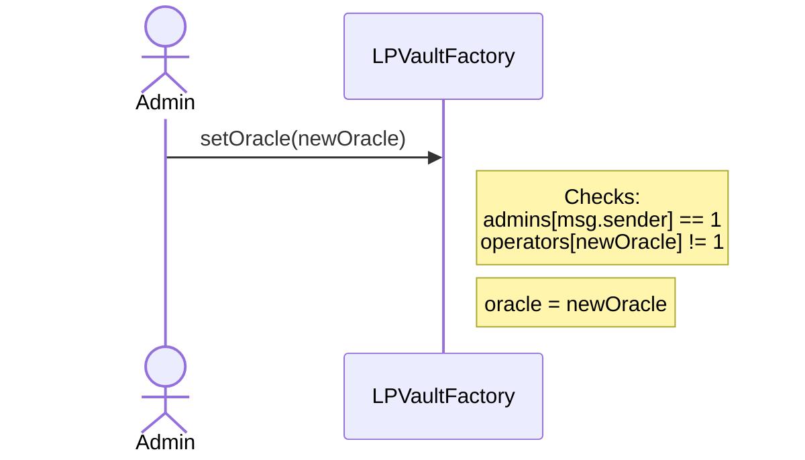
```mermaid
sequenceDiagram
    actor Admin
    participant Factory as LPVaultFactory

    Admin->>Factory: setOracle(newOracle)
    Note right of Factory: Checks:<br/>admins[msg.sender] == 1<br/>operators[newOracle] != 1
    Note right of Factory: oracle = newOracle
```

**Events:** none

**Reverts:**
- `NotAdmin()` — caller is not a registered admin
- `RoleSeparation()` — `newOracle` is currently a registered operator

---

### `LPVaultFactory.transferAdmin`

```solidity
function transferAdmin(address newAdmin) external onlyAdmin
```

**Actor:** Admin (current)

Step 1 of a two-step admin transfer. Records `newAdmin` as the pending admin without granting the role. The pending admin must call `acceptAdmin()` to complete the transfer.

| Parameter | Type | Description |
|-----------|------|-------------|
| `newAdmin` | `address` | Proposed new admin wallet; must not be address(0) and must not already be an admin |

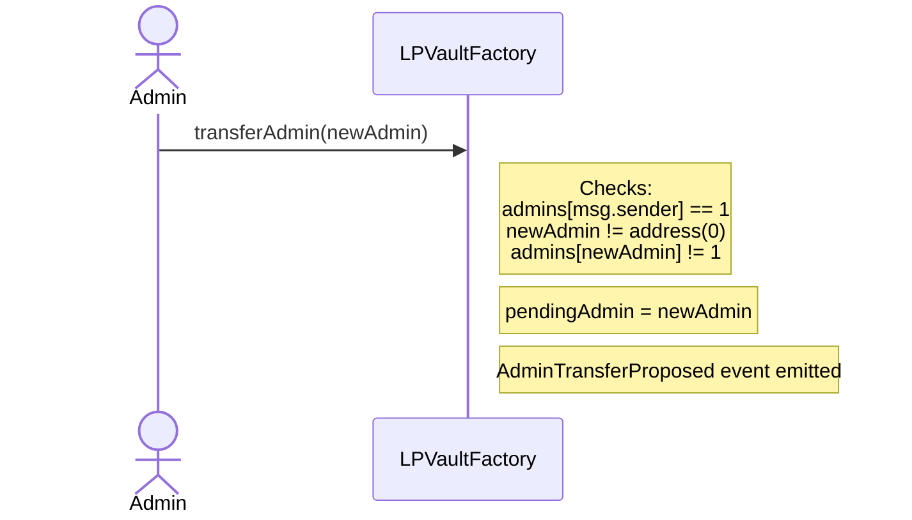
```mermaid
sequenceDiagram
    actor Admin
    participant Factory as LPVaultFactory

    Admin->>Factory: transferAdmin(newAdmin)
    Note right of Factory: Checks:<br/>admins[msg.sender] == 1<br/>newAdmin != address(0)<br/>admins[newAdmin] != 1
    Note right of Factory: pendingAdmin = newAdmin
    Note right of Factory: AdminTransferProposed event emitted
```

**Events:** `AdminTransferProposed(address indexed currentAdmin, address indexed proposedAdmin)`

**Reverts:**
- `NotAdmin()` — caller is not a registered admin
- `ZeroAddress()` — `newAdmin` is address(0)
- `AlreadyAdmin()` — `newAdmin` is already a registered admin

---

### `LPVaultFactory.acceptAdmin`

```solidity
function acceptAdmin() external
```

**Actor:** Pending admin (set by `transferAdmin`)

Step 2 of a two-step admin transfer. Grants the admin role to `msg.sender`, increments `adminCount`, and clears `pendingAdmin`.

| Parameter | Type | Description |
|-----------|------|-------------|
| — | — | No parameters |

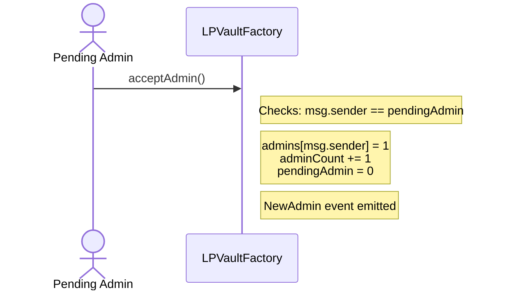
```mermaid
sequenceDiagram
    actor NewAdmin as Pending Admin
    participant Factory as LPVaultFactory

    NewAdmin->>Factory: acceptAdmin()
    Note right of Factory: Checks: msg.sender == pendingAdmin
    Note right of Factory: admins[msg.sender] = 1<br/>adminCount += 1<br/>pendingAdmin = 0
    Note right of Factory: NewAdmin event emitted
```

**Events:** `NewAdmin(address indexed newAdminAddress, address indexed admin)`

**Reverts:**
- `NotPendingAdmin()` — caller is not the current `pendingAdmin`

---

### `LPVaultFactory.scheduleImplementation`

```solidity
function scheduleImplementation(address newImpl) external onlyAdmin
```

**Actor:** Admin

Step 1 of a two-step timelocked implementation upgrade. Records the pending implementation address and sets `implementationUnlockAt` to 7 days from now. Does not change the active `implementation`.

| Parameter | Type | Description |
|-----------|------|-------------|
| `newImpl` | `address` | New LPVault implementation contract to schedule; must not be address(0) |

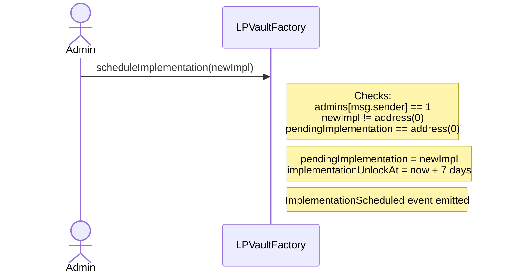
```mermaid
sequenceDiagram
    actor Admin
    participant Factory as LPVaultFactory

    Admin->>Factory: scheduleImplementation(newImpl)
    Note right of Factory: Checks:<br/>admins[msg.sender] == 1<br/>newImpl != address(0)<br/>pendingImplementation == address(0)
    Note right of Factory: pendingImplementation = newImpl<br/>implementationUnlockAt = now + 7 days
    Note right of Factory: ImplementationScheduled event emitted
```

**Events:** `ImplementationScheduled(address indexed newImpl, uint256 unlockAt)`

**Reverts:**
- `NotAdmin()` — caller is not a registered admin
- `ZeroAddress()` — `newImpl` is address(0)
- `ScheduleAlreadyPending()` — a schedule is already pending; cancel first

---

### `LPVaultFactory.applyImplementation`

```solidity
function applyImplementation() external onlyAdmin
```

**Actor:** Admin

Step 2 of a two-step timelocked implementation upgrade. Updates `implementation` to the pending address, increments `implementationVersion`, and clears the pending state. Can only be called after `implementationUnlockAt` has passed.

| Parameter | Type | Description |
|-----------|------|-------------|
| — | — | No parameters |

```mermaid
sequenceDiagram
    actor Admin
    participant Factory as LPVaultFactory

    Admin->>Factory: applyImplementation()
    Note right of Factory: Checks:<br/>admins[msg.sender] == 1<br/>pendingImplementation != address(0)<br/>now >= implementationUnlockAt
    Note right of Factory: implementation = pendingImplementation<br/>implementationVersion += 1<br/>pendingImplementation = 0<br/>implementationUnlockAt = 0
    Note right of Factory: ImplementationApplied event emitted
```

**Events:** `ImplementationApplied(address indexed newImpl, uint256 version)`

**Reverts:**
- `NotAdmin()` — caller is not a registered admin
- `NoPendingSchedule()` — no implementation is scheduled
- `TimelockNotElapsed()` — called before `implementationUnlockAt`

---

### `LPVaultFactory.cancelScheduledImplementation`

```solidity
function cancelScheduledImplementation() external onlyAdmin
```

**Actor:** Admin

Aborts a pending implementation upgrade, clearing `pendingImplementation` and `implementationUnlockAt`. The active `implementation` is unchanged.

| Parameter | Type | Description |
|-----------|------|-------------|
| — | — | No parameters |

```mermaid
sequenceDiagram
    actor Admin
    participant Factory as LPVaultFactory

    Admin->>Factory: cancelScheduledImplementation()
    Note right of Factory: Checks:<br/>admins[msg.sender] == 1<br/>pendingImplementation != address(0)
    Note right of Factory: pendingImplementation = 0<br/>implementationUnlockAt = 0
    Note right of Factory: ImplementationCancelled event emitted
```

**Events:** `ImplementationCancelled(address indexed cancelledImpl)`

**Reverts:**
- `NotAdmin()` — caller is not a registered admin
- `NoPendingSchedule()` — no implementation is currently scheduled
