# Method Reference

Per-method documentation for `LPVault` and `LPVaultFactory`, organized in the same four sections as [FLOWS.md](FLOWS.md). Each entry includes the function signature, actor, parameters, sequence diagram, events emitted, and revert conditions.

**Sections:**

1. [Vault Lifecycle](#1-vault-lifecycle)
2. [Transactional Methods](#2-transactional-methods)
3. [Emergency Procedures](#3-emergency-procedures)
4. [Admin & Governance](#4-admin--governance)

---

## 1. Vault Lifecycle

### `LPVaultFactory.constructor`

```solidity
constructor(
    address implementation_,
    address usdc_,
    address exchange_,
    address conditionalTokens_,
    address admin_,
    address oracle_,
    address operator_,
    address safeFactory_,
    bytes32 safeProxyBytecodeHash_
)
```

**Actor:** Factory Owner (deployment-time only)

Deploys the factory, stores all external contract addresses and the two Safe derivation inputs, initialises the role registry with one admin, one oracle, and one operator, sets `implementationVersion = 1`, and sets `defaultEmergencyCancelTimelock = 7 days`.

| Parameter | Type | Description |
|-----------|------|-------------|
| `implementation_` | `address` | LPVault implementation contract used as the EIP-1167 clone target |
| `usdc_` | `address` | USDC ERC-20 contract address |
| `exchange_` | `address` | ProphetCTFExchange contract address |
| `conditionalTokens_` | `address` | Gnosis ConditionalTokens (ERC-1155) contract address |
| `admin_` | `address` | Initial Admin wallet |
| `oracle_` | `address` | Initial Oracle wallet — must differ from `operator_` |
| `operator_` | `address` | Initial Operator wallet — must differ from `oracle_` |
| `safeFactory_` | `address` | The Poly Safe factory on this chain — the CREATE2 deployer of every user's Safe; immutable |
| `safeProxyBytecodeHash_` | `bytes32` | `keccak256(getContractBytecode())` of that factory, the init code hash of the Safe derivation; immutable. The deploy script reads it from the chain. See [Safe derivation](#safe-derivation) |

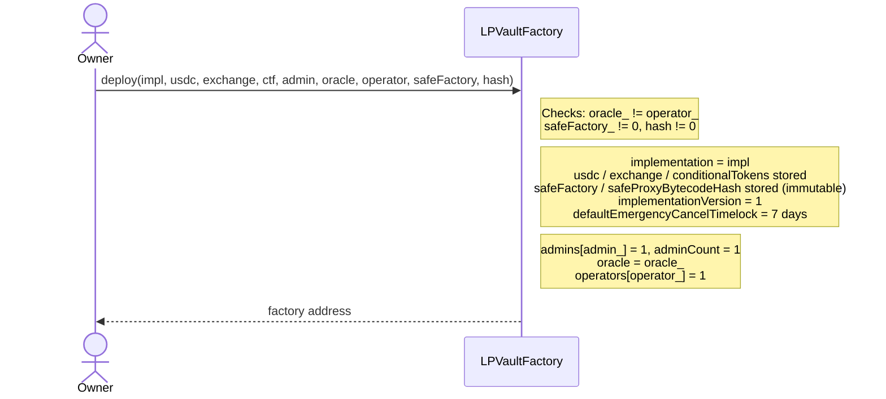

**Events:** none

**Reverts:**
- `RoleSeparation()` — `oracle_` equals `operator_`
- `ZeroAddress()` — `safeFactory_` is zero
- `ZeroBytecodeHash()` — `safeProxyBytecodeHash_` is zero

---

### Safe derivation

Every LP is a Gnosis Safe that Prophet deploys through the Poly Safe factory with `CREATE2`, so the Safe's address is a pure function of its owner key. A Safe has no private key, so `ecrecover` can never return a Safe address. The Safe's owner key signs every LP message, and the vault requires that the Safe derived from the recovered signer equals the Safe the message names:

```text
salt = keccak256(abi.encode(ownerKey))
safe = address(uint160(uint256(keccak256(0xff ++ safeFactory ++ salt ++ safeProxyBytecodeHash))))
```

Both inputs are `immutable` on the factory, and every vault reads them from the factory at call time (`_deriveSafe`), so no Admin can change them. One internal `_verifySafeOwnerSignature(safe, structHash, signature)` runs the check for `depositForIntent`, `reclaimDepositFor`, and the later relayed burn and collect. Every LP-signed type carries a `deadline`, checked inclusively against `block.timestamp`.

Known property: a Safe owner who swaps the owner key leaves the old key able to derive the same Safe, so the old key keeps the relayed paths until the vault holds nothing for that Safe. The exchange has the same property for orders. A valid signature never proves ownership of an `intentId`: the recorded Safe in `pendingDeposits` does, and every path that spends an escrow checks it.

---

### `LPVaultFactory.createVault`

```solidity
function createVault(
    bytes32 marketId_,
    int24   tickSpacing_,
    uint128 minimumFirstLiquidity_,
    bytes32 conditionId_,
    uint256 yesTokenId_,
    uint256 noTokenId_
) external onlyOracle returns (address vault)
```

**Actor:** Oracle

Verifies the market's outcome-token identity against the ConditionalTokens contract, deploys an EIP-1167 minimal-proxy clone of the current implementation, calls `initialize()` on it, and registers it in `vaultForMarket`. A clone can never correct its identity, so a wrong identity reverts before any clone exists.

| Parameter | Type | Description |
|-----------|------|-------------|
| `marketId_` | `bytes32` | Unique identifier for the market — must not already have a vault |
| `tickSpacing_` | `int24` | Minimum tick increment; all position bounds must be multiples of this value. One tick is one basis point (`PRICE_TICK_ONE = 10000`, price = tick / 10000), so `tickSpacing` is the width of a level, and every position range lies inside [0, 10000] |
| `minimumFirstLiquidity_` | `uint128` | Floor on the liquidity value of the first mint (prevents inflation attacks); must be > 0 |
| `conditionId_` | `bytes32` | ConditionalTokens condition ID of the market; must be a prepared 2-outcome condition |
| `yesTokenId_` | `uint256` | YES outcome token ID: the index set 1 position ID of `(usdc, conditionId_)` |
| `noTokenId_` | `uint256` | NO outcome token ID: the index set 2 position ID of `(usdc, conditionId_)` |

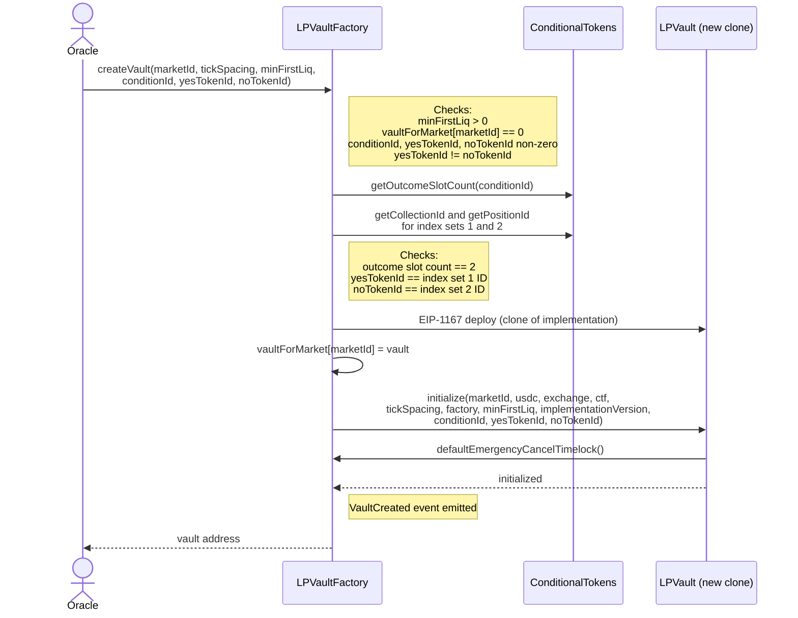

**Events:** `VaultCreated(bytes32 indexed marketId, address vault, uint128 minimumFirstLiquidity)`

**Reverts:**
- `NotOracle()` — caller is not the oracle
- `ZeroFloor()` — `minimumFirstLiquidity_` is 0
- `DuplicateMarket()` — a vault already exists for `marketId_`
- `ZeroConditionId()` — `conditionId_` is 0
- `ZeroTokenId()` — `yesTokenId_` or `noTokenId_` is 0
- `DuplicateTokenId()` — `yesTokenId_` equals `noTokenId_`
- `NotBinaryCondition()` — the condition's outcome slot count is not 2; an unprepared condition returns 0
- `TokenIdMismatch()` — `yesTokenId_` is not the index set 1 position ID, or `noTokenId_` is not the index set 2 position ID, of `(usdc, conditionId_)`
- `CloneDeployFailed()` — EIP-1167 `create` returned address(0)

---

### `LPVault.initialize`

```solidity
function initialize(
    bytes32 marketId_,
    address usdc_,
    address exchange_,
    address conditionalTokens_,
    int24   tickSpacing_,
    address factory_,
    uint128 minimumFirstLiquidity_,
    uint256 version_,
    bytes32 conditionId_,
    uint256 yesTokenId_,
    uint256 noTokenId_
) external initializer
```

**Actor:** Factory only (enforced by `onlyFactory` check inside the function)

Called once by the factory immediately after cloning. Stores all per-vault configuration, including the outcome-token identity, reads the factory's `defaultEmergencyCancelTimelock()` once into `emergencyCancelTimelock`, sets the vault phase to Active, pre-approves the exchange for USDC and outcome tokens, and snapshots the EIP-712 domain separator. It makes no identity check of its own: only the factory can call it, and `createVault` verifies the identity before it deploys the clone.

| Parameter | Type | Description |
|-----------|------|-------------|
| `marketId_` | `bytes32` | Market identifier for this vault |
| `usdc_` | `address` | USDC ERC-20 address |
| `exchange_` | `address` | ProphetCTFExchange address |
| `conditionalTokens_` | `address` | Gnosis ConditionalTokens (ERC-1155) address |
| `tickSpacing_` | `int24` | Tick increment; all position bounds must align to this |
| `factory_` | `address` | Factory that deployed this clone — must equal `msg.sender` |
| `minimumFirstLiquidity_` | `uint128` | Floor for the first mint, when `nextPositionId == 0` |
| `version_` | `uint256` | Factory's `implementationVersion` at deploy time; stored for off-chain identification |
| `conditionId_` | `bytes32` | ConditionalTokens condition ID of the market; stored as `conditionId` |
| `yesTokenId_` | `uint256` | Index set 1 (YES) position ID; stored as `yesTokenId` |
| `noTokenId_` | `uint256` | Index set 2 (NO) position ID; stored as `noTokenId` |

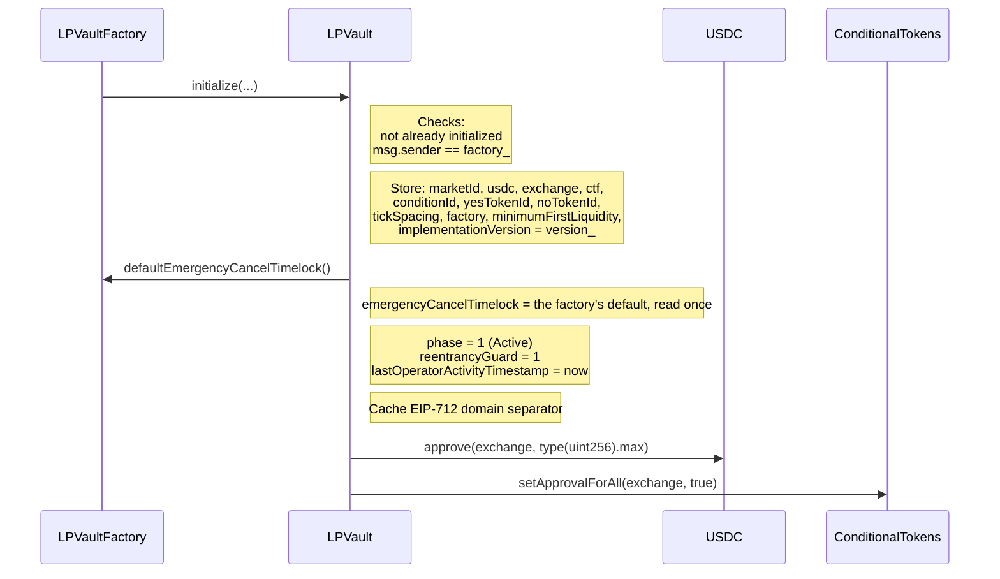

**Events:** none

**Reverts:**
- `AlreadyInitialized()` — called a second time
- `NotFactory()` — `msg.sender != factory_`

---

### `LPVault.onERC1155Received`, `LPVault.onERC1155BatchReceived`, `LPVault.supportsInterface`

```solidity
function onERC1155Received(address, address, uint256 id, uint256, bytes calldata)
    external view onlyConditionalTokens returns (bytes4)

function onERC1155BatchReceived(address, address, uint256[] calldata ids, uint256[] calldata, bytes calldata)
    external view onlyConditionalTokens returns (bytes4)

function supportsInterface(bytes4 interfaceId) external pure returns (bool)
```

**Actor:** The vault's own ConditionalTokens contract, during `safeTransferFrom` or `safeBatchTransferFrom`. `supportsInterface` is a public view for any caller.

The two hooks let the vault receive its outcome tokens: the ERC-1155 standard makes the token contract call them on a contract recipient and revert unless it gets the acknowledgement value back. Both hooks are stateless. They write nothing, merge nothing, and take no reentrancy guard, because a hook runs inside the exchange's settlement transaction and a revert there reverts the match. Each hook returns its acknowledgement value only when the caller is the vault's configured `conditionalTokens` and every token ID is the vault's `yesTokenId` or `noTokenId`, which the factory verified at `createVault`. The unscoped `setApprovalForAll(exchange, true)` that `initialize` grants is acceptable because of this check: no other market's token can enter the vault.

| Parameter | Type | Description |
|-----------|------|-------------|
| `id` / `ids` | `uint256` / `uint256[]` | The token ID, or every token ID of the batch; each must be `yesTokenId` or `noTokenId` |
| `interfaceId` | `bytes4` | `0x4e2312e0` (IERC1155Receiver) and `0x01ffc9a7` (ERC-165) return `true`; any other value returns `false` |

**Returns:** `0xf23a6e61` from `onERC1155Received`, `0xbc197c81` from `onERC1155BatchReceived`.

**Events:** none

**Reverts:**
- `NotConditionalTokens()` — the caller is not the vault's configured ConditionalTokens contract
- `UnknownTokenId()` — a token ID is neither `yesTokenId` nor `noTokenId`; in a batch, one such element rejects the whole batch

---

### `LPVault.startWindDown`

```solidity
function startWindDown() external onlyOracle
```

**Actor:** Oracle

Transitions the vault from Active (phase 1) to WindDown (phase 2). One-way — there is no mechanism to revert to Active. After this call, `depositForIntent` and `mintPositionFor` revert; `collect`, `collectFor`, `burnPosition`, `burnPositionFor`, `reclaimDeposit`, `reclaimDepositFor`, `mergeCompleteSets`, and `emergencyCancelAll` remain open.

| Parameter | Type | Description |
|-----------|------|-------------|
| — | — | No parameters |

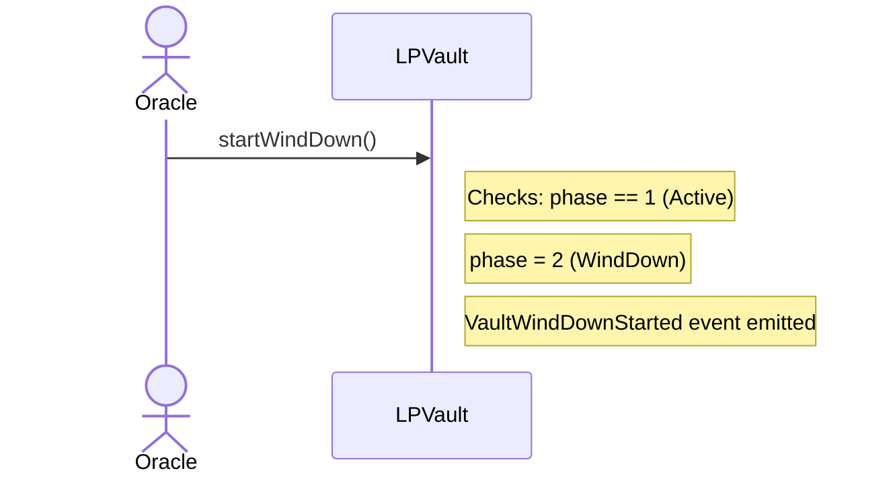

**Events:** `VaultWindDownStarted(bytes32 indexed marketId)`

**Reverts:**
- `NotOracle()` — caller is not the oracle
- `VaultNotActive()` — vault is not in Active phase

---

### `LPVault.setMinimumFirstLiquidity`

```solidity
function setMinimumFirstLiquidity(uint128 newMin) external onlyOracle
```

**Actor:** Oracle

Updates the floor applied to the first mint (when `nextPositionId == 0`). Callable at any time. The value matters only before the first mint. After it, the setter still succeeds and no mint reads the value (decision C15 in `audits/audit-fixes-ranged.md`).

| Parameter | Type | Description |
|-----------|------|-------------|
| `newMin` | `uint128` | New minimum liquidity value; must be > 0 |

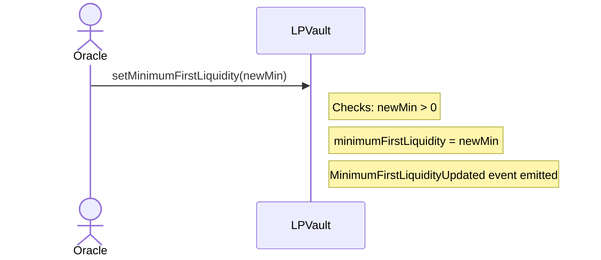

**Events:** `MinimumFirstLiquidityUpdated(uint128 oldMin, uint128 newMin)`

**Reverts:**
- `NotOracle()` — caller is not the oracle
- `ZeroFloor()` — `newMin` is 0

---

## 2. Transactional Methods

### `LPVault.depositForIntent`

```solidity
function depositForIntent(
    address  lp,
    int24    tickLower,
    int24    tickUpper,
    uint256  usdcAmount,
    bytes32  intentId,
    uint256  deadline,
    bytes calldata signature
) external onlyOperator whenNotPaused nonReentrant touchesHeartbeat
```

**Actor:** Operator

Escrows an LP's USDC against a signed mint intent. Pulls `usdcAmount` USDC from the LP's Safe (which approved the vault through a relayed Safe transaction), and records the Safe, the amount, and the intent's struct hash under `intentId`. This is the only way USDC enters a position: a plain USDC transfer to the vault is never a deposit.

| Parameter | Type | Description |
|-----------|------|-------------|
| `lp` | `address` | The LP's Safe — the recorded depositor and the USDC source |
| `tickLower` | `int24` | Lower bound of the price range; must be < `tickUpper` and aligned to `tickSpacing` |
| `tickUpper` | `int24` | Upper bound of the price range; must be > `tickLower` and aligned to `tickSpacing` |
| `usdcAmount` | `uint256` | USDC to pull from the Safe; must be > 0 |
| `intentId` | `bytes32` | Unique identifier for replay protection, shared with `mintPositionFor` and both reclaims |
| `deadline` | `uint256` | Last `block.timestamp` at which the deposit is accepted (inclusive) |
| `signature` | `bytes` | 65-byte EIP-712 signature from the Safe's owner key over the `MintIntent` struct |

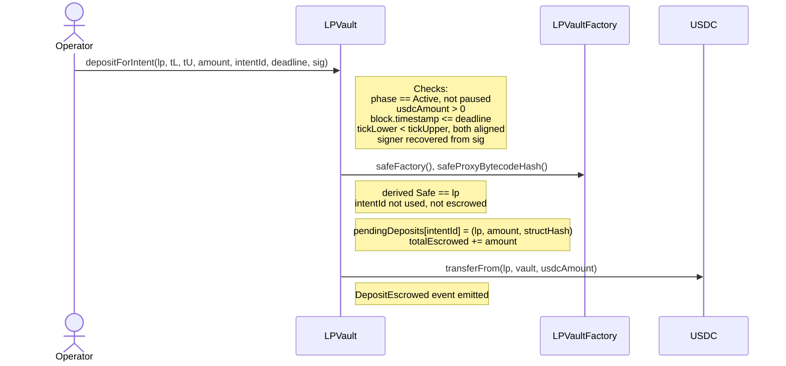

**Events:** `DepositEscrowed(bytes32 indexed intentId, address indexed lp, uint256 usdcAmount)`

**Reverts:**
- `NotOperator()` — caller is not an operator
- `TradingIsPaused()` — vault is paused
- `VaultNotActive()` — vault is not in Active phase
- `ZeroAmount()` — `usdcAmount` is 0
- `IntentExpired()` — `block.timestamp > deadline`
- `InvalidRange()` — `tickLower >= tickUpper`, `tickLower < 0`, or `tickUpper > PRICE_TICK_ONE` (10000)
- `TickNotAligned()` — either tick is not a multiple of `tickSpacing`
- `InvalidSignature()` — signature is malformed, malleable, or from a key whose derived Safe is not `lp`
- `IntentAlreadyUsed()` — `intentId` was consumed by a mint or a reclaim
- `DepositAlreadyEscrowed()` — `intentId` already holds an escrow
- `SafeCastOverflow()` — `usdcAmount` exceeds `uint96`
- `TransferFailed()` — the USDC pull failed (short allowance or balance)

---

### `LPVault.mintPositionFor`

```solidity
function mintPositionFor(
    address  lp,
    int24    tickLower,
    int24    tickUpper,
    uint256  usdcAmount,
    bytes32  intentId,
    uint256  deadline
) external onlyOperator whenNotPaused nonReentrant touchesHeartbeat returns (uint256 positionId)
```

**Actor:** Operator

Creates the concentrated-liquidity position that an escrowed intent authorizes. Verifies no signature and moves no USDC: the escrow (`depositForIntent`) did both. Requires that the escrow names `lp` and that the struct hash recomputed from the six arguments equals the recorded hash, then consumes the escrow, initialises tick state, and records the position owned by the Safe. Reads no clock: `deadline` is an argument only because the hash needs it, so a deposit made near its deadline can still mint.

| Parameter | Type | Description |
|-----------|------|-------------|
| `lp` | `address` | The LP's Safe — must be the escrow's recorded depositor |
| `tickLower` | `int24` | Lower bound of the price range; must be < `tickUpper` and aligned to `tickSpacing` |
| `tickUpper` | `int24` | Upper bound of the price range; must be > `tickLower` and aligned to `tickSpacing` |
| `usdcAmount` | `uint256` | USDC amount of the intent; must be > 0 and equal the escrowed amount |
| `intentId` | `bytes32` | Unique identifier for replay protection; each `intentId` can only be used once |
| `deadline` | `uint256` | The deadline the owner key signed — part of the recorded hash |

```mermaid
sequenceDiagram
    actor Operator
    participant Vault as LPVault

    Operator->>Vault: mintPositionFor(lp, tL, tU, amount, intentId, deadline)
    Note right of Vault: Checks:<br/>phase == Active, not paused<br/>usdcAmount > 0<br/>tickLower < tickUpper<br/>both ticks aligned to tickSpacing<br/>intentId not used before<br/>escrow exists, names lp, hash matches<br/>liquidity >= minFirstLiq (if nextPositionId == 0)
    Note right of Vault: Mark intentId as used<br/>delete pendingDeposits[intentId]<br/>totalEscrowed -= amount
    Note right of Vault: Compute liquidity = usdcAmount * PRECISION / rangeWidth
    Note right of Vault: Init ticks if new; update liquidityGross / liquidityNet
    Note right of Vault: Snapshot feeGrowthInsideLastX128 at mint time
    Note right of Vault: Create positions[positionId] with owner = lp,<br/>mintTick = currentTick clamped into [tL, tU]
    Note right of Vault: Increment activeLiquidity if position is in-range
    Note right of Vault: PositionMinted event emitted (no USDC moves)
    Vault-->>Operator: positionId
```

**Events:** `PositionMinted(uint256 indexed positionId, address indexed owner, int24 tickLower, int24 tickUpper, int24 mintTick, uint128 liquidity, uint256 usdcAmount, bytes32 intentId)`. The `positions(uint256)` getter returns `(owner, tickLower, tickUpper, mintTick, liquidity, feeGrowthInsideLastX128, tokensOwed)`, seven words. `mintTick` is `currentTick` at the mint, clamped to `tickLower` when the price was below the range and to `tickUpper` when it was at or above it (FR-AFPO).

**Reverts:**
- `NotOperator()` — caller is not an operator
- `TradingIsPaused()` — vault is paused
- `VaultNotActive()` — vault is not in Active phase
- `ZeroAmount()` — `usdcAmount` is 0
- `InvalidRange()` — `tickLower >= tickUpper`, `tickLower < 0`, or `tickUpper > PRICE_TICK_ONE` (10000)
- `TickNotAligned()` — either tick is not a multiple of `tickSpacing`
- `IntentAlreadyUsed()` — `intentId` was already used by a mint or a reclaim
- `DepositNotEscrowed()` — no escrow exists for `intentId`
- `NotIntentOwner()` — the escrow's recorded Safe is not `lp`
- `IntentMismatch()` — the recomputed struct hash differs from the recorded one (range, amount, or deadline changed)
- `BelowMinimumFirstLiquidity()` — first mint liquidity below floor

---

### `LPVault.notifyFees`

```solidity
function notifyFees(uint256 amount) external onlyOperator whenNotPaused nonReentrant touchesHeartbeat
```

**Actor:** Operator

Increments the global Q128 fee accumulator by the per-unit share of `amount` distributed across `activeLiquidity`, credits the solvency ledger's fee total by that increment times `activeLiquidity` (which bounds a report at 2^128 base units, about 3.4 × 10^32 USDC), then takes `amount` USDC from the caller with `transferFrom` in the same call, so no fee credit exists without the USDC behind it. The Operator wallet must hold the swept USDC and a standing USDC approval to the vault (see `DEPLOYMENT.md`, "Operator USDC approval per vault"). The vault performs no balance check beyond the pull: the Operator can still under-report.

| Parameter | Type | Description |
|-----------|------|-------------|
| `amount` | `uint256` | USDC fee revenue to distribute; must be > 0 |

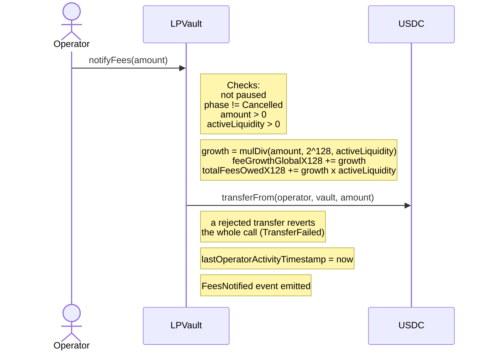

**Events:** `FeesNotified(uint256 amount, uint256 feeGrowthGlobalX128)`, preceded in the same transaction by the USDC contract's `Transfer(operator, vault, amount)`

**Reverts:**
- `NotOperator()` — caller is not an operator
- `TradingIsPaused()` — vault is paused
- `VaultCancelled()` — vault is in terminal Cancelled phase
- `ZeroAmount()` — `amount` is 0
- `NoActiveLiquidity()` — `activeLiquidity` is 0
- `TransferFailed()` — the USDC `transferFrom` from the caller failed (no balance, or no approval); the accumulator increment rolls back
- an arithmetic panic — `amount` above 2^128 base units, because the fee total's credit no longer fits in 256 bits

---

### `LPVault.heartbeat`

```solidity
function heartbeat() external onlyOperator touchesHeartbeat
```

**Actor:** Operator

Refreshes `lastOperatorActivityTimestamp` and changes nothing else. This is the Operator's refresh path while the vault is paused or wound down, where `updateTick` reverts, and for an Operator with no report to send. On an Active market the keeper's `updateTick` with the current tick refreshes the timer itself. Every Operator function carries `touchesHeartbeat`, so every successful Operator call refreshes the timer.

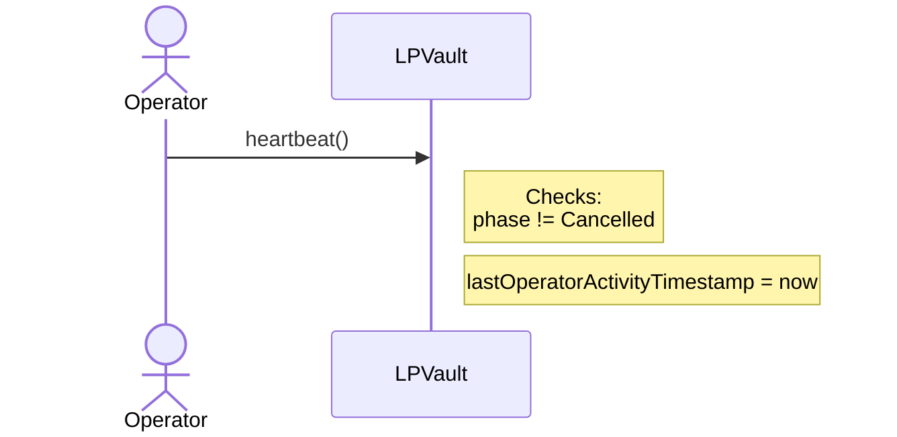

**Events:** none

**Reverts:**
- `NotOperator()` — caller is not an operator
- `VaultCancelled()` — vault is in terminal Cancelled phase

---

### `LPVault.updateTick`

```solidity
function updateTick(int24 newTick) external onlyOperator whenNotPaused nonReentrant touchesHeartbeat
```

**Actor:** Operator

Synchronises the vault's price tick with the off-chain CLOB mid-price. Crosses every initialised tick between `currentTick` and `newTick`, flipping per-tick fee accumulators and adjusting `activeLiquidity` and `noSideLiquidity`. An interior mint tick is an initialised tick too: it counts its positions' liquidity and holds their NO sub-range's net, so a move crosses it and `ticksCrossed` counts it. For every segment the move traverses, the trailing one included, the vault shifts the four totals of the solvency ledger with the liquidity split as it stood in that segment: moving up, each NO-side level buys NO at `1 − t / 10000` and each YES-side level's YES returns to USDC; moving down, the mirror. The search for the next initialised tick reads only the bitmap words between `currentTick` and `newTick`, so the cost of a call follows the reported move and not where any LP initialised a tick. A call with the current tick refreshes only `lastOperatorActivityTimestamp` and returns: no crossing, no bitmap read, no event. The keeper reports every 60 seconds and after fills, so this is the normal case.

| Parameter | Type | Description |
|-----------|------|-------------|
| `newTick` | `int24` | The new price tick. A value equal to `currentTick` refreshes only the heartbeat |

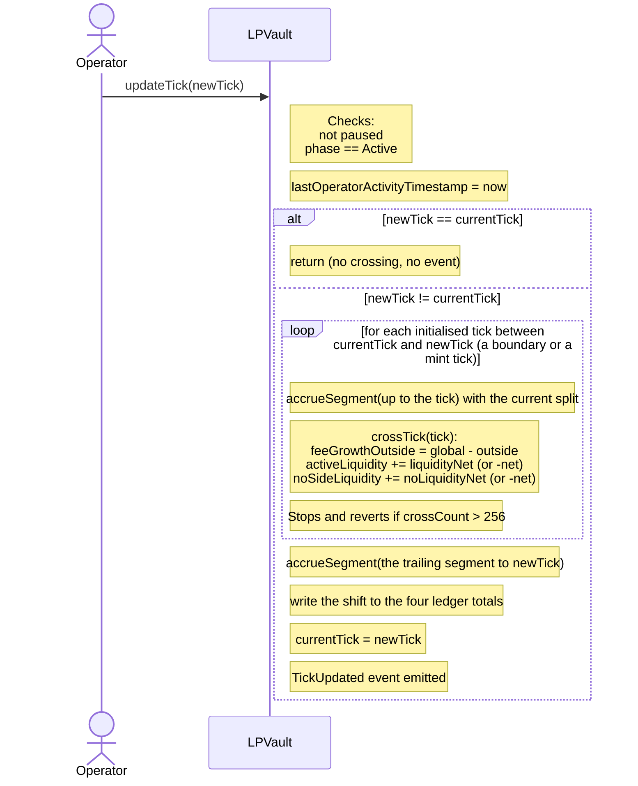

**Events:** `TickUpdated(int24 indexed oldTick, int24 indexed newTick, uint256 ticksCrossed)` — only when the tick changes

**Reverts:**
- `NotOperator()` — caller is not an operator
- `TradingIsPaused()` — vault is paused
- `VaultNotActive()` — vault is not in Active phase
- `TooManyTicksCrossed()` — more than 256 initialised ticks between old and new tick; call multiple times with intermediate values

---

### `LPVault.collect`

```solidity
function collect(uint256 positionId) external nonReentrant
```

**Actor:** LP's Safe (position owner)

Withdraws accrued trading fees from a position without removing it, in every phase and while paused. Computes the fees since the last collect from the per-tick `feeGrowthOutside` accumulators, adds `tokensOwed` (rolled in from `mergePositions`), merges the vault's YES and NO pairs into USDC, and pays the amount owed times the USDC ratio of the solvency ledger: the smaller of 1 and the USDC the vault holds above `totalEscrowed` (the pairs counted) over `totalUsdcOwed() + totalFeesOwed()`, rounded down. The claim settles at that ratio, paid or not: `tokensOwed` reads zero afterwards and the ledger's fee total falls by the whole claim. A zero-owed collect reads no balance and merges nothing.

| Parameter | Type | Description |
|-----------|------|-------------|
| `positionId` | `uint256` | ID of the position to collect from |

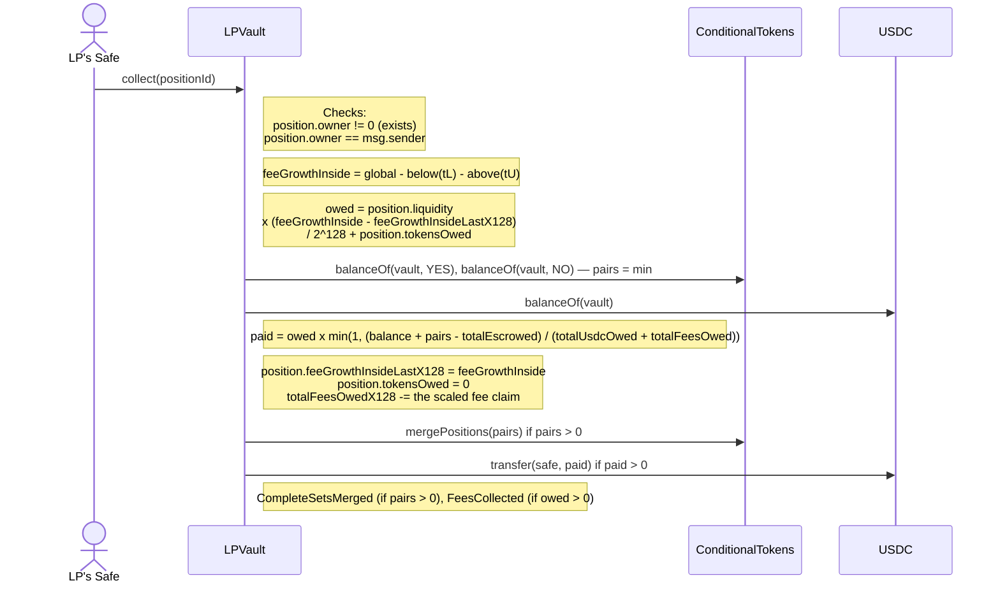

**Events:** `CompleteSetsMerged(address indexed caller, uint256 amount)` when pairs merged; `FeesCollected(uint256 indexed positionId, address indexed owner, uint256 amountOwed, uint256 amountPaid)` — `amountPaid < amountOwed` marks a ratio below 1

**Reverts:**
- `PositionNotFound()` — no position exists at `positionId`
- `NotPositionOwner()` — caller does not own this position
- `TransferFailed()` — USDC transfer failed

---

### `LPVault.collectFor`

```solidity
function collectFor(
    address  lp,
    uint256  positionId,
    uint256  nonce,
    uint256  deadline,
    bytes calldata signature
) external onlyOperator nonReentrant touchesHeartbeat
```

**Actor:** Operator

Relays the owner key's signed `CollectIntent` to pay that Safe its fees — the same collect as `collect`, with the Operator paying the gas. The USDC goes to `position.owner`, never to the caller. The type carries a `nonce` because a collect repeats over a position's life, and each struct hash is consumed once in its own record.

| Parameter | Type | Description |
|-----------|------|-------------|
| `lp` | `address` | The LP's Safe — must be the position's recorded owner |
| `positionId` | `uint256` | The position to collect from |
| `nonce` | `uint256` | A value the owner key never reuses for this position |
| `deadline` | `uint256` | Last `block.timestamp` at which the relayed collect is accepted (inclusive) |
| `signature` | `bytes` | 65-byte EIP-712 signature from the Safe's owner key over `CollectIntent(address lp,uint256 positionId,uint256 nonce,uint256 deadline)` |

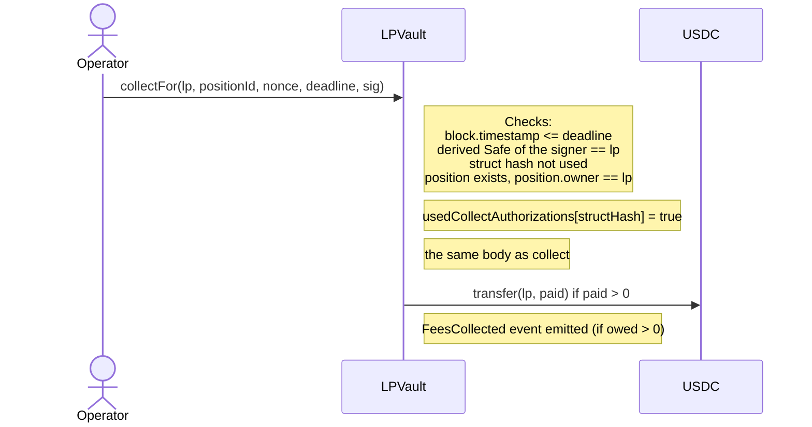

**Events:** `CompleteSetsMerged` when pairs merged; `FeesCollected(uint256 indexed positionId, address indexed owner, uint256 amountOwed, uint256 amountPaid)`

**Reverts:**
- `NotOperator()` — caller is not an operator
- `IntentExpired()` — `block.timestamp > deadline`
- `InvalidSignature()` — signature is malformed, malleable, produced over another type, or from a key whose derived Safe is not `lp`
- `IntentAlreadyUsed()` — this `CollectIntent` was already consumed
- `PositionNotFound()` — no position exists at `positionId`
- `NotPositionOwner()` — `lp` does not own this position
- `TransferFailed()` — USDC transfer failed

---

### `LPVault.burnPosition`

```solidity
function burnPosition(uint256 positionId) external nonReentrant
```

**Actor:** LP's Safe (position owner)

Closes a position the Safe owns and pays what its claim holds under the claim model (decision C26): USDC for every level the price never crossed, one outcome token for the band between the mint tick and the current tick (YES below the mint tick, NO at or above it) plus the USDC that buying that token at each level's price did not spend, and the accrued fees. The vault merges its YES and NO pairs first, removes the position's liquidity from both ticks (deleting a tick and clearing its bitmap bit when its `liquidityGross` reaches zero), reduces `activeLiquidity` (and `noSideLiquidity` for a position on the NO side of its mint tick) when the position is in range, removes the position's NO sub-range and its interior mint tick's reference, debits the solvency ledger by the full scaled claim and fees, deletes the record, and pays each asset's owed amount times that asset's ratio (the smaller of 1 and held ÷ owed total), rounded down, without a revert. Works in every phase, while paused, and with every Operator removed. Never refreshes the Operator heartbeat.

| Parameter | Type | Description |
|-----------|------|-------------|
| `positionId` | `uint256` | The position to close; `msg.sender` must be its recorded owner |

**The claim.** With `L = liquidity`, `width = tickUpper − tickLower`, `m = mintTick`, `c = currentTick`, `ONE = 10000`, and `P = 1e18`:

```text
c < m:   a = max(c, tickLower), band = m − a           # the YES band [a, m)
         tokens = L × band / P
         Σt = band × (a + m − 1) / 2
         usdc = L × (width × ONE − Σt) / (ONE × P)
c > m:   b = min(c, tickUpper), band = b − m           # the NO band [m, b)
         tokens = L × band / P
         Σt = band × (m + b − 1) / 2
         usdc = L × ((width − band) × ONE + Σt) / (ONE × P)
c == m, or band == 0:  usdc = L × width / P, no token
```

Worked example: 300 USDC over `[5500, 6500)` minted at 6000 gives `L = 3e23`. With the vault at 5700: `band = 300`, `tokens = 90e6` (90 YES), `Σt = 300 × (5700 + 6000 − 1) / 2 = 1,754,850`, `usdc = 3e23 × (10,000,000 − 1,754,850) / 1e22 = 247,354,500` (247.3545 USDC). The vault spent 52.6455 USDC on the 90 YES, an average price of 0.585, the middle of the band. At 6300 the NO band pays 90 NO and 265,345,500 units.

```mermaid
sequenceDiagram
    actor Safe as LP's Safe
    participant Vault as LPVault
    participant CTF as ConditionalTokens
    participant USDC

    Safe->>Vault: burnPosition(positionId)
    Note right of Vault: Checks:<br/>owner != 0 and liquidity > 0<br/>position.owner == msg.sender
    Note right of Vault: fees from feeGrowthInside; the claim from<br/>(liquidity, range, mintTick, currentTick)
    Vault->>CTF: balanceOf(vault, YES), balanceOf(vault, NO) — pairs = min
    Vault->>USDC: balanceOf(vault)
    Note right of Vault: usdcPaid = (usdcOwed + fees) x min(1, (balance + pairs - totalEscrowed) / (totalUsdcOwed + totalFeesOwed))<br/>tokenPaid = tokenOwed x min(1, (held - pairs) / tokenTotal)
    Note right of Vault: remove the NO sub-range, then the liquidity from both ticks (clear a bit at zero)<br/>activeLiquidity -= liquidity if in range, noSideLiquidity too on the NO side<br/>debit the four ledger totals by the scaled claim and fees<br/>delete positions[positionId]
    Vault->>CTF: mergePositions(pairs) if pairs > 0
    Vault->>USDC: transfer(safe, usdcPaid)
    Vault->>CTF: safeTransferFrom(vault, safe, tokenId, tokenPaid) — last call
    Note right of Vault: PositionBurned event emitted
```

**Events:** `CompleteSetsMerged(address indexed caller, uint256 amount)` when pairs merged; `PositionBurned(uint256 indexed positionId, address indexed owner, uint256 usdcOwed, uint256 feesOwed, uint256 usdcPaid, uint256 tokenId, uint256 tokenOwed, uint256 tokenPaid)` — `paid < owed` marks a ratio below 1 on that asset

**Reverts:**
- `PositionNotFound()` — never minted, already burned, or consumed by `mergePositions`
- `NotPositionOwner()` — caller does not own this position
- `TransferFailed()` — USDC transfer failed

---

### `LPVault.burnPositionFor`

```solidity
function burnPositionFor(
    address  lp,
    uint256  positionId,
    uint256  deadline,
    bytes calldata signature
) external onlyOperator nonReentrant touchesHeartbeat
```

**Actor:** Operator

Relays the owner key's signed `BurnIntent` to close that Safe's position — the same burn as `burnPosition`, with the Operator paying the gas. Every asset goes to `position.owner`, never to the caller. The Operator chooses the block, and so the `currentTick` that values the claim, bounded by the deadline the owner key signed; the Safe's remedy is `burnPosition`.

| Parameter | Type | Description |
|-----------|------|-------------|
| `lp` | `address` | The LP's Safe — must be the position's recorded owner |
| `positionId` | `uint256` | The position to close |
| `deadline` | `uint256` | Last `block.timestamp` at which the relayed burn is accepted (inclusive) |
| `signature` | `bytes` | 65-byte EIP-712 signature from the Safe's owner key over `BurnIntent(address lp,uint256 positionId,uint256 deadline)` |

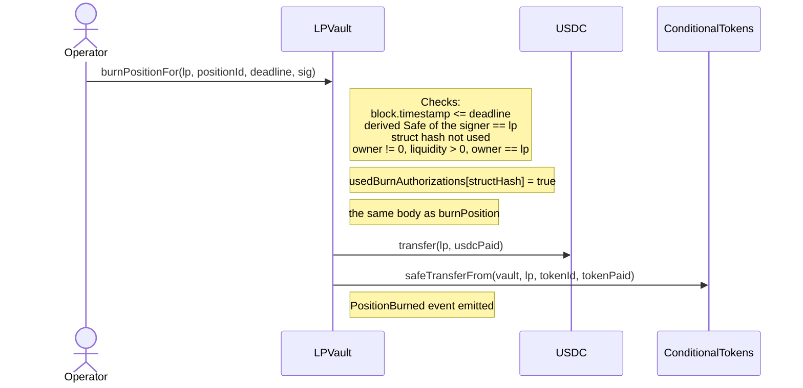

**Events:** `CompleteSetsMerged` when pairs merged; `PositionBurned(...)`

**Reverts:**
- `NotOperator()` — caller is not an operator
- `IntentExpired()` — `block.timestamp > deadline`
- `InvalidSignature()` — signature is malformed, malleable, produced over another type, or from a key whose derived Safe is not `lp`
- `IntentAlreadyUsed()` — this `BurnIntent` was already consumed
- `PositionNotFound()` — never minted, already burned, or consumed by `mergePositions`
- `NotPositionOwner()` — `lp` does not own this position
- `TransferFailed()` — USDC transfer failed

---

### `LPVault.mergeCompleteSets`

```solidity
function mergeCompleteSets() external nonReentrant
```

**Actor:** Any wallet

Merges `min(YES balance, NO balance)` complete sets of the vault's condition into USDC held by the vault, through the Conditional Tokens contract. One YES plus one NO always pays exactly 1 USDC, so the merge moves no value between parties and the caller receives nothing. No role, pause, phase, or heartbeat check. A vault with no pair returns without a call and emits nothing.

```mermaid
sequenceDiagram
    actor Caller as Any wallet
    participant Vault as LPVault
    participant CTF as ConditionalTokens
    participant USDC

    Caller->>Vault: mergeCompleteSets()
    Vault->>CTF: balanceOf(vault, YES), balanceOf(vault, NO)
    Note right of Vault: amount = min; return if 0
    Vault->>CTF: mergePositions(usdc, 0, conditionId, [1, 2], amount)
    CTF->>USDC: transfer(vault, amount)
    Note right of Vault: CompleteSetsMerged(caller, amount)
```

**Events:** `CompleteSetsMerged(address indexed caller, uint256 amount)`, only when `amount > 0`

**Reverts:**
- `Reentrancy()` — re-entered through a guarded call

---

### `LPVault.mergePositions`

```solidity
function mergePositions(uint256[] calldata positionIds)
    external onlyOperator whenNotPaused nonReentrant touchesHeartbeat
```

**Actor:** Operator

Combines two or more distinct positions with the same owner, range, and mint tick into the first entry (`positionIds[0]`). Rolls up uncollected fees into the survivor's `tokensOwed`, sums liquidity, and zeroes consumed positions. Tick state is unchanged (net liquidity on the range and on the NO sub-range is the same). The solvency ledger's fee total falls by the dust the per-position floors drop, `Σ (liquidity × delta) mod 2^128`, so it still equals the survivor's scaled fee claim; no principal total moves. This joins LP position records. It is not the complete-set merge of YES and NO tokens into USDC, which audit-fix step R9 adds as `mergeCompleteSets()`.

| Parameter | Type | Description |
|-----------|------|-------------|
| `positionIds` | `uint256[]` | Array of distinct position IDs to merge; must have at least 2 elements; all must share the same owner, `tickLower`, `tickUpper`, and `mintTick` |

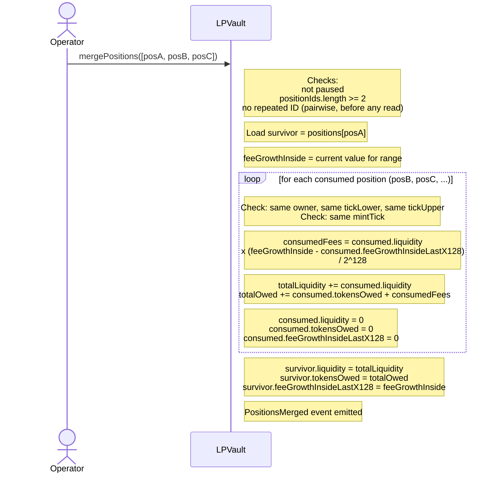

**Events:** `PositionsMerged(uint256[] positionIds, uint256 survivorId)`

**Reverts:**
- `NotOperator()` — caller is not an operator
- `TradingIsPaused()` — vault is paused
- `InsufficientPositions()` — fewer than 2 position IDs provided
- `DuplicatePositionId()` — an ID appears twice in `positionIds`
- `RangeMismatch()` — any consumed position has a different owner, `tickLower`, or `tickUpper` than the survivor
- `MintTickMismatch()` — any consumed position has a different `mintTick` than the survivor

---

### `LPVault.reclaimDeposit`

```solidity
function reclaimDeposit(bytes32 intentId) external nonReentrant
```

**Actor:** LP's Safe (through a Safe transaction the owner key signs)

One-call escape hatch: refunds the USDC escrowed against `intentId` to the Safe that paid it. The escrow record proves the deposit, so the call needs no signature, no Operator co-signature, no timelock, no phase check, and no pause check. It works with every Operator removed and in every phase, including Cancelled.

| Parameter | Type | Description |
|-----------|------|-------------|
| `intentId` | `bytes32` | The escrowed intent to refund; `msg.sender` must be its recorded Safe |

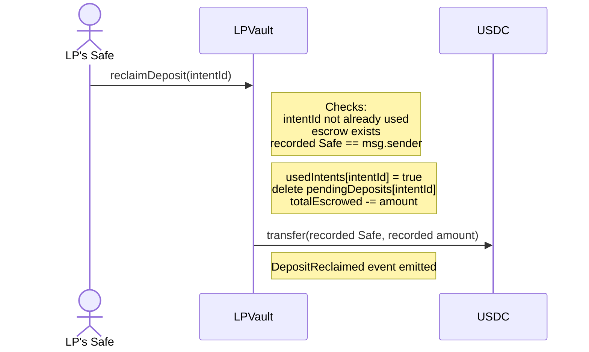

**Events:** `DepositReclaimed(bytes32 indexed intentId, address indexed lp, uint256 usdcAmount)` — the recorded Safe and the recorded amount

**Reverts:**
- `IntentAlreadyUsed()` — `intentId` was already consumed by `mintPositionFor` or a prior reclaim
- `DepositNotEscrowed()` — no escrow exists for `intentId`
- `NotIntentOwner()` — `msg.sender` is not the escrow's recorded Safe
- `TransferFailed()` — USDC transfer failed

---

### `LPVault.reclaimDepositFor`

```solidity
function reclaimDepositFor(
    address  lp,
    bytes32  intentId,
    uint256  deadline,
    bytes calldata signature
) external onlyOperator nonReentrant touchesHeartbeat
```

**Actor:** Operator

Relays the owner key's signed `ReclaimIntent` to refund that Safe's escrow — the same refund as `reclaimDeposit`, with the Operator paying the gas. The USDC goes to the recorded Safe, never to the caller. The `ReclaimIntent` type is distinct from `MintIntent`, so a mint authorization never doubles as a cancellation. No phase check and no pause check.

| Parameter | Type | Description |
|-----------|------|-------------|
| `lp` | `address` | The LP's Safe — must be the escrow's recorded depositor |
| `intentId` | `bytes32` | The escrowed intent to refund |
| `deadline` | `uint256` | Last `block.timestamp` at which the relayed reclaim is accepted (inclusive) |
| `signature` | `bytes` | 65-byte EIP-712 signature from the Safe's owner key over `ReclaimIntent(address lp,bytes32 intentId,uint256 deadline)` |

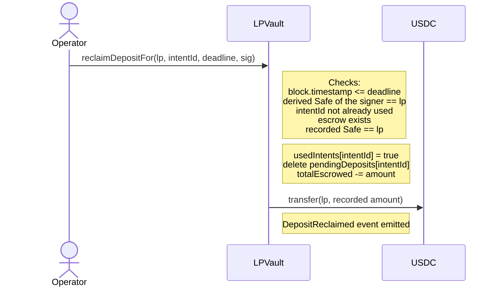

**Events:** `DepositReclaimed(bytes32 indexed intentId, address indexed lp, uint256 usdcAmount)`

**Reverts:**
- `NotOperator()` — caller is not an operator
- `IntentExpired()` — `block.timestamp > deadline`
- `InvalidSignature()` — signature is malformed, malleable, produced over a `MintIntent`, or from a key whose derived Safe is not `lp`
- `IntentAlreadyUsed()` — `intentId` was already consumed
- `DepositNotEscrowed()` — no escrow exists for `intentId`
- `NotIntentOwner()` — the escrow's recorded Safe is not `lp`
- `TransferFailed()` — USDC transfer failed

---

### Solvency ledger views

```solidity
function totalUsdcOwedScaled() external view returns (uint256)   // USDC units x 10000 x 1e18
function totalYesOwedScaled()  external view returns (uint256)   // token units x 1e18
function totalNoOwedScaled()   external view returns (uint256)   // token units x 1e18
function totalFeesOwedX128()   external view returns (uint256)   // USDC units x 2^128
function totalUsdcOwed() public view returns (uint256)           // the four truncated totals
function totalYesOwed()  public view returns (uint256)
function totalNoOwed()   public view returns (uint256)
function totalFeesOwed() public view returns (uint256)
function noSideLiquidity() external view returns (uint128)
function ticks(int24) external view returns (uint128 liquidityGross, int128 liquidityNet, uint256 feeGrowthOutsideX128, int128 noLiquidityNet)
```

**Actor:** any reader

The running totals of what the vault owes to its live positions, per asset, held in the claim's pre-division unit so that a mint and its burn cancel exactly, and truncated only in the four getters. Every mint, burn, collect, fee report, merge, and segment of a tick move writes them in the same call; the freeze writes none. They are the ratio denominators every burn and collect reads before its debit, and the monitoring surface for a shortfall, which no on-chain path reports otherwise. `noSideLiquidity` is the in-range liquidity whose mint tick is at or below `currentTick`, and `ticks()` returns a fourth value, the net of the NO sub-ranges `[mintTick, tickUpper)` at that tick.

**The ratio.** Per asset, the smaller of 1 and what the vault holds over what it owes:

```text
usdcRatio = min(1, (usdc.balanceOf(vault) + pairs − totalEscrowed) / (totalUsdcOwed() + totalFeesOwed()))
yesRatio  = min(1, (YES balance − pairs) / totalYesOwed())
noRatio   = min(1, (NO balance − pairs) / totalNoOwed())
```

A burn pays `(usdcOwed + feesOwed) × usdcRatio` and `tokenOwed × tokenRatio`, a collect pays `owed × usdcRatio`, each rounded down and never above what is held, and each debits the totals by the full owed amount, so every later claimant meets the same ratio. A zero total is a ratio of 1. The reclaim paths apply no ratio: escrowed USDC is senior.

---

## 3. Emergency Procedures

### `LPVault.emergencyCancelAll`

```solidity
function emergencyCancelAll() external
```

**Actor:** Any address (after the vault's operator-silence timelock)

Freezes the vault: sets the phase to Cancelled and changes nothing else. Callable by any address, with or without a position, once the vault's `emergencyCancelTimelock()` (7 days by default) has passed without any successful Operator call (`depositForIntent`, `mintPositionFor`, `reclaimDepositFor`, `burnPositionFor`, `collectFor`, `notifyFees`, `updateTick`, `mergePositions`, or `heartbeat`). `activeLiquidity`, every tick, every position, every escrow, and every balance stay as they are, so each LP exits alone afterwards through `burnPosition`, `burnPositionFor`, `collect`, `collectFor`, `reclaimDeposit`, or `reclaimDepositFor`, which pay in full at the frozen tick, and `mergeCompleteSets` keeps working. The call costs the same gas for any number of positions and carries no reentrancy guard, because it makes no external call and moves no token.

| Parameter | Type | Description |
|-----------|------|-------------|
| — | — | No parameters |

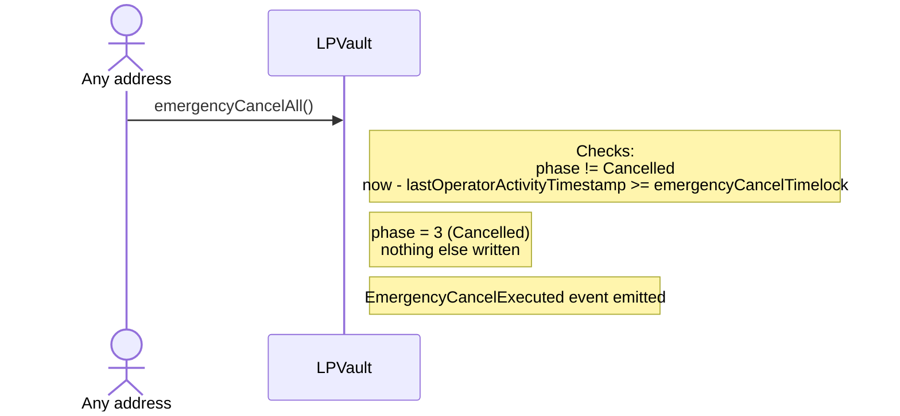

**Events:** `EmergencyCancelExecuted(address indexed caller)`

**Reverts:**
- `VaultCancelled()` — vault is already in Cancelled phase
- `TimelockNotElapsed()` — fewer than `emergencyCancelTimelock` seconds since the last operator activity

---

### `LPVault.pauseTrading`

```solidity
function pauseTrading() external onlyAdmin
```

**Actor:** Admin

Sets `paused = true`, immediately blocking `depositForIntent`, `mintPositionFor`, `notifyFees`, `updateTick`, and `mergePositions`. LP exit paths (`collect`, `collectFor`, `burnPosition`, `burnPositionFor`, `reclaimDeposit`, `reclaimDepositFor`, `mergeCompleteSets`, `emergencyCancelAll`) are unaffected. Does not change the vault's phase.

| Parameter | Type | Description |
|-----------|------|-------------|
| — | — | No parameters |

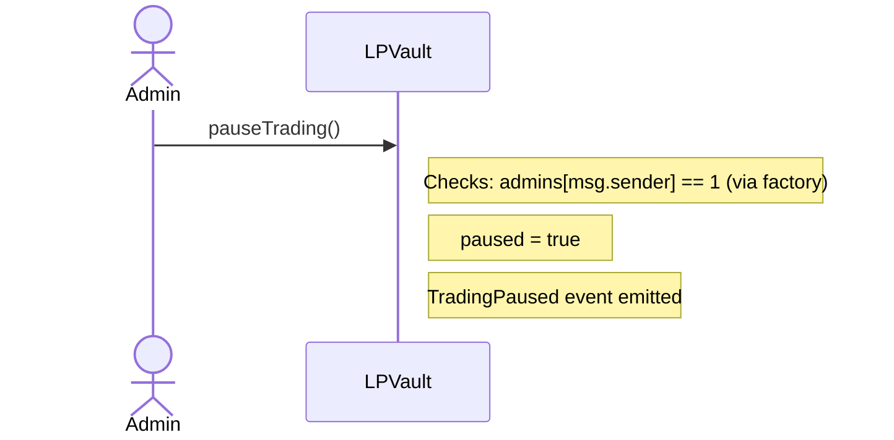

**Events:** `TradingPaused(address indexed caller)`

**Reverts:**
- `NotAdmin()` — caller is not a registered admin

---

### `LPVault.unpauseTrading`

```solidity
function unpauseTrading() external onlyAdmin
```

**Actor:** Admin

Sets `paused = false`, restoring normal operation of all trading entry points.

| Parameter | Type | Description |
|-----------|------|-------------|
| — | — | No parameters |

```mermaid
sequenceDiagram
    actor Admin
    participant Vault as LPVault

    Admin->>Vault: unpauseTrading()
    Note right of Vault: Checks: admins[msg.sender] == 1 (via factory)
    Note right of Vault: paused = false
    Note right of Vault: TradingUnpaused event emitted
```

**Events:** `TradingUnpaused(address indexed caller)`

**Reverts:**
- `NotAdmin()` — caller is not a registered admin

---

## 4. Admin & Governance

### `LPVaultFactory.addOperator`

```solidity
function addOperator(address operator_) external onlyAdmin
```

**Actor:** Admin

Registers a new address as an Operator. Takes effect immediately on all vaults deployed by this factory.

| Parameter | Type | Description |
|-----------|------|-------------|
| `operator_` | `address` | Address to register as Operator; must not be the current oracle |

```mermaid
sequenceDiagram
    actor Admin
    participant Factory as LPVaultFactory

    Admin->>Factory: addOperator(operator_)
    Note right of Factory: Checks:<br/>admins[msg.sender] == 1<br/>operator_ != oracle
    Note right of Factory: operators[operator_] = 1
    Note right of Factory: NewOperator event emitted
```

**Events:** `NewOperator(address indexed newOperatorAddress, address indexed admin)`

**Reverts:**
- `NotAdmin()` — caller is not a registered admin
- `RoleSeparation()` — `operator_` is the current oracle

---

### `LPVaultFactory.removeOperator`

```solidity
function removeOperator(address operator_) external onlyAdmin
```

**Actor:** Admin

Deregisters an Operator. Takes effect immediately on all vaults.

| Parameter | Type | Description |
|-----------|------|-------------|
| `operator_` | `address` | Address to remove from the Operator set |

```mermaid
sequenceDiagram
    actor Admin
    participant Factory as LPVaultFactory

    Admin->>Factory: removeOperator(operator_)
    Note right of Factory: Checks: admins[msg.sender] == 1
    Note right of Factory: operators[operator_] = 0
    Note right of Factory: RemovedOperator event emitted
```

**Events:** `RemovedOperator(address indexed removedOperator, address indexed admin)`

**Reverts:**
- `NotAdmin()` — caller is not a registered admin

---

### `LPVaultFactory.setOracle`

```solidity
function setOracle(address newOracle) external onlyAdmin
```

**Actor:** Admin

Updates the oracle address. Takes effect immediately on all vaults. The new oracle must not currently be an Operator.

| Parameter | Type | Description |
|-----------|------|-------------|
| `newOracle` | `address` | New oracle wallet address; must not be a registered operator |

```mermaid
sequenceDiagram
    actor Admin
    participant Factory as LPVaultFactory

    Admin->>Factory: setOracle(newOracle)
    Note right of Factory: Checks:<br/>admins[msg.sender] == 1<br/>operators[newOracle] != 1
    Note right of Factory: oracle = newOracle
```

**Events:** none

**Reverts:**
- `NotAdmin()` — caller is not a registered admin
- `RoleSeparation()` — `newOracle` is currently a registered operator

---

### `LPVaultFactory.transferAdmin`

```solidity
function transferAdmin(address newAdmin) external onlyAdmin
```

**Actor:** Admin (current)

Step 1 of a two-step admin transfer. Records `newAdmin` as the pending admin without granting the role. The pending admin must call `acceptAdmin()` to complete the transfer.

| Parameter | Type | Description |
|-----------|------|-------------|
| `newAdmin` | `address` | Proposed new admin wallet; must not be address(0) and must not already be an admin |

```mermaid
sequenceDiagram
    actor Admin
    participant Factory as LPVaultFactory

    Admin->>Factory: transferAdmin(newAdmin)
    Note right of Factory: Checks:<br/>admins[msg.sender] == 1<br/>newAdmin != address(0)<br/>admins[newAdmin] != 1
    Note right of Factory: pendingAdmin = newAdmin
    Note right of Factory: AdminTransferProposed event emitted
```

**Events:** `AdminTransferProposed(address indexed currentAdmin, address indexed proposedAdmin)`

**Reverts:**
- `NotAdmin()` — caller is not a registered admin
- `ZeroAddress()` — `newAdmin` is address(0)
- `AlreadyAdmin()` — `newAdmin` is already a registered admin

---

### `LPVaultFactory.acceptAdmin`

```solidity
function acceptAdmin() external
```

**Actor:** Pending admin (set by `transferAdmin`)

Step 2 of a two-step admin transfer. Grants the admin role to `msg.sender`, increments `adminCount`, and clears `pendingAdmin`.

| Parameter | Type | Description |
|-----------|------|-------------|
| — | — | No parameters |

```mermaid
sequenceDiagram
    actor NewAdmin as Pending Admin
    participant Factory as LPVaultFactory

    NewAdmin->>Factory: acceptAdmin()
    Note right of Factory: Checks:<br/>msg.sender == pendingAdmin<br/>admins[msg.sender] != 1
    Note right of Factory: admins[msg.sender] = 1<br/>adminCount += 1<br/>pendingAdmin = 0
    Note right of Factory: NewAdmin event emitted
```

**Events:** `NewAdmin(address indexed newAdminAddress, address indexed admin)`

**Reverts:**
- `NotPendingAdmin()` — caller is not the current `pendingAdmin`
- `AlreadyAdmin()` — caller already holds the admin role, because `addAdmin` granted it after `transferAdmin` proposed it

A transfer adds the new admin. It does not remove the old admin. To finish a key rotation, the new admin calls `removeAdmin` on the old address.

---

### `LPVaultFactory.addAdmin`

```solidity
function addAdmin(address admin_) external onlyAdmin
```

**Actor:** Admin

Grants the admin role to `admin_` in one step. If `admin_` already holds the role, the call changes no state but still emits `NewAdmin`. For a key that has not yet proven it can sign, use the two-step `transferAdmin` / `acceptAdmin` flow instead.

| Parameter | Type | Description |
|-----------|------|-------------|
| `admin_` | `address` | Wallet to grant the admin role; must not be address(0) |

```mermaid
sequenceDiagram
    actor Admin
    participant Factory as LPVaultFactory

    Admin->>Factory: addAdmin(admin_)
    Note right of Factory: Checks:<br/>admins[msg.sender] == 1<br/>admin_ != address(0)
    Note right of Factory: If admins[admin_] != 1:<br/>admins[admin_] = 1<br/>adminCount += 1
    Note right of Factory: NewAdmin event emitted
```

**Events:** `NewAdmin(address indexed newAdminAddress, address indexed admin)`

**Reverts:**
- `NotAdmin()` — caller is not a registered admin
- `ZeroAddress()` — `admin_` is address(0)

---

### `LPVaultFactory.removeAdmin`

```solidity
function removeAdmin(address admin) external onlyAdmin
```

**Actor:** Admin

Revokes the admin role of `admin`. Vaults read the factory's admin registry at call time, so the address loses admin rights on every vault in the same block. If `admin` is the pending admin, the proposal is withdrawn, so the address cannot complete an earlier `transferAdmin`. If `admin` holds no role, the call changes no role state but still emits `RemovedAdmin`.

| Parameter | Type | Description |
|-----------|------|-------------|
| `admin` | `address` | Wallet whose admin role is revoked |

```mermaid
sequenceDiagram
    actor Admin
    participant Factory as LPVaultFactory

    Admin->>Factory: removeAdmin(admin)
    Note right of Factory: Checks: admins[msg.sender] == 1
    Note right of Factory: If admins[admin] == 1:<br/>adminCount must be at least 2<br/>admins[admin] = 0<br/>adminCount -= 1
    Note right of Factory: If pendingAdmin == admin:<br/>pendingAdmin = 0
    Note right of Factory: RemovedAdmin event emitted
```

**Events:** `RemovedAdmin(address indexed removedAdmin, address indexed admin)`

**Reverts:**
- `NotAdmin()` — caller is not a registered admin
- `CannotRemoveLastAdmin()` — `admin` holds the role and is the only remaining admin

---

### `LPVaultFactory.renounceAdminRole`

```solidity
function renounceAdminRole() external onlyAdmin
```

**Actor:** Admin (self)

Revokes the caller's own admin role. If the caller is the pending admin, the proposal is withdrawn. The last remaining admin cannot renounce.

| Parameter | Type | Description |
|-----------|------|-------------|
| — | — | No parameters |

```mermaid
sequenceDiagram
    actor Admin
    participant Factory as LPVaultFactory

    Admin->>Factory: renounceAdminRole()
    Note right of Factory: Checks:<br/>admins[msg.sender] == 1<br/>adminCount must be at least 2
    Note right of Factory: admins[msg.sender] = 0<br/>adminCount -= 1
    Note right of Factory: If pendingAdmin == msg.sender:<br/>pendingAdmin = 0
    Note right of Factory: RemovedAdmin event emitted
```

**Events:** `RemovedAdmin(address indexed removedAdmin, address indexed admin)`

**Reverts:**
- `NotAdmin()` — caller is not a registered admin
- `CannotRemoveLastAdmin()` — caller is the only remaining admin

---

### `LPVaultFactory.setDefaultEmergencyCancelTimelock`

```solidity
function setDefaultEmergencyCancelTimelock(uint32 newTimelock) external onlyAdmin
```

**Actor:** Admin

Sets the operator-silence duration that vaults created from now on copy at `createVault`. The default is 7 days at deployment. A change reaches only later vaults: an existing vault keeps the value it copied, readable as `emergencyCancelTimelock()`, and nothing can change it. The bound is `MAX_EMERGENCY_CANCEL_TIMELOCK` (30 days).

| Parameter | Type | Description |
|-----------|------|-------------|
| `newTimelock` | `uint32` | Silence duration in seconds; above 0 and at most 2,592,000 (30 days) |

```mermaid
sequenceDiagram
    actor Admin
    participant Factory as LPVaultFactory

    Admin->>Factory: setDefaultEmergencyCancelTimelock(newTimelock)
    Note right of Factory: Checks:<br/>admins[msg.sender] == 1<br/>newTimelock != 0<br/>newTimelock <= 30 days
    Note right of Factory: defaultEmergencyCancelTimelock = newTimelock
    Note right of Factory: DefaultEmergencyCancelTimelockUpdated event emitted
```

**Events:** `DefaultEmergencyCancelTimelockUpdated(uint32 oldTimelock, uint32 newTimelock)`

**Reverts:**
- `NotAdmin()` — caller is not a registered admin
- `ZeroTimelock()` — `newTimelock` is 0
- `TimelockTooLong()` — `newTimelock` is above 30 days

---

### `LPVaultFactory.scheduleImplementation`

```solidity
function scheduleImplementation(address newImpl) external onlyAdmin
```

**Actor:** Admin

Step 1 of a two-step timelocked implementation upgrade. Records the pending implementation address and sets `implementationUnlockAt` to 7 days from now. Does not change the active `implementation`.

| Parameter | Type | Description |
|-----------|------|-------------|
| `newImpl` | `address` | New LPVault implementation contract to schedule; must not be address(0) |

```mermaid
sequenceDiagram
    actor Admin
    participant Factory as LPVaultFactory

    Admin->>Factory: scheduleImplementation(newImpl)
    Note right of Factory: Checks:<br/>admins[msg.sender] == 1<br/>newImpl != address(0)<br/>pendingImplementation == address(0)
    Note right of Factory: pendingImplementation = newImpl<br/>implementationUnlockAt = now + 7 days
    Note right of Factory: ImplementationScheduled event emitted
```

**Events:** `ImplementationScheduled(address indexed newImpl, uint256 unlockAt)`

**Reverts:**
- `NotAdmin()` — caller is not a registered admin
- `ZeroAddress()` — `newImpl` is address(0)
- `ScheduleAlreadyPending()` — a schedule is already pending; cancel first

---

### `LPVaultFactory.applyImplementation`

```solidity
function applyImplementation() external onlyAdmin
```

**Actor:** Admin

Step 2 of a two-step timelocked implementation upgrade. Updates `implementation` to the pending address, increments `implementationVersion`, and clears the pending state. Can only be called after `implementationUnlockAt` has passed.

| Parameter | Type | Description |
|-----------|------|-------------|
| — | — | No parameters |

```mermaid
sequenceDiagram
    actor Admin
    participant Factory as LPVaultFactory

    Admin->>Factory: applyImplementation()
    Note right of Factory: Checks:<br/>admins[msg.sender] == 1<br/>pendingImplementation != address(0)<br/>now >= implementationUnlockAt
    Note right of Factory: implementation = pendingImplementation<br/>implementationVersion += 1<br/>pendingImplementation = 0<br/>implementationUnlockAt = 0
    Note right of Factory: ImplementationApplied event emitted
```

**Events:** `ImplementationApplied(address indexed newImpl, uint256 version)`

**Reverts:**
- `NotAdmin()` — caller is not a registered admin
- `NoPendingSchedule()` — no implementation is scheduled
- `TimelockNotElapsed()` — called before `implementationUnlockAt`

---

### `LPVaultFactory.cancelScheduledImplementation`

```solidity
function cancelScheduledImplementation() external onlyAdmin
```

**Actor:** Admin

Aborts a pending implementation upgrade, clearing `pendingImplementation` and `implementationUnlockAt`. The active `implementation` is unchanged.

| Parameter | Type | Description |
|-----------|------|-------------|
| — | — | No parameters |

```mermaid
sequenceDiagram
    actor Admin
    participant Factory as LPVaultFactory

    Admin->>Factory: cancelScheduledImplementation()
    Note right of Factory: Checks:<br/>admins[msg.sender] == 1<br/>pendingImplementation != address(0)
    Note right of Factory: pendingImplementation = 0<br/>implementationUnlockAt = 0
    Note right of Factory: ImplementationCancelled event emitted
```

**Events:** `ImplementationCancelled(address indexed cancelledImpl)`

**Reverts:**
- `NotAdmin()` — caller is not a registered admin
- `NoPendingSchedule()` — no implementation is currently scheduled
