# Contract Flows

This document shows every flow of the two contracts, `LPVaultFactory` and `LPVault`, as sequence diagrams. I derived every diagram from the code in `src/`, not from the feature specs, so a reader can review the code against the specs with this document beside them.

Reviewed on 2026-09-14 against branch `fix/audit-ranged` at the plan commit (7da28ae) plus the uncommitted working-tree changes to `src/LPVault.sol`.

Each section names the function, its modifiers in the order the compiler runs them, the checks in the order the body runs them, the state the function writes, the external calls in order, and the event. A check that fails reverts with the named error. Every line reference points into `src/LPVault.sol` unless it names `LPVaultFactory.sol`.

## Terms

- **Safe**: the LP's wallet, a Gnosis Safe proxy that the Poly Safe factory (the Safe factory the exchange uses) deploys with CREATE2 (an opcode that computes a contract address from the deployer, a salt, and the code hash, so the address is known before deployment). The Safe has no private key. Its owner key signs.
- **Owner key**: the externally owned account that owns the Safe. It signs every relayed LP message. The vault derives the Safe address from the recovered signer and requires that it equals the named Safe.
- **EIP-712**: a typed-data signing standard. A message is a struct hash under a domain separator (a hash of the contract name, version, chain id, and address), so a signature for one vault cannot replay on another.
- **EIP-1167**: the minimal-proxy standard. The factory deploys a 45-byte contract that forwards every call to the implementation with `delegatecall`, so each vault has its own storage and shares one code.
- **ERC-1271**: a standard that lets a contract answer "is this signature mine?" with a magic value. The exchange asks the vault this for every order that names the vault as maker.
- **Tick**: one basis point of price. Tick 6000 is price 0.60. A position covers the half-open range `[tickLower, tickUpper)` inside `[0, 10000]`.
- **Claim model (decision C26)**: every level of a position's range starts as 1 USDC per unit of liquidity. When the price falls through a level below the mint tick, that level bought YES at the level's price. When the price rises through a level at or above the mint tick, that level bought NO at one minus the level's price. A burn pays what the levels hold now.
- **Solvency ledger**: three running totals of what the vault owes all live positions: USDC principal, YES tokens, and NO tokens. Each payout multiplies what it is owed by the smaller of 1 and held ÷ owed total, per asset, so a short vault cuts every claimant alike.
- **The switch**: the Oracle's first successful `redeemOutcomeTokens`. It copies the market's payout from the Conditional Tokens contract into the vault. Before it, a burn pays its token leg in kind. After it, every payout is USDC at that payout.

## Actors and contracts

| Symbol | What it is | Authority in the code |
|---|---|---|
| Admin | An address with `admins[addr] == 1` on the factory | Role registry, pause, upgrade schedule, the default timelock |
| Oracle | The one address in `factory.oracle` | `createVault`, `setMinimumFirstLiquidity`, `startWindDown`, `redeemOutcomeTokens` |
| Operator | An address with `operators[addr] == 1` on the factory | Every `*For` relay, `updateTick`, `mergePositions`, `heartbeat`, and signing vault orders |
| Safe | The LP's Safe, recorded as `position.owner` or `pendingDeposits[intentId].lp` | `burnPosition`, `reclaimDeposit` |
| Owner key | The Safe's owner | Signs `MintIntent`, `ReclaimIntent`, `BurnIntent` |
| Anyone | Any address, no role | `mergeCompleteSets`, `emergencyCancelAll` |
| Factory | `LPVaultFactory` | Deploys clones, holds roles and the Safe derivation inputs |
| Vault | One `LPVault` clone per market | Everything else |
| Exchange | `ProphetCTFExchange` | Calls `isValidSignature`, spends the approvals `initialize` granted |
| CTF | Gnosis `ConditionalTokens` (ERC-1155) | Holds the outcome tokens, merges, redeems, calls the receiver hooks |
| USDC | The collateral ERC-20 | Moves on every payout and escrow |

## Phase state machine

`phase` is a `uint8`: 1 = Active, 2 = WindDown, 3 = Cancelled. `paused` is a separate `bool` that any phase can carry.

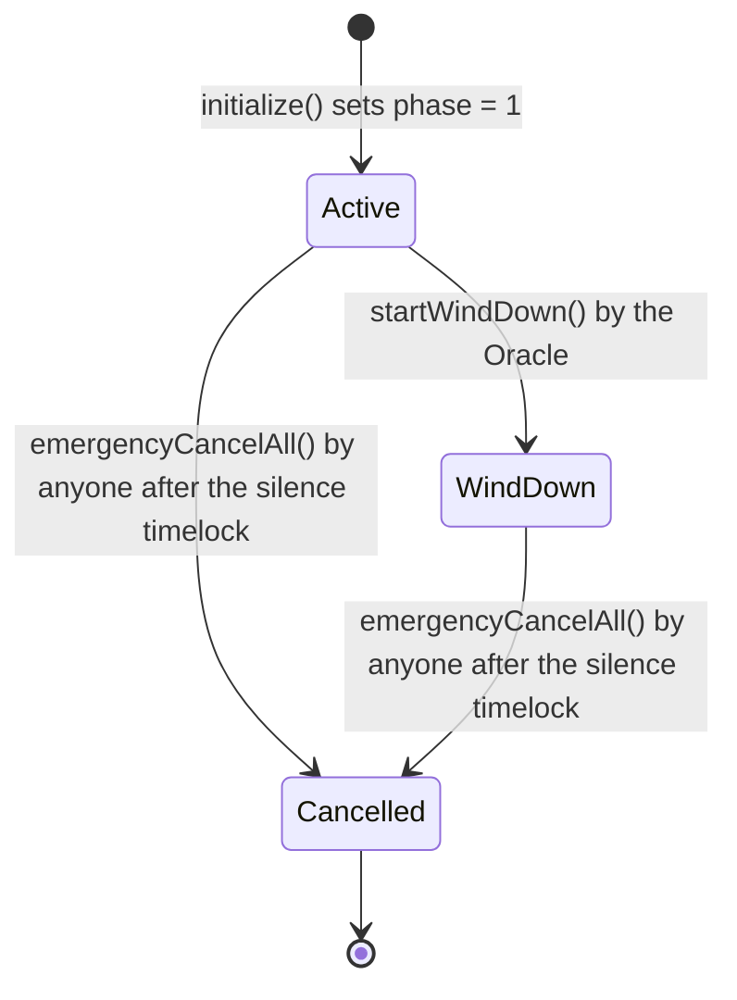
```mermaid
stateDiagram-v2
    [*] --> Active : initialize() sets phase = 1
    Active --> WindDown : startWindDown() by the Oracle
    Active --> Cancelled : emergencyCancelAll() by anyone after the silence timelock
    WindDown --> Cancelled : emergencyCancelAll() by anyone after the silence timelock
    Cancelled --> [*]
```

What each phase allows, from the checks in the code:

| Function | Active | WindDown | Cancelled | Paused |
|---|---|---|---|---|
| `depositForIntent`, `mintPositionFor`, `updateTick` | yes | no (`VaultNotActive`) | no (`VaultNotActive`) | no (`TradingIsPaused`) |
| `mergePositions` | yes | yes | no (`VaultCancelled`) | no (`TradingIsPaused`) |
| `heartbeat` | yes | yes | no (`VaultCancelled`) | yes |
| `startWindDown` | yes | no (`VaultNotActive`) | no (`VaultNotActive`) | yes |
| `redeemOutcomeTokens` | no (`VaultStillActive`) | yes | yes | yes |
| `emergencyCancelAll` | yes, after the timelock | yes, after the timelock | no (`VaultCancelled`) | yes |
| `burnPosition`, `burnPositionFor`, `reclaimDeposit`, `reclaimDepositFor`, `mergeCompleteSets` | yes | yes | yes | yes |
| `isValidSignature` vouches | yes | no (`0xffffffff`) | no (`0xffffffff`) | no (`0xffffffff`) |
| `pauseTrading`, `unpauseTrading`, `setMinimumFirstLiquidity` | yes | yes | yes | yes |

## 1. Deployment

### 1.1 Deploy the factory (`LPVaultFactory` constructor)

`LPVaultFactory.sol:185-223`. The `LPVault` implementation is deployed first. Its constructor calls `_disableInitializers()` (`LPVault.sol:580-589`), which sets `_initialized = true` on the implementation, so nobody can call `initialize` on it.

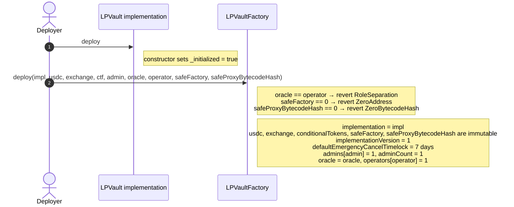
```mermaid
sequenceDiagram
    autonumber
    actor Deployer
    participant Impl as LPVault implementation
    participant Factory as LPVaultFactory

    Deployer->>Impl: deploy
    Note right of Impl: constructor sets _initialized = true
    Deployer->>Factory: deploy(impl, usdc, exchange, ctf, admin, oracle, operator, safeFactory, safeProxyBytecodeHash)
    Note right of Factory: oracle == operator → revert RoleSeparation<br/>safeFactory == 0 → revert ZeroAddress<br/>safeProxyBytecodeHash == 0 → revert ZeroBytecodeHash
    Note right of Factory: implementation = impl<br/>usdc, exchange, conditionalTokens, safeFactory, safeProxyBytecodeHash are immutable<br/>implementationVersion = 1<br/>defaultEmergencyCancelTimelock = 7 days<br/>admins[admin] = 1, adminCount = 1<br/>oracle = oracle, operators[operator] = 1
```

The constructor checks no other argument for zero. A zero `admin_` leaves the factory with no usable admin.

### 1.2 Create a vault for a market (`createVault` and `initialize`)

`LPVaultFactory.sol:241-282`, `LPVaultFactory.sol:308-323`, `LPVault.sol:621-674`.

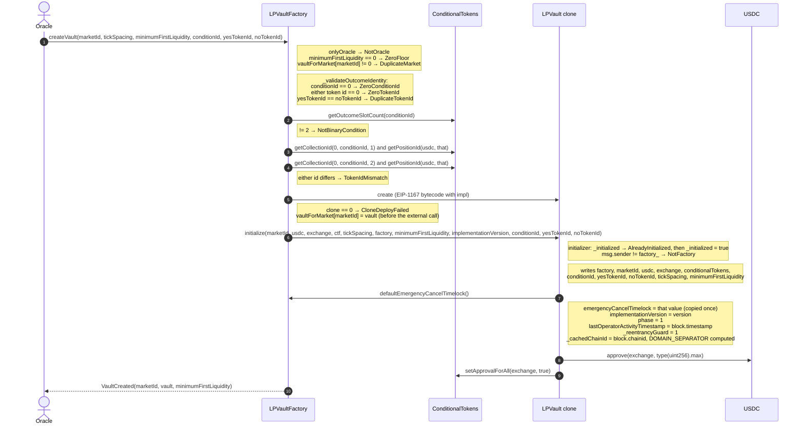
```mermaid
sequenceDiagram
    autonumber
    actor Oracle
    participant Factory as LPVaultFactory
    participant CTF as ConditionalTokens
    participant Vault as LPVault clone
    participant USDC

    Oracle->>Factory: createVault(marketId, tickSpacing, minimumFirstLiquidity, conditionId, yesTokenId, noTokenId)
    Note right of Factory: onlyOracle → NotOracle<br/>minimumFirstLiquidity == 0 → ZeroFloor<br/>vaultForMarket[marketId] != 0 → DuplicateMarket
    Note right of Factory: _validateOutcomeIdentity:<br/>conditionId == 0 → ZeroConditionId<br/>either token id == 0 → ZeroTokenId<br/>yesTokenId == noTokenId → DuplicateTokenId
    Factory->>CTF: getOutcomeSlotCount(conditionId)
    Note right of Factory: != 2 → NotBinaryCondition
    Factory->>CTF: getCollectionId(0, conditionId, 1) and getPositionId(usdc, that)
    Factory->>CTF: getCollectionId(0, conditionId, 2) and getPositionId(usdc, that)
    Note right of Factory: either id differs → TokenIdMismatch
    Factory->>Vault: create (EIP-1167 bytecode with impl)
    Note right of Factory: clone == 0 → CloneDeployFailed<br/>vaultForMarket[marketId] = vault (before the external call)
    Factory->>Vault: initialize(marketId, usdc, exchange, ctf, tickSpacing, factory, minimumFirstLiquidity, implementationVersion, conditionId, yesTokenId, noTokenId)
    Note right of Vault: initializer: _initialized → AlreadyInitialized, then _initialized = true<br/>msg.sender != factory_ → NotFactory
    Note right of Vault: writes factory, marketId, usdc, exchange, conditionalTokens,<br/>conditionId, yesTokenId, noTokenId, tickSpacing, minimumFirstLiquidity
    Vault->>Factory: defaultEmergencyCancelTimelock()
    Note right of Vault: emergencyCancelTimelock = that value (copied once)<br/>implementationVersion = version<br/>phase = 1<br/>lastOperatorActivityTimestamp = block.timestamp<br/>_reentrancyGuard = 1<br/>_cachedChainId = block.chainid, DOMAIN_SEPARATOR computed
    Vault->>USDC: approve(exchange, type(uint256).max)
    Vault->>CTF: setApprovalForAll(exchange, true)
    Factory-->>Oracle: VaultCreated(marketId, vault, minimumFirstLiquidity)
```

The vault stores no roles. Every role check reads the factory at call time (`LPVault.sol:517-527`).

`tickSpacing` is stored without a check. A zero `tickSpacing` makes `_requireValidRange` (`LPVault.sol:2060`) divide by zero on every deposit and mint. A negative `tickSpacing` works, because Solidity's `%` takes the sign of the dividend.

## 2. Factory governance

### 2.1 Role management

All on `LPVaultFactory.sol:409-506`. Each vault reads `admins`, `operators`, and `oracle` from the factory on every call, so a change reaches every vault in the same block.

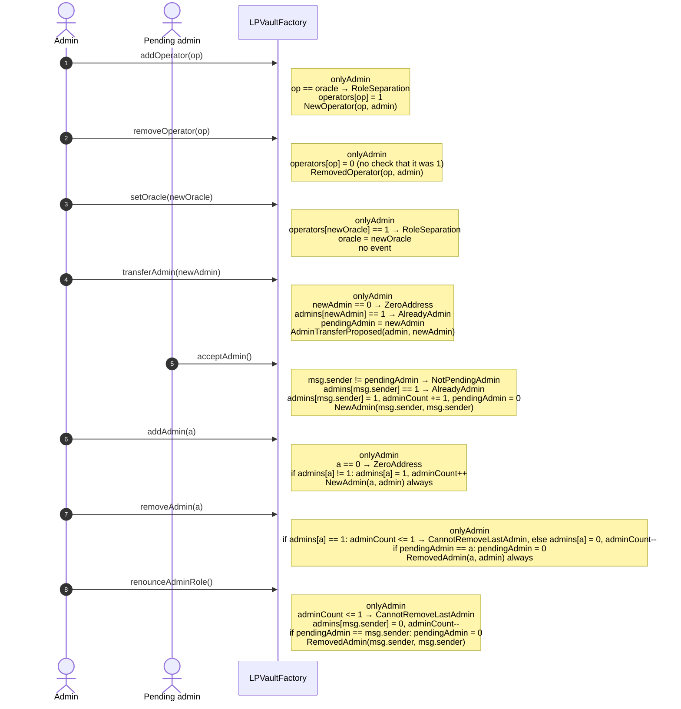
```mermaid
sequenceDiagram
    autonumber
    actor Admin
    actor Pending as Pending admin
    participant Factory as LPVaultFactory

    Admin->>Factory: addOperator(op)
    Note right of Factory: onlyAdmin<br/>op == oracle → RoleSeparation<br/>operators[op] = 1<br/>NewOperator(op, admin)

    Admin->>Factory: removeOperator(op)
    Note right of Factory: onlyAdmin<br/>operators[op] = 0 (no check that it was 1)<br/>RemovedOperator(op, admin)

    Admin->>Factory: setOracle(newOracle)
    Note right of Factory: onlyAdmin<br/>operators[newOracle] == 1 → RoleSeparation<br/>oracle = newOracle<br/>no event

    Admin->>Factory: transferAdmin(newAdmin)
    Note right of Factory: onlyAdmin<br/>newAdmin == 0 → ZeroAddress<br/>admins[newAdmin] == 1 → AlreadyAdmin<br/>pendingAdmin = newAdmin<br/>AdminTransferProposed(admin, newAdmin)

    Pending->>Factory: acceptAdmin()
    Note right of Factory: msg.sender != pendingAdmin → NotPendingAdmin<br/>admins[msg.sender] == 1 → AlreadyAdmin<br/>admins[msg.sender] = 1, adminCount += 1, pendingAdmin = 0<br/>NewAdmin(msg.sender, msg.sender)

    Admin->>Factory: addAdmin(a)
    Note right of Factory: onlyAdmin<br/>a == 0 → ZeroAddress<br/>if admins[a] != 1: admins[a] = 1, adminCount++<br/>NewAdmin(a, admin) always

    Admin->>Factory: removeAdmin(a)
    Note right of Factory: onlyAdmin<br/>if admins[a] == 1: adminCount <= 1 → CannotRemoveLastAdmin, else admins[a] = 0, adminCount--<br/>if pendingAdmin == a: pendingAdmin = 0<br/>RemovedAdmin(a, admin) always

    Admin->>Factory: renounceAdminRole()
    Note right of Factory: onlyAdmin<br/>adminCount <= 1 → CannotRemoveLastAdmin<br/>admins[msg.sender] = 0, adminCount--<br/>if pendingAdmin == msg.sender: pendingAdmin = 0<br/>RemovedAdmin(msg.sender, msg.sender)
```

`setOracle` emits no event. `setOracle(address(0))` is accepted.

### 2.2 Implementation upgrade

`LPVaultFactory.sol:351-396`. Only vaults created after `applyImplementation` use the new code. An existing clone keeps the implementation address inside its own bytecode.

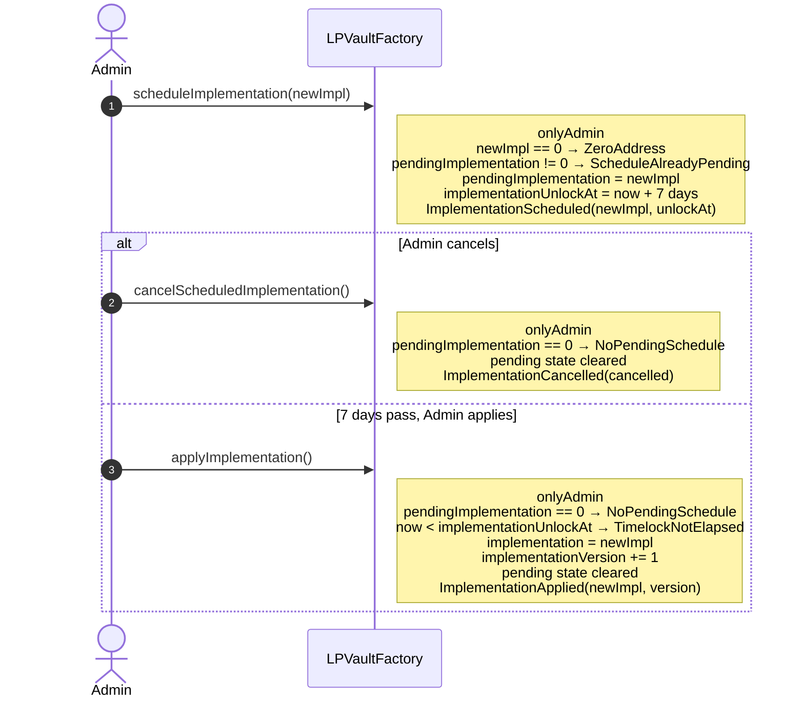
```mermaid
sequenceDiagram
    autonumber
    actor Admin
    participant Factory as LPVaultFactory

    Admin->>Factory: scheduleImplementation(newImpl)
    Note right of Factory: onlyAdmin<br/>newImpl == 0 → ZeroAddress<br/>pendingImplementation != 0 → ScheduleAlreadyPending<br/>pendingImplementation = newImpl<br/>implementationUnlockAt = now + 7 days<br/>ImplementationScheduled(newImpl, unlockAt)

    alt Admin cancels
        Admin->>Factory: cancelScheduledImplementation()
        Note right of Factory: onlyAdmin<br/>pendingImplementation == 0 → NoPendingSchedule<br/>pending state cleared<br/>ImplementationCancelled(cancelled)
    else 7 days pass, Admin applies
        Admin->>Factory: applyImplementation()
        Note right of Factory: onlyAdmin<br/>pendingImplementation == 0 → NoPendingSchedule<br/>now < implementationUnlockAt → TimelockNotElapsed<br/>implementation = newImpl<br/>implementationVersion += 1<br/>pending state cleared<br/>ImplementationApplied(newImpl, version)
    end
```

`scheduleImplementation` does not check that `newImpl` holds code.

### 2.3 Default emergency-cancel timelock

`LPVaultFactory.sol:292-299`. The value reaches only vaults created after the change, because `initialize` copies it once.

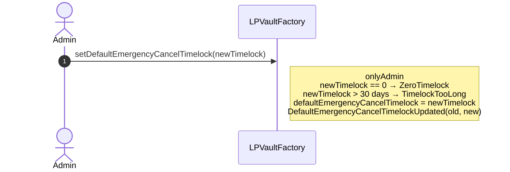
```mermaid
sequenceDiagram
    autonumber
    actor Admin
    participant Factory as LPVaultFactory

    Admin->>Factory: setDefaultEmergencyCancelTimelock(newTimelock)
    Note right of Factory: onlyAdmin<br/>newTimelock == 0 → ZeroTimelock<br/>newTimelock > 30 days → TimelockTooLong<br/>defaultEmergencyCancelTimelock = newTimelock<br/>DefaultEmergencyCancelTimelockUpdated(old, new)
```

## 3. Signature verification (shared by every relayed LP path)

`LPVault.sol:2087-2141`. `depositForIntent`, `reclaimDepositFor`, and `burnPositionFor` all call `_verifySafeOwnerSignature(lp, structHash, signature)`.

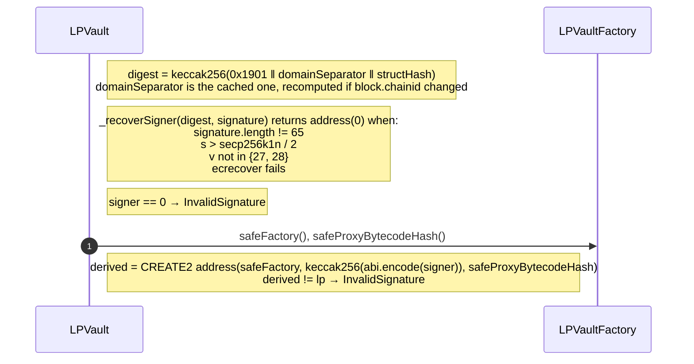
```mermaid
sequenceDiagram
    autonumber
    participant Vault as LPVault
    participant Factory as LPVaultFactory

    Note right of Vault: digest = keccak256(0x1901 ‖ domainSeparator ‖ structHash)<br/>domainSeparator is the cached one, recomputed if block.chainid changed
    Note right of Vault: _recoverSigner(digest, signature) returns address(0) when:<br/>signature.length != 65<br/>s > secp256k1n / 2<br/>v not in {27, 28}<br/>ecrecover fails
    Note right of Vault: signer == 0 → InvalidSignature
    Vault->>Factory: safeFactory(), safeProxyBytecodeHash()
    Note right of Vault: derived = CREATE2 address(safeFactory, keccak256(abi.encode(signer)), safeProxyBytecodeHash)<br/>derived != lp → InvalidSignature
```

The three type strings (`LPVault.sol:315-330`):

| Type | Fields | Replay record |
|---|---|---|
| `MintIntent` | `lp, tickLower, tickUpper, usdcAmount, intentId, deadline` | `usedIntents[intentId]` and `pendingDeposits[intentId]` |
| `ReclaimIntent` | `lp, intentId, deadline` | `usedIntents[intentId]` |
| `BurnIntent` | `lp, positionId, deadline` | `usedBurnAuthorizations[structHash]` |

The domain is `name = "LPVault"`, `version = "1"`, `chainId`, and the vault's address (`LPVault.sol:2469-2473`).

## 4. Escrow and mint

### 4.1 Escrow a deposit (`depositForIntent`)

`LPVault.sol:939-982`. Modifiers: `onlyOperator`, `whenNotPaused`, `nonReentrant`, `touchesHeartbeat`.

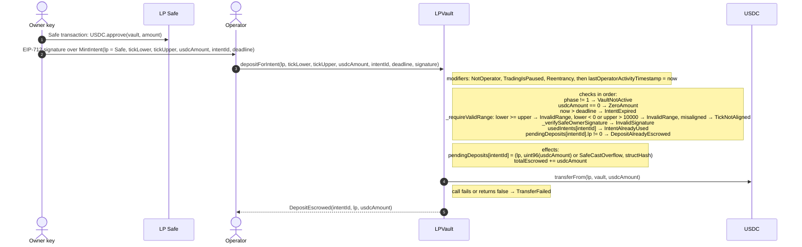
```mermaid
sequenceDiagram
    autonumber
    actor OwnerKey as Owner key
    participant Safe as LP Safe
    actor Operator
    participant Vault as LPVault
    participant USDC

    OwnerKey->>Safe: Safe transaction: USDC.approve(vault, amount)
    OwnerKey->>Operator: EIP-712 signature over MintIntent(lp = Safe, tickLower, tickUpper, usdcAmount, intentId, deadline)
    Operator->>Vault: depositForIntent(lp, tickLower, tickUpper, usdcAmount, intentId, deadline, signature)
    Note right of Vault: modifiers: NotOperator, TradingIsPaused, Reentrancy, then lastOperatorActivityTimestamp = now
    Note right of Vault: checks in order:<br/>phase != 1 → VaultNotActive<br/>usdcAmount == 0 → ZeroAmount<br/>now > deadline → IntentExpired<br/>_requireValidRange: lower >= upper → InvalidRange, lower < 0 or upper > 10000 → InvalidRange, misaligned → TickNotAligned<br/>_verifySafeOwnerSignature → InvalidSignature<br/>usedIntents[intentId] → IntentAlreadyUsed<br/>pendingDeposits[intentId].lp != 0 → DepositAlreadyEscrowed
    Note right of Vault: effects:<br/>pendingDeposits[intentId] = (lp, uint96(usdcAmount) or SafeCastOverflow, structHash)<br/>totalEscrowed += usdcAmount
    Vault->>USDC: transferFrom(lp, vault, usdcAmount)
    Note right of Vault: call fails or returns false → TransferFailed
    Vault-->>Operator: DepositEscrowed(intentId, lp, usdcAmount)
```

### 4.2 Mint the position (`mintPositionFor`)

`LPVault.sol:1021-1113`. Modifiers: `onlyOperator`, `whenNotPaused`, `nonReentrant`, `touchesHeartbeat`. No signature, no USDC movement, no clock read, no external call.

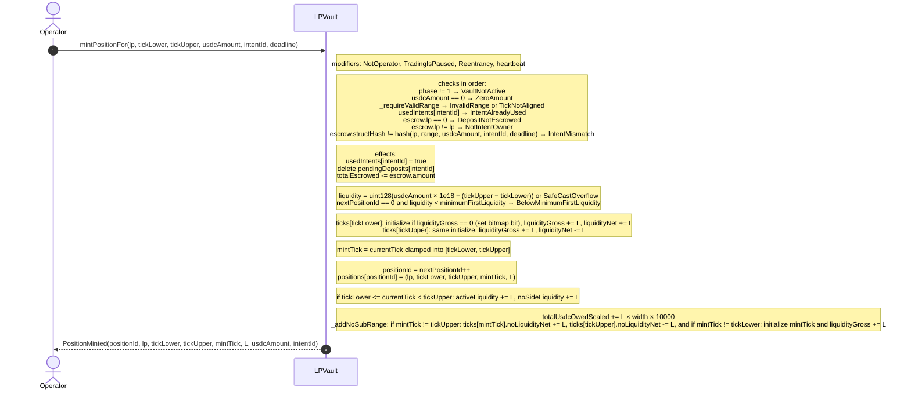
```mermaid
sequenceDiagram
    autonumber
    actor Operator
    participant Vault as LPVault

    Operator->>Vault: mintPositionFor(lp, tickLower, tickUpper, usdcAmount, intentId, deadline)
    Note right of Vault: modifiers: NotOperator, TradingIsPaused, Reentrancy, heartbeat
    Note right of Vault: checks in order:<br/>phase != 1 → VaultNotActive<br/>usdcAmount == 0 → ZeroAmount<br/>_requireValidRange → InvalidRange or TickNotAligned<br/>usedIntents[intentId] → IntentAlreadyUsed<br/>escrow.lp == 0 → DepositNotEscrowed<br/>escrow.lp != lp → NotIntentOwner<br/>escrow.structHash != hash(lp, range, usdcAmount, intentId, deadline) → IntentMismatch
    Note right of Vault: effects:<br/>usedIntents[intentId] = true<br/>delete pendingDeposits[intentId]<br/>totalEscrowed -= escrow.amount
    Note right of Vault: liquidity = uint128(usdcAmount × 1e18 ÷ (tickUpper − tickLower)) or SafeCastOverflow<br/>nextPositionId == 0 and liquidity < minimumFirstLiquidity → BelowMinimumFirstLiquidity
    Note right of Vault: ticks[tickLower]: initialize if liquidityGross == 0 (set bitmap bit), liquidityGross += L, liquidityNet += L<br/>ticks[tickUpper]: same initialize, liquidityGross += L, liquidityNet -= L
    Note right of Vault: mintTick = currentTick clamped into [tickLower, tickUpper]
    Note right of Vault: positionId = nextPositionId++<br/>positions[positionId] = (lp, tickLower, tickUpper, mintTick, L)
    Note right of Vault: if tickLower <= currentTick < tickUpper: activeLiquidity += L, noSideLiquidity += L
    Note right of Vault: totalUsdcOwedScaled += L × width × 10000<br/>_addNoSubRange: if mintTick != tickUpper: ticks[mintTick].noLiquidityNet += L, ticks[tickUpper].noLiquidityNet -= L, and if mintTick != tickLower: initialize mintTick and liquidityGross += L
    Vault-->>Operator: PositionMinted(positionId, lp, tickLower, tickUpper, mintTick, L, usdcAmount, intentId)
```

The mint's claim on the ledger is USDC only. An interior mint tick becomes a crossable tick with `liquidityNet == 0` and a non-zero `noLiquidityNet`.

### 4.3 Reclaim an escrow (`reclaimDeposit`, `reclaimDepositFor`)

`LPVault.sol:1514-1604`. `reclaimDeposit` has only `nonReentrant`. `reclaimDepositFor` has `onlyOperator`, `nonReentrant`, `touchesHeartbeat`. Neither checks the phase or the pause.

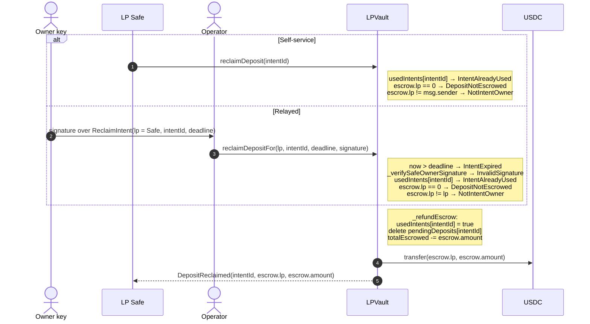
```mermaid
sequenceDiagram
    autonumber
    actor OwnerKey as Owner key
    participant Safe as LP Safe
    actor Operator
    participant Vault as LPVault
    participant USDC

    alt Self-service
        Safe->>Vault: reclaimDeposit(intentId)
        Note right of Vault: usedIntents[intentId] → IntentAlreadyUsed<br/>escrow.lp == 0 → DepositNotEscrowed<br/>escrow.lp != msg.sender → NotIntentOwner
    else Relayed
        OwnerKey->>Operator: signature over ReclaimIntent(lp = Safe, intentId, deadline)
        Operator->>Vault: reclaimDepositFor(lp, intentId, deadline, signature)
        Note right of Vault: now > deadline → IntentExpired<br/>_verifySafeOwnerSignature → InvalidSignature<br/>usedIntents[intentId] → IntentAlreadyUsed<br/>escrow.lp == 0 → DepositNotEscrowed<br/>escrow.lp != lp → NotIntentOwner
    end
    Note right of Vault: _refundEscrow:<br/>usedIntents[intentId] = true<br/>delete pendingDeposits[intentId]<br/>totalEscrowed -= escrow.amount
    Vault->>USDC: transfer(escrow.lp, escrow.amount)
    Vault-->>Safe: DepositReclaimed(intentId, escrow.lp, escrow.amount)
```

A mint and a reclaim of one `intentId` share `usedIntents`, so exactly one of them succeeds.

## 5. Operator trading work

### 5.1 Move the price (`updateTick`)

`LPVault.sol:1663-1722`, with `_nextInitializedTick` (`2352-2410`), `_crossTick` (`2202-2212`), `_accrueSegment` (`2231-2261`), and `_applyShift` (`2266-2270`). Modifiers: `onlyOperator`, `whenNotPaused`, `nonReentrant`, `touchesHeartbeat`. Active only.

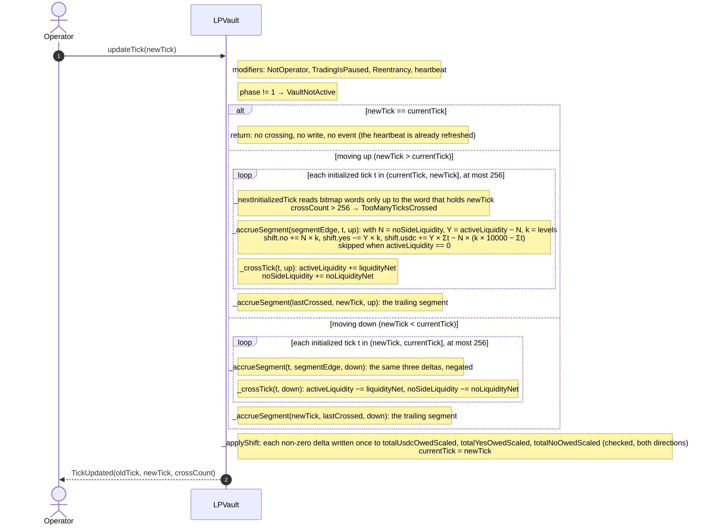
```mermaid
sequenceDiagram
    autonumber
    actor Operator
    participant Vault as LPVault

    Operator->>Vault: updateTick(newTick)
    Note right of Vault: modifiers: NotOperator, TradingIsPaused, Reentrancy, heartbeat
    Note right of Vault: phase != 1 → VaultNotActive
    alt newTick == currentTick
        Note right of Vault: return: no crossing, no write, no event (the heartbeat is already refreshed)
    else moving up (newTick > currentTick)
        loop each initialized tick t in (currentTick, newTick], at most 256
            Note right of Vault: _nextInitializedTick reads bitmap words only up to the word that holds newTick<br/>crossCount > 256 → TooManyTicksCrossed
            Note right of Vault: _accrueSegment(segmentEdge, t, up): with N = noSideLiquidity, Y = activeLiquidity − N, k = levels<br/>shift.no += N × k, shift.yes −= Y × k, shift.usdc += Y × Σt − N × (k × 10000 − Σt)<br/>skipped when activeLiquidity == 0
            Note right of Vault: _crossTick(t, up): activeLiquidity += liquidityNet<br/>noSideLiquidity += noLiquidityNet
        end
        Note right of Vault: _accrueSegment(lastCrossed, newTick, up): the trailing segment
    else moving down (newTick < currentTick)
        loop each initialized tick t in (newTick, currentTick], at most 256
            Note right of Vault: _accrueSegment(t, segmentEdge, down): the same three deltas, negated
            Note right of Vault: _crossTick(t, down): activeLiquidity −= liquidityNet, noSideLiquidity −= noLiquidityNet
        end
        Note right of Vault: _accrueSegment(newTick, lastCrossed, down): the trailing segment
    end
    Note right of Vault: _applyShift: each non-zero delta written once to totalUsdcOwedScaled, totalYesOwedScaled, totalNoOwedScaled (checked, both directions)<br/>currentTick = newTick
    Vault-->>Operator: TickUpdated(oldTick, newTick, crossCount)
```

A move that needs more than 256 crossings, or that jumps many empty bitmap words, is chunked by the Operator into several calls. The totals land on the same values either way.

### 5.2 Merge position records (`mergePositions`)

`LPVault.sol:1756-1820`. Modifiers: `onlyOperator`, `whenNotPaused`, `nonReentrant`, `touchesHeartbeat`. Works in Active and WindDown. This joins LP records. It is not the complete-set merge of section 7.1.

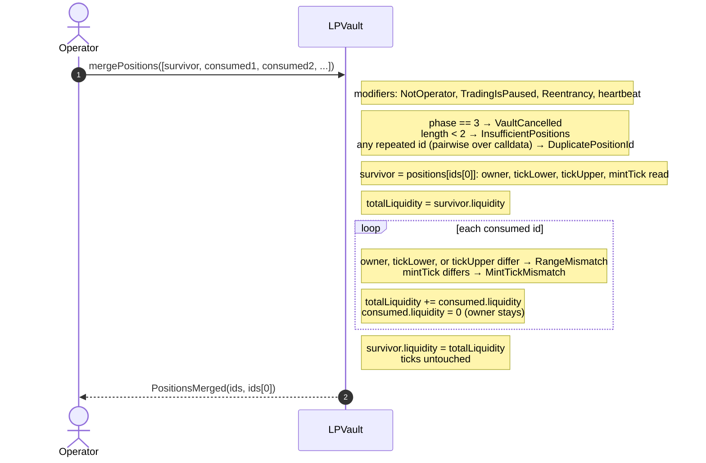
```mermaid
sequenceDiagram
    autonumber
    actor Operator
    participant Vault as LPVault

    Operator->>Vault: mergePositions([survivor, consumed1, consumed2, ...])
    Note right of Vault: modifiers: NotOperator, TradingIsPaused, Reentrancy, heartbeat
    Note right of Vault: phase == 3 → VaultCancelled<br/>length < 2 → InsufficientPositions<br/>any repeated id (pairwise over calldata) → DuplicatePositionId
    Note right of Vault: survivor = positions[ids[0]]: owner, tickLower, tickUpper, mintTick read
    Note right of Vault: totalLiquidity = survivor.liquidity
    loop each consumed id
        Note right of Vault: owner, tickLower, or tickUpper differ → RangeMismatch<br/>mintTick differs → MintTickMismatch
        Note right of Vault: totalLiquidity += consumed.liquidity<br/>consumed.liquidity = 0 (owner stays)
    end
    Note right of Vault: survivor.liquidity = totalLiquidity<br/>ticks untouched
    Vault-->>Operator: PositionsMerged(ids, ids[0])
```

A consumed record keeps its owner with zero liquidity. `burnPosition` rejects it with `PositionNotFound` (`LPVault.sol:1161`).

The function does not check that the survivor exists. If every id names a record with `owner == address(0)` (never minted or burned), the owner check passes on all of them and the call merges empty records and emits the event.

### 5.3 Signal liveness (`heartbeat`)

`LPVault.sol:1627-1631`. Modifiers: `onlyOperator`, `touchesHeartbeat`. No pause check.

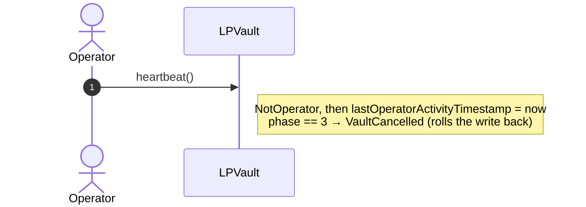
```mermaid
sequenceDiagram
    autonumber
    actor Operator
    participant Vault as LPVault

    Operator->>Vault: heartbeat()
    Note right of Vault: NotOperator, then lastOperatorActivityTimestamp = now<br/>phase == 3 → VaultCancelled (rolls the write back)
```

Every Operator function carries `touchesHeartbeat`, so any successful Operator call refreshes the timer. The self-service exits and `mergeCompleteSets` never do.

## 6. LP exits

### 6.1 Burn a position (`burnPosition`, `burnPositionFor`)

`LPVault.sol:1155-1375` and `_claim` (`1396-1440`). `burnPosition` has only `nonReentrant`. `burnPositionFor` has `onlyOperator`, `nonReentrant`, `touchesHeartbeat`. Neither checks the phase or the pause.

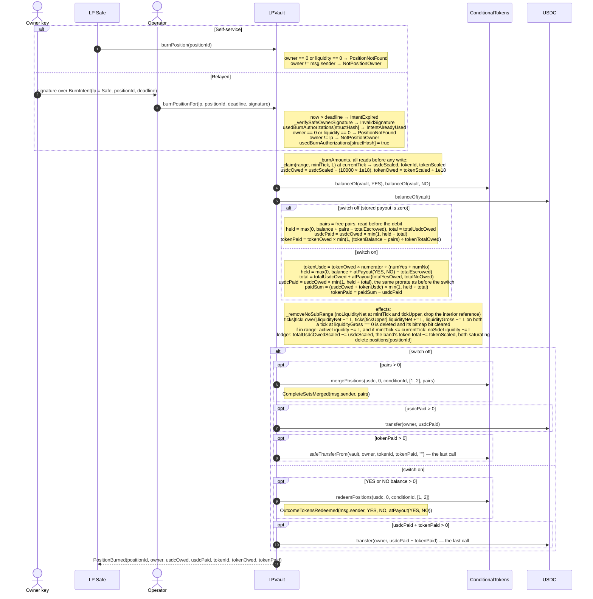
```mermaid
sequenceDiagram
    autonumber
    actor OwnerKey as Owner key
    participant Safe as LP Safe
    actor Operator
    participant Vault as LPVault
    participant CTF as ConditionalTokens
    participant USDC

    alt Self-service
        Safe->>Vault: burnPosition(positionId)
        Note right of Vault: owner == 0 or liquidity == 0 → PositionNotFound<br/>owner != msg.sender → NotPositionOwner
    else Relayed
        OwnerKey->>Operator: signature over BurnIntent(lp = Safe, positionId, deadline)
        Operator->>Vault: burnPositionFor(lp, positionId, deadline, signature)
        Note right of Vault: now > deadline → IntentExpired<br/>_verifySafeOwnerSignature → InvalidSignature<br/>usedBurnAuthorizations[structHash] → IntentAlreadyUsed<br/>owner == 0 or liquidity == 0 → PositionNotFound<br/>owner != lp → NotPositionOwner<br/>usedBurnAuthorizations[structHash] = true
    end
    Note right of Vault: _burnAmounts, all reads before any write:<br/>_claim(range, mintTick, L) at currentTick → usdcScaled, tokenId, tokenScaled<br/>usdcOwed = usdcScaled ÷ (10000 × 1e18), tokenOwed = tokenScaled ÷ 1e18
    Vault->>CTF: balanceOf(vault, YES), balanceOf(vault, NO)
    Vault->>USDC: balanceOf(vault)
    alt switch off (stored payout is zero)
        Note right of Vault: pairs = free pairs, read before the debit<br/>held = max(0, balance + pairs − totalEscrowed), total = totalUsdcOwed<br/>usdcPaid = usdcOwed × min(1, held ÷ total)<br/>tokenPaid = tokenOwed × min(1, (tokenBalance − pairs) ÷ tokenTotalOwed)
    else switch on
        Note right of Vault: tokenUsdc = tokenOwed × numerator ÷ (numYes + numNo)<br/>held = max(0, balance + atPayout(YES, NO) − totalEscrowed)<br/>total = totalUsdcOwed + atPayout(totalYesOwed, totalNoOwed)<br/>usdcPaid = usdcOwed × min(1, held ÷ total), the same prorate as before the switch<br/>paidSum = (usdcOwed + tokenUsdc) × min(1, held ÷ total)<br/>tokenPaid = paidSum − usdcPaid
    end
    Note right of Vault: effects:<br/>_removeNoSubRange (noLiquidityNet at mintTick and tickUpper, drop the interior reference)<br/>ticks[tickLower].liquidityNet −= L, ticks[tickUpper].liquidityNet += L, liquidityGross −= L on both<br/>a tick at liquidityGross == 0 is deleted and its bitmap bit cleared<br/>if in range: activeLiquidity −= L, and if mintTick <= currentTick: noSideLiquidity −= L<br/>ledger: totalUsdcOwedScaled −= usdcScaled, the band's token total −= tokenScaled, both saturating<br/>delete positions[positionId]
    alt switch off
        opt pairs > 0
            Vault->>CTF: mergePositions(usdc, 0, conditionId, [1, 2], pairs)
            Note right of Vault: CompleteSetsMerged(msg.sender, pairs)
        end
        opt usdcPaid > 0
            Vault->>USDC: transfer(owner, usdcPaid)
        end
        opt tokenPaid > 0
            Vault->>CTF: safeTransferFrom(vault, owner, tokenId, tokenPaid, "") — the last call
        end
    else switch on
        opt YES or NO balance > 0
            Vault->>CTF: redeemPositions(usdc, 0, conditionId, [1, 2])
            Note right of Vault: OutcomeTokensRedeemed(msg.sender, YES, NO, atPayout(YES, NO))
        end
        opt usdcPaid + tokenPaid > 0
            Vault->>USDC: transfer(owner, usdcPaid + tokenPaid) — the last call
        end
    end
    Vault-->>Safe: PositionBurned(positionId, owner, usdcOwed, usdcPaid, tokenId, tokenOwed, tokenPaid)
```

The claim (`_claim`), with `m` the mint tick, `c` the current tick, `L` the liquidity, and `width = tickUpper − tickLower`:

| Case | Token | Band | Tokens (scaled) | USDC (scaled) |
|---|---|---|---|---|
| `c < m` | YES | `[max(c, tickLower), m)` | `L × band` | `L × (width × 10000 − Σ ticks of the band)` |
| `c > m` | NO | `[m, min(c, tickUpper))` | `L × band` | `L × ((width − band) × 10000 + Σ ticks of the band)` |
| `c == m`, or the band is empty | none (`tokenId = 0`) | — | 0 | `L × width × 10000` |

`Σ ticks of the band` is the arithmetic series `band × (first + last) ÷ 2` over the band's tick indices, exact because `band × (a + m − 1)` is always even.

A burn is valued at the last reported tick (decision C8). A fill the keeper has not reported yet has already spent the vault's USDC. The ledger's ratio spreads that spend over every claim in proportion to its USDC owed, and a burn inside that window takes its share as a final cut. The tokens the fill bought belong to no claim after the report. They stay in the vault, and at the switch they redeem into the USDC ratio. Before a self-service burn, compare `totalYesOwed()` and `totalNoOwed()` with the vault's two token balances: a balance above the owed total and above the free pairs can be an unreported fill. The Operator reports the tick before it relays `burnPositionFor`, which closes this window on the relayed path (finding CV-08 of `audits/code-validation-round-1.md`, and ADR-DYNK in FEAT-7G40).

### 6.2 Exit after a freeze

After `emergencyCancelAll` the burn and the reclaim run unchanged at the frozen `currentTick`. No code path differs from sections 4.3 and 6.1. Each LP exits in their own transaction.

## 7. Outcome tokens

### 7.1 Merge free pairs (`mergeCompleteSets`)

`LPVault.sol:1841-1899`. Modifier: `nonReentrant` only. No role, phase, pause, or heartbeat.

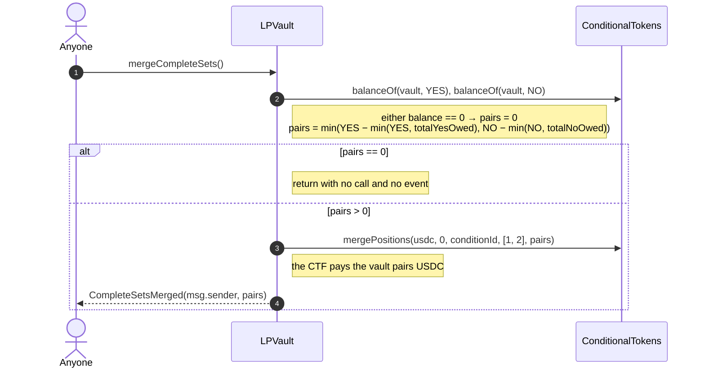
```mermaid
sequenceDiagram
    autonumber
    actor Anyone
    participant Vault as LPVault
    participant CTF as ConditionalTokens

    Anyone->>Vault: mergeCompleteSets()
    Vault->>CTF: balanceOf(vault, YES), balanceOf(vault, NO)
    Note right of Vault: either balance == 0 → pairs = 0<br/>pairs = min(YES − min(YES, totalYesOwed), NO − min(NO, totalNoOwed))
    alt pairs == 0
        Note right of Vault: return with no call and no event
    else pairs > 0
        Vault->>CTF: mergePositions(usdc, 0, conditionId, [1, 2], pairs)
        Note right of Vault: the CTF pays the vault pairs USDC
        Vault-->>Anyone: CompleteSetsMerged(msg.sender, pairs)
    end
```

A pair below the owed totals is a claim's band token. It never merges, so one claim's YES is never netted against another claim's NO. The call still works after the switch: a free pair merges for 1 USDC, the same value a redemption pays for it.

### 7.2 Fill a vault order (`isValidSignature` and the receiver hooks)

`LPVault.sol:788-808` and `693-727`. The vault is the maker of its own orders. The keeper signs with the Operator key and names the vault as `maker` and `signer` with `signatureType = POLY_1271`.

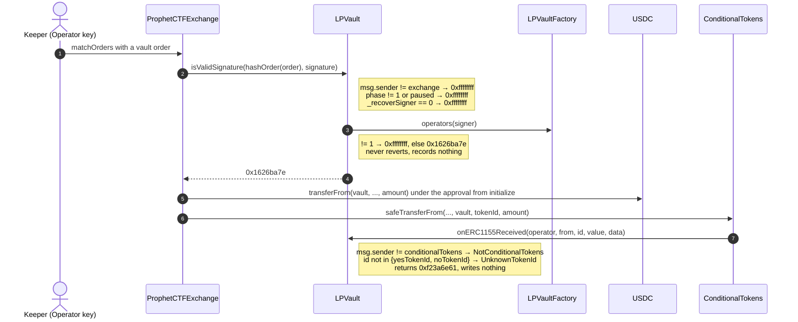
```mermaid
sequenceDiagram
    autonumber
    actor Keeper as Keeper (Operator key)
    participant Exchange as ProphetCTFExchange
    participant Vault as LPVault
    participant Factory as LPVaultFactory
    participant USDC
    participant CTF as ConditionalTokens

    Keeper->>Exchange: matchOrders with a vault order
    Exchange->>Vault: isValidSignature(hashOrder(order), signature)
    Note right of Vault: msg.sender != exchange → 0xffffffff<br/>phase != 1 or paused → 0xffffffff<br/>_recoverSigner == 0 → 0xffffffff
    Vault->>Factory: operators(signer)
    Note right of Vault: != 1 → 0xffffffff, else 0x1626ba7e<br/>never reverts, records nothing
    Vault-->>Exchange: 0x1626ba7e
    Exchange->>USDC: transferFrom(vault, ..., amount) under the approval from initialize
    Exchange->>CTF: safeTransferFrom(..., vault, tokenId, amount)
    CTF->>Vault: onERC1155Received(operator, from, id, value, data)
    Note right of Vault: msg.sender != conditionalTokens → NotConditionalTokens<br/>id not in {yesTokenId, noTokenId} → UnknownTokenId<br/>returns 0xf23a6e61, writes nothing
```

`onERC1155BatchReceived` checks every id the same way and returns `0xbc197c81`. `supportsInterface` returns true for `0x4e2312e0` (ERC-1155 receiver), `0x01ffc9a7` (ERC-165), and `0x1626ba7e` (ERC-1271).

The vault checks who signed, never what was signed. There is no size cap, price band, side restriction, nonce, or order record in the vault. One `removeOperator` on the factory invalidates every unfilled order that key signed.

### 7.3 Redeem after resolution (`redeemOutcomeTokens`)

`LPVault.sol:1939-1999`. Modifiers: `onlyOracle`, `nonReentrant`. No heartbeat, no pause check, no phase change.

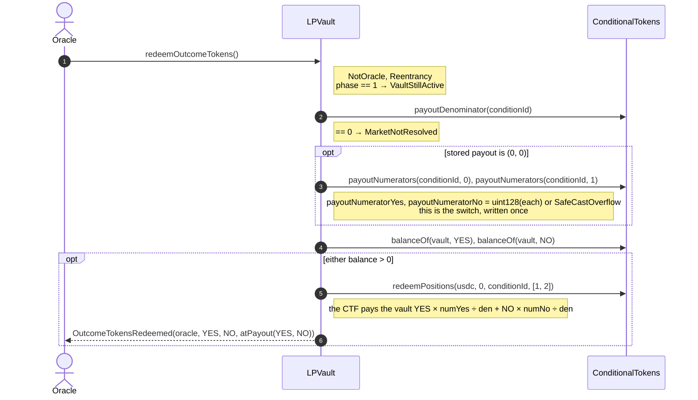
```mermaid
sequenceDiagram
    autonumber
    actor Oracle
    participant Vault as LPVault
    participant CTF as ConditionalTokens

    Oracle->>Vault: redeemOutcomeTokens()
    Note right of Vault: NotOracle, Reentrancy<br/>phase == 1 → VaultStillActive
    Vault->>CTF: payoutDenominator(conditionId)
    Note right of Vault: == 0 → MarketNotResolved
    opt stored payout is (0, 0)
        Vault->>CTF: payoutNumerators(conditionId, 0), payoutNumerators(conditionId, 1)
        Note right of Vault: payoutNumeratorYes, payoutNumeratorNo = uint128(each) or SafeCastOverflow<br/>this is the switch, written once
    end
    Vault->>CTF: balanceOf(vault, YES), balanceOf(vault, NO)
    opt either balance > 0
        Vault->>CTF: redeemPositions(usdc, 0, conditionId, [1, 2])
        Note right of Vault: the CTF pays the vault YES × numYes ÷ den + NO × numNo ÷ den
        Vault-->>Oracle: OutcomeTokensRedeemed(oracle, YES, NO, atPayout(YES, NO))
    end
```

The Oracle can delay the switch. It cannot set the payout: the vault reads it from the Conditional Tokens contract inside the call. A market whose two numerators are both zero cannot resolve at the Conditional Tokens contract, so the stored pair is non-zero whenever the switch is on.

## 8. Lifecycle and emergency

### 8.1 Wind down (`startWindDown`)

`LPVault.sol:843-847`. Modifier: `onlyOracle`. No reentrancy guard, because there is no external call.

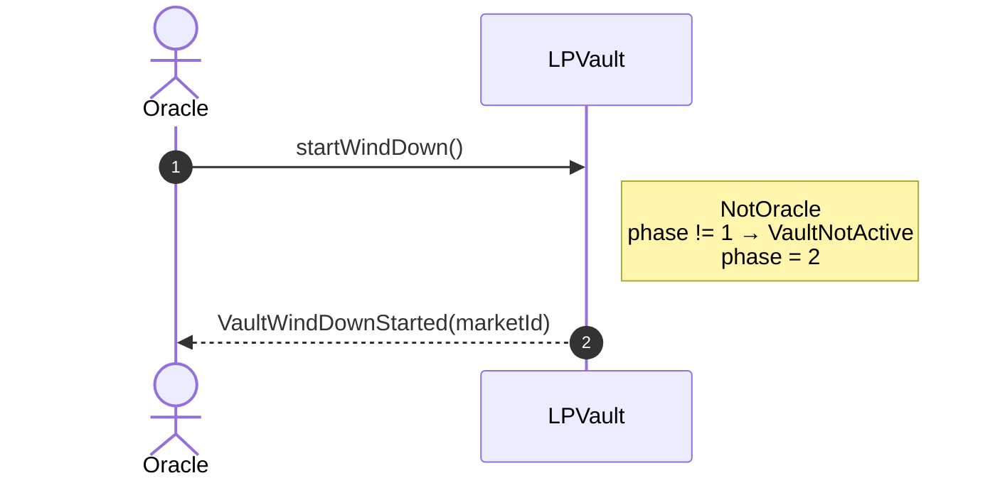
```mermaid
sequenceDiagram
    autonumber
    actor Oracle
    participant Vault as LPVault

    Oracle->>Vault: startWindDown()
    Note right of Vault: NotOracle<br/>phase != 1 → VaultNotActive<br/>phase = 2
    Vault-->>Oracle: VaultWindDownStarted(marketId)
```

After it, `depositForIntent`, `mintPositionFor`, and `updateTick` revert `VaultNotActive`. `mergePositions` and `heartbeat` still work. Every exit still works. `isValidSignature` refuses, so a resting vault order fails at match time.

### 8.2 Freeze after Operator silence (`emergencyCancelAll`)

`LPVault.sol:890-904`. No modifier at all.

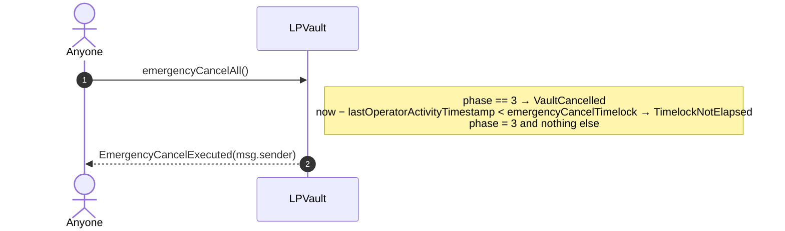
```mermaid
sequenceDiagram
    autonumber
    actor Anyone
    participant Vault as LPVault

    Anyone->>Vault: emergencyCancelAll()
    Note right of Vault: phase == 3 → VaultCancelled<br/>now − lastOperatorActivityTimestamp < emergencyCancelTimelock → TimelockNotElapsed<br/>phase = 3 and nothing else
    Vault-->>Anyone: EmergencyCancelExecuted(msg.sender)
```

The freeze keeps every position, tick, escrow, balance, and ledger total. `mergePositions` and `heartbeat` revert `VaultCancelled` from then on. The three Active-only functions revert `VaultNotActive`. The phase is terminal.

### 8.3 Pause and unpause (`pauseTrading`, `unpauseTrading`)

`LPVault.sol:857-867`. Modifier: `onlyAdmin`. Neither checks the current value, so a repeated call succeeds and emits again.

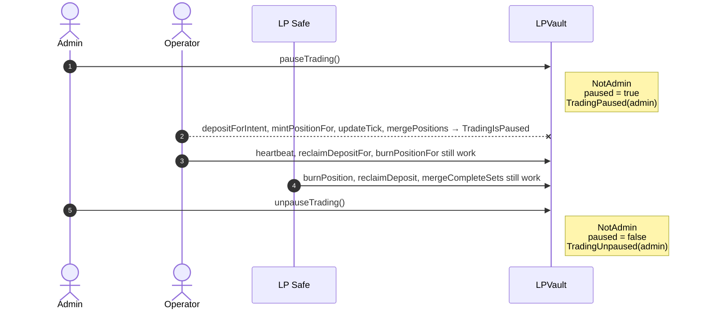
```mermaid
sequenceDiagram
    autonumber
    actor Admin
    actor Operator
    participant Safe as LP Safe
    participant Vault as LPVault

    Admin->>Vault: pauseTrading()
    Note right of Vault: NotAdmin<br/>paused = true<br/>TradingPaused(admin)
    Operator--xVault: depositForIntent, mintPositionFor, updateTick, mergePositions → TradingIsPaused
    Operator->>Vault: heartbeat, reclaimDepositFor, burnPositionFor still work
    Safe->>Vault: burnPosition, reclaimDeposit, mergeCompleteSets still work
    Admin->>Vault: unpauseTrading()
    Note right of Vault: NotAdmin<br/>paused = false<br/>TradingUnpaused(admin)
```

### 8.4 Set the first-mint floor (`setMinimumFirstLiquidity`)

`LPVault.sol:822-829`. Modifier: `onlyOracle`.

```mermaid
sequenceDiagram
    autonumber
    actor Oracle
    participant Vault as LPVault

    Oracle->>Vault: setMinimumFirstLiquidity(newMin)
    Note right of Vault: NotOracle<br/>newMin == 0 → ZeroFloor<br/>minimumFirstLiquidity = newMin
    Vault-->>Oracle: MinimumFirstLiquidityUpdated(oldMin, newMin)
```

The floor applies only while `nextPositionId == 0`. After the first mint the setter still succeeds and changes a value no mint reads.

## 9. Full lifecycle example

One market from deployment to the last exit, with every call in the order the code allows it.

```mermaid
sequenceDiagram
    autonumber
    actor Admin
    actor Oracle
    actor Operator
    participant Safe as LP Safe
    participant Factory as LPVaultFactory
    participant Vault as LPVault
    participant CTF as ConditionalTokens

    Admin->>Factory: deploy
    Oracle->>Factory: createVault(...)
    Factory->>Vault: clone + initialize (phase = 1, approvals to the exchange)
    Operator->>Vault: depositForIntent(...) with the owner key's MintIntent
    Vault->>Safe: transferFrom USDC
    Operator->>Vault: mintPositionFor(...) → positionId 0, mintTick = clamped currentTick
    Operator->>Vault: updateTick(newTick) as the CLOB moves, ledger shifts per segment
    Oracle->>Vault: startWindDown() → phase = 2
    Oracle->>Vault: redeemOutcomeTokens() → the switch, every token redeemed
    Safe->>Vault: burnPosition(0) → one USDC transfer for principal + the token leg at the payout
```

If the Operator goes silent for the vault's timelock at any point after creation, anyone calls `emergencyCancelAll` and the same exits run at the frozen tick.

## 10. Who can call what

| Function | Caller | Modifiers in order | Phase gate |
|---|---|---|---|
| `createVault` | Oracle | `onlyOracle` | — |
| `setDefaultEmergencyCancelTimelock` | Admin | `onlyAdmin` | — |
| `addOperator`, `removeOperator`, `setOracle`, `transferAdmin`, `addAdmin`, `removeAdmin`, `renounceAdminRole` | Admin | `onlyAdmin` | — |
| `acceptAdmin` | the pending admin | none (inline check) | — |
| `scheduleImplementation`, `applyImplementation`, `cancelScheduledImplementation` | Admin | `onlyAdmin` | — |
| `initialize` | the factory | `initializer`, then inline `msg.sender == factory_` | — |
| `setMinimumFirstLiquidity` | Oracle | `onlyOracle` | none |
| `startWindDown` | Oracle | `onlyOracle` | Active |
| `redeemOutcomeTokens` | Oracle | `onlyOracle`, `nonReentrant` | WindDown or Cancelled |
| `pauseTrading`, `unpauseTrading` | Admin | `onlyAdmin` | none |
| `depositForIntent` | Operator | `onlyOperator`, `whenNotPaused`, `nonReentrant`, `touchesHeartbeat` | Active |
| `mintPositionFor` | Operator | `onlyOperator`, `whenNotPaused`, `nonReentrant`, `touchesHeartbeat` | Active |
| `updateTick` | Operator | `onlyOperator`, `whenNotPaused`, `nonReentrant`, `touchesHeartbeat` | Active |
| `mergePositions` | Operator | `onlyOperator`, `whenNotPaused`, `nonReentrant`, `touchesHeartbeat` | not Cancelled |
| `heartbeat` | Operator | `onlyOperator`, `touchesHeartbeat` | not Cancelled |
| `reclaimDepositFor`, `burnPositionFor` | Operator | `onlyOperator`, `nonReentrant`, `touchesHeartbeat` | none |
| `reclaimDeposit`, `burnPosition` | the recorded Safe | `nonReentrant` | none |
| `mergeCompleteSets` | anyone | `nonReentrant` | none |
| `emergencyCancelAll` | anyone | none | not Cancelled, after the timelock |
| `isValidSignature` | the exchange (a view) | none (inline checks, never reverts) | Active and not paused |
| `onERC1155Received`, `onERC1155BatchReceived` | the Conditional Tokens contract (views) | `onlyConditionalTokens` | none |
| `supportsInterface`, `payoutNumerators`, `totalUsdcOwed`, `totalYesOwed`, `totalNoOwed`, `operators`, `oracle`, `admins` | anyone (views) | none | none |
