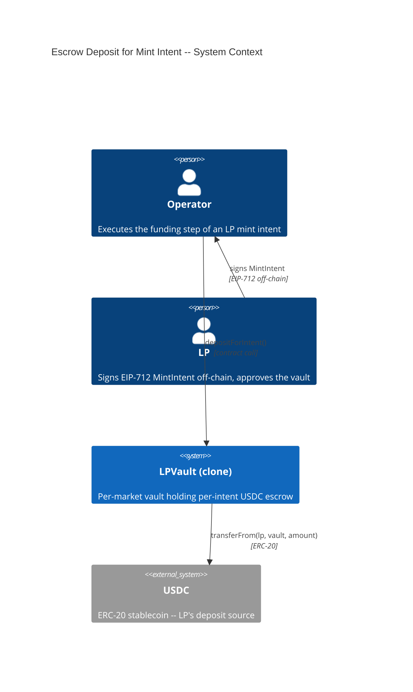
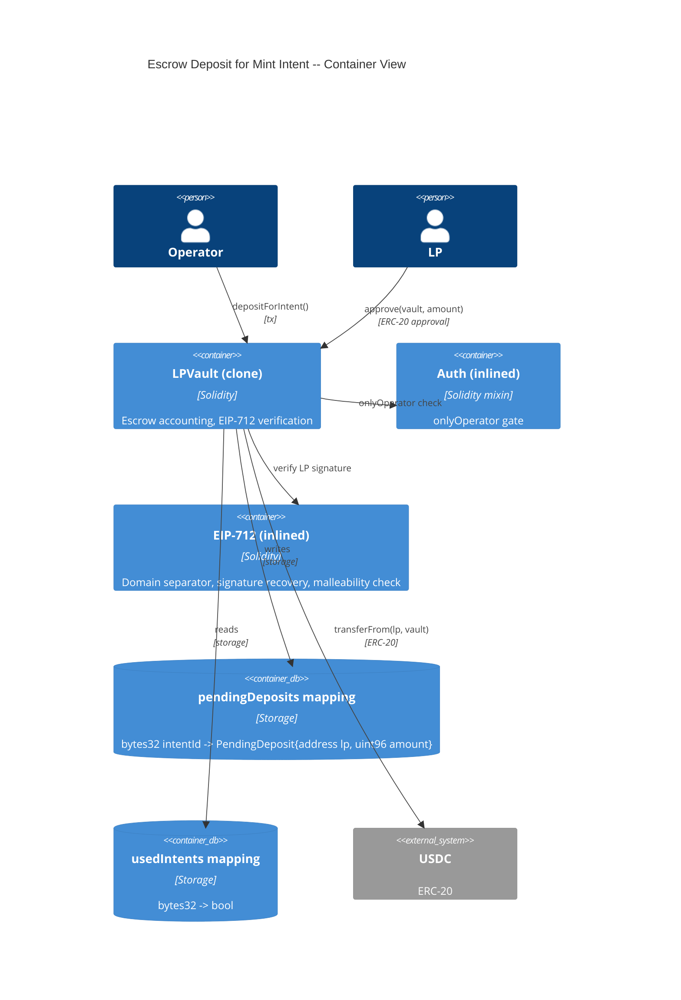
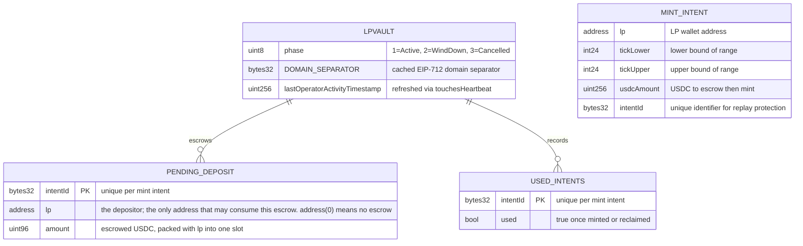

# Architecture: Escrow Deposit for Mint Intent

## System Context (C4 L1)

## Container View (C4 L2)

## Data Model

> Adds one mapping to existing LPVault storage. `pendingDeposits` is the single source of truth for "**whose** USDC, and how much, is attributable to this intentId." Both halves matter: the amount alone is not a claim, because the signature scheme does not bind an intentId to an LP.

**Invariants:**
- `pendingDeposits[id].lp != address(0)` implies the vault holds at least `.amount` USDC attributable to `id`, on behalf of `.lp` specifically
- **Only `pendingDeposits[id].lp` may consume the escrow at `id`.** Every consuming path (`mintPositionFor`, `reclaimDeposit`, `reclaimDepositFor`) checks this before moving funds. A valid EIP-712 signature over `id` is necessary but NOT sufficient — see ADR-45IC
- A populated escrow entry and `usedIntents[id] == true` are mutually exclusive -- an intent is either funded or spent, never both
- `pendingDeposits[id]` is written exactly once per intentId and thereafter only deleted (by mint or by reclaim), never incremented and never reassigned to a different `lp`
- `address(0)` in the `lp` field is the reserved "no escrow" sentinel
- The sum of all populated `pendingDeposits[*].amount` is USDC the vault holds on behalf of LPs and must never be counted as fee revenue or position principal

## Component Inventory

| File | Role | Key Exports |
|------|------|-------------|
| `src/LPVault.sol` | vault contract -- escrow accounting and EIP-712 verification | `depositForIntent()` (external, onlyOperator, nonReentrant, touchesHeartbeat), `PendingDeposit` (struct), `pendingDeposits` (mapping), `_toUint96()` (inline SafeCast), `_verifyMintIntent()` (internal view, shared with FEAT-T7AF) |
| `test/features/FEAT-3ZRI-escrow-deposit-for-mint-intent/UC-3Z92-operator-escrow-deposit-for-intent.t.sol` | Integration tests for all 9 scenarios | SC-3Z94, SC-45IB, SC-3Z95 through SC-3Z9B |

## Event Topology

| Event | Publisher | Payload | Condition | Consumers |
|-------|-----------|---------|-----------|-----------|
| `DepositEscrowed(bytes32 indexed intentId, address indexed lp, uint256 usdcAmount)` | `LPVault.depositForIntent` | `intentId, lp, usdcAmount` | On successful escrow (SC-3Z94) | Off-chain indexer, LP UI, Operator bot |

**Non-events (explicit):**
- SC-3Z95, SC-3Z96, SC-3Z97, SC-3Z98, SC-3Z99, SC-3Z9A, SC-3Z9B: no event emitted on revert
- SC-45IB: the escrow entry records the depositor; no additional event beyond SC-3Z94's DepositEscrowed
- No `PositionMinted` is ever emitted by this feature -- escrow and mint are separate transactions

## API Surface

| Method | Path | Handler | Auth | Request Shape | Response Shape | Error Codes |
|--------|------|---------|------|---------------|----------------|-------------|
| contract-call | `LPVault.depositForIntent(address,int24,int24,uint256,bytes32,bytes)` | `depositForIntent` | onlyOperator + whenNotPaused + nonReentrant + touchesHeartbeat | `lp, tickLower, tickUpper, usdcAmount, intentId, lpSignature` | void (escrow recorded as side effect) | NotOperator, VaultNotActive, ZeroAmount, SafeCastOverflow, DepositAlreadyEscrowed, IntentAlreadyUsed, InvalidSignature |

## Integration Points

| System | Protocol | Direction | Purpose |
|--------|----------|-----------|---------|
| USDC (ERC-20) | ERC-20 `transferFrom` | inbound (vault pulls from LP wallet) | Moves the LP's deposit into vault escrow |

## Code Map

| Spec ID | Spec Name | Implementation Files |
|---------|-----------|---------------------|
| UC-3Z92 | Operator Escrow Deposit for Intent | `src/LPVault.sol:depositForIntent()` |
| SC-3Z94 | Successful escrow of a signed mint intent | `src/LPVault.sol:depositForIntent()`, `src/LPVault.sol:_verifyMintIntent()`, `src/LPVault.sol:_safeTransferFrom()` |
| SC-45IB | The escrow entry names its depositor | `src/LPVault.sol:depositForIntent()`, `src/LPVault.sol:PendingDeposit` |
| SC-3Z95 | Revert when the intent is already escrowed | `src/LPVault.sol:depositForIntent()` (pendingDeposits guard) |
| SC-3Z96 | Revert when the intent has already been used | `src/LPVault.sol:depositForIntent()` (usedIntents guard) |
| SC-3Z97 | Revert on invalid LP signature | `src/LPVault.sol:depositForIntent()`, `src/LPVault.sol:_verifyMintIntent()` |
| SC-3Z98 | Revert on non-operator caller | `src/LPVault.sol:depositForIntent()`, `src/LPVault.sol:onlyOperator` |
| SC-3Z99 | Revert on zero amount | `src/LPVault.sol:depositForIntent()` |
| SC-3Z9A | Revert when the vault is not Active | `src/LPVault.sol:depositForIntent()` (phase guard) |
| SC-3Z9B | Failed escrow leaves the silence timer untouched | `src/LPVault.sol:depositForIntent()`, `src/LPVault.sol:touchesHeartbeat` |

## Architecture Decisions

**ADR-3Z9Y:** Per-intent escrow accounting rather than a vault-balance check
In the context of funding a mint intent, facing the choice between crediting an LP's pre-sent USDC by checking that the vault's balance covers the intent and recording a dedicated per-intent escrow entry, we decided to add a `pendingDeposits[intentId]` mapping to achieve unambiguous attribution of every deposited dollar to exactly one intent, accepting one extra storage slot and one extra transaction per LP onboarding. A balance check cannot work here: USDC in the vault is fungible, so with two or more intents outstanding a balance check cannot prove *which* intent's funds it is crediting -- which is precisely how the original design let one LP's reclaim drain another LP's deposit.

**ADR-45IC:** The escrow record stores its owner, because a signature does not prove ownership of an intentId
In the context of deciding what an escrow entry must hold, facing the choice between a bare `intentId => amount` mapping and a record that also names the depositor, we decided to store `(lp, amount)` and to check `lp` on every consuming path, to achieve an escrow that only its depositor can claim, accepting one extra comparison per consumption and a `uint96` bound on the amount so the record still packs into a single slot.

The bare-amount version is **unsafe**, and the reason is subtle enough to be worth recording. `intentId` is not bound to any LP by the signature scheme: `_verifyMintIntent` recovers a signer from the EIP-712 digest and compares it to a caller-supplied `lp` argument. Anyone can therefore produce a signature that verifies over any `intentId` — they sign with their own key and pass their own address as `lp`. With only an amount in storage, nothing distinguishes the LP who actually funded an intent from a stranger presenting a self-signed intent naming the same `intentId`. Because `intentId` is published in the `DepositEscrowed` log, discovery is trivial. The consequence on `reclaimDeposit`, which is permissionless by design, is an unprivileged drain: an attacker reads a pending `intentId`, signs their own intent over it, waits out `RECLAIM_TIMELOCK`, and is paid the victim's escrow while `usedIntents` locks the victim out permanently. That is the same vault-drain the escrow model was introduced to close (ADR-3Z9Y), re-entering through a different door.

**ADR-3Z9Z:** Deposit is Operator-executed with no permissionless fallback
In the context of where the escrow step sits relative to the Operator chokepoint, facing the project-wide policy that the Operator mediates every value-moving action to block front-running and inflation attacks (an attacker seeding a tiny position ahead of a real LP's deposit to skew tick-initialization and fee-growth state in their own favor), we decided to gate `depositForIntent` with `onlyOperator` and deliberately ship no direct-LP twin, to achieve one consistent chokepoint across the whole entry path, accepting that an uncooperative Operator can refuse to onboard an LP. That refusal is benign in a way an exit-path refusal is not: nothing is pulled until `depositForIntent` runs, so the LP's funds simply stay in the LP's own wallet and there is nothing to rescue. Every *exit* path (burn, collect, reclaim) still ships a permissionless direct-call twin, because there the funds are already inside the vault.

## Testing Decisions

| Service/Pattern | Decision | Reason |
|-----------------|----------|--------|
| USDC (ERC-20) | e2e with mock token | Deploy a minimal ERC-20 mock in test setup; exercise transferFrom including insufficient balance and missing approval |
| EIP-712 signatures | e2e | Foundry's `vm.sign()` cheatcode generates real ECDSA signatures for test accounts |
| Escrow state | e2e | Pure storage -- no external dependency |
