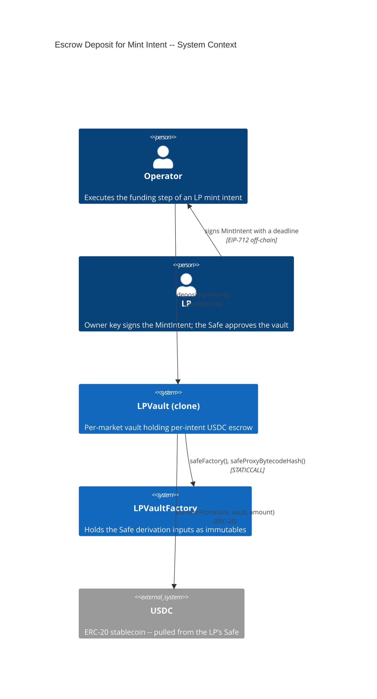
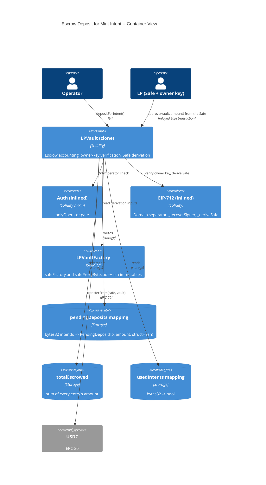
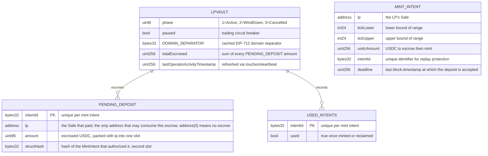

# Architecture: Escrow Deposit for Mint Intent

## System Context (C4 L1)

## Container View (C4 L2)

## Data Model

> Adds one mapping and one counter to LPVault storage. `pendingDeposits` is the single source of truth for whose USDC, how much, and under which intent hash is attributable to an intentId.

**Invariants:**
- `pendingDeposits[id].lp != address(0)` implies the vault holds at least `.amount` USDC attributable to `id`, on behalf of `.lp`
- Only `pendingDeposits[id].lp` may consume the escrow at `id`. Every consuming path (`mintPositionFor`, `reclaimDeposit`, `reclaimDepositFor`) checks this before it moves funds. A valid signature is never sufficient (ADR-45IC)
- A populated escrow entry and `usedIntents[id] == true` are mutually exclusive
- `pendingDeposits[id]` is written once per intentId and afterwards only deleted, never incremented and never reassigned
- `totalEscrowed == Σ pendingDeposits[*].amount`, and `USDC.balanceOf(vault) >= totalEscrowed`
- `address(0)` in the `lp` field is the reserved "no escrow" sentinel
- No USDC that entered the vault without `depositForIntent` is attributable to any intent

## Component Inventory

| File | Role | Key Exports |
|------|------|-------------|
| `src/LPVault.sol` | vault contract -- escrow accounting, owner-key verification, Safe derivation | `depositForIntent()` (external, onlyOperator, whenNotPaused, nonReentrant, touchesHeartbeat), `PendingDeposit` (struct), `pendingDeposits` (mapping), `totalEscrowed`, `_mintIntentHash()`, `_requireValidRange()`, `_recoverSigner()`, `_deriveSafe()`, `_verifySafeOwnerSignature()`, `_toUint96()`, `DepositEscrowed` (event), `DepositAlreadyEscrowed`, `IntentExpired`, `DepositNotEscrowed` (errors) |
| `src/LPVaultFactory.sol` | registry -- the two Safe derivation inputs | `safeFactory`, `safeProxyBytecodeHash` (immutables, FEAT-REPZ) |
| `test/fixtures/LPVaultFixture.sol` | Test fixture -- factory deployment, signing helpers, Safe derivation, escrow-then-mint | `_deployFactory()`, `_safeOf()`, `_signMintIntent()`, `_signReclaimIntent()`, `_fundSafe()`, `_escrow()`, `_escrowAndMint()` |
| `test/features/FEAT-3ZRI-escrow-deposit-for-mint-intent/UC-3Z92-operator-escrow-deposit-for-intent.t.sol` | Integration tests for all 14 scenarios | SC-3Z94 through SC-3Z9B, SC-9OY9 through SC-9OYD |
| `test/invariants/EscrowAccounting.t.sol` | Invariant test for `totalEscrowed` | `EscrowAccountingHandler`, `invariant_totalEscrowedEqualsSumOfEntries`, `invariant_balanceCoversEscrow`, `invariant_escrowedIntentIsUnused` |

## Event Topology

| Event | Publisher | Payload | Condition | Consumers |
|-------|-----------|---------|-----------|-----------|
| `DepositEscrowed(bytes32 indexed intentId, address indexed lp, uint256 usdcAmount)` | `LPVault.depositForIntent` | `intentId, lp, usdcAmount` | On every successful escrow | Off-chain event listener, Operator service, LP UI |

**Non-events (explicit):**
- Every revert scenario: no event emitted, no state change
- `PositionMinted` is never emitted by the deposit; it belongs to the mint (FEAT-T7AF)
- The deadline and the range are not in the event: the app built the intent and holds them

## API Surface

| Method | Path | Handler | Auth | Request Shape | Response Shape | Error Codes |
|--------|------|---------|------|---------------|----------------|-------------|
| call | `LPVault.depositForIntent(address,int24,int24,uint256,bytes32,uint256,bytes)` | `depositForIntent` | onlyOperator + whenNotPaused + nonReentrant + touchesHeartbeat | `lp, tickLower, tickUpper, usdcAmount, intentId, deadline, signature` | void | NotOperator, TradingIsPaused, VaultNotActive, ZeroAmount, IntentExpired, InvalidRange, TickNotAligned, InvalidSignature, IntentAlreadyUsed, DepositAlreadyEscrowed, SafeCastOverflow, TransferFailed |

## Integration Points

| System | Protocol | Direction | Purpose |
|--------|----------|-----------|---------|
| USDC (ERC-20) | ERC-20 `transferFrom` | inbound (vault pulls from the LP's Safe) | Collects the escrowed USDC |
| LPVaultFactory | STATICCALL | inbound read | `safeFactory()` and `safeProxyBytecodeHash()` for the Safe derivation |
| Poly Safe factory | none at run time | — | Its address and its proxy bytecode hash are the derivation inputs; the vault never calls it |

## Code Map

| Spec ID | Spec Name | Implementation Files |
|---------|-----------|---------------------|
| UC-3Z92 | Operator Escrow Deposit for Intent | `src/LPVault.sol:depositForIntent()` |
| SC-3Z94 | Successful escrow of a signed mint intent | `src/LPVault.sol:depositForIntent()`, `src/LPVault.sol:_verifySafeOwnerSignature()`, `src/LPVault.sol:_safeTransferFrom()` |
| SC-45IB | The escrow entry names its depositor and the intent hash | `src/LPVault.sol:depositForIntent()`, `src/LPVault.sol:PendingDeposit`, `src/LPVault.sol:_mintIntentHash()` |
| SC-3Z95 | Revert when the intent is already escrowed | `src/LPVault.sol:depositForIntent()` (pendingDeposits guard) |
| SC-3Z96 | Revert when the intent has already been used | `src/LPVault.sol:depositForIntent()` (usedIntents guard) |
| SC-3Z97 | Revert on an owner key that does not derive the Safe | `src/LPVault.sol:depositForIntent()`, `src/LPVault.sol:_verifySafeOwnerSignature()`, `src/LPVault.sol:_recoverSigner()`, `src/LPVault.sol:_deriveSafe()` |
| SC-3Z98 | Revert on non-operator caller | `src/LPVault.sol:depositForIntent()`, `src/LPVault.sol:onlyOperator` |
| SC-3Z99 | Revert on zero amount | `src/LPVault.sol:depositForIntent()` |
| SC-3Z9A | Revert when the vault is not Active | `src/LPVault.sol:depositForIntent()` (phase guard), `src/LPVault.sol:whenNotPaused` |
| SC-3Z9B | Failed escrow leaves the silence timer untouched | `src/LPVault.sol:depositForIntent()`, `src/LPVault.sol:touchesHeartbeat` |
| SC-9OY9 | Revert after the deadline | `src/LPVault.sol:depositForIntent()` (deadline guard) |
| SC-9OYA | Revert on an inverted or misaligned range | `src/LPVault.sol:depositForIntent()`, `src/LPVault.sol:_requireValidRange()` |
| SC-9OYB | The derived Safe matches the deployed Safe factory | `src/LPVault.sol:_deriveSafe()`, `src/LPVaultFactory.sol:constructor()` |
| SC-9OYC | A plain USDC transfer is not a deposit | `src/LPVault.sol:mintPositionFor()`, `src/LPVault.sol:reclaimDeposit()` (DepositNotEscrowed) |
| SC-9OYD | Revert when the Safe allowance is missing | `src/LPVault.sol:depositForIntent()`, `src/LPVault.sol:_safeTransferFrom()` |

## Architecture Decisions

**ADR-3Z9Y:** Per-intent escrow accounting rather than a vault-balance check
In the context of funding a mint intent, facing the choice between crediting an LP's pre-sent USDC by checking that the vault's balance covers the intent and recording a dedicated per-intent escrow entry, we decided to add a `pendingDeposits[intentId]` mapping to achieve unambiguous attribution of every deposited dollar to exactly one intent, accepting one extra storage slot and one extra transaction per LP onboarding. A balance check cannot work here: USDC in the vault is fungible, so with two or more intents outstanding a balance check cannot prove which intent's funds it is crediting, which is how the original design let one LP's reclaim drain another LP's deposit.

**ADR-45IC:** The escrow record stores its owner, because a signature does not prove ownership of an intentId
In the context of deciding what an escrow entry must hold, facing the choice between a bare `intentId => amount` mapping and a record that also names the depositor, we decided to store `(lp, amount)` and to check `lp` on every consuming path, to achieve an escrow that only its depositor can claim, accepting one extra comparison per consumption and a `uint96` bound on the amount so the record still packs into a single slot.

The bare-amount version is unsafe. `intentId` is not bound to any Safe by the signature scheme: the vault recovers a signer and compares the derived Safe to a caller-supplied `lp`, so any owner key can produce a signature that verifies over any `intentId` by naming its own Safe. With only an amount in storage, nothing distinguishes the Safe that funded an intent from a stranger presenting a self-signed intent over the same `intentId`. Because `intentId` is published in the `DepositEscrowed` log, discovery is trivial. On `reclaimDeposit` that would be an unprivileged drain of any pending deposit, the same vault drain the escrow model closes (ADR-3Z9Y), through a different door.

The record also holds the intent's struct hash, so the mint can bind the range, the amount, and the deadline without a second signature check (round 2 finding V2-03 of the plan validation).

**ADR-3Z9Z:** Deposit is Operator-executed with no permissionless fallback
In the context of where the escrow step sits relative to the Operator chokepoint, facing the project-wide policy that the Operator mediates every value-moving action to block front-running and inflation attacks (an attacker seeding a tiny position ahead of a real LP's deposit to skew tick-initialization and fee-growth state in their own favor), we decided to gate `depositForIntent` with `onlyOperator` and deliberately ship no direct-LP twin, to achieve one consistent chokepoint across the whole entry path, accepting that an uncooperative Operator can refuse to onboard an LP. That refusal is benign in a way an exit-path refusal is not: nothing is pulled until `depositForIntent` runs, so the LP's funds stay in the LP's own Safe and there is nothing to rescue. Every exit path (reclaim, and later burn and collect) still ships a permissionless direct-call twin, because there the funds are already inside the vault. Since 2026-09-14 (step R17) the exit paths with a direct-call twin are the reclaim and the burn.

## Testing Decisions

| Service/Pattern | Decision | Reason |
|-----------------|----------|--------|
| USDC (ERC-20) | e2e | The shared `MockERC20` in `test/fixtures/`; `transferFrom` spends the allowance, so a missing approval fails as it would against the real token |
| EIP-712 signatures | e2e | Foundry's `vm.sign()` produces real ECDSA signatures for the owner key |
| Safe derivation | fixture | Made-up `SAFE_FACTORY` and `SAFE_PROXY_BYTECODE_HASH` constants in `LPVaultFixture`, plus one test against the real Polygon and Amoy vectors (SC-9OYB); the derivation is pure arithmetic and the vault never calls the Safe factory |
| Deadline | injection | `vm.warp` sets `block.timestamp` on either side of the deadline |
| Escrow state | e2e | Pure storage -- no external dependency |
