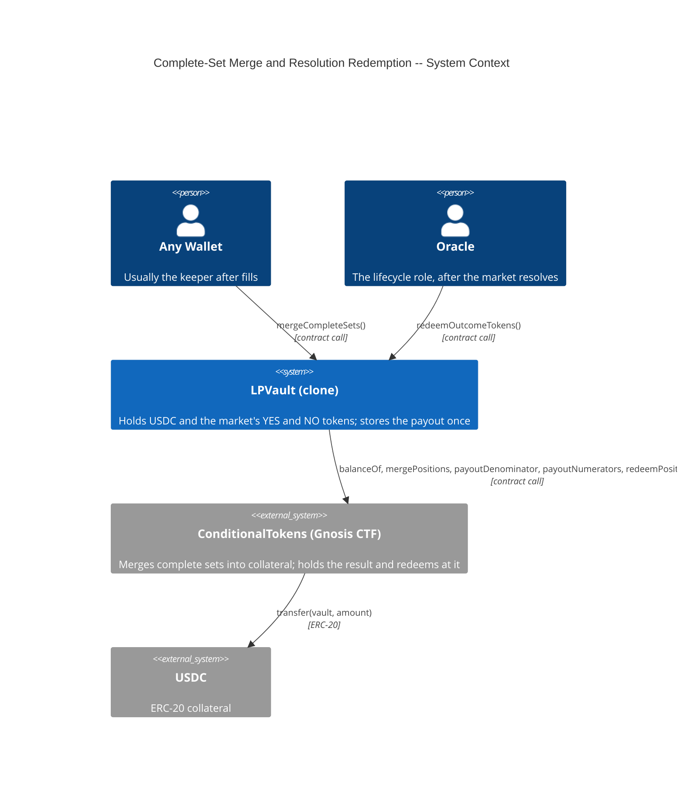
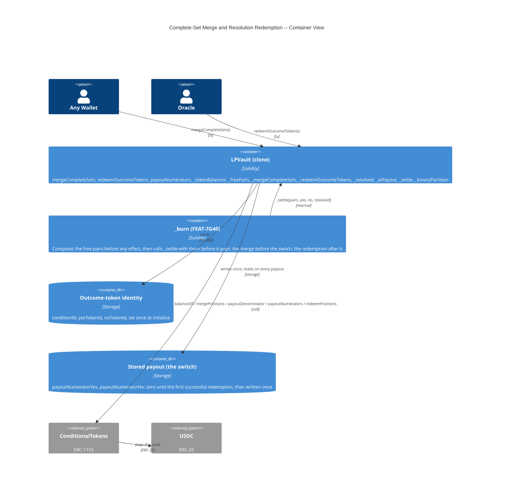
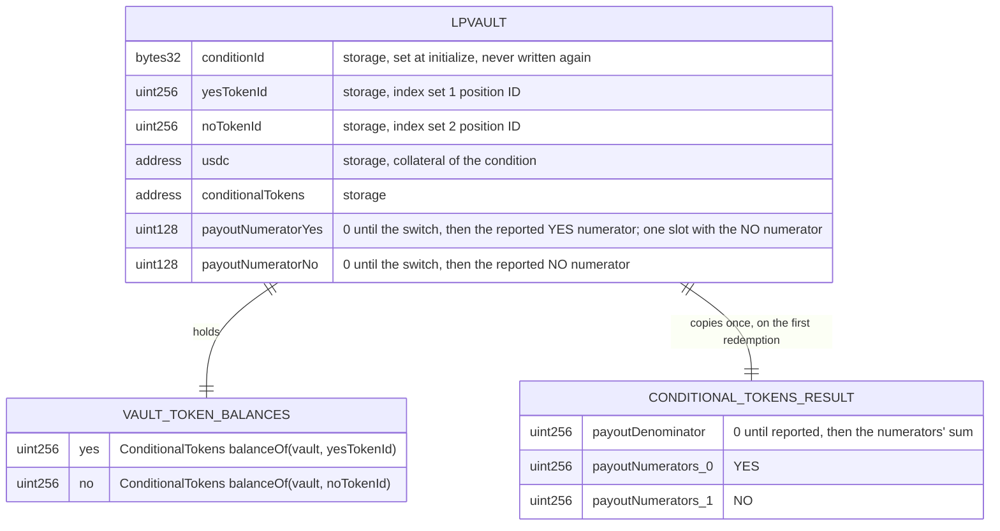

# Architecture: Complete-Set Merge and Resolution Redemption

## System Context (C4 L1)

> Who uses this feature and what external systems does it touch?

## Container View (C4 L2)

> Which major components are involved and how do they communicate?

## Data Model

> Entity schemas with field constraints and invariants.

**Invariants:**
- A merge of `amount` complete sets lowers the vault's YES and NO balances by `amount` each and raises its USDC balance by `amount`
- After a successful `mergeCompleteSets()`, the free pairs are 0: `min(YES balance − min(YES balance, totalYesOwed()), NO balance − min(NO balance, totalNoOwed())) == 0`, so every token the vault still holds is one the ledger owes, or one whose complement the ledger owes (ADR-DFE2)
- The public merge writes `spreadGrowthGlobalX128` and `totalSpreadOwedX128` when it finds a surplus and liquidity in range (FEAT-E943), and nothing else: `phase`, `paused`, positions, ticks, and `lastOperatorActivityTimestamp` keep their values
- The USDC from a merge or a redemption goes only to the vault, because the ConditionalTokens contract pays its caller and the caller is the vault
- The merge works in every phase, including Cancelled (decision C9, ADR-6HCM); the redemption works in WindDown and Cancelled and reverts while Active (ADR-6HCK)
- The stored payout is written once, from the ConditionalTokens contract, and never by an argument; the switch is on when `payoutNumeratorYes | payoutNumeratorNo != 0`, and the denominator is their sum
- After the switch every payout redeems first, so the vault holds no token after every burn
- A redemption pays exactly `floor(yes × numYes ÷ den) + floor(no × numNo ÷ den)` USDC, which `_atPayout` reproduces, so a payout can compute its amounts before the redemption

## Component Inventory

> Files that participate in this feature.

| File | Role | Key Exports |
|------|------|-------------|
| `src/LPVault.sol` | Per-market vault -- the merge entry point, the Oracle's redemption, the internal settlement every payout calls | `mergeCompleteSets()`, `redeemOutcomeTokens()`, `payoutNumerators()`, `_tokenBalances()`, `_freePairs(uint256,uint256)`, `_mergeCompleteSets(uint256)`, `_redeemOutcomeTokens(uint256,uint256)`, `_resolved()`, `_atPayout(uint256,uint256)`, `_settle(uint256,uint256,uint256,bool)`, `_binaryPartition()`, `CompleteSetsMerged`, `OutcomeTokensRedeemed`, `MarketNotResolved`, `VaultStillActive` |
| `test/fixtures/ConditionalTokensFixture.sol` | Test fixture -- real ConditionalTokens bytecode, binary condition setup, token funding, result reporting | `_deployConditionalTokens()`, `_prepareBinaryCondition()`, `_mintCompleteSets()`, `_giveOutcomeTokens()`, `_resolve()` |
| `test/fixtures/VaultStorage.sol` | Test fixture -- vault storage-slot helpers | `setPhase()` |
| `test/fixtures/KeeperFillFixture.sol` | Test fixture -- the keeper's drift-free fill for one tick move, priced as the house board prices its bids | `_fillMove()`, `_boardBids()` |
| `test/features/FEAT-6HBN-complete-set-merge-and-resolution/UC-6HBO-merge-complete-sets.t.sol` | Integration tests for Merge Complete Sets | Scenarios of UC-6HBO, including the two-claim state and the donation reached through drift-free fills |
| `test/features/FEAT-6HBN-complete-set-merge-and-resolution/UC-6HBP-redeem-outcome-tokens.t.sol` | Integration tests for Redeem Outcome Tokens After Resolution | Scenarios of UC-6HBP, the NFR-CYS3 gas bound |

## Event Topology

> All events this feature emits or consumes.

| Event | Publisher | Payload | Condition | Consumers |
|-------|-----------|---------|-----------|-----------|
| `CompleteSetsMerged(address indexed caller, uint256 amount)` | LPVault | `caller, amount` | `mergeCompleteSets()` or a burn merged `amount > 0` free pairs; `amount` can be below `min(YES balance, NO balance)`, because a pair a claim is owed is never merged | Off-chain Event Listener |
| `OutcomeTokensRedeemed(address indexed caller, uint256 yesAmount, uint256 noAmount, uint256 usdcAmount)` | LPVault | `caller, yesAmount, noAmount, usdcAmount` | `redeemOutcomeTokens()`, or a burn after the switch, redeemed with either balance above zero; `caller` is `msg.sender` | Off-chain Event Listener |
| `PositionsMerge` | ConditionalTokens | `stakeholder, collateralToken, parentCollectionId, conditionId, partition, amount` | Inside a merge with `amount > 0` | Off-chain indexers |
| `PayoutRedemption` | ConditionalTokens | `redeemer, collateralToken, parentCollectionId, conditionId, indexSets, payout` | Inside every `redeemPositions` call | Off-chain indexers |

**Non-events (explicit):**
- A merge with no free pair emits no event and makes no `mergePositions` call
- A redemption with nothing to redeem emits no event and makes no `redeemPositions` call
- The merge and the redemption run no receiver hook, because a burn calls no hook
- A revert (`Reentrancy`, `NotOracle`, `VaultStillActive`, `MarketNotResolved`, `SafeCastOverflow`) emits nothing

## API Surface

> Contract functions (entry points) belonging to this feature.

| Method | Path | Handler | Auth | Request Shape | Response Shape | Error Codes |
|--------|------|---------|------|---------------|----------------|-------------|
| call | `LPVault.mergeCompleteSets()` | `mergeCompleteSets` | none (any wallet), nonReentrant; no phase, pause, or heartbeat modifier | none | void | Reentrancy |
| call | `LPVault.redeemOutcomeTokens()` | `redeemOutcomeTokens` | onlyOracle, nonReentrant; no pause or heartbeat modifier; reverts while Active | none | void | NotOracle, VaultStillActive, MarketNotResolved, SafeCastOverflow, Reentrancy |
| call | `LPVault.payoutNumerators()` | `payoutNumerators` | none (view) | none | `(uint128 numYes, uint128 numNo)`, `(0, 0)` until the switch | — |

## Integration Points

> External services, event streams, and infrastructure dependencies.

| System | Protocol | Direction | Purpose |
|--------|----------|-----------|---------|
| ConditionalTokens (Gnosis CTF) | `balanceOf`, `mergePositions` | outbound | Merge the free pairs, the complete sets above what the ledger owes in both tokens, into USDC paid to the vault |
| ConditionalTokens (Gnosis CTF) | `payoutDenominator`, `payoutNumerators`, `redeemPositions` | outbound | Read the result on every redemption, copy the numerators once, and redeem the vault's whole YES and NO balances at `balance × numerator ÷ denominator` per side, rounded down |
| USDC (ERC-20) | ERC-20 `transfer` from ConditionalTokens | inbound | The vault receives the merged or redeemed amount |

## State Transitions

**Not applicable:** this feature changes no vault phase. The redemption reads the phase (it reverts while Active) and changes none.

## Code Map

> Links spec IDs to implementation files.

| Spec ID | Spec Name | Implementation Files |
|---------|-----------|---------------------|
| UC-6HBO | Merge Complete Sets | `src/LPVault.sol:mergeCompleteSets()`, `src/LPVault.sol:_tokenBalances()`, `src/LPVault.sol:_freePairs()`, `src/LPVault.sol:_mergeCompleteSets()`, `src/LPVault.sol:_binaryPartition()` |
| SC-6HC9 | Any wallet merges the vault's matched pairs into USDC | `src/LPVault.sol:mergeCompleteSets()`, `src/LPVault.sol:_freePairs()`, `src/LPVault.sol:_mergeCompleteSets()` |
| SC-6HCA | Nothing to merge changes nothing | `src/LPVault.sol:_freePairs()` (the zero-balance guard), `src/LPVault.sol:_mergeCompleteSets()` |
| SC-6HCB | Merge works for any wallet in WindDown, in Cancelled, and while paused, without a heartbeat refresh | `src/LPVault.sol:mergeCompleteSets()` |
| SC-6HCC | Merge works after an emergency cancel | `src/LPVault.sol:mergeCompleteSets()` |
| SC-DFDV | The merge leaves every claim's band token in the vault | `src/LPVault.sol:_freePairs()`, `src/LPVault.sol:totalYesOwed()`, `src/LPVault.sol:totalNoOwed()` |
| SC-DFDW | A donated token merges nothing when no pair is free | `src/LPVault.sol:_freePairs()`, `src/LPVault.sol:_mergeCompleteSets()` |
| UC-6HBP | Redeem Outcome Tokens After Resolution | `src/LPVault.sol:redeemOutcomeTokens()`, `src/LPVault.sol:_redeemOutcomeTokens()`, `src/LPVault.sol:_resolved()`, `src/LPVault.sol:_atPayout()`, `src/LPVault.sol:payoutNumerators()` |
| SC-6HCD | Oracle redeems after YES wins | `src/LPVault.sol:redeemOutcomeTokens()`, `src/LPVault.sol:_redeemOutcomeTokens()` |
| SC-6HCE | Oracle redeems after a cancelled market | `src/LPVault.sol:redeemOutcomeTokens()`, `src/LPVault.sol:_atPayout()` |
| SC-6HCF | Redemption reverts before the result exists | `src/LPVault.sol:redeemOutcomeTokens()` (the denominator check) |
| SC-6HCG | Non-Oracle callers cannot redeem | `src/LPVault.sol:onlyOracle`, `src/LPVault.sol:_checkOracle()` |
| SC-6HCH | Redemption reverts while Active and runs again in WindDown | `src/LPVault.sol:redeemOutcomeTokens()` (the phase check), `src/LPVault.sol:_redeemOutcomeTokens()` (the zero-balance return) |
| SC-6HCI | Redemption works after an emergency cancel | `src/LPVault.sol:redeemOutcomeTokens()` |
| SC-CYS6 | A numerator above 2^128 leaves the switch off | `src/LPVault.sol:redeemOutcomeTokens()`, `src/LPVault.sol:_toUint128()` |

## Architecture Decisions

> Non-obvious choices that future agents should not reverse.

**ADR-6HCJ:** Complete-set merge is a separate function that any wallet can call, never part of a receiver hook
In the context of a vault that gains YES and NO tokens at every fill, facing the fact that a receiver hook runs inside the exchange's settlement transaction so a revert there reverts the user's match, we decided to merge through a separate `mergeCompleteSets()` that any wallet can call. It merges `min(YES, NO)` and returns without a call when that amount is zero. This achieves capital recycling that can never block a trade. One YES plus one NO always pays exactly 1 USDC, so a merge moves no value between parties and the caller receives nothing. We accept that pairs can sit unmerged until a keeper or a payout calls it.
Superseded in part on 2026-09-14 by ADR-DFE2: the merge takes only the free pairs (finding CV-01 of `audits/code-validation-round-1.md`), because the sentence "a merge moves no value between parties" holds only for a pair no claim is owed. The separate-function decision and the hook rejection stand.
Extended on 2026-09-15 (step R18, ADR-E94V in FEAT-E943): the public merge credits the measured spread to the liquidity in range before it merges, which is where a round trip that ends where it began is attributed, because the unchanged-tick report reads no balance. The caller still receives nothing, so the call still cannot favor its caller; the MEV analysis on the function states the one residual, that a caller who is an LP in range can time the call ahead of a report or a mint, bounded by the surplus pending at that moment.

**Rejected alternative -- merge inside `onERC1155Received`:** it would revert settlement on any merge failure, and it would break the stateless-hook decision (ADR-3WLP).

**ADR-DFE2:** The merge takes only the free pairs, read before the exiting position is debited
In the context of a vault that holds one claim's YES and another claim's NO at once (claim A minted above the current tick, claim B below it), facing finding CV-01 of `audits/code-validation-round-1.md`, where a merge of `min(YES, NO)` pairs A's YES with B's NO, pays both a cut token leg, and strands the USDC because the ratio caps at 1 (FR-9BRP), we decided that every merge, public or inside a payout, takes only the free pairs, `min(yes − min(yes, totalYesOwed()), no − min(no, totalNoOwed()))`, with the totals read before the exiting position is debited, so a position's own band is never merged at its own burn, and that the burn and the collect compute the number once in their reads phase and pass it to `_settle` and `_usdcRatio`. This achieves full payment of every token leg under drift-free fills, where the free pairs are exactly the round-trip pairs, keeps `mergeCompleteSets()` safe for any caller in every phase, and closes the path where a wallet sends the complementary token to force a merge of another claim's token. We accept two cold storage reads per merge (the no-pair collect skips them through a zero-balance guard), 186 bytes of contract size (`LPVault` 22,837 to 23,023 bytes, 1,553 of room), and that under drift a pair below the owed totals stays unmerged and is paid in kind at each token's ratio. The user chose this on 2026-09-14. Since 2026-09-14 (step R17) the free pairs are computed by the burn, the public merge, and the escrow refund; the zero-balance guard stays so the public merge and the refund skip two ledger reads when either balance is zero, now that the no-pair collect it was added for is gone.

**Rejected alternative -- merge every pair and pay a missing token in USDC at the current tick:** it moves price risk between LPs who exit at different times.

**Rejected alternative -- a sweep function for the stranded residue:** it treats the symptom, and the residue has no owner.
Superseded on 2026-09-15 (step R18, ADR-E94U in FEAT-E943): the residue has an owner now, the last live position, and the sweep runs inside that position's burn rather than as a separate function anyone could time. The reason this alternative was rejected in 2026-09-14 no longer holds, and the two objections it raised are both answered: the credit treats the cause, and the sweep takes only what the credit could not attribute.

**Rejected alternative -- no merge at all:** every round-trip pair would then be paid in kind as two tokens, which decision C26 dropped (ADR-85DL).

**ADR-6HCL:** The merge refreshes no Operator heartbeat
In the context of the operator-silence timer that `emergencyCancelAll` reads (FR-JXQS), facing a function that any wallet can call, we decided that `mergeCompleteSets()` carries no `touchesHeartbeat` modifier, even when the Operator calls it. This achieves a timer that only a registered Operator can refresh. We accept that an Operator who only merges does not prove liveness through the merge and must call `heartbeat()` or another Operator function.

**Rejected alternative -- refresh the heartbeat on every merge:** any wallet could then postpone `emergencyCancelAll` for free.

**ADR-6HCM:** The merge works in every phase
In the context of decision C9, where the freeze changes only the phase and every exit stays open, facing the E3 rule that every state-changing call reverts in Cancelled, we decided that `mergeCompleteSets` and the internal merge run in every phase, to achieve a payout that can always turn pairs into USDC first, accepting that a frozen vault's balances still move. The user chose this on 2026-09-13.

**Rejected alternative -- revert in the Cancelled phase (the E3 rule):** every payout in a frozen vault needs the merge first, and R10 makes the cancel a freeze that keeps every exit open.

**ADR-6HCK:** The Oracle's redemption is the switch: it copies the payout from the ConditionalTokens contract, requires a vault that is not Active, and every later payout values tokens at that payout
In the context of a resolved market, facing the choice of who converts the vault's tokens and when a burn stops paying tokens in kind, we decided that `redeemOutcomeTokens()` is Oracle-only, reverts until `payoutDenominator(conditionId)` is non-zero, reverts while the phase is Active, copies the two payout numerators from the ConditionalTokens contract into one storage slot on its first successful call, and redeems every token the vault holds. Every burn and collect reads that slot: before the switch it merges the pairs and pays the token leg in kind at the token's own ratio, after it it redeems every token the vault holds and pays the token leg in USDC at the one USDC ratio. This keeps the lifecycle action with the lifecycle role, trusts only the ConditionalTokens contract for the result, costs every exit one storage read instead of three external reads, and keeps the ledger's four per-asset totals and its conservation invariant unchanged. We accept that the Oracle can delay the switch, and that an LP who burns in the window between resolution and the switch receives the winning token and redeems it from the Safe for the same USDC. The user chose this on 2026-09-14. Since 2026-09-14 (step R17) every burn reads the switch; there is no collect.

**Rejected alternative -- a live read of the payout on every exit (the R13 step text):** 1,480 bytes and three external reads per exit, over the size limit (measured on 2026-09-14 at 24,583 to 24,600 bytes).

**Rejected alternative -- converting the ledger's YES and NO totals into the USDC total at the switch (the R13 step text):** every later burn would still debit its token claim from a total that is now zero, and the USDC total it moved into would never be debited, so the conservation invariant would break at once and ADR-9BSJ would be reversed.

**Rejected alternative -- redemption open to any wallet:** value-neutral, but the switch changes every LP's ratio shape, so it stays with the lifecycle role.

**Superseded rejection -- "require WindDown first":** the E3 exploration rejected it because `Resolution.sol` forwards the result 1 to 72 hours after the report, so a fixed call order added a revert and no safety. It now adds safety, because after the switch the vault holds only USDC and a tick report would move value between LPs, and `updateTick` already reverts in WindDown and Cancelled.

## Testing Decisions

> Resolved end-to-end testing decisions.

| Service/Pattern | Decision | Reason |
|-----------------|----------|--------|
| ConditionalTokens (ERC-1155) | e2e | Deploy the real Gnosis bytecode from `lib/ctf-exchange/artifacts/ConditionalTokens.json` through `test/fixtures/ConditionalTokensFixture.sol`, because the vault calls `balanceOf`, `mergePositions`, `payoutDenominator`, `payoutNumerators`, and `redeemPositions`, and a mock would test the mock |
| USDC (ERC-20) | e2e with mock token | The shared `MockERC20` in the fixture, because the vault and the ConditionalTokens contract need only `balanceOf`, `transfer`, and `transferFrom` semantics from USDC |
| Cancelled-phase setup | fixture | `VaultStorage.setPhase` writes phase 3, because the merge reads no other state, and the real `emergencyCancelAll` path needs a 7-day silence that the emergency-cancel tests already prove |
| Resolution | e2e | The test contract is each condition's oracle on the ConditionalTokens contract (it prepared the condition), so the fixture's `_resolve` reports the result through `reportPayouts` the way `Resolution.finalizePayouts` does |
