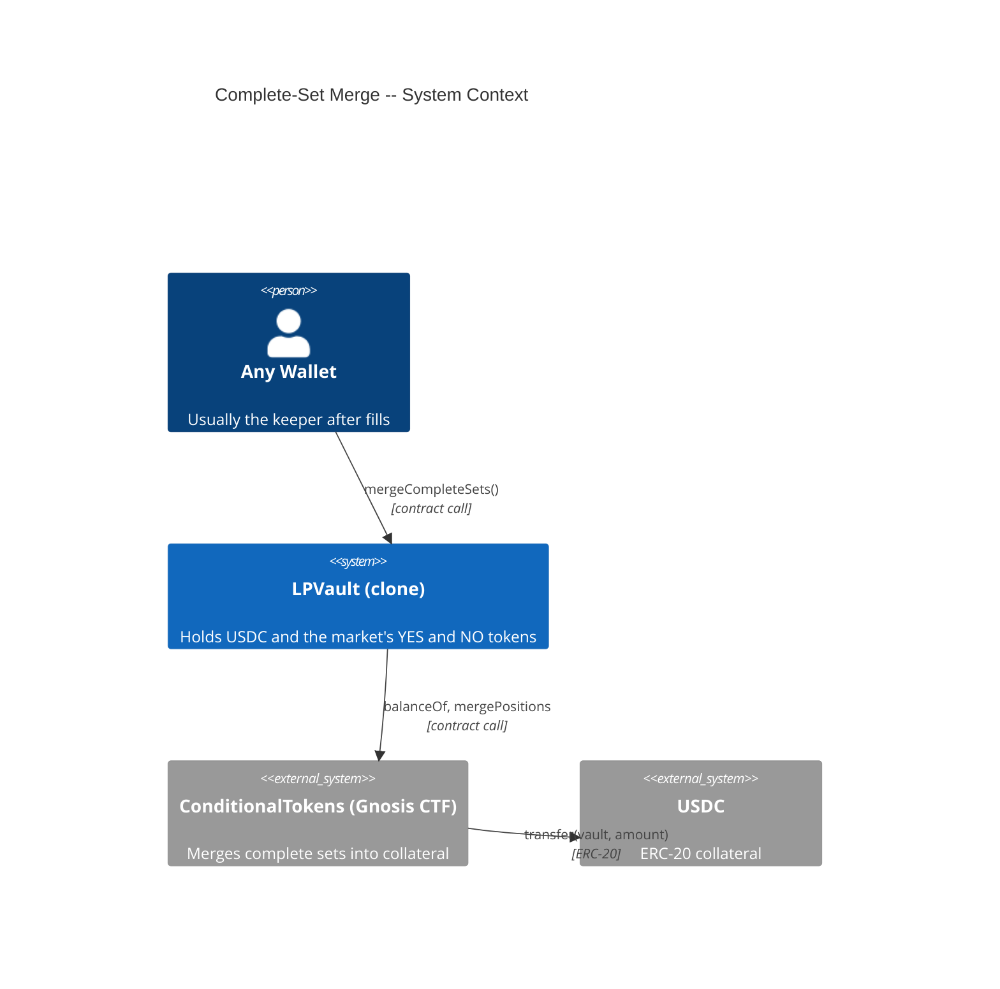
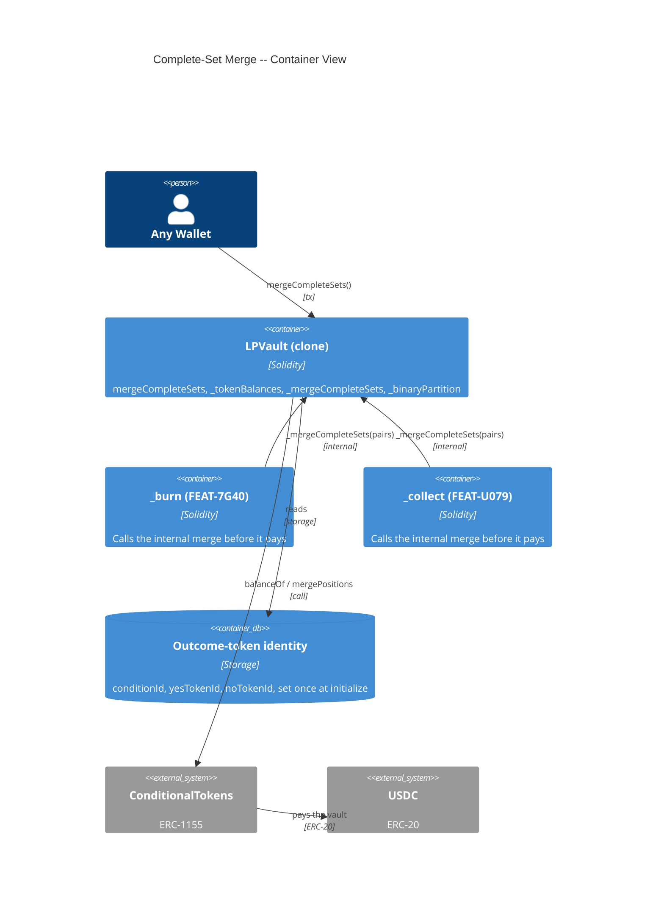
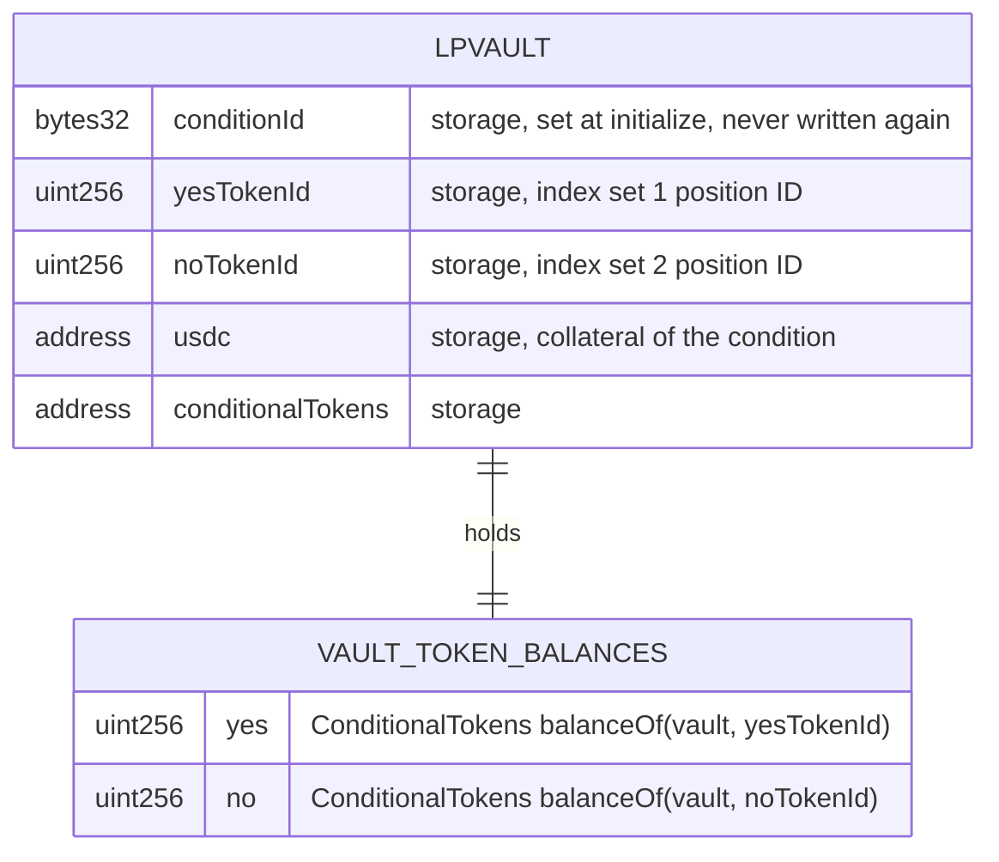

# Architecture: Complete-Set Merge and Resolution Redemption

## System Context (C4 L1)

> Who uses this feature and what external systems does it touch?

## Container View (C4 L2)

> Which major components are involved and how do they communicate?

## Data Model

> Entity schemas with field constraints and invariants.

**Invariants:**
- A merge of `amount` complete sets lowers the vault's YES and NO balances by `amount` each and raises its USDC balance by `amount`
- After a successful `mergeCompleteSets()`, `min(YES balance, NO balance) == 0`
- The merge writes no vault storage: `phase`, `paused`, positions, ticks, and `lastOperatorActivityTimestamp` keep their values
- The USDC from a merge goes only to the vault, because the ConditionalTokens contract pays its caller and the caller is the vault
- The merge works in every phase, including Cancelled (decision C9, ADR-6HCM)

## Component Inventory

> Files that participate in this feature.

| File | Role | Key Exports |
|------|------|-------------|
| `src/LPVault.sol` | Per-market vault -- the merge entry point and the internal merge every payout calls | `mergeCompleteSets()`, `_tokenBalances()`, `_mergeCompleteSets(uint256)`, `_binaryPartition()`, `CompleteSetsMerged` |
| `test/fixtures/ConditionalTokensFixture.sol` | Test fixture -- real ConditionalTokens bytecode, binary condition setup, token funding | `_deployConditionalTokens()`, `_prepareBinaryCondition()`, `_mintCompleteSets()`, `_giveOutcomeTokens()` |
| `test/fixtures/VaultStorage.sol` | Test fixture -- vault storage-slot helpers | `setPhase()` |
| `test/features/FEAT-6HBN-complete-set-merge-and-resolution/UC-6HBO-merge-complete-sets.t.sol` | Integration tests for Merge Complete Sets | Scenarios of UC-6HBO |

## Event Topology

> All events this feature emits or consumes.

| Event | Publisher | Payload | Condition | Consumers |
|-------|-----------|---------|-----------|-----------|
| `CompleteSetsMerged(address indexed caller, uint256 amount)` | LPVault | `caller, amount` | `mergeCompleteSets()`, a burn, or a collect merged `amount > 0` complete sets | Off-chain Event Listener |
| `PositionsMerge` | ConditionalTokens | `stakeholder, collateralToken, parentCollectionId, conditionId, partition, amount` | Inside a merge with `amount > 0` | Off-chain indexers |

**Non-events (explicit):**
- A merge with no complete set emits no event and makes no `mergePositions` call
- The merge runs no receiver hook, because a burn calls no hook
- A revert (`Reentrancy`) emits nothing

## API Surface

> Contract functions (entry points) belonging to this feature.

| Method | Path | Handler | Auth | Request Shape | Response Shape | Error Codes |
|--------|------|---------|------|---------------|----------------|-------------|
| call | `LPVault.mergeCompleteSets()` | `mergeCompleteSets` | none (any wallet), nonReentrant; no phase, pause, or heartbeat modifier | none | void | Reentrancy |

## Integration Points

> External services, event streams, and infrastructure dependencies.

| System | Protocol | Direction | Purpose |
|--------|----------|-----------|---------|
| ConditionalTokens (Gnosis CTF) | `balanceOf`, `mergePositions` | outbound | Merge `min(YES, NO)` complete sets into USDC paid to the vault |
| USDC (ERC-20) | ERC-20 `transfer` from ConditionalTokens | inbound | The vault receives the merged amount |

## State Transitions

**Not applicable:** this feature changes no vault phase and reads none.

## Code Map

> Links spec IDs to implementation files.

| Spec ID | Spec Name | Implementation Files |
|---------|-----------|---------------------|
| UC-6HBO | Merge Complete Sets | `src/LPVault.sol:mergeCompleteSets()`, `src/LPVault.sol:_tokenBalances()`, `src/LPVault.sol:_mergeCompleteSets()`, `src/LPVault.sol:_binaryPartition()` |
| SC-6HC9 | Any wallet merges the vault's matched pairs into USDC | `src/LPVault.sol:mergeCompleteSets()`, `src/LPVault.sol:_mergeCompleteSets()` |
| SC-6HCA | Nothing to merge changes nothing | `src/LPVault.sol:_mergeCompleteSets()` |
| SC-6HCB | Merge works for any wallet in WindDown, in Cancelled, and while paused, without a heartbeat refresh | `src/LPVault.sol:mergeCompleteSets()` |
| SC-6HCC | Merge works after an emergency cancel | `src/LPVault.sol:mergeCompleteSets()` |

## Architecture Decisions

> Non-obvious choices that future agents should not reverse.

**ADR-6HCJ:** Complete-set merge is a separate function that any wallet can call, never part of a receiver hook
In the context of a vault that gains YES and NO tokens at every fill, facing the fact that a receiver hook runs inside the exchange's settlement transaction so a revert there reverts the user's match, we decided to merge through a separate `mergeCompleteSets()` that any wallet can call. It merges `min(YES, NO)` and returns without a call when that amount is zero. This achieves capital recycling that can never block a trade. One YES plus one NO always pays exactly 1 USDC, so a merge moves no value between parties and the caller receives nothing. We accept that pairs can sit unmerged until a keeper or a payout calls it.

**Rejected alternative -- merge inside `onERC1155Received`:** it would revert settlement on any merge failure, and it would break the stateless-hook decision (ADR-3WLP).

**ADR-6HCL:** The merge refreshes no Operator heartbeat
In the context of the operator-silence timer that `emergencyCancelAll` reads (FR-JXQS), facing a function that any wallet can call, we decided that `mergeCompleteSets()` carries no `touchesHeartbeat` modifier, even when the Operator calls it. This achieves a timer that only a registered Operator can refresh. We accept that an Operator who only merges does not prove liveness through the merge and must call `heartbeat()` or another Operator function.

**Rejected alternative -- refresh the heartbeat on every merge:** any wallet could then postpone `emergencyCancelAll` for free.

**ADR-6HCM:** The merge works in every phase
In the context of decision C9, where the freeze changes only the phase and every exit stays open, facing the E3 rule that every state-changing call reverts in Cancelled, we decided that `mergeCompleteSets` and the internal merge run in every phase, to achieve a payout that can always turn pairs into USDC first, accepting that a frozen vault's balances still move. The user chose this on 2026-09-13.

**Rejected alternative -- revert in the Cancelled phase (the E3 rule):** every payout in a frozen vault needs the merge first, and R10 makes the cancel a freeze that keeps every exit open.

## Testing Decisions

> Resolved end-to-end testing decisions.

| Service/Pattern | Decision | Reason |
|-----------------|----------|--------|
| ConditionalTokens (ERC-1155) | e2e | Deploy the real Gnosis bytecode from `lib/ctf-exchange/artifacts/ConditionalTokens.json` through `test/fixtures/ConditionalTokensFixture.sol`, because the vault calls `balanceOf` and `mergePositions`, and a mock would test the mock |
| USDC (ERC-20) | e2e with mock token | The shared `MockERC20` in the fixture, because the vault and the ConditionalTokens contract need only `balanceOf`, `transfer`, and `transferFrom` semantics from USDC |
| Cancelled-phase setup | fixture | `VaultStorage.setPhase` writes phase 3, because the merge reads no other state, and the real `emergencyCancelAll` path needs a 7-day silence that the emergency-cancel tests already prove |
