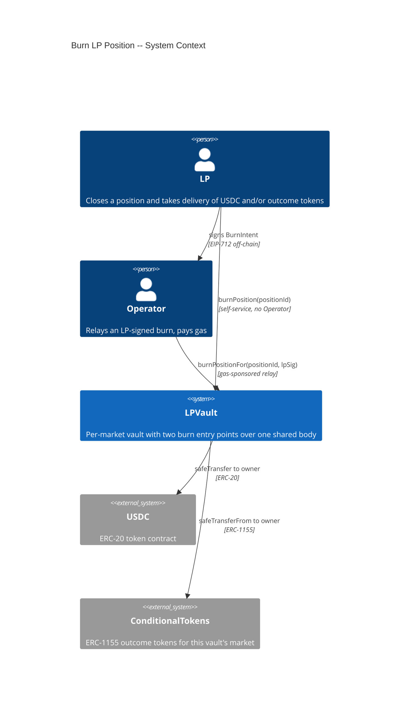
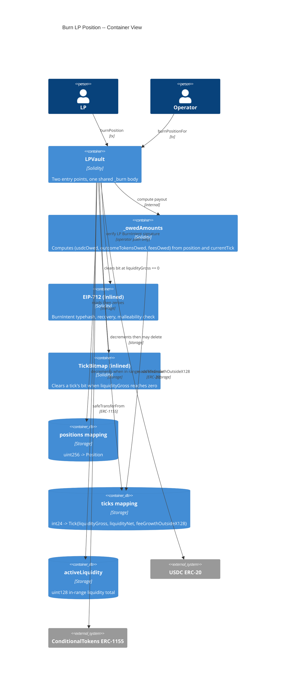
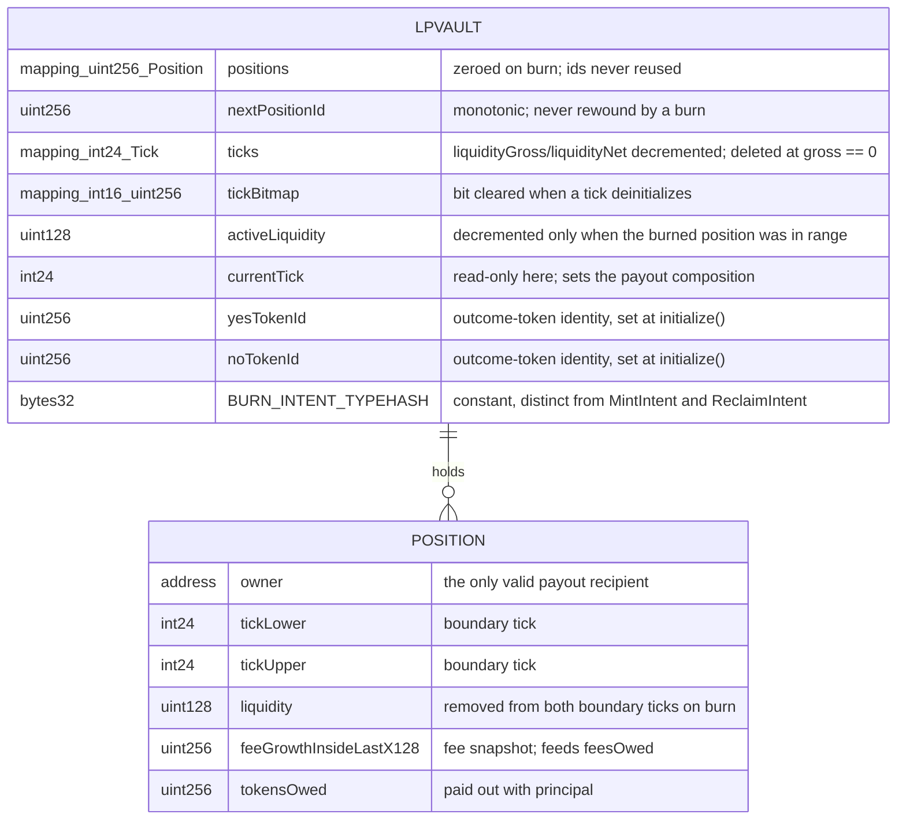
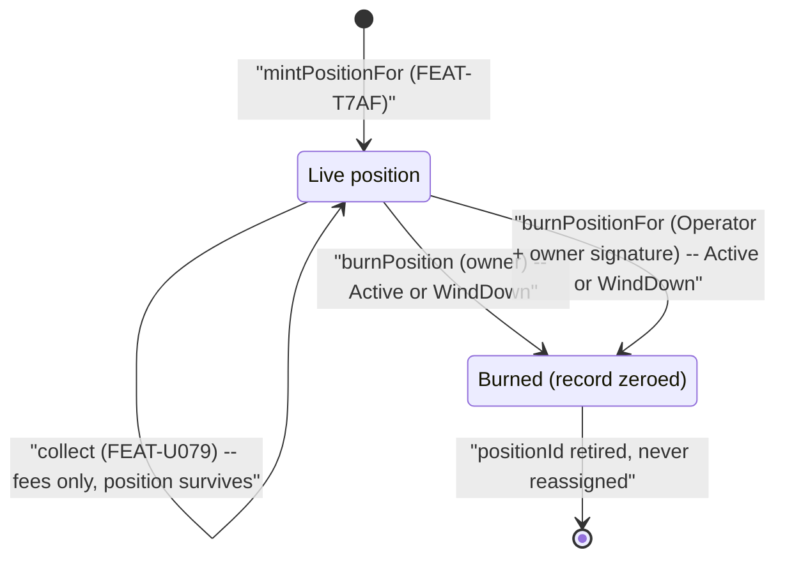

# Architecture: Burn LP Position

## System Context (C4 L1)

> The vault has no edge to the CTF Exchange in this feature. That absence is deliberate: burning never converts outcome tokens, so it never needs a counterparty (ADR-7G5F).

## Container View (C4 L2)

## Data Model

> Reads and clears existing LPVault position and tick storage. Adds one typehash constant and one used-authorization record for the operator-relayed path.

**Invariants:**
- A burn's payout composition is a pure function of `(position, currentTick)`; it is never the USDC amount originally deposited
- Both entry points produce identical payouts, tick state, and `activeLiquidity` deltas for the same `(position, currentTick)` -- one shared body, no duplicated arithmetic
- Every asset a burn pays out goes to `position.owner`, never to `msg.sender`
- `ticks[t].liquidityGross == Σ |liquidityNet| of live positions referencing t` holds across burns
- A tick's bitmap bit is set if and only if `ticks[t].liquidityGross > 0`
- `activeLiquidity == Σ liquidity over live in-range positions` holds across burns
- A burned positionId is never reassigned; `nextPositionId` only increases
- `burnPosition` reads no operator registry state, requires no signature, and is reachable in every non-terminal phase
- `burnPositionFor` refreshes `lastOperatorActivityTimestamp`; `burnPosition` never does
- A signature valid for one of MintIntent / ReclaimIntent / BurnIntent is rejected by the other two paths

## Component Inventory

| File | Role | Key Exports |
|------|------|-------------|
| `src/LPVault.sol` | vault contract | `burnPosition` (external, nonReentrant, owner-only, permissionless w.r.t. Operator), `burnPositionFor` (external, onlyOperator, nonReentrant, touchesHeartbeat), `_burn` (internal, shared body), `_requireBurnable` (internal view, shared phase + liveness gate), `_owedAmounts` (internal view), `_tickSpan` (internal pure), `_removeLiquidityFromTick` (internal, decrements and deinitializes a boundary tick), `_accruedFees` (internal pure, extracted and shared with `collect` / `emergencyCancelAll` / `mergePositions`), `_burnIntentDigest` (internal view), `_verifyBurnIntent` (internal pure), `_clearTickBitmapBit` (internal, previously unused), `BURN_INTENT_TYPEHASH` (constant), `usedBurnAuthorizations` (storage, dedicated replay mapping — see ADR-85DM), `PositionBurned` (event) |
| `test/features/FEAT-7G40-burn-lp-position/UC-7G41-burn-position.t.sol` | Integration tests for the self-service path | SC-7G43 through SC-7G4B |
| `test/features/FEAT-7G40-burn-lp-position/UC-7G42-operator-burn-position-for-lp.t.sol` | Integration tests for the operator-relayed path | SC-7G4C through SC-7G4K |

## Event Topology

| Event | Publisher | Payload | Condition | Consumers |
|-------|-----------|---------|-----------|-----------|
| `PositionBurned` | `LPVault.burnPosition`, `LPVault.burnPositionFor` | `positionId, owner, usdcAmount, outcomeTokenAmount, feesAmount` | A burn completes through either entry point | Off-chain indexer, LP UI, Keeper |

**Non-events (explicit):**
- SC-7G48, SC-7G4B, SC-7G4F, SC-7G4G, SC-7G4H, SC-7G4I, SC-7G4J: no event emitted on revert
- No `FeesCollected` is emitted by a burn -- the fee amount rides on `PositionBurned` instead
- No order-placement or settlement event is ever emitted by this feature; the vault touches no exchange

## API Surface

| Method | Path | Handler | Auth | Request Shape | Response Shape | Error Codes |
|--------|------|---------|------|---------------|----------------|-------------|
| contract-call | `burnPosition(uint256)` | `LPVault.burnPosition` | `position.owner == msg.sender` + nonReentrant; no Operator involvement | positionId | void (USDC and/or ERC-1155 transferred as side effect) | NotPositionOwner, PositionNotFound |
| contract-call | `burnPositionFor(uint256,bytes)` | `LPVault.burnPositionFor` | onlyOperator + nonReentrant + touchesHeartbeat | positionId + LP EIP-712 signature over the BurnIntent typehash | void (USDC and/or ERC-1155 transferred to `position.owner`) | NotOperator, PositionNotFound, InvalidSignature, IntentAlreadyUsed |

## Integration Points

| System | Protocol | Direction | Purpose |
|--------|----------|-----------|---------|
| USDC ERC-20 | ERC-20 transfer | outbound | Pays the USDC-side principal and the accrued fees to the position owner |
| ConditionalTokens ERC-1155 | `safeTransferFrom` | outbound | Pays the outcome-token-side principal to the position owner |
| FEAT-TVS0 `currentTick` | internal storage read | inbound | Sets the payout composition at burn time |
| FEAT-U079 fee accumulators | internal storage read | inbound | Supplies `feesOwed` via the same `feeGrowthInside` computation `collect` uses |
| FEAT-JXQO `touchesHeartbeat` | internal modifier | outbound | `burnPositionFor` refreshes the Operator silence timer; `burnPosition` does not |

## State Transitions

## Code Map

| Spec ID | Spec Name | Implementation Files |
|---------|-----------|---------------------|
| UC-7G41 | Burn Position | `src/LPVault.sol:burnPosition()` |
| SC-7G43 | Burn below range pays entirely in USDC | `src/LPVault.sol:burnPosition()`, `src/LPVault.sol:_owedAmounts()` |
| SC-7G44 | Burn above range pays entirely in outcome tokens | `src/LPVault.sol:burnPosition()`, `src/LPVault.sol:_owedAmounts()` |
| SC-7G45 | Burn in range pays a split of both assets | `src/LPVault.sol:burnPosition()`, `src/LPVault.sol:_owedAmounts()`, `activeLiquidity` |
| SC-7G46 | Burn pays accrued fees alongside principal | `src/LPVault.sol:_owedAmounts()`, `src/LPVault.sol:_computeFeeGrowthInside()` |
| SC-7G47 | Burning the last position at a tick deinitializes it | `src/LPVault.sol:_burn()`, `src/LPVault.sol:_clearTickBitmapBit()` |
| SC-7G48 | Revert when the caller is not the position owner | `src/LPVault.sol:burnPosition()` (owner check) |
| SC-7G49 | Burn in WindDown phase succeeds identically to Active | `src/LPVault.sol:burnPosition()` (no phase gate) |
| SC-7G4A | Burn succeeds with zero registered operators | `src/LPVault.sol:burnPosition()` |
| SC-7G4B | Revert on a nonexistent or already-burned position | `src/LPVault.sol:_burn()` (position liveness check) |
| UC-7G42 | Operator Burn Position for LP | `src/LPVault.sol:burnPositionFor()` |
| SC-7G4C | Operator burn below range pays the LP entirely in USDC | `src/LPVault.sol:burnPositionFor()`, `src/LPVault.sol:_owedAmounts()` |
| SC-7G4D | Operator burn above range pays the LP entirely in outcome tokens | `src/LPVault.sol:burnPositionFor()`, `src/LPVault.sol:_owedAmounts()` |
| SC-7G4E | Operator burn in range pays the LP a split, never the caller | `src/LPVault.sol:burnPositionFor()`, `src/LPVault.sol:_burn()` |
| SC-7G4F | Revert when the burn authorization is missing | `src/LPVault.sol:_verifyBurnIntent()` |
| SC-7G4G | Revert when the burn authorization is malformed | `src/LPVault.sol:_verifyBurnIntent()` (s and v bounds) |
| SC-7G4H | Revert when a burn authorization is replayed | `src/LPVault.sol:burnPositionFor()` (used-authorization check) |
| SC-7G4I | Revert when a mint or reclaim authorization is reused as a burn | `src/LPVault.sol:_verifyBurnIntent()`, `BURN_INTENT_TYPEHASH` |
| SC-7G4J | Revert on non-operator caller | `src/LPVault.sol:burnPositionFor()`, `src/LPVault.sol:onlyOperator` |
| SC-7G4K | Operator burn in WindDown phase succeeds identically to Active | `src/LPVault.sol:burnPositionFor()` (no phase gate) |

## Architecture Decisions

**ADR-7G5E:** Two entry points, one shared internal burn body
In the context of burn needing both a gas-sponsored Operator path and an unconditional self-service path, facing the risk that two independently written functions drift in their payout math or their tick accounting, we decided that `burnPosition` and `burnPositionFor` differ only in their authorization checks and heartbeat behavior and both delegate to a single internal `_burn` over a single `_owedAmounts`, to achieve provable parity between the paths, accepting that any change to burn semantics necessarily changes both paths at once. Parity is asserted directly in the scenarios: SC-7G4C through SC-7G4E are the operator-path twins of SC-7G43 through SC-7G46.

**ADR-7G5F:** Burn pays out dual-asset and never converts
In the context of a position's exit value being held partly as outcome-token inventory, facing the choice between converting that inventory to USDC at burn time and delivering it as-is, we decided to deliver both assets as-is, to achieve an exit path that needs no counterparty, accepting that the LP receives an asset they may not want and must dispose of themselves. Converting inside the burn would make the exit depend on a willing counterparty at exactly the moment liquidity is thinnest -- the failure mode the dual-asset model exists to remove. The LP's own options need no counterparty either at the limit: sell through the exchange subject to depth, or hold to resolution and redeem 1:1 through the Conditional Tokens contract. A convenience "sell on exit" flow can be layered in the UI later without weakening this contract-level guarantee.

**ADR-7G5G:** The self-service path is unconditional, not emergency-gated
In the context of guaranteeing that LP capital cannot be trapped, facing the choice between making `burnPosition` available always and gating it behind a declared emergency or an operator-silence timelock, we decided to keep it available in every non-terminal phase with no timelock, no declaration, and no operator registry read, to achieve a guarantee that holds without anyone having to act first, accepting that the platform's normal-operation flow will almost always go through `burnPositionFor` instead and this path will look unused. A path that requires an emergency to be declared is only as reliable as whoever declares it; SC-7G4A pins the property by removing every operator before burning.

**ADR-7G5H:** Distinct BurnIntent typehash
In the context of `burnPositionFor` accepting an LP signature relayed by the Operator, facing the choice between reusing `MINT_INTENT_TYPEHASH` and defining a separate struct, we decided to define a distinct `BURN_INTENT_TYPEHASH`, to achieve domain separation between authorizing a position and authorizing its closure, accepting one more typehash constant and one more off-chain signing flow. Reusing the mint typehash would mean the signature an LP produces to open a position doubles as authorization to close it, letting an Operator holding that one signature exit the LP unilaterally. This applies FEAT-JAIJ ADR-4029's reasoning, which names `burnPositionFor` explicitly as a future case.

**ADR-7G5I:** Burn is owner-gated on both paths, for timing control rather than custody
In the context of gas sponsorship, facing the option of loosening the caller check to "anyone may trigger the burn, funds still go to the recorded owner," we decided to require the owner's authorization on both paths -- `msg.sender` on the self-service path, an EIP-712 signature on the relayed path -- to achieve LP control over *when* the exit happens, accepting that an LP with no gas cannot exit unilaterally without either an Operator relay or acquiring gas. Under the dual-asset model a position's payout composition depends on `currentTick` at the moment of the call, so an unrestricted caller could force an exit right before a move the LP would have preferred to ride out. Funds landing with the rightful owner does not address that; it is a timing-control problem, not a theft problem. The residual: the Operator holds a signed authorization and chooses which block it lands in, and therefore which `currentTick` prices the exit. The self-service path is the LP's remedy, and NFR-7G5D requires that trade-off be stated on the function.

**ADR-85DK:** The payout split is linear in tick, not sqrt-price
In the context of FR-7G4M describing the in-range split as "mirroring Uniswap v3's `burn()` math", facing the fact that this vault holds no `sqrtPriceX96` and no bonding curve, we decided to interpolate linearly over the position's tick span, to achieve agreement with the liquidity model mint already implements, accepting that the phrase in FR-7G4M names v3's *behaviour* (three branches, composition follows price) rather than its *formulation*. v3 stores √P because a constant-product curve makes its amount formulas linear in √P, and its ticks are logarithmic (`price = 1.0001^tick`). This vault's ticks are evenly-spaced order-book price slots across [0, 1] (GLOSSARY.md), and mint spreads an LP's USDC evenly across them (`L = usdcAmount * PRECISION / rangeWidth`), so an exit counts slots either side of `currentTick`. Applying v3's formulation on top of this tick space would price tick 200 at 1.02 — outside the legal probability range — and would disagree with both `mintPositionFor` and `emergencyCancelAll`, leaking value between entry and exit. The residual: the split conserves principal *value*, not the token counts real fills at each price level would have produced; that reconstruction needs per-fill accounting the vault does not keep, and FEAT-7G40's Non-Goals already defer it to the dual-asset withdrawal rewrite.

**ADR-85DL:** The outcome-token leg is paid as a complete set (amends ADR-7G5F)
In the context of ADR-7G5F establishing that a burn delivers outcome tokens as-is, facing the gap that the requirements say only "outcome tokens" while the vault holds two ids (`yesTokenId`, `noTokenId`) and the `PositionBurned` event carries a single `outcomeTokenAmount`, we decided that the outcome leg is one amount paid as that many YES *and* that many NO, to achieve a payout that needs no tick-to-price conversion and no per-position outcome side, accepting that the LP receives two tokens where they may have expected one. A complete set is the only form the ConditionalTokens contract lets a holder unwind without a counterparty (`mergePositions` returns collateral 1:1), which is exactly the property ADR-7G5F exists to protect; it also keeps both legs denominated in the same base units as USDC, so value conservation is checkable arithmetic rather than a pricing assumption. Paying a single side would have required either a tick-to-price mapping the specs do not define, or an `outcomeTokenId` field on `Position` — and that field would have to be signed into `MintIntent`, dragging FEAT-T7AF and FEAT-3ZRI into this feature's scope. The related decision *not* taken: having the burn call `mergePositions` itself and pay pure USDC. That is compatible with FR-7G4N's letter (a merge is not a trade and touches no exchange) but contradicts SC-7G44's stated outcome, and the same effect is better reached by an Operator-callable sweep that keeps the vault's balanced inventory in USDC between burns — recorded as follow-up work, not built here.

**ADR-85DM:** Burn authorizations get their own replay mapping and a positionId-only typehash
In the context of FR-7G55 requiring a used-authorization record, facing the choice between reusing the existing `usedIntents` mapping and adding a dedicated one, we decided on a separate `usedBurnAuthorizations` mapping keyed by the BurnIntent digest, to achieve immunity from a key collision an attacker can construct on purpose, accepting one more storage mapping. A BurnIntent digest is a pure function of `(domainSeparator, positionId)`, so anyone can compute the digest of anyone else's position; sharing `usedIntents` would let an attacker escrow and mint a throwaway intent whose LP-chosen `intentId` *is* a victim's burn digest, permanently denying that position its gas-sponsored exit. Relatedly, `BurnIntent` carries `positionId` alone and deliberately omits the owner: SC-7G4H requires a replayed authorization to report `IntentAlreadyUsed` rather than `PositionNotFound`, which forces the replay check ahead of the liveness check, which in turn forces the digest to remain computable after the position record has been zeroed. Owner binding is not lost — it moves from a signed field to a comparison of the recovered signer against `position.owner` read from storage, which is the stronger of the two.

## Testing Decisions

| Service/Pattern | Decision | Reason |
|-----------------|----------|--------|
| USDC (ERC-20) | e2e with mock token | Deploy a minimal ERC-20 mock in test setup, as the other @positions features do |
| ConditionalTokens (ERC-1155) | e2e with mock token | A minimal ERC-1155 mock lets burns actually move outcome tokens and lets the receive-hook reentrancy path be exercised against NFR-7G59 |
| EIP-712 signatures | e2e | Foundry's `vm.sign()` produces real ECDSA signatures; sign MintIntent, ReclaimIntent, and BurnIntent structs to prove all three typehashes are mutually non-interchangeable |
| Payout composition across the range | e2e + fuzz | Drive `updateTick` to place `currentTick` below, inside, and above the range, then burn; fuzz the tick position to check the composition is monotonic and conserves value |
| Operator-registry independence | e2e | Remove every operator through the Admin path, then drive `burnPosition` to completion (SC-7G4A) |
| Path parity | e2e | Burn identical positions at an identical `currentTick` through both entry points and assert byte-identical payouts, tick state, and `activeLiquidity` |
