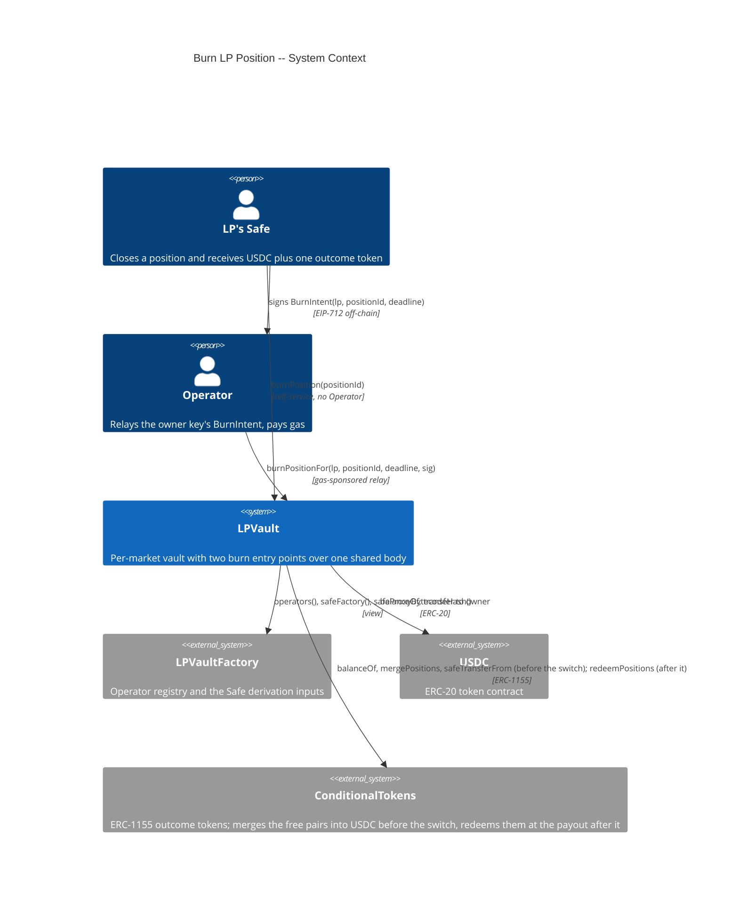
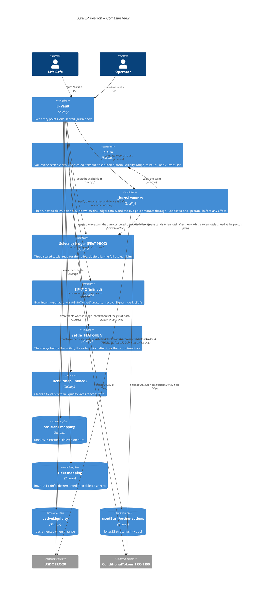
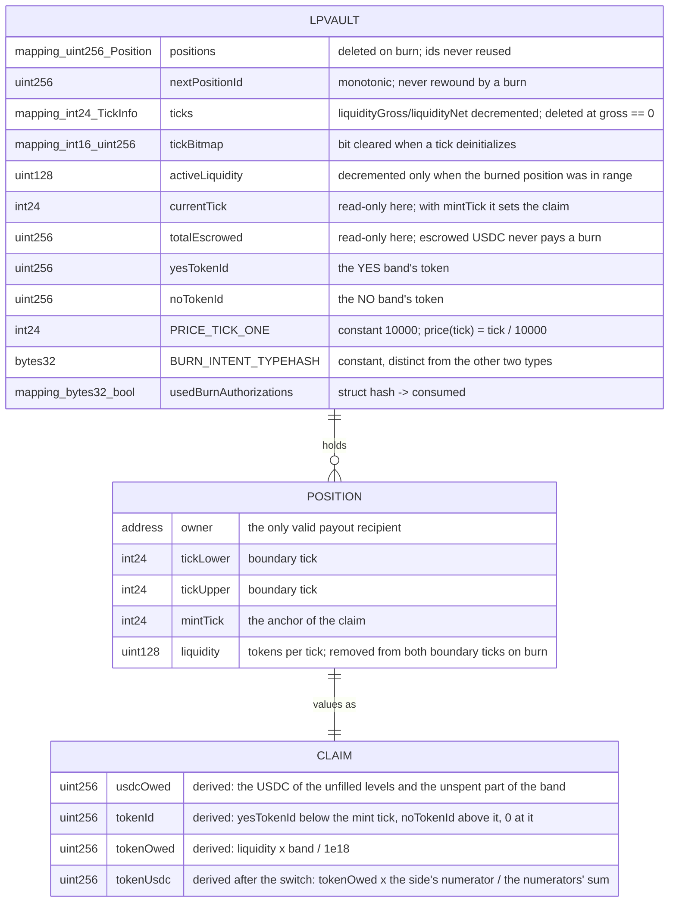
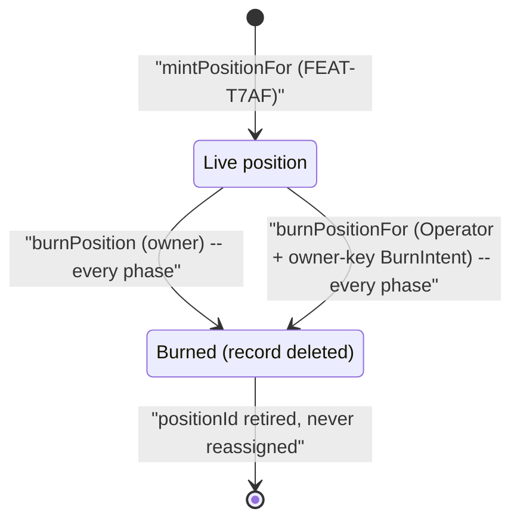

# Architecture: Burn LP Position

## System Context (C4 L1)

> The vault has no edge to the CTF Exchange in this feature. A burn places no order: the merge and the redemption are protocol operations with no counterparty, and before the switch the token leg is delivered as is (FR-7G4N, FR-CYS4).

## Container View (C4 L2)

## Data Model

> Reads and clears existing LPVault position and tick storage. Adds one typehash constant and one used-authorization record for the operator-relayed path. The claim is derived, never stored.

**Invariants:**
- A burn's claim is a pure function of `(liquidity, tickLower, tickUpper, mintTick, currentTick)`; it is never the USDC amount originally deposited once the price left the mint tick
- Both entry points produce identical `PositionBurned` amounts, tick state, and `activeLiquidity` deltas for the same `(position, currentTick)`
- Every asset a burn pays goes to `position.owner`, never to `msg.sender`
- Before the switch, `usdcPaid <= usdcOwed` and `tokenPaid <= tokenOwed`, and a burn never reverts on either comparison; after it, `usdcPaid + tokenPaid <= usdcOwed + tokenUsdc`
- `usdcPaid <= usdc.balanceOf(vault) + free pairs − totalEscrowed` at the moment of the burn before the switch, with the free pairs read before the ledger debit (FEAT-6HBN ADR-DFE2), and `usdcPaid + tokenPaid <= usdc.balanceOf(vault) + the USDC the vault's tokens redeem for − totalEscrowed` after it, so escrowed USDC never pays a burn
- Before the switch, `usdcPaid == floor(usdcOwed × ratio)` and `tokenPaid == floor(tokenOwed × ratio)` for the ratios of FEAT-9BQZ; after it, `usdcPaid + tokenPaid == floor((usdcOwed + tokenUsdc) × ratio)` for the one USDC ratio (FR-CYS5), and in both modes the totals fall by the full scaled claim
- After the switch a burn makes no ERC-1155 transfer, and the vault holds no token once it returns
- `ticks[t].liquidityGross == Σ liquidity of live positions referencing t` holds across burns
- A tick's bitmap bit is set if and only if `ticks[t].liquidityGross > 0` (`invariant_zeroLiquidityTickHasNoBit` in `test/invariants/TickState.t.sol`)
- `activeLiquidity == Σ liquidity over live in-range positions` holds across burns
- A burned positionId is never reassigned; `nextPositionId` only increases
- `burnPosition` reads no operator registry state, requires no signature, and is reachable in every phase
- `burnPositionFor` refreshes `lastOperatorActivityTimestamp`; `burnPosition` never does
- A signature valid for one of `MintIntent`, `ReclaimIntent`, or `BurnIntent` is rejected by the other two paths

## Component Inventory

| File | Role | Key Exports |
|------|------|-------------|
| `src/LPVault.sol` | vault contract | `burnPosition` (external, nonReentrant, owner-only), `burnPositionFor` (external, onlyOperator, nonReentrant, touchesHeartbeat), `_burn` (internal, shared body), `_burnAmounts` (internal view, fills `BurnAmounts` with the truncated claim, the switch, the free pairs before the switch, and the paid amounts through `_usdcRatio` and `_prorate`, one prorate of the sum after the switch), `_claim` (internal view, the closed-form formula in its scaled unit, shared with the ledger), `_removeLiquidityFromTick` (internal), `_removeNoSubRange` (internal, FEAT-9BQZ), `_clearTickBitmapBit` (internal, now called), `_availableUsdc` and `_usdcRatio` (internal view), `_tokenBalances`, `_freePairs`, `_settle`, `_mergeCompleteSets`, `_redeemOutcomeTokens`, `_resolved`, and `_atPayout` (internal, FEAT-6HBN), `PRICE_TICK_ONE` (constant, FEAT-T7AF), `BURN_INTENT_TYPEHASH` (constant), `usedBurnAuthorizations` (storage), `PositionBurned` (event), `BurnAmounts` (memory struct) |
| `test/fixtures/LPVaultFixture.sol` | test fixture | `BURN_INTENT_TYPEHASH`, `_signBurnIntent(vault, pk, lp, positionId, deadline)` |
| `test/fixtures/ConditionalTokensFixture.sol` | test fixture | `_giveOutcomeTokens(vault, conditionId, yesAmount, noAmount)` funds the token leg |
| `test/features/FEAT-7G40-burn-lp-position/UC-7G41-burn-position.t.sol` | Integration tests for the self-service path, including the claim fuzz test, the shortfall tests, the resolved branch, and the burn inside the report window | SC-7G43 through SC-7G4B, SC-BMF1, SC-BMF2, SC-BMF3, SC-CYS7 through SC-CYSA, SC-DFDX, SC-DYNJ |
| `test/features/FEAT-7G40-burn-lp-position/UC-7G42-operator-burn-position-for-lp.t.sol` | Integration tests for the operator-relayed path | SC-7G4C through SC-7G4K, SC-BMF4, SC-BMF5 |
| `test/invariants/TickState.t.sol` | Invariant handler with `burn` and `burnFor` actions | `invariant_zeroLiquidityTickHasNoBit`, `invariant_burnRevertsOnlyForDocumentedReasons` |

## Event Topology

| Event | Publisher | Payload | Condition | Consumers |
|-------|-----------|---------|-----------|-----------|
| `PositionBurned` | `LPVault._burn` | `positionId, owner, usdcOwed, usdcPaid, tokenId, tokenOwed, tokenPaid` | A burn completes through either entry point | Off-chain event listener (`paid < owed` marks a shortfall), LP app, keeper |
| `CompleteSetsMerged` | `LPVault._mergeCompleteSets` (FEAT-6HBN) | `caller, amount` | Before the switch, the burn found a free pair, a pair above what the ledger owes in both tokens, read before the debit; emitted before `PositionBurned` | Off-chain event listener |
| `OutcomeTokensRedeemed` | `LPVault._redeemOutcomeTokens` (FEAT-6HBN) | `caller, yesAmount, noAmount, usdcAmount` | After the switch, the burn found a token to redeem; emitted before `PositionBurned` | Off-chain event listener |

**Non-events (explicit):**
- SC-7G48, SC-7G4B, SC-7G4F, SC-7G4G, SC-7G4H, SC-7G4I, SC-7G4J, SC-BMF4: no event emitted on revert
- No `CompleteSetsMerged` when the vault holds no pair, and no `OutcomeTokensRedeemed` when it holds no token after the switch
- No `TransferSingle` after the switch: the token leg is USDC
- No order-placement or settlement event is ever emitted by this feature

## API Surface

| Method | Path | Handler | Auth | Request Shape | Response Shape | Error Codes |
|--------|------|---------|------|---------------|----------------|-------------|
| contract-call | `burnPosition(uint256)` | `LPVault.burnPosition` | `position.owner == msg.sender` + nonReentrant; no phase, pause, or Operator check | positionId | void (USDC and at most one ERC-1155 transferred before the switch; USDC only after it) | PositionNotFound, NotPositionOwner, TransferFailed, Reentrancy |
| contract-call | `burnPositionFor(address,uint256,uint256,bytes)` | `LPVault.burnPositionFor` | onlyOperator + nonReentrant + touchesHeartbeat; owner-key signature over `BurnIntent` checked against the derived Safe | lp, positionId, deadline, signature | void (USDC and at most one ERC-1155 transferred to `position.owner`) | NotOperator, IntentExpired, InvalidSignature, IntentAlreadyUsed, PositionNotFound, NotPositionOwner, TransferFailed, Reentrancy |

## Integration Points

| System | Protocol | Direction | Purpose |
|--------|----------|-----------|---------|
| USDC ERC-20 | `balanceOf`, `transfer` | outbound | Reads what the vault holds above escrow, then pays the USDC leg to the owner |
| ConditionalTokens ERC-1155 | `balanceOf`, `mergePositions`, `safeTransferFrom`, `redeemPositions` | outbound | Reads both token balances; before the switch merges the free pairs into USDC and pays the token leg to the owner; after it redeems every token the vault holds |
| LPVaultFactory | `operators`, `safeFactory`, `safeProxyBytecodeHash` | outbound | The Operator gate and the Safe derivation on the relayed path |
| FEAT-TVS0 `currentTick` | internal storage read | inbound | With `mintTick`, sets the claim |
| FEAT-JXQO `touchesHeartbeat` | internal modifier | outbound | `burnPositionFor` refreshes the Operator silence timer; `burnPosition` does not |

## State Transitions

## Code Map

| Spec ID | Spec Name | Implementation Files |
|---------|-----------|---------------------|
| UC-7G41 | Burn Position | `src/LPVault.sol:burnPosition()`, `src/LPVault.sol:_burn()` |
| SC-7G43 | Burn at the mint tick pays the whole principal in USDC | `src/LPVault.sol:burnPosition()`, `src/LPVault.sol:_claim()` |
| SC-7G44 | Burn after the price fell pays USDC plus YES | `src/LPVault.sol:_claim()`, `src/LPVault.sol:_burn()` |
| SC-7G45 | Burn after the price rose pays USDC plus NO | `src/LPVault.sol:_claim()`, `src/LPVault.sol:_burn()` |
| SC-7G47 | Burning the last position at a tick deinitializes it | `src/LPVault.sol:_removeLiquidityFromTick()`, `src/LPVault.sol:_clearTickBitmapBit()` |
| SC-7G48 | Revert when the caller is not the owner | `src/LPVault.sol:burnPosition()` (owner check) |
| SC-7G49 | Burn in WindDown and in Cancelled succeeds identically to Active | `src/LPVault.sol:burnPosition()` (no phase gate) |
| SC-7G4A | Burn succeeds with zero registered operators | `src/LPVault.sol:burnPosition()` |
| SC-7G4B | Revert on a nonexistent, burned, or merged-away position | `src/LPVault.sol:burnPosition()` (liveness check) |
| SC-BMF1 | Burn merges the vault's pairs first | `src/LPVault.sol:_burn()`, `src/LPVault.sol:_mergeCompleteSets()` |
| SC-DFDX | Two claims on opposite sides of the tick are both paid in full | `src/LPVault.sol:_burnAmounts()` (the free pairs before any effect), `src/LPVault.sol:_freePairs()`, `src/LPVault.sol:_burn()` (passes them to `_settle` after the debit); `test/fixtures/KeeperFillFixture.sol:_fillMove()` |
| SC-BMF2 | Burn pays its share when the vault is short | `src/LPVault.sol:_burnAmounts()`, `src/LPVault.sol:_prorate()`, `src/LPVault.sol:_availableUsdc()` |
| SC-BMF3 | Burn of a clamped mint tick pays NO for the levels the price rose through | `src/LPVault.sol:_claim()` |
| SC-CYS7 | Burn after the switch pays the winning leg in USDC | `src/LPVault.sol:_burnAmounts()`, `src/LPVault.sol:_atPayout()`, `src/LPVault.sol:_burn()` (the one transfer) |
| SC-CYS8 | Burn after the switch pays the losing leg nothing | `src/LPVault.sol:_burnAmounts()`, `src/LPVault.sol:_atPayout()` |
| SC-CYS9 | Burn after a cancelled market pays half the token leg | `src/LPVault.sol:_burnAmounts()`, `src/LPVault.sol:_atPayout()` |
| SC-CYSA | Burn between resolution and the switch pays the token in kind | `src/LPVault.sol:_burnAmounts()`, `src/LPVault.sol:_resolved()`, `src/LPVault.sol:_burn()` |
| SC-DYNJ | Burn inside the report window takes its share of the cut and leaves the fill's tokens | `src/LPVault.sol:_burnAmounts()` (the claim at the last reported tick), `src/LPVault.sol:_usdcRatio()` (the pooled USDC ratio); `test/fixtures/KeeperFillFixture.sol:_fillMove()` |
| UC-7G42 | Operator Burn Position for LP | `src/LPVault.sol:burnPositionFor()` |
| SC-7G4C | Operator burn at the mint tick pays the LP the whole principal in USDC | `src/LPVault.sol:burnPositionFor()`, `src/LPVault.sol:_claim()` |
| SC-7G4D | Operator burn after the price fell pays the LP USDC plus YES, never the caller | `src/LPVault.sol:burnPositionFor()`, `src/LPVault.sol:_burn()` |
| SC-7G4E | Operator burn after the price rose pays the LP USDC plus NO | `src/LPVault.sol:burnPositionFor()`, `src/LPVault.sol:_burn()` |
| SC-7G4F | Revert when the burn authorization is missing | `src/LPVault.sol:_recoverSigner()` |
| SC-7G4G | Revert when the burn authorization is malformed | `src/LPVault.sol:_recoverSigner()`, `src/LPVault.sol:_verifySafeOwnerSignature()` |
| SC-7G4H | Revert when a burn authorization is replayed | `src/LPVault.sol:burnPositionFor()` (used-authorization check) |
| SC-7G4I | Revert when a mint or reclaim authorization is reused as a burn | `src/LPVault.sol:_verifySafeOwnerSignature()`, `BURN_INTENT_TYPEHASH` |
| SC-7G4J | Revert on a non-Operator caller | `src/LPVault.sol:burnPositionFor()`, `src/LPVault.sol:onlyOperator` |
| SC-7G4K | Operator burn in WindDown succeeds identically to Active | `src/LPVault.sol:burnPositionFor()` (no phase gate) |
| SC-BMF4 | Revert when the deadline passed | `src/LPVault.sol:burnPositionFor()` (deadline check) |
| SC-BMF5 | Operator burn refreshes the heartbeat | `src/LPVault.sol:touchesHeartbeat` |

## Architecture Decisions

**ADR-7G5E:** Two entry points, one shared internal burn body
In the context of burn needing both a gas-sponsored Operator path and an unconditional self-service path, facing the risk that two independently written functions drift in their payout math or their tick accounting, we decided that `burnPosition` and `burnPositionFor` differ only in their authorization checks and heartbeat behavior and both delegate to a single internal `_burn` over a single `_claim`, to achieve provable parity between the paths, accepting that any change to burn semantics necessarily changes both paths at once. Parity is asserted directly in the scenarios: SC-7G4C through SC-7G4E are the operator-path twins of SC-7G43 through SC-7G45.

**ADR-7G5F:** The liquidity unit is tokens per tick, and a burn pays USDC plus one token
In the context of decision C26, facing the research's three liquidity units (`liquidity-model-options.md`, Part 4), we decided that `liquidity` is the token count on every tick of the range, each tick funded with 1 USDC per token, and that a burn pays the claim's USDC plus its one unmatched token after a merge of pairs, to achieve an exact closed-form claim (FR-7G4M) that a round trip returns to USDC, accepting that `1 − p` of a filled level's USDC idles until the return leg and that the keeper sizes the ladder in tokens (`liquidity × tickSpacing / 1e18` per level). The research funds a rung with the cost of one leg (`N = deposit / Σp`); under the buying keeper a rung funded for one leg would draw its return leg from other levels, so every level is funded for the round trip (`N = deposit / width`). The price of a tick comes from the scale decision (ADR-BMF7 in FEAT-T7AF). The user chose this on 2026-09-13.

**ADR-7G5G:** The self-service path is unconditional, not emergency-gated
In the context of guaranteeing that LP capital cannot be trapped, facing the choice between making `burnPosition` available always and gating it behind a declared emergency or an operator-silence timelock, we decided to keep it available in every phase with no timelock, no declaration, and no operator registry read, to achieve a guarantee that holds without anyone having to act first, accepting that the platform's normal-operation flow will almost always go through `burnPositionFor` instead and this path will look unused. A path that requires an emergency to be declared is only as reliable as whoever declares it; SC-7G4A pins the property by removing every operator before burning.

**ADR-7G5H:** Distinct BurnIntent typehash
In the context of `burnPositionFor` accepting an LP signature relayed by the Operator, facing the choice between reusing `MINT_INTENT_TYPEHASH` and defining a separate struct, we decided to define a distinct `BURN_INTENT_TYPEHASH`, to achieve domain separation between authorizing a position and authorizing its closure, accepting one more typehash constant and one more off-chain signing flow. Reusing the mint typehash would mean the signature an LP produces to open a position doubles as authorization to close it, letting an Operator holding that one signature exit the LP unilaterally. This applies FEAT-JAIJ ADR-4029's reasoning, which names `burnPositionFor` explicitly as a future case.

**ADR-7G5I:** Burn is owner-gated on both paths, for timing control rather than custody
In the context of gas sponsorship, facing the option of loosening the caller check to "anyone may trigger the burn, funds still go to the recorded owner," we decided to require the owner's authorization on both paths -- `msg.sender` on the self-service path, an EIP-712 signature on the relayed path -- to achieve LP control over *when* the exit happens, accepting that an LP with no gas cannot exit unilaterally without either an Operator relay or acquiring gas. Under the claim model a position's payout composition depends on `currentTick` at the moment of the call, so an unrestricted caller could force an exit right before a move the LP would have preferred to ride out. Funds landing with the rightful owner does not address that; it is a timing-control problem, not a theft problem. The residual: the Operator holds a signed authorization and chooses which block it lands in, and therefore which `currentTick` prices the exit, bounded by the deadline the LP signed. The self-service path is the LP's remedy, and NFR-7G5D requires that trade-off be stated on the function.

**ADR-85DK:** The payout split is linear in tick, not sqrt-price
In the context of FR-7G4M describing the in-range split as "mirroring Uniswap v3's `burn()` math", facing the fact that this vault holds no `sqrtPriceX96` and no bonding curve, we decided to interpolate linearly over the position's tick span, to achieve agreement with the liquidity model mint already implements, accepting that the phrase in FR-7G4M names v3's *behaviour* (three branches, composition follows price) rather than its *formulation*. v3 stores √P because a constant-product curve makes its amount formulas linear in √P, and its ticks are logarithmic (`price = 1.0001^tick`). This vault's ticks are evenly-spaced order-book price slots across [0, 1] (GLOSSARY.md), and mint spreads an LP's USDC evenly across them (`L = usdcAmount * PRECISION / rangeWidth`), so an exit counts slots either side of `currentTick`. Applying v3's formulation on top of this tick space would price tick 200 at 1.02 — outside the legal probability range — and would disagree with both `mintPositionFor` and `emergencyCancelAll`, leaking value between entry and exit. The residual: the split conserves principal *value*, not the token counts real fills at each price level would have produced; that reconstruction needs per-fill accounting the vault does not keep, and FEAT-7G40's Non-Goals already defer it to the dual-asset withdrawal rewrite.
Superseded on 2026-09-13 by ADR-7G5F: the claim is still linear in tick, and it now prices each tick at `tick / 10000` from the mint tick, so the split conserves the token counts the fills produced.

**ADR-85DL:** The outcome-token leg is paid as a complete set (amends ADR-7G5F)
In the context of ADR-7G5F establishing that a burn delivers outcome tokens as-is, facing the gap that the requirements say only "outcome tokens" while the vault holds two ids (`yesTokenId`, `noTokenId`) and the `PositionBurned` event carries a single `outcomeTokenAmount`, we decided that the outcome leg is one amount paid as that many YES *and* that many NO, to achieve a payout that needs no tick-to-price conversion and no per-position outcome side, accepting that the LP receives two tokens where they may have expected one. A complete set is the only form the ConditionalTokens contract lets a holder unwind without a counterparty (`mergePositions` returns collateral 1:1), which is exactly the property ADR-7G5F exists to protect; it also keeps both legs denominated in the same base units as USDC, so value conservation is checkable arithmetic rather than a pricing assumption. Paying a single side would have required either a tick-to-price mapping the specs do not define, or an `outcomeTokenId` field on `Position` — and that field would have to be signed into `MintIntent`, dragging FEAT-T7AF and FEAT-3ZRI into this feature's scope. The related decision *not* taken: having the burn call `mergePositions` itself and pay pure USDC. That is compatible with FR-7G4N's letter (a merge is not a trade and touches no exchange) but contradicts SC-7G44's stated outcome, and the same effect is better reached by an Operator-callable sweep that keeps the vault's balanced inventory in USDC between burns — recorded as follow-up work, not built here.
Superseded on 2026-09-13 by decision C26 and ADR-7G5F: a pair is worth exactly its USDC value and gives the LP neither the gain nor the loss of the range, so the vault merges every pair first and pays one token, the one the band bought.

**ADR-85DM:** Burn and collect authorizations get their own replay records, keyed by the struct hash
In the context of FR-7G55 requiring a used-authorization record, facing the choice between reusing the existing `usedIntents` mapping and adding dedicated ones, we decided on a separate `usedBurnAuthorizations` mapping and a separate `usedCollectAuthorizations` mapping (FEAT-U079), each keyed by its struct hash, to achieve immunity from a key collision an attacker can construct on purpose, accepting two more storage mappings. A `BurnIntent` struct hash is a pure function of `(lp, positionId, deadline)`, so anyone can compute the hash of anyone else's exit; sharing `usedIntents` would let an attacker escrow and mint a throwaway intent whose LP-chosen `intentId` *is* a victim's burn hash, permanently denying that position its gas-sponsored exit. The type carries `lp`, `positionId`, and `deadline` (and a `nonce` for a collect, because a collect repeats), and the replay check runs before the position check because the struct hash needs only calldata, so a replayed authorization reports `IntentAlreadyUsed` rather than `PositionNotFound` (SC-7G4H). Owner binding is a comparison of `lp`, proven by the derived Safe, against `position.owner` read from storage.
Amended on 2026-09-14 (step R17 in `audits/audit-fixes-ranged.md`): the collect and its `usedCollectAuthorizations` record left the vault with the fee accounting. The burn record and its reasoning stay.

**ADR-BMF6:** A short vault pays what it holds, per asset, with no running totals (decision O2)
In the context of a vault that can hold less of an asset than its claims say, after the merge, because of the accepted drift between the reported tick and the real fills (decision C8), facing the auditors' request for a pro-rata cut across every claim (issue 6.6), we decided that each payout pays the smaller of what is owed and what the vault holds, per asset, with USDC read as `balance + pairs − totalEscrowed` floored at zero, and never reverts on that comparison, to achieve an exit with no new state and one comparison per asset, accepting that an early exit is paid in full and a late exit bears the drift. Measured on the R8 tree with cold storage on 2026-09-13: pay what is there leaves `LPVault` at 20,890 bytes (3,686 of room) against 23,527 (1,049 of room) for pro-rata totals; `updateTick` with zero crossings costs 23,364 against 39,441; the first move through a mint tick 23,364 against 71,157; `mintPositionFor` 139,959 against 160,089; `burnPosition` 103,318 to 162,900 against 124,606 to 192,327; `collect` with a merge first 77,663 against 85,233. The reason for the auditors: under C26 the vault only buys, so its token balance grows only through fills and the spread leaves it long USDC; a shortfall can come only from the drift that off-chain monitoring watches, and against that rare case pro-rata costs about 16,000 gas on every moving report, 20,000 more per mint and burn, 2,637 bytes of the remaining room, and a running ledger with the ordering rules the audit found bugs in. `PositionBurned` carries the owed and the paid amount per asset, so an indexer sees any shortfall the moment it happens. The user chose this on 2026-09-13.
Superseded on 2026-09-14 by ADR-COEY: the user reversed decision O2, because pay what is there pays an early exit in full and leaves the whole drift to a late exit, which rewards whoever leaves first, and the auditors asked for pro-rata in issue 6.6; R11 builds the ledger.

**ADR-COEY:** A short vault cuts every claim by the same ratio per asset, from running totals (decision O2, reversed)
In the context of ADR-BMF6, facing the fairness the auditors asked for in issue 6.6 and the measurements of 2026-09-14 (cold storage on the R10 tree: `LPVault` from 20,520 to 22,819 bytes, `updateTick` with zero crossings from 25,908 to 40,654 gas, the first move through a mint tick from 23,414 to 74,278, `mintPositionFor` from 140,106 to 165,698, `burnPosition` from 98,640 to 130,316, `collect` with a merge first from 108,137 to 115,901, `notifyFees` from 29,471 to 34,735), we decided that a burn pays each asset's owed amount times the smaller of 1 and held ÷ owed total, debits the totals by the full owed amount, and never reverts, with the totals and the ratios owned by the solvency ledger (FEAT-9BQZ), to achieve an exit whose cut does not depend on when the LP leaves, accepting about 16,000 gas on every moving report, 25,000 to 32,000 more on a mint and a burn, 2,299 bytes of the room, and a ledger with the ordering rules the audit found bugs in, which the exact conservation invariant guards. `PositionBurned` keeps its owed and paid fields, so an indexer sees the ratio. The user chose this on 2026-09-14.

**ADR-DYNK:** A burn inside the report window takes its share of the cut, and the fill's tokens belong to no claim
In the context of a burn or a collect that lands between a keeper fill and the keeper's report of it, where the ledger still values the claim at the last reported tick while the fill has spent the vault's USDC and bought tokens no claim owns (finding CV-08 of `audits/code-validation-round-1.md`, decisions C8 and O2), facing the choice between documenting the cut and a rule that pays each payout its USDC share of the free tokens (after the free-pairs merge, a free token is what the vault holds of YES or NO above the ledger's owed total for that token, and the share is the payout's USDC owed, principal plus fees, divided by the USDC total owed before the debit), we decided to keep C8 and O2 and document the cut in the `burnPosition` NatSpec, `specs/FLOWS.md` 6.2, and the plan, to achieve that a burn inside the window takes its share of the fill's spend as a final cut, where the pooled ratio spreads the spend over every claim in proportion to its USDC owed, accepting that the leaver's payment is final, that a stayer meets the same ratio until the report re-values its claim and can still be cut after it when the leaver's own fill was larger than the cut it took, and that the fill's tokens belong to no claim after the report: they raise that token's ratio only while the vault is short of it, and at the switch they redeem into the USDC ratio, where they cover a remaining claim's shortfall or strand above escrow. This record qualifies ADR-COEY and does not reverse it: the pooled ratio makes the cut independent of when the LP leaves only while the ledger is current, between a report and the next fill. The rule was built as a prototype and measured on 2026-09-14 on the R15 build (1978864): `LPVault` 23,132 → 23,824 bytes (1,444 → 752 of room, under the plan's 1,500-byte floor), +1,095 gas on a burn with no free token, +35,196 on the one-claim burn that pays 90 free YES, +657 on a collect with no token, and the no-pair collect broke NFR-U07P at 122,985 gas until a zero-balance guard was added. It pays the worked example exactly (247,354,500 units plus 90 YES). With two claims it is exact only when every claim's share of the unreported fills equals its share of the USDC owed. Otherwise a burner whose USDC share exceeds its fill share takes tokens the in-range stayers are owed once the report lands: with a second claim B of 300 USDC over [5700, 6000) at 6000 beside the example claim A over [5500, 6500) at 6000, a fill from 6000 to 5700 with no report, A's burn, the report, then B's burn, A took 195 YES against the 90 it was owed, B received 195 of its 300, and 61,419,750 USDC units stranded. A burner whose fill share exceeds its USDC share takes USDC in place of its own tokens: with B over [5000, 6200), A took 82.5 YES and 251,741,625 units against 90 YES and 247,354,500 units. The direction that closed it: the rule moves value from a stayer to a leaver, the door decision O2 exists to close. The mirror rule, free USDC follows the token cut, was not built: it would cost about as much again in bytes and would pay out the spread pool of the income decision (O1b). The behavior the code has today is pinned by SC-DYNJ. The user chose this on 2026-09-14.
Amended on 2026-09-14 (step R17): the collect arm of this record left with the collect. The rule applies to the burn alone, and the share is the payout's USDC owed divided by the USDC total owed before the debit.

## Testing Decisions

| Service/Pattern | Decision | Reason |
|-----------------|----------|--------|
| ConditionalTokens (ERC-1155) | e2e | The real Gnosis bytecode from `test/fixtures/ConditionalTokensFixture.sol`, because the burn reads balances, merges, and transfers through it, and a mock would test the mock |
| USDC (ERC-20) | e2e with mock token | The shared `MockERC20`, because the burn needs only `balanceOf` and `transfer` semantics |
| The vault's outcome tokens | fixture | `_giveOutcomeTokens` splits USDC through a throwaway holder and transfers the asked amounts to the vault, so the token leg and the merge run against real balances |
| EIP-712 signatures | e2e | `vm.sign()` produces real ECDSA signatures; the fixture signs all three types to prove they are mutually non-interchangeable |
| The claim across the range | e2e + fuzz | `updateTick` places `currentTick` below, at, and above the mint tick, then a burn; the fuzz test compares `PositionBurned` with a per-level loop |
| Operator-registry independence | e2e | Remove every operator through the Admin path, then drive `burnPosition` to completion (SC-7G4A) |
| The Cancelled phase | e2e | A real `emergencyCancelAll` after the timelock, because the burn must pay in full from the records the freeze leaves in place |
| Resolution and the switch | e2e | The fixture's `_resolve` reports the result on the real ConditionalTokens contract (the test contract is the condition's oracle), then the Oracle's `redeemOutcomeTokens` sets the switch, so the resolved branch runs against the payout the contract itself pays |
