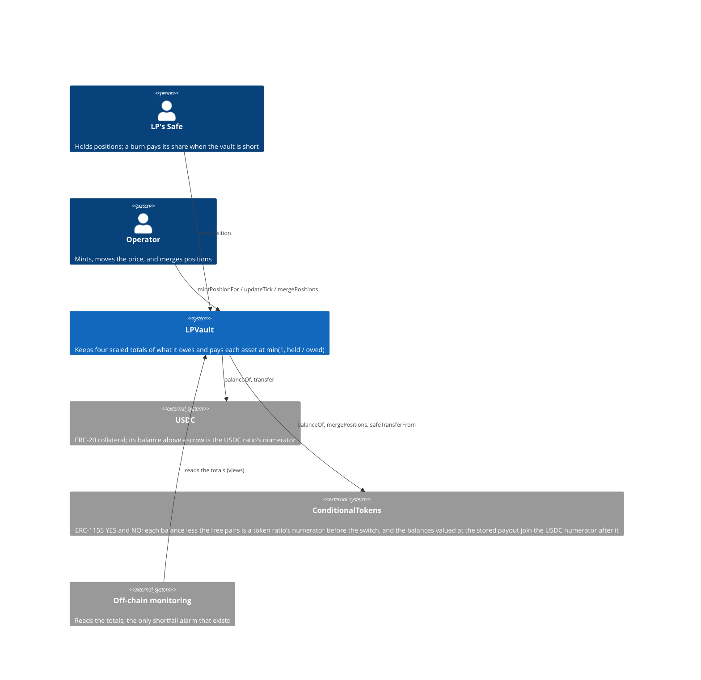
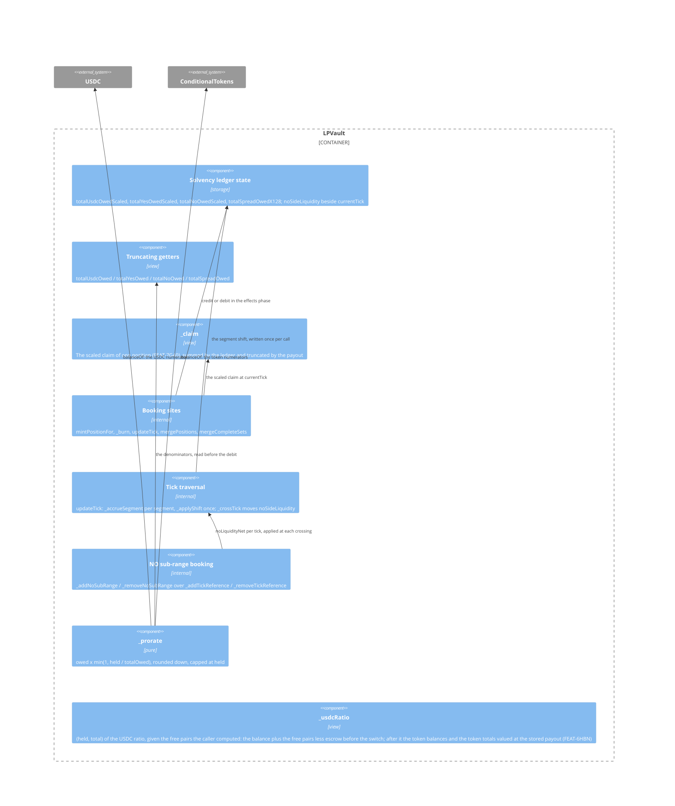
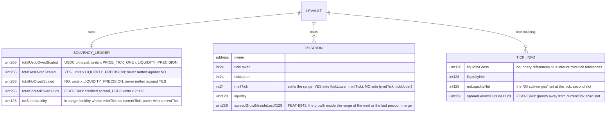
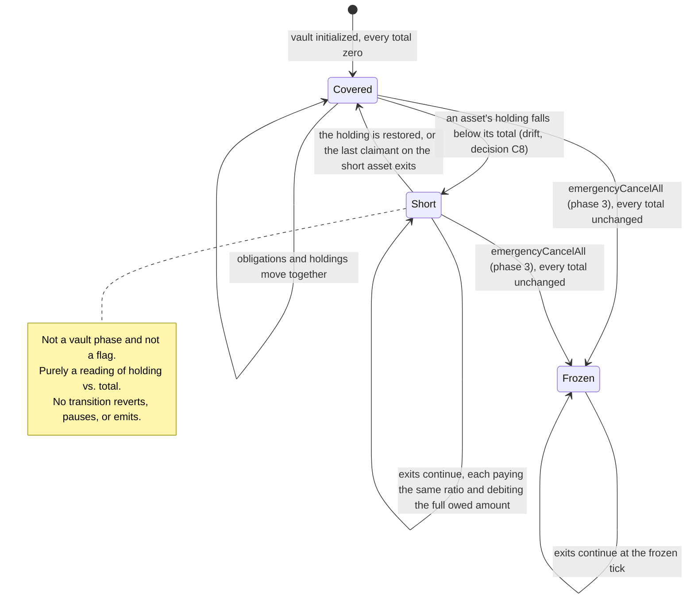

# Architecture: Vault Solvency Ledger

## System Context (C4 L1)

## Container View (C4 L2)

## Data Model

**Invariants:**
- The three scaled totals equal the sum over every live position of its scaled claim at `currentTick`, exactly, and `totalSpreadOwedX128` equals the sum of every live position's X128 spread claim, mod 2^256, exactly (NFR-9BRX, `invariant_ledgerEqualsSumOfClaims`)
- `noSideLiquidity == Σ liquidity over in-range positions with mintTick <= currentTick` (`invariant_noSideLiquidity`)
- `totalYesOwedScaled` and `totalNoOwedScaled` are independent; neither is ever reduced by the other (FR-9BR5)
- No total is derived from a price other than `currentTick` (FR-9BR4), and none is computed by iterating `positions` (FR-9BR3)
- A segment's shift conserves the claim: the USDC, YES, and NO deltas are the per-level derivative of the claim formula, so a move up and the same move down cancel exactly (FR-9BRL)
- Each ratio is `min(1, held / total)` with the truncated getters as denominators, read before the debit; a zero total yields 1 (FR-9BRP). Before the switch `held` counts the free pairs, `min(yes − min(yes, totalYesOwed()), no − min(no, totalNoOwed()))` with the totals read before the debit, as USDC for the USDC ratio and subtracts them from each token balance for the token ratios (FR-9BRM to FR-9BRO, FEAT-6HBN ADR-DFE2)
- Under drift-free fills the USDC above escrow covers `totalUsdcOwed() + totalSpreadOwed()` and each token balance covers its total, so every ratio is 1, every burn pays in full on every leg, and after the last burn the Safes hold their deposits plus the spread income and the vault holds 0 YES, 0 NO, and exactly `totalEscrowed`, within one unit per completed credit and per burn (`invariant_holdingsCoverTotals`, `invariant_burnsPayInFull`, `invariant_surplusIsCredited`, and the `afterInvariant` of `SolvencyConservationInvariantTest`; SC-DFDY)
- After the switch there is one USDC ratio: its numerator adds the USDC the vault's YES and NO balances redeem for at the stored payout, its denominator adds the USDC `totalYesOwed()` and `totalNoOwed()` redeem for, and a burn prorates its two legs as one sum (FR-CYS5); the totals themselves stay token-denominated (ADR-9BSJ)
- A burn debits the full scaled owed amount, whatever it paid (FR-9BRR)
- Before the switch `usdcPaid <= floor(usdcOwed × usdcRatio)` and `tokenPaid <= floor(tokenOwed × tokenRatio)`, and neither exceeds what is held; after it `usdcPaid + tokenPaid == floor((usdcOwed + tokenUsdc) × usdcRatio)` and never exceeds what is held (NFR-9BRW, `invariant_payoutsNeverExceedHeld`)
- A debit in `_burn` saturates at zero; a write in `updateTick` or `mergePositions` is checked (NFR-9BRT)
- The freeze writes no total and does not move `noSideLiquidity` (FEAT-JXQO FR-JXQP)

## Component Inventory

> Files that participate in this feature.

| File | Role | Key Exports |
|------|------|-------------|
| `src/LPVault.sol` | Business logic: the ledger state, the booking at every call site, the segment shift, the ratios | `totalUsdcOwedScaled`, `totalYesOwedScaled`, `totalNoOwedScaled`, `noSideLiquidity`, `totalUsdcOwed()`, `totalYesOwed()`, `totalNoOwed()`, `USDC_CLAIM_SCALE`, `TickInfo.noLiquidityNet`, `_addTickReference`, `_removeTickReference`, `_addNoSubRange`, `_removeNoSubRange`, `Shift`, `_accrueSegment`, `_applyShift`, `_prorate`, `_saturatingSub` |
| `src/LPVault.sol` | Reused from FEAT-7G40, FEAT-TVS0, FEAT-K1M2, FEAT-6HBN | `_claim` (returns the scaled claim), `_burnAmounts`, `_burn`, `updateTick`, `_crossTick`, `mergePositions`, `_availableUsdc`, `_usdcRatio`, `_tokenBalances`, `_freePairs`, `_resolved`, `_atPayout`, `_settle` |
| `test/fixtures/VaultStorage.sol` | Test fixture | `setCurrentTick` writes only the packed `currentTick` bytes, so `noSideLiquidity` keeps its value |
| `test/features/FEAT-9BQZ-vault-solvency-ledger/UC-9BR0-maintain-solvency-totals.t.sol` | Integration tests | UC-9BR0 scenarios |
| `test/features/FEAT-9BQZ-vault-solvency-ledger/UC-9BR1-accumulate-principal-shift.t.sol` | Integration tests | UC-9BR1 scenarios |
| `test/features/FEAT-9BQZ-vault-solvency-ledger/UC-9BR2-apply-payout-ratios.t.sol` | Integration tests | UC-9BR2 scenarios, including the drift-free conservation runs at a spread of 0 and of 2,000 bps on both sides of the switch |
| `test/fixtures/KeeperFillFixture.sol` | Test fixture: the keeper's drift-free fill for one tick move, priced as the house board prices its bids (`quotes.Board` in the Prophet server) | `_fillMove()`, `_boardBids()` |
| `test/invariants/SolvencyLedger.t.sol` | Invariant tests; the handler resolves the market one pick in three once two positions are live and the Oracle redeems, so about a third of the runs cross the switch and pay after it (measured on 2026-09-14: 7 of 24 sampled runs, 17 payouts after the switch) | `SolvencyLedgerHandler`, `invariant_ledgerEqualsSumOfClaims`, `invariant_noSideLiquidity`, `invariant_payoutsNeverExceedHeld`, `invariant_ledgerRevertsOnlyForDocumentedReasons`; `DriftFreeLedgerHandler` (no donation and no drain, every range inside `[100, 9900]`, deposits that divide by the width, every move filled at 2,000 bps into a ghost `spreadIncome`) and `SolvencyConservationInvariantTest` with `invariant_holdingsCoverTotals`, `invariant_burnsPayInFull`, and an `afterInvariant` that burns every position and checks the residue |
| `test/invariants/TickState.t.sol` | Invariant tests (FEAT-TVS0) | The per-mint-tick extensions of the tick invariants |

## API Surface

> The vault's driving port is `contract-call`; each row is an external function this feature adds or amends.

| Method | Path | Handler | Auth | Request Shape | Response Shape | Error Codes |
|--------|------|---------|------|---------------|----------------|-------------|
| call | `totalUsdcOwedScaled()` / `totalYesOwedScaled()` / `totalNoOwedScaled()` | public storage getters | none (view) | — | the scaled total | — |
| call | `totalUsdcOwed()` / `totalYesOwed()` / `totalNoOwed()` | `LPVault.totalUsdcOwed` and siblings | none (view) | — | the total in token units | — |
| call | `noSideLiquidity()` | public storage getter | none (view) | — | `uint128` | — |
| call | `ticks(int24)` | public storage getter | none (view) | tick | `(liquidityGross, liquidityNet, noLiquidityNet)` | — |
| call | `mintPositionFor(...)` | `LPVault.mintPositionFor` | `onlyOperator` | existing | existing | existing |
| call | `burnPosition(uint256)` / `burnPositionFor(...)` | `LPVault._burn` | existing | existing | existing; `PositionBurned` shows `paid < owed` on a cut | existing |
| call | `updateTick(int24)` | `LPVault.updateTick` | `onlyOperator` | existing | existing; `ticksCrossed` counts mint ticks | existing |
| call | `mergePositions(uint256[])` | `LPVault.mergePositions` | `onlyOperator` | existing | existing | existing |

**Note:** no exit path gains an error code from this feature. A shortfall is never an error (FR-9BRS, NFR-9BRU).

## Event Topology

| Event | Publisher | Payload | Condition | Consumers |
|-------|-----------|---------|-----------|-----------|
| `PositionBurned` | `LPVault._burn` | `positionId, owner, usdcOwed, usdcPaid, tokenId, tokenOwed, tokenPaid` | Unchanged since R9; `paid < owed` now marks a ratio below 1 on that asset | Off-chain event listener |
| `TickUpdated` | `LPVault.updateTick` | `oldTick, newTick, ticksCrossed` | Every tick change; `ticksCrossed` counts interior mint ticks | Off-chain event listener, keeper |

**Non-events:**
- No event is emitted when a ratio falls below 1. Shortfall detection is off-chain against the views of FR-9BR6 (ADR-9BSK).
- `mergePositions` emits no ledger event and writes no total (FR-9BRH).
- No event carries a total; the views do.

## Integration Points

| System | Protocol | Direction | Purpose |
|--------|----------|-----------|---------|
| USDC (ERC-20) | contract call | bidirectional | `balanceOf` supplies the USDC ratio's numerator with the free pairs and less `totalEscrowed`; `transfer` pays the USDC leg |
| ConditionalTokens (ERC-1155) | contract call | bidirectional | `balanceOf` supplies the YES and NO numerators less the free pairs before the switch, and the balances the USDC numerator values at the payout after it; `mergePositions` turns the free pairs into USDC; `safeTransferFrom` pays the token leg before the switch; `redeemPositions` turns every token into USDC after it |
| Off-chain monitoring | RPC read | outbound | Polls the totals; the only mechanism by which a shortfall becomes visible |

## State Transitions

## Code Map

| Spec ID | Spec Name | Implementation Files |
|---------|-----------|----------------------|
| UC-9BR0 | Maintain Solvency Totals | `src/LPVault.sol` — the ledger storage and every booking site |
| SC-9BRZ | Mint credits the USDC total by the whole deposit | `src/LPVault.sol:mintPositionFor()` |
| SC-9BS0 | Burn debits the totals by the claim at the current tick | `src/LPVault.sol:_burn()`, `src/LPVault.sol:_burnAmounts()`, `src/LPVault.sol:_claim()`, `src/LPVault.sol:_saturatingSub()` |
| SC-9BS6 | A merge leaves every total unchanged | `src/LPVault.sol:mergePositions()` |
| SC-9BS7 | Opposing bands are reported separately, never netted | `src/LPVault.sol:totalYesOwed()`, `src/LPVault.sol:totalNoOwed()` |
| SC-COEO | A mint and its burn cancel exactly with a deposit that does not divide by the width | `src/LPVault.sol:mintPositionFor()`, `src/LPVault.sol:_applyShift()`, `src/LPVault.sol:_burn()` |
| SC-COEP | The freeze leaves every total unchanged | `src/LPVault.sol:emergencyCancelAll()` (writes no total) |
| UC-9BR1 | Accumulate Principal Shift | `src/LPVault.sol:updateTick()` |
| SC-9BS8 | A move across several initialized ticks accrues each segment with its own split | `src/LPVault.sol:updateTick()`, `src/LPVault.sol:_accrueSegment()`, `src/LPVault.sol:_crossTick()` |
| SC-9BS9 | A move that crosses no tick still moves the totals | `src/LPVault.sol:updateTick()`, `src/LPVault.sol:_accrueSegment()` |
| SC-9BSA | A move that ends between ticks accrues its trailing segment | `src/LPVault.sol:updateTick()` (the accrual after the loop) |
| SC-9BSB | Each segment is accrued before its tick's liquidity change is applied | `src/LPVault.sol:updateTick()`, `src/LPVault.sol:_crossTick()` |
| SC-COEQ | Three chunks equal one call, and a reversal restores the mint totals | `src/LPVault.sol:_accrueSegment()`, `src/LPVault.sol:_applyShift()` |
| SC-COER | A mint tick is crossed like a boundary | `src/LPVault.sol:_addNoSubRange()`, `src/LPVault.sol:_addTickReference()`, `src/LPVault.sol:_crossTick()` |
| SC-COES | A clamped mint enters the range on the side its mint tick gives | `src/LPVault.sol:_addNoSubRange()`, `src/LPVault.sol:_crossTick()`, `src/LPVault.sol:_accrueSegment()` |
| UC-9BR2 | Apply Payout Ratios | `src/LPVault.sol:_prorate()`, `src/LPVault.sol:_usdcRatio()`, `src/LPVault.sol:_freePairs()`, `src/LPVault.sol:_burnAmounts()` |
| SC-9BSC | A covered vault pays every claim in full | `src/LPVault.sol:_prorate()` (the `held >= totalOwed` branch) |
| SC-9BSD | Three burns in a row each receive the same ratio | `src/LPVault.sol:_burnAmounts()`, `src/LPVault.sol:_burn()` (the full-owed debit) |
| SC-9BSE | Escrowed USDC never pays a burn | `src/LPVault.sol:_availableUsdc()`, `src/LPVault.sol:_prorate()` |
| SC-9BSF | A shortfall in one asset does not cut the others | `src/LPVault.sol:_burnAmounts()` (one `_prorate` per asset) |
| SC-9BSG | A position devalued by the price alone is paid in full | `src/LPVault.sol:_claim()`, `src/LPVault.sol:_prorate()` |
| SC-COEU | A burn debits the full owed amount when it pays less | `src/LPVault.sol:_burn()`, `src/LPVault.sol:_saturatingSub()` |
| SC-CYSB | Three burns after the switch receive the same ratio | `src/LPVault.sol:_usdcRatio()`, `src/LPVault.sol:_atPayout()`, `src/LPVault.sol:_burnAmounts()` (one prorate of the sum) |
| SC-CYSC | A payout after the switch redeems late tokens first | `src/LPVault.sol:_settle()`, `src/LPVault.sol:_redeemOutcomeTokens()`, `src/LPVault.sol:_burn()` |
| SC-DFDY | Drift-free fills conserve value across claims on both sides of the price, before and after the switch | `src/LPVault.sol:_freePairs()`, `src/LPVault.sol:_burnAmounts()`, `src/LPVault.sol:_burn()`, `src/LPVault.sol:_usdcRatio()`; `test/fixtures/KeeperFillFixture.sol:_fillMove()` |

## Architecture Decisions

**ADR-9BSH:** Pro-rata distribution, not first-come-first-served
In the context of a vault whose balance may fall short of its recorded obligations, facing the question of who absorbs the loss, we decided that every claimant against an asset takes the identical proportional haircut on it, to achieve an outcome where losses scale with stake rather than with monitoring speed, accepting that no claimant can exit whole while any shortfall persists. First-come-first-served would pay the fastest watcher in full and leave the tail with nothing — it rewards infrastructure, not exposure, and it converts every shortfall into a race. Real insolvency proceedings distribute recovery among same-class claimants pro-rata for the same reason.

**ADR-9BSI:** One pooled ratio per asset, not fees senior to principal
In the context of a vault owing both principal and fees in the same asset, facing the question of whether one class should be paid first, we decided that principal, fees, and escrow refunds share a single per-asset ratio, to achieve one formula with one fuzzable invariant, accepting that a fee claimant is not protected from a principal shortfall. Seniority has no constituency here: fees and principal are owed to the same LPs in the same proportions, and no junior class knowingly bought a junior slice. The intuition that fee revenue arrives earmarked for fee claims fails on commingling — it lands in one balance the exchange holds blanket approval against. And seniority would need a subtraction that can underflow plus a branch that executes only during the scenario least tolerant of bugs.
Superseded in part on 2026-09-14 (decision C7 in `audits/audit-fixes-ranged.md`, step R11): an escrow refund no longer shares the ratio, because escrowed USDC is senior and the reclaim pays the recorded amount (FEAT-JAIJ). Principal and fees still share the USDC ratio.
Superseded on 2026-09-14 (step R17): the vault carries no fee claim, so the USDC ratio's denominator is the USDC principal alone before the switch, and the principal plus the token totals valued at the payout after it. The reasoning stays as the record of why fees were never senior while they existed.
Extended on 2026-09-15 (step R18, ADR-E94W in FEAT-E943): the credited spread joins the USDC ratio's denominator in both modes and is paid at the same pooled ratio as the principal, for the same reason fees were never senior -- the spread and the principal are owed to the same LPs in the same proportions, and both land in one commingled balance. The two USDC legs are prorated as one floor, so their sum can never exceed what the vault holds.

**ADR-9BSJ:** Token-denominated obligations, never dollar-denominated
In the context of a ledger that must survive arbitrary price movement, facing the choice of unit, we decided that every total counts tokens of the asset owed and that no ledger path accepts a price input, to achieve an entitlement that cannot drift from the assets backing it, accepting that the ledger cannot report a single headline "total owed" figure. Dollar-denominating recreates the bug this feature exists to fix: record "owed $60" against 100 YES at $0.60, watch the price fall to $0.30, and the vault owes $60 backed by $30. Owe 100 YES, hold 100 YES, and the vault is square at any price — which is also why impermanent loss registers as no shortfall at all (SC-9BSG). Since R11 the unit is the pre-division claim (units × `LIQUIDITY_PRECISION` for a token, × `PRICE_TICK_ONE × LIQUIDITY_PRECISION` for USDC, × 2^128 for fees), which is still a token count once the getter truncates it.
Since 2026-09-14 (step R17) there is no fee unit; the two units that remain are the token and USDC ones above.
Since 2026-09-15 (step R18, ADR-E94R in FEAT-E943) the X128 unit returns for `totalSpreadOwedX128`, which counts USDC and not a token. It does not weaken this decision: the spread total is a USDC obligation the vault measured from a USDC balance it actually holds, never a dollar valuation of a token, and the three token-denominated totals are untouched.

**ADR-9BSK:** No solvency assertion on any path
In the context of a vault that can be short of an asset, facing the temptation to assert solvency on-chain, we decided that no path reverts, halts, pauses, or emits on a ratio below unity, to achieve exits that keep working during a shortfall, accepting that detection is entirely off-chain and that a shortfall is therefore visible only to whoever is watching. A solvency assertion on a payout path bricks withdrawals during precisely the shortfall the ratio exists to handle gracefully, converting a recoverable partial loss into a total one — and it does so for `burnPosition`, the path FEAT-7G40 guarantees is unconditional. The ratio is the response; an assertion would be a second, incompatible response to the same condition.

**ADR-9Q3Y:** Reconstruction truncation is a documented tolerance, not a compensated error
In the context of a ledger whose principal totals are credited and debited from `_owedAmounts`, which reconstructs a position's claim from its truncated `liquidity` rather than reading a stored figure, facing the fact that `mergePositions` collapses N of those downward truncations into one and so lets the survivor claim up to (N-1) base units more than the ledger ever recorded, we decided to state the conservation invariant with that tolerance rather than have `mergePositions` re-sync the totals, to achieve a merge that stays pure housekeeping and writes no ledger state, accepting that the totals understate obligations by a dust-scale amount which accumulates over the vault's life and biases the payout ratios marginally toward reporting solvency.
Superseded on 2026-09-14 (step R11, ADR-COEN): the scaled unit removes the reconstruction drift, because the claim is linear in `liquidity` and no total truncates before the getter, and the merge debits the fee dust its floors drop (FR-9BRH), so no tolerance remains and NFR-9BRX is exact. Since 2026-09-14 (step R17) the merge debits nothing (FR-9BRH).
Reinstated on 2026-09-15 (step R18): the merge debits the spread dust again, for the same reason it once debited the fee dust. One survivor snapshot cannot represent two positions' spread claims exactly, so the floor drops below the merged liquidity in X128 units, which is under one USDC unit, and the debit keeps NFR-9BRX exact.

**ADR-COEN:** The ledger holds the pre-division claim, debits the full owed amount, and saturates only on an LP exit
In the context of decision O2 reversed on 2026-09-14, facing R9's pay-what-is-there rule (ADR-BMF6 in FEAT-7G40) and the escrow branch's floored ledger that debited by the amount paid, we decided to hold every total in the claim's pre-division unit and truncate in the getters, to debit a burn and a collect by the full scaled owed amount so every later claimant meets the same ratio, to keep escrowed USDC out of the ratio (decision C7), to settle a collect's fee claim at the ratio with no remainder, and to saturate a debit at zero only in `_burn` and `_collect`, where decision C6 and ADR-7G5G forbid a revert, while `updateTick` and `mergePositions` use checked arithmetic so a ledger bug reverts the Operator's call the way `_addDelta` does, to achieve an exact conservation invariant and a visible failure on the Operator path, accepting about 16,000 gas on every moving report, 25,000 to 32,000 more on a mint and a burn, and 2,299 bytes of the room. The departure from the R11 step text ("the collect remainder stays"): a kept remainder is a claim the ledger no longer carries, so it would be paid later against the same shortfall from other claimants' share, or, kept in the ledger, it would lower the next claimant's ratio; the LP controls the timing of a collect (ADR-7G5I), so an LP who sees a shortfall can wait. The user chose this on 2026-09-14.
Amended on 2026-09-14 (step R17): the collect and the fee claim left the vault. The full-debit rule and the saturation rule apply to the burn alone.
Amended on 2026-09-15 (step R18): the fourth total follows the same three rules. A burn debits `totalSpreadOwedX128` by the position's full X128 spread whatever it paid, that debit saturates at zero in `_burn` alone, and the credits in `updateTick`, `mergeCompleteSets`, `mintPositionFor`, and the dust debit in `mergePositions` use checked arithmetic, so a ledger bug reverts the Operator's call and never a payout.

## Testing Decisions

| Service/Pattern | Decision | Reason |
|-----------------|----------|--------|
| USDC (ERC-20) | e2e | The shared `MockERC20`, as elsewhere in this repo |
| ConditionalTokens (ERC-1155) | e2e | The real Gnosis bytecode from `test/fixtures/ConditionalTokensFixture.sol`; `_giveOutcomeTokens` funds the token legs |
| Shortfall states | fixture | Reached by moving USDC out of the vault through the exchange's standing approval, as a fill would (decision C8), and by funding fewer tokens than the bands owe; no production path creates a shortfall on purpose |
| Drift-free fills | fixture | `KeeperFillFixture._fillMove` spends the board's bid per level through the exchange's standing approval and delivers the tokens through the receiver hook, so the conservation scenario and the drift-free invariant harness model the keeper the same way, at a spread of 0 and of 2,000 bps |
| The conservation invariant | fuzz | `test/invariants/SolvencyLedger.t.sol` computes every position's claim per level in the test, so a wrong closed form in the vault is caught too |
| The `currentTick` slot | fixture | `VaultStorage.setCurrentTick` writes the packed bytes only, so the extreme-word search tests of FEAT-TVS0 leave `noSideLiquidity` at zero |
| Resolution and the switch | e2e | The fixture's `_resolve` reports the result on the real ConditionalTokens contract, and the Oracle's `redeemOutcomeTokens` sets the switch; the invariant harness reports through a helper on the test contract, because the test contract is the condition's oracle |
