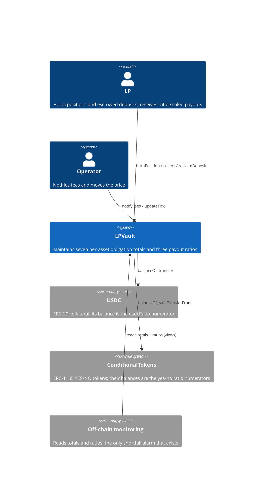
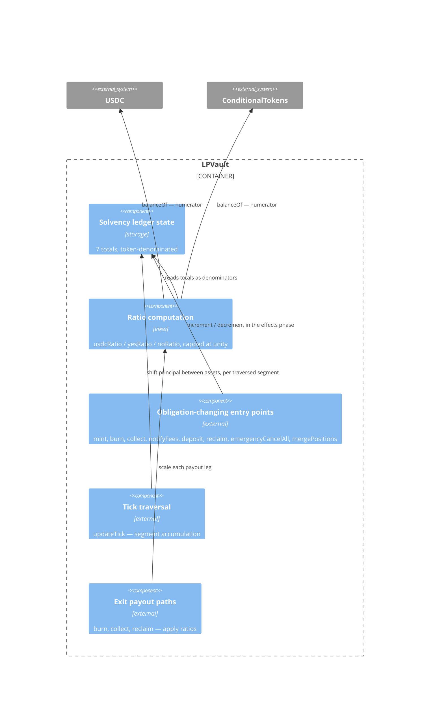
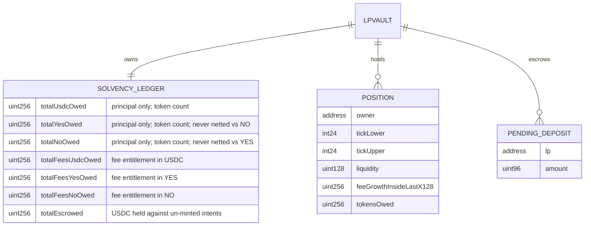
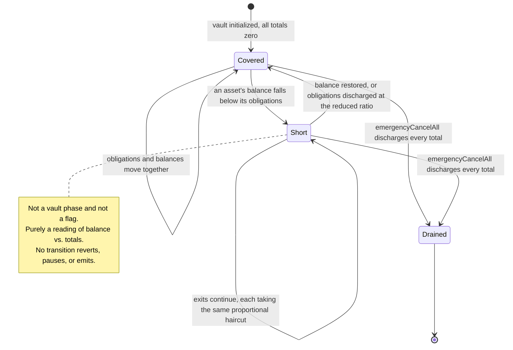

# Architecture: Vault Solvency Ledger

## System Context (C4 L1)

## Container View (C4 L2)

## Data Model

**Invariants:**
- Every total is non-negative; no decrement underflows (NFR-9BRT)
- `totalYesOwed` and `totalNoOwed` are independent — neither is ever reduced by the other (FR-9BR5)
- Every total is a token count; no total is derived from a price (FR-9BR4)
- No total is computed by iterating `positions` (FR-9BR3)
- A tick traversal preserves total principal in token terms: the decrease in the origin total equals the increase in the destination total (FR-9BRL)
- `usdcRatio`, `yesRatio`, `noRatio` are each `min(1, balance / obligations)`; a zero obligation yields unity (FR-9BRP)
- `mergePositions` writes no ledger total (FR-9BRH)
- Each total equals the sum of its per-position or per-intent contributions, to within one base unit per asset leg per position ever merged away (NFR-9BRX). Exact equality does not hold: principal is reconstructed from a truncated `liquidity`, and a merge collapses N of those truncations into one without writing the ledger (ADR-9Q3Y)
- Fee collection writes no principal total (FR-9BR7)

## Component Inventory

> Files that participate in this feature.

| File | Role | Key Exports |
|------|------|-------------|
| `src/LPVault.sol` | Business logic — ledger state, maintenance at every call site, ratio computation, ratio application on exits | `totalUsdcOwed`, `totalYesOwed`, `totalNoOwed`, `totalFeesUsdcOwed`, `totalFeesYesOwed`, `totalFeesNoOwed`, `totalEscrowed`, `usdcRatio()`, `yesRatio()`, `noRatio()` |
| `test/features/FEAT-9BQZ-vault-solvency-ledger/UC-9BR0-maintain-solvency-totals.t.sol` | Test — integration | UC-9BR0 scenarios |
| `test/features/FEAT-9BQZ-vault-solvency-ledger/UC-9BR1-accumulate-principal-shift.t.sol` | Test — integration | UC-9BR1 scenarios |
| `test/features/FEAT-9BQZ-vault-solvency-ledger/UC-9BR2-apply-payout-ratios.t.sol` | Test — integration | UC-9BR2 scenarios |
| `test/invariants/SolvencyLedger.t.sol` | Test — invariant | Conservation and non-negativity properties (NFR-9BRX) |

## API Surface

> The vault's driving port is `contract-call`; each row is an external function this feature adds or amends.

| Method | Path | Handler | Auth | Request Shape | Response Shape | Error Codes |
|--------|------|---------|------|---------------|----------------|-------------|
| call | `usdcRatio()` | `LPVault.usdcRatio` | none (view) | — | ratio, capped at unity | — |
| call | `yesRatio()` | `LPVault.yesRatio` | none (view) | — | ratio, capped at unity | — |
| call | `noRatio()` | `LPVault.noRatio` | none (view) | — | ratio, capped at unity | — |
| call | `totalUsdcOwed()` / `totalYesOwed()` / `totalNoOwed()` | public storage getters | none (view) | — | token count | — |
| call | `totalFeesUsdcOwed()` / `totalFeesYesOwed()` / `totalFeesNoOwed()` | public storage getters | none (view) | — | token count | — |
| call | `totalEscrowed()` | public storage getter | none (view) | — | token count | — |
| call | `mintPositionFor(...)` | `LPVault.mintPositionFor` | `onlyOperator` | existing | existing | existing |
| call | `burnPosition(uint256)` | `LPVault.burnPosition` | `position.owner` | existing | existing | existing |
| call | `burnPositionFor(uint256,bytes)` | `LPVault.burnPositionFor` | `onlyOperator` + owner signature | existing | existing | existing |
| call | `collect(uint256)` | `LPVault.collect` | `position.owner` | existing | existing | existing |
| call | `notifyFees(...)` | `LPVault.notifyFees` | `onlyOperator` | amended — fee asset identified | existing | existing |
| call | `depositForIntent(...)` | `LPVault.depositForIntent` | `onlyOperator` | existing | existing | existing |
| call | `reclaimDeposit(...)` / `reclaimDepositFor(...)` | `LPVault.reclaimDeposit` | LP signature / `onlyOperator` | existing | existing | existing |
| call | `updateTick(int24)` | `LPVault.updateTick` | `onlyOperator` | existing | existing | existing |
| call | `emergencyCancelAll()` | `LPVault.emergencyCancelAll` | position holder + timelock | existing | existing | existing |
| call | `mergePositions(uint256[])` | `LPVault.mergePositions` | `onlyOperator` | existing | existing | existing |

**Note:** no exit path gains an error code from this feature. A shortfall is never an error (FR-9BRS, NFR-9BRU).

## Event Topology

| Event | Publisher | Payload | Condition | Consumers |
|-------|-----------|---------|-----------|-----------|
| `PositionBurned` | `LPVault._burn` | `positionId, owner, usdcAmount, outcomeAmounts, feesAmount` | Existing event; amounts reported are post-ratio | Off-chain indexer |
| `FeesNotified` | `LPVault.notifyFees` | `amount, asset, feeGrowthGlobalX128` | Amended to identify the fee asset | Off-chain indexer |
| `TickUpdated` | `LPVault.updateTick` | `oldTick, newTick, crossCount` | Existing event | Off-chain indexer, keeper |

**Non-events:**
- No event is emitted when a ratio falls below unity. Shortfall detection is off-chain against the views of FR-9BR6 — an on-chain alarm would imply an on-chain response, and there is none by design (ADR-9BSK).
- `mergePositions` emits no ledger event, because it writes no total (FR-9BRH).

## Integration Points

| System | Protocol | Direction | Purpose |
|--------|----------|-----------|---------|
| USDC (ERC-20) | contract call | bidirectional | `balanceOf` supplies the `usdcRatio` numerator; `transfer` pays scaled USDC legs |
| ConditionalTokens (ERC-1155) | contract call | bidirectional | `balanceOf` supplies the `yesRatio` / `noRatio` numerators; `safeTransferFrom` pays scaled outcome legs |
| Off-chain monitoring | RPC read | outbound | Polls totals and ratios; the only mechanism by which a shortfall becomes visible |

## State Transitions

## Code Map

| Spec ID | Spec Name | Implementation Files |
|---------|-----------|----------------------|
| UC-9BR0 | Maintain Solvency Totals | `src/LPVault.sol` — ledger storage + every obligation-changing call site |
| SC-9BRZ | Mint increments principal totals | `src/LPVault.sol:mintPositionFor()` |
| SC-9BS0 | Burn decrements principal totals | `src/LPVault.sol:_burn()` |
| SC-9BS1 | Fee collection leaves principal unchanged | `src/LPVault.sol:collect()` |
| SC-9BS2 | Fee notification increments one fee total | `src/LPVault.sol:notifyFees()` |
| SC-9BS3 | Escrow deposit raises, consuming mint lowers | `src/LPVault.sol:depositForIntent()`, `src/LPVault.sol:mintPositionFor()` |
| SC-9BS4 | Reclaim refund lowers totalEscrowed | `src/LPVault.sol:reclaimDeposit()`, `src/LPVault.sol:reclaimDepositFor()` |
| SC-9BS5 | Emergency cancellation discharges totals | `src/LPVault.sol:emergencyCancelAll()` |
| SC-9BS6 | Merge leaves every total unchanged | `src/LPVault.sol:mergePositions()` |
| SC-9BS7 | Opposing tilts never netted | `src/LPVault.sol:yesRatio()`, `src/LPVault.sol:noRatio()` |
| UC-9BR1 | Accumulate Principal Shift | `src/LPVault.sol:updateTick()` |
| SC-9BS8 | Multi-crossing move accumulates each segment | `src/LPVault.sol:updateTick()` |
| SC-9BS9 | Zero-crossing move still accumulates | `src/LPVault.sol:updateTick()` |
| SC-9BSA | Trailing segment to an uninitialized newTick | `src/LPVault.sol:updateTick()` |
| SC-9BSB | Accumulate before applying liquidityNet | `src/LPVault.sol:updateTick()`, `src/LPVault.sol:_crossTick()` |
| UC-9BR2 | Apply Payout Ratios | `src/LPVault.sol:usdcRatio()`, `src/LPVault.sol:yesRatio()`, `src/LPVault.sol:noRatio()` |
| SC-9BSC | Solvent vault pays in full | `src/LPVault.sol:_burn()` |
| SC-9BSD | Same haircut in either call order | `src/LPVault.sol:_burn()`, `src/LPVault.sol:usdcRatio()` |
| SC-9BSE | Escrow counted in the denominator | `src/LPVault.sol:usdcRatio()` |
| SC-9BSF | Per-asset shortfall independence | `src/LPVault.sol:_burn()`, `src/LPVault.sol:yesRatio()` |
| SC-9BSG | Price-driven devaluation paid in full | `src/LPVault.sol:_burn()`, `src/LPVault.sol:_owedAmounts()` |

## Architecture Decisions

**ADR-9BSH:** Pro-rata distribution, not first-come-first-served
In the context of a vault whose balance may fall short of its recorded obligations, facing the question of who absorbs the loss, we decided that every claimant against an asset takes the identical proportional haircut on it, to achieve an outcome where losses scale with stake rather than with monitoring speed, accepting that no claimant can exit whole while any shortfall persists. First-come-first-served would pay the fastest watcher in full and leave the tail with nothing — it rewards infrastructure, not exposure, and it converts every shortfall into a race. Real insolvency proceedings distribute recovery among same-class claimants pro-rata for the same reason.

**ADR-9BSI:** One pooled ratio per asset, not fees senior to principal
In the context of a vault owing both principal and fees in the same asset, facing the question of whether one class should be paid first, we decided that principal, fees, and escrow refunds share a single per-asset ratio, to achieve one formula with one fuzzable invariant, accepting that a fee claimant is not protected from a principal shortfall. Seniority has no constituency here: fees and principal are owed to the same LPs in the same proportions, and no junior class knowingly bought a junior slice. The intuition that fee revenue arrives earmarked for fee claims fails on commingling — it lands in one balance the exchange holds blanket approval against. And seniority would need a subtraction that can underflow plus a branch that executes only during the scenario least tolerant of bugs.

**ADR-9BSJ:** Token-denominated obligations, never dollar-denominated
In the context of a ledger that must survive arbitrary price movement, facing the choice of unit, we decided that every total counts tokens of the asset owed and that no ledger path accepts a price input, to achieve an entitlement that cannot drift from the assets backing it, accepting that the ledger cannot report a single headline "total owed" figure. Dollar-denominating recreates the bug this feature exists to fix: record "owed $60" against 100 YES at $0.60, watch the price fall to $0.30, and the vault owes $60 backed by $30. Owe 100 YES, hold 100 YES, and the vault is square at any price — which is also why impermanent loss registers as no shortfall at all (SC-9BSG).

**ADR-9BSK:** No solvency assertion on any path
In the context of a vault that can be short of an asset, facing the temptation to assert solvency on-chain, we decided that no path reverts, halts, pauses, or emits on a ratio below unity, to achieve exits that keep working during a shortfall, accepting that detection is entirely off-chain and that a shortfall is therefore visible only to whoever is watching. A solvency assertion on a payout path bricks withdrawals during precisely the shortfall the ratio exists to handle gracefully, converting a recoverable partial loss into a total one — and it does so for `burnPosition`, the path FEAT-7G40 guarantees is unconditional. The ratio is the response; an assertion would be a second, incompatible response to the same condition.

**ADR-9Q3Y:** Reconstruction truncation is a documented tolerance, not a compensated error
In the context of a ledger whose principal totals are credited and debited from `_owedAmounts`, which reconstructs a position's claim from its truncated `liquidity` rather than reading a stored figure, facing the fact that `mergePositions` collapses N of those downward truncations into one and so lets the survivor claim up to (N-1) base units more than the ledger ever recorded, we decided to state the conservation invariant with that tolerance rather than have `mergePositions` re-sync the totals, to achieve a merge that stays pure housekeeping and writes no ledger state, accepting that the totals understate obligations by a dust-scale amount which accumulates over the vault's life and biases the payout ratios marginally toward reporting solvency. The re-sync alternative is defensible on cost — the function already loops over exactly those positions — but it makes `mergePositions` a ledger writer, which is the precise adjustment FR-9BRH's fit criterion refuses, and it would leave the requirement describing behavior the code no longer has. The same reconstruction truncation already exists between a deposit and the `liquidity` derived from it, where it is likewise carried rather than compensated (pinned by the mint-truncation regression on UC-9BR0), and this matches the Q128 fee-dust convention used throughout this repo. Magnitude is bounded by the count of positions ever merged away, one base unit per asset leg each; at USDC's six decimals that is fractions of a cent. The direction is the one that matters and is recorded here deliberately: understating obligations shrinks the ratio denominators, so a shortfall reads marginally smaller than it is.

## Testing Decisions

| Service/Pattern | Decision | Reason |
|-----------------|----------|--------|
| USDC (ERC-20) | e2e | Local mock deployed in the Foundry test suite, as elsewhere in this repo |
| ConditionalTokens (ERC-1155) | e2e | Local mock; balances are set directly to drive shortfall scenarios |
| Shortfall states | fixture | Reached by transferring assets out of the vault in the test harness rather than by any production path — the production code has no way to create a shortfall on purpose |
| Ratio arithmetic | injection | Fuzzed over balance and obligation ranges, including zero-obligation and surplus cases |
