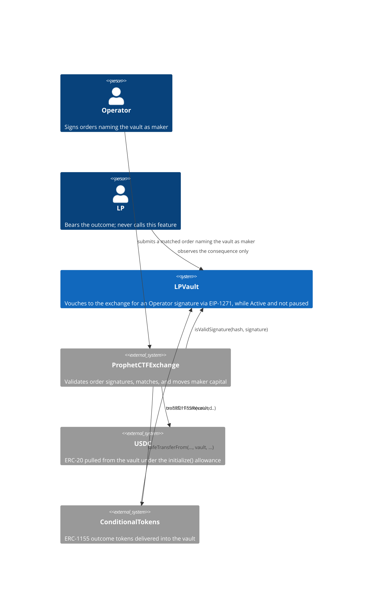
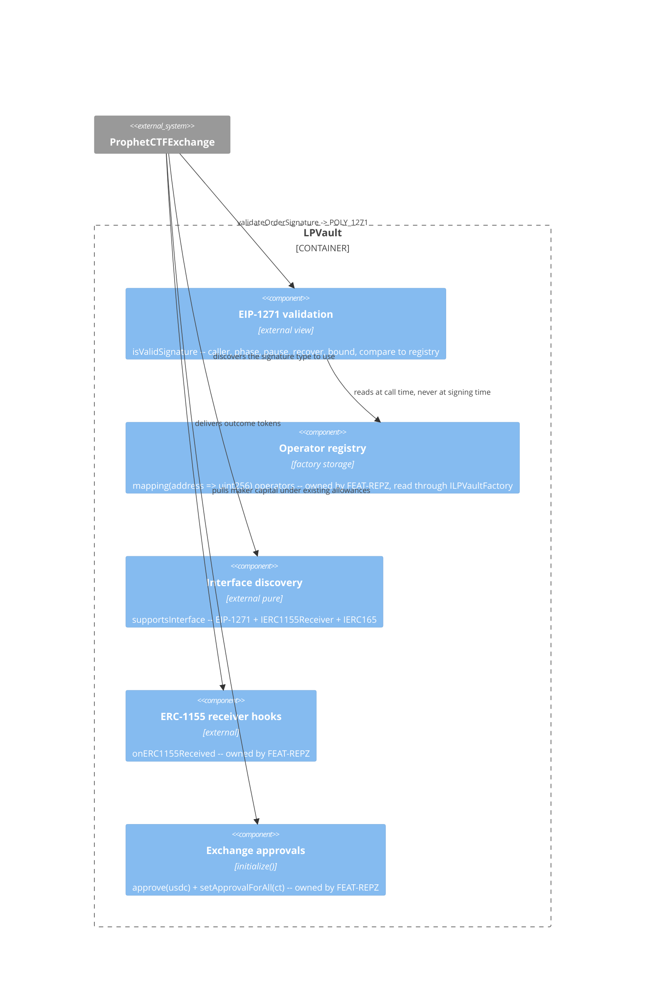
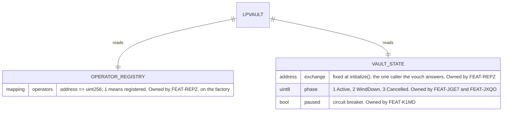

# Architecture: Vault Order Authorization

## System Context (C4 L1)

## Container View (C4 L2)

## Data Model

This feature introduces no storage. It reads state other features own.

**Invariants:**
- Signature validation writes no storage and emits no event (NFR-C0E2)
- Authorization is a function of the registry at call time, never of the registry at signing time (FR-C0DY)
- The vouch answers only `exchange`, and only while `phase == 1 && !paused` (FR-CVPX, FR-CVPY, ADR-CVQ2)
- No nonce, `intentId`, or order record exists anywhere in this feature (NFR-C0E1, ADR-C0E8)
- The success value is exactly `0x1626ba7e`; every failure path returns `0xffffffff` (NFR-C0E4)
- No input reaches a revert (FR-C0DW)

## Component Inventory

> Files that participate in this feature.

| File | Role | Key Exports |
|------|------|-------------|
| `src/LPVault.sol` | Business logic -- EIP-1271 validation, caller and phase gates, malleability bounds, registry lookup, interface advertisement | `isValidSignature(bytes32,bytes)`, `supportsInterface(bytes4)`, `_recoverSigner(bytes32,bytes)` (internal, shared with `_verifySafeOwnerSignature`), `ERC1271_MAGIC_VALUE`, `ERC1271_INVALID_SIGNATURE` |
| `foundry.toml` | Configuration -- `fs_permissions` grants read access to `test/artifacts/` | `fs_permissions` |
| `test/artifacts/ProphetCTFExchange.json` | Test artifact -- the forge build artifact of the exchange Prophet deploys, copied as forge wrote it | `bytecode`, `deployedBytecode`, `abi`, `metadata` |
| `test/fixtures/ExchangeFixture.sol` | Test fixture -- deploys the vendored exchange, registers the vault's tokens, builds and signs vault and EOA orders | `ExchangeFixture`, `IProphetCTFExchange`, `_deployExchange`, `_registerVaultTokens`, `_vaultBuy`, `_eoaOrder` |
| `test/features/FEAT-C0DJ-vault-order-authorization/UC-C0DK-vouch-for-an-operator-signed-order.t.sol` | Test -- integration | UC-C0DK scenarios, SC-C0DT |
| `test/features/FEAT-C0DJ-vault-order-authorization/UC-C0DL-settle-a-matched-order-into-the-vault.t.sol` | Test -- integration | UC-C0DL fill scenarios |

## API Surface

> The vault's driving port is `contract-call`; each row is an external function this feature adds or amends.

| Method | Path | Handler | Auth | Request Shape | Response Shape | Error Codes |
|--------|------|---------|------|---------------|----------------|-------------|
| call | `isValidSignature(bytes32,bytes)` | `LPVault.isValidSignature` | `msg.sender == exchange`, checked inline and answered with the failure value, never a revert; the recovered signer must be a registered Operator | order hash, signature bytes | `0x1626ba7e` on success, `0xffffffff` otherwise | **none by design** -- never reverts (FR-C0DW) |
| call | `supportsInterface(bytes4)` | `LPVault.supportsInterface` | none (pure) | interface id | bool | -- |

**Note:** `isValidSignature` is callable by anyone, and answers only the exchange. The recovered signer is the authority over *whose* order it is; the caller check bounds *where* the vouch can be consumed (ADR-CVQ2). The check is inline, not a modifier, because a modifier reverts and this method must return (ADR-C0E7); `CLAUDE.md` checklist item 2 records the departure.

## Event Topology

This feature publishes no events.

**Non-events:**
- No event on a successful vouch. The exchange is the publisher for the trade; a vault-side event would duplicate it and would fire on speculative probes that never become fills.
- No event on a rejected signature. Rejection is the common case for any contract that can be called by anyone, so an event would be an attacker-controlled log-spam surface.
- No event when an Operator's signature stops being honoured. Revocation is passive (SC-C0DO) -- the vault never learns which orders existed.
- No event when a pause, a wind-down, or a freeze stops the vouch. The keeper reads `TradingPaused`, `VaultWindDownStarted`, and `EmergencyCancelExecuted`, which those features already emit, and cancels its resting orders.

## Integration Points

| System | Protocol | Direction | Purpose |
|--------|----------|-----------|---------|
| ProphetCTFExchange | contract call (`staticcall`) | inbound | Calls `isValidSignature` through solady's `isValidSignatureNow` in `verifyPoly1271Signature` when `order.maker == order.signer == vault` and the signature type is `POLY_1271`; pulls maker capital on a match |
| LPVaultFactory | contract call | outbound | `operators(signer)` read at call time (FR-C0DY) |
| USDC (ERC-20) | contract call | outbound (pulled) | The exchange draws the maker's USDC leg under the allowance set at `initialize()` |
| ConditionalTokens (ERC-1155) | contract call | inbound | Outcome tokens are delivered to the vault and acknowledged through `onERC1155Received` |

## State Transitions

This feature has no state machine of its own. Whether a signature is honoured is a pure function of the caller, the vault's `phase` and `paused` flags (owned by FEAT-JGE7, FEAT-JXQO, and FEAT-K1MD), and the registry at call time -- there is no per-order state to transition, which is precisely what ADR-C0E8 records.

## Code Map

| Spec ID | Spec Name | Implementation Files |
|---------|-----------|----------------------|
| UC-C0DK | Vouch for an Operator-Signed Order | `src/LPVault.sol:isValidSignature()` |
| SC-C0DM | Registered Operator is vouched for | `src/LPVault.sol:isValidSignature()` |
| SC-C0DN | Signature from a non-operator is refused | `src/LPVault.sol:isValidSignature()` |
| SC-C0DO | Operator revoked between signing and filling | `src/LPVault.sol:isValidSignature()`, `src/LPVaultFactory.sol:removeOperator()` |
| SC-C0DP | Malleable high-s signature is refused | `src/LPVault.sol:isValidSignature()`, `src/LPVault.sol:_recoverSigner()` |
| SC-C0DQ | Recovery identifier outside {27,28} refused | `src/LPVault.sol:isValidSignature()`, `src/LPVault.sol:_recoverSigner()` |
| SC-C0DR | Malformed or empty signature returns a value | `src/LPVault.sol:isValidSignature()`, `src/LPVault.sol:_recoverSigner()` |
| SC-CVPZ | Paused vault refuses, and accepts again after unpause | `src/LPVault.sol:isValidSignature()`, `src/LPVault.sol:pauseTrading()`, `src/LPVault.sol:unpauseTrading()` |
| SC-CVQ0 | Wound-down vault refuses every signature | `src/LPVault.sol:isValidSignature()`, `src/LPVault.sol:startWindDown()` |
| SC-CVQ1 | A caller other than the exchange is refused | `src/LPVault.sol:isValidSignature()` |
| UC-C0DL | Settle a Matched Order Into the Vault | `src/LPVault.sol:supportsInterface()`, `src/LPVault.sol:onERC1155Received()`, `test/fixtures/ExchangeFixture.sol` |
| SC-C0DS | Two buys mint a pair into the vault | `src/LPVault.sol:isValidSignature()`, `src/LPVault.sol:onERC1155Received()`, `src/LPVault.sol:initialize()` |
| SC-CVQ5 | A taker sell fills the vault's buy | `src/LPVault.sol:isValidSignature()`, `src/LPVault.sol:onERC1155Received()`, `src/LPVault.sol:initialize()` |
| SC-CVQ6 | A fill reverts once the vault is frozen | `src/LPVault.sol:isValidSignature()`, `src/LPVault.sol:emergencyCancelAll()` |
| SC-C0DT | Vault advertises EIP-1271 with the receiver | `src/LPVault.sol:supportsInterface()` |

## Architecture Decisions

**ADR-C0E6:** The vault is the order maker, vouching via EIP-1271
In the context of a vault that holds LP capital and is architecturally a market maker, facing the fact that `ProphetCTFExchange` validates `order.maker`'s signature unconditionally through `_validateOrder` and none of its four signature types can admit an EIP-1167 clone, we decided that `order.maker` is the vault and a registered Operator's key produces the signature bytes the vault vouches for, to achieve fills against vault-held capital with assets that never leave the vault, accepting that any registered Operator can author any order against it. The rejected alternative -- an Operator EOA as maker -- would require vault assets to move out to an externally-owned account before trading and back after, putting LP capital in a hot wallet between trades and breaking the solvency ratios of FEAT-9BQZ, which read the vault's own balances. The existing code already commits to this choice: `initialize()` runs `approve(exchange, max)` and `setApprovalForAll(conditionalTokens, exchange, true)`, and both lines are dead code under the rejected alternative.

**ADR-C0E7:** Return the failure value, never revert
In the context of a method any address can call with any bytes, facing the choice between reverting on a bad signature and returning a non-matching value, we decided that every path returns a `bytes4` and no path reverts, to achieve a caller that can branch on the result, accepting that a caller who ignores the return value gets no signal at all. The exchange distinguishes a revert from a wrong return value, and callers probe this method speculatively; a revert converts a merely-rejected order into a failed transaction and hands anyone who can pass malformed bytes a griefing vector.

**ADR-C0YQ:** One shared, non-reverting signature recovery helper
In the context of a vault whose 65-byte decode, `s <= secp256k1n/2` bound, and `v` in {27, 28} check are already triplicated across `_verifyMintIntent`, `_verifyReclaimIntent`, and `_verifyBurnIntent`, facing the fact that `isValidSignature` must not revert (ADR-C0E7) and therefore cannot call any of them, we decided to extract `_recoverSigner(bytes32, bytes) returns (address)` -- yielding `address(0)` on any failure -- and refactor the three existing verifiers onto it, to achieve one definition of what a well-formed signature is, accepting that this feature edits code owned by FEAT-T7AF, FEAT-JAIJ, and FEAT-7G40. The rejected alternative, writing a fourth private copy inside `isValidSignature`, is the silent duplication Principle 5 names, in the one place where a copy that later diverges is a security bug rather than a style complaint. The three verifiers keep their existing `revert InvalidSignature()` on a zero result, so their behavior is unchanged and the existing suite is the regression net. On this branch, R5 (FEAT-3ZRI) already replaced the three verifiers with the one Safe owner-key check `_verifySafeOwnerSignature` (ADR-9OYP in FEAT-T7AF), so the record's "three verifiers" reads as that one caller: it rejects the zero address on its own line and reverts exactly as before. The design review of 2026-09-14 kept this one-helper shape over a split into a reverting wrapper with one caller.

**ADR-C0E8:** Replay protection stays with the exchange
In the context of a codebase whose every other Operator-issued and LP-signed action carries a unique `intentId` recorded in a `used` mapping, facing the question of whether order signatures need the same, we decided that this feature tracks no nonce and records no order, to achieve one authoritative record of order state, accepting that the vault cannot tell whether a hash it vouched for was ever filled. Order hashing, partial-fill accounting, and cancellation already live in the exchange's `_performOrderChecks`; a second ledger here could only duplicate that or diverge from it, and divergence would either block legitimate fills or honour orders the exchange had already retired. The convention is deliberately broken here and recorded so an auditor reads the absence as a decision. The scope of what the vault does authorize is correspondingly narrow: who signed, never what was signed.

**ADR-CVQ2:** The vouch answers the exchange only, and only while the vault trades
In the context of an EIP-1271 method any address may call with any bytes, facing USDC `FiatTokenV2_2`, which routes a `permit` or `transferWithAuthorization` bytes signature to the payer's `isValidSignature` (ERC-7598), and the freeze, the wind-down, and the pause, which must stop new fills while claims pay at a fixed tick (decision C22, ADR-BZBZ in FEAT-JXQO), we decided that `isValidSignature` returns `0xffffffff` unless `msg.sender` is the vault's configured exchange and the vault is Active and not paused, with the caller check written inline because the method must return a value and never revert (ADR-C0E7), to achieve a vouch that only a matched order on the exchange can consume, accepting one cold storage read per fill (about 2,100 gas), a resting order that fails its signature check at match time instead of being cancelled, and a recorded departure from the modifiers-only rule in `CLAUDE.md` checklist item 2. The rejected alternative, an open vouch that any caller may consume, would let an Operator key move vault USDC through the token contract itself, which makes NFR-C0E5 false on a chain whose USDC honours ERC-7598. The user chose this on 2026-09-14.

## Testing Decisions

| Service/Pattern | Decision | Reason |
|-----------------|----------|--------|
| ProphetCTFExchange | fixture | The suite deploys the vendored bytecode of the exchange Prophet deploys, `ProphetCTFExchange` at commit b5903f1 of ProphetMarket/contracts (the mainnet deploy commit) over the ctf-exchange mixins at 9e6d895, from `test/artifacts/ProphetCTFExchange.json` through `ExchangeFixture`, so the fill tests run the real `_validateOrder`, the real `POLY_1271` branch, and the real match types. The compiler versions never meet: the artifact is deployed, not compiled. The artifact matches the Polygon deploy transaction's input up to the metadata hash (checked on 2026-09-14). A forked-Polygon run against the deployed exchange stays in Part 6 of the audit plan |
| USDC (ERC-20) | e2e | Local mock, as elsewhere in this repo |
| ConditionalTokens (ERC-1155) | e2e | The real Gnosis bytecode through `ConditionalTokensFixture`; balances are asserted directly to prove the delivery leg, and the taker sell exercises the vault's operator approval to the exchange |
| Signature malleability | fixture | The malleated twin is computed in the test from the original (`s' = n - s`, `v` flipped) rather than captured as a constant, so the fixture stays valid if the signing helper changes |
| Operator revocation timing | fixture | Sign, then `removeOperator`, then validate -- ordering within a single test drives SC-C0DO with no clock manipulation |
| Emergency-cancel timelock | injection | `vm.warp` past `emergencyCancelTimelock()` before `emergencyCancelAll`, as the FEAT-JXQO suite does |
