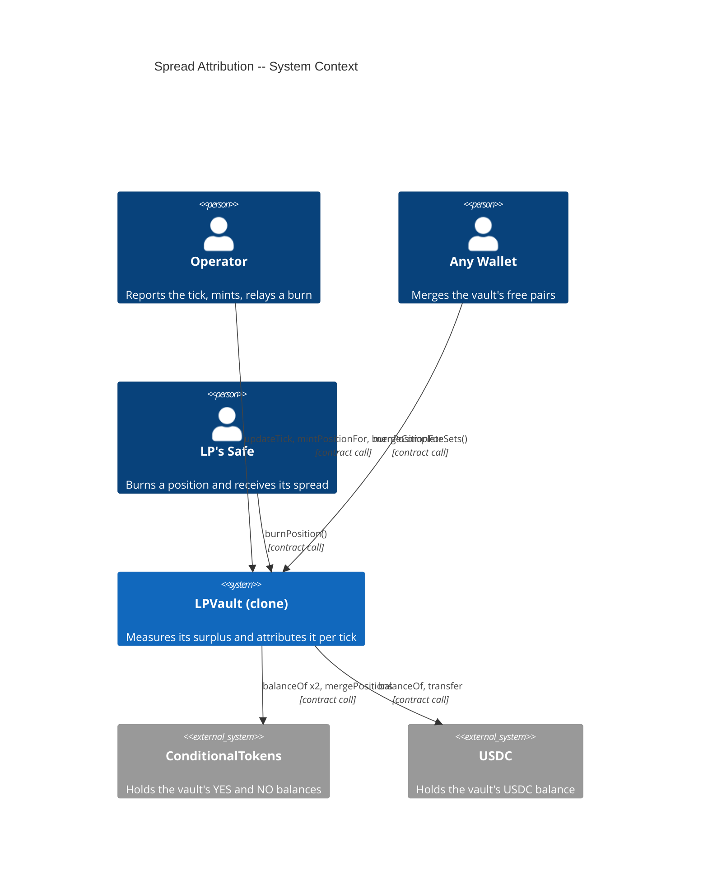
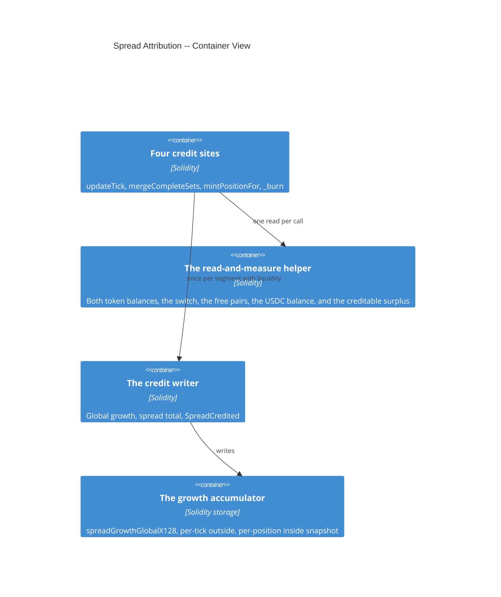
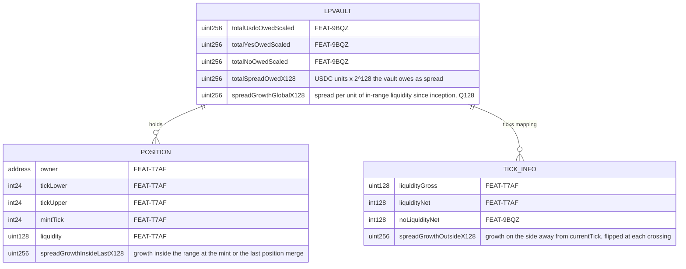

# Architecture: Spread Attribution

## System Context (C4 L1)

## Container View (C4 L2)

The credit is an internal effect, not a driver port of its own. No caller can invoke it directly and no entry point takes a spread amount. The escrow refund reads balances for its own merge and never credits, because a refund changes no owed total.

## Data Model

**Invariants:**

- `totalSpreadOwedX128` equals the sum over every live position of `liquidity × (spreadGrowthInside − spreadGrowthInsideLastX128)`, mod 2^256, exactly
- `spreadGrowthGlobalX128` only grows, under checked arithmetic
- A tick at or below `currentTick` starts its `spreadGrowthOutsideX128` at the global on first reference; a tick above it starts at zero
- A tick record deleted by `_removeTickReference` takes its `spreadGrowthOutsideX128` with it
- A position minted after a credit has a spread claim of exactly zero
- After any credit that found liquidity in range with both tokens covered, the uncredited surplus is below one USDC unit
- After the last position's burn the vault holds exactly `totalEscrowed` USDC, 0 YES, and 0 NO

## Component Inventory

| File | Role | Key Exports |
|------|------|-------------|
| `src/LPVault.sol` | Vault with the measurement, the accumulator, and the four credit sites | `totalSpreadOwedX128`, `spreadGrowthGlobalX128`, `totalSpreadOwed()`, `SpreadCredited`, `ResidueSwept`, the fourth value of `ticks()`, the sixth word of `positions()` |
| `test/fixtures/KeeperFillFixture.sol` | The house board's bid rule and the drift-free fill that produces a measurable surplus | `_fillMove`, `_boardBids` |
| `test/features/FEAT-E943-spread-attribution/UC-E944-credit-the-measured-spread.t.sol` | Integration tests for the eight scenarios | — |
| `test/invariants/SolvencyLedger.t.sol` | Invariant suite over the ledger, extended with the fourth total and the surplus property | `invariant_surplusIsCredited`, `invariant_ledgerEqualsSumOfClaims`, `invariant_payoutsNeverExceedHeld` |
| `test/invariants/TickState.t.sol` | Invariant suite over tick state, extended with the deleted-tick snapshot check | `invariant_zeroLiquidityTickHasNoBit` |

## Event Topology

| Event | Publisher | Payload | Condition | Consumers |
|-------|-----------|---------|-----------|-----------|
| `SpreadCredited(uint256 amount, uint256 spreadGrowthGlobalX128)` | LPVault | the USDC credited after the floors, and the global growth after the credit | Once per credited segment, whenever the credited amount is above zero | Off-chain indexer, which reconciles the spread pool without replaying the measurement |
| `ResidueSwept(uint256 indexed positionId, address indexed owner, uint256 usdcResidue, uint256 yesResidue, uint256 noResidue)` | LPVault | the amounts paid beyond the position's own claim | On the burn whose ledger debit takes `totalUsdcOwedScaled` to zero | Off-chain indexer; a sweep above dust is a drift record |

**Non-events (explicit):**

- A credit of zero emits nothing, whether the surplus was zero, a token was short, or no liquidity was in range
- An unchanged-tick report emits nothing and reads no balance
- An escrow refund emits no `SpreadCredited`
- A position merge emits no `SpreadCredited`, although it writes `totalSpreadOwedX128` by the dust its floor drops (FEAT-9BQZ FR-9BRH)

## API Surface

| Method | Path | Handler | Auth | Request Shape | Response Shape | Error Codes |
|--------|------|---------|------|---------------|----------------|-------------|
| call | `LPVault.totalSpreadOwedX128()` | public getter | none | — | `uint256` | — |
| call | `LPVault.totalSpreadOwed()` | `totalSpreadOwed` | none | — | `uint256` USDC units | — |
| call | `LPVault.spreadGrowthGlobalX128()` | public getter | none | — | `uint256` | — |
| call | `LPVault.ticks(int24)` | public getter | none | `tick` | `liquidityGross, liquidityNet, noLiquidityNet, spreadGrowthOutsideX128` | — |
| call | `LPVault.positions(uint256)` | public getter | none | `positionId` | `owner, tickLower, tickUpper, mintTick, liquidity, spreadGrowthInsideLastX128` | — |

No new entry point. The credit runs inside `updateTick`, `mergeCompleteSets`, `mintPositionFor`, and `_burn`, whose signatures and authority do not change.

## Integration Points

| System | Protocol | Direction | Purpose |
|--------|----------|-----------|---------|
| Gnosis ConditionalTokens | contract call | outbound | `balanceOf` for both outcome tokens at every credit site, and `mergePositions` for the free pairs the report and the mint now merge |
| USDC (ERC-20) | contract call | outbound | `balanceOf` at every credit site, and the `transfer` that pays the spread leg and the residue |

## State Transitions

_Not applicable: the spread accumulator has no lifecycle. It only grows, and its per-tick and per-position snapshots live and die with the records that hold them._

## Code Map

| Spec ID | Spec Name | Implementation Files |
|---------|-----------|---------------------|
| UC-E944 | Credit the Measured Spread | `src/LPVault.sol:_creditableSurplus()`, `src/LPVault.sol:_creditSpread()` |
| SC-E94H | One report over one segment credits by liquidity | `src/LPVault.sol:updateTick()`, `src/LPVault.sol:_settleReport()` |
| SC-E94I | A report over several segments splits by model spend | `src/LPVault.sol:_settleReport()` |
| SC-E94J | The public merge credits a round trip | `src/LPVault.sol:mergeCompleteSets()` |
| SC-E94K | A reported fill the vault never received is withheld | `src/LPVault.sol:_creditableSurplus()` (the token-cover branch) |
| SC-E94L | A credit with nothing in range carries forward | `src/LPVault.sol:_creditSpread()` (the zero-active branch) |
| SC-E94M | The mint credits, then starts the new position at zero | `src/LPVault.sol:mintPositionFor()`, `src/LPVault.sol:_spreadGrowthInside()` |
| SC-E94N | A burn credits before it values its claim | `src/LPVault.sol:_burn()`, `src/LPVault.sol:_burnAmounts()` |
| SC-E94O | The last live position takes the residue | `src/LPVault.sol:_sweepResidue()` |
| FR-E94B | The position's spread claim | `src/LPVault.sol:_spreadGrowthInside()`, `src/LPVault.sol:_burnAmounts()` |
| FR-E94C | The closing sweep | `src/LPVault.sol:_sweepResidue()` |
| FR-E94Y | The views | `src/LPVault.sol:totalSpreadOwed()`, the two public mappings |

## Architecture Decisions

**ADR-E94R:** The growth accumulator returns for the spread, with a measured source and no amount argument
In the context of a vault that deleted its fee accumulator in step R17 because the exchange fee never enters the vault, facing the requirement that the spread reach the LPs per tick with no remainder, we decided to bring back the Uniswap v3 growth structure under spread names -- a global growth, a per-tick outside snapshot flipped at each crossing, and a per-position snapshot taken at the mint -- fed by the vault's own measurement of what it holds above what it owes, to achieve constant-gas attribution per segment that a compromised Operator key cannot inflate, accepting 2,917 bytes of contract size on the exploration's prototype, three balance reads at every credit site, and the return of the wrapping `unchecked` arithmetic the R1 review vetted. How this differs from the fee version: there is no amount argument and no `notifyFees`, because the source measures instead of trusting; there is no `collect` and no `tokensOwed`, because a burn pays everything a position holds; and the credit runs at four sites rather than one. This reinstates the fee-growth wraparound decision (ADR-8L1F in FEAT-T7AF) for the spread. The `unchecked` sites are `_spreadGrowthInside`, the flip in `_crossTick`, the products in `_burnAmounts` and in `mergePositions`, and the outside adjustment after a per-segment credit, each with its own comment (NFR-E94G).

**ADR-E94S:** The credit is split per segment by model spend, and the crossed ticks are adjusted after the flip
In the context of one report that traverses several segments, each with its own in-range set, facing the fact that the vault sees only one surplus at the end of the report, we decided to record each segment's in-range liquidity and model spend during the crossing loop and split the measured surplus by `active × model spend`, then add to each crossed tick's outside snapshot the growth credited before it was crossed, to achieve a credit that reaches the right positions without a second pass over the ticks, accepting a bounded, signed error when the spread varies across the report's levels (NFR-E94D) which the keeper's cadence removes. The post-hoc adjustment writes the same storage as the in-loop form, because the flip `outside = global − outside` is affine in the global. Rejected: credit the whole surplus to the in-range set at the report's end, which is 1,086 bytes cheaper on the prototype but credits nothing when the price leaves every range in one report, the "price never returns" case. Rejected: revert a report that carries a surplus and more than one segment with liquidity, which is exact by construction and costs no bytes, but forces the keeper to chunk every report at every initialized tick and pays for exactness with liveness.

**ADR-E94T:** Credit nothing while an outcome-token balance is short, before the switch
In the context of a vault that learns about trading only from `updateTick` and its own balances, facing the fact that a reported fill the vault never received leaves USDC above the ledger exactly as a real spread does, we decided to withhold the whole credit while either token balance sits below its owed total, to achieve a rule that never credits unspent principal as spread, accepting that a genuine spread waits behind an unfilled order until the fill arrives or the switch values the missing token. The evidence: a 40-level report with no fill credited nothing on the prototype, while an earlier prototype without the check credited the whole model spend. After the switch the missing token's payout joins what the vault owes, so a claimant owed a winning token is paid from that USDC and only a losing token's unspent principal becomes surplus.

**ADR-E94U:** The last live position takes the residue, detected from the ledger and never from a counter
In the context of a vault that must end its life holding exactly `totalEscrowed`, facing rounding dust from the measurement, from each burn's floors, and from each position merge, plus the larger residue that drift leaves, we decided that the burn whose ledger debit takes `totalUsdcOwedScaled` to zero pays its owner every USDC above escrow and, before the switch, every remaining outcome token, and emits `ResidueSwept` with the amounts beyond that position's own claim, to achieve a vault with no remainder under every fill pattern, accepting that the last position to leave receives a bonus bounded by what no credit could attribute. The detection is free: a live position always has a USDC claim above zero and a record a position merge consumed has none, so the USDC total reaches zero on exactly one burn. Rejected: a `liveCount` slot, which costs a write on every mint and every burn to learn what the ledger already states. Rejected: a hard cap on the sweep with the excess left behind, which is a remainder by another name. This supersedes the sweep rejected in ADR-DFE2 of FEAT-6HBN, which was rejected because the residue had no owner; the residue has one now, and the sweep runs inside the burn rather than as a function anyone could time.

**ADR-E94V:** The unchanged-tick report stays cheap, and the public merge carries the round-trip credit
In the context of a keeper that reports every 60 seconds on a market whose price usually does not move, facing the fact that a round trip with no net tick change still leaves a real spread in the vault, we decided to leave the unchanged-tick path exactly as it is and to credit that spread in `mergeCompleteSets()`, which the keeper already calls when it sees free pairs, to achieve a quiet report at its current cost, accepting that the round trip is credited to the liquidity in range at the moment of the merge rather than at the levels the fills crossed. When the round trip stayed inside one segment those two sets are the same. The measurement that settled it: the unchanged report costs the same on the R17 build and on the R18 prototype, and a version that checks whether either token balance is above its owed total before returning costs roughly twice that. The user rejected the checked path on 2026-09-15 because the two numbers are not close. This qualifies ADR-9J43 in FEAT-TVS0, which kept the unchanged report as a pure heartbeat: a check was measured against it and rejected.

**ADR-E94W:** A burn credits before it values the claim, and an exit is final
In the context of a burn that is the only exit a position has since step R17, facing the risk that a position leaves while spread it earned is still unrealized, unmerged, or uncredited, we decided that the burn reads its balances once, credits the measured surplus with the exiting position still counted, values the claim and the spread from the values already read, writes every effect, and only then runs the merge and the transfers, to achieve an exit that carries everything the position owns, accepting that two cases still cannot be captured. The first is a fill the keeper has not reported: the ledger values the claim at the last reported tick, the unreported spend puts the vault below what it owes, and the leaver takes its share as a final cut, which decision C8 and ADR-DYNK already accept; since this change, the forfeited value reaches the positions that stayed through the credit or the closing sweep instead of stranding. The second is a round trip that has not completed: the second leg's margin does not exist yet and belongs to whoever is in range when that leg fills, never to a position that left. The on-chain order keeps checks, effects, interactions, which is why the credit is the only effect before the valuation and the merge is not moved earlier: the free pairs count as USDC in what the vault holds, and a merge pays exactly that many USDC, so the numbers are the same either way.

## Testing Decisions

| Service/Pattern | Decision | Reason |
|-----------------|----------|--------|
| Keeper fills that produce a measurable surplus | `fixture` | The surplus must arrive the way fills bring it, not by donation, or a measurement that is wrong for the board's bid rule would pass by consistency with itself. `test/fixtures/KeeperFillFixture.sol` models the house board's bids, and only the tests that model the keeper inherit it. |
