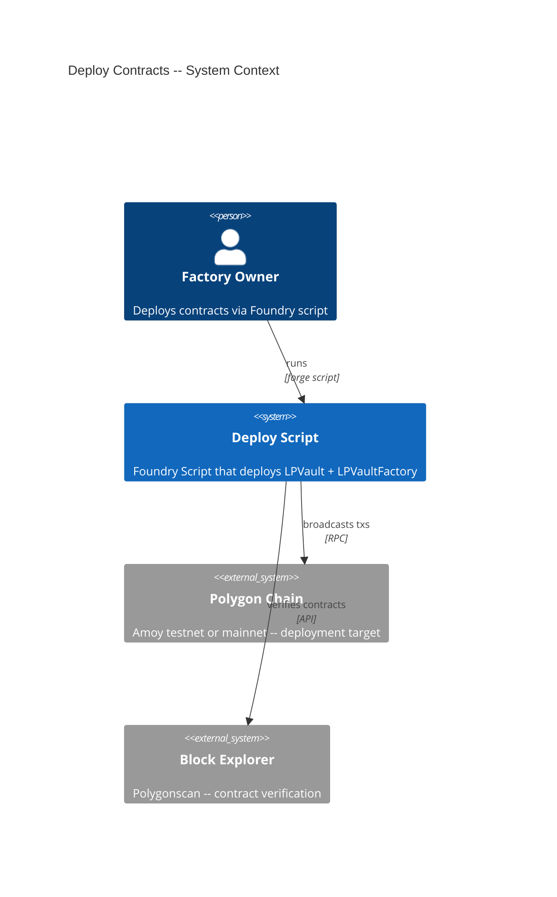
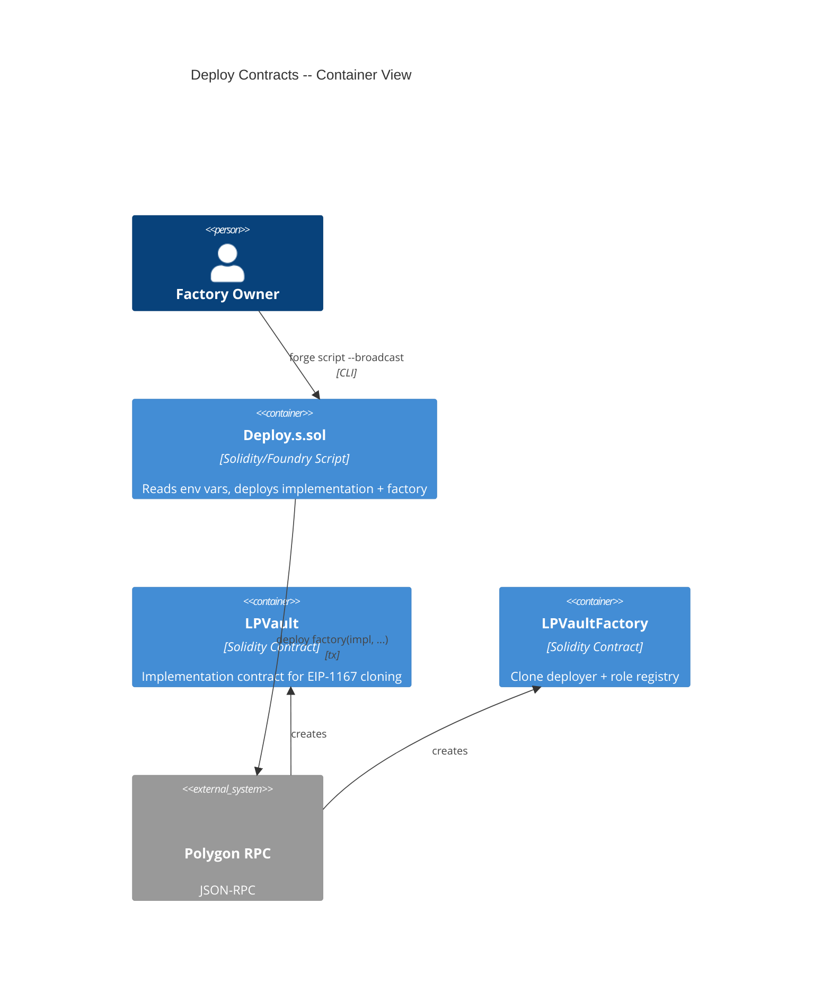

# Architecture: Deploy Contracts

## System Context (C4 L1)

> Who uses this feature and what external systems does it touch?

## Container View (C4 L2)

> Which major components are involved and how do they communicate?

## Data Model

> No new on-chain data model -- this feature orchestrates deployment of contracts defined in FEAT-REPZ.

## Component Inventory

> Files that participate in this feature.

| File | Role | Key Exports |
|------|------|-------------|
| `script/Deploy.s.sol` | deploy script | `DeployScript` (Foundry Script contract) |
| `src/LPVault.sol` | implementation contract | `LPVault` (deployed as implementation) |
| `src/LPVaultFactory.sol` | factory contract | `LPVaultFactory` (deployed with constructor args) |

## Event Topology

> No events emitted by the deploy script itself. Contract deployment events are inherent to the EVM.

**Non-events (explicit):**
- Deploy script: no domain events published (deployment is an infrastructure operation)

## API Surface

> No HTTP/API surface -- this feature is a CLI-driven Foundry script.

| Method | Path | Handler | Auth | Request Shape | Response Shape | Error Codes |
|--------|------|---------|------|---------------|----------------|-------------|
| CLI | `forge script script/Deploy.s.sol --rpc-url $RPC_URL --broadcast --account <name>` | `DeployScript.run()` | cast wallet (`--account`) or hardware wallet (`--ledger`/`--trezor`) | env vars: USDC_ADDRESS, EXCHANGE_ADDRESS, CONDITIONAL_TOKENS_ADDRESS, ADMIN_ADDRESS, ORACLE_ADDRESS, OPERATOR_ADDRESS | stdout: impl address, factory address | revert on zero address, revert on role separation |

## Integration Points

> External services, event streams, and infrastructure dependencies.

| System | Protocol | Direction | Purpose |
|--------|----------|-----------|---------|
| Polygon RPC | JSON-RPC (HTTP) | outbound | Broadcast deployment transactions |
| Polygonscan API | HTTP REST | outbound | Contract source verification (when --verify flag used) |

## Code Map

> Links spec IDs to implementation files.

| Spec ID | Spec Name | Implementation Files |
|---------|-----------|---------------------|
| UC-J92I | Deploy Factory and Implementation | `script/Deploy.s.sol:DeployScript.run()` |
| SC-J92J | Successful deployment with valid configuration | `script/Deploy.s.sol:run()` |
| SC-J92K | Missing environment variable | `script/Deploy.s.sol:run()` (validation logic) |
| SC-J92L | Oracle equals operator | `src/LPVaultFactory.sol:constructor()` (RoleSeparation revert) |
| SC-J92M | Deployment with contract verification | `script/Deploy.s.sol:run()` (--verify flag handled by Foundry) |
| SC-K49S | Script does not read raw private keys | `script/Deploy.s.sol:run()` |

## Architecture Decisions

**ADR-J92V:** Environment-variable-driven configuration
In the context of deploying to multiple networks (Amoy, mainnet), facing the need for different addresses per chain, we decided to read all external addresses and role wallets from environment variables to achieve a single script file that works across all target chains, accepting that the deployer must set env vars correctly before each run.
