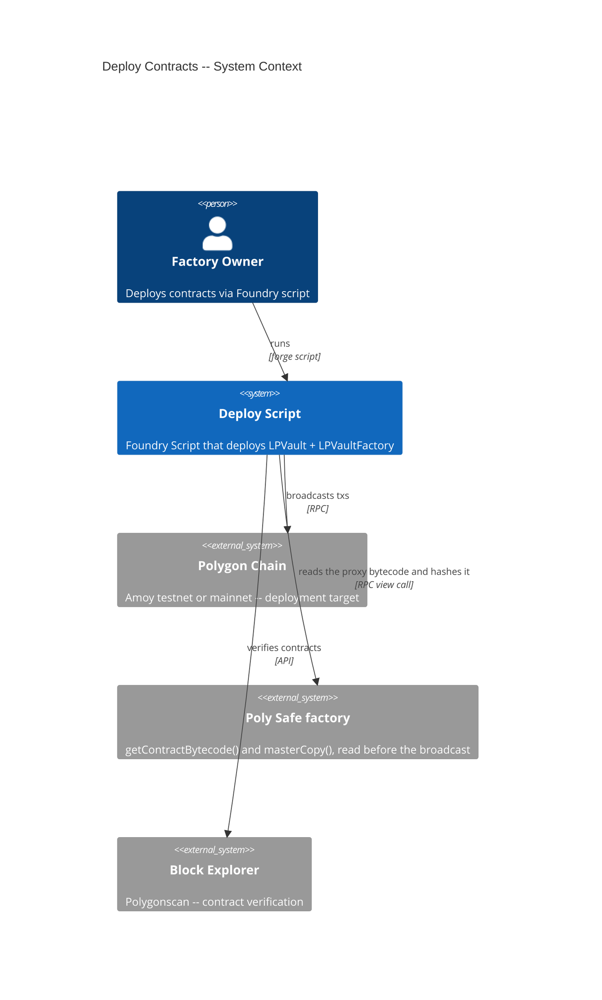
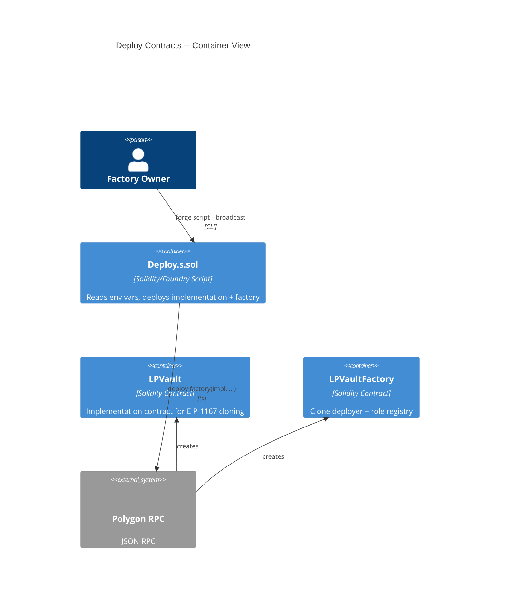

# Architecture: Deploy Contracts

## System Context (C4 L1)

> Who uses this feature and what external systems does it touch?

```mermaid
C4Context
    title Deploy Contracts -- System Context
    Person(owner, "Factory Owner", "Deploys contracts via Foundry script")
    System(script, "Deploy Script", "Foundry Script that deploys LPVault + LPVaultFactory")
    System_Ext(chain, "Polygon Chain", "Amoy testnet or mainnet -- deployment target")
    System_Ext(safefactory, "Poly Safe factory", "getContractBytecode() and masterCopy(), read before the broadcast")
    System_Ext(explorer, "Block Explorer", "Polygonscan -- contract verification")
    Rel(owner, script, "runs", "forge script")
    Rel(script, safefactory, "reads the proxy bytecode and hashes it", "RPC view call")
    Rel(script, chain, "broadcasts txs", "RPC")
    Rel(script, explorer, "verifies contracts", "API")
```

## Container View (C4 L2)

> Which major components are involved and how do they communicate?

```mermaid
C4Container
    title Deploy Contracts -- Container View
    Person(owner, "Factory Owner")
    Container(script, "Deploy.s.sol", "Solidity/Foundry Script", "Reads env vars, deploys implementation + factory")
    Container(impl, "LPVault", "Solidity Contract", "Implementation contract for EIP-1167 cloning")
    Container(factory, "LPVaultFactory", "Solidity Contract", "Clone deployer + role registry")
    System_Ext(chain, "Polygon RPC", "JSON-RPC", "Target chain")
    Rel(owner, script, "forge script --broadcast", "CLI")
    Rel(script, chain, "deploy impl", "tx")
    Rel(script, chain, "deploy factory(impl, ...)", "tx")
    Rel(chain, impl, "creates")
    Rel(chain, factory, "creates")
```

## Data Model

> No new on-chain data model -- this feature orchestrates deployment of contracts defined in FEAT-REPZ.

## Component Inventory

> Files that participate in this feature.

| File | Role | Key Exports |
|------|------|-------------|
| `script/Deploy.s.sol` | deploy script | `DeployScript` (Foundry Script contract), `run()`, `deploy()`, `readSafeProxyBytecodeHash()`, inline `IPolySafeFactory`, `ZeroAddress`, `ZeroBytecodeHash` |
| `.env.example` | deploy variable set | `SAFE_FACTORY_ADDRESS` with the Polygon and Amoy values |
| `src/LPVault.sol` | implementation contract | `LPVault` (deployed as implementation) |
| `src/LPVaultFactory.sol` | factory contract | `LPVaultFactory` (deployed with constructor args) |
| `foundry.toml` | build configuration | `[profile.default]` `optimizer`, `optimizer_runs` (ADR-9FOM, lowered to 100 by ADR-E94X) |

## Event Topology

> No events emitted by the deploy script itself. Contract deployment events are inherent to the EVM.

**Non-events (explicit):**
- Deploy script: no domain events published (deployment is an infrastructure operation)

## API Surface

> No HTTP/API surface -- this feature is a CLI-driven Foundry script.

| Method | Path | Handler | Auth | Request Shape | Response Shape | Error Codes |
|--------|------|---------|------|---------------|----------------|-------------|
| CLI | `forge script script/Deploy.s.sol --rpc-url $RPC_URL --broadcast --account <name>` | `DeployScript.run()` | cast wallet (`--account`) or hardware wallet (`--ledger`/`--trezor`) | env vars: USDC_ADDRESS, EXCHANGE_ADDRESS, CTF_ADDRESS, ADMIN_ADDRESS, ORACLE_ADDRESS, OPERATOR_ADDRESS, SAFE_FACTORY_ADDRESS | stdout: Safe factory, master copy, proxy bytecode hash, impl address, factory address | revert on zero address, revert on zero hash, revert on role separation |
| call | `DeployScript.readSafeProxyBytecodeHash(address)` | `readSafeProxyBytecodeHash` | public view | `safeFactory` | `bytes32` hash | none |

## Integration Points

> External services, event streams, and infrastructure dependencies.

| System | Protocol | Direction | Purpose |
|--------|----------|-----------|---------|
| Polygon RPC | JSON-RPC (HTTP) | outbound | Broadcast deployment transactions |
| Poly Safe factory | `getContractBytecode()`, `masterCopy()` view calls | outbound, during simulation | The proxy bytecode hash the LP vault factory needs |
| Polygonscan API | HTTP REST | outbound | Contract source verification (when --verify flag used) |

## Code Map

> Links spec IDs to implementation files.

| Spec ID | Spec Name | Implementation Files |
|---------|-----------|---------------------|
| UC-J92I | Deploy Factory and Implementation | `script/Deploy.s.sol:DeployScript.run()` |
| SC-J92J | Successful deployment with valid configuration | `script/Deploy.s.sol:run()` |
| SC-J92K | Missing environment variable | `script/Deploy.s.sol:run()` (validation logic) |
| SC-J92L | Oracle equals operator | `src/LPVaultFactory.sol:constructor()` (RoleSeparation revert) |
| SC-J92M | Deployment with contract verification | `script/Deploy.s.sol:run()` (--verify flag handled by Foundry) |
| SC-K49S | Script does not read raw private keys | `script/Deploy.s.sol:run()` |
| SC-9OY8 | The hash is read from the Safe factory on chain | `script/Deploy.s.sol:readSafeProxyBytecodeHash()`, `script/Deploy.s.sol:deploy()` (ZeroBytecodeHash) |

## Architecture Decisions

**ADR-J92V:** Environment-variable-driven configuration
In the context of deploying to multiple networks (Amoy, mainnet), facing the need for different addresses per chain, we decided to read all external addresses and role wallets from environment variables to achieve a single script file that works across all target chains, accepting that the deployer must set env vars correctly before each run.

**ADR-9FOM:** Compiler optimizer on at 200 runs, chosen for contract size
In the context of a vault 388 bytes under the EIP-170 limit with the audit fixes still to add, facing a deploy-time revert that `forge test` cannot catch, we decided to set `optimizer = true` and `optimizer_runs = 200` in `foundry.toml` to achieve 10,055 bytes of room on 2026-09-12 and 4,720 bytes on the escrow-branch stand-in (43fd027), accepting up to 1.5 percent more gas than the highest runs value and a deployed bytecode that differs from the audited build (d47b72d) and from the Amoy broadcast artifacts, which the auditors are told before the re-review. Rejected: `via_ir`, because 200 runs alone gives enough room and `via_ir` changes the code shape more for the auditors. Rejected: a size assertion in the deploy use case test, because `forge coverage` compiles with the optimizer off and the unoptimized vault exceeds the limit once R5 lands, so the assertion would fail in the coverage build. The size check is therefore a completion check rule in `CLAUDE.md`, not a test.

**ADR-E94X:** The compiler optimizer drops to 100 runs, to make room for the spread attribution
In the context of the spread attribution (FEAT-E943), which adds a growth accumulator, a per-tick slot, a per-position slot, and four credit sites to a vault that had 3,820 bytes of room, facing a prototype that left 903 bytes and so missed the build plan's working norm of 1,500, we decided to lower `optimizer_runs` from 200 to 100 in `foundry.toml`, to achieve more room under the EIP-170 limit than the design's own structural savings reach on their own, accepting more runtime gas on every call to every vault for the life of the contract and a third deployed bytecode that differs again from the audited build. The user chose this on 2026-09-15, having been shown the alternative of building at 200 runs with about 1,040 bytes of room and paying nothing permanent. This supersedes the rejection recorded in ADR-CYSE ("Rejected: `optimizer_runs` at 100 or 50, which recovers 75 to 80 bytes"): the rejection was correct when 1,800 bytes were available from moving modifier bodies, and there is no second saving of that size left. It amends ADR-9FOM's value and keeps its reasoning: the optimizer is on for size, not for gas, and the same two alternatives that record rejected, `via_ir` and a size assertion in a test, stay rejected for the same reasons. Because every gas bound in the spec tree was measured at 200 runs, this step re-measures each one it restates on the build this setting produces, and carries no figure forward from a 200-run measurement.

**ADR-CYSE:** Modifier bodies live in internal functions, for contract size
In the context of a vault at 23,102 bytes after the order-maker step (R12) with the redemption still to add, facing an R13 that adds about 1,420 bytes and a `via_ir` that the compiler optimizer decision (ADR-9FOM) rejected, we decided that `onlyOperator`, `onlyOracle`, `onlyAdmin`, and `nonReentrant` keep their names and their placement on every function and call `_checkOperator()`, `_checkOracle()`, `_checkAdmin()`, and `_nonReentrantBefore()` / `_nonReentrantAfter()`, whose bodies are the old modifier bodies unchanged (the OpenZeppelin `Ownable._checkOwner` and `ReentrancyGuard._nonReentrantBefore` shape), to achieve about 1,800 bytes of room at no behavior change, accepting about 50 gas more per guarded call and a code shape that differs from the audited build, which the auditors are told in the addendum as a shape change with no behavior change. The modifier stays the only gate, and no function calls a `_check*()` directly (CLAUDE.md checklist item 2). `onlyFactory`, `onlyConditionalTokens`, `initializer`, `whenNotPaused`, and `touchesHeartbeat` stay inline, because each has one or two uses or a one-line body. Rejected: `optimizer_runs` at 100 or 50, which recovers 75 to 80 bytes; making the four truncating ledger getters internal, which recovers 76 bytes and removes a monitoring view (FEAT-9BQZ FR-9BR6). The first of those rejections was reversed on 2026-09-15 by ADR-E94X, when the spread attribution left no other saving of that size. Measured on 2026-09-14 in the R13 exploration: 24,526 bytes with the redemption and the inline modifiers, 22,727 with the bodies moved. The user chose this on 2026-09-14. Measured on the R17 build (2026-09-14): `LPVault` at 20,756 bytes with 3,820 of room after the fee accounting left.
