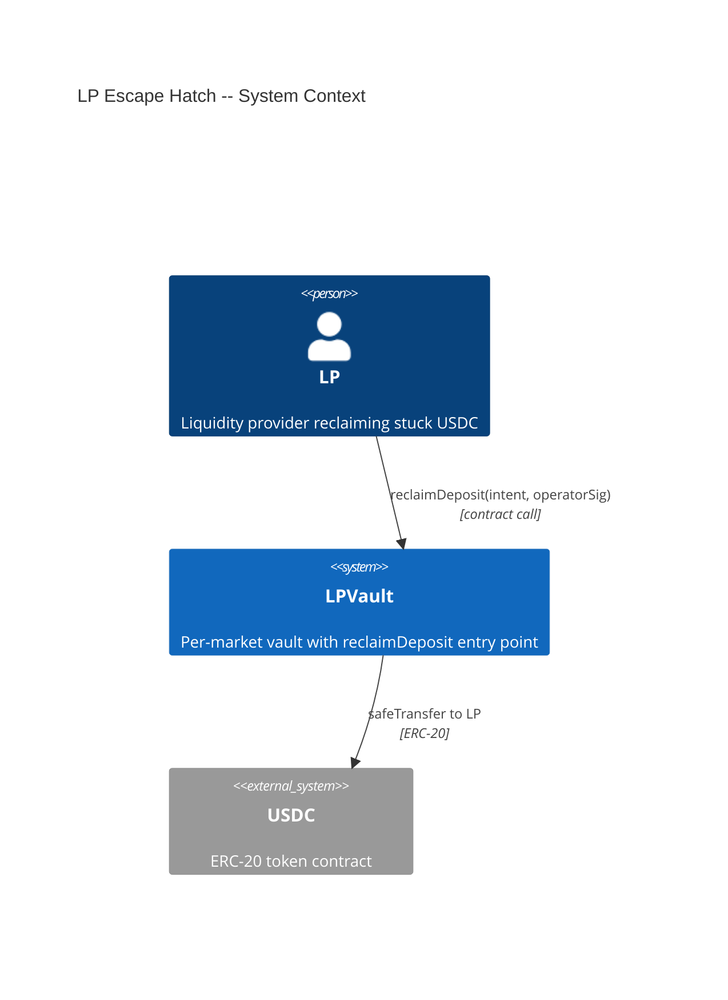
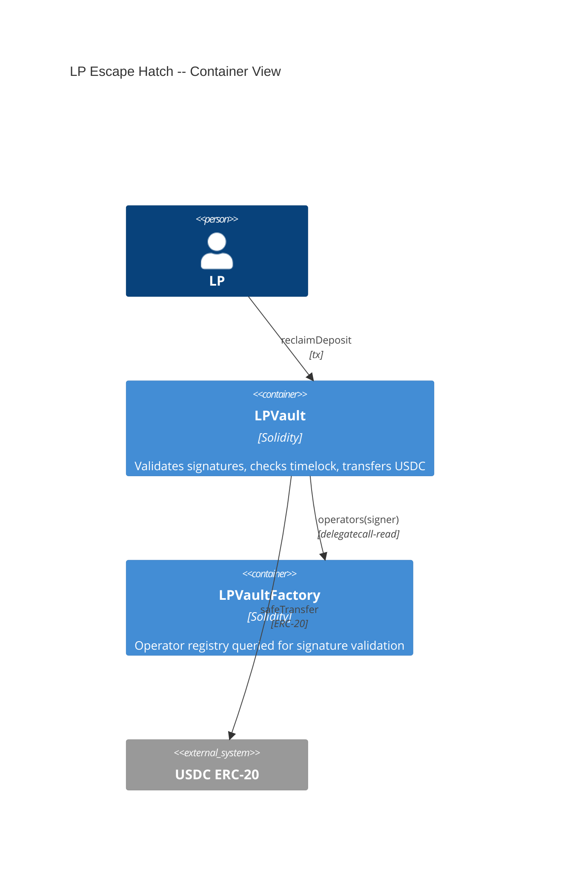
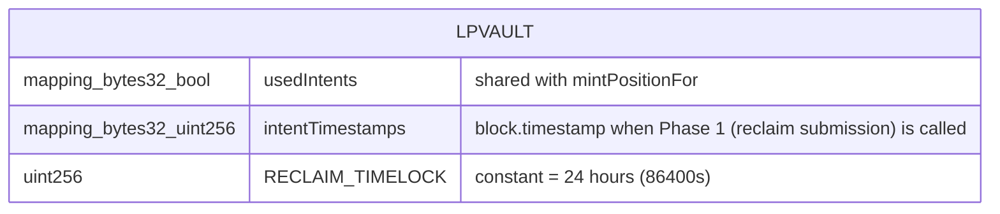

# Architecture: LP Escape Hatch

## System Context (C4 L1)

## Container View (C4 L2)

## Data Model

> Extends existing LPVault storage. No new entities — reuses `usedIntents` mapping and adds `intentTimestamps` for timelock tracking via the two-phase reclaimDeposit pattern (ADR-JB78).

**Invariants:**
- An intentId that is in `usedIntents` can never be reclaimed or fulfilled again
- `intentTimestamps[id]` is set exactly once (Phase 1) and never updated
- Phase 2 cannot execute until `block.timestamp - intentTimestamps[id] >= RECLAIM_TIMELOCK`

## Component Inventory

| File | Role | Key Exports |
|------|------|-------------|
| `src/LPVault.sol` | vault contract | `reclaimDeposit` (external, nonReentrant, two-phase), `_verifyOperatorSignature` (internal view), `RECLAIM_TIMELOCK` (constant), `intentTimestamps` (mapping) |

## Event Topology

| Event | Publisher | Payload | Condition | Consumers |
|-------|-----------|---------|-----------|-----------|
| `ReclaimSubmitted` | `LPVault.reclaimDeposit` | `intentId, lp, usdcAmount` | Phase 1: first call records timestamp | Off-chain indexer, LP UI |
| `DepositReclaimed` | `LPVault.reclaimDeposit` | `intentId, lp, usdcAmount` | Phase 2: successful reclaim after timelock | Off-chain indexer |

**Non-events (explicit):**
- SC-JAIM, SC-JAIN, SC-JAIO, SC-JAIP: no event emitted on revert

## API Surface

| Method | Path | Handler | Auth | Request Shape | Response Shape | Error Codes |
|--------|------|---------|------|---------------|----------------|-------------|
| contract-call | `reclaimDeposit(intent, operatorSig)` | `LPVault.reclaimDeposit` | LP (msg.sender must match intent signer) | MintIntent struct + operator EIP-712 signature | void (USDC transferred as side effect) | TimelockNotElapsed, IntentAlreadyUsed, InvalidSignature |

## Integration Points

| System | Protocol | Direction | Purpose |
|--------|----------|-----------|---------|
| LPVaultFactory | internal read | inbound | Query operator registry to validate operator signature |
| USDC ERC-20 | ERC-20 transfer | outbound | Return USDC to LP |

## Code Map

| Spec ID | Spec Name | Implementation Files |
|---------|-----------|---------------------|
| UC-JAIK | Reclaim Deposit | `src/LPVault.sol:reclaimDeposit()` |
| SC-JAIL | Successful reclaim after timelock | `src/LPVault.sol:reclaimDeposit()` |
| SC-JAIM | Revert before timelock elapses | `src/LPVault.sol:reclaimDeposit()` (timelock check) |
| SC-JAIN | Revert when intent already fulfilled | `src/LPVault.sol:reclaimDeposit()` (usedIntents check) |
| SC-JAIO | Revert on invalid operator signature | `src/LPVault.sol:reclaimDeposit()`, `_verifyOperatorSignature()` |
| SC-JAIP | Revert on replay | `src/LPVault.sol:reclaimDeposit()` (usedIntents check) |

## Architecture Decisions

**ADR-JAIY:** Shared usedIntents mapping for both mint and reclaim
In the context of replay protection for reclaimDeposit, facing the choice between a separate mapping and reusing `usedIntents`, we decided to reuse the existing `usedIntents` mapping to achieve mutual exclusion between mintPositionFor and reclaimDeposit on the same intentId, accepting that the two paths share a single namespace and cannot be distinguished by mapping key alone.

**ADR-JB78:** Two-phase reclaimDeposit for timelock enforcement
In the context of the RECLAIM_TIMELOCK requirement where no on-chain deposit timestamp exists, facing the choice between adding a separate deposit-recording function, embedding timestamps in signatures, or using a two-phase pattern within reclaimDeposit, we decided on a two-phase reclaimDeposit (Phase 1 records `intentTimestamps[intentId] = block.timestamp`; Phase 2 checks timelock and executes refund) to achieve self-contained timelock enforcement scoped entirely to FEAT-JAIJ, accepting that the LP must call the function twice with a RECLAIM_TIMELOCK wait in between.
