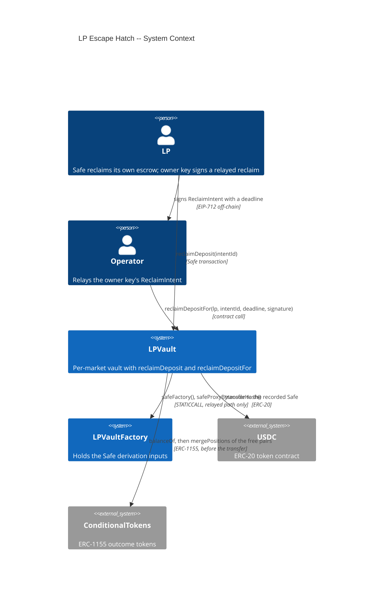
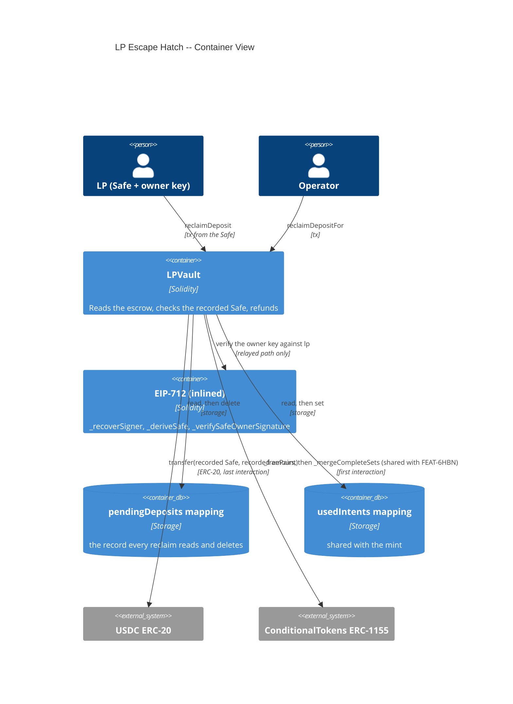
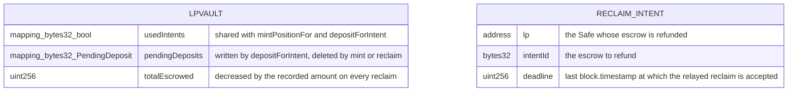

# Architecture: LP Escape Hatch

## System Context (C4 L1)

```mermaid
C4Context
    title LP Escape Hatch -- System Context
    Person(lp, "LP", "Safe reclaims its own escrow; owner key signs a relayed reclaim")
    Person(operator, "Operator", "Relays the owner key's ReclaimIntent")
    System(vault, "LPVault", "Per-market vault with reclaimDeposit and reclaimDepositFor")
    System(factory, "LPVaultFactory", "Holds the Safe derivation inputs")
    System_Ext(usdc, "USDC", "ERC-20 token contract")
    System_Ext(ctf, "ConditionalTokens", "ERC-1155 outcome tokens")
    Rel(lp, vault, "reclaimDeposit(intentId)", "Safe transaction")
    Rel(lp, operator, "signs ReclaimIntent with a deadline", "EIP-712 off-chain")
    Rel(operator, vault, "reclaimDepositFor(lp, intentId, deadline, signature)", "contract call")
    Rel(vault, factory, "safeFactory(), safeProxyBytecodeHash()", "STATICCALL, relayed path only")
    Rel(vault, ctf, "balanceOf, then mergePositions of the free pairs", "ERC-1155, before the transfer")
    Rel(vault, usdc, "transfer to the recorded Safe", "ERC-20")
```

## Container View (C4 L2)

```mermaid
C4Container
    title LP Escape Hatch -- Container View
    Person(lp, "LP (Safe + owner key)")
    Person(operator, "Operator")
    Container(vault, "LPVault", "Solidity", "Reads the escrow, checks the recorded Safe, refunds")
    Container(eip712, "EIP-712 (inlined)", "Solidity", "_recoverSigner, _deriveSafe, _verifySafeOwnerSignature")
    ContainerDb(escrow, "pendingDeposits mapping", "Storage", "the record every reclaim reads and deletes")
    ContainerDb(intents, "usedIntents mapping", "Storage", "shared with the mint")
    System_Ext(usdc, "USDC ERC-20")
    System_Ext(ctf, "ConditionalTokens ERC-1155")
    Rel(lp, vault, "reclaimDeposit", "tx from the Safe")
    Rel(operator, vault, "reclaimDepositFor", "tx")
    Rel(vault, eip712, "verify the owner key against lp", "relayed path only")
    Rel(vault, escrow, "read, then delete", "storage")
    Rel(vault, intents, "read, then set", "storage")
    Rel(vault, ctf, "_freePairs, then _mergeCompleteSets (shared with FEAT-6HBN)", "first interaction")
    Rel(vault, usdc, "transfer(recorded Safe, recorded amount)", "ERC-20, last interaction")
```

## Data Model

> Reads and deletes the escrow record that FEAT-3ZRI writes. Adds no storage. `intentTimestamps` and `RECLAIM_TIMELOCK` no longer exist.

```mermaid
erDiagram
    LPVAULT {
        mapping_bytes32_bool usedIntents "shared with mintPositionFor and depositForIntent"
        mapping_bytes32_PendingDeposit pendingDeposits "written by depositForIntent, deleted by mint or reclaim"
        uint256 totalEscrowed "decreased by the recorded amount on every reclaim"
    }
    RECLAIM_INTENT {
        address lp "the Safe whose escrow is refunded"
        bytes32 intentId "the escrow to refund"
        uint256 deadline "last block.timestamp at which the relayed reclaim is accepted"
    }
```

**Invariants:**
- An intentId that is in `usedIntents` can never be reclaimed or minted again
- A reclaim pays exactly `pendingDeposits[intentId].amount` to exactly `pendingDeposits[intentId].lp`, and never a caller-supplied value
- After a reclaim, `pendingDeposits[intentId].lp == address(0)` and `totalEscrowed` fell by the refunded amount
- Neither reclaim path reads `phase`, `paused`, or the Operator registry
- A reclaim merges only the free pairs (FEAT-6HBN ADR-DFE2), before the transfer, and pays the recorded amount whatever the merge produced (ADR-DU2V)

## Component Inventory

| File | Role | Key Exports |
|------|------|-------------|
| `src/LPVault.sol` | vault contract | `reclaimDeposit(bytes32)` (external, nonReentrant), `reclaimDepositFor(address,bytes32,uint256,bytes)` (external, onlyOperator, nonReentrant, touchesHeartbeat), `_refundEscrow()` (internal), `RECLAIM_INTENT_TYPEHASH`, `_verifySafeOwnerSignature()` (shared with FEAT-3ZRI), `_tokenBalances()`, `_freePairs()`, `_mergeCompleteSets()` (shared with FEAT-6HBN), `DepositReclaimed` (event) |
| `test/fixtures/LPVaultFixture.sol` | Test fixture | `_signReclaimIntent()`, `_escrow()` |
| `test/fixtures/ConditionalTokensFixture.sol` | Test fixture | `_giveOutcomeTokens()`, the free pairs of SC-DU2T |
| `test/features/FEAT-JAIJ-lp-escape-hatch/UC-JAIK-reclaim-deposit.t.sol` | Integration tests for the direct reclaim | SC-JAIL, SC-3Z9L, SC-45IG, SC-JAIN, SC-3ZA0, SC-JAIP, SC-9OYE, SC-DU2T, the NFR-JAIW reentrancy test |
| `test/features/FEAT-JAIJ-lp-escape-hatch/UC-3Z93-operator-reclaim-deposit-for-lp.t.sol` | Integration tests for the relayed reclaim | SC-3Z9D, SC-3Z9F, SC-45IH, SC-3Z9G, SC-3Z9H, SC-3Z9I, SC-9OYF, SC-9OYG, SC-9OYH |

## Event Topology

| Event | Publisher | Payload | Condition | Consumers |
|-------|-----------|---------|-----------|-----------|
| `DepositReclaimed(bytes32 indexed intentId, address indexed lp, uint256 usdcAmount)` | `LPVault.reclaimDeposit`, `LPVault.reclaimDepositFor` | `intentId, lp, usdcAmount` -- the recorded Safe and the recorded amount | On every successful reclaim, on either path | Off-chain indexer, LP UI |
| `CompleteSetsMerged(address indexed caller, uint256 amount)` (FEAT-6HBN) | `LPVault._mergeCompleteSets`, inside `_refundEscrow` | `caller, amount` -- the reclaim's caller and the free pairs merged | On a reclaim that finds free pairs, before `DepositReclaimed` | Off-chain event listener |

**Non-events (explicit):**
- Every revert scenario: no event emitted
- `ReclaimSubmitted` no longer exists: there is no phase 1

## API Surface

| Method | Path | Handler | Auth | Request Shape | Response Shape | Error Codes |
|--------|------|---------|------|---------------|----------------|-------------|
| call | `LPVault.reclaimDeposit(bytes32)` | `reclaimDeposit` | the recorded Safe (`msg.sender == pendingDeposits[intentId].lp`) + nonReentrant | `intentId` | void (USDC transferred as side effect) | IntentAlreadyUsed, DepositNotEscrowed, NotIntentOwner, TransferFailed, Reentrancy |
| call | `LPVault.reclaimDepositFor(address,bytes32,uint256,bytes)` | `reclaimDepositFor` | onlyOperator + nonReentrant + touchesHeartbeat; owner-key signature checked against `lp` | `lp, intentId, deadline, signature` | void (USDC transferred to `lp`) | NotOperator, IntentExpired, InvalidSignature, IntentAlreadyUsed, DepositNotEscrowed, NotIntentOwner, TransferFailed, Reentrancy |

## Integration Points

| System | Protocol | Direction | Purpose |
|--------|----------|-----------|---------|
| USDC ERC-20 | ERC-20 transfer | outbound | Return the recorded amount to the recorded Safe |
| ConditionalTokens (Gnosis CTF) | `balanceOf`, `mergePositions` | outbound | Merge the vault's free pairs into USDC before the transfer, so a reclaim never waits on a keeper (FR-DU2U) |
| LPVaultFactory | STATICCALL | inbound read | `operators(msg.sender)` for `onlyOperator`, and the Safe derivation inputs, on the relayed path only |

## Code Map

| Spec ID | Spec Name | Implementation Files |
|---------|-----------|---------------------|
| UC-JAIK | Reclaim Deposit | `src/LPVault.sol:reclaimDeposit()`, `src/LPVault.sol:_refundEscrow()`, `src/LPVault.sol:_freePairs()`, `src/LPVault.sol:_mergeCompleteSets()` |
| SC-JAIL | Successful reclaim in one call | `src/LPVault.sol:reclaimDeposit()`, `src/LPVault.sol:_refundEscrow()` |
| SC-DU2T | Reclaim merges the vault's free pairs before it pays | `src/LPVault.sol:_refundEscrow()`, `src/LPVault.sol:_freePairs()`, `src/LPVault.sol:_mergeCompleteSets()` |
| SC-3Z9L | Revert when nothing is escrowed for the intent | `src/LPVault.sol:reclaimDeposit()` (escrow read) |
| SC-45IG | Revert when the caller is not the recorded Safe | `src/LPVault.sol:reclaimDeposit()` (recorded Safe check) |
| SC-JAIN | Revert when intent already fulfilled | `src/LPVault.sol:reclaimDeposit()` (usedIntents check) |
| SC-3ZA0 | Reclaim succeeds with no registered operators | `src/LPVault.sol:reclaimDeposit()` |
| SC-JAIP | Revert on replay | `src/LPVault.sol:reclaimDeposit()` (usedIntents check) |
| SC-9OYE | Reclaim works in every phase and while paused | `src/LPVault.sol:reclaimDeposit()` (no phase or pause check) |
| UC-3Z93 | Operator Reclaim Deposit for LP | `src/LPVault.sol:reclaimDepositFor()`, `src/LPVault.sol:_refundEscrow()` |
| SC-3Z9D | Refund in one call | `src/LPVault.sol:reclaimDepositFor()`, `src/LPVault.sol:_verifySafeOwnerSignature()`, `src/LPVault.sol:_refundEscrow()` |
| SC-3Z9F | Revert when nothing is escrowed for the intent | `src/LPVault.sol:reclaimDepositFor()` (escrow read) |
| SC-45IH | Revert when the escrow belongs to a different Safe | `src/LPVault.sol:reclaimDepositFor()` (recorded Safe check) |
| SC-3Z9G | Revert when a mint authorization is replayed as a reclaim | `src/LPVault.sol:reclaimDepositFor()`, `src/LPVault.sol:RECLAIM_INTENT_TYPEHASH` |
| SC-3Z9H | Revert on non-operator caller | `src/LPVault.sol:reclaimDepositFor()`, `src/LPVault.sol:onlyOperator` |
| SC-3Z9I | Revert when the intent has already been used | `src/LPVault.sol:reclaimDepositFor()` (usedIntents check) |
| SC-9OYF | Revert after the deadline | `src/LPVault.sol:reclaimDepositFor()` (deadline guard) |
| SC-9OYG | Revert when the owner key derives a different Safe | `src/LPVault.sol:reclaimDepositFor()`, `src/LPVault.sol:_verifySafeOwnerSignature()`, `src/LPVault.sol:_deriveSafe()` |
| SC-9OYH | Works while paused, in WindDown, and after the freeze | `src/LPVault.sol:reclaimDepositFor()` (no phase or pause check) |

## Architecture Decisions

**ADR-JAIY:** Shared usedIntents mapping for both mint and reclaim
In the context of replay protection for reclaimDeposit, facing the choice between a separate mapping and reusing `usedIntents`, we decided to reuse the existing `usedIntents` mapping to achieve mutual exclusion between mintPositionFor and reclaimDeposit on the same intentId, accepting that the two paths share a single namespace and cannot be distinguished by mapping key alone.

**ADR-JB78:** Two-phase reclaimDeposit for timelock enforcement
In the context of the RECLAIM_TIMELOCK requirement where no on-chain deposit timestamp exists, facing the choice between adding a separate deposit-recording function, embedding timestamps in signatures, or using a two-phase pattern within reclaimDeposit, we decided on a two-phase reclaimDeposit (Phase 1 records `intentTimestamps[intentId] = block.timestamp`; Phase 2 checks timelock and executes refund) to achieve self-contained timelock enforcement scoped entirely to FEAT-JAIJ, accepting that the LP must call the function twice with a RECLAIM_TIMELOCK wait in between.

Superseded on 2026-09-11 by the one-call reclaim decision (ADR-9OYQ, decision C1 in `audits/audit-fixes-ranged.md`). The timelock existed because the vault had no deposit record; the escrow is that record.

**ADR-3ZA1:** Reclaim requires no Operator signature and no live Operator
In the context of authorizing a refund, facing the original design in which `reclaimDeposit` re-validated a registered Operator's co-signature at execution time, we decided to drop the operator signature entirely and source both the authorization (`msg.sender == pendingDeposits[intentId].lp`) and the amount (`pendingDeposits[intentId].amount`) from state already proven on-chain, to achieve an escape hatch that works precisely when the Operator does not, accepting that the vault no longer has an on-chain attestation that the Operator acknowledged the deposit -- which it no longer needs, because the Operator had to execute `depositForIntent` for any escrow to exist at all. The front-running chokepoint this project's policy protects already fired, once, at deposit time; nothing new enters the system at reclaim. This also removes the failure mode where an Admin removing an operator invalidated a co-signature an LP had already collected, stranding their deposit (audit issue 6.13).

**ADR-4029:** Distinct ReclaimIntent typehash for the operator-relayed path
In the context of `reclaimDepositFor` accepting an owner-key signature relayed by the Operator, facing the choice between reusing the MintIntent typehash and defining a separate ReclaimIntent struct, we decided to define a distinct typehash to achieve domain separation between authorizing a deposit and authorizing its cancellation, accepting one more typehash constant and one more off-chain signing flow. Reusing MintIntent would mean the signature an LP produces to fund a position doubles as authorization to cancel it, letting an Operator holding that one signature unilaterally reverse the LP's intent. The same reasoning applies to the later `burnPositionFor` and `collectFor` authorizations. The struct is `ReclaimIntent(address lp,bytes32 intentId,uint256 deadline)`: the refund comes from the record, so the range and the amount would be unchecked decoration.

**ADR-9OYQ:** One-call reclaim, because the escrow record proves the deposit
In the context of an escrow that records the Safe, the amount, and the intent hash at deposit time, facing the two-phase 24-hour reclaim (ADR-JB78) that existed only because the vault once had no deposit record, we decided that `reclaimDeposit(intentId)` refunds the recorded amount to the recorded Safe in one call, with no Operator signature, no timelock, no phase check, and no pause check, and that `reclaimDepositFor` relays the same refund from the owner key's `ReclaimIntent`, to achieve an escape hatch that works exactly when the Operator does not and that never locks a pending deposit in any phase, accepting that an LP can withdraw an escrow at any moment before the mint, so the Operator must mint promptly or lose the deposit. The user decided this on 2026-09-11. The mint and the reclaim keep sharing `usedIntents` (ADR-JAIY), so exactly one of them can happen.

**ADR-DU2V:** The refund merges the free pairs first, because escrow seniority binds burns and collects and not fills
In the context of a vault whose USDC is one balance under the exchange's unlimited allowance (FEAT-REPZ FR-REQO), facing finding CV-06 of `audits/code-validation-round-1.md` (a fill can spend escrowed USDC, so a reclaim of 600 against a balance of 200 reverts `TransferFailed` until a keeper merges, redeems, or sells), we decided that `_refundEscrow` reads both token balances and the free pairs before its effects and merges them as its first interaction, before the USDC transfer, through the same `_freePairs` and `_mergeCompleteSets` every payout uses (FEAT-6HBN ADR-DFE2), to achieve a reclaim that never waits on a keeper, accepting two balance reads and, when free pairs exist, one merge call per reclaim, and accepting that seniority (decision C7) stays an accounting rule against burns and collects (`_availableUsdc`) and never a bound on fills, which the keeper enforces off-chain by quoting below the balance minus `totalEscrowed`. Rejected: a balance check that reverts the fill, because the vault is not the exchange's caller and never sees a fill; a cap on the exchange allowance, because it would need a refresh on every deposit and reclaim; a reclaim that pays the balance and keeps the rest owed, because a partial escrow is a claim the ledger does not carry. The user decided this on 2026-09-14 (audit-fix step R15).

## Testing Decisions

| Service/Pattern | Decision | Reason |
|-----------------|----------|--------|
| USDC (ERC-20) | e2e | The shared `MockERC20`; a `ReentrantERC20` in the UC-JAIK test file drives the NFR-JAIW reentrancy scenario |
| EIP-712 signatures | e2e | Foundry's `vm.sign()` generates real ECDSA signatures; sign both MintIntent and ReclaimIntent structs to prove the typehashes are not interchangeable |
| Safe derivation | fixture | Made-up factory constants in `LPVaultFixture`; the Safe is `_safeOf(LP_PK)` and calls `reclaimDeposit` under `vm.prank` |
| Deadline | injection | `vm.warp` sets `block.timestamp` on either side of the deadline |
| Operator-registry independence | e2e | Remove every operator via the Admin path, then drive `reclaimDeposit` to completion (SC-3ZA0) |
| Phase and pause | e2e | `pauseTrading`, `startWindDown`, and `emergencyCancelAll` after a `vm.warp` past the silence timelock set the three states (SC-9OYE, SC-9OYH) |
| The fill that spends escrowed USDC | e2e | `vm.prank(exchange)` spends the vault's USDC through the standing allowance `initialize` granted, and `_giveOutcomeTokens` gives the vault its free pairs through the real ConditionalTokens bytecode (SC-DU2T) |
