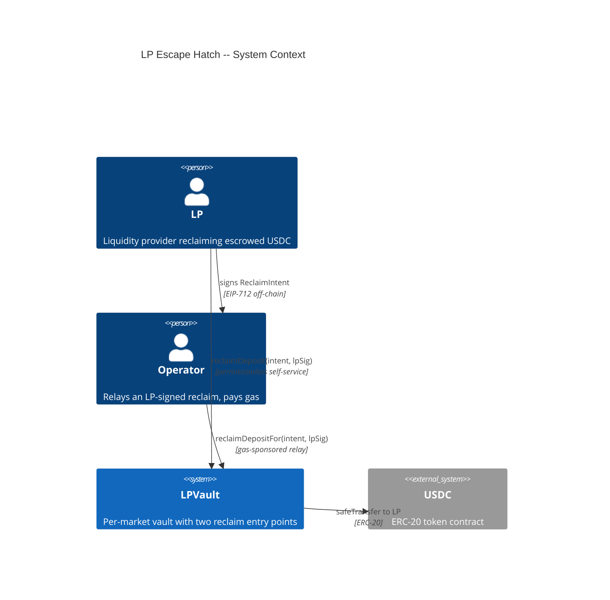
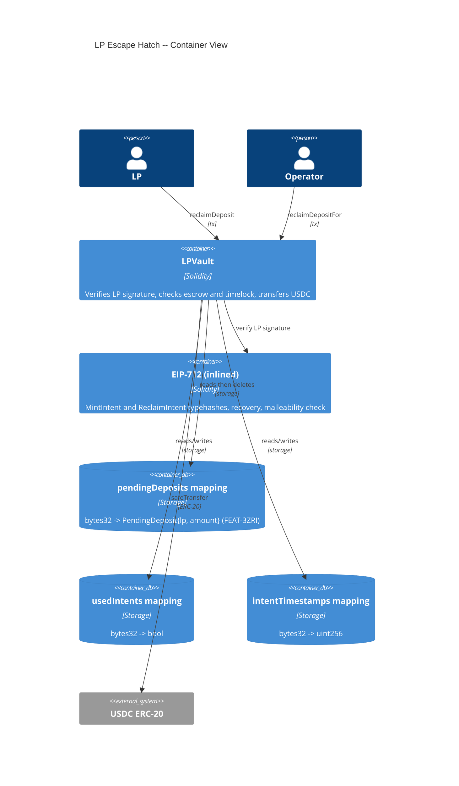
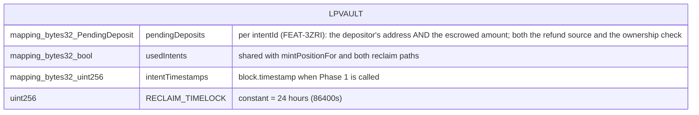

# Architecture: LP Escape Hatch

## System Context (C4 L1)

```mermaid
C4Context
    title LP Escape Hatch -- System Context
    Person(lp, "LP", "Liquidity provider reclaiming escrowed USDC")
    Person(operator, "Operator", "Relays an LP-signed reclaim, pays gas")
    System(vault, "LPVault", "Per-market vault with two reclaim entry points")
    System_Ext(usdc, "USDC", "ERC-20 token contract")
    Rel(lp, vault, "reclaimDeposit(intent, lpSig)", "permissionless self-service")
    Rel(lp, operator, "signs ReclaimIntent", "EIP-712 off-chain")
    Rel(operator, vault, "reclaimDepositFor(intent, lpSig)", "gas-sponsored relay")
    Rel(vault, usdc, "safeTransfer to LP", "ERC-20")
```

## Container View (C4 L2)

```mermaid
C4Container
    title LP Escape Hatch -- Container View
    Person(lp, "LP")
    Person(operator, "Operator")
    Container(vault, "LPVault", "Solidity", "Verifies LP signature, checks escrow and timelock, transfers USDC")
    Container(eip712, "EIP-712 (inlined)", "Solidity", "MintIntent and ReclaimIntent typehashes, recovery, malleability check")
    ContainerDb(escrow_db, "pendingDeposits mapping", "Storage", "bytes32 -> PendingDeposit{lp, amount} (FEAT-3ZRI)")
    ContainerDb(intents, "usedIntents mapping", "Storage", "bytes32 -> bool")
    ContainerDb(timestamps, "intentTimestamps mapping", "Storage", "bytes32 -> uint256")
    System_Ext(usdc, "USDC ERC-20")
    Rel(lp, vault, "reclaimDeposit", "tx")
    Rel(operator, vault, "reclaimDepositFor", "tx")
    Rel(vault, eip712, "verify LP signature")
    Rel(vault, escrow_db, "reads then deletes", "storage")
    Rel(vault, intents, "reads/writes", "storage")
    Rel(vault, timestamps, "reads/writes", "storage")
    Rel(vault, usdc, "safeTransfer", "ERC-20")
```

> `reclaimDeposit` deliberately has no edge to the operator registry. That absence is the feature: an escape hatch that consulted Operator state would fail exactly when it is needed.

## Data Model

> Extends existing LPVault storage. The refund amount is sourced from FEAT-3ZRI's `pendingDeposits`; `intentTimestamps` carries the two-phase timelock (ADR-JB78).

```mermaid
erDiagram
    LPVAULT {
        mapping_bytes32_PendingDeposit pendingDeposits "per intentId (FEAT-3ZRI): the depositor's address AND the escrowed amount; both the refund source and the ownership check"
        mapping_bytes32_bool usedIntents "shared with mintPositionFor and both reclaim paths"
        mapping_bytes32_uint256 intentTimestamps "block.timestamp when Phase 1 is called"
        uint256 RECLAIM_TIMELOCK "constant = 24 hours (86400s)"
    }
```

**Invariants:**
- An intentId in `usedIntents` can never be reclaimed or fulfilled again, through either entry point
- The refund equals `pendingDeposits[intentId].amount` exactly, never the caller-supplied `usdcAmount`
- **The refund goes only to `pendingDeposits[intentId].lp`, and only that address can initiate it, through either entry point.** A valid EIP-712 signature over an intentId does not establish a claim on it (FEAT-3ZRI ADR-45IC): anyone can sign over any intentId, so without this check `reclaimDeposit` — permissionless by design — becomes an unprivileged drain of any pending deposit
- A reclaim deletes `pendingDeposits[intentId]`, so mint and reclaim are mutually exclusive on the same escrow
- `intentTimestamps[id]` is set exactly once (Phase 1) and never updated; both entry points share the same slot, so a Phase 1 from either path starts the one clock
- Phase 2 cannot execute until `block.timestamp - intentTimestamps[id] >= RECLAIM_TIMELOCK`
- `reclaimDeposit` reads no Operator registry state and requires no Operator signature

## Component Inventory

| File | Role | Key Exports |
|------|------|-------------|
| `src/LPVault.sol` | vault contract | `reclaimDeposit` (external, nonReentrant, two-phase, permissionless), `reclaimDepositFor` (external, onlyOperator, nonReentrant, touchesHeartbeat, two-phase), `_verifyReclaimIntent` (internal view), `RECLAIM_INTENT_TYPEHASH` (constant), `RECLAIM_TIMELOCK` (constant), `intentTimestamps` (mapping) |
| `test/features/FEAT-JAIJ-lp-escape-hatch/UC-JAIK-reclaim-deposit.t.sol` | Integration tests for the permissionless path | SC-JAIL, SC-3Z9L, SC-45IG, SC-JAIM, SC-JAIN, SC-3ZA0, SC-JAIP |
| `test/features/FEAT-JAIJ-lp-escape-hatch/UC-3Z93-operator-reclaim-deposit-for-lp.t.sol` | Integration tests for the operator-relayed path | SC-3Z9C through SC-3Z9I |

## Event Topology

| Event | Publisher | Payload | Condition | Consumers |
|-------|-----------|---------|-----------|-----------|
| `ReclaimSubmitted` | `LPVault.reclaimDeposit`, `LPVault.reclaimDepositFor` | `intentId, lp, usdcAmount` | Phase 1: first call records the timestamp | Off-chain indexer, LP UI |
| `DepositReclaimed` | `LPVault.reclaimDeposit`, `LPVault.reclaimDepositFor` | `intentId, lp, usdcAmount` | Phase 2: successful reclaim after timelock | Off-chain indexer |

**Non-events (explicit):**
- SC-3Z9L, SC-45IG, SC-JAIM, SC-JAIN, SC-JAIP, SC-3Z9E, SC-3Z9F, SC-45IH, SC-3Z9G, SC-3Z9H, SC-3Z9I: no event emitted on revert
- No `PositionMinted` is ever emitted by this feature

## API Surface

| Method | Path | Handler | Auth | Request Shape | Response Shape | Error Codes |
|--------|------|---------|------|---------------|----------------|-------------|
| contract-call | `reclaimDeposit(address,int24,int24,uint256,bytes32,bytes)` | `LPVault.reclaimDeposit` | LP only (`msg.sender == lp`) + nonReentrant; no Operator involvement | MintIntent fields + LP EIP-712 signature | void (USDC transferred as side effect) | NotIntentOwner, NothingToReclaim, TimelockNotElapsed, IntentAlreadyUsed, InvalidSignature |
| contract-call | `reclaimDepositFor(address,int24,int24,uint256,bytes32,bytes)` | `LPVault.reclaimDepositFor` | onlyOperator + nonReentrant + touchesHeartbeat | ReclaimIntent fields + LP EIP-712 signature over the ReclaimIntent typehash | void (USDC transferred to the LP) | NotOperator, NotIntentOwner, NothingToReclaim, TimelockNotElapsed, IntentAlreadyUsed, InvalidSignature |

## Integration Points

| System | Protocol | Direction | Purpose |
|--------|----------|-----------|---------|
| FEAT-3ZRI escrow (`pendingDeposits`) | internal storage read + delete | inbound | Supplies the refund amount and proves the deposit exists |
| USDC ERC-20 | ERC-20 transfer | outbound | Returns escrowed USDC to the LP |

## Code Map

| Spec ID | Spec Name | Implementation Files |
|---------|-----------|---------------------|
| UC-JAIK | Reclaim Deposit | `src/LPVault.sol:reclaimDeposit()` |
| SC-JAIL | Successful reclaim after timelock | `src/LPVault.sol:reclaimDeposit()` |
| SC-3Z9L | Revert when nothing is escrowed | `src/LPVault.sol:reclaimDeposit()` (pendingDeposits check) |
| SC-JAIM | Revert before timelock elapses | `src/LPVault.sol:reclaimDeposit()` (timelock check) |
| SC-JAIN | Revert when intent already fulfilled | `src/LPVault.sol:reclaimDeposit()` (usedIntents check) |
| SC-3ZA0 | Reclaim succeeds with no registered operators | `src/LPVault.sol:reclaimDeposit()` |
| SC-JAIP | Revert on replay | `src/LPVault.sol:reclaimDeposit()` (usedIntents check) |
| SC-45IG | Revert when the escrow belongs to a different LP | `src/LPVault.sol:reclaimDeposit()` (escrow owner check) |
| UC-3Z93 | Operator Reclaim Deposit for LP | `src/LPVault.sol:reclaimDepositFor()` |
| SC-3Z9C | Phase 1 records the reclaim submission | `src/LPVault.sol:reclaimDepositFor()`, `intentTimestamps` |
| SC-3Z9D | Phase 2 refunds the LP after the timelock | `src/LPVault.sol:reclaimDepositFor()`, `src/LPVault.sol:_safeTransfer()` |
| SC-3Z9E | Revert before the timelock elapses | `src/LPVault.sol:reclaimDepositFor()` (timelock check) |
| SC-3Z9F | Revert when nothing is escrowed | `src/LPVault.sol:reclaimDepositFor()` (pendingDeposits check) |
| SC-3Z9G | Revert when a mint authorization is replayed as a reclaim | `src/LPVault.sol:_verifyReclaimIntent()`, `RECLAIM_INTENT_TYPEHASH` |
| SC-3Z9H | Revert on non-operator caller | `src/LPVault.sol:reclaimDepositFor()`, `src/LPVault.sol:onlyOperator` |
| SC-3Z9I | Revert when the intent has already been used | `src/LPVault.sol:reclaimDepositFor()` (usedIntents check) |
| SC-45IH | Revert when the escrow belongs to a different LP | `src/LPVault.sol:reclaimDepositFor()` (escrow owner check) |

## Architecture Decisions

**ADR-JAIY:** Shared usedIntents mapping for both mint and reclaim
In the context of replay protection for reclaimDeposit, facing the choice between a separate mapping and reusing `usedIntents`, we decided to reuse the existing `usedIntents` mapping to achieve mutual exclusion between mintPositionFor and reclaimDeposit on the same intentId, accepting that the two paths share a single namespace and cannot be distinguished by mapping key alone.

**ADR-JB78:** Two-phase reclaimDeposit for timelock enforcement
In the context of the RECLAIM_TIMELOCK requirement where no on-chain deposit timestamp exists, facing the choice between adding a separate deposit-recording function, embedding timestamps in signatures, or using a two-phase pattern within reclaimDeposit, we decided on a two-phase reclaimDeposit (Phase 1 records `intentTimestamps[intentId] = block.timestamp`; Phase 2 checks timelock and executes refund) to achieve self-contained timelock enforcement, accepting that the caller must invoke the function twice with a RECLAIM_TIMELOCK wait in between. Both entry points share the one `intentTimestamps` slot, so a Phase 1 submitted through either path starts the same clock.

**ADR-3ZA1:** Reclaim requires no Operator signature and no live Operator
In the context of authorizing a refund, facing the original design in which `reclaimDeposit` re-validated a registered Operator's co-signature at execution time, we decided to drop the operator signature entirely and source both the authorization (`msg.sender == lp`) and the amount (`pendingDeposits[intentId]`) from state already proven on-chain, to achieve an escape hatch that works precisely when the Operator does not, accepting that the vault no longer has an on-chain attestation that the Operator acknowledged the deposit -- which it no longer needs, because the Operator had to execute `depositForIntent` for any escrow to exist at all. The front-running chokepoint this project's policy protects already fired, once, at deposit time; nothing new enters the system at reclaim. This also removes the failure mode where an Admin removing an operator invalidated a co-signature an LP had already collected, stranding their deposit.

**ADR-4029:** Distinct ReclaimIntent typehash for the operator-relayed path
In the context of `reclaimDepositFor` accepting an LP signature relayed by the Operator, facing the choice between reusing the MintIntent typehash and defining a separate ReclaimIntent struct, we decided to define a distinct typehash to achieve domain separation between authorizing a deposit and authorizing its cancellation, accepting one more typehash constant and one more off-chain signing flow. Reusing MintIntent would mean the signature an LP produces to fund a position doubles as authorization to cancel it, letting an Operator holding that one signature unilaterally reverse the LP's intent. The same reasoning applies to any future `burnPositionFor` / `collectFor` authorization.

## Testing Decisions

| Service/Pattern | Decision | Reason |
|-----------------|----------|--------|
| USDC (ERC-20) | e2e with mock token | Deploy a minimal ERC-20 mock in test setup |
| EIP-712 signatures | e2e | Foundry's `vm.sign()` generates real ECDSA signatures; sign both MintIntent and ReclaimIntent structs to prove the typehashes are not interchangeable |
| RECLAIM_TIMELOCK | injection | `vm.warp` advances `block.timestamp` past the 24h timelock deterministically |
| Operator-registry independence | e2e | Remove every operator via the Admin path, then drive `reclaimDeposit` to completion (SC-3ZA0) |
