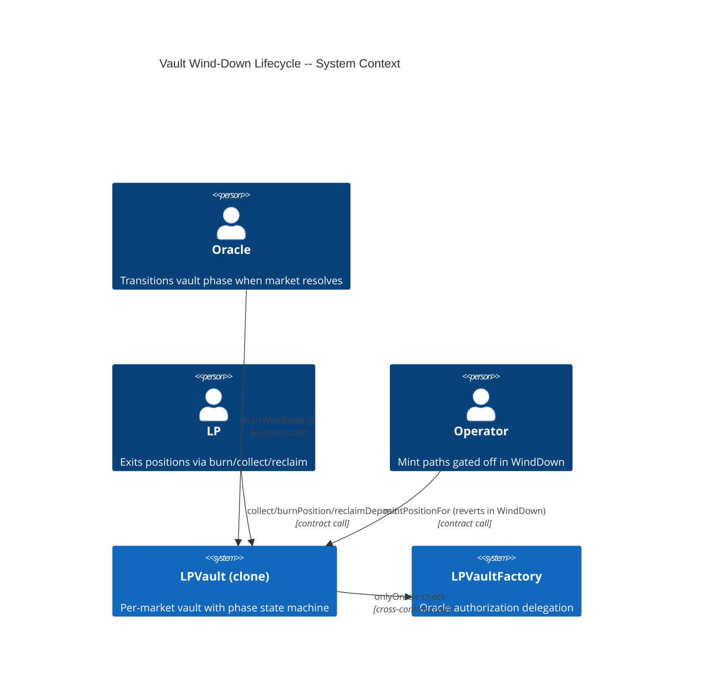
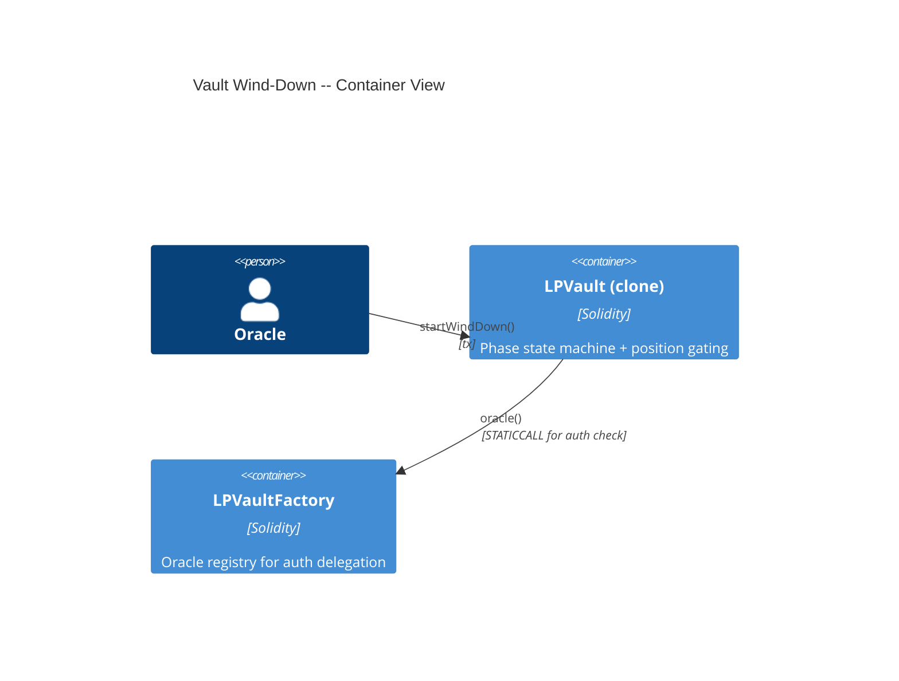
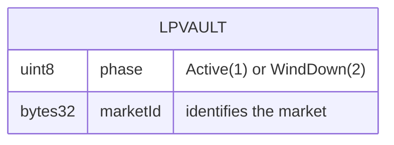
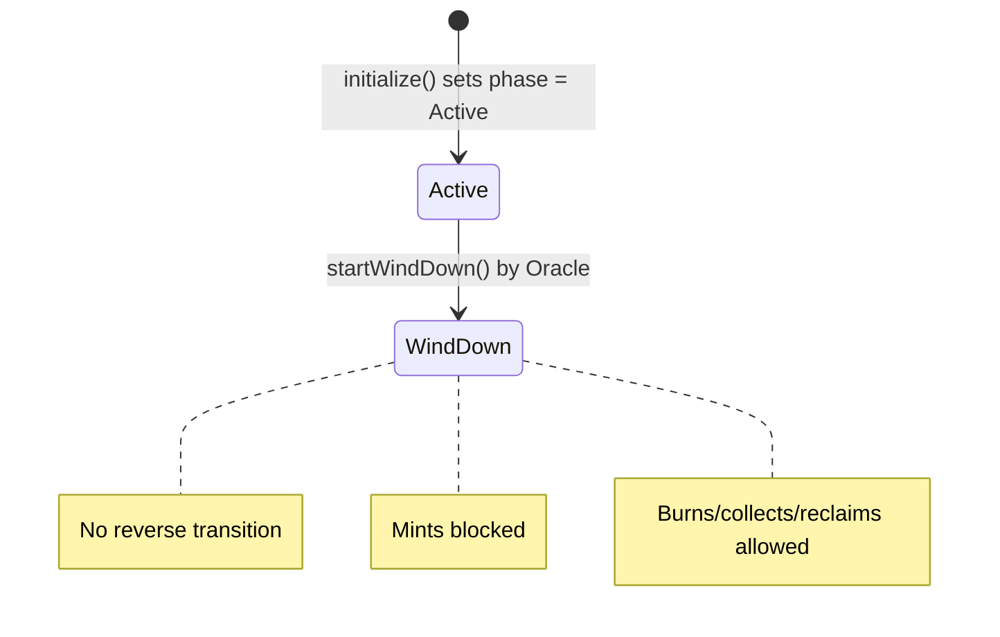

# Architecture: Vault Wind-Down Lifecycle

## System Context (C4 L1)

> Who uses this feature and what external systems does it touch?

## Container View (C4 L2)

> Which major components are involved and how do they communicate?

## Data Model

> Entity schemas with field constraints and invariants.

**Invariants:**
- `phase` transitions only from Active(1) to WindDown(2) -- never reverses
- Once `phase == WindDown`, `mintPositionFor` always reverts (existing `VaultNotActive` guard; `mintPosition` does not exist as a function)
- Once `phase == WindDown`, `collect` and `reclaimDeposit` continue to succeed (`burnPosition` is a future feature, not yet implemented)
- `startWindDown()` is callable only by the Oracle and only when `phase == Active`

## Component Inventory

> Files that participate in this feature.

| File | Role | Key Exports |
|------|------|-------------|
| `src/LPVault.sol` | Per-market vault with phase state machine | `startWindDown()`, `VaultWindDownStarted` event; existing phase check in `mintPositionFor` at line 429 |
| `src/LPVaultFactory.sol` | Oracle registry for auth delegation | `oracle()` (read by vault's `onlyOracle`) |
| `test/LPVault.t.sol` | Unit + integration tests for wind-down | Wind-down transition, phase gating, exit path scenarios |

## Event Topology

> All events this feature emits or consumes.

| Event | Publisher | Payload | Condition | Consumers |
|-------|-----------|---------|-----------|-----------|
| `VaultWindDownStarted(bytes32 indexed marketId)` | LPVault | `marketId` | On successful `startWindDown()` | Off-chain Event Listener |

**Non-events (explicit):**
- Failed `startWindDown` (wrong phase, wrong caller): no events emitted
- Mint attempts in WindDown: no events emitted (revert)

## API Surface

> Contract functions (entry points) belonging to this feature.

| Method | Path | Handler | Auth | Request Shape | Response Shape | Error Codes |
|--------|------|---------|------|---------------|----------------|-------------|
| call | `LPVault.startWindDown()` | `startWindDown` | onlyOracle | none | void | NotOracle, VaultNotActive |

## Integration Points

> External services, event streams, and infrastructure dependencies.

| System | Protocol | Direction | Purpose |
|--------|----------|-----------|---------|
| LPVaultFactory | STATICCALL `oracle()` | outbound | Oracle address resolution for `onlyOracle` check |

## State Transitions

> Vault phase lifecycle.

## Code Map

> Links spec IDs to implementation files.

| Spec ID | Spec Name | Implementation Files |
|---------|-----------|---------------------|
| UC-JGEE | Start Wind Down | `src/LPVault.sol:startWindDown()` |
| SC-JGEF | Successful wind-down transition | `src/LPVault.sol:startWindDown()` |
| SC-JGEG | Revert when phase is not Active | `src/LPVault.sol:startWindDown()` |
| SC-JGEH | Revert when non-Oracle calls | `src/LPVault.sol:startWindDown()`, `src/LPVaultFactory.sol:oracle()` |
| SC-JGEI | mintPosition reverts in WindDown | `src/LPVault.sol:mintPositionFor()` (mintPosition does not exist; SC subsumed by SC-JGEJ) |
| SC-JGEJ | mintPositionFor reverts in WindDown | `src/LPVault.sol:mintPositionFor()` |
| SC-JGEK | Exit paths succeed in WindDown | `src/LPVault.sol:collect()`, `src/LPVault.sol:reclaimDeposit()` (burnPosition not yet implemented) |

## Architecture Decisions

**ADR-JGEK:** One-way phase transition with no reverse path
In the context of vault lifecycle management, facing the question of whether WindDown should be reversible (e.g., if a market resolution is contested), we decided to make the Active-to-WindDown transition irreversible to achieve simplicity and safety -- a reversible phase would introduce re-entrancy vectors where mints could be re-enabled after LPs have already exited, accepting that if a market resolution is reversed the Oracle must deploy a new vault for that market.

## Testing Decisions

| Service/Pattern | Decision | Reason |
|-----------------|----------|--------|
| LPVaultFactory (Oracle registry) | e2e | Vault delegates `onlyOracle` to factory; test with real factory instance |
| Phase state (storage) | e2e | Direct storage reads via Foundry's `vm.load` or getter |
