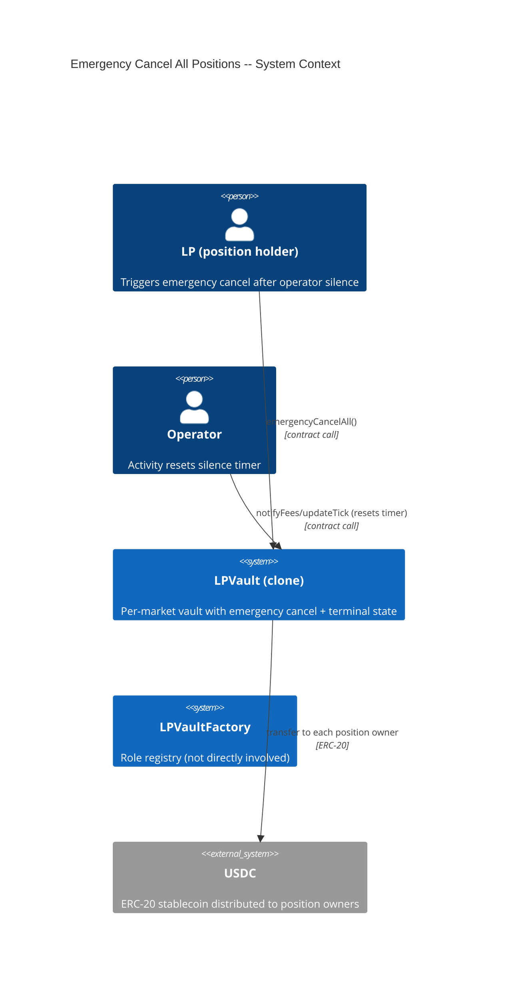
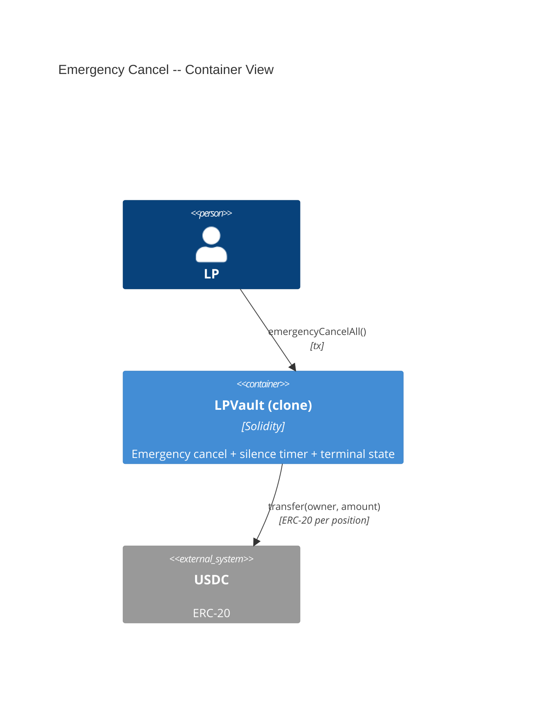
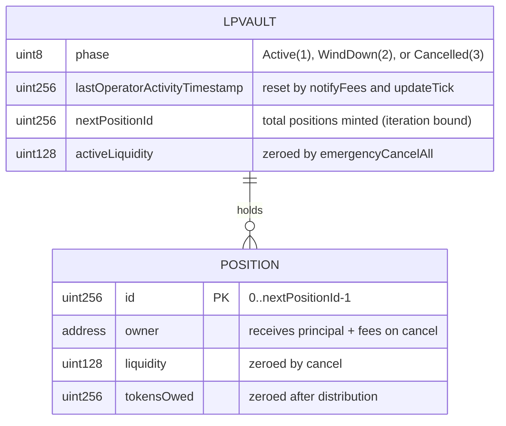
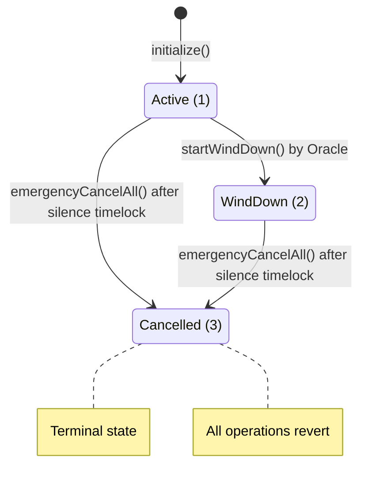

# Architecture: Emergency Cancel All Positions

## System Context (C4 L1)

> Who uses this feature and what external systems does it touch?

## Container View (C4 L2)

> Which major components are involved and how do they communicate?

## Data Model

> Entity schemas with field constraints and invariants.

**Invariants:**
- `phase` transitions from Active(1) or WindDown(2) to Cancelled(3) -- never reverses
- Once `phase == 3`, every external state-changing function reverts
- `EMERGENCY_CANCEL_TIMELOCK` is a constant (immutable after deployment)
- `lastOperatorActivityTimestamp` increases monotonically (reset = set to current block.timestamp)
- After `emergencyCancelAll()`, `activeLiquidity == 0` and every position has `liquidity == 0`

## Component Inventory

> Files that participate in this feature.

| File | Role | Key Exports |
|------|------|-------------|
| `src/LPVault.sol` | Vault with emergency cancel, silence timer, terminal state | `emergencyCancelAll()`, `EMERGENCY_CANCEL_TIMELOCK`, `EmergencyCancelExecuted` event; modified `notifyFees` (timestamp reset) |
| `test/features/FEAT-JXQO-emergency-cancel-all-positions/UC-JXQW-emergency-cancel-all/001-contract-call-emergency-cancel-all.t.sol` | Integration tests | All 6 scenarios |

## Event Topology

> All events this feature emits or consumes.

| Event | Publisher | Payload | Condition | Consumers |
|-------|-----------|---------|-----------|-----------|
| `EmergencyCancelExecuted(address indexed caller)` | LPVault | `caller` | On successful `emergencyCancelAll()` | Off-chain Event Listener |

**Non-events (explicit):**
- Failed `emergencyCancelAll` (timelock not elapsed, no position held): no events emitted
- State-changing calls after Cancelled phase: no events emitted (revert)

## API Surface

> Contract functions (entry points) belonging to this feature.

| Method | Path | Handler | Auth | Request Shape | Response Shape | Error Codes |
|--------|------|---------|------|---------------|----------------|-------------|
| call | `LPVault.emergencyCancelAll()` | `emergencyCancelAll` | any position holder + timelock | none | void | TimelockNotElapsed, NoPositionHeld, VaultNotActive |

## Integration Points

> External services, event streams, and infrastructure dependencies.

| System | Protocol | Direction | Purpose |
|--------|----------|-----------|---------|
| USDC (ERC-20) | ERC-20 `transfer` | outbound | Distribute principal + fees to each position owner |

## State Transitions

> Vault phase lifecycle (complete, including prior features).

## Code Map

> Links spec IDs to implementation files.

| Spec ID | Spec Name | Implementation Files |
|---------|-----------|---------------------|
| UC-JXQW | Emergency Cancel All | `src/LPVault.sol:emergencyCancelAll()` |
| SC-JXQX | Successful emergency cancel | `src/LPVault.sol:emergencyCancelAll()` |
| SC-JXQY | Revert before timelock | `src/LPVault.sol:emergencyCancelAll()` |
| SC-JXQZ | Revert if no position | `src/LPVault.sol:emergencyCancelAll()` |
| SC-JXR0 | Multi-LP distribution | `src/LPVault.sol:emergencyCancelAll()` |
| SC-JXR1 | Terminal state gates operations | `src/LPVault.sol:emergencyCancelAll()`, phase guards on all functions |
| SC-JXR2 | Operator activity resets timelock | `src/LPVault.sol:notifyFees()`, `src/LPVault.sol:updateTick()` |

## Architecture Decisions

**ADR-JXQO:** Iterate all positions in a single transaction
In the context of emergency cancel, facing the choice between iterating all positions atomically vs. a claim-based withdrawal pattern (each LP withdraws individually after cancel), we decided to iterate and distribute in one transaction to achieve simplicity and finality -- once emergencyCancelAll succeeds, no LP action is needed to recover funds, accepting the gas bound of O(nextPositionId) which is acceptable for Prophet markets (expected low hundreds of positions per vault).

**ADR-JXQP:** Position-holder gating instead of open-access
In the context of who can trigger the emergency cancel, facing the choice between allowing any address vs. restricting to position holders, we decided to require the caller to hold at least one position to prevent griefing by external addresses that have no stake in the vault, accepting that an LP with even a dust position can trigger the cancel once the timelock elapses.

## Testing Decisions

| Service/Pattern | Decision | Reason |
|-----------------|----------|--------|
| USDC (ERC-20) | e2e with mock token | Deploy a minimal ERC-20 mock; vault distributes via `transfer` |
| block.timestamp | injection via `vm.warp` | Foundry's `vm.warp` for deterministic timelock testing |
| Multi-position iteration | e2e | Mint multiple positions in setUp, verify each owner's balance after cancel |
