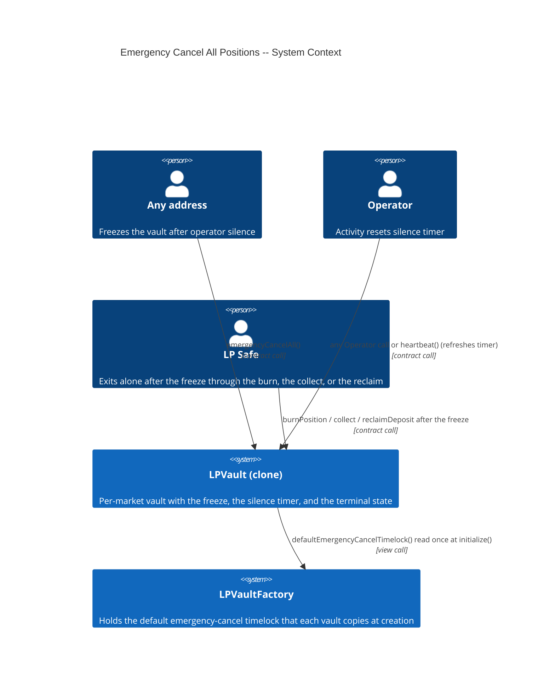
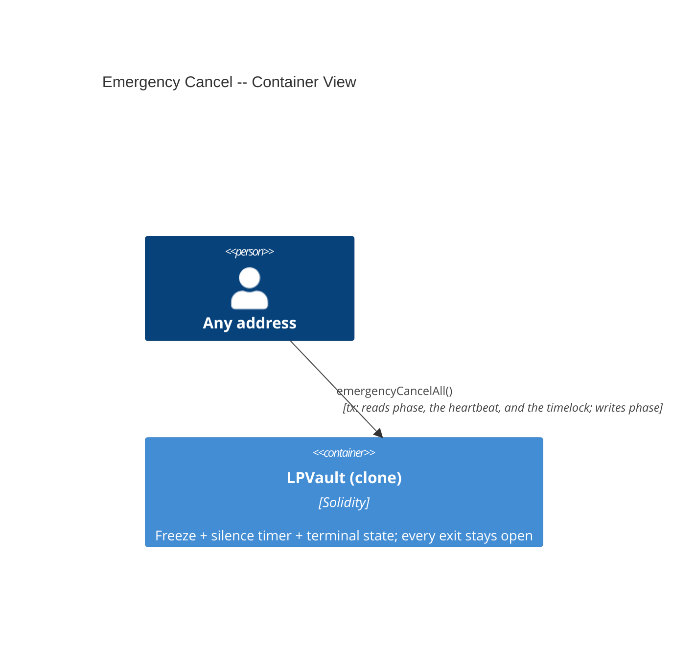
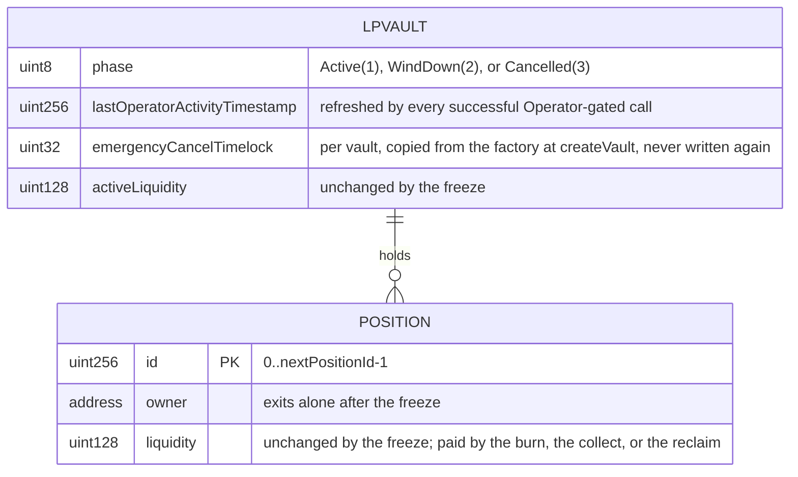
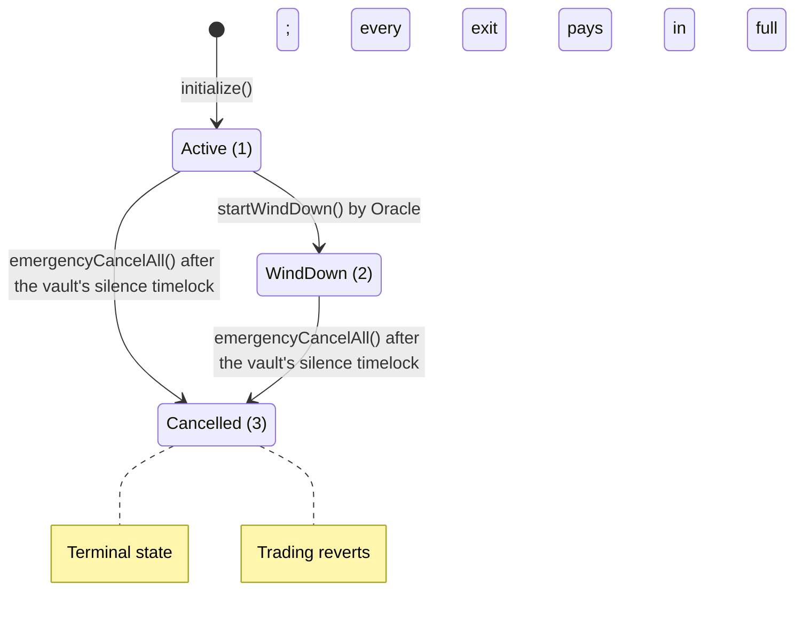

# Architecture: Emergency Cancel All Positions

## System Context (C4 L1)

> Who uses this feature and what external systems does it touch?

```mermaid
C4Context
    title Emergency Cancel All Positions -- System Context
    Person(anyone, "Any address", "Freezes the vault after operator silence")
    Person(operator, "Operator", "Activity resets silence timer")
    Person(lp, "LP Safe", "Exits alone after the freeze through the burn, the collect, or the reclaim")
    System(vault, "LPVault (clone)", "Per-market vault with the freeze, the silence timer, and the terminal state")
    System(factory, "LPVaultFactory", "Holds the default emergency-cancel timelock that each vault copies at creation")
    Rel(anyone, vault, "emergencyCancelAll()", "contract call")
    Rel(operator, vault, "any Operator call or heartbeat() (refreshes timer)", "contract call")
    Rel(lp, vault, "burnPosition / collect / reclaimDeposit after the freeze", "contract call")
    Rel(vault, factory, "defaultEmergencyCancelTimelock() read once at initialize()", "view call")
```

## Container View (C4 L2)

> Which major components are involved and how do they communicate?

```mermaid
C4Container
    title Emergency Cancel -- Container View
    Person(anyone, "Any address")
    Container(vault, "LPVault (clone)", "Solidity", "Freeze + silence timer + terminal state; every exit stays open")
    Rel(anyone, vault, "emergencyCancelAll()", "tx: reads phase, the heartbeat, and the timelock; writes phase")
```

## Data Model

> Entity schemas with field constraints and invariants.

```mermaid
erDiagram
    LPVAULT {
        uint8 phase "Active(1), WindDown(2), or Cancelled(3)"
        uint256 lastOperatorActivityTimestamp "refreshed by every successful Operator-gated call"
        uint32 emergencyCancelTimelock "per vault, copied from the factory at createVault, never written again"
        uint128 activeLiquidity "unchanged by the freeze"
    }
    LPVAULT ||--o{ POSITION : "holds"
    POSITION {
        uint256 id PK "0..nextPositionId-1"
        address owner "exits alone after the freeze"
        uint128 liquidity "unchanged by the freeze; paid by the burn, the collect, or the reclaim"
    }
```

**Invariants:**
- `phase` moves from Active(1) or WindDown(2) to Cancelled(3) and never reverses
- Once `phase == 3`, every trading entry point reverts, and every LP exit and the complete-set merge succeed and pay in full
- `emergencyCancelTimelock` is written once, at `initialize`, and never again
- `lastOperatorActivityTimestamp` increases monotonically (reset = set to current block.timestamp)
- The freeze writes `phase` and nothing else, so `activeLiquidity` equals the in-range position liquidity in phase 3 as in every phase (`invariant_activeLiquidityEqualsInRangeLiquidity` in `test/invariants/TickState.t.sol`), and the four totals of the solvency ledger equal the sum of the live claims after it (FEAT-9BQZ SC-COEP, `invariant_ledgerEqualsSumOfClaims`)

## Component Inventory

> Files that participate in this feature.

| File | Role | Key Exports |
|------|------|-------------|
| `src/LPVault.sol` | Vault with the freeze, the silence timer, and the terminal state | `emergencyCancelAll()`, `heartbeat()`, `touchesHeartbeat` modifier, `emergencyCancelTimelock`, `EmergencyCancelExecuted` event |
| `src/LPVaultFactory.sol` | Holds the default timelock that each vault copies | `defaultEmergencyCancelTimelock`, `setDefaultEmergencyCancelTimelock()`, which `initialize()` reads once |
| `test/features/FEAT-JXQO-emergency-cancel-all-positions/UC-JXQW-emergency-cancel-all.t.sol` | Integration tests | All 11 scenarios and the NFR-BZBV gas check |
| `test/features/FEAT-REPZ-deploy-lp-vault-for-a-market/UC-REQ1-create-vault-for-market.t.sol` | Integration tests of the setter and the copy | The default, the copy at creation, the bounds, the Admin gate |
| `test/invariants/TickState.t.sol` | The tick invariants under a freeze | `TickStateHandler.freeze()` |

## Event Topology

> All events this feature emits or consumes.

| Event | Publisher | Payload | Condition | Consumers |
|-------|-----------|---------|-----------|-----------|
| `EmergencyCancelExecuted(address indexed caller)` | LPVault | `caller` | On successful `emergencyCancelAll()` | Off-chain Event Listener; the keeper cancels the vault's resting orders |

**Non-events (explicit):**
- Failed `emergencyCancelAll` (timelock not elapsed, already Cancelled): no events emitted
- The freeze: no `Transfer`, no `PositionBurned`, no `FeesCollected`
- State-changing trading calls after the Cancelled phase: no events emitted (revert)

## API Surface

> Contract functions (entry points) belonging to this feature.

| Method | Path | Handler | Auth | Request Shape | Response Shape | Error Codes |
|--------|------|---------|------|---------------|----------------|-------------|
| call | `LPVault.emergencyCancelAll()` | `emergencyCancelAll` | any address, after the vault's timelock | none | void | TimelockNotElapsed, VaultCancelled |
| call | `LPVault.heartbeat()` | `heartbeat` | onlyOperator | none | void | NotOperator, VaultCancelled |

## Integration Points

> External services, event streams, and infrastructure dependencies.

**Not applicable:** the freeze makes no external call. The exits it enables have their own tables in FEAT-7G40, FEAT-U079, FEAT-JAIJ, and FEAT-6HBN.

## State Transitions

> Vault phase lifecycle (complete, including prior features).

```mermaid
stateDiagram-v2
    state "Active (1)" as s1
    state "WindDown (2)" as s2
    state "Cancelled (3)" as s3
    [*] --> s1 : initialize()
    s1 --> s2 : startWindDown() by Oracle
    s1 --> s3 : emergencyCancelAll() after the vault's silence timelock
    s2 --> s3 : emergencyCancelAll() after the vault's silence timelock
    note right of s3 : Terminal state
    note right of s3 : Trading reverts; every exit pays in full
```

## Code Map

> Links spec IDs to implementation files.

| Spec ID | Spec Name | Implementation Files |
|---------|-----------|---------------------|
| UC-JXQW | Emergency Cancel All | `src/LPVault.sol:emergencyCancelAll()` |
| SC-JXQX | The freeze changes only the phase | `src/LPVault.sol:emergencyCancelAll()` |
| SC-JXQY | Revert before timelock | `src/LPVault.sol:emergencyCancelAll()` |
| SC-BZBW | Any address freezes the vault | `src/LPVault.sol:emergencyCancelAll()` |
| SC-BZBX | An in-range burn after the freeze pays in full | `src/LPVault.sol:emergencyCancelAll()`, `src/LPVault.sol:burnPosition()`, `src/LPVault.sol:_burn()` |
| SC-JXR1 | Terminal state gates operations | `src/LPVault.sol:emergencyCancelAll()`, phase guards on all functions |
| SC-JXR2 | Operator activity resets timelock | `src/LPVault.sol:touchesHeartbeat`, `src/LPVault.sol:notifyFees()`, `src/LPVault.sol:updateTick()` |
| SC-3XTZ | Heartbeat defers emergency cancel | `src/LPVault.sol:heartbeat()`, `src/LPVault.sol:updateTick()`, `src/LPVault.sol:touchesHeartbeat` |
| SC-3XU0 | Mint and merge reset the timelock | `src/LPVault.sol:mintPositionFor()`, `src/LPVault.sol:mergePositions()`, `src/LPVault.sol:touchesHeartbeat` |
| SC-3XU1 | Non-Operator cannot heartbeat | `src/LPVault.sol:heartbeat()`, `src/LPVault.sol:onlyOperator` |
| SC-3XUO | Heartbeat works while paused or wound down | `src/LPVault.sol:heartbeat()` |
| SC-3XU2 | Heartbeat reverts once Cancelled | `src/LPVault.sol:heartbeat()` |

## Architecture Decisions

**ADR-JXQO:** Iterate all positions in a single transaction
In the context of emergency cancel, facing the choice between iterating all positions atomically vs. a claim-based withdrawal pattern (each LP withdraws individually after cancel), we decided to iterate and distribute in one transaction to achieve simplicity and finality -- once emergencyCancelAll succeeds, no LP action is needed to recover funds, accepting the gas bound of O(nextPositionId) which is acceptable for Prophet markets (expected low hundreds of positions per vault).
Superseded on 2026-09-13 (audit issues 6.7, 6.11, and 6.17, decision C9 in `audits/audit-fixes-ranged.md`): the freeze (ADR-BZBY) replaces the iteration. The loop skipped a pending escrow, ran out of gas on a large vault, and failed for everyone on one blacklisted recipient. Its `unchecked` fee product was one of the fee-growth wraparound sites (ADR-8L1F in FEAT-T7AF); the site left with the loop.

**ADR-3XU3:** Two liveness mechanisms -- an automatic modifier plus a dedicated heartbeat
In the context of proving the Operator is alive, facing the fact that `lastOperatorActivityTimestamp` was written only inside `updateTick` and `notifyFees` -- both of which legitimately revert on a quiet market (`SameTick`, `ZeroAmount`), while `mintPositionFor` and `mergePositions` did not touch it at all -- we decided on two mechanisms rather than one: a `touchesHeartbeat` modifier stacked alongside `onlyOperator` on every Operator-gated function so that any successful Operator call counts as proof of life automatically, plus a dedicated `heartbeat()` for markets with no other Operator action to piggyback on. This achieves liveness that tracks what the Operator actually is rather than what the market happens to be doing.

We chose a separate modifier over folding the write into `onlyOperator` so that `onlyOperator` keeps doing exactly one thing (access control), and so the requirement stays visible in each function's signature -- a reviewer immediately notices a new Operator-gated function missing it, which a write buried in the modifier body would not surface. Because a revert rolls back the whole transaction, writing the timestamp before the function body is observationally identical to writing it after: the timer advances if and only if the call succeeds.

We deliberately left `updateTick`'s `SameTick` revert and `notifyFees`'s `ZeroAmount` revert intact. Both are legitimate guards against wasted or mistaken calls; weakening them so they could double as liveness pings would be worse than giving the Operator a clean, dedicated function. **Superseded in part on 2026-09-11:** the user's decision C11 replaces the `SameTick` half. An unchanged tick report now refreshes the heartbeat and returns, because the keeper's 60-second report on an unchanged price is the normal case and a reverted call costs gas and refreshes nothing. The `ZeroAmount` revert in `notifyFees` stays. The unchanged-tick decision (ADR-9J43) in FEAT-TVS0 records the new rule.

We accept a residual risk this does not address: an Operator that is technically alive but uncooperative can call `heartbeat()` indefinitely to keep `emergencyCancelAll` out of reach without doing any real work. That is the opposite failure mode (a false-positive freeze rather than a false-negative liveness signal) and materially lower stakes; it matters mainly because `emergencyCancelAll` is currently the only unconditional exit path, and later work in this sequence makes the individual exit paths work regardless of Operator behavior, which shrinks the exposure further.

**Rejected alternative -- fold the timestamp write into `onlyOperator`:** Fewer modifiers at each call site, but it gives one modifier two responsibilities and hides a state write inside something named for access control. A reader auditing `onlyOperator` would not expect an SSTORE.

**Rejected alternative -- treat any Operator call as liveness, including reverted ones:** Impossible on-chain by construction -- a reverted call leaves no state behind. Any scheme approximating it (for example a `try`/`catch` wrapper) would let a broken Operator prove liveness by failing repeatedly, which inverts the intent.

**ADR-JXQP:** Position-holder gating instead of open-access
In the context of who can trigger the emergency cancel, facing the choice between allowing any address vs. restricting to position holders, we decided to require the caller to hold at least one position to prevent griefing by external addresses that have no stake in the vault, accepting that an LP with even a dust position can trigger the cancel once the timelock elapses.
Superseded on 2026-09-13 (audit issues 6.7, 6.11, and 6.17, decision C9 in `audits/audit-fixes-ranged.md`): the freeze (ADR-BZBY) is open to any address. The ownership check was the same unbounded loop that audit issue 6.11 names, and once the function moves no funds, caller identity protects nothing (audit-solutions.md, Finding 4).

**ADR-BZBY:** The emergency cancel is an O(1) freeze that any address may call after the timelock
In the context of the emergency exit after Operator silence, facing three audit issues that share one cause (a loop that pays everyone in one call: a pending escrow has no position so the loop skipped it (6.7), a large vault ran out of gas (6.11), and one USDC-blacklisted owner reverted the payment for everyone (6.17)), we decided that `emergencyCancelAll` is an O(1) freeze that any address may call after the vault's emergency-cancel timelock, which writes `phase = 3` and nothing else, so that each LP exits alone through the paths that work in every phase (`burnPosition`, `burnPositionFor`, `collect`, `collectFor`, `reclaimDeposit`, `reclaimDepositFor`, and `mergeCompleteSets`, opened by R5 and R9), accepting that an LP must send one transaction to leave (the app relays it, or the Safe sends it) and that the freeze keeps `activeLiquidity` and every record, which the burn's checked arithmetic (`activeLiquidity -= liquidity`) and the claim model both require. The freeze carries no `nonReentrant`, because it makes no external call and moves no token, which is the condition under which `CLAUDE.md` checklist item 1 requires the guard, and the other phase flips (`startWindDown`, `pauseTrading`, `heartbeat`) carry none either. The user chose this on 2026-09-13.

**Rejected alternative -- block the cancel while an escrow exists:** the auditors' first option for 6.7. It lets one pending intent hold every LP hostage.

**Rejected alternative -- refund escrows inside the cancel:** another loop, with the same three failure modes.

**Rejected alternative -- batched processing:** 6.11's second option. More code and more calls, and each batch still pushes to a blacklistable address.

**Rejected alternative -- a `try`/`catch` around the transfer:** 6.17's first option. It needs a non-reverting `_safeTransfer` variant and a protocol-owned escrow, and it keeps the loop.

**Rejected alternative -- a cheaper O(1) ownership check:** audit-solutions.md, Finding 4. Caller identity protects nothing once the function moves no funds, and a restricted caller only risks a vault that no holder notices.

**ADR-BZBZ:** The vault approves an order only while Active and not paused (decision C22)
In the context of a freeze that keeps every claim and pays each one at the frozen `currentTick` over the days that follow, facing an exchange that fills the vault's resting orders through the vault's standing USDC and ERC-1155 approvals, we decided that the vault's order-maker check (`isValidSignature`, EIP-1271, decision C22 of `audits/audit-fixes-ranged.md`, built in Part 6) accepts an order only while the vault is in the Active phase and is not paused, so that a frozen, wound-down, or paused vault takes no new fill while its claims are paid, accepting that a resting order the keeper posted before the freeze fails its signature check at match time instead of being cancelled, and that the keeper cancels its orders when it sees `EmergencyCancelExecuted`, `VaultWindDownStarted`, or `TradingPaused`. Recorded here on 2026-09-13 (round 2 finding V2-07 of the plan validation) because the freeze depends on it; the code lands in Part 6.

## Testing Decisions

| Service/Pattern | Decision | Reason |
|-----------------|----------|--------|
| USDC (ERC-20) | e2e with mock token | Deploy a minimal ERC-20 mock; the exits after the freeze pay through `transfer` |
| block.timestamp | injection via `vm.warp` | Foundry's `vm.warp` for deterministic timelock testing |
| The freeze with several positions and one escrow | e2e | Mint two Safes' positions and one escrow, freeze, then drive every exit |
| The freeze's gas | e2e | `vm.cool` on the vault, then `gasleft()` around one call, on a vault with one position and on a vault with five |
