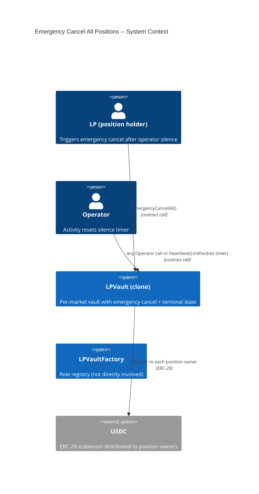
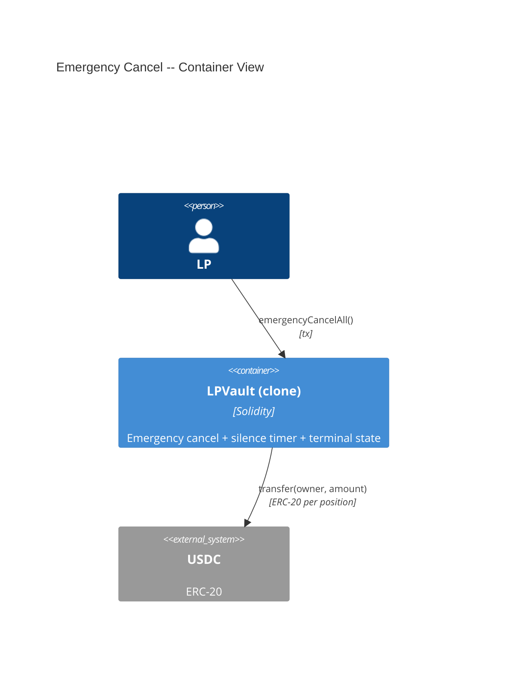
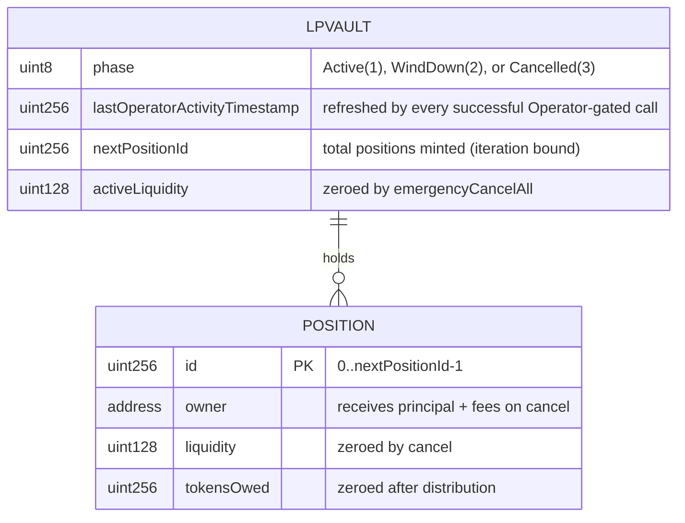
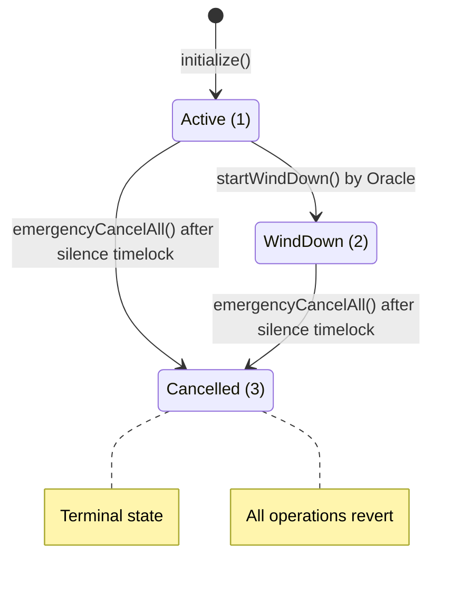

# Architecture: Emergency Cancel All Positions

## System Context (C4 L1)

> Who uses this feature and what external systems does it touch?

```mermaid
C4Context
    title Emergency Cancel All Positions -- System Context
    Person(lp, "LP (position holder)", "Triggers emergency cancel after operator silence")
    Person(operator, "Operator", "Activity resets silence timer")
    System(vault, "LPVault (clone)", "Per-market vault with emergency cancel + terminal state")
    System(factory, "LPVaultFactory", "Role registry (not directly involved)")
    System_Ext(usdc, "USDC", "ERC-20 stablecoin distributed to position owners")
    Rel(lp, vault, "emergencyCancelAll()", "contract call")
    Rel(operator, vault, "any Operator call or heartbeat() (refreshes timer)", "contract call")
    Rel(vault, usdc, "transfer to each position owner", "ERC-20")
```

## Container View (C4 L2)

> Which major components are involved and how do they communicate?

```mermaid
C4Container
    title Emergency Cancel -- Container View
    Person(lp, "LP")
    Container(vault, "LPVault (clone)", "Solidity", "Emergency cancel + silence timer + terminal state")
    System_Ext(usdc, "USDC", "ERC-20")
    Rel(lp, vault, "emergencyCancelAll()", "tx")
    Rel(vault, usdc, "transfer(owner, amount)", "ERC-20 per position")
```

## Data Model

> Entity schemas with field constraints and invariants.

```mermaid
erDiagram
    LPVAULT {
        uint8 phase "Active(1), WindDown(2), or Cancelled(3)"
        uint256 lastOperatorActivityTimestamp "refreshed by every successful Operator-gated call"
        uint256 nextPositionId "total positions minted (iteration bound)"
        uint128 activeLiquidity "zeroed by emergencyCancelAll"
    }
    LPVAULT ||--o{ POSITION : "holds"
    POSITION {
        uint256 id PK "0..nextPositionId-1"
        address owner "receives principal + fees on cancel"
        uint128 liquidity "zeroed by cancel"
        uint256 tokensOwed "zeroed after distribution"
    }
```

**Invariants:**
- `phase` transitions from Active(1) or WindDown(2) to Cancelled(3) -- never reverses
- Once `phase == 3`, every external state-changing function reverts
- `EMERGENCY_CANCEL_TIMELOCK` is a constant (immutable after deployment)
- `lastOperatorActivityTimestamp` increases monotonically (reset = set to current block.timestamp)
- After `emergencyCancelAll()`, `activeLiquidity == 0` and every position has `liquidity == 0`

## Component Inventory

> Files that participate in this feature.

| File | Role | Key Exports |
|------|------|-------------|
| `src/LPVault.sol` | Vault with emergency cancel, silence timer, terminal state | `emergencyCancelAll()`, `heartbeat()`, `touchesHeartbeat` modifier, `EMERGENCY_CANCEL_TIMELOCK`, `EmergencyCancelExecuted` event |
| `test/features/FEAT-JXQO-emergency-cancel-all-positions/UC-JXQW-emergency-cancel-all.t.sol` | Integration tests | All 11 scenarios |

## Event Topology

> All events this feature emits or consumes.

| Event | Publisher | Payload | Condition | Consumers |
|-------|-----------|---------|-----------|-----------|
| `EmergencyCancelExecuted(address indexed caller)` | LPVault | `caller` | On successful `emergencyCancelAll()` | Off-chain Event Listener |

**Non-events (explicit):**
- Failed `emergencyCancelAll` (timelock not elapsed, no position held): no events emitted
- State-changing calls after Cancelled phase: no events emitted (revert)

## API Surface

> Contract functions (entry points) belonging to this feature.

| Method | Path | Handler | Auth | Request Shape | Response Shape | Error Codes |
|--------|------|---------|------|---------------|----------------|-------------|
| call | `LPVault.emergencyCancelAll()` | `emergencyCancelAll` | any position holder + timelock | none | void | TimelockNotElapsed, NoPositionHeld, VaultCancelled |
| call | `LPVault.heartbeat()` | `heartbeat` | onlyOperator | none | void | NotOperator, VaultCancelled |

## Integration Points

> External services, event streams, and infrastructure dependencies.

| System | Protocol | Direction | Purpose |
|--------|----------|-----------|---------|
| USDC (ERC-20) | ERC-20 `transfer` | outbound | Distribute principal + fees to each position owner |

## State Transitions

> Vault phase lifecycle (complete, including prior features).

```mermaid
stateDiagram-v2
    state "Active (1)" as s1
    state "WindDown (2)" as s2
    state "Cancelled (3)" as s3
    [*] --> s1 : initialize()
    s1 --> s2 : startWindDown() by Oracle
    s1 --> s3 : emergencyCancelAll() after silence timelock
    s2 --> s3 : emergencyCancelAll() after silence timelock
    note right of s3 : Terminal state
    note right of s3 : All operations revert
```

## Code Map

> Links spec IDs to implementation files.

| Spec ID | Spec Name | Implementation Files |
|---------|-----------|---------------------|
| UC-JXQW | Emergency Cancel All | `src/LPVault.sol:emergencyCancelAll()` |
| SC-JXQX | Successful emergency cancel | `src/LPVault.sol:emergencyCancelAll()` |
| SC-JXQY | Revert before timelock | `src/LPVault.sol:emergencyCancelAll()` |
| SC-JXQZ | Revert if no position | `src/LPVault.sol:emergencyCancelAll()` |
| SC-JXR0 | Multi-LP distribution | `src/LPVault.sol:emergencyCancelAll()` |
| SC-JXR1 | Terminal state gates operations | `src/LPVault.sol:emergencyCancelAll()`, phase guards on all functions |
| SC-JXR2 | Operator activity resets timelock | `src/LPVault.sol:touchesHeartbeat`, `src/LPVault.sol:notifyFees()`, `src/LPVault.sol:updateTick()` |
| SC-3XTZ | Heartbeat defers emergency cancel | `src/LPVault.sol:heartbeat()`, `src/LPVault.sol:touchesHeartbeat` |
| SC-3XU0 | Mint and merge reset the timelock | `src/LPVault.sol:mintPositionFor()`, `src/LPVault.sol:mergePositions()`, `src/LPVault.sol:touchesHeartbeat` |
| SC-3XU1 | Non-Operator cannot heartbeat | `src/LPVault.sol:heartbeat()`, `src/LPVault.sol:onlyOperator` |
| SC-3XUO | Heartbeat works while paused | `src/LPVault.sol:heartbeat()` |
| SC-3XU2 | Heartbeat reverts once Cancelled | `src/LPVault.sol:heartbeat()` |

## Architecture Decisions

**ADR-JXQO:** Iterate all positions in a single transaction
In the context of emergency cancel, facing the choice between iterating all positions atomically vs. a claim-based withdrawal pattern (each LP withdraws individually after cancel), we decided to iterate and distribute in one transaction to achieve simplicity and finality -- once emergencyCancelAll succeeds, no LP action is needed to recover funds, accepting the gas bound of O(nextPositionId) which is acceptable for Prophet markets (expected low hundreds of positions per vault).

**ADR-3XU3:** Two liveness mechanisms -- an automatic modifier plus a dedicated heartbeat
In the context of proving the Operator is alive, facing the fact that `lastOperatorActivityTimestamp` was written only inside `updateTick` and `notifyFees` -- both of which legitimately revert on a quiet market (`SameTick`, `ZeroAmount`), while `mintPositionFor` and `mergePositions` did not touch it at all -- we decided on two mechanisms rather than one: a `touchesHeartbeat` modifier stacked alongside `onlyOperator` on every Operator-gated function so that any successful Operator call counts as proof of life automatically, plus a dedicated `heartbeat()` for markets with no other Operator action to piggyback on. This achieves liveness that tracks what the Operator actually is rather than what the market happens to be doing.

We chose a separate modifier over folding the write into `onlyOperator` so that `onlyOperator` keeps doing exactly one thing (access control), and so the requirement stays visible in each function's signature -- a reviewer immediately notices a new Operator-gated function missing it, which a write buried in the modifier body would not surface. Because a revert rolls back the whole transaction, writing the timestamp before the function body is observationally identical to writing it after: the timer advances if and only if the call succeeds.

We deliberately left `updateTick`'s `SameTick` revert and `notifyFees`'s `ZeroAmount` revert intact. Both are legitimate guards against wasted or mistaken calls; weakening them so they could double as liveness pings would be worse than giving the Operator a clean, dedicated function.

We accept a residual risk this does not address: an Operator that is technically alive but uncooperative can call `heartbeat()` indefinitely to keep `emergencyCancelAll` out of reach without doing any real work. That is the opposite failure mode (a false-positive freeze rather than a false-negative liveness signal) and materially lower stakes; it matters mainly because `emergencyCancelAll` is currently the only unconditional exit path, and later work in this sequence makes the individual exit paths work regardless of Operator behavior, which shrinks the exposure further.

**Rejected alternative -- fold the timestamp write into `onlyOperator`:** Fewer modifiers at each call site, but it gives one modifier two responsibilities and hides a state write inside something named for access control. A reader auditing `onlyOperator` would not expect an SSTORE.

**Rejected alternative -- treat any Operator call as liveness, including reverted ones:** Impossible on-chain by construction -- a reverted call leaves no state behind. Any scheme approximating it (for example a `try`/`catch` wrapper) would let a broken Operator prove liveness by failing repeatedly, which inverts the intent.

**ADR-JXQP:** Position-holder gating instead of open-access
In the context of who can trigger the emergency cancel, facing the choice between allowing any address vs. restricting to position holders, we decided to require the caller to hold at least one position to prevent griefing by external addresses that have no stake in the vault, accepting that an LP with even a dust position can trigger the cancel once the timelock elapses.

## Testing Decisions

| Service/Pattern | Decision | Reason |
|-----------------|----------|--------|
| USDC (ERC-20) | e2e with mock token | Deploy a minimal ERC-20 mock; vault distributes via `transfer` |
| block.timestamp | injection via `vm.warp` | Foundry's `vm.warp` for deterministic timelock testing |
| Multi-position iteration | e2e | Mint multiple positions in setUp, verify each owner's balance after cancel |
