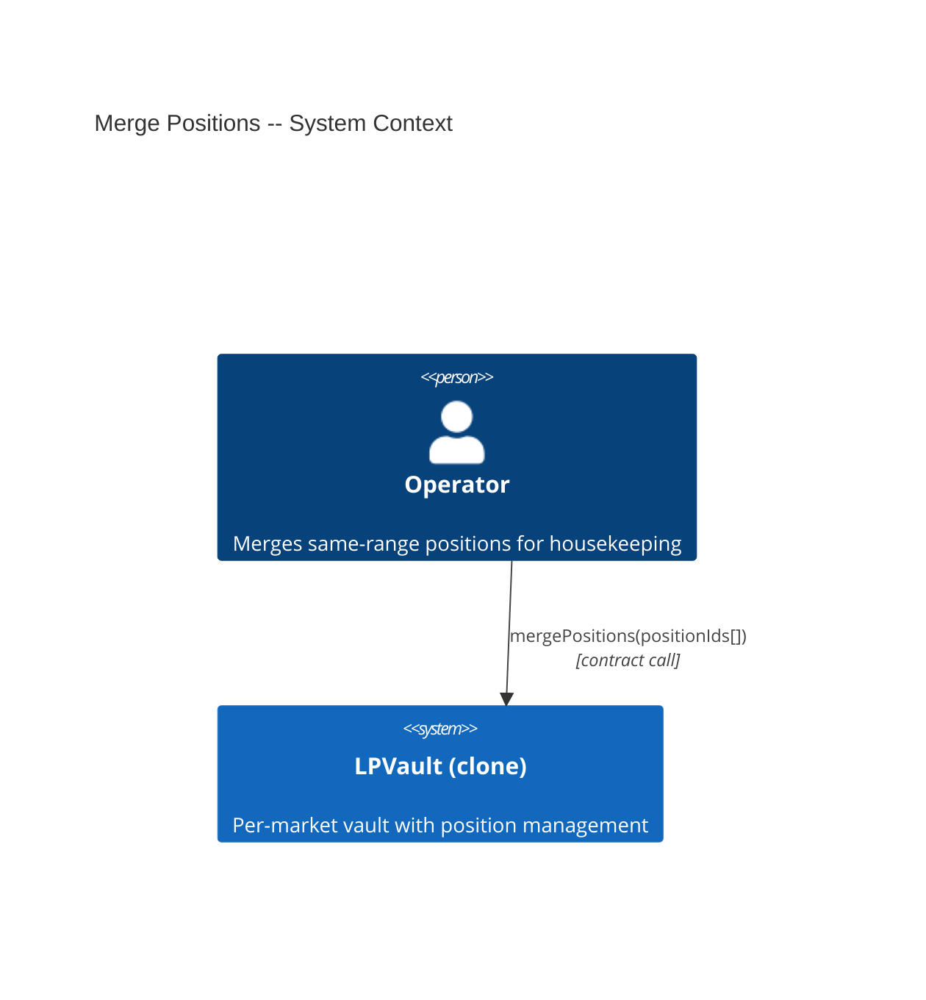
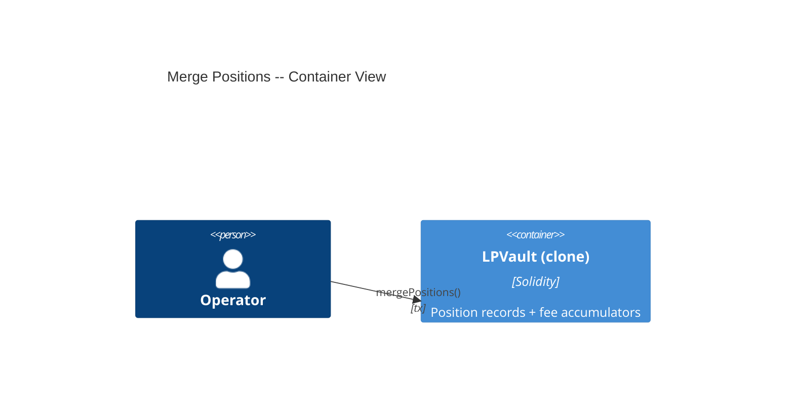
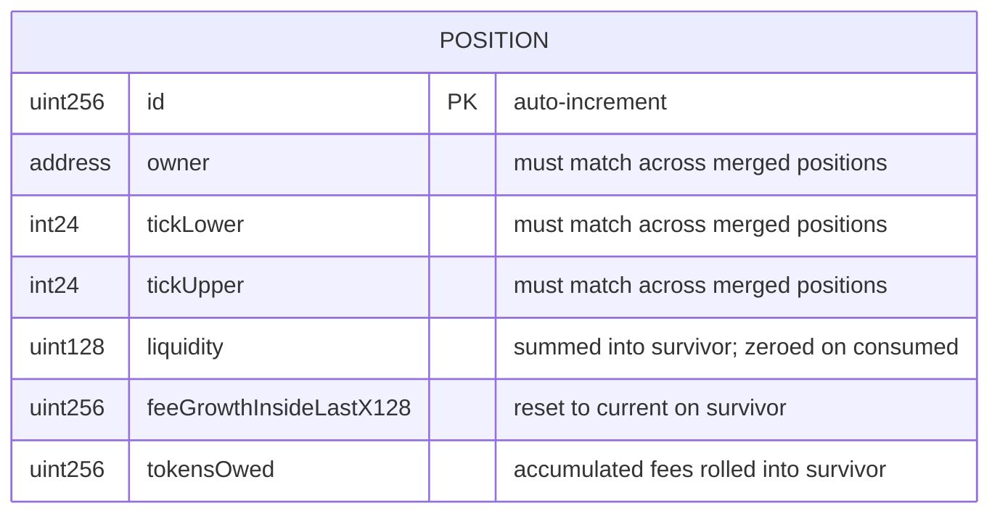

# Architecture: Merge Positions

## System Context (C4 L1)

## Container View (C4 L2)

## Data Model

**Invariants:**
- After merge: `survivor.liquidity == sum(consumed.liquidity)` (total liquidity unchanged)
- After merge: tick `liquidityGross` unchanged (same total liquidity on same range)
- After merge: consumed positions have `liquidity == 0`
- `feeGrowthInsideLastX128` on survivor is set to current value to prevent double-counting

## Component Inventory

| File | Role | Key Exports |
|------|------|-------------|
| `src/LPVault.sol` | Vault with position merge | `mergePositions()`, `PositionsMerged` event |

## Event Topology

| Event | Publisher | Payload | Condition | Consumers |
|-------|-----------|---------|-----------|-----------|
| `PositionsMerged(uint256[] positionIds, uint256 survivorId)` | LPVault | `positionIds, survivorId` | On successful `mergePositions()` | Off-chain indexer |

**Non-events (explicit):**
- Failed merge (mismatched ranges, insufficient positions): no events emitted
- No USDC transferred during merge (fees stay in tokensOwed)

## API Surface

| Method | Path | Handler | Auth | Request Shape | Response Shape | Error Codes |
|--------|------|---------|------|---------------|----------------|-------------|
| call | `LPVault.mergePositions(uint256[])` | `mergePositions` | onlyOperator | `positionIds` | void | NotOperator, RangeMismatch, InsufficientPositions |

## Integration Points

_None — merge is a pure storage operation with no external calls._

## Code Map

| Spec ID | Spec Name | Implementation Files |
|---------|-----------|---------------------|
| UC-K1M8 | Merge Same-Range Positions | `src/LPVault.sol:mergePositions()` |
| SC-K1M9 | Successful merge | `src/LPVault.sol:mergePositions()` |
| SC-K1MA | Revert on mismatched ranges | `src/LPVault.sol:mergePositions()` |
| SC-K1MB | Revert on empty/single input | `src/LPVault.sol:mergePositions()` |
| SC-K1MC | Fee accounting preserved | `src/LPVault.sol:mergePositions()` |

## Architecture Decisions

_None — mergePositions follows the existing position structure and fee accumulator pattern._

## Testing Decisions

| Service/Pattern | Decision | Reason |
|-----------------|----------|--------|
| Fee accumulators | e2e | Use real notifyFees + collect flow to verify fee preservation |
