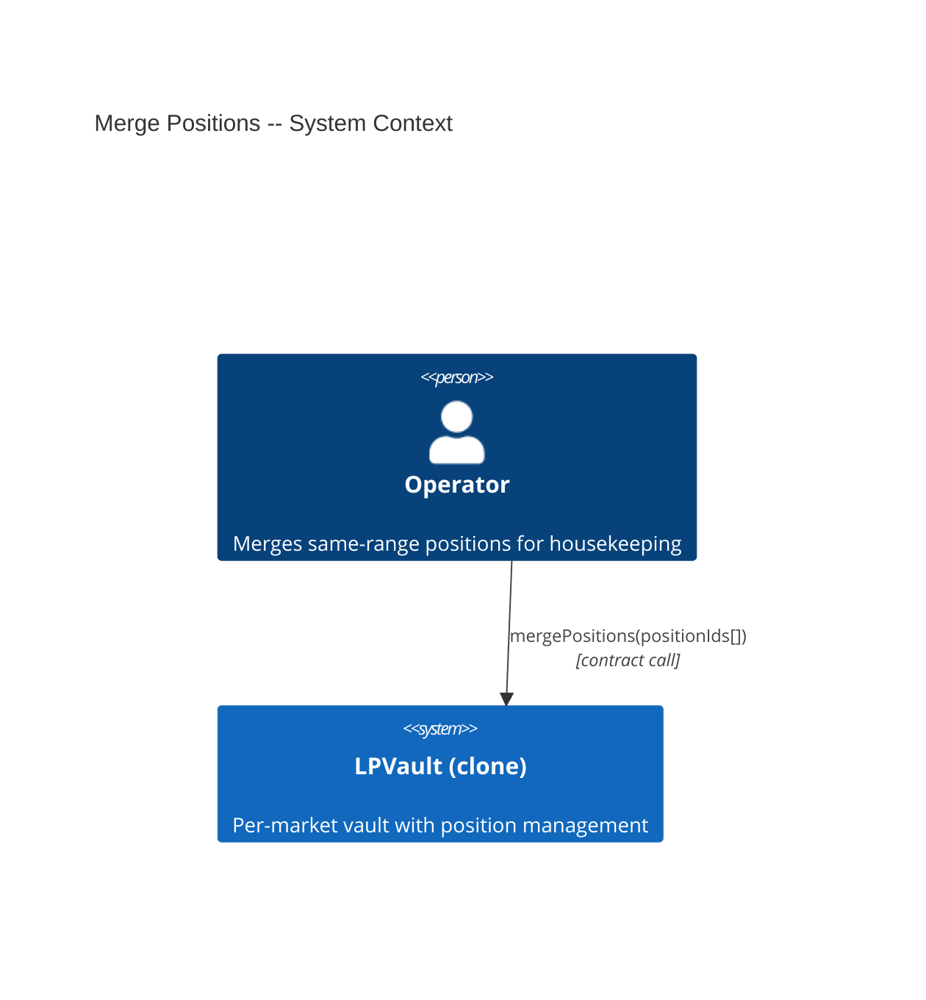
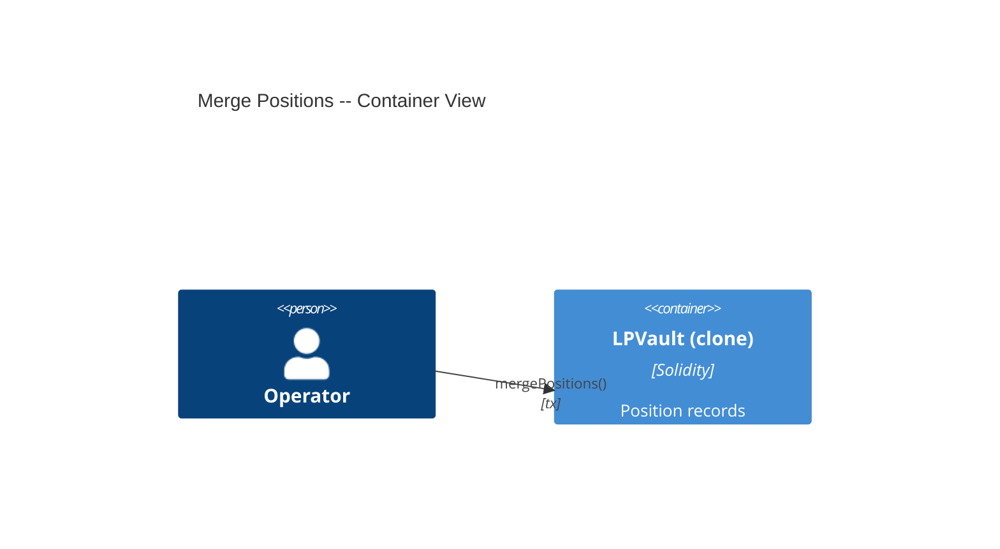
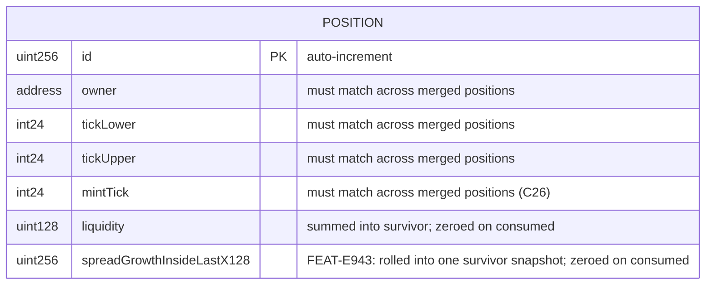

# Architecture: Merge Positions

## System Context (C4 L1)

```mermaid
C4Context
    title Merge Positions -- System Context
    Person(operator, "Operator", "Merges same-range positions for housekeeping")
    System(vault, "LPVault (clone)", "Per-market vault with position management")
    Rel(operator, vault, "mergePositions(positionIds[])", "contract call")
```

## Container View (C4 L2)

```mermaid
C4Container
    title Merge Positions -- Container View
    Person(operator, "Operator")
    Container(vault, "LPVault (clone)", "Solidity", "Position records")
    Rel(operator, vault, "mergePositions()", "tx")
```

## Data Model

```mermaid
erDiagram
    POSITION {
        uint256 id PK "auto-increment"
        address owner "must match across merged positions"
        int24 tickLower "must match across merged positions"
        int24 tickUpper "must match across merged positions"
        int24 mintTick "must match across merged positions (C26)"
        uint128 liquidity "summed into survivor; zeroed on consumed"
        uint256 spreadGrowthInsideLastX128 "FEAT-E943: rolled into one survivor snapshot; zeroed on consumed"
    }
```

**Invariants:**
- `positionIds` holds no repeated ID -- checked pairwise before any position is read
- After merge: `survivor.liquidity == sum(consumed.liquidity)` (total liquidity unchanged)
- The sum of `position.liquidity` over every position is unchanged by a merge, which equals half the sum of `liquidityGross` over the distinct referenced ticks
- After merge: tick `liquidityGross` unchanged (same total liquidity on same range)
- After merge: consumed positions have `liquidity == 0` and a zero spread snapshot
- After merge: the survivor's spread claim equals the sum of the merged claims less a dust below the merged liquidity in X128 units, and `totalSpreadOwedX128` fell by exactly that dust (FEAT-9BQZ FR-9BRH)

## Component Inventory

| File | Role | Key Exports |
|------|------|-------------|
| `src/LPVault.sol` | Vault with position merge | `mergePositions()`, `PositionsMerged` event, `DuplicatePositionId`, `MintTickMismatch`, `PositionNotFound` (shared with FEAT-7G40) |
| `test/invariants/TickState.t.sol` | Invariant suite whose handler mints, moves the tick, merges same-range same-mint-tick pairs, and runs the documented `[a, a]` rejection | `invariant_mergeConservesLiquidity`, `invariant_duplicateMergeAlwaysRejected` |

## Event Topology

| Event | Publisher | Payload | Condition | Consumers |
|-------|-----------|---------|-----------|-----------|
| `PositionsMerged(uint256[] positionIds, uint256 survivorId)` | LPVault | `positionIds, survivorId` | On successful `mergePositions()` | Off-chain indexer |

**Non-events (explicit):**
- Failed merge (mismatched ranges, insufficient positions): no events emitted
- No USDC transferred during merge
- No `SpreadCredited`: a position merge reads no balance and measures nothing, although it does write `totalSpreadOwedX128` by the dust its floor drops

## API Surface

| Method | Path | Handler | Auth | Request Shape | Response Shape | Error Codes |
|--------|------|---------|------|---------------|----------------|-------------|
| call | `LPVault.mergePositions(uint256[])` | `mergePositions` | onlyOperator | `positionIds` | void | NotOperator, TradingIsPaused, VaultCancelled, InsufficientPositions, DuplicatePositionId, PositionNotFound, RangeMismatch, MintTickMismatch |

## Integration Points

_None — merge is a pure storage operation with no external calls._

## Code Map

| Spec ID | Spec Name | Implementation Files |
|---------|-----------|---------------------|
| UC-K1M8 | Merge Same-Range Positions | `src/LPVault.sol:mergePositions()` |
| SC-K1M9 | Successful merge | `src/LPVault.sol:mergePositions()` |
| SC-DU2W | Revert when a merged record was burned | `src/LPVault.sol:mergePositions()` (the two owner checks) |
| SC-3XUP | Successful merge refreshes silence timer | `src/LPVault.sol:mergePositions()`, `src/LPVault.sol:touchesHeartbeat` |
| SC-3XUQ | Reverted merge leaves silence timer untouched | `src/LPVault.sol:mergePositions()`, `src/LPVault.sol:touchesHeartbeat` |
| SC-K1MA | Revert on mismatched ranges | `src/LPVault.sol:mergePositions()` |
| SC-K1MB | Revert on empty/single input | `src/LPVault.sol:mergePositions()` |
| SC-AFPQ | Revert on a repeated position ID | `src/LPVault.sol:mergePositions()` (the pairwise check) |
| SC-AFPR | Revert on a different mint tick | `src/LPVault.sol:mergePositions()` (the mintTick compare) |

## Architecture Decisions

The mint tick that a merge compares is the clamped value the mint stores; see the clamp decision (ADR-AFPP) in FEAT-T7AF.

The spread roll-up and its dust debit follow the reconstruction-truncation decision (ADR-9Q3Y) and the ledger decision (ADR-COEN) in FEAT-9BQZ, reinstated for the spread on 2026-09-15 under the growth-structure decision (ADR-E94R) in FEAT-E943. The wrapping subtractions in this function are two of the sites the fee-growth wraparound decision (ADR-8L1F in FEAT-T7AF) names, each with its own comment.

## Testing Decisions

| Service/Pattern | Decision | Reason |
|-----------------|----------|--------|
