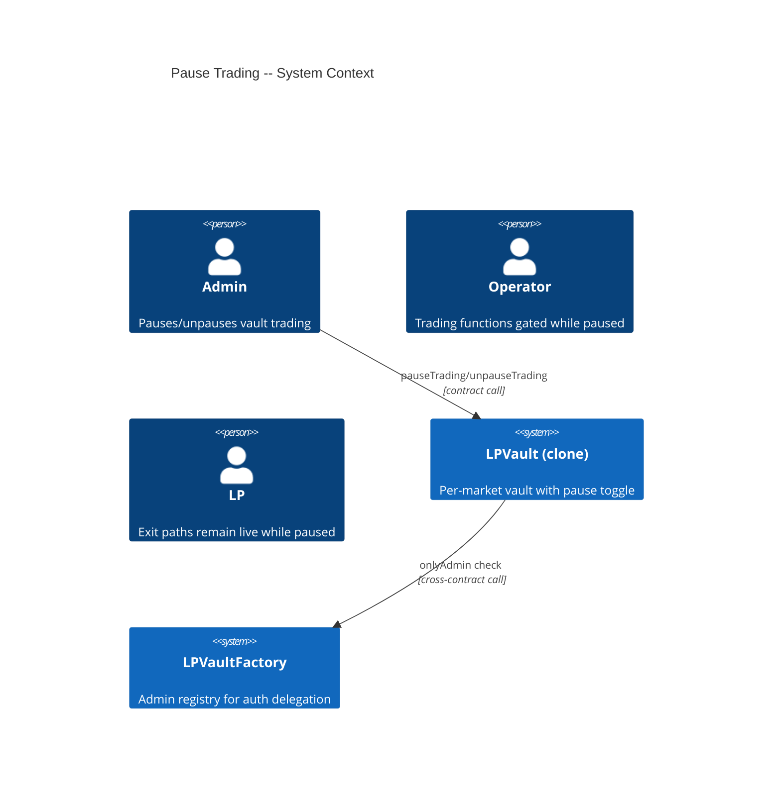
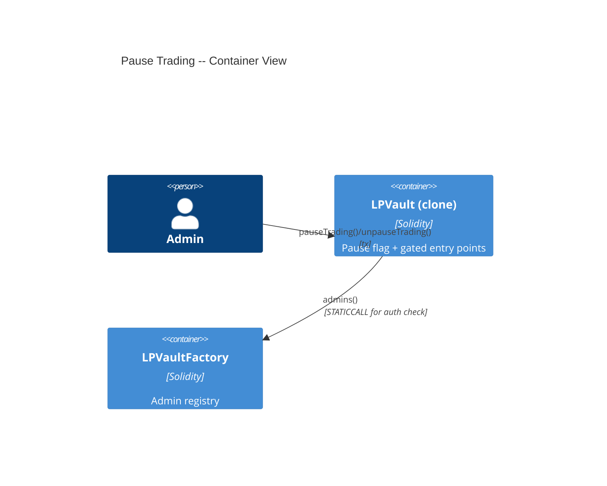
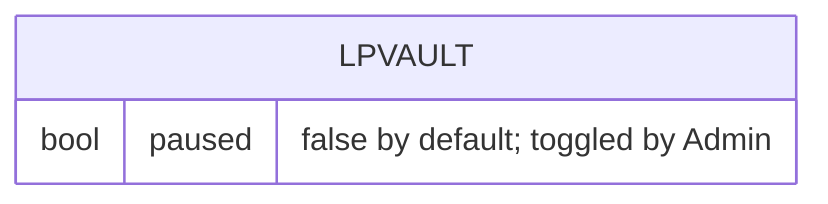

# Architecture: Pause Trading

## System Context (C4 L1)

## Container View (C4 L2)

## Data Model

**Invariants:**
- `paused` does not affect the vault's phase (Active/WindDown/Cancelled)
- While `paused == true`: `mintPositionFor`, `notifyFees`, `updateTick`, `mergePositions` revert
- While `paused == true`: `collect`, `reclaimDeposit`, `emergencyCancelAll` succeed
- `paused` is toggled only by Admin addresses

## Component Inventory

| File | Role | Key Exports |
|------|------|-------------|
| `src/LPVault.sol` | Vault with pause toggle | `pauseTrading()`, `unpauseTrading()`, `paused` flag, `TradingPaused`/`TradingUnpaused` events; `whenNotPaused` modifier on gated functions |
| `src/LPVaultFactory.sol` | Admin registry | `admins()` (read by vault's `onlyAdmin`) |

## Event Topology

| Event | Publisher | Payload | Condition | Consumers |
|-------|-----------|---------|-----------|-----------|
| `TradingPaused(address indexed caller)` | LPVault | `caller` | On successful `pauseTrading()` | Off-chain monitoring |
| `TradingUnpaused(address indexed caller)` | LPVault | `caller` | On successful `unpauseTrading()` | Off-chain monitoring |

**Non-events (explicit):**
- Failed pause/unpause (non-admin): no events emitted
- Gated function reverts while paused: no events emitted

## API Surface

| Method | Path | Handler | Auth | Request Shape | Response Shape | Error Codes |
|--------|------|---------|------|---------------|----------------|-------------|
| call | `LPVault.pauseTrading()` | `pauseTrading` | onlyAdmin | none | void | NotAdmin |
| call | `LPVault.unpauseTrading()` | `unpauseTrading` | onlyAdmin | none | void | NotAdmin |

## Integration Points

| System | Protocol | Direction | Purpose |
|--------|----------|-----------|---------|
| LPVaultFactory | STATICCALL `admins()` | outbound | Admin address verification for `onlyAdmin` check |

## Code Map

| Spec ID | Spec Name | Implementation Files |
|---------|-----------|---------------------|
| UC-K1MK | Pause and Unpause Vault | `src/LPVault.sol:pauseTrading()`, `src/LPVault.sol:unpauseTrading()` |
| SC-K1ML | Admin pauses + gated reverts | `src/LPVault.sol:pauseTrading()`, `whenNotPaused` modifier |
| SC-K1MM | Unpause returns to normal | `src/LPVault.sol:unpauseTrading()` |
| SC-K1MN | Non-admin revert | `src/LPVault.sol:pauseTrading()`, `src/LPVault.sol:unpauseTrading()` |
| SC-K1MO | Collect works while paused | `src/LPVault.sol:collect()` (no pause check) |
| SC-K1MP | ReclaimDeposit works while paused | `src/LPVault.sol:reclaimDeposit()` (no pause check) |

## Architecture Decisions

_None — pause follows the standard circuit-breaker pattern with a boolean flag and modifier._

## Testing Decisions

| Service/Pattern | Decision | Reason |
|-----------------|----------|--------|
| LPVaultFactory (Admin registry) | e2e | Vault delegates `onlyAdmin` to factory; test with real factory instance |
