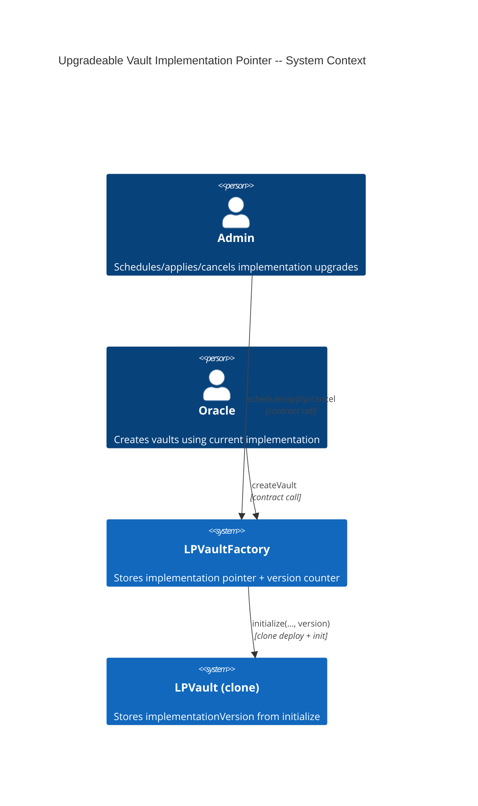
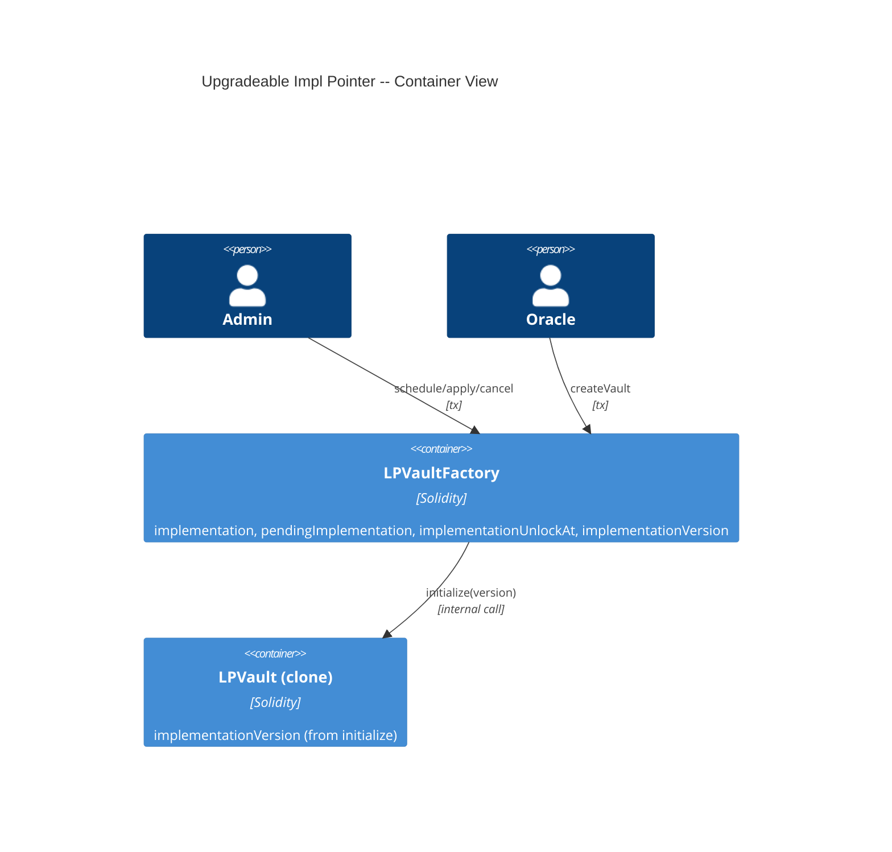
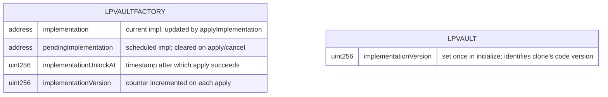

# Architecture: Upgradeable Vault Implementation Pointer

## System Context (C4 L1)

## Container View (C4 L2)

## Data Model

**Invariants:**
- `pendingImplementation != address(0)` iff a schedule is active
- `implementationVersion` is monotonically increasing on the factory
- Existing vaults' `implementationVersion` never changes after initialize
- `implementation` address is never address(0)

## Component Inventory

| File | Role | Key Exports |
|------|------|-------------|
| `src/LPVaultFactory.sol` | Factory with timelocked impl upgrade | `scheduleImplementation()`, `applyImplementation()`, `cancelScheduledImplementation()`, `pendingImplementation`, `implementationUnlockAt`, `implementationVersion` |
| `src/LPVault.sol` | Vault stores version from initialize | `implementationVersion` storage field |

## Event Topology

| Event | Publisher | Payload | Condition | Consumers |
|-------|-----------|---------|-----------|-----------|
| `ImplementationScheduled(address indexed newImpl, uint256 unlockAt)` | LPVaultFactory | `newImpl, unlockAt` | On successful `scheduleImplementation()` | Off-chain monitoring |
| `ImplementationApplied(address indexed newImpl, uint256 version)` | LPVaultFactory | `newImpl, version` | On successful `applyImplementation()` | Off-chain monitoring |
| `ImplementationCancelled(address indexed cancelledImpl)` | LPVaultFactory | `cancelledImpl` | On successful `cancelScheduledImplementation()` | Off-chain monitoring |

**Non-events (explicit):**
- Failed schedule/apply/cancel (non-admin, timelock not elapsed): no events emitted
- createVault does not emit new events beyond existing VaultCreated

## API Surface

| Method | Path | Handler | Auth | Request Shape | Response Shape | Error Codes |
|--------|------|---------|------|---------------|----------------|-------------|
| call | `LPVaultFactory.scheduleImplementation(address)` | `scheduleImplementation` | onlyAdmin | `newImpl` | void | NotAdmin, ZeroAddress, ScheduleAlreadyPending |
| call | `LPVaultFactory.applyImplementation()` | `applyImplementation` | onlyAdmin | none | void | NotAdmin, NoPendingSchedule, TimelockNotElapsed |
| call | `LPVaultFactory.cancelScheduledImplementation()` | `cancelScheduledImplementation` | onlyAdmin | none | void | NotAdmin, NoPendingSchedule |

## Integration Points

_None — implementation upgrade is a pure storage operation on the factory._

## Code Map

| Spec ID | Spec Name | Implementation Files |
|---------|-----------|---------------------|
| UC-KX5O | Schedule and Apply Implementation Upgrade | `src/LPVaultFactory.sol` |
| SC-KX5P | Admin schedules new implementation | `src/LPVaultFactory.sol:scheduleImplementation()` |
| SC-KX5Q | Admin applies after timelock | `src/LPVaultFactory.sol:applyImplementation()` |
| SC-KX5R | New vault uses updated implementation | `src/LPVaultFactory.sol:createVault()`, `src/LPVault.sol:initialize()` |
| SC-KX5S | Admin cancels pending schedule | `src/LPVaultFactory.sol:cancelScheduledImplementation()` |
| SC-KX5T | Apply reverts before timelock | `src/LPVaultFactory.sol:applyImplementation()` |
| SC-KX5U | Revert when no pending schedule | `src/LPVaultFactory.sol:applyImplementation()`, `cancelScheduledImplementation()` |
| SC-KX5V | Revert on zero address | `src/LPVaultFactory.sol:scheduleImplementation()` |
| SC-KX5W | Non-admin callers revert | `src/LPVaultFactory.sol` |

## Architecture Decisions

_None — follows the standard two-step timelock pattern for admin-gated upgrades._

## Testing Decisions

| Service/Pattern | Decision | Reason |
|-----------------|----------|--------|
| LPVaultFactory (Admin registry) | e2e | Use real factory instance for admin auth checks |
| Timelock | injection | Use `vm.warp` to advance past IMPLEMENTATION_TIMELOCK |
