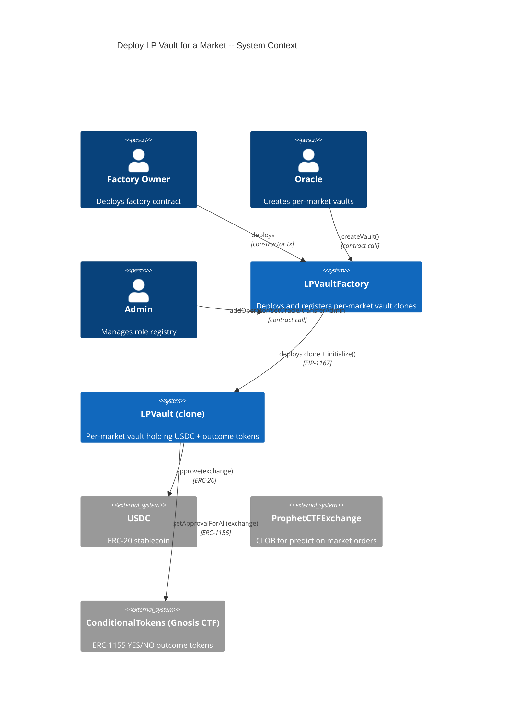
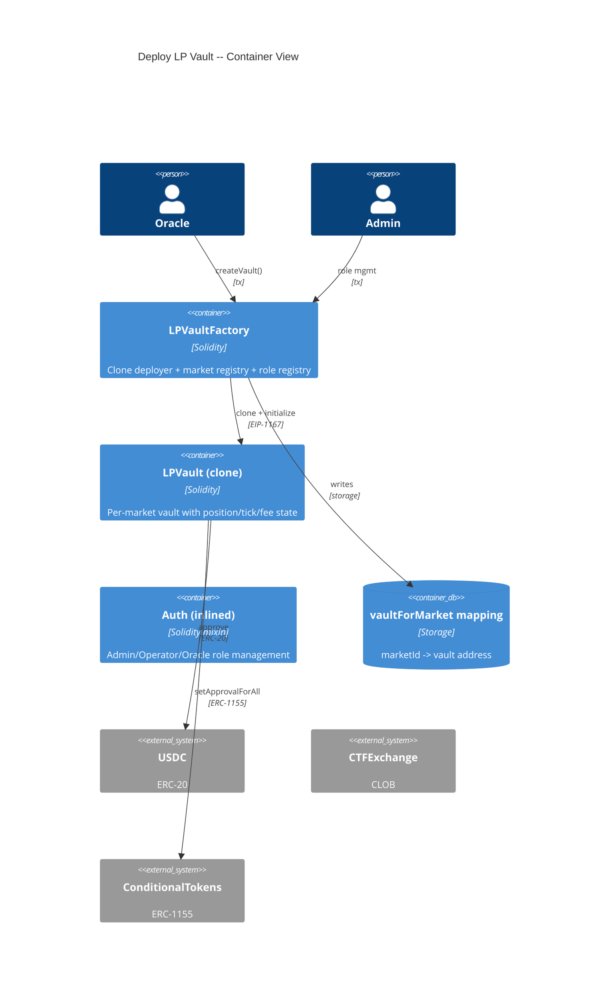
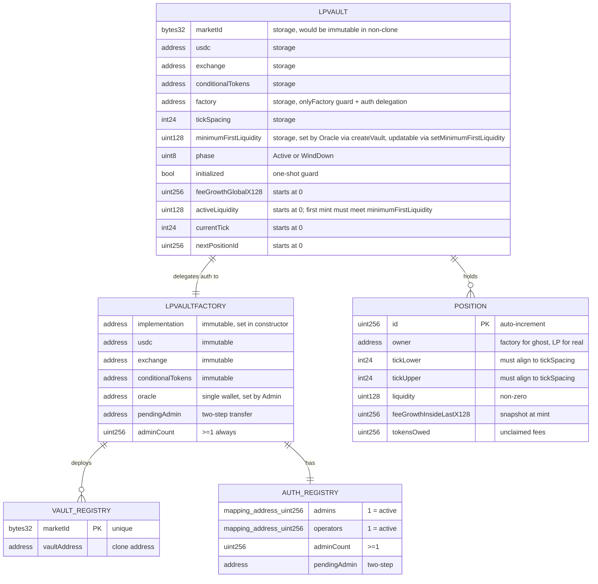
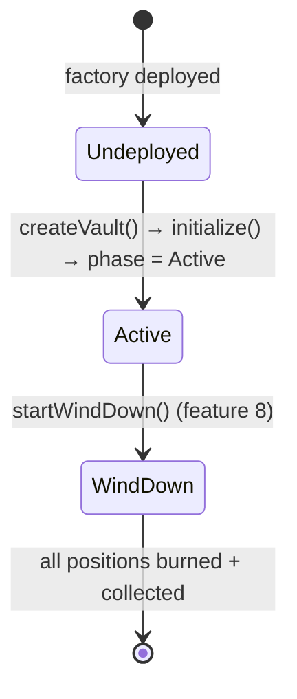

# Architecture: Deploy LP Vault for a Market

## System Context (C4 L1)

> Who uses this feature and what external systems does it touch?

## Container View (C4 L2)

> Which major components are involved and how do they communicate?

## Data Model

> Entity schemas with field constraints and invariants.

**Invariants:**
- `vaultForMarket[marketId]` is either zero (no vault) or the deployed clone address (immutable once set)
- `adminCount >= 1` always on the factory -- cannot remove the last admin
- `oracle != operators[x]` for any x where `operators[x] == 1` on the factory -- role separation
- Every vault clone's `factory` storage == the LPVaultFactory address that deployed it
- Vaults hold no local role state (operators, oracle, admins, pendingAdmin, adminCount) -- all authorization reads delegated to factory
- `initialized` flips from false to true exactly once per clone -- never resets
- All position-creation entry points on the vault are gated by `onlyOperator` -- no direct LP mint path exists
- When `activeLiquidity == 0`, the next mint must produce `liquidity >= minimumFirstLiquidity` or revert -- the first position is always materially large
- `minimumFirstLiquidity > 0` always -- enforced at `initialize()` and on every `setMinimumFirstLiquidity()` call; the floor cannot be disabled

## Component Inventory

> Files that participate in this feature.

| File | Role | Key Exports |
|------|------|-------------|
| `src/LPVaultFactory.sol` | Clone deployer + market registry + factory-level Auth | `createVault()`, `vaultForMarket`, admin/operator/oracle management |
| `src/LPVault.sol` | Per-market vault implementation (clone target) | `initialize()`, position/tick/fee state, vault-level Auth |
| `test/LPVaultFactory.t.sol` | Unit + integration tests for factory | Factory deployment, vault creation, role management scenarios |
| `test/LPVault.t.sol` | Unit tests for vault initialization | Initialization guards, approval setup, ghost position |

## Event Topology

> All events this feature emits or consumes.

| Event | Publisher | Payload | Condition | Consumers |
|-------|-----------|---------|-----------|-----------|
| `VaultCreated(bytes32 indexed marketId, address vault, uint128 minimumFirstLiquidity)` | LPVaultFactory | `marketId, vaultAddress, minimumFirstLiquidity` | On successful `createVault()` | Off-chain Event Listener |
| `MinimumFirstLiquidityUpdated(uint128 oldMin, uint128 newMin)` | LPVault | `oldMin, newMin` | On successful `setMinimumFirstLiquidity()` | Off-chain monitoring |
| `NewAdmin(address indexed admin, address indexed caller)` | LPVaultFactory / LPVault | `admin, caller` | On `addAdmin()` or `acceptAdmin()` | Off-chain monitoring |
| `RemovedAdmin(address indexed admin, address indexed caller)` | LPVaultFactory / LPVault | `admin, caller` | On `removeAdmin()` or `renounceAdminRole()` | Off-chain monitoring |
| `NewOperator(address indexed operator, address indexed caller)` | LPVaultFactory / LPVault | `operator, caller` | On `addOperator()` | Off-chain monitoring |
| `RemovedOperator(address indexed operator, address indexed caller)` | LPVaultFactory / LPVault | `operator, caller` | On `removeOperator()` | Off-chain monitoring |
| `AdminTransferProposed(address indexed currentAdmin, address indexed proposedAdmin)` | LPVaultFactory / LPVault | `currentAdmin, proposedAdmin` | On `transferAdmin()` | Off-chain monitoring |

**Non-events (explicit):**
- Constructor deployment: no custom events emitted (only standard EVM creation receipt)
- Failed `createVault` (duplicate, wrong caller): no events emitted
- `createVault` does not emit `PositionMinted` -- no position is minted at vault creation under the operator-executes-all model

## API Surface

> Contract functions (entry points) belonging to this feature.

| Method | Path | Handler | Auth | Request Shape | Response Shape | Error Codes |
|--------|------|---------|------|---------------|----------------|-------------|
| call | `LPVaultFactory.createVault(bytes32,int24,uint128)` | `createVault` | onlyOracle | `marketId, tickSpacing, minimumFirstLiquidity` | `address vault` | DuplicateMarket, NotOracle, ZeroFloor |
| call | `LPVault.setMinimumFirstLiquidity(uint128)` | `setMinimumFirstLiquidity` | onlyOracle | `newMin` | void | NotOracle, ZeroFloor |
| call | `LPVaultFactory.addOperator(address)` | `addOperator` | onlyAdmin | `operator_` | void | NotAdmin, RoleSeparation |
| call | `LPVaultFactory.removeOperator(address)` | `removeOperator` | onlyAdmin | `operator` | void | NotAdmin |
| call | `LPVaultFactory.setOracle(address)` | `setOracle` | onlyAdmin | `newOracle` | void | NotAdmin, RoleSeparation |
| call | `LPVaultFactory.transferAdmin(address)` | `transferAdmin` | onlyAdmin | `newAdmin` | void | NotAdmin, ZeroAddress, AlreadyAdmin |
| call | `LPVaultFactory.acceptAdmin()` | `acceptAdmin` | pendingAdmin only | none | void | NotPendingAdmin, AlreadyAdmin |
| call | `LPVault.initialize(...)` | `initialize` | onlyFactory | `marketId, usdc, exchange, conditionalTokens, tickSpacing, factory, minimumFirstLiquidity` | void | AlreadyInitialized, NotFactory, ZeroFloor |

## Integration Points

> External services, event streams, and infrastructure dependencies.

| System | Protocol | Direction | Purpose |
|--------|----------|-----------|---------|
| USDC (ERC-20) | ERC-20 `approve` | outbound (approval only) | Vault approves exchange for unlimited USDC spending at fill time |
| ConditionalTokens (Gnosis CTF) | ERC-1155 `setApprovalForAll` | outbound | Vault approves exchange to pull YES/NO outcome tokens |
| ProphetCTFExchange | ERC-20/ERC-1155 allowances | outbound (approval only) | Pre-approved by vault to atomically pull capital at fill time |

## State Transitions

> Vault lifecycle (only the creation subset relevant to this feature).

## Code Map

> Links spec IDs to implementation files.

| Spec ID | Spec Name | Implementation Files |
|---------|-----------|---------------------|
| UC-REQ0 | Deploy Factory | `src/LPVaultFactory.sol:constructor()` |
| SC-REQ3 | Successful deployment | `src/LPVaultFactory.sol:constructor()` |
| SC-REQ4 | Oracle equals operator revert | `src/LPVaultFactory.sol:constructor()` |
| SC-REQ5 | Implementation not initializable | `src/LPVault.sol:constructor()` |
| UC-REQ1 | Create Vault for Market | `src/LPVaultFactory.sol:createVault()`, `src/LPVault.sol:initialize()` |
| SC-REQ6 | Successful vault creation | `src/LPVaultFactory.sol:createVault()`, `src/LPVault.sol:initialize()` |
| SC-REQ7 | Duplicate marketId revert | `src/LPVaultFactory.sol:createVault()` |
| SC-REQ8 | Non-Oracle caller revert | `src/LPVaultFactory.sol:createVault()` |
| SC-REQ9 | Re-initialization revert | `src/LPVault.sol:initialize()` |
| SC-REQA | Only factory can initialize | `src/LPVault.sol:initialize()` |
| SC-RG74 | createVault reverts on zero floor | `src/LPVaultFactory.sol:createVault()`, `src/LPVault.sol:initialize()` |
| SC-RG75 | Oracle updates minimumFirstLiquidity | `src/LPVault.sol:setMinimumFirstLiquidity()` |
| SC-RG76 | Non-Oracle setMinimumFirstLiquidity revert | `src/LPVault.sol:setMinimumFirstLiquidity()` |
| SC-RG77 | setMinimumFirstLiquidity zero revert | `src/LPVault.sol:setMinimumFirstLiquidity()` |
| UC-REQ2 | Manage Roles on Factory | `src/LPVaultFactory.sol:addOperator()`, `src/LPVaultFactory.sol:removeOperator()`, `src/LPVaultFactory.sol:setOracle()`, `src/LPVaultFactory.sol:transferAdmin()`, `src/LPVaultFactory.sol:acceptAdmin()` |
| SC-REQB | Add operator successfully | `src/LPVaultFactory.sol:addOperator()` |
| SC-REQC | Add operator revert (oracle) | `src/LPVaultFactory.sol:addOperator()` |
| SC-REQD | Remove operator | `src/LPVaultFactory.sol:removeOperator()` |
| SC-REQE | Set oracle successfully | `src/LPVaultFactory.sol:setOracle()` |
| SC-REQF | Set oracle revert (operator) | `src/LPVaultFactory.sol:setOracle()` |
| SC-REQG | Two-step admin transfer | `src/LPVaultFactory.sol:transferAdmin()`, `src/LPVaultFactory.sol:acceptAdmin()` |
| SC-REQH | Non-admin revert | `src/LPVaultFactory.sol:addOperator()`, `src/LPVaultFactory.sol:removeOperator()`, `src/LPVaultFactory.sol:setOracle()`, `src/LPVaultFactory.sol:transferAdmin()` |
| SC-FKD4 | Operator rotation propagates to existing vaults | `src/LPVaultFactory.sol:removeOperator()`, `src/LPVaultFactory.sol:addOperator()`, `src/LPVault.sol:onlyOperator` |
| SC-FKD5 | Oracle rotation propagates to existing vaults | `src/LPVaultFactory.sol:setOracle()`, `src/LPVault.sol:onlyOracle` |

## Architecture Decisions

**ADR-RER0:** EIP-1167 clone pattern with storage-based config
In the context of deploying one vault per market, facing the constraint that EIP-1167 clones share the implementation's bytecode (so `immutable` values are shared), we decided to store all per-vault configuration (`marketId`, `usdc`, `exchange`, `conditionalTokens`, `oracle`, `tickSpacing`) in storage set during `initialize()` to achieve correct per-vault isolation, accepting the marginal gas overhead of SLOAD vs. bytecode-embedded constants.

**ADR-RER1:** Inlined Auth pattern on factory, factory-delegated on vaults
In the context of role management, facing the pattern policy that forbids importing library implementations, we decided to inline the Auth pattern from `ctf-exchange/lib/ctf-exchange/src/exchange/mixins/Auth.sol` on the factory (with the addition of `setOracle` and role separation checks) and have vaults delegate all role checks to the factory via cross-contract calls. This achieves a single source of truth for roles — key rotation on the factory propagates immediately to all existing vaults — while maintaining a smaller audit surface and no transitive dependency risk. We accept the marginal gas overhead of one SLOAD + CALL per gated vault function (cold ~2600 gas, warm ~100 gas per subsequent call in the same tx).

**ADR-RFS9:** Operator-gated minting + per-vault minimum-first-liquidity floor for inflation-grief protection
In the context of first-LP protection, facing the risk that a tiny first position can manipulate `feeGrowthGlobalX128` initialization (the v3 analog of the ERC-4626 first-depositor inflation attack), we decided to (a) route every position-creation entry point through an `onlyOperator` gate so no public mint path exists, and (b) enforce on-chain that the next mint while `activeLiquidity == 0` must produce `liquidity >= minimumFirstLiquidity`, where `minimumFirstLiquidity` is supplied per-market by the Oracle at `createVault` time and adjustable later via `setMinimumFirstLiquidity` (also `onlyOracle`). The floor cannot be set to zero. This achieves attack-resistance without locking capital per-vault while giving the Oracle per-market control to size the floor against expected market depth. We accept that the Operator is now in the path of every LP onboarding -- a trust assumption already established by the OPERATOR TRUST ASSUMPTION pattern in CLAUDE.md and mirrored from the CTF Exchange's operator-matched order flow -- and that lowering the floor requires a compromised Oracle to collude with a compromised Operator before an inflation grief becomes possible (two-of-two compromise).

**Rejected alternative -- ghost position:** We initially considered minting a permanently-locked full-range "ghost" position funded by the Oracle (~1000 USDC per vault) to keep `activeLiquidity > 0` from block one. Rejected because Prophet currently runs hundreds of markets, most of which will never see a second LP; locking ~1000 USDC into each vault is not insurance, it's a tax on every market's existence. Operator gating gives equivalent attack resistance with zero locked capital.

**Rejected alternative -- LP allowlist (separate `lps` role):** We considered adding a fourth role to the Auth registry so only allowlisted LPs could mint. Rejected because the Operator already vets every position credit under the operator-executes-all model -- adding an `lps` mapping duplicates that gate without adding security.

## Testing Decisions

| Service/Pattern | Decision | Reason |
|-----------------|----------|--------|
| USDC (ERC-20) | e2e with mock token | Deploy a minimal ERC-20 mock in test setup; no external dependency |
| ConditionalTokens (ERC-1155) | e2e with mock | Deploy a minimal ERC-1155 mock; vault only calls `setApprovalForAll` |
| ProphetCTFExchange | e2e with mock address | Vault only sets approvals; no exchange logic invoked in this feature |
| EIP-1167 clone deployment | e2e | Foundry natively supports clone deployment and testing |
