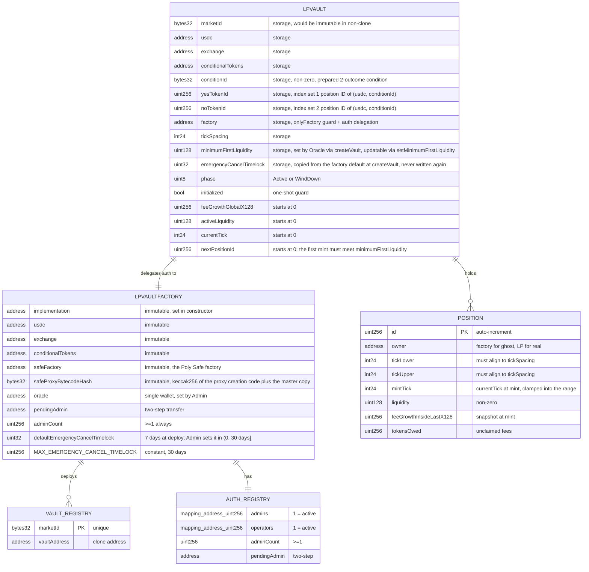
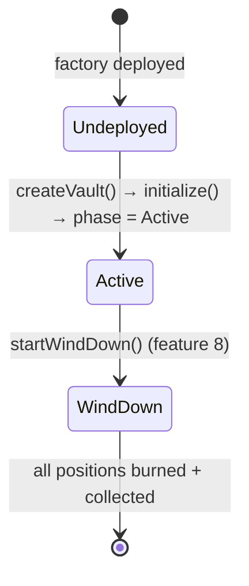

# Architecture: Deploy LP Vault for a Market

## System Context (C4 L1)

> Who uses this feature and what external systems does it touch?

```mermaid
C4Context
    title Deploy LP Vault for a Market -- System Context
    Person(factoryOwner, "Factory Owner", "Deploys factory contract")
    Person(oracle, "Oracle", "Creates per-market vaults")
    Person(admin, "Admin", "Manages role registry")
    System(factory, "LPVaultFactory", "Deploys and registers per-market vault clones")
    System(vault, "LPVault (clone)", "Per-market vault holding USDC + outcome tokens")
    System_Ext(usdc, "USDC", "ERC-20 stablecoin")
    System_Ext(ctfExchange, "ProphetCTFExchange", "CLOB for prediction market orders")
    System_Ext(conditionalTokens, "ConditionalTokens (Gnosis CTF)", "ERC-1155 YES/NO outcome tokens")
    Rel(factoryOwner, factory, "deploys", "constructor tx")
    Rel(oracle, factory, "createVault()", "contract call")
    Rel(admin, factory, "addOperator/setOracle/transferAdmin/setDefaultEmergencyCancelTimelock", "contract call")
    Rel(factory, vault, "deploys clone + initialize()", "EIP-1167")
    Rel(vault, usdc, "approve(exchange)", "ERC-20")
    Rel(vault, conditionalTokens, "setApprovalForAll(exchange)", "ERC-1155")
    Rel(factory, conditionalTokens, "getOutcomeSlotCount/getCollectionId/getPositionId", "view call")
```

## Container View (C4 L2)

> Which major components are involved and how do they communicate?

```mermaid
C4Container
    title Deploy LP Vault -- Container View
    Person(oracle, "Oracle")
    Person(admin, "Admin")
    Container(factory, "LPVaultFactory", "Solidity", "Clone deployer + market registry + role registry")
    Container(vault, "LPVault (clone)", "Solidity", "Per-market vault with position/tick/fee state")
    Container(auth, "Auth (inlined)", "Solidity mixin", "Admin/Operator/Oracle role management")
    ContainerDb(registry, "vaultForMarket mapping", "Storage", "marketId -> vault address")
    System_Ext(usdc, "USDC", "ERC-20")
    System_Ext(ctfExchange, "CTFExchange", "CLOB")
    System_Ext(ctf, "ConditionalTokens", "ERC-1155")
    Rel(oracle, factory, "createVault()", "tx")
    Rel(admin, factory, "role mgmt", "tx")
    Rel(factory, vault, "clone + initialize", "EIP-1167")
    Rel(factory, registry, "writes", "storage")
    Rel(vault, usdc, "approve", "ERC-20")
    Rel(vault, ctf, "setApprovalForAll", "ERC-1155")
    Rel(factory, ctf, "verify outcome-token identity", "view call")
```

## Data Model

> Entity schemas with field constraints and invariants.

```mermaid
erDiagram
    LPVAULTFACTORY {
        address implementation "immutable, set in constructor"
        address usdc "immutable"
        address exchange "immutable"
        address conditionalTokens "immutable"
        address safeFactory "immutable, the Poly Safe factory"
        bytes32 safeProxyBytecodeHash "immutable, keccak256 of the proxy creation code plus the master copy"
        address oracle "single wallet, set by Admin"
        address pendingAdmin "two-step transfer"
        uint256 adminCount ">=1 always"
        uint32 defaultEmergencyCancelTimelock "7 days at deploy; Admin sets it in (0, 30 days]"
        uint256 MAX_EMERGENCY_CANCEL_TIMELOCK "constant, 30 days"
    }
    LPVAULTFACTORY ||--o{ VAULT_REGISTRY : "deploys"
    VAULT_REGISTRY {
        bytes32 marketId PK "unique"
        address vaultAddress "clone address"
    }
    LPVAULT {
        bytes32 marketId "storage, would be immutable in non-clone"
        address usdc "storage"
        address exchange "storage"
        address conditionalTokens "storage"
        bytes32 conditionId "storage, non-zero, prepared 2-outcome condition"
        uint256 yesTokenId "storage, index set 1 position ID of (usdc, conditionId)"
        uint256 noTokenId "storage, index set 2 position ID of (usdc, conditionId)"
        address factory "storage, onlyFactory guard + auth delegation"
        int24 tickSpacing "storage"
        uint128 minimumFirstLiquidity "storage, set by Oracle via createVault, updatable via setMinimumFirstLiquidity"
        uint32 emergencyCancelTimelock "storage, copied from the factory default at createVault, never written again"
        uint8 phase "Active or WindDown"
        bool initialized "one-shot guard"
        uint256 feeGrowthGlobalX128 "starts at 0"
        uint128 activeLiquidity "starts at 0"
        int24 currentTick "starts at 0"
        uint256 nextPositionId "starts at 0; the first mint must meet minimumFirstLiquidity"
    }
    LPVAULT ||--o{ POSITION : "holds"
    POSITION {
        uint256 id PK "auto-increment"
        address owner "factory for ghost, LP for real"
        int24 tickLower "must align to tickSpacing"
        int24 tickUpper "must align to tickSpacing"
        int24 mintTick "currentTick at mint, clamped into the range"
        uint128 liquidity "non-zero"
        uint256 feeGrowthInsideLastX128 "snapshot at mint"
        uint256 tokensOwed "unclaimed fees"
    }
    AUTH_REGISTRY {
        mapping_address_uint256 admins "1 = active"
        mapping_address_uint256 operators "1 = active"
        uint256 adminCount ">=1"
        address pendingAdmin "two-step"
    }
    LPVAULTFACTORY ||--|| AUTH_REGISTRY : "has"
    LPVAULT ||--|| LPVAULTFACTORY : "delegates auth to"
```

**Invariants:**
- `vaultForMarket[marketId]` is either zero (no vault) or the deployed clone address (immutable once set)
- `adminCount >= 1` always on the factory -- cannot remove the last admin
- `oracle != operators[x]` for any x where `operators[x] == 1` on the factory -- role separation
- Every vault clone's `factory` storage == the LPVaultFactory address that deployed it
- Vaults hold no local role state (operators, oracle, admins, pendingAdmin, adminCount) -- all authorization reads delegated to factory
- Vaults hold no Safe derivation input -- `safeFactory` and `safeProxyBytecodeHash` are read from the factory at call time, and no function on the factory changes them
- `initialized` flips from false to true exactly once per clone -- never resets
- All position-creation entry points on the vault are gated by `onlyOperator` -- no direct LP mint path exists
- When `nextPositionId == 0`, the next mint must produce `liquidity >= minimumFirstLiquidity` or revert -- the first position is always materially large, and the floor applies exactly once
- `minimumFirstLiquidity > 0` always -- enforced at `createVault()` and on every `setMinimumFirstLiquidity()` call; the floor cannot be disabled
- Every successful ERC-1155 receiver-hook invocation on a vault has `msg.sender == conditionalTokens` -- the vault never acknowledges tokens from any other ERC-1155 contract
- The receiver hooks are pure with respect to vault state -- no position, tick, or fee-accumulator storage is written by an inbound transfer
- `adminCount` equals the number of addresses with `admins[x] == 1` on the factory
- A removed or renounced address cannot regain the admin role without a new `transferAdmin` or `addAdmin` call by a current Admin
- `conditionId != 0`, `yesTokenId != 0`, `noTokenId != 0`, and `yesTokenId != noTokenId` on every initialized vault
- `yesTokenId` is the index set 1 position ID and `noTokenId` is the index set 2 position ID of `(usdc, conditionId)`, checked once at `createVault`, and none of the three values is written again
- Every successful receiver-hook call carries only IDs in `{yesTokenId, noTokenId}`
- `0 < defaultEmergencyCancelTimelock <= 30 days` on the factory in every reachable state
- Every vault's `emergencyCancelTimelock` equals the factory default as it stood at that vault's creation, and no function writes it after `initialize`

## Component Inventory

> Files that participate in this feature.

| File | Role | Key Exports |
|------|------|-------------|
| `src/LPVaultFactory.sol` | Clone deployer + market registry + factory-level Auth + outcome-token identity check before clone deployment + the two Safe derivation inputs + the default emergency-cancel timelock | `createVault()`, `_validateOutcomeIdentity()`, `vaultForMarket`, `safeFactory`, `safeProxyBytecodeHash`, `defaultEmergencyCancelTimelock`, `MAX_EMERGENCY_CANCEL_TIMELOCK`, `setDefaultEmergencyCancelTimelock()`, admin/operator/oracle management, `ZeroConditionId`, `ZeroTokenId`, `DuplicateTokenId`, `NotBinaryCondition`, `TokenIdMismatch`, `ZeroBytecodeHash`, `ZeroTimelock`, `TimelockTooLong` |
| `src/LPVault.sol` | Per-market vault implementation (clone target), with the token ID restriction in the receiver hooks | `initialize()`, `conditionId`, `yesTokenId`, `noTokenId`, `emergencyCancelTimelock`, `_requireOwnTokenId()`, `UnknownTokenId`, inline `IConditionalTokens`, position/tick/fee state, vault-level Auth |
| `test/features/FEAT-REPZ-deploy-lp-vault-for-a-market/UC-REQ0-deploy-factory.t.sol` | Integration tests for Deploy Factory | Factory deployment, role-separation revert, implementation-not-initializable and clone-initializable scenarios, factory and vault modifier checks |
| `test/features/FEAT-REPZ-deploy-lp-vault-for-a-market/UC-REQ1-create-vault-for-market.t.sol` | Integration tests for Create Vault for Market | Vault creation, duplicate-market and non-oracle reverts, initialization guards, minimum-first-liquidity floor, the default emergency-cancel timelock and its copy, ERC-1155 receiver hooks |
| `test/features/FEAT-REPZ-deploy-lp-vault-for-a-market/UC-REQ2-manage-roles-on-factory.t.sol` | Integration tests for Manage Roles on Factory | Operator, oracle, and admin role management scenarios, and role propagation to vaults |
| `test/fixtures/ConditionalTokensFixture.sol` | Test fixture -- real ConditionalTokens bytecode, binary condition setup, vault creation with a verified identity, complete-set minting for holders | `ITestConditionalTokens`, `_deployConditionalTokens()`, `_prepareBinaryCondition()`, `_createVault()`, `_mintCompleteSets()`, `_binaryPartition()` |
| `test/fixtures/MockERC20.sol` | Test fixture -- the one USDC mock of the suite | `MockERC20` |
| `test/fixtures/VaultStorage.sol` | Test fixture -- vault storage writes through forge-std `stdStorage`, with no slot numbers | `setFeeGrowthInsideLast()`, `setFeeGrowthOutside()` |
| `test/fixtures/LPVaultFixture.sol` | Test fixture -- factory deployment with the made-up Safe derivation constants, signing helpers, Safe derivation, escrow-then-mint | `SAFE_FACTORY`, `SAFE_PROXY_BYTECODE_HASH`, `_deployFactory()`, `_safeOf()`, `_signMintIntent()`, `_signReclaimIntent()`, `_fundSafe()`, `_escrow()`, `_escrowAndMint()` |

## Event Topology

> All events this feature emits or consumes.

| Event | Publisher | Payload | Condition | Consumers |
|-------|-----------|---------|-----------|-----------|
| `VaultCreated(bytes32 indexed marketId, address vault, uint128 minimumFirstLiquidity)` | LPVaultFactory | `marketId, vaultAddress, minimumFirstLiquidity` | On successful `createVault()` | Off-chain Event Listener |
| `MinimumFirstLiquidityUpdated(uint128 oldMin, uint128 newMin)` | LPVault | `oldMin, newMin` | On successful `setMinimumFirstLiquidity()` | Off-chain monitoring |
| `DefaultEmergencyCancelTimelockUpdated(uint32 oldTimelock, uint32 newTimelock)` | LPVaultFactory | `oldTimelock, newTimelock` | On successful `setDefaultEmergencyCancelTimelock()` | Off-chain monitoring |
| `NewAdmin(address indexed admin, address indexed caller)` | LPVaultFactory | `admin, caller` | On `addAdmin()` or `acceptAdmin()` | Off-chain monitoring |
| `RemovedAdmin(address indexed admin, address indexed caller)` | LPVaultFactory | `admin, caller` | On `removeAdmin()` or `renounceAdminRole()` | Off-chain monitoring |
| `NewOperator(address indexed operator, address indexed caller)` | LPVaultFactory / LPVault | `operator, caller` | On `addOperator()` | Off-chain monitoring |
| `RemovedOperator(address indexed operator, address indexed caller)` | LPVaultFactory / LPVault | `operator, caller` | On `removeOperator()` | Off-chain monitoring |
| `AdminTransferProposed(address indexed currentAdmin, address indexed proposedAdmin)` | LPVaultFactory / LPVault | `currentAdmin, proposedAdmin` | On `transferAdmin()` | Off-chain monitoring |

**Non-events (explicit):**
- Constructor deployment: no custom events emitted (only standard EVM creation receipt)
- Failed `createVault` (duplicate, wrong caller): no events emitted
- Failed `createVault` on a malformed, non-binary, or mismatched outcome-token identity: no events emitted
- `VaultCreated` does not carry the outcome-token identity -- the vault exposes `conditionId`, `yesTokenId`, and `noTokenId` as public getters
- `VaultCreated` does not carry the timelock: the vault exposes `emergencyCancelTimelock()`
- Failed `setDefaultEmergencyCancelTimelock` (non-Admin, zero, above 30 days): no events emitted
- `createVault` does not emit `PositionMinted` -- no position is minted at vault creation under the operator-executes-all model

## API Surface

> Contract functions (entry points) belonging to this feature.

| Method | Path | Handler | Auth | Request Shape | Response Shape | Error Codes |
|--------|------|---------|------|---------------|----------------|-------------|
| call | `LPVaultFactory.createVault(bytes32,int24,uint128,bytes32,uint256,uint256)` | `createVault` | onlyOracle | `marketId, tickSpacing, minimumFirstLiquidity, conditionId, yesTokenId, noTokenId` | `address vault` | DuplicateMarket, NotOracle, ZeroFloor, ZeroConditionId, ZeroTokenId, DuplicateTokenId, NotBinaryCondition, TokenIdMismatch |
| call | `LPVault.setMinimumFirstLiquidity(uint128)` | `setMinimumFirstLiquidity` | onlyOracle | `newMin` | void | NotOracle, ZeroFloor |
| call | `LPVaultFactory.setDefaultEmergencyCancelTimelock(uint32)` | `setDefaultEmergencyCancelTimelock` | onlyAdmin | `newTimelock` | void | NotAdmin, ZeroTimelock, TimelockTooLong |
| call | `LPVaultFactory.addOperator(address)` | `addOperator` | onlyAdmin | `operator_` | void | NotAdmin, RoleSeparation |
| call | `LPVaultFactory.removeOperator(address)` | `removeOperator` | onlyAdmin | `operator` | void | NotAdmin |
| call | `LPVaultFactory.setOracle(address)` | `setOracle` | onlyAdmin | `newOracle` | void | NotAdmin, RoleSeparation |
| call | `LPVaultFactory.transferAdmin(address)` | `transferAdmin` | onlyAdmin | `newAdmin` | void | NotAdmin, ZeroAddress, AlreadyAdmin |
| call | `LPVaultFactory.acceptAdmin()` | `acceptAdmin` | pendingAdmin only | none | void | NotPendingAdmin, AlreadyAdmin |
| call | `LPVaultFactory.addAdmin(address)` | `addAdmin` | onlyAdmin | `admin_` | void | NotAdmin, ZeroAddress |
| call | `LPVaultFactory.removeAdmin(address)` | `removeAdmin` | onlyAdmin | `admin` | void | NotAdmin, CannotRemoveLastAdmin |
| call | `LPVaultFactory.renounceAdminRole()` | `renounceAdminRole` | onlyAdmin | none | void | NotAdmin, CannotRemoveLastAdmin |
| call | `LPVault.initialize(...)` | `initialize` | onlyFactory | `marketId, usdc, exchange, conditionalTokens, tickSpacing, factory, minimumFirstLiquidity, version, conditionId, yesTokenId, noTokenId` (reads `defaultEmergencyCancelTimelock()` from the factory) | void | AlreadyInitialized, NotFactory |
| call | `LPVault.onERC1155Received(address,address,uint256,uint256,bytes)` | `onERC1155Received` | onlyConditionalTokens | `operator, from, id, value, data` | `bytes4` (`0xf23a6e61`) | NotConditionalTokens, UnknownTokenId |
| call | `LPVault.onERC1155BatchReceived(address,address,uint256[],uint256[],bytes)` | `onERC1155BatchReceived` | onlyConditionalTokens | `operator, from, ids, values, data` | `bytes4` (`0xbc197c81`) | NotConditionalTokens, UnknownTokenId |
| call | `LPVault.supportsInterface(bytes4)` | `supportsInterface` | public view | `interfaceId` | `bool` | none |

## Integration Points

> External services, event streams, and infrastructure dependencies.

| System | Protocol | Direction | Purpose |
|--------|----------|-----------|---------|
| USDC (ERC-20) | ERC-20 `approve` | outbound (approval only) | Vault approves exchange for unlimited USDC spending at fill time |
| ConditionalTokens (Gnosis CTF) | ERC-1155 `setApprovalForAll` | outbound | Vault approves exchange to pull YES/NO outcome tokens |
| ConditionalTokens (Gnosis CTF) | ERC-1155 receiver hooks | inbound | Vault acknowledges `safeTransferFrom` / `safeBatchTransferFrom` of its own two outcome tokens; rejects hook calls from any other address and any other token ID |
| ConditionalTokens (Gnosis CTF) | `getOutcomeSlotCount`, `getCollectionId`, `getPositionId` view calls | outbound, read-only | The factory checks the Oracle-supplied identity at `createVault` |
| ProphetCTFExchange | ERC-20/ERC-1155 allowances | outbound (approval only) | Pre-approved by vault to atomically pull capital at fill time |

## State Transitions

> Vault lifecycle (only the creation subset relevant to this feature).

```mermaid
stateDiagram-v2
    state "Undeployed" as s0
    state "Active" as s1
    state "WindDown" as s2
    [*] --> s0 : factory deployed
    s0 --> s1 : createVault() → initialize() → phase = Active
    s1 --> s2 : startWindDown() (feature 8)
    s2 --> [*] : all positions burned + collected
```

## Code Map

> Links spec IDs to implementation files.

| Spec ID | Spec Name | Implementation Files |
|---------|-----------|---------------------|
| UC-REQ0 | Deploy Factory | `src/LPVaultFactory.sol:constructor()` |
| SC-REQ3 | Successful deployment | `src/LPVaultFactory.sol:constructor()` (roles, addresses, and the 7-day default timelock) |
| SC-REQ4 | Oracle equals operator revert | `src/LPVaultFactory.sol:constructor()` |
| SC-9OY7 | Zero Safe derivation input reverts | `src/LPVaultFactory.sol:constructor()` |
| SC-REQ5 | Implementation not initializable | `src/LPVault.sol:constructor()` |
| UC-REQ1 | Create Vault for Market | `src/LPVaultFactory.sol:createVault()`, `src/LPVault.sol:initialize()` |
| SC-REQ6 | Successful vault creation | `src/LPVaultFactory.sol:createVault()`, `src/LPVault.sol:initialize()` |
| SC-REQ7 | Duplicate marketId revert | `src/LPVaultFactory.sol:createVault()` |
| SC-REQ8 | Non-Oracle caller revert | `src/LPVaultFactory.sol:createVault()` |
| SC-REQ9 | Re-initialization revert | `src/LPVault.sol:initialize()` |
| SC-REQA | Only factory can initialize | `src/LPVault.sol:initialize()` |
| SC-RG74 | createVault reverts on zero floor | `src/LPVaultFactory.sol:createVault()`, `src/LPVault.sol:initialize()` |
| SC-RG75 | Oracle updates minimumFirstLiquidity | `src/LPVault.sol:setMinimumFirstLiquidity()` |
| SC-RG76 | Non-Oracle setMinimumFirstLiquidity revert | `src/LPVault.sol:setMinimumFirstLiquidity()` |
| SC-RG77 | setMinimumFirstLiquidity zero revert | `src/LPVault.sol:setMinimumFirstLiquidity()` |
| SC-BZC2 | Admin changes the default timelock, and only later vaults copy it | `src/LPVaultFactory.sol:setDefaultEmergencyCancelTimelock()`, `src/LPVaultFactory.sol:createVault()`, `src/LPVault.sol:initialize()` |
| SC-BZC3 | The setter rejects zero and a value above 30 days | `src/LPVaultFactory.sol:setDefaultEmergencyCancelTimelock()` |
| SC-BZC4 | Non-Admin cannot change the default timelock | `src/LPVaultFactory.sol:setDefaultEmergencyCancelTimelock()`, `src/LPVaultFactory.sol:onlyAdmin` |
| SC-3WLL | Vault accepts single ERC-1155 transfer | `src/LPVault.sol:onERC1155Received()`, `src/LPVault.sol:_requireOwnTokenId()` |
| SC-3WLM | Vault accepts batch ERC-1155 transfer | `src/LPVault.sol:onERC1155BatchReceived()`, `src/LPVault.sol:_requireOwnTokenId()` |
| SC-3WLN | Receiver hook from non-ConditionalTokens reverts | `src/LPVault.sol:onERC1155Received()`, `src/LPVault.sol:onERC1155BatchReceived()`, `src/LPVault.sol:onlyConditionalTokens` |
| SC-3WLO | Vault reports IERC1155Receiver support | `src/LPVault.sol:supportsInterface()` |
| SC-6HBV | createVault reverts on a malformed outcome-token identity | `src/LPVaultFactory.sol:createVault()`, `src/LPVaultFactory.sol:_validateOutcomeIdentity()` |
| SC-6HBW | createVault reverts when the condition is not a prepared binary condition | `src/LPVaultFactory.sol:createVault()`, `src/LPVaultFactory.sol:_validateOutcomeIdentity()` |
| SC-6HBX | createVault reverts when the token IDs do not match the condition's index sets | `src/LPVaultFactory.sol:createVault()`, `src/LPVaultFactory.sol:_validateOutcomeIdentity()` |
| SC-6HBY | Receiver hook rejects a token ID outside the vault's market | `src/LPVault.sol:onERC1155Received()`, `src/LPVault.sol:onERC1155BatchReceived()`, `src/LPVault.sol:_requireOwnTokenId()` |
| UC-REQ2 | Manage Roles on Factory | `src/LPVaultFactory.sol:addOperator()`, `src/LPVaultFactory.sol:removeOperator()`, `src/LPVaultFactory.sol:setOracle()`, `src/LPVaultFactory.sol:transferAdmin()`, `src/LPVaultFactory.sol:acceptAdmin()`, `src/LPVaultFactory.sol:addAdmin()`, `src/LPVaultFactory.sol:removeAdmin()`, `src/LPVaultFactory.sol:renounceAdminRole()` |
| SC-REQB | Add operator successfully | `src/LPVaultFactory.sol:addOperator()` |
| SC-REQC | Add operator revert (oracle) | `src/LPVaultFactory.sol:addOperator()` |
| SC-REQD | Remove operator | `src/LPVaultFactory.sol:removeOperator()` |
| SC-REQE | Set oracle successfully | `src/LPVaultFactory.sol:setOracle()` |
| SC-REQF | Set oracle revert (operator) | `src/LPVaultFactory.sol:setOracle()` |
| SC-REQG | Two-step admin transfer | `src/LPVaultFactory.sol:transferAdmin()`, `src/LPVaultFactory.sol:acceptAdmin()` |
| SC-REQH | Non-admin revert | `src/LPVaultFactory.sol:addOperator()`, `src/LPVaultFactory.sol:removeOperator()`, `src/LPVaultFactory.sol:setOracle()`, `src/LPVaultFactory.sol:transferAdmin()`, `src/LPVaultFactory.sol:addAdmin()`, `src/LPVaultFactory.sol:removeAdmin()`, `src/LPVaultFactory.sol:renounceAdminRole()` |
| SC-FKD4 | Operator rotation propagates to existing vaults | `src/LPVaultFactory.sol:removeOperator()`, `src/LPVaultFactory.sol:addOperator()`, `src/LPVault.sol:onlyOperator` |
| SC-FKD5 | Oracle rotation propagates to existing vaults | `src/LPVaultFactory.sol:setOracle()`, `src/LPVault.sol:onlyOracle` |
| SC-5UJF | Add admin successfully | `src/LPVaultFactory.sol:addAdmin()` |
| SC-5UJG | Add admin zero-address revert | `src/LPVaultFactory.sol:addAdmin()` |
| SC-5UJH | Add admin for an existing admin | `src/LPVaultFactory.sol:addAdmin()` |
| SC-5UJI | Remove admin successfully | `src/LPVaultFactory.sol:removeAdmin()` |
| SC-5UJJ | Remove admin last-admin revert | `src/LPVaultFactory.sol:removeAdmin()` |
| SC-5UJK | Remove admin on a non-admin address | `src/LPVaultFactory.sol:removeAdmin()` |
| SC-5UJL | Admin removal propagates to existing vaults | `src/LPVaultFactory.sol:removeAdmin()`, `src/LPVault.sol:onlyAdmin` |
| SC-5UJM | Renounce admin role successfully | `src/LPVaultFactory.sol:renounceAdminRole()` |
| SC-5UJN | Renounce admin role last-admin revert | `src/LPVaultFactory.sol:renounceAdminRole()` |
| SC-5UJO | Removing an admin withdraws its pending proposal | `src/LPVaultFactory.sol:removeAdmin()`, `src/LPVaultFactory.sol:acceptAdmin()` |
| SC-5UJP | Removing a proposed-only address withdraws its proposal | `src/LPVaultFactory.sol:removeAdmin()`, `src/LPVaultFactory.sol:acceptAdmin()` |
| SC-5UJQ | Renouncing withdraws the caller's pending proposal | `src/LPVaultFactory.sol:renounceAdminRole()`, `src/LPVaultFactory.sol:acceptAdmin()` |
| SC-5UJR | Accept admin already-admin revert | `src/LPVaultFactory.sol:acceptAdmin()` |

## Architecture Decisions

**ADR-RER0:** EIP-1167 clone pattern with storage-based config
In the context of deploying one vault per market, facing the constraint that EIP-1167 clones share the implementation's bytecode (so `immutable` values are shared), we decided to store all per-vault configuration (`marketId`, `usdc`, `exchange`, `conditionalTokens`, `oracle`, `tickSpacing`) in storage set during `initialize()` to achieve correct per-vault isolation, accepting the marginal gas overhead of SLOAD vs. bytecode-embedded constants.

**ADR-RER1:** Inlined Auth pattern on factory, factory-delegated on vaults
In the context of role management, facing the pattern policy that forbids importing library implementations, we decided to inline the Auth pattern from `ctf-exchange/lib/ctf-exchange/src/exchange/mixins/Auth.sol` on the factory (with the addition of `setOracle` and role separation checks) and have vaults delegate all role checks to the factory via cross-contract calls. This achieves a single source of truth for roles — key rotation on the factory propagates immediately to all existing vaults — while maintaining a smaller audit surface and no transitive dependency risk. We accept the marginal gas overhead of one SLOAD + CALL per gated vault function (cold ~2600 gas, warm ~100 gas per subsequent call in the same tx).

**ADR-RFS9:** Operator-gated minting + per-vault minimum-first-liquidity floor for inflation-grief protection
In the context of first-LP protection, facing the risk that a tiny first position can manipulate `feeGrowthGlobalX128` initialization (the v3 analog of the ERC-4626 first-depositor inflation attack), we decided to (a) route every position-creation entry point through an `onlyOperator` gate so no public mint path exists, and (b) enforce on-chain that the next mint while `activeLiquidity == 0` must produce `liquidity >= minimumFirstLiquidity`, where `minimumFirstLiquidity` is supplied per-market by the Oracle at `createVault` time and adjustable later via `setMinimumFirstLiquidity` (also `onlyOracle`). The floor cannot be set to zero. This achieves attack-resistance without locking capital per-vault while giving the Oracle per-market control to size the floor against expected market depth. We accept that the Operator is now in the path of every LP onboarding -- a trust assumption already established by the OPERATOR TRUST ASSUMPTION pattern in CLAUDE.md and mirrored from the CTF Exchange's operator-matched order flow -- and that lowering the floor requires a compromised Oracle to collude with a compromised Operator before an inflation grief becomes possible (two-of-two compromise).
Superseded in part on 2026-09-12 (audit NM-0986 issue 6.9, decision C15 in `audits/audit-fixes-ranged.md`): the floor applies when `nextPositionId == 0`, not when `activeLiquidity == 0`. `activeLiquidity` returns to zero whenever the price enters a range with no position, so the old condition re-applied the floor long after the first mint and blocked small LPs. `nextPositionId` only grows and no ID is reused, so the floor now applies exactly once. The Operator gate in part (a) and the non-zero floor stay as decided.

**ADR-3WLP:** Stateless ERC-1155 receiver hooks gated on the vault's own ConditionalTokens address
In the context of the vault holding ERC-1155 outcome tokens acquired through exchange fills, facing the fact that ERC-1155 `safeTransferFrom` and `safeBatchTransferFrom` revert when the contract recipient does not return the receiver acknowledgement values, we decided to implement `onERC1155Received` and `onERC1155BatchReceived` as stateless hooks that return `0xf23a6e61` and `0xbc197c81`, gated by an `onlyConditionalTokens` modifier, plus an ERC-165 `supportsInterface`. This achieves the vault's core ability to receive outcome tokens -- without the hooks every normal trade settling tokens into the vault reverts, a permanent denial of the vault's purpose -- while turning the existing "no entry point exists for foreign token IDs" comment into an enforced on-chain check at near-zero marginal cost. We accept that the hooks perform no accounting: position, tick, and fee state stay driven by mint, burn, collect, and `notifyFees`, so an inbound transfer is invisible to vault bookkeeping by design, and any reconciliation between token balances and position accounting remains the Operator's off-chain responsibility.
Note (2026-09-12, outcome-token identity): The hooks also revert on any token ID other than `yesTokenId` and `noTokenId` (FR-6HBT, ADR-6HBU). They still write no state and never merge, because a hook runs inside the exchange's settlement transaction and a revert there reverts the match. Position, tick, and fee state stay driven by `mintPositionFor`, `collect`, and `notifyFees`.

**Rejected alternative -- unguarded receiver hooks:** The plain `pure` receiver returning the magic value to any caller is the common pattern and is what the ERC-1155 spec requires at minimum. Rejected because it lets any ERC-1155 contract push arbitrary token IDs into the vault, weakening the assumption documented at the `setApprovalForAll` call site that the vault holds outcome tokens for exactly one market. The guard costs one SLOAD and one comparison.

**Rejected alternative -- ghost position:** We initially considered minting a permanently-locked full-range "ghost" position funded by the Oracle (~1000 USDC per vault) to keep `activeLiquidity > 0` from block one. Rejected because Prophet currently runs hundreds of markets, most of which will never see a second LP; locking ~1000 USDC into each vault is not insurance, it's a tax on every market's existence. Operator gating gives equivalent attack resistance with zero locked capital.

**Rejected alternative -- LP allowlist (separate `lps` role):** We considered adding a fourth role to the Auth registry so only allowlisted LPs could mint. Rejected because the Operator already vets every position credit under the operator-executes-all model -- adding an `lps` mapping duplicates that gate without adding security.

**ADR-5UJS:** Removal withdraws a pending admin proposal
In the context of porting `addAdmin`, `removeAdmin`, and `renounceAdminRole` from ctf-exchange `Auth.sol`, facing a path where `transferAdmin(X)`, then `addAdmin(X)`, then `removeAdmin(X)` leaves `pendingAdmin == X` so that X can call `acceptAdmin()` and regain the role, we decided that `removeAdmin` and `renounceAdminRole` clear `pendingAdmin` when it equals the removed address. This keeps removal final, which is the purpose of audit issue 6.8 ("Admin transfer does not remove the old admin"). We accept one departure from the audited reference: one extra line in each of the two functions, and one extra storage read per call.

**Rejected alternative -- clear `pendingAdmin` in `addAdmin`:** This also closes the reinstatement path. Rejected because a proposed-only address would still be able to accept the role after an Admin calls `removeAdmin` on it.

**ADR-6HBU:** Outcome-token identity supplied at createVault, verified by the factory against the ConditionalTokens contract, then frozen
In the context of a vault that must accept only its own two token IDs today and merge (R9) and redeem (R13) them later, facing the fact that `marketId` and the `conditionalTokens` address name a market but not its tokens, we decided that the Oracle passes `conditionId`, `yesTokenId`, and `noTokenId` to `createVault`. `createVault` rejects zero and equal values, rejects a condition whose outcome slot count is not 2, and derives the index set 1 and index set 2 position IDs from `(usdc, conditionId)` through `getCollectionId` and `getPositionId`. It reverts unless `yesTokenId` is the index set 1 ID and `noTokenId` is the index set 2 ID. The factory runs these checks before it deploys the clone, next to its `ZeroFloor` and `DuplicateMarket` checks. `initialize()` stores the three values without a check of its own, because only the factory can call it. All three live in storage with the EIP-1167 comment and are never written again. The three zero-and-equality checks are redundant for safety, because the two contract checks also reject those inputs. They stay because each names the wrong argument and reverts before any external call. This achieves an identity that the receiver hooks, the merge, and the redemption can trust without a check of their own, and it turns a mislabelled or foreign identity, which a clone can never correct, into an impossible state. We accept 78,000 to 145,000 extra execution gas at creation, which varies because `getCollectionId` searches for a curve point, and the assumption of a binary market with `parentCollectionId == bytes32(0)` and USDC collateral, which is the only market shape Prophet's `Resolution.sol` prepares.

**Rejected alternative -- conditionId only, with both IDs derived on-chain:** fewer parameters and no mismatch possible. Rejected in the E3 exploration interview, where the user chose explicit IDs.

**Rejected alternative -- either argument order:** rejected because index set 1 is YES in `Resolution.sol` and in the Prophet server, and one swapped call would mislabel the vault forever.

**Rejected alternative -- zero and distinctness checks only:** rejected because it accepts the valid pair of another market's condition.

**Rejected alternative -- check the exchange's token registry (`getConditionId`, `getComplement` in `lib/ctf-exchange/src/exchange/mixins/Registry.sol`):** it is cheaper and proves that the exchange trades the IDs, but it trusts IDs that an exchange admin entered and requires registration before `createVault`.

**Rejected alternative -- run the checks inside `initialize()`:** it keeps the check in the clone, but it splits `createVault`'s input checks across two contracts and needs a helper function to stay within the EVM stack. The escrow attempt (bb065e5) did this, and R2 replaced it.

**ADR-BZC5:** Each vault copies the emergency-cancel timelock from a factory default at creation (decision C10)
In the context of the emergency-cancel timelock, facing a constant that every vault of every factory version shares and that a product change cannot move without a new implementation, we decided that each vault copies the timelock from a factory default at `createVault`, read once inside `initialize` from the calling factory's `defaultEmergencyCancelTimelock()` into per-vault storage, with the default at 7 days, Admin-mutable within (0, 30 days], so that a change reaches later vaults and never an existing one, accepting one `uint32` field packed into the vault's configuration slot, one Admin function, and one view call at creation. The copy is a read and not a twelfth `initialize` argument, because twelve arguments compile with the optimizer on but not under `forge coverage`, which turns it off (stack too deep in the ABI decoder, measured on 2026-09-14); the user chose the read over a struct-typed `initialize` and over a coverage flag on 2026-09-14. The field is `uint32`, because the 30-day cap bounds it and the four bytes pack into the existing slot with `tickSpacing` and `minimumFirstLiquidity`, so the copy adds no storage slot and the freeze reads it from the slot `phase` already warmed (`CLAUDE.md` priority 2, chosen at the design review of R10). The vault reads its own storage at freeze time and never the factory, so a later default change cannot reach it. This is the opposite of the roles and the Safe derivation inputs, which the vault reads from the factory at call time, because those must follow the factory and this must not.

**Rejected alternative -- a live-mutable per-vault setter like `setMinimumFirstLiquidity`:** the point is that a default change must not reach a deployed vault.

**Rejected alternative -- a constructor argument for the default:** the deploy script and every test factory deployment would change, and 7 days is the value the auditors reviewed.

**Rejected alternative -- a `uint256` field:** it splits the existing pack across two slots.

**Rejected alternative -- the vault reading the default from the factory at freeze time:** a default change would then reach every vault at once, the opposite of the requirement. The read at `initialize` is different: it happens once, and the vault stores the answer.

**Rejected alternative -- a struct-typed `initialize(VaultConfig)`:** it compiles under coverage too, but it changes the function's shape for the factory, eight test call sites, and the reference document, for no gain over one view call.

**Rejected alternative -- `forge coverage --ir-minimum` as the collector:** no code change, but Foundry warns that `viaIR` makes the source maps less exact, and the coverage gate would rest on a less precise report.

## Testing Decisions

| Service/Pattern | Decision | Reason |
|-----------------|----------|--------|
| USDC (ERC-20) | e2e with mock token | The one shared `MockERC20` in `test/fixtures/MockERC20.sol`, because the vault only needs `approve`, `allowance`, `balanceOf`, `transfer`, and `transferFrom` from USDC |
| ConditionalTokens (ERC-1155) | e2e | Deploy the real Gnosis bytecode from `lib/ctf-exchange/artifacts/ConditionalTokens.json` through `test/fixtures/ConditionalTokensFixture.sol`. The factory calls `getOutcomeSlotCount`, `getCollectionId`, and `getPositionId`, and the vault calls `setApprovalForAll`, so a mock would test the mock. |
| ProphetCTFExchange | e2e with mock address | Vault only sets approvals; no exchange logic invoked in this feature |
| EIP-1167 clone deployment | e2e | Foundry natively supports clone deployment and testing |
