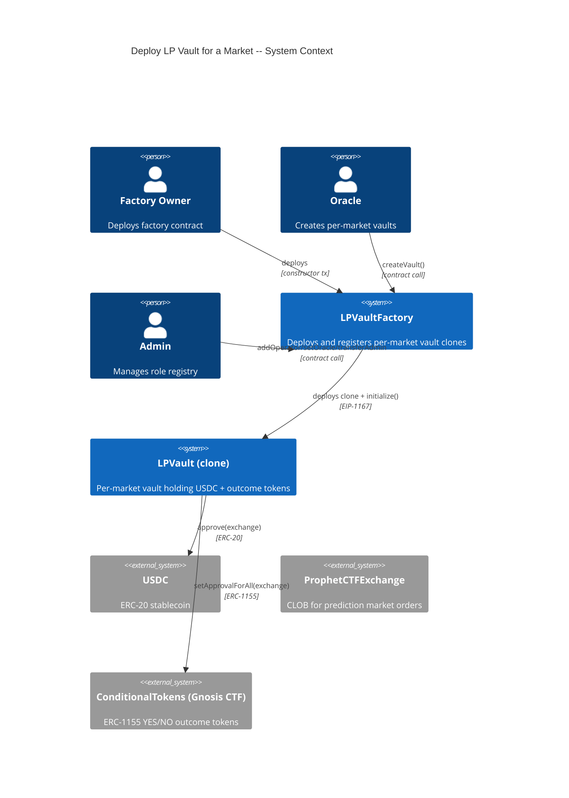
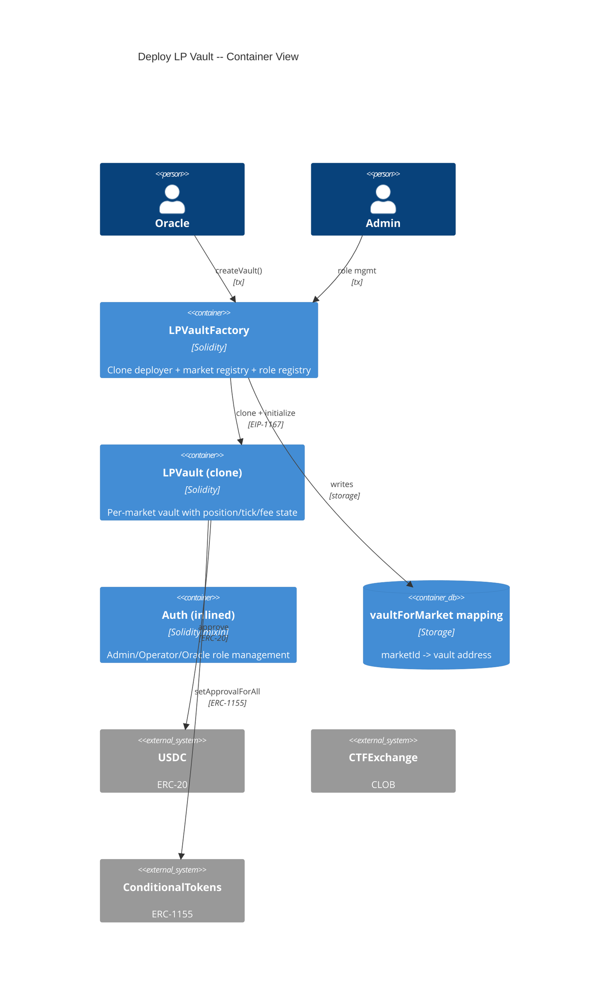
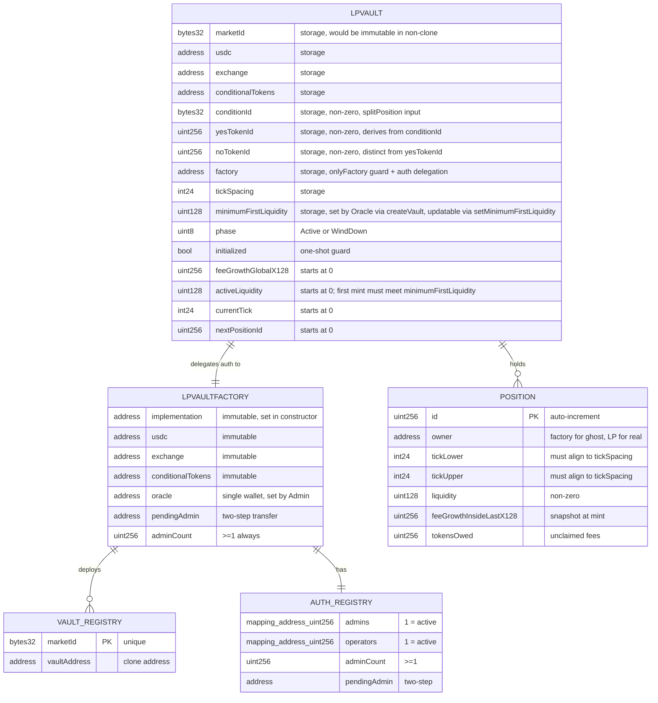
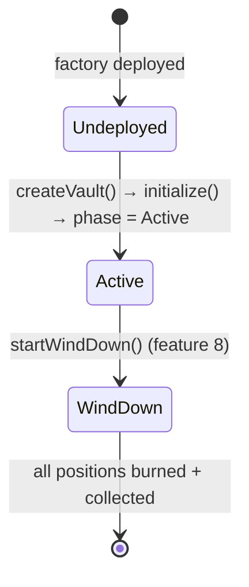

# Architecture: Deploy LP Vault for a Market

## System Context (C4 L1)

> Who uses this feature and what external systems does it touch?

```mermaid
C4Context
    title Deploy LP Vault for a Market -- System Context
    Person(factoryOwner, "Factory Owner", "Deploys factory contract")
    Person(oracle, "Oracle", "Creates per-market vaults")
    Person(admin, "Admin", "Manages role registry")
    System(factory, "LPVaultFactory", "Deploys and registers per-market vault clones")
    System(vault, "LPVault (clone)", "Per-market vault holding USDC + outcome tokens")
    System_Ext(usdc, "USDC", "ERC-20 stablecoin")
    System_Ext(ctfExchange, "ProphetCTFExchange", "CLOB for prediction market orders")
    System_Ext(conditionalTokens, "ConditionalTokens (Gnosis CTF)", "ERC-1155 YES/NO outcome tokens")
    Rel(factoryOwner, factory, "deploys", "constructor tx")
    Rel(oracle, factory, "createVault()", "contract call")
    Rel(admin, factory, "addOperator/setOracle/transferAdmin", "contract call")
    Rel(factory, vault, "deploys clone + initialize()", "EIP-1167")
    Rel(vault, usdc, "approve(exchange)", "ERC-20")
    Rel(vault, conditionalTokens, "setApprovalForAll(exchange)", "ERC-1155")
```

## Container View (C4 L2)

> Which major components are involved and how do they communicate?

```mermaid
C4Container
    title Deploy LP Vault -- Container View
    Person(oracle, "Oracle")
    Person(admin, "Admin")
    Container(factory, "LPVaultFactory", "Solidity", "Clone deployer + market registry + role registry")
    Container(vault, "LPVault (clone)", "Solidity", "Per-market vault with position/tick/fee state")
    Container(auth, "Auth (inlined)", "Solidity mixin", "Admin/Operator/Oracle role management")
    ContainerDb(registry, "vaultForMarket mapping", "Storage", "marketId -> vault address")
    System_Ext(usdc, "USDC", "ERC-20")
    System_Ext(ctfExchange, "CTFExchange", "CLOB")
    System_Ext(ctf, "ConditionalTokens", "ERC-1155")
    Rel(oracle, factory, "createVault()", "tx")
    Rel(admin, factory, "role mgmt", "tx")
    Rel(factory, vault, "clone + initialize", "EIP-1167")
    Rel(factory, registry, "writes", "storage")
    Rel(vault, usdc, "approve", "ERC-20")
    Rel(vault, ctf, "setApprovalForAll", "ERC-1155")
```

## Data Model

> Entity schemas with field constraints and invariants.

```mermaid
erDiagram
    LPVAULTFACTORY {
        address implementation "immutable, set in constructor"
        address usdc "immutable"
        address exchange "immutable"
        address conditionalTokens "immutable"
        address oracle "single wallet, set by Admin"
        address pendingAdmin "two-step transfer"
        uint256 adminCount ">=1 always"
    }
    LPVAULTFACTORY ||--o{ VAULT_REGISTRY : "deploys"
    VAULT_REGISTRY {
        bytes32 marketId PK "unique"
        address vaultAddress "clone address"
    }
    LPVAULT {
        bytes32 marketId "storage, would be immutable in non-clone"
        address usdc "storage"
        address exchange "storage"
        address conditionalTokens "storage"
        bytes32 conditionId "storage, non-zero, splitPosition input"
        uint256 yesTokenId "storage, non-zero, derives from conditionId"
        uint256 noTokenId "storage, non-zero, distinct from yesTokenId"
        address factory "storage, onlyFactory guard + auth delegation"
        int24 tickSpacing "storage"
        uint128 minimumFirstLiquidity "storage, set by Oracle via createVault, updatable via setMinimumFirstLiquidity"
        uint8 phase "Active or WindDown"
        bool initialized "one-shot guard"
        uint256 feeGrowthGlobalX128 "starts at 0"
        uint128 activeLiquidity "starts at 0; first mint must meet minimumFirstLiquidity"
        int24 currentTick "starts at 0"
        uint256 nextPositionId "starts at 0"
    }
    LPVAULT ||--o{ POSITION : "holds"
    POSITION {
        uint256 id PK "auto-increment"
        address owner "factory for ghost, LP for real"
        int24 tickLower "must align to tickSpacing"
        int24 tickUpper "must align to tickSpacing"
        uint128 liquidity "non-zero"
        uint256 feeGrowthInsideLastX128 "snapshot at mint"
        uint256 tokensOwed "unclaimed fees"
    }
    AUTH_REGISTRY {
        mapping_address_uint256 admins "1 = active"
        mapping_address_uint256 operators "1 = active"
        uint256 adminCount ">=1"
        address pendingAdmin "two-step"
    }
    LPVAULTFACTORY ||--|| AUTH_REGISTRY : "has"
    LPVAULT ||--|| LPVAULTFACTORY : "delegates auth to"
```

**Invariants:**
- `vaultForMarket[marketId]` is either zero (no vault) or the deployed clone address (immutable once set)
- `adminCount >= 1` always on the factory -- cannot remove the last admin
- `oracle != operators[x]` for any x where `operators[x] == 1` on the factory -- role separation
- Every vault clone's `factory` storage == the LPVaultFactory address that deployed it
- Vaults hold no local role state (operators, oracle, admins, pendingAdmin, adminCount) -- all authorization reads delegated to factory
- `initialized` flips from false to true exactly once per clone -- never resets
- All position-creation entry points on the vault are gated by `onlyOperator` -- no direct LP mint path exists
- When `activeLiquidity == 0`, the next mint must produce `liquidity >= minimumFirstLiquidity` or revert -- the first position is always materially large
- `minimumFirstLiquidity > 0` always -- enforced at `initialize()` and on every `setMinimumFirstLiquidity()` call; the floor cannot be disabled
- Every successful ERC-1155 receiver-hook invocation on a vault has `msg.sender == conditionalTokens` -- the vault never acknowledges tokens from any other ERC-1155 contract
- Every successful ERC-1155 receiver-hook invocation on a vault carries only token IDs in `{yesTokenId, noTokenId}` -- the vault never acknowledges a foreign ID, even from its own ConditionalTokens contract
- `conditionId != 0`, `yesTokenId != 0`, `noTokenId != 0`, and `yesTokenId != noTokenId` on every initialized vault
- `{yesTokenId, noTokenId}` equals the position-ID pair derived from `(usdc, conditionId)` on the ConditionalTokens contract -- checked once at `initialize()`; none of the three values is ever written again
- The receiver hooks are pure with respect to vault state -- no position, tick, or fee-accumulator storage is written by an inbound transfer

## Component Inventory

> Files that participate in this feature.

| File | Role | Key Exports |
|------|------|-------------|
| `src/LPVaultFactory.sol` | Clone deployer + market registry + factory-level Auth | `createVault()`, `vaultForMarket`, admin/operator/oracle management |
| `src/LPVault.sol` | Per-market vault implementation (clone target) | `initialize()`, position/tick/fee state, vault-level Auth |
| `test/LPVaultFactory.t.sol` | Unit + integration tests for factory | Factory deployment, vault creation, role management scenarios |
| `test/LPVault.t.sol` | Unit tests for vault initialization | Initialization guards, approval setup, ghost position |

## Event Topology

> All events this feature emits or consumes.

| Event | Publisher | Payload | Condition | Consumers |
|-------|-----------|---------|-----------|-----------|
| `VaultCreated(bytes32 indexed marketId, address vault, uint128 minimumFirstLiquidity)` | LPVaultFactory | `marketId, vaultAddress, minimumFirstLiquidity` | On successful `createVault()` | Off-chain Event Listener |
| `MinimumFirstLiquidityUpdated(uint128 oldMin, uint128 newMin)` | LPVault | `oldMin, newMin` | On successful `setMinimumFirstLiquidity()` | Off-chain monitoring |
| `NewAdmin(address indexed admin, address indexed caller)` | LPVaultFactory / LPVault | `admin, caller` | On `addAdmin()` or `acceptAdmin()` | Off-chain monitoring |
| `RemovedAdmin(address indexed admin, address indexed caller)` | LPVaultFactory / LPVault | `admin, caller` | On `removeAdmin()` or `renounceAdminRole()` | Off-chain monitoring |
| `NewOperator(address indexed operator, address indexed caller)` | LPVaultFactory / LPVault | `operator, caller` | On `addOperator()` | Off-chain monitoring |
| `RemovedOperator(address indexed operator, address indexed caller)` | LPVaultFactory / LPVault | `operator, caller` | On `removeOperator()` | Off-chain monitoring |
| `AdminTransferProposed(address indexed currentAdmin, address indexed proposedAdmin)` | LPVaultFactory / LPVault | `currentAdmin, proposedAdmin` | On `transferAdmin()` | Off-chain monitoring |

**Non-events (explicit):**
- Constructor deployment: no custom events emitted (only standard EVM creation receipt)
- Failed `createVault` (duplicate, wrong caller): no events emitted
- `createVault` does not emit `PositionMinted` -- no position is minted at vault creation under the operator-executes-all model

## API Surface

> Contract functions (entry points) belonging to this feature.

| Method | Path | Handler | Auth | Request Shape | Response Shape | Error Codes |
|--------|------|---------|------|---------------|----------------|-------------|
| call | `LPVaultFactory.createVault(bytes32,int24,uint128,bytes32,uint256,uint256)` | `createVault` | onlyOracle | `marketId, tickSpacing, minimumFirstLiquidity, conditionId, yesTokenId, noTokenId` | `address vault` | DuplicateMarket, NotOracle, ZeroFloor, ZeroConditionId, ZeroTokenId, DuplicateTokenId, TokenIdMismatch |
| call | `LPVault.setMinimumFirstLiquidity(uint128)` | `setMinimumFirstLiquidity` | onlyOracle | `newMin` | void | NotOracle, ZeroFloor |
| call | `LPVaultFactory.addOperator(address)` | `addOperator` | onlyAdmin | `operator_` | void | NotAdmin, RoleSeparation |
| call | `LPVaultFactory.removeOperator(address)` | `removeOperator` | onlyAdmin | `operator` | void | NotAdmin |
| call | `LPVaultFactory.setOracle(address)` | `setOracle` | onlyAdmin | `newOracle` | void | NotAdmin, RoleSeparation |
| call | `LPVaultFactory.transferAdmin(address)` | `transferAdmin` | onlyAdmin | `newAdmin` | void | NotAdmin, ZeroAddress, AlreadyAdmin |
| call | `LPVaultFactory.acceptAdmin()` | `acceptAdmin` | pendingAdmin only | none | void | NotPendingAdmin, AlreadyAdmin |
| call | `LPVault.initialize(...)` | `initialize` | onlyFactory | `marketId, usdc, exchange, conditionalTokens, tickSpacing, factory, minimumFirstLiquidity, version, conditionId, yesTokenId, noTokenId` | void | AlreadyInitialized, NotFactory, ZeroFloor, ZeroConditionId, ZeroTokenId, DuplicateTokenId, TokenIdMismatch |
| call | `LPVault.onERC1155Received(address,address,uint256,uint256,bytes)` | `onERC1155Received` | onlyConditionalTokens | `operator, from, id, value, data` | `bytes4` (`0xf23a6e61`) | NotConditionalTokens, UnknownTokenId |
| call | `LPVault.onERC1155BatchReceived(address,address,uint256[],uint256[],bytes)` | `onERC1155BatchReceived` | onlyConditionalTokens | `operator, from, ids, values, data` | `bytes4` (`0xbc197c81`) | NotConditionalTokens, UnknownTokenId |
| call | `LPVault.supportsInterface(bytes4)` | `supportsInterface` | public view | `interfaceId` | `bool` | none |

## Integration Points

> External services, event streams, and infrastructure dependencies.

| System | Protocol | Direction | Purpose |
|--------|----------|-----------|---------|
| USDC (ERC-20) | ERC-20 `approve` | outbound (approval only) | Vault approves exchange for unlimited USDC spending at fill time |
| ConditionalTokens (Gnosis CTF) | ERC-1155 `setApprovalForAll` | outbound | Vault approves exchange to pull YES/NO outcome tokens |
| ConditionalTokens (Gnosis CTF) | ERC-1155 receiver hooks | inbound | Vault acknowledges `safeTransferFrom` / `safeBatchTransferFrom` of its own two outcome token IDs; rejects hook calls from any other address and any other token ID |
| ConditionalTokens (Gnosis CTF) | `getCollectionId` / `getPositionId` view calls | outbound (read-only) | Vault derives its market's two position IDs at `initialize()` to verify the Oracle-supplied `yesTokenId` / `noTokenId` against `conditionId` |
| ProphetCTFExchange | ERC-20/ERC-1155 allowances | outbound (approval only) | Pre-approved by vault to atomically pull capital at fill time |

## State Transitions

> Vault lifecycle (only the creation subset relevant to this feature).

```mermaid
stateDiagram-v2
    state "Undeployed" as s0
    state "Active" as s1
    state "WindDown" as s2
    [*] --> s0 : factory deployed
    s0 --> s1 : createVault() → initialize() → phase = Active
    s1 --> s2 : startWindDown() (feature 8)
    s2 --> [*] : all positions burned + collected
```

## Code Map

> Links spec IDs to implementation files.

| Spec ID | Spec Name | Implementation Files |
|---------|-----------|---------------------|
| UC-REQ0 | Deploy Factory | `src/LPVaultFactory.sol:constructor()` |
| SC-REQ3 | Successful deployment | `src/LPVaultFactory.sol:constructor()` |
| SC-REQ4 | Oracle equals operator revert | `src/LPVaultFactory.sol:constructor()` |
| SC-REQ5 | Implementation not initializable | `src/LPVault.sol:constructor()` |
| UC-REQ1 | Create Vault for Market | `src/LPVaultFactory.sol:createVault()`, `src/LPVault.sol:initialize()` |
| SC-REQ6 | Successful vault creation | `src/LPVaultFactory.sol:createVault()`, `src/LPVault.sol:initialize()` |
| SC-REQ7 | Duplicate marketId revert | `src/LPVaultFactory.sol:createVault()` |
| SC-REQ8 | Non-Oracle caller revert | `src/LPVaultFactory.sol:createVault()` |
| SC-REQ9 | Re-initialization revert | `src/LPVault.sol:initialize()` |
| SC-REQA | Only factory can initialize | `src/LPVault.sol:initialize()` |
| SC-RG74 | createVault reverts on zero floor | `src/LPVaultFactory.sol:createVault()`, `src/LPVault.sol:initialize()` |
| SC-5XY4 | createVault reverts on malformed outcome-token identity | `src/LPVaultFactory.sol:createVault()`, `src/LPVault.sol:initialize()` |
| SC-5XY5 | createVault reverts when token IDs do not derive from conditionId | `src/LPVault.sol:initialize()` |
| SC-RG75 | Oracle updates minimumFirstLiquidity | `src/LPVault.sol:setMinimumFirstLiquidity()` |
| SC-RG76 | Non-Oracle setMinimumFirstLiquidity revert | `src/LPVault.sol:setMinimumFirstLiquidity()` |
| SC-RG77 | setMinimumFirstLiquidity zero revert | `src/LPVault.sol:setMinimumFirstLiquidity()` |
| SC-3WLL | Vault accepts single ERC-1155 transfer | `src/LPVault.sol:onERC1155Received()` |
| SC-3WLM | Vault accepts batch ERC-1155 transfer | `src/LPVault.sol:onERC1155BatchReceived()` |
| SC-3WLN | Receiver hook from non-ConditionalTokens reverts | `src/LPVault.sol:onERC1155Received()`, `src/LPVault.sol:onERC1155BatchReceived()`, `src/LPVault.sol:onlyConditionalTokens` |
| SC-5XY6 | Receiver hook rejects a foreign token ID | `src/LPVault.sol:onERC1155Received()`, `src/LPVault.sol:onERC1155BatchReceived()`, `src/LPVault.sol:_requireOwnTokenId()` |
| SC-3WLO | Vault reports IERC1155Receiver support | `src/LPVault.sol:supportsInterface()` |
| UC-REQ2 | Manage Roles on Factory | `src/LPVaultFactory.sol:addOperator()`, `src/LPVaultFactory.sol:removeOperator()`, `src/LPVaultFactory.sol:setOracle()`, `src/LPVaultFactory.sol:transferAdmin()`, `src/LPVaultFactory.sol:acceptAdmin()` |
| SC-REQB | Add operator successfully | `src/LPVaultFactory.sol:addOperator()` |
| SC-REQC | Add operator revert (oracle) | `src/LPVaultFactory.sol:addOperator()` |
| SC-REQD | Remove operator | `src/LPVaultFactory.sol:removeOperator()` |
| SC-REQE | Set oracle successfully | `src/LPVaultFactory.sol:setOracle()` |
| SC-REQF | Set oracle revert (operator) | `src/LPVaultFactory.sol:setOracle()` |
| SC-REQG | Two-step admin transfer | `src/LPVaultFactory.sol:transferAdmin()`, `src/LPVaultFactory.sol:acceptAdmin()` |
| SC-REQH | Non-admin revert | `src/LPVaultFactory.sol:addOperator()`, `src/LPVaultFactory.sol:removeOperator()`, `src/LPVaultFactory.sol:setOracle()`, `src/LPVaultFactory.sol:transferAdmin()` |
| SC-FKD4 | Operator rotation propagates to existing vaults | `src/LPVaultFactory.sol:removeOperator()`, `src/LPVaultFactory.sol:addOperator()`, `src/LPVault.sol:onlyOperator` |
| SC-FKD5 | Oracle rotation propagates to existing vaults | `src/LPVaultFactory.sol:setOracle()`, `src/LPVault.sol:onlyOracle` |

## Architecture Decisions

**ADR-RER0:** EIP-1167 clone pattern with storage-based config
In the context of deploying one vault per market, facing the constraint that EIP-1167 clones share the implementation's bytecode (so `immutable` values are shared), we decided to store all per-vault configuration (`marketId`, `usdc`, `exchange`, `conditionalTokens`, `oracle`, `tickSpacing`) in storage set during `initialize()` to achieve correct per-vault isolation, accepting the marginal gas overhead of SLOAD vs. bytecode-embedded constants.

**ADR-RER1:** Inlined Auth pattern on factory, factory-delegated on vaults
In the context of role management, facing the pattern policy that forbids importing library implementations, we decided to inline the Auth pattern from `ctf-exchange/lib/ctf-exchange/src/exchange/mixins/Auth.sol` on the factory (with the addition of `setOracle` and role separation checks) and have vaults delegate all role checks to the factory via cross-contract calls. This achieves a single source of truth for roles — key rotation on the factory propagates immediately to all existing vaults — while maintaining a smaller audit surface and no transitive dependency risk. We accept the marginal gas overhead of one SLOAD + CALL per gated vault function (cold ~2600 gas, warm ~100 gas per subsequent call in the same tx).

**ADR-RFS9:** Operator-gated minting + per-vault minimum-first-liquidity floor for inflation-grief protection
In the context of first-LP protection, facing the risk that a tiny first position can manipulate `feeGrowthGlobalX128` initialization (the v3 analog of the ERC-4626 first-depositor inflation attack), we decided to (a) route every position-creation entry point through an `onlyOperator` gate so no public mint path exists, and (b) enforce on-chain that the next mint while `activeLiquidity == 0` must produce `liquidity >= minimumFirstLiquidity`, where `minimumFirstLiquidity` is supplied per-market by the Oracle at `createVault` time and adjustable later via `setMinimumFirstLiquidity` (also `onlyOracle`). The floor cannot be set to zero. This achieves attack-resistance without locking capital per-vault while giving the Oracle per-market control to size the floor against expected market depth. We accept that the Operator is now in the path of every LP onboarding -- a trust assumption already established by the OPERATOR TRUST ASSUMPTION pattern in CLAUDE.md and mirrored from the CTF Exchange's operator-matched order flow -- and that lowering the floor requires a compromised Oracle to collude with a compromised Operator before an inflation grief becomes possible (two-of-two compromise).

**ADR-3WLP:** Stateless ERC-1155 receiver hooks gated on the vault's own ConditionalTokens address
In the context of the vault holding ERC-1155 outcome tokens acquired through exchange fills, facing the fact that ERC-1155 `safeTransferFrom` and `safeBatchTransferFrom` revert when the contract recipient does not return the receiver acknowledgement values, we decided to implement `onERC1155Received` and `onERC1155BatchReceived` as stateless hooks that return `0xf23a6e61` and `0xbc197c81`, gated by an `onlyConditionalTokens` modifier and, per ADR-5XY7, an `{yesTokenId, noTokenId}` membership check on every ID they carry, plus an ERC-165 `supportsInterface`. This achieves the vault's core ability to receive outcome tokens -- without the hooks every normal trade settling tokens into the vault reverts, a permanent denial of the vault's purpose -- while turning the "no entry point exists for foreign token IDs" comment at the `setApprovalForAll` call site into an enforced on-chain check on both dimensions, contract and ID, at near-zero marginal cost. We accept that the hooks perform no accounting: position, tick, and fee state stay driven by mint, burn, collect, and `notifyFees`, so an inbound transfer is invisible to vault bookkeeping by design, and any reconciliation between token balances and position accounting remains the Operator's off-chain responsibility.

**Rejected alternative -- unguarded receiver hooks:** The plain `pure` receiver returning the magic value to any caller is the common pattern and is what the ERC-1155 spec requires at minimum. Rejected because it lets any ERC-1155 contract push arbitrary token IDs into the vault, weakening the assumption documented at the `setApprovalForAll` call site that the vault holds outcome tokens for exactly one market. The guard costs one SLOAD and one comparison.

**ADR-5XY7:** Outcome-token identity supplied at `createVault`, verified against the ConditionalTokens contract, then frozen
In the context of a vault that must move real ERC-1155 outcome tokens -- pay them out on burn, and mint them from USDC via `splitPosition` -- facing the fact that `marketId` and the `conditionalTokens` address name a market but not its tokens, we decided that the Oracle supplies `conditionId`, `yesTokenId`, and `noTokenId` to `createVault`, that `initialize()` rejects zero and duplicated values, and that `initialize()` additionally derives the position-ID pair from `(usdc, conditionId)` via the CTF's `getCollectionId` / `getPositionId` and reverts unless the supplied IDs match that pair as a set. All three live in storage with the standard EIP-1167 comment and are never written again. This achieves an identity that downstream work (the dual-asset withdrawal rewrite, the straddling-mint conversion) can rely on unconditionally, and turns the one class of misconfiguration a clone can never recover from -- correct-looking IDs belonging to a different condition -- into an impossible state rather than a silent one. Argument order is the only thing the derivation cannot verify, so the order the Oracle passes the IDs in is what names which of the two is YES; that is a labelling choice, not a solvency-relevant one. We accept two CTF view calls (alt_bn128 point arithmetic inside `getCollectionId`) once per vault at creation, charged against NFR-RER0's 500,000 gas ceiling, and the derivation's assumption of a binary market with `parentCollectionId == bytes32(0)` and USDC collateral -- which is the only market shape this repo supports.

**Rejected alternative -- take only `conditionId` and derive both IDs on-chain:** Fewer parameters and no mismatch possible. Rejected because which index set (1 or 2) means YES is then an unverifiable convention baked into the vault, and the binary/zero-parent assumption becomes load-bearing with no caller override; taking the IDs explicitly keeps the labelling in the Oracle's hands while the derivation check still removes the error mode.

**Rejected alternative -- zero and distinctness checks only:** The originally scoped change. Rejected because it accepts any nonzero pair, including a valid ID pair from a different market's condition, and a clone carrying that identity cannot be fixed -- it would pay out and split the wrong tokens for the rest of its life. The check that closes that hole runs once, at creation.

**Rejected alternative -- ghost position:** We initially considered minting a permanently-locked full-range "ghost" position funded by the Oracle (~1000 USDC per vault) to keep `activeLiquidity > 0` from block one. Rejected because Prophet currently runs hundreds of markets, most of which will never see a second LP; locking ~1000 USDC into each vault is not insurance, it's a tax on every market's existence. Operator gating gives equivalent attack resistance with zero locked capital.

**Rejected alternative -- LP allowlist (separate `lps` role):** We considered adding a fourth role to the Auth registry so only allowlisted LPs could mint. Rejected because the Operator already vets every position credit under the operator-executes-all model -- adding an `lps` mapping duplicates that gate without adding security.

## Testing Decisions

| Service/Pattern | Decision | Reason |
|-----------------|----------|--------|
| USDC (ERC-20) | e2e with mock token | Deploy a minimal ERC-20 mock in test setup; no external dependency |
| ConditionalTokens (ERC-1155) | e2e with mock | Deploy a minimal ERC-1155 mock. It must now also implement `getCollectionId` / `getPositionId` with the real CTF's derivation so the `initialize()` identity check (ADR-5XY7) is exercised against real values, and must invoke the receiver hooks on `safeTransferFrom` / `safeBatchTransferFrom` so foreign-ID rejection is observable through a real transfer |
| ProphetCTFExchange | e2e with mock address | Vault only sets approvals; no exchange logic invoked in this feature |
| EIP-1167 clone deployment | e2e | Foundry natively supports clone deployment and testing |
