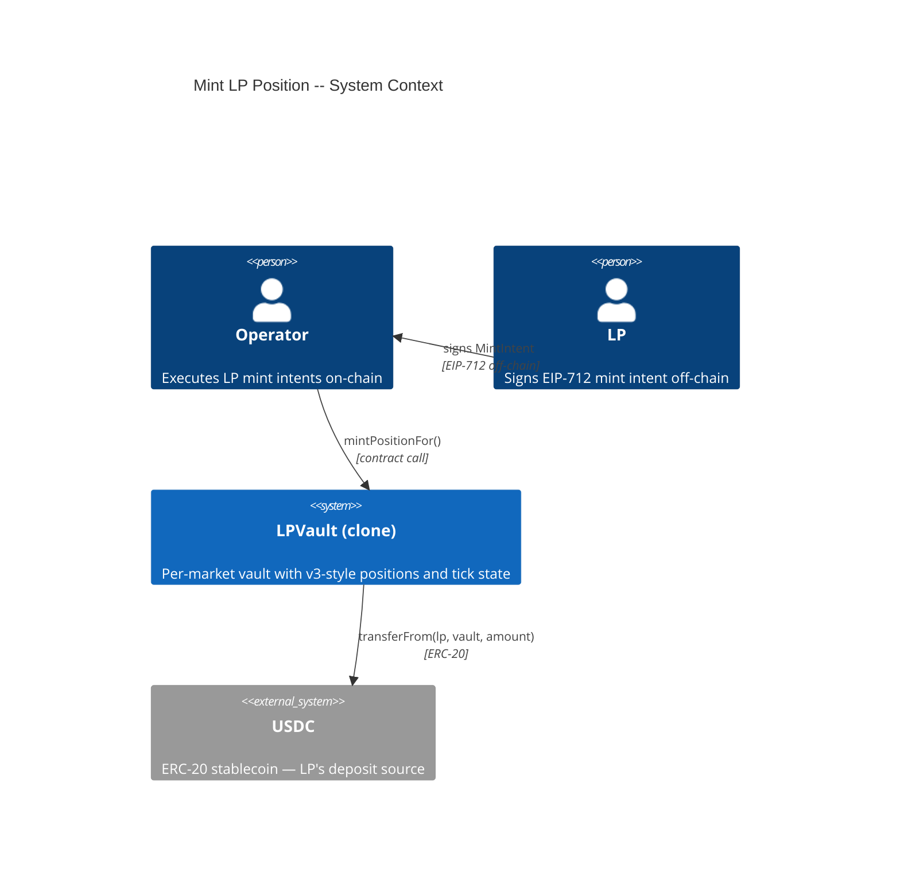
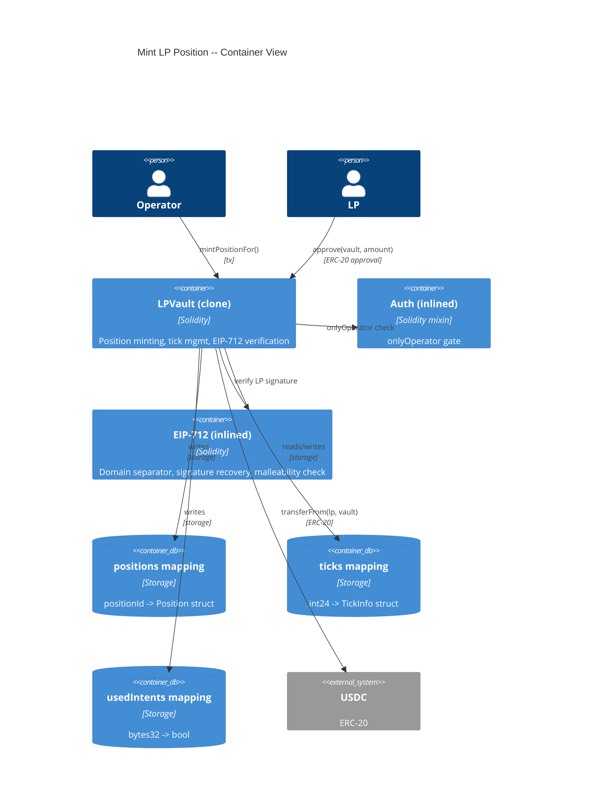
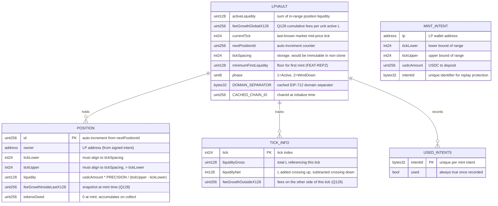

# Architecture: Mint LP Position

## System Context (C4 L1)

> Who uses this feature and what external systems does it touch?

## Container View (C4 L2)

> Which major components are involved and how do they communicate?

## Data Model

> Entity schemas with field constraints and invariants.

**Invariants:**
- `tickLower < tickUpper` for every position
- `tickLower % tickSpacing == 0` and `tickUpper % tickSpacing == 0`
- `position.feeGrowthInsideLastX128` is set to feeGrowthInside at mint time -- no retroactive claims
- `ticks[t].liquidityGross == sum of |liquidity| of all positions referencing tick t`
- `activeLiquidity == sum of position.liquidity for all positions where tickLower <= currentTick < tickUpper`
- `usedIntents[intentId] == true` after a successful mint -- never reset to false
- When `activeLiquidity == 0`, the next mint must produce `liquidity >= minimumFirstLiquidity` (FEAT-REPZ invariant)
- Newly initialized tick: `feeGrowthOutsideX128 = (tick <= currentTick) ? feeGrowthGlobalX128 : 0`

## Component Inventory

> Files that participate in this feature.

| File | Role | Key Exports |
|------|------|-------------|
| `src/LPVault.sol` | Per-market vault -- position minting, tick initialization, EIP-712 verification, fee growth computation | `mintPositionFor()`, `_mintPosition()`, `_initializeTick()`, `_computeFeeGrowthInside()`, `_verifyMintIntent()` |
| `test/features/FEAT-T7AF-mint-lp-position/UC-T7AG-operator-mint-position-for-lp/001-contract-call-operator-mint-position.t.sol` | Integration tests for all 11 scenarios | SC-T7AH through SC-T7AR |

## Event Topology

> All events this feature emits or consumes.

| Event | Publisher | Payload | Condition | Consumers |
|-------|-----------|---------|-----------|-----------|
| `PositionMinted(uint256 indexed positionId, address indexed owner, int24 tickLower, int24 tickUpper, uint128 liquidity, uint256 usdcAmount, bytes32 intentId)` | LPVault | `positionId, owner, tickLower, tickUpper, liquidity, usdcAmount, intentId` | On successful `mintPositionFor()` | Off-chain Event Listener, Keeper |

**Non-events (explicit):**
- Failed mints (any revert scenario): no events emitted, no state changes
- Tick initialization: no separate event (occurs as part of mint flow)

## API Surface

> Contract functions (entry points) belonging to this feature.

| Method | Path | Handler | Auth | Request Shape | Response Shape | Error Codes |
|--------|------|---------|------|---------------|----------------|-------------|
| call | `LPVault.mintPositionFor(address,int24,int24,uint256,bytes32,bytes)` | `mintPositionFor` | onlyOperator + nonReentrant | `lp, tickLower, tickUpper, usdcAmount, intentId, signature` | `uint256 positionId` | NotOperator, InvalidRange, TickNotAligned, VaultNotActive, ZeroAmount, IntentAlreadyUsed, InvalidSignature, BelowMinimumFirstLiquidity |

## Integration Points

> External services, event streams, and infrastructure dependencies.

| System | Protocol | Direction | Purpose |
|--------|----------|-----------|---------|
| USDC (ERC-20) | ERC-20 `transferFrom` | inbound (vault pulls from LP wallet) | Collects USDC deposit for the position |

## Code Map

> Links spec IDs to implementation files.

| Spec ID | Spec Name | Implementation Files |
|---------|-----------|---------------------|
| UC-T7AG | Operator Mint Position for LP | `src/LPVault.sol:mintPositionFor()`, `src/LPVault.sol:_mintPosition()` |
| SC-T7AH | Successful in-range mint with fresh ticks | `src/LPVault.sol:mintPositionFor()`, `src/LPVault.sol:_initializeTick()`, `src/LPVault.sol:_computeFeeGrowthInside()` |
| SC-T7AI | Successful out-of-range mint | `src/LPVault.sol:mintPositionFor()`, `src/LPVault.sol:_initializeTick()` |
| SC-T7AJ | Second position on existing tick | `src/LPVault.sol:mintPositionFor()`, `src/LPVault.sol:_initializeTick()` |
| SC-T7AK | Inverted range revert | `src/LPVault.sol:mintPositionFor()` |
| SC-T7AL | Misaligned tick revert | `src/LPVault.sol:mintPositionFor()` |
| SC-T7AM | Non-active vault revert | `src/LPVault.sol:mintPositionFor()` |
| SC-T7AN | Non-operator caller revert | `src/LPVault.sol:mintPositionFor()` |
| SC-T7AO | First mint below minimum liquidity | `src/LPVault.sol:mintPositionFor()`, `src/LPVault.sol:_mintPosition()` |
| SC-T7AP | Duplicate intentId revert | `src/LPVault.sol:mintPositionFor()` |
| SC-T7AQ | Invalid signature revert | `src/LPVault.sol:mintPositionFor()`, `src/LPVault.sol:_verifyMintIntent()` |
| SC-T7AR | Zero amount revert | `src/LPVault.sol:mintPositionFor()` |

## Architecture Decisions

**ADR-T7CD:** Linear tick scheme for prediction market price space
In the context of representing LP price ranges on a prediction market with bounded [0, 1] price space, facing the design choice between Uniswap v3's log-spaced ticks (based on sqrt(1.0001)^i) and linear ticks, we decided to use linear ticks matching the CLOB's price granularity to achieve simpler arithmetic and direct mapping between tick indices and probability values, accepting that this departs from v3's constant-product AMM math (which we don't use -- the CLOB handles matching, not an AMM curve).

**ADR-T7CE:** Liquidity formula: L = usdcAmount * PRECISION / rangeWidth
In the context of computing position liquidity from a USDC deposit, facing the choice between v3's sqrt-price-based formula and a linear USDC-per-tick model, we decided to use `liquidity = usdcAmount * PRECISION / (tickUpper - tickLower)` to achieve a direct, auditable relationship between USDC deposited and liquidity weight, accepting that this is simpler than v3's model because the CLOB handles trade execution -- the vault only needs liquidity for fee-accounting weight, not for swap output computation. See `research/lp-provisioning-engine.md` section "Mapping L (liquidity) to USDC capital" for the derivation.

**ADR-T7CF:** EIP-712 signed intent for operator-gated minting
In the context of LP onboarding under the operator-executes-all model (ADR-RFS9 from FEAT-REPZ), facing the need for the LP to authorize specific mint parameters without directly calling the vault, we decided to use EIP-712 typed structured data (MintIntent struct) signed by the LP and submitted by the Operator, with intentId-based replay protection, to achieve cryptographic authorization verifiable on-chain while keeping the execution path operator-gated, accepting that the LP must pre-approve the vault for USDC (ERC-20 approve) and trust the Operator to submit their intent in a timely manner -- a trust assumption bounded by the reclaimDeposit escape hatch planned in feature 7.

## Testing Decisions

| Service/Pattern | Decision | Reason |
|-----------------|----------|--------|
| USDC (ERC-20) | e2e with mock token | Deploy a minimal ERC-20 mock in test setup; test transferFrom behavior including insufficient balance and missing approval |
| EIP-712 signatures | e2e | Foundry's `vm.sign()` cheatcode generates real ECDSA signatures for test accounts |
| Tick state | e2e | Pure storage -- no external dependency |
