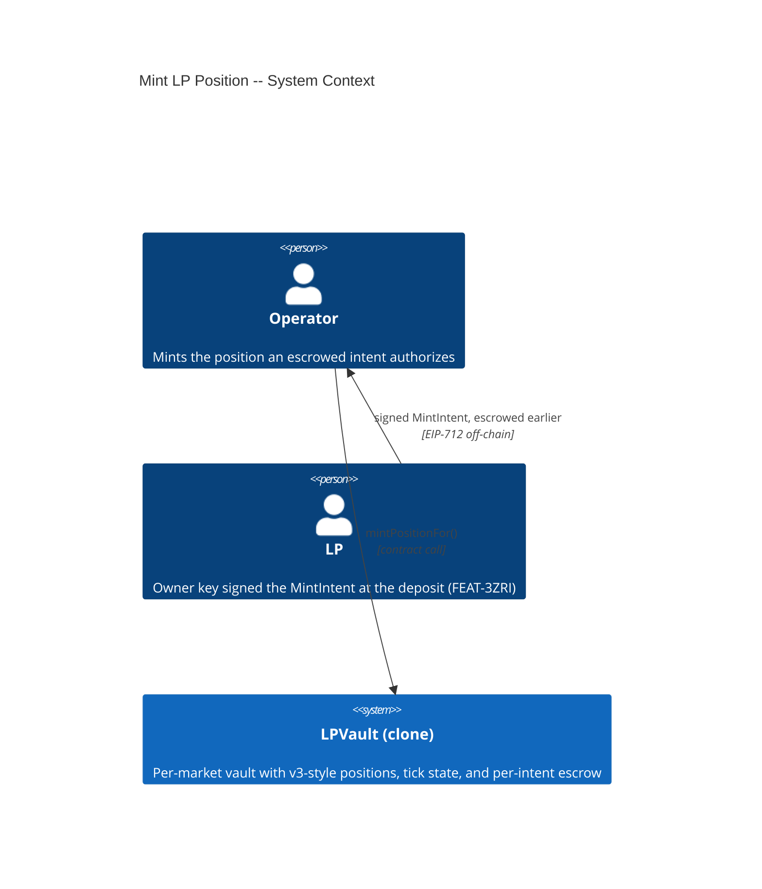
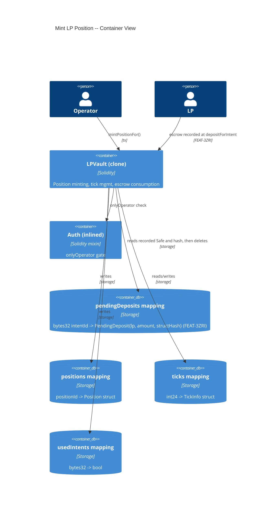
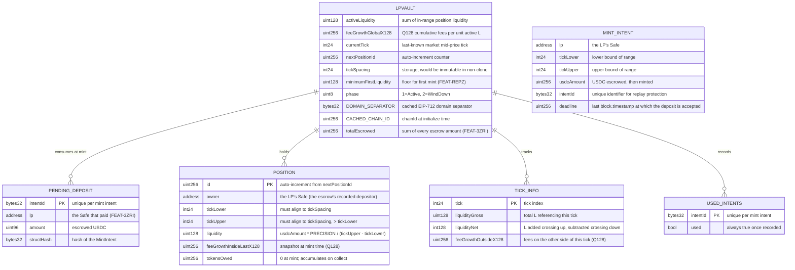

# Architecture: Mint LP Position

## System Context (C4 L1)

> Who uses this feature and what external systems does it touch?

```mermaid
C4Context
    title Mint LP Position -- System Context
    Person(operator, "Operator", "Mints the position an escrowed intent authorizes")
    Person(lp, "LP", "Owner key signed the MintIntent at the deposit (FEAT-3ZRI)")
    System(vault, "LPVault (clone)", "Per-market vault with v3-style positions, tick state, and per-intent escrow")
    Rel(lp, operator, "signed MintIntent, escrowed earlier", "EIP-712 off-chain")
    Rel(operator, vault, "mintPositionFor()", "contract call")
```

## Container View (C4 L2)

> Which major components are involved and how do they communicate?

```mermaid
C4Container
    title Mint LP Position -- Container View
    Person(operator, "Operator")
    Person(lp, "LP")
    Container(vault, "LPVault (clone)", "Solidity", "Position minting, tick mgmt, escrow consumption")
    Container(auth, "Auth (inlined)", "Solidity mixin", "onlyOperator gate")
    ContainerDb(escrow, "pendingDeposits mapping", "Storage", "bytes32 intentId -> PendingDeposit{lp, amount, structHash} (FEAT-3ZRI)")
    ContainerDb(positions, "positions mapping", "Storage", "positionId -> Position struct")
    ContainerDb(ticks_db, "ticks mapping", "Storage", "int24 -> TickInfo struct")
    ContainerDb(intents, "usedIntents mapping", "Storage", "bytes32 -> bool")
    Rel(operator, vault, "mintPositionFor()", "tx")
    Rel(lp, vault, "escrow recorded at depositForIntent", "FEAT-3ZRI")
    Rel(vault, auth, "onlyOperator check")
    Rel(vault, escrow, "reads recorded Safe and hash, then deletes", "storage")
    Rel(vault, positions, "writes", "storage")
    Rel(vault, ticks_db, "reads/writes", "storage")
    Rel(vault, intents, "writes", "storage")
```

## Data Model

> Entity schemas with field constraints and invariants.

```mermaid
erDiagram
    LPVAULT {
        uint128 activeLiquidity "sum of in-range position liquidity"
        uint256 feeGrowthGlobalX128 "Q128 cumulative fees per unit active L"
        int24 currentTick "last-known market mid-price tick"
        uint256 nextPositionId "auto-increment counter"
        int24 tickSpacing "storage, would be immutable in non-clone"
        uint128 minimumFirstLiquidity "floor for first mint (FEAT-REPZ)"
        uint8 phase "1=Active, 2=WindDown"
        bytes32 DOMAIN_SEPARATOR "cached EIP-712 domain separator"
        uint256 CACHED_CHAIN_ID "chainId at initialize time"
        uint256 totalEscrowed "sum of every escrow amount (FEAT-3ZRI)"
    }
    LPVAULT ||--o{ PENDING_DEPOSIT : "consumes at mint"
    PENDING_DEPOSIT {
        bytes32 intentId PK "unique per mint intent"
        address lp "the Safe that paid (FEAT-3ZRI)"
        uint96 amount "escrowed USDC"
        bytes32 structHash "hash of the MintIntent"
    }
    LPVAULT ||--o{ POSITION : "holds"
    LPVAULT ||--o{ TICK_INFO : "tracks"
    LPVAULT ||--o{ USED_INTENTS : "records"
    POSITION {
        uint256 id PK "auto-increment from nextPositionId"
        address owner "the LP's Safe (the escrow's recorded depositor)"
        int24 tickLower "must align to tickSpacing"
        int24 tickUpper "must align to tickSpacing, > tickLower"
        uint128 liquidity "usdcAmount * PRECISION / (tickUpper - tickLower)"
        uint256 feeGrowthInsideLastX128 "snapshot at mint time (Q128)"
        uint256 tokensOwed "0 at mint; accumulates on collect"
    }
    TICK_INFO {
        int24 tick PK "tick index"
        uint128 liquidityGross "total L referencing this tick"
        int128 liquidityNet "L added crossing up, subtracted crossing down"
        uint256 feeGrowthOutsideX128 "fees on the other side of this tick (Q128)"
    }
    USED_INTENTS {
        bytes32 intentId PK "unique per mint intent"
        bool used "always true once recorded"
    }
    MINT_INTENT {
        address lp "the LP's Safe"
        int24 tickLower "lower bound of range"
        int24 tickUpper "upper bound of range"
        uint256 usdcAmount "USDC escrowed, then minted"
        bytes32 intentId "unique identifier for replay protection"
        uint256 deadline "last block.timestamp at which the deposit is accepted"
    }
```

**Invariants:**
- `tickLower < tickUpper` for every position
- `tickLower % tickSpacing == 0` and `tickUpper % tickSpacing == 0`
- `position.feeGrowthInsideLastX128` is set to feeGrowthInside at mint time -- no retroactive claims
- `ticks[t].liquidityGross == sum of |liquidity| of all positions referencing tick t`
- `activeLiquidity == sum of position.liquidity for all positions where tickLower <= currentTick < tickUpper`
- `usedIntents[intentId] == true` after a successful mint -- never reset to false
- A mint consumes exactly the recorded escrow: `pendingDeposits[intentId]` is deleted and `totalEscrowed` falls by its amount in the same call, before any state that a reclaim could observe
- `position.owner == pendingDeposits[intentId].lp` at the moment of the mint
- When `activeLiquidity == 0`, the next mint must produce `liquidity >= minimumFirstLiquidity` (FEAT-REPZ invariant)
- Newly initialized tick: `feeGrowthOutsideX128 = (tick <= currentTick) ? feeGrowthGlobalX128 : 0`

## Component Inventory

> Files that participate in this feature.

| File | Role | Key Exports |
|------|------|-------------|
| `src/LPVault.sol` | Per-market vault -- position minting from an escrow, tick initialization, fee growth computation | `mintPositionFor()`, `_requireValidRange()`, `_mintIntentHash()`, `_initializeTick()`, `_computeFeeGrowthInside()`, `MINT_INTENT_TYPEHASH`, `IntentMismatch`, `DepositNotEscrowed` |
| `test/fixtures/LPVaultFixture.sol` | Test fixture -- `_escrowAndMint` is the one way every test mints | `_escrowAndMint()`, `_signMintIntent()` |
| `test/features/FEAT-T7AF-mint-lp-position/UC-T7AG-operator-mint-position-for-lp.t.sol` | Integration tests for all 16 scenarios | SC-T7AH through SC-T7AR, SC-8L1C, SC-3Z9J, SC-45IE, SC-3Z9K |

## Event Topology

> All events this feature emits or consumes.

| Event | Publisher | Payload | Condition | Consumers |
|-------|-----------|---------|-----------|-----------|
| `PositionMinted(uint256 indexed positionId, address indexed owner, int24 tickLower, int24 tickUpper, uint128 liquidity, uint256 usdcAmount, bytes32 intentId)` | LPVault | `positionId, owner, tickLower, tickUpper, liquidity, usdcAmount, intentId` | On successful `mintPositionFor()`; `owner` is the Safe | Off-chain Event Listener, Keeper |

**Non-events (explicit):**
- Failed mints (any revert scenario): no events emitted, no state changes
- Tick initialization: no separate event (occurs as part of mint flow)

## API Surface

> Contract functions (entry points) belonging to this feature.

| Method | Path | Handler | Auth | Request Shape | Response Shape | Error Codes |
|--------|------|---------|------|---------------|----------------|-------------|
| call | `LPVault.mintPositionFor(address,int24,int24,uint256,bytes32,uint256)` | `mintPositionFor` | onlyOperator + whenNotPaused + nonReentrant + touchesHeartbeat | `lp, tickLower, tickUpper, usdcAmount, intentId, deadline` | `uint256 positionId` | NotOperator, TradingIsPaused, VaultNotActive, ZeroAmount, InvalidRange, TickNotAligned, IntentAlreadyUsed, DepositNotEscrowed, NotIntentOwner, IntentMismatch, BelowMinimumFirstLiquidity |

## Integration Points

> External services, event streams, and infrastructure dependencies.

| System | Protocol | Direction | Purpose |
|--------|----------|-----------|---------|
| none | — | — | The mint makes no external call; the USDC entered at `depositForIntent` (FEAT-3ZRI) |

## Code Map

> Links spec IDs to implementation files.

| Spec ID | Spec Name | Implementation Files |
|---------|-----------|---------------------|
| UC-T7AG | Operator Mint Position for LP | `src/LPVault.sol:mintPositionFor()`, `src/LPVault.sol:_mintIntentHash()`, `src/LPVault.sol:_requireValidRange()` |
| SC-T7AH | Successful in-range mint with fresh ticks | `src/LPVault.sol:mintPositionFor()`, `src/LPVault.sol:_initializeTick()`, `src/LPVault.sol:_computeFeeGrowthInside()` |
| SC-3XU5 | Successful mint refreshes silence timer | `src/LPVault.sol:mintPositionFor()`, `src/LPVault.sol:touchesHeartbeat` |
| SC-3XU6 | Reverted mint leaves silence timer untouched | `src/LPVault.sol:mintPositionFor()`, `src/LPVault.sol:touchesHeartbeat` |
| SC-T7AI | Successful out-of-range mint | `src/LPVault.sol:mintPositionFor()`, `src/LPVault.sol:_initializeTick()` |
| SC-T7AJ | Second position on existing tick | `src/LPVault.sol:mintPositionFor()`, `src/LPVault.sol:_initializeTick()` |
| SC-8L1C | Mint over a stale shared tick succeeds | `src/LPVault.sol:mintPositionFor()`, `src/LPVault.sol:_initializeTick()`, `src/LPVault.sol:_computeFeeGrowthInside()` |
| SC-T7AK | Inverted range revert | `src/LPVault.sol:mintPositionFor()`, `src/LPVault.sol:_requireValidRange()` |
| SC-T7AL | Misaligned tick revert | `src/LPVault.sol:mintPositionFor()`, `src/LPVault.sol:_requireValidRange()` |
| SC-T7AM | Non-active vault revert | `src/LPVault.sol:mintPositionFor()` |
| SC-T7AN | Non-operator caller revert | `src/LPVault.sol:mintPositionFor()` |
| SC-T7AO | First mint below minimum liquidity | `src/LPVault.sol:mintPositionFor()`, `src/LPVault.sol:_toUint128()` |
| SC-T7AP | Duplicate intentId revert | `src/LPVault.sol:mintPositionFor()` |
| SC-3Z9J | Revert when no deposit is escrowed for the intent | `src/LPVault.sol:mintPositionFor()` (escrow read) |
| SC-45IE | Revert when the escrow belongs to a different Safe | `src/LPVault.sol:mintPositionFor()` (recorded Safe check) |
| SC-3Z9K | Revert when the recorded hash does not match the arguments | `src/LPVault.sol:mintPositionFor()`, `src/LPVault.sol:_mintIntentHash()` |
| SC-T7AR | Zero amount revert | `src/LPVault.sol:mintPositionFor()` |

## Architecture Decisions

**ADR-T7CD:** Linear tick scheme for prediction market price space
In the context of representing LP price ranges on a prediction market with bounded [0, 1] price space, facing the design choice between Uniswap v3's log-spaced ticks (based on sqrt(1.0001)^i) and linear ticks, we decided to use linear ticks matching the CLOB's price granularity to achieve simpler arithmetic and direct mapping between tick indices and probability values, accepting that this departs from v3's constant-product AMM math (which we don't use -- the CLOB handles matching, not an AMM curve).

**ADR-T7CE:** Liquidity formula: L = usdcAmount * PRECISION / rangeWidth
In the context of computing position liquidity from a USDC deposit, facing the choice between v3's sqrt-price-based formula and a linear USDC-per-tick model, we decided to use `liquidity = usdcAmount * PRECISION / (tickUpper - tickLower)` to achieve a direct, auditable relationship between USDC deposited and liquidity weight, accepting that this is simpler than v3's model because the CLOB handles trade execution -- the vault only needs liquidity for fee-accounting weight, not for swap output computation. See `research/lp-provisioning-engine.md` section "Mapping L (liquidity) to USDC capital" for the derivation.

**ADR-T7CF:** EIP-712 signed intent for operator-gated minting
In the context of LP onboarding under the operator-executes-all model (ADR-RFS9 from FEAT-REPZ), facing the need for the LP to authorize specific mint parameters without directly calling the vault, we decided to use EIP-712 typed structured data (MintIntent struct) signed by the LP and submitted by the Operator, with intentId-based replay protection, to achieve cryptographic authorization verifiable on-chain while keeping the execution path operator-gated, accepting that the LP must pre-approve the vault for USDC (ERC-20 approve) and trust the Operator to submit their intent in a timely manner -- a trust assumption bounded by the reclaimDeposit escape hatch planned in feature 7.

Superseded in part on 2026-09-12 (audit NM-0986 issues 6.1 and 6.2, decisions C1, C23, and C25): the LP's Safe approves the vault through a relayed Safe transaction, the Operator escrows the USDC in `depositForIntent` (FEAT-3ZRI), the mint consumes the escrow and verifies no signature, and the escape hatch is the one-call `reclaimDeposit` (FEAT-JAIJ). The MintIntent type and the `intentId` replay protection stay as decided here.

**ADR-9OYP:** Safe owner-key signatures for every LP authorization
In the context of LPs that are Gnosis Safe wallets with no private key, facing the choice between EIP-1271 calls into the Safe and the exchange's derivation check, we decided that the vault recovers the owner key with ECDSA under the malleability rules and requires that the Safe derived from that key through the Poly Safe factory's CREATE2 formula equals the Safe named in the message, with the two derivation inputs held as `immutable` values on the factory and read by the vault at call time, to achieve the same signing flow the app uses for orders and a check no Admin can change, accepting that a Safe owner who swaps the owner key leaves the old key able to derive the same Safe, so the old key keeps the relayed paths until the vault holds nothing for that Safe. The exchange has the same property for orders. Every LP-signed type also carries a `deadline`, checked inclusively against `block.timestamp`, so a signed message cannot stay valid forever.

Rejected: EIP-1271 through the Safe's `isValidSignature`, because the vault would call a contract that the LP names, and the app produces no such signature today. Rejected: storing the inputs on each vault at `initialize`, because 13 parameters do not compile (stack too deep in the ABI decoder, measured on 2026-09-12) and a struct-typed `initialize` would touch every creation test for no gain. The user chose this on 2026-09-12. The derivation is `keccak256(0xff ++ safeFactory ++ keccak256(abi.encode(ownerKey)) ++ safeProxyBytecodeHash)` truncated to 20 bytes, as in the exchange's `PolySafeLib`.

**ADR-8L1F:** The fee-growth delta wraps in `unchecked` and never uses `_mulDiv`
In the context of Uniswap v3 lazy fee accounting compiled under Solidity 0.8.20 checked arithmetic, facing a normal accounting state (a position minted over a tick that another position initialized earlier) that reverts every mint, collect, merge, and emergency cancel on that range (audit NM-0986 issue 6.5), we decided to run the subtractions in `_computeFeeGrowthInside`, the flip in `_crossTick`, and every `feeGrowthInsideX128 - feeGrowthInsideLastX128` subtraction with the `liquidity * delta / Q128` product that consumes it inside `unchecked`, with a comment at each site, and never to route that product through `_mulDiv`, to achieve the exact modular arithmetic the formula needs and one shape at every site, accepting an explicit exception to `CLAUDE.md` checklist item 3 and a reader who must trust the comment at each site.

The mechanism: a tick initialized late assumes all past growth sits on one side of it, so `below + above` can exceed `global`, and `global - below - above` must wrap modulo 2^256. A position stores that wrapped value as its snapshot. Later, `inside_now - snapshot` must also wrap, because both values wrapped by the same offset and the subtraction cancels the offset to the true small delta. That subtraction is the load-bearing part. On a correct delta, `liquidity * delta` fits in 256 bits for every reachable value, so `_mulDiv` and the unchecked product return the same number. On a wrong delta, both return a wrong number. The no-`_mulDiv` rule is therefore a convention that keeps one shape at every fee site and keeps the shape the auditors reviewed, not a safety claim.

Rejected: signed integers, because `feeGrowthGlobalX128` itself can approach 2^256. Rejected: a fee model without wraparound, because it would replace an audited pattern with a new one. The sites at the time of this decision: `_computeFeeGrowthInside()`, `_crossTick()`, `collect()`, `mergePositions()` (survivor and consumed), and `emergencyCancelAll()`. A burn (R9 in `audits/audit-fixes-ranged.md`) adds a sixth site with the same shape.

## Testing Decisions

| Service/Pattern | Decision | Reason |
|-----------------|----------|--------|
| USDC (ERC-20) | e2e | The shared `MockERC20`; every test escrows through `_escrowAndMint`, so the mint itself moves nothing |
| EIP-712 signatures | e2e | Foundry's `vm.sign()` cheatcode generates real ECDSA signatures for the owner key at the deposit |
| Safe derivation | fixture | Made-up factory constants in `LPVaultFixture`; the position owner is `_safeOf(LP_PK)` |
| Tick state | e2e | Pure storage -- no external dependency |
