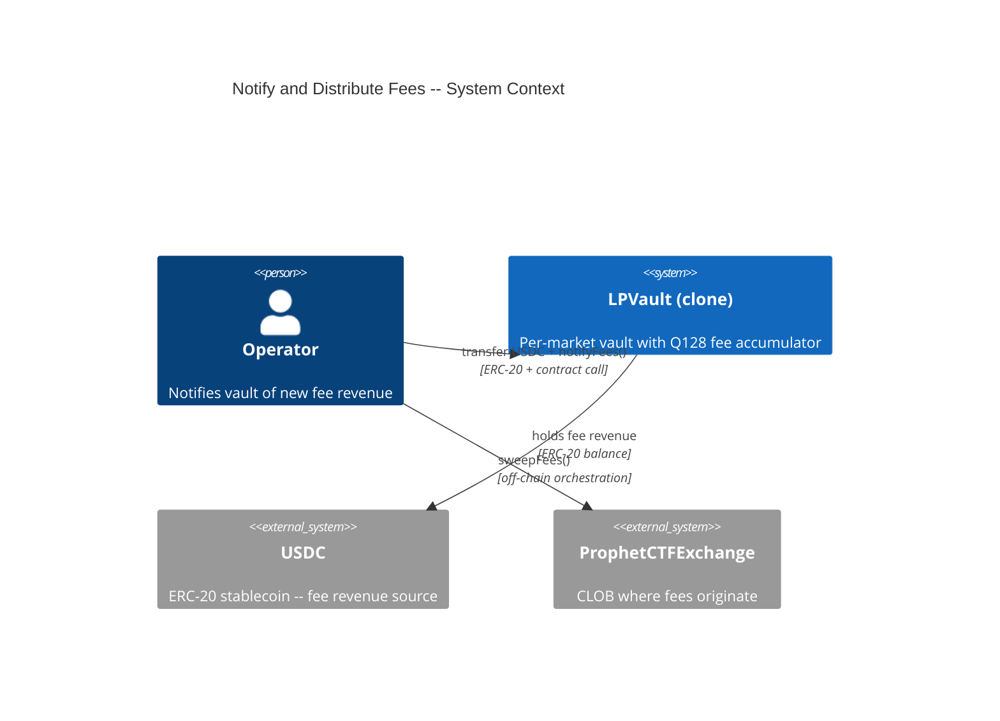
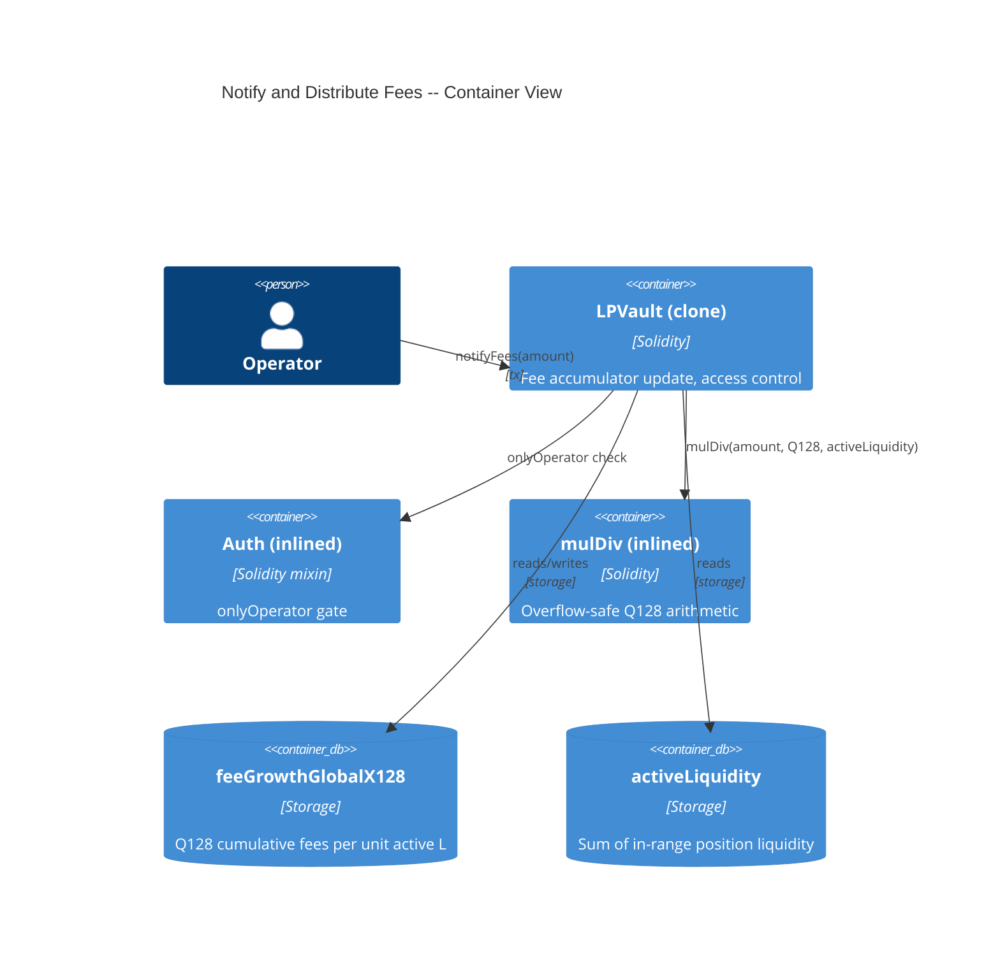
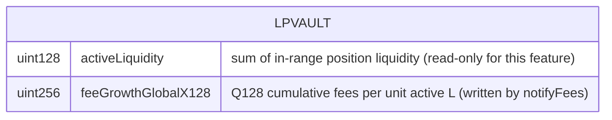

# Architecture: Notify and Distribute Fees

## System Context (C4 L1)

> Who uses this feature and what external systems does it touch?

## Container View (C4 L2)

> Which major components are involved and how do they communicate?

## Data Model

> Entity schemas with field constraints and invariants.

**Invariants:**
- `feeGrowthGlobalX128` is monotonically non-decreasing -- it can only increase via `notifyFees`
- `notifyFees` MUST revert when `activeLiquidity == 0` -- never silently lock fees
- Q128 division truncates downward; dust is economically negligible (< 1/2^128 USDC per unit of liquidity per call)
- `feeGrowthGlobalX128` after N calls == sum of `mulDiv(amount_i, Q128, activeLiquidity_i)` for i in 1..N

## Component Inventory

> Files that participate in this feature.

| File | Role | Key Exports |
|------|------|-------------|
| `src/LPVault.sol` | Per-market vault -- fee accumulator update, access control, overflow-safe Q128 math | `notifyFees()`, `_mulDiv()` |

## Event Topology

> All events this feature emits or consumes.

| Event | Publisher | Payload | Condition | Consumers |
|-------|-----------|---------|-----------|-----------|
| `FeesNotified(uint256 amount, uint256 feeGrowthGlobalX128)` | LPVault | `amount, feeGrowthGlobalX128` | On successful `notifyFees()` | Off-chain Event Listener |

**Non-events (explicit):**
- Failed notifyFees (any revert scenario): no events emitted, no state changes
- No USDC transfer event from the vault during notifyFees (vault does not move USDC)

## API Surface

> Contract functions (entry points) belonging to this feature.

| Method | Path | Handler | Auth | Request Shape | Response Shape | Error Codes |
|--------|------|---------|------|---------------|----------------|-------------|
| call | `LPVault.notifyFees(uint256)` | `notifyFees` | onlyOperator | `amount` | void | NotOperator, NoActiveLiquidity, ZeroAmount |

## Integration Points

> External services, event streams, and infrastructure dependencies.

| System | Protocol | Direction | Purpose |
|--------|----------|-----------|---------|
| USDC (ERC-20) | ERC-20 balance | inbound (Operator transfers USDC to vault before calling) | Fee revenue arrives as USDC; vault trusts Operator to have funded it |

## Code Map

> Links spec IDs to implementation files.

| Spec ID | Spec Name | Implementation Files |
|---------|-----------|---------------------|
| UC-TOGS | Operator Notify Fee Revenue | `src/LPVault.sol:notifyFees()` |
| SC-TOGT | Successful fee notification with active liquidity | `src/LPVault.sol:notifyFees()`, `src/LPVault.sol:_mulDiv()` |
| SC-TOGU | Sequential notifications accumulate correctly | `src/LPVault.sol:notifyFees()`, `src/LPVault.sol:_mulDiv()` |
| SC-TOGV | Revert when no active liquidity | `src/LPVault.sol:notifyFees()` |
| SC-TOGW | Revert for non-Operator caller | `src/LPVault.sol:notifyFees()` |
| SC-TOGX | Revert for zero amount | `src/LPVault.sol:notifyFees()` |
| SC-TOGY | Q128 truncation dust behavior | `src/LPVault.sol:notifyFees()`, `src/LPVault.sol:_mulDiv()` |

## Architecture Decisions

**ADR-TOH7:** No on-chain USDC balance verification in notifyFees
In the context of the Operator calling `notifyFees(amount)` to distribute fee revenue, facing the choice between verifying the vault's USDC balance on-chain vs. trusting the Operator to have funded it, we decided to trust the Operator (no balance check) to achieve lower gas cost and simpler code, accepting that a misbehaving Operator could create an accounting mismatch by notifying fees without depositing USDC. This matches the CTF Exchange trust model where the Operator manages fee sweeps, and is bounded by the OPERATOR TRUST ASSUMPTION NatSpec convention.

## Testing Decisions

| Service/Pattern | Decision | Reason |
|-----------------|----------|--------|
| USDC balance | e2e with mock token | Deploy a minimal ERC-20 mock; Operator transfers USDC to vault before calling notifyFees in test setup |
| Q128 overflow | fuzz | Fuzz test with large `amount` values to verify mulDiv overflow safety |
| Accumulator math | fuzz | Fuzz sequential notifyFees calls with varying amounts and activeLiquidity to verify accumulation |
