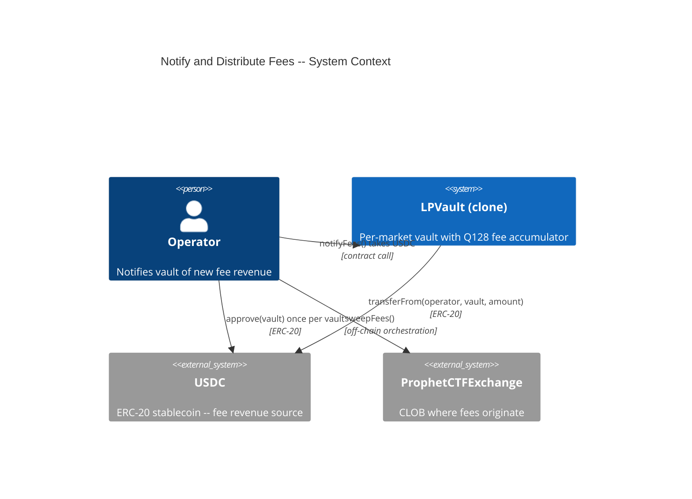
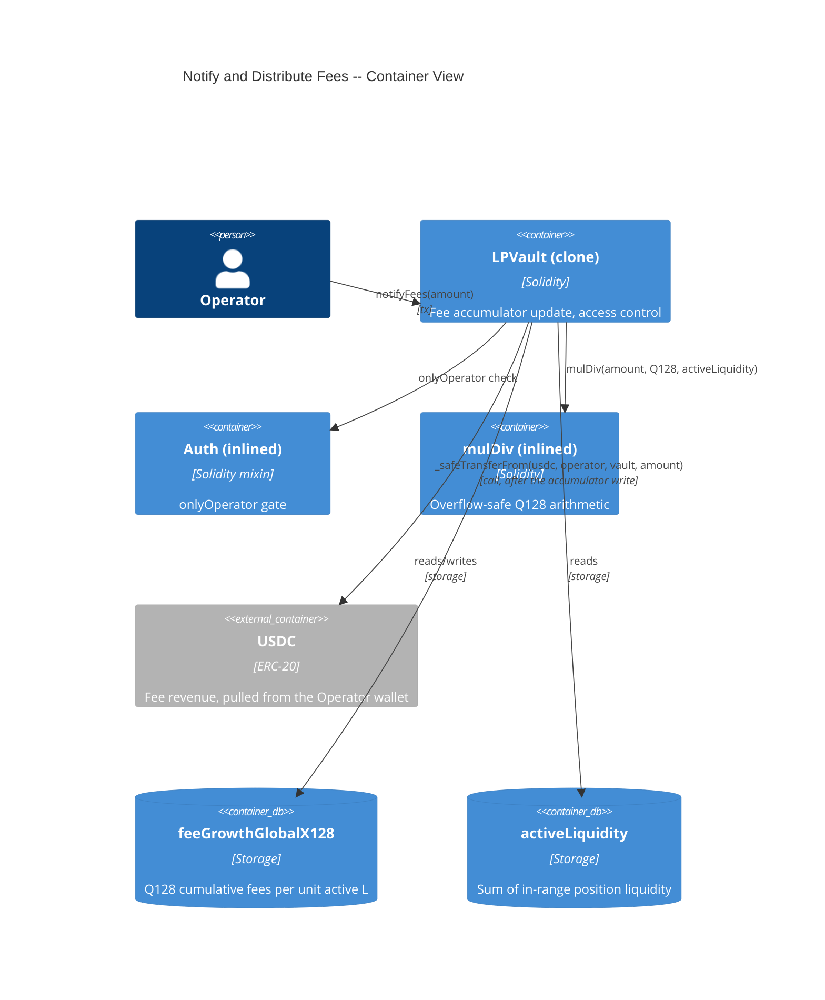
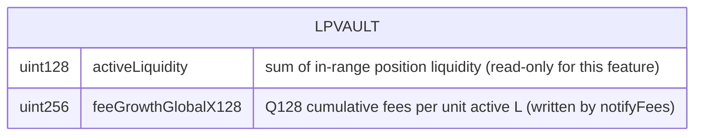

# Architecture: Notify and Distribute Fees

## System Context (C4 L1)

> Who uses this feature and what external systems does it touch?

```mermaid
C4Context
    title Notify and Distribute Fees -- System Context
    Person(operator, "Operator", "Notifies vault of new fee revenue")
    System(vault, "LPVault (clone)", "Per-market vault with Q128 fee accumulator")
    System_Ext(usdc, "USDC", "ERC-20 stablecoin -- fee revenue source")
    System_Ext(exchange, "ProphetCTFExchange", "CLOB where fees originate")
    Rel(operator, exchange, "sweepFees()", "off-chain orchestration")
    Rel(operator, vault, "notifyFees() takes USDC", "contract call")
    Rel(operator, usdc, "approve(vault) once per vault", "ERC-20")
    Rel(vault, usdc, "transferFrom(operator, vault, amount)", "ERC-20")
```

## Container View (C4 L2)

> Which major components are involved and how do they communicate?

```mermaid
C4Container
    title Notify and Distribute Fees -- Container View
    Person(operator, "Operator")
    Container(vault, "LPVault (clone)", "Solidity", "Fee accumulator update, access control")
    Container(auth, "Auth (inlined)", "Solidity mixin", "onlyOperator gate")
    Container(mulDiv, "mulDiv (inlined)", "Solidity", "Overflow-safe Q128 arithmetic")
    Container_Ext(usdc, "USDC", "ERC-20", "Fee revenue, pulled from the Operator wallet")
    ContainerDb(feeGlobal, "feeGrowthGlobalX128", "Storage", "Q128 cumulative fees per unit active L")
    ContainerDb(activeL, "activeLiquidity", "Storage", "Sum of in-range position liquidity")
    Rel(operator, vault, "notifyFees(amount)", "tx")
    Rel(vault, auth, "onlyOperator check")
    Rel(vault, mulDiv, "mulDiv(amount, Q128, activeLiquidity)")
    Rel(vault, feeGlobal, "reads/writes", "storage")
    Rel(vault, activeL, "reads", "storage")
    Rel(vault, usdc, "_safeTransferFrom(usdc, operator, vault, amount)", "call, after the accumulator write")
```

## Data Model

> Entity schemas with field constraints and invariants.

```mermaid
erDiagram
    LPVAULT {
        uint128 activeLiquidity "sum of in-range position liquidity (read-only for this feature)"
        uint256 feeGrowthGlobalX128 "Q128 cumulative fees per unit active L (written by notifyFees)"
    }
```

**Invariants:**
- `feeGrowthGlobalX128` is monotonically non-decreasing -- it can only increase via `notifyFees`
- `notifyFees` MUST revert when `activeLiquidity == 0` -- never silently lock fees
- Q128 division truncates downward; dust is economically negligible (< 1/2^128 USDC per unit of liquidity per call)
- `feeGrowthGlobalX128` after N calls == sum of `mulDiv(amount_i, Q128, activeLiquidity_i)` for i in 1..N
- One `notifyFees(amount)` call raises the vault's USDC balance by `amount`, so every fee credit is backed by USDC the vault holds beyond escrow and principal (`invariant_feeCreditsAreBacked`, with no exchange fill)

## Component Inventory

> Files that participate in this feature.

| File | Role | Key Exports |
|------|------|-------------|
| `src/LPVault.sol` | Per-market vault -- fee accumulator update, USDC pull, access control, overflow-safe Q128 math | `notifyFees()`, `_mulDiv()`, `_safeTransferFrom()` |

## Event Topology

> All events this feature emits or consumes.

| Event | Publisher | Payload | Condition | Consumers |
|-------|-----------|---------|-----------|-----------|
| `FeesNotified(uint256 amount, uint256 feeGrowthGlobalX128)` | LPVault | `amount, feeGrowthGlobalX128` | On successful `notifyFees()` | Off-chain Event Listener |

**Non-events (explicit):**
- Failed notifyFees (any revert scenario, `TransferFailed` included): no events emitted, no state changes

**USDC `Transfer` log (emitted by the USDC contract, not by the vault):** a `Transfer(operator, vault, amount)` log precedes every `FeesNotified` log in the same transaction; a failed transfer reverts the call, so neither log is emitted

## API Surface

> Contract functions (entry points) belonging to this feature.

| Method | Path | Handler | Auth | Request Shape | Response Shape | Error Codes |
|--------|------|---------|------|---------------|----------------|-------------|
| call | `LPVault.notifyFees(uint256)` | `notifyFees` | onlyOperator, whenNotPaused, nonReentrant, touchesHeartbeat | `amount` | void | NotOperator, TradingIsPaused, VaultCancelled, ZeroAmount, NoActiveLiquidity, TransferFailed |

## Integration Points

> External services, event streams, and infrastructure dependencies.

| System | Protocol | Direction | Purpose |
|--------|----------|-----------|---------|
| USDC (ERC-20) | `transferFrom` | outbound call, inbound funds | The vault takes the fee income from the Operator wallet inside `notifyFees`; the Operator wallet holds a standing approval to the vault |

## Code Map

> Links spec IDs to implementation files.

| Spec ID | Spec Name | Implementation Files |
|---------|-----------|---------------------|
| UC-TOGS | Operator Notify Fee Revenue | `src/LPVault.sol:notifyFees()` |
| SC-TOGT | Successful fee notification with active liquidity | `src/LPVault.sol:notifyFees()`, `src/LPVault.sol:_mulDiv()` |
| SC-TOGU | Sequential notifications accumulate correctly | `src/LPVault.sol:notifyFees()`, `src/LPVault.sol:_mulDiv()` |
| SC-TOGV | Revert when no active liquidity | `src/LPVault.sol:notifyFees()` |
| SC-TOGW | Revert for non-Operator caller | `src/LPVault.sol:notifyFees()` |
| SC-TOGX | Revert for zero amount | `src/LPVault.sol:notifyFees()` |
| SC-TOGY | Q128 truncation dust behavior | `src/LPVault.sol:notifyFees()`, `src/LPVault.sol:_mulDiv()` |
| SC-ASNK | Revert when the Operator did not fund the report | `src/LPVault.sol:notifyFees()`, `src/LPVault.sol:_safeTransferFrom()` |

## Architecture Decisions

**ADR-TOH7:** No on-chain USDC balance verification in notifyFees
In the context of the Operator calling `notifyFees(amount)` to distribute fee revenue, facing the choice between verifying the vault's USDC balance on-chain vs. trusting the Operator to have funded it, we decided to trust the Operator (no balance check) to achieve lower gas cost and simpler code, accepting that a misbehaving Operator could create an accounting mismatch by notifying fees without depositing USDC. This matches the CTF Exchange trust model where the Operator manages fee sweeps, and is bounded by the OPERATOR TRUST ASSUMPTION NatSpec convention.
Superseded by ADR-ASNR: the vault now takes the USDC inside `notifyFees`; it still performs no balance check (decision C6).

**ADR-ASNR:** `notifyFees` takes the USDC it credits
In the context of the Operator reporting fee income to a vault whose USDC is mixed (escrow, principal, and fees in one balance), facing the fact that a credit with no matching transfer lets the Operator inflate every in-range claim from nothing, which the auditors name as one source of the inflated records in issue 6.6, we decided that `notifyFees` transfers `amount` USDC from `msg.sender` to the vault in the same call, after the accumulator write and under the inline reentrancy guard, to achieve that funding and entitlement are one atomic act and that `FeesNotified` is a receipt backed by a `Transfer` in the same log, accepting about 27,000 more gas per report against the mock (more on the real USDC) and one standing USDC approval from each Operator wallet to each vault. No solvency assertion is added (decision C6): the report is a receipt, not a gate, and a balance check on a mixed balance proves nothing. This supersedes ADR-TOH7, whose reasoning held while the vault could not express what it owed. The pull needs no ledger, so it lands before the shortfall decision (O2, R9). The user chose this on 2026-09-11 (decision C19) and confirmed the shape on 2026-09-13.

## Testing Decisions

| Service/Pattern | Decision | Reason |
|-----------------|----------|--------|
| USDC balance | e2e with mock token | `_notifyFees` in `test/fixtures/LPVaultFixture.sol` mints the amount to the Operator and approves the vault, so every test funds the report the way the keeper will |
| Q128 overflow | fuzz | Fuzz test with large `amount` values to verify mulDiv overflow safety |
| Accumulator math | fuzz | Fuzz sequential notifyFees calls with varying amounts and activeLiquidity to verify accumulation |
