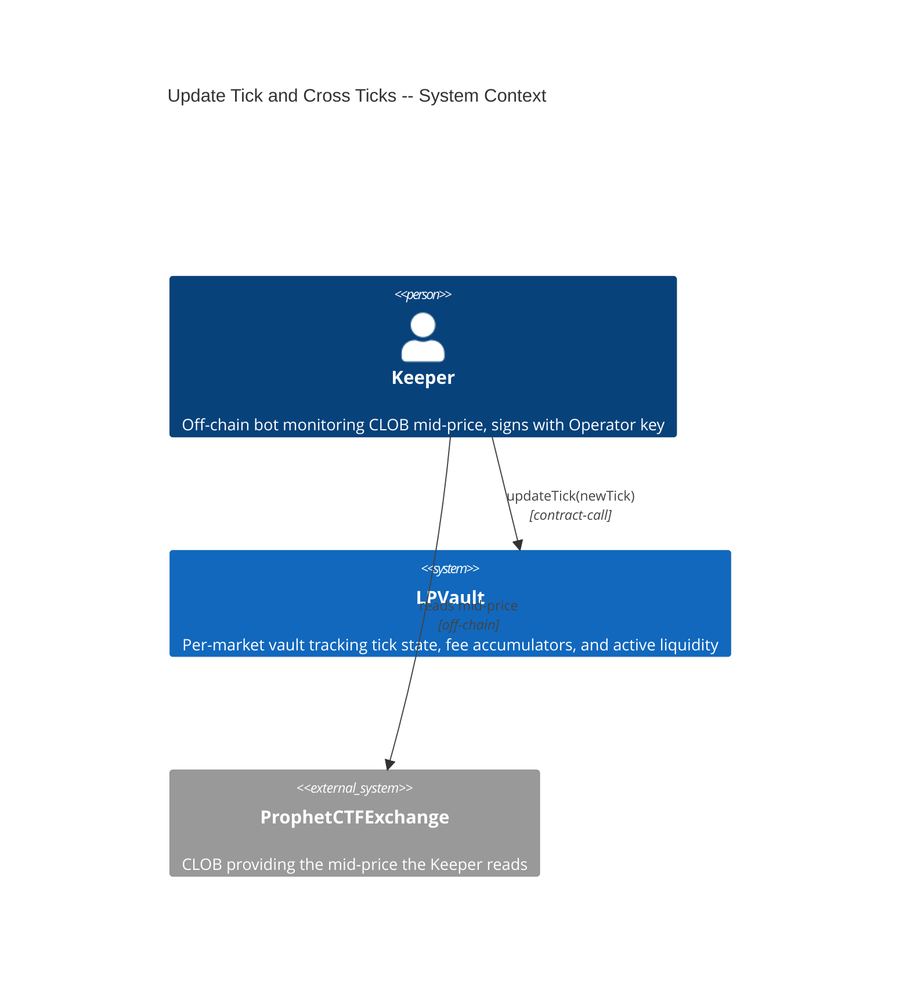
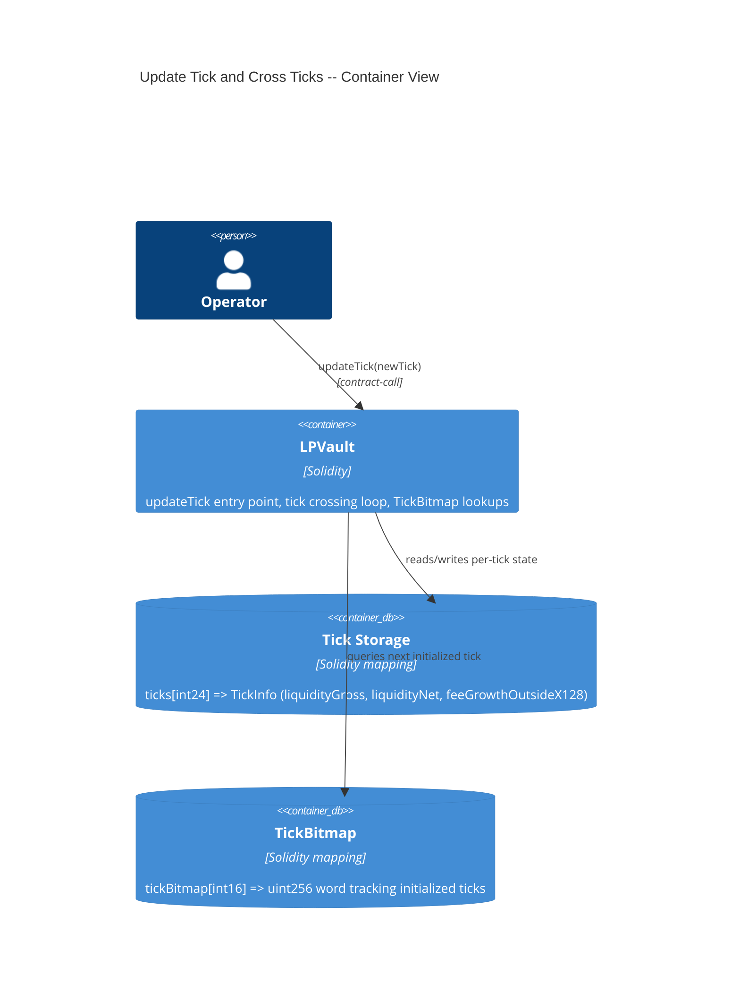
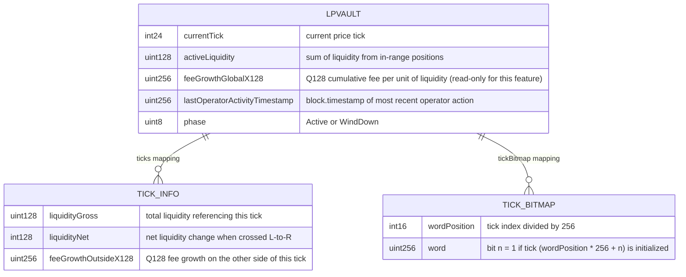

# Architecture: Update Tick and Cross Ticks

## System Context (C4 L1)

> Operator (Keeper) reports CLOB price changes to the vault, which adjusts its internal tick pointer and accounting state.

## Container View (C4 L2)

> updateTick mutates tick state and active liquidity within LPVault. No external calls or token transfers.

## Data Model

> State touched by updateTick. Tick and bitmap structures are initialized by mint (FEAT-T7AF) and deinitialized by burn.

**Invariants:**
- `activeLiquidity` after any updateTick equals the sum of `position.liquidity` for all positions where `tickLower <= currentTick < tickUpper`
- `feeGrowthOutsideX128` at a tick, combined with `feeGrowthGlobalX128`, must produce correct `feeGrowthInsideX128` for any position spanning that tick
- `currentTick` is updated atomically with all tick crossings — partial crossing state is never observable
- `lastOperatorActivityTimestamp` is monotonically non-decreasing
- The number of initialized ticks crossed in a single call never exceeds 256

## Component Inventory

| File | Role | Key Exports |
|------|------|-------------|
| `src/LPVault.sol` | Business logic | `updateTick(int24)`, `_crossTick(int24, bool)`, `_nextInitializedTick(int24, bool)`, `_setTickBitmapBit(int24)`, `_clearTickBitmapBit(int24)`, `tickBitmap`, `lastOperatorActivityTimestamp` |
| `src/LPVault.sol` | Existing (modified) | `_initializeTick(int24)` — gains `_setTickBitmapBit` call inside `liquidityGross == 0` branch |
| `test/features/FEAT-TVS0-update-tick-and-cross-ticks/UC-TVS1-update-current-tick/` | Test | Integration tests for all 7 scenarios |

## Event Topology

| Event | Publisher | Payload | Condition | Consumers |
|-------|-----------|---------|-----------|-----------|
| `TickUpdated(int24 oldTick, int24 newTick, uint256 ticksCrossed)` | `LPVault.updateTick` | `oldTick, newTick, ticksCrossed` | Every successful updateTick call | Off-chain indexer, Keeper |

**Non-events (explicit):**
- SC-TVS5, SC-TVS6, SC-TVS7, SC-TVS8: no event emitted (call reverts)

## API Surface

| Method | Path | Handler | Auth | Request Shape | Response Shape | Error Codes |
|--------|------|---------|------|---------------|----------------|-------------|
| contract-call | `LPVault.updateTick(int24 newTick)` | `updateTick` | `onlyOperator` | `newTick: int24` | `void` (emits TickUpdated event) | `NotOperator`, `VaultNotActive`, `SameTick`, `TooManyTicksCrossed` |

## Integration Points

| System | Protocol | Direction | Purpose |
|--------|----------|-----------|---------|
| ProphetCTFExchange | off-chain read | inbound | Keeper reads CLOB mid-price off-chain, then calls updateTick on-chain |

## Code Map

| Spec ID | Spec Name | Implementation Files |
|---------|-----------|---------------------|
| UC-TVS1 | Update Current Tick | `src/LPVault.sol:updateTick()` |
| SC-TVS2 | Price increases crossing initialized ticks | `src/LPVault.sol:updateTick()`, `src/LPVault.sol:_crossTick()`, `src/LPVault.sol:_nextInitializedTick()` |
| SC-TVS3 | Price decreases crossing initialized ticks | `src/LPVault.sol:updateTick()`, `src/LPVault.sol:_crossTick()`, `src/LPVault.sol:_nextInitializedTick()` |
| SC-TVS4 | No initialized ticks in range | `src/LPVault.sol:updateTick()`, `src/LPVault.sol:_nextInitializedTick()` |
| SC-TVS5 | Too many initialized ticks to cross | `src/LPVault.sol:updateTick()` |
| SC-TVS6 | Non-operator caller | `src/LPVault.sol:updateTick()` |
| SC-TVS7 | Same tick | `src/LPVault.sol:updateTick()` |
| SC-TVS8 | Vault not in Active phase | `src/LPVault.sol:updateTick()` |

## Architecture Decisions

**ADR-TVUV:** TickBitmap for O(1) initialized-tick lookup
In the context of iterating from currentTick to newTick, facing the risk that a naive linear scan over every tick in the range would make gas cost proportional to the tick gap (not the number of initialized ticks), we decided to use an inline TickBitmap structure (one uint256 word per 256 consecutive ticks, bit N set when tick N is initialized) to achieve O(1) per-word next-initialized-tick lookup, accepting the additional storage writes on tick initialization/deinitialization in mint and burn.

**ADR-TVUW:** 256 max initialized-tick crossings per call
In the context of large price moves that could cross hundreds of initialized ticks, facing the risk of gas griefing or block-limit exhaustion, we decided to cap initialized-tick crossings at 256 per updateTick call and revert with TooManyTicksCrossed if exceeded, forcing the Keeper to chunk into multiple calls, accepting the operational complexity of multi-call chunking for extreme price movements.
