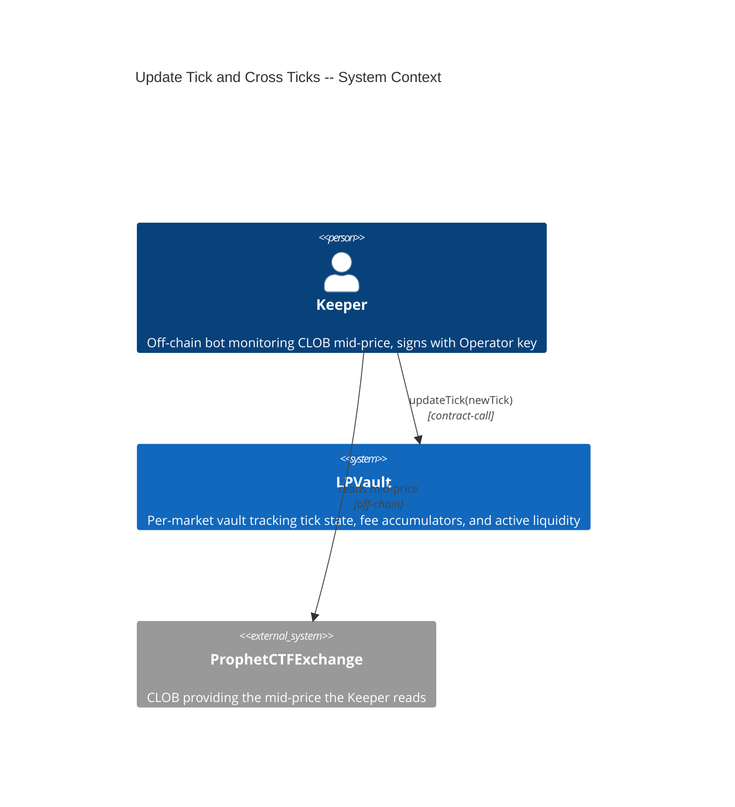
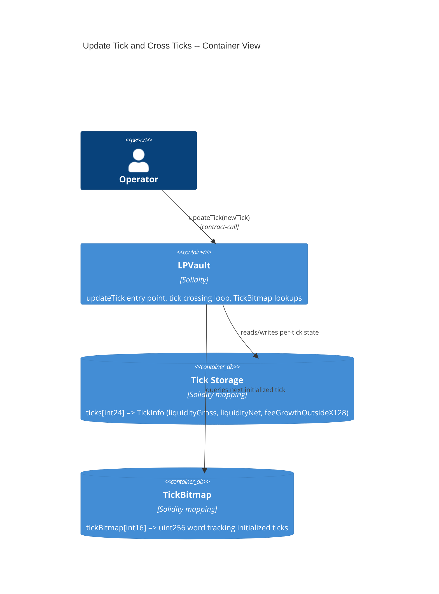
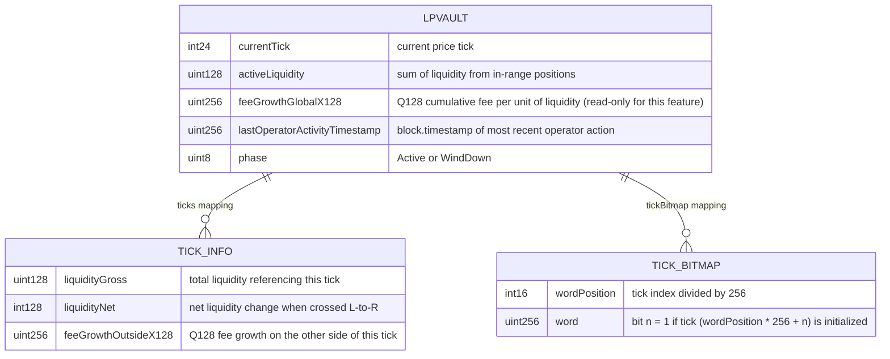

# Architecture: Update Tick and Cross Ticks

## System Context (C4 L1)

> Operator (Keeper) reports CLOB price changes to the vault, which adjusts its internal tick pointer and accounting state.

```mermaid
C4Context
    title Update Tick and Cross Ticks -- System Context
    Person(keeper, "Keeper", "Off-chain bot monitoring CLOB mid-price, signs with Operator key")
    System(vault, "LPVault", "Per-market vault tracking tick state, fee accumulators, and active liquidity")
    System_Ext(clob, "ProphetCTFExchange", "CLOB providing the mid-price the Keeper reads")
    Rel(keeper, vault, "updateTick(newTick)", "contract-call")
    Rel(keeper, clob, "reads mid-price", "off-chain")
```

## Container View (C4 L2)

> updateTick mutates tick state and active liquidity within LPVault. No external calls or token transfers.

```mermaid
C4Container
    title Update Tick and Cross Ticks -- Container View
    Person(operator, "Operator")
    Container(vault, "LPVault", "Solidity", "updateTick entry point, tick crossing loop, TickBitmap lookups")
    ContainerDb(tickState, "Tick Storage", "Solidity mapping", "ticks[int24] => TickInfo (liquidityGross, liquidityNet, feeGrowthOutsideX128)")
    ContainerDb(bitmap, "TickBitmap", "Solidity mapping", "tickBitmap[int16] => uint256 word tracking initialized ticks")
    Rel(operator, vault, "updateTick(newTick)", "contract-call")
    Rel(vault, tickState, "reads/writes per-tick state")
    Rel(vault, bitmap, "queries next initialized tick")
```

## Data Model

> State touched by updateTick. Tick and bitmap structures are initialized by mint (FEAT-T7AF) and deinitialized by burn.

```mermaid
erDiagram
    LPVAULT {
        int24 currentTick "current price tick"
        uint128 activeLiquidity "sum of liquidity from in-range positions"
        uint256 feeGrowthGlobalX128 "Q128 cumulative fee per unit of liquidity (read-only for this feature)"
        uint256 lastOperatorActivityTimestamp "block.timestamp of most recent operator action"
        uint8 phase "Active or WindDown"
    }
    TICK_INFO {
        uint128 liquidityGross "total liquidity referencing this tick"
        int128 liquidityNet "net liquidity change when crossed L-to-R"
        uint256 feeGrowthOutsideX128 "Q128 fee growth on the other side of this tick"
    }
    TICK_BITMAP {
        int16 wordPosition "tick index divided by 256"
        uint256 word "bit n = 1 if tick (wordPosition * 256 + n) is initialized"
    }
    LPVAULT ||--o{ TICK_INFO : "ticks mapping"
    LPVAULT ||--o{ TICK_BITMAP : "tickBitmap mapping"
```

**Invariants:**
- `activeLiquidity` after any updateTick equals the sum of `position.liquidity` for all positions where `tickLower <= currentTick < tickUpper`
- `feeGrowthOutsideX128` at a tick, combined with `feeGrowthGlobalX128`, must produce correct `feeGrowthInsideX128` for any position spanning that tick
- `currentTick` is updated atomically with all tick crossings — partial crossing state is never observable
- `lastOperatorActivityTimestamp` is monotonically non-decreasing
- The number of initialized ticks crossed in a single call never exceeds 256
- A tick's bitmap bit is set if and only if `ticks[t].liquidityGross > 0`; a burn that takes `liquidityGross` to zero clears the bit through `_clearTickBitmapBit` (FEAT-7G40 FR-7G4P, `invariant_zeroLiquidityTickHasNoBit` in `test/invariants/TickState.t.sol`)

## Component Inventory

| File | Role | Key Exports |
|------|------|-------------|
| `src/LPVault.sol` | Business logic | `updateTick(int24)`, `_crossTick(int24, bool)`, `_nextInitializedTick(int24 tick, bool searchRight, int24 targetTick)`, `_setTickBitmapBit(int24)`, `_clearTickBitmapBit(int24)`, `tickBitmap`, `lastOperatorActivityTimestamp` |
| `src/LPVault.sol` | Existing (modified) | `_initializeTick(int24)` — gains `_setTickBitmapBit` call inside `liquidityGross == 0` branch |
| `test/features/FEAT-TVS0-update-tick-and-cross-ticks/UC-TVS1-update-current-tick.t.sol` | Test | Integration tests for all 12 scenarios, and the fuzz tests of the bounded search (`BoundedTickSearchTestBase`, `BoundedTickSearchFuzzTest`) |
| `test/fixtures/VaultStorage.sol` | Test fixture | `setCurrentTick()` writes `currentTick` for a search test that starts inside an extreme bitmap word; it moves no liquidity |
| `test/invariants/TickState.t.sol` | Invariant test for the tick state machine | `TickStateHandler`, `invariant_activeLiquidityEqualsInRangeLiquidity`, `invariant_liquidityGrossEqualsReferencingLiquidity`, `invariant_updateTickRevertsOnlyForDocumentedReasons`, `invariant_zeroCrossingMoveGasStaysBounded` |

## Event Topology

| Event | Publisher | Payload | Condition | Consumers |
|-------|-----------|---------|-----------|-----------|
| `TickUpdated(int24 oldTick, int24 newTick, uint256 ticksCrossed)` | `LPVault.updateTick` | `oldTick, newTick, ticksCrossed` | Every successful updateTick call whose newTick differs from currentTick | Off-chain indexer, Keeper |

**Non-events (explicit):**
- SC-TVS5, SC-TVS6, SC-TVS8: no event emitted (call reverts)
- SC-TVS7: no event emitted (the call succeeds and only refreshes the heartbeat)

## API Surface

| Method | Path | Handler | Auth | Request Shape | Response Shape | Error Codes |
|--------|------|---------|------|---------------|----------------|-------------|
| contract-call | `LPVault.updateTick(int24 newTick)` | `updateTick` | `onlyOperator` | `newTick: int24` | `void` (emits TickUpdated when the tick changes; refreshes only the heartbeat when it does not) | `NotOperator`, `TradingIsPaused`, `VaultNotActive`, `TooManyTicksCrossed` |

## Integration Points

| System | Protocol | Direction | Purpose |
|--------|----------|-----------|---------|
| ProphetCTFExchange | off-chain read | inbound | Keeper reads CLOB mid-price off-chain, then calls updateTick on-chain |

## Code Map

| Spec ID | Spec Name | Implementation Files |
|---------|-----------|---------------------|
| UC-TVS1 | Update Current Tick | `src/LPVault.sol:updateTick()` |
| SC-TVS2 | Price increases crossing initialized ticks | `src/LPVault.sol:updateTick()`, `src/LPVault.sol:_crossTick()`, `src/LPVault.sol:_nextInitializedTick()` |
| SC-TVS3 | Price decreases crossing initialized ticks | `src/LPVault.sol:updateTick()`, `src/LPVault.sol:_crossTick()`, `src/LPVault.sol:_nextInitializedTick()` |
| SC-TVS4 | No initialized ticks in range | `src/LPVault.sol:updateTick()`, `src/LPVault.sol:_nextInitializedTick()` |
| SC-TVS5 | Too many initialized ticks to cross | `src/LPVault.sol:updateTick()` |
| SC-TVS6 | Non-operator caller | `src/LPVault.sol:updateTick()` |
| SC-TVS7 | Same tick refreshes only the heartbeat | `src/LPVault.sol:updateTick()`, `src/LPVault.sol:touchesHeartbeat` |
| SC-TVS8 | Vault not in Active phase | `src/LPVault.sol:updateTick()` |
| SC-5IDH | Initialized tick far above the target is never searched | `src/LPVault.sol:updateTick()`, `src/LPVault.sol:_nextInitializedTick()` |
| SC-5IDI | Initialized tick far below the target is never searched | `src/LPVault.sol:updateTick()`, `src/LPVault.sol:_nextInitializedTick()` |
| SC-5IDJ | Initialized tick inside the target's own word is still crossed | `src/LPVault.sol:updateTick()`, `src/LPVault.sol:_nextInitializedTick()`, `src/LPVault.sol:_crossTick()` |
| SC-5IDL | Target in the highest bitmap word with no initialized ticks | `src/LPVault.sol:updateTick()`, `src/LPVault.sol:_nextInitializedTick()` |
| SC-A2ZT | Start inside the lowest bitmap word with no initialized ticks | `src/LPVault.sol:updateTick()`, `src/LPVault.sol:_nextInitializedTick()` |

## Architecture Decisions

**ADR-TVUV:** TickBitmap for O(1) initialized-tick lookup
In the context of iterating from currentTick to newTick, facing the risk that a naive linear scan over every tick in the range would make gas cost proportional to the tick gap (not the number of initialized ticks), we decided to use an inline TickBitmap structure (one uint256 word per 256 consecutive ticks, bit N set when tick N is initialized) to achieve O(1) per-word next-initialized-tick lookup, accepting the additional storage writes on tick initialization/deinitialization in mint and burn.

**ADR-TVUW:** 256 max initialized-tick crossings per call
In the context of large price moves that could cross hundreds of initialized ticks, facing the risk of gas griefing or block-limit exhaustion, we decided to cap initialized-tick crossings at 256 per updateTick call and revert with TooManyTicksCrossed if exceeded, forcing the Keeper to chunk into multiple calls, accepting the operational complexity of multi-call chunking for extreme price movements.

**ADR-9J43:** An unchanged tick report refreshes the heartbeat and returns
In the context of the keeper reporting the tick every 60 seconds and after fills, on markets that mostly keep the same price, facing the fact that a `SameTick` revert cost about 23,600 gas, refreshed nothing, and forced a second `heartbeat()` transaction, we decided that `updateTick` with `newTick == currentTick` returns after the phase check with no crossing, no bitmap read, no event, and no storage write other than the heartbeat and the reentrancy guard toggle, which ends at its starting value, to achieve one report per interval at about 20,500 gas net against 15,600 for `heartbeat()`, accepting that the guards stay as modifiers, so the guard slot is written twice on the unchanged path and the report costs about 4,900 gas more than `heartbeat()`. The user decided this on 2026-09-11 (decision C11 in `audits/audit-fixes-ranged.md`), and it replaces the part of ADR-3XU3 in FEAT-JXQO that kept the revert. `notifyFees` keeps its `ZeroAmount` revert, because an income report of zero is a caller bug and not a normal case.

**ADR-5IDK:** Target-bounded next-initialized-tick search
In the context of the bitmap search that updateTick runs between currentTick and newTick, facing the risk that the crossing cap (ADR-TVUW) bounds only the number of ticks crossed and not the cost of scanning the empty words between them, so that an LP could sign a mint intent at an extreme tick and force a later legitimate updateTick to scan tens of thousands of empty words and exceed the block gas limit (76,618,321 gas for a move of 200 ticks, measured on 2026-09-12), we decided to pass the target tick into `_nextInitializedTick` as a third parameter, to stop both the upward and the downward scan at the bitmap word that contains the target, inclusive, and to make each loop test for the extreme word before it steps, in both directions, to achieve a scan cost that follows the Operator's reported move and a search that reports "not found" at both ends of the scale, accepting that the bound is only as tight as the Operator's reported newTick, which is already a trusted input under NFR-TVSM, so control of the scan cost moves from any third party to the one actor the vault already trusts, and that chunking of large jumps stays an operational practice and not an on-chain rule. The user chose this on 2026-09-11 (decision C13 in `audits/audit-fixes-ranged.md`) from the auditors' recommendation for issues 6.10 and 6.12. For any target inside `int24`, the target's word check already stops the loop at the extreme word, so the extreme-word test is defense in depth that the decision keeps on purpose: it costs one comparison per word and it holds even if a later caller passes a target the current caller cannot.

**Rejected alternative -- check the unchanged tick before the reentrancy guard:** it removes the guard's 2,300 gas net but gives one function a hand-written guard, which is a review cost that security outranks. It is Part 7 candidate 6 in `audits/audit-fixes-ranged.md`.

The fee-growth subtraction in this feature (the flip in `_crossTick()`) runs inside `unchecked` and never uses `_mulDiv`. See the fee-growth wraparound decision (ADR-8L1F) in FEAT-T7AF.
