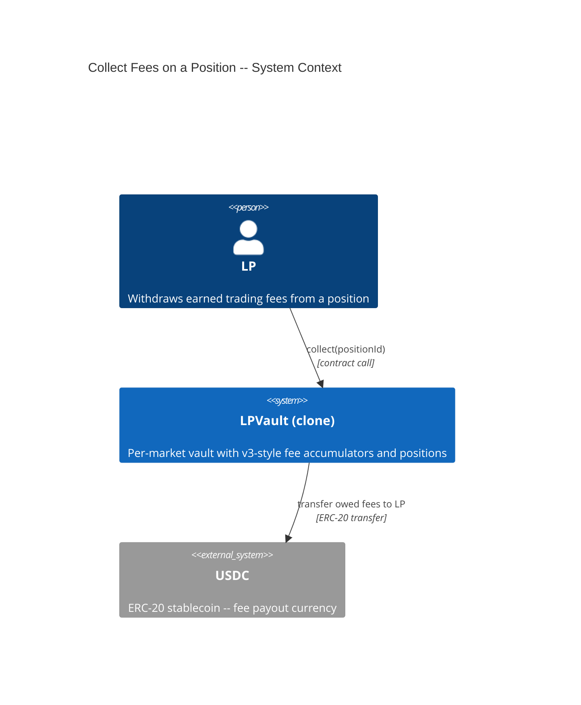
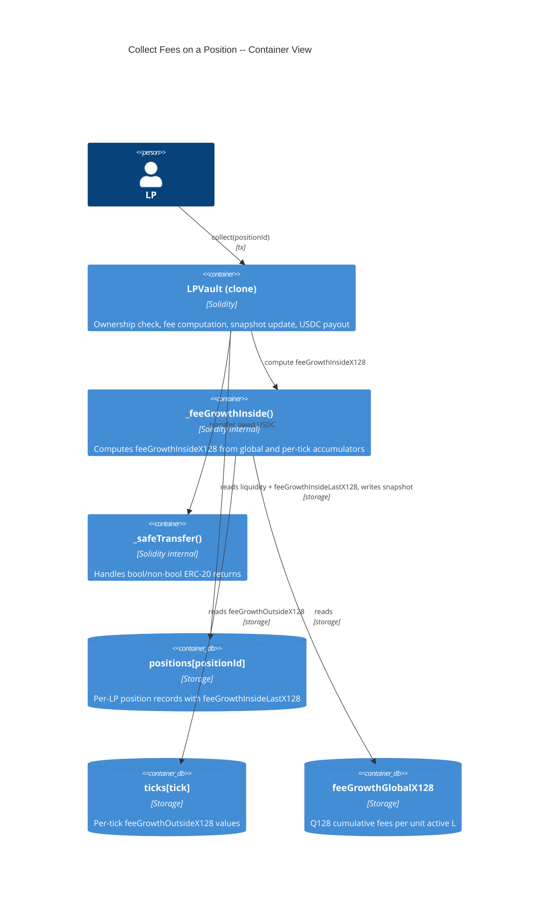
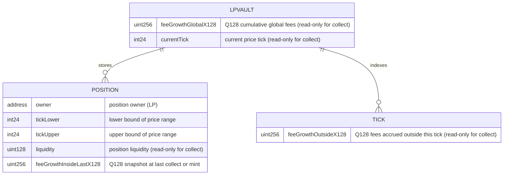

# Architecture: Collect Fees on a Position

## System Context (C4 L1)

> Who uses this feature and what external systems does it touch?

## Container View (C4 L2)

> Which major components are involved and how do they communicate?

## Data Model

> Entity schemas with field constraints and invariants.

**Invariants:**
- `feeGrowthInsideLastX128` is set to the current `feeGrowthInsideX128` after every collect -- no double-counting
- Owed fees for a position can never exceed the total fee revenue distributed since the position was minted
- `collect` does not modify `liquidity`, `tickLower`, `tickUpper`, or any tick state -- it is read-only on fee accumulators
- The sum of all positions' collected fees cannot exceed `feeGrowthGlobalX128 * activeLiquidity / Q128` (bounded by Q128 dust)

## Component Inventory

> Files that participate in this feature.

| File | Role | Key Exports |
|------|------|-------------|
| `src/LPVault.sol` | Per-market vault -- ownership check, fee computation, snapshot update, USDC payout | `collect()`, `_safeTransfer()` |
| `src/LPVault.sol` | Reused from FEAT-T7AF / FEAT-TOGR | `_computeFeeGrowthInside()`, `_mulDiv()` |

## Event Topology

> All events this feature emits or consumes.

| Event | Publisher | Payload | Condition | Consumers |
|-------|-----------|---------|-----------|-----------|
| `FeesCollected(uint256 positionId, address owner, uint256 amount)` | LPVault | `positionId, owner, amount` | On successful collect with nonzero owed | Off-chain Event Listener |

**Non-events (explicit):**
- Zero-fee collect (SC-U07C): no FeesCollected event emitted
- Failed collect (any revert scenario): no events emitted, no state changes

## API Surface

> Contract functions (entry points) belonging to this feature.

| Method | Path | Handler | Auth | Request Shape | Response Shape | Error Codes |
|--------|------|---------|------|---------------|----------------|-------------|
| call | `LPVault.collect(uint256)` | `collect` | position.owner == msg.sender | `positionId` | void | NotPositionOwner, PositionNotFound |

## Integration Points

> External services, event streams, and infrastructure dependencies.

| System | Protocol | Direction | Purpose |
|--------|----------|-----------|---------|
| USDC (ERC-20) | ERC-20 transfer | outbound | Fee payout to LP via inline _safeTransfer |

## Code Map

> Links spec IDs to implementation files.

| Spec ID | Spec Name | Implementation Files |
|---------|-----------|---------------------|
| UC-U07A | Collect Position Fees | `src/LPVault.sol:collect()` |
| SC-U07B | First collect with accrued fees | `src/LPVault.sol:collect()`, `src/LPVault.sol:_computeFeeGrowthInside()`, `src/LPVault.sol:_safeTransfer()` |
| SC-U07C | Zero fees owed | `src/LPVault.sol:collect()`, `src/LPVault.sol:_computeFeeGrowthInside()` |
| SC-U07D | Non-owner caller rejected | `src/LPVault.sol:collect()` |
| SC-U07E | Position not found | `src/LPVault.sol:collect()` |
| SC-U07F | Collect during wind-down | `src/LPVault.sol:collect()`, `src/LPVault.sol:_computeFeeGrowthInside()`, `src/LPVault.sol:_safeTransfer()` |
| SC-U07G | Second collect only pays new fees | `src/LPVault.sol:collect()`, `src/LPVault.sol:_computeFeeGrowthInside()`, `src/LPVault.sol:_safeTransfer()` |

## Architecture Decisions

> No non-obvious decisions for this feature -- collect follows the canonical Uniswap v3 fee collection pattern (compute feeGrowthInside, delta with snapshot, payout, update snapshot).

## Testing Decisions

| Service/Pattern | Decision | Reason |
|-----------------|----------|--------|
| USDC transfer | e2e with mock token | Deploy a minimal ERC-20 mock; LP receives USDC via _safeTransfer |
| Q128 truncation | fuzz | Fuzz collect with varying fee growth values to verify truncation correctness |
| feeGrowthInside accuracy | fuzz | Fuzz with varying tick positions and fee accumulator states to verify the v3 formula |
