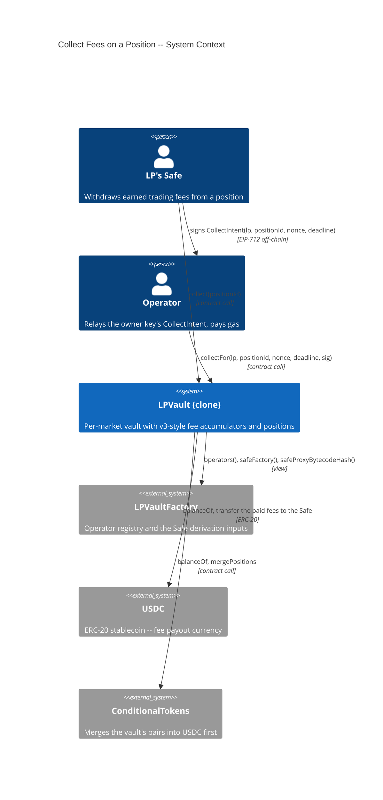
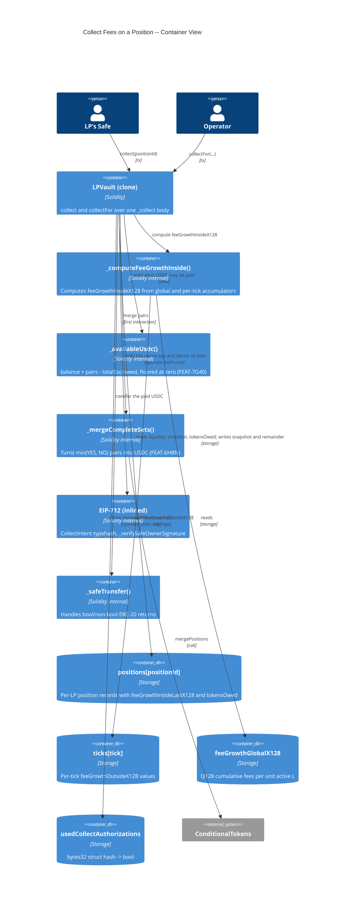
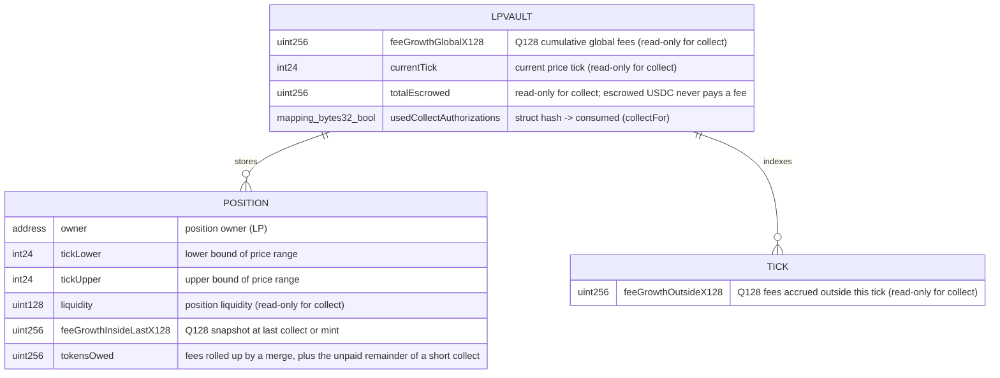

# Architecture: Collect Fees on a Position

## System Context (C4 L1)

> Who uses this feature and what external systems does it touch?

```mermaid
C4Context
    title Collect Fees on a Position -- System Context
    Person(lp, "LP's Safe", "Withdraws earned trading fees from a position")
    Person(operator, "Operator", "Relays the owner key's CollectIntent, pays gas")
    System(vault, "LPVault (clone)", "Per-market vault with v3-style fee accumulators and positions")
    System_Ext(factory, "LPVaultFactory", "Operator registry and the Safe derivation inputs")
    System_Ext(usdc, "USDC", "ERC-20 stablecoin -- fee payout currency")
    System_Ext(ctf, "ConditionalTokens", "Merges the vault's pairs into USDC first")
    Rel(lp, vault, "collect(positionId)", "contract call")
    Rel(lp, operator, "signs CollectIntent(lp, positionId, nonce, deadline)", "EIP-712 off-chain")
    Rel(operator, vault, "collectFor(lp, positionId, nonce, deadline, sig)", "contract call")
    Rel(vault, factory, "operators(), safeFactory(), safeProxyBytecodeHash()", "view")
    Rel(vault, ctf, "balanceOf, mergePositions", "contract call")
    Rel(vault, usdc, "balanceOf, transfer the paid fees to the Safe", "ERC-20")
```

## Container View (C4 L2)

> Which major components are involved and how do they communicate?

```mermaid
C4Container
    title Collect Fees on a Position -- Container View
    Person(lp, "LP's Safe")
    Person(operator, "Operator")
    Container(vault, "LPVault (clone)", "Solidity", "collect and collectFor over one _collect body")
    Container(feeInside, "_computeFeeGrowthInside()", "Solidity internal", "Computes feeGrowthInsideX128 from global and per-tick accumulators")
    Container(avail, "_availableUsdc()", "Solidity internal", "balance + pairs - totalEscrowed, floored at zero (FEAT-7G40)")
    Container(merge, "_mergeCompleteSets()", "Solidity internal", "Turns min(YES, NO) pairs into USDC (FEAT-6HBN)")
    Container(eip712, "EIP-712 (inlined)", "Solidity internal", "CollectIntent typehash, _verifySafeOwnerSignature")
    Container(safeTransfer, "_safeTransfer()", "Solidity internal", "Handles bool/non-bool ERC-20 returns")
    ContainerDb(positions, "positions[positionId]", "Storage", "Per-LP position records with feeGrowthInsideLastX128 and tokensOwed")
    ContainerDb(ticks, "ticks[tick]", "Storage", "Per-tick feeGrowthOutsideX128 values")
    ContainerDb(feeGlobal, "feeGrowthGlobalX128", "Storage", "Q128 cumulative fees per unit active L")
    ContainerDb(used, "usedCollectAuthorizations", "Storage", "bytes32 struct hash -> bool")
    System_Ext(ctf, "ConditionalTokens")
    Rel(lp, vault, "collect(positionId)", "tx")
    Rel(operator, vault, "collectFor(...)", "tx")
    Rel(vault, eip712, "verify the owner key and derive its Safe", "operator path only")
    Rel(vault, used, "check then set the struct hash", "operator path only")
    Rel(vault, feeInside, "compute feeGrowthInsideX128")
    Rel(feeInside, feeGlobal, "reads", "storage")
    Rel(feeInside, ticks, "reads feeGrowthOutsideX128", "storage")
    Rel(vault, avail, "read what USDC may be paid", "view")
    Rel(vault, positions, "reads liquidity, snapshot, tokensOwed; writes snapshot and remainder", "storage")
    Rel(vault, merge, "merge pairs", "first interaction")
    Rel(merge, ctf, "mergePositions", "call")
    Rel(vault, safeTransfer, "transfer the paid USDC")
```

## Data Model

> Entity schemas with field constraints and invariants.

```mermaid
erDiagram
    POSITION {
        address owner "position owner (LP)"
        int24 tickLower "lower bound of price range"
        int24 tickUpper "upper bound of price range"
        uint128 liquidity "position liquidity (read-only for collect)"
        uint256 feeGrowthInsideLastX128 "Q128 snapshot at last collect or mint"
        uint256 tokensOwed "fees rolled up by a merge, plus the unpaid remainder of a short collect"
    }
    TICK {
        uint256 feeGrowthOutsideX128 "Q128 fees accrued outside this tick (read-only for collect)"
    }
    LPVAULT {
        uint256 feeGrowthGlobalX128 "Q128 cumulative global fees (read-only for collect)"
        int24 currentTick "current price tick (read-only for collect)"
        uint256 totalEscrowed "read-only for collect; escrowed USDC never pays a fee"
        mapping_bytes32_bool usedCollectAuthorizations "struct hash -> consumed (collectFor)"
    }
    LPVAULT ||--o{ POSITION : "stores"
    LPVAULT ||--o{ TICK : "indexes"
```

**Invariants:**
- `feeGrowthInsideLastX128` is set to the current `feeGrowthInsideX128` after every collect -- no double-counting
- Owed fees for a position can never exceed the total fee revenue distributed since the position was minted
- `collect` does not modify `liquidity`, `tickLower`, `tickUpper`, or any tick state -- it is read-only on fee accumulators
- The sum of every position's claimable fees (a remainder in `tokensOwed` included) plus every fee paid by `collect` never exceeds the sum of amounts passed to `notifyFees`, with no slack, because every rounding on the path rounds down
- A collect pays at most `usdc.balanceOf(vault) + pairs − totalEscrowed`, never reverts on that comparison, and keeps the rest in `tokensOwed`
- Both collect paths pay the same amount for the same position; `collectFor` refreshes `lastOperatorActivityTimestamp`, `collect` never does
- A signature valid for one of `MintIntent`, `ReclaimIntent`, `BurnIntent`, or `CollectIntent` is rejected by the other three paths

## Component Inventory

> Files that participate in this feature.

| File | Role | Key Exports |
|------|------|-------------|
| `src/LPVault.sol` | Per-market vault -- the two collect entry points over one body | `collect()`, `collectFor()`, `_collect()`, `COLLECT_INTENT_TYPEHASH`, `usedCollectAuthorizations`, `_safeTransfer()` |
| `src/LPVault.sol` | Reused from FEAT-T7AF / FEAT-TOGR / FEAT-7G40 / FEAT-6HBN / FEAT-3ZRI | `_computeFeeGrowthInside()`, `_availableUsdc()`, `_tokenBalances()`, `_mergeCompleteSets()`, `_verifySafeOwnerSignature()` |
| `test/fixtures/LPVaultFixture.sol` | test fixture | `COLLECT_INTENT_TYPEHASH`, `_signCollectIntent(vault, pk, lp, positionId, nonce, deadline)` |
| `test/features/FEAT-U079-collect-fees-on-a-position/UC-U07A-collect-position-fees.t.sol` | Integration tests for the self-service path | Scenarios of UC-U07A |
| `test/features/FEAT-U079-collect-fees-on-a-position/UC-BMF8-operator-collect-fees-for-lp.t.sol` | Integration tests for the relayed path | Scenarios of UC-BMF8 |

## Event Topology

> All events this feature emits or consumes.

| Event | Publisher | Payload | Condition | Consumers |
|-------|-----------|---------|-----------|-----------|
| `FeesCollected(uint256 positionId, address owner, uint256 amount)` | LPVault | `positionId, owner, amountPaid` | On a successful collect or collectFor with a nonzero paid amount | Off-chain Event Listener |
| `CompleteSetsMerged(address caller, uint256 amount)` | LPVault (FEAT-6HBN) | `caller, amount` | A paying collect found `min(YES, NO) > 0`; emitted before `FeesCollected` | Off-chain Event Listener |

**Non-events (explicit):**
- Zero-fee collect (SC-U07C, SC-BMFD): no FeesCollected event emitted, no balance read, no merge
- A short collect that pays zero (SC-BMFF case B): no FeesCollected event, the remainder stays in `tokensOwed`
- Failed collect (any revert scenario): no events emitted, no state changes

## API Surface

> Contract functions (entry points) belonging to this feature.

| Method | Path | Handler | Auth | Request Shape | Response Shape | Error Codes |
|--------|------|---------|------|---------------|----------------|-------------|
| call | `LPVault.collect(uint256)` | `collect` | position.owner == msg.sender + nonReentrant; no phase or pause check | `positionId` | void | NotPositionOwner, PositionNotFound, TransferFailed, Reentrancy |
| call | `LPVault.collectFor(address,uint256,uint256,uint256,bytes)` | `collectFor` | onlyOperator + nonReentrant + touchesHeartbeat; owner-key signature over `CollectIntent` checked against the derived Safe | `lp, positionId, nonce, deadline, signature` | void | NotOperator, IntentExpired, InvalidSignature, IntentAlreadyUsed, PositionNotFound, NotPositionOwner, TransferFailed, Reentrancy |

## Integration Points

> External services, event streams, and infrastructure dependencies.

| System | Protocol | Direction | Purpose |
|--------|----------|-----------|---------|
| USDC (ERC-20) | `balanceOf`, `transfer` | outbound | Reads what the vault holds above escrow, then pays the fees to the Safe via inline _safeTransfer |
| ConditionalTokens (Gnosis CTF) | `balanceOf`, `mergePositions` | outbound | Merges the vault's pairs into USDC before a paying collect, reached from `_collect` |
| LPVaultFactory | `operators`, `safeFactory`, `safeProxyBytecodeHash` | outbound | The Operator gate and the Safe derivation on the relayed path |

## Code Map

> Links spec IDs to implementation files.

| Spec ID | Spec Name | Implementation Files |
|---------|-----------|---------------------|
| UC-U07A | Collect Position Fees | `src/LPVault.sol:collect()`, `src/LPVault.sol:_collect()` |
| SC-U07B | First collect with accrued fees | `src/LPVault.sol:collect()`, `src/LPVault.sol:_computeFeeGrowthInside()`, `src/LPVault.sol:_safeTransfer()` |
| SC-U07C | Zero fees owed | `src/LPVault.sol:collect()`, `src/LPVault.sol:_computeFeeGrowthInside()` |
| SC-U07D | Non-owner caller rejected | `src/LPVault.sol:collect()` |
| SC-U07E | Position not found | `src/LPVault.sol:collect()` |
| SC-U07F | Collect during wind-down | `src/LPVault.sol:collect()`, `src/LPVault.sol:_computeFeeGrowthInside()`, `src/LPVault.sol:_safeTransfer()` |
| SC-U07G | Second collect only pays new fees | `src/LPVault.sol:collect()`, `src/LPVault.sol:_computeFeeGrowthInside()`, `src/LPVault.sol:_safeTransfer()` |
| SC-8L1D | Immediate collect on a wrapped snapshot owes zero | `src/LPVault.sol:collect()`, `src/LPVault.sol:_computeFeeGrowthInside()` |
| SC-8L1E | Collect after the price re-enters the wrapped range pays growth since mint | `src/LPVault.sol:collect()`, `src/LPVault.sol:_computeFeeGrowthInside()`, `src/LPVault.sol:_safeTransfer()` |
| SC-BMFD | Collect in the Cancelled phase does not revert | `src/LPVault.sol:collect()` (no phase gate) |
| SC-BMFE | Collect merges the vault's pairs first | `src/LPVault.sol:_collect()`, `src/LPVault.sol:_mergeCompleteSets()` |
| SC-BMFF | Collect keeps its unpaid remainder | `src/LPVault.sol:_collect()`, `src/LPVault.sol:_availableUsdc()` |
| UC-BMF8 | Operator Collect Fees for LP | `src/LPVault.sol:collectFor()`, `src/LPVault.sol:_collect()` |
| SC-BMFG | Operator collect pays the LP its fees, never the caller | `src/LPVault.sol:collectFor()`, `src/LPVault.sol:_collect()` |
| SC-BMFH | A second collect with a new nonce pays only the new fees | `src/LPVault.sol:collectFor()`, `COLLECT_INTENT_TYPEHASH` |
| SC-BMFI | Revert when the nonce is replayed | `src/LPVault.sol:collectFor()` (used-authorization check) |
| SC-BMFJ | Revert when the deadline passed | `src/LPVault.sol:collectFor()` (deadline check) |
| SC-BMFK | Revert when the signature does not derive lp | `src/LPVault.sol:_verifySafeOwnerSignature()`, `src/LPVault.sol:_recoverSigner()` |
| SC-BMFL | Revert when lp is not the owner | `src/LPVault.sol:collectFor()` (owner check) |
| SC-BMFM | Revert on a non-Operator caller | `src/LPVault.sol:collectFor()`, `src/LPVault.sol:onlyOperator` |
| SC-BMG6 | Revert when a mint, reclaim, or burn authorization is reused as a collect | `src/LPVault.sol:_verifySafeOwnerSignature()`, `COLLECT_INTENT_TYPEHASH` |

## Architecture Decisions

Collect follows the Uniswap v3 fee collection pattern (compute feeGrowthInside, delta with snapshot, payout, update snapshot). The `owed` delta in `_collect()` runs inside `unchecked` and never uses `_mulDiv`. See the fee-growth wraparound decision (ADR-8L1F) in FEAT-T7AF, which owns `_computeFeeGrowthInside()`. The pay-what-is-there rule and the remainder come from decision O2 (ADR-BMF6 in FEAT-7G40); the merge before every payout from decision C26 (ADR-7G5F in FEAT-7G40 and ADR-6HCM in FEAT-6HBN); the separate replay record keyed by the struct hash, with a nonce because a collect repeats, from ADR-85DM in FEAT-7G40; and the phase rule from decision C9.

## Testing Decisions

| Service/Pattern | Decision | Reason |
|-----------------|----------|--------|
| USDC transfer | e2e with mock token | Deploy a minimal ERC-20 mock; LP receives USDC via _safeTransfer |
| Q128 truncation | fuzz | Fuzz collect with varying fee growth values to verify truncation correctness |
| feeGrowthInside accuracy | fuzz | Fuzz with varying tick positions and fee accumulator states to verify the v3 formula |
| ConditionalTokens (ERC-1155) | e2e | The real Gnosis bytecode through `test/fixtures/ConditionalTokensFixture.sol`, because a paying collect merges through it |
| EIP-712 signatures | e2e | `vm.sign()` produces real signatures; the fixture signs all four types to prove they are mutually non-interchangeable |
| The Cancelled phase | e2e | A real `emergencyCancelAll` after the timelock, because the collect must see the zeroed position the cancel leaves at this step |
